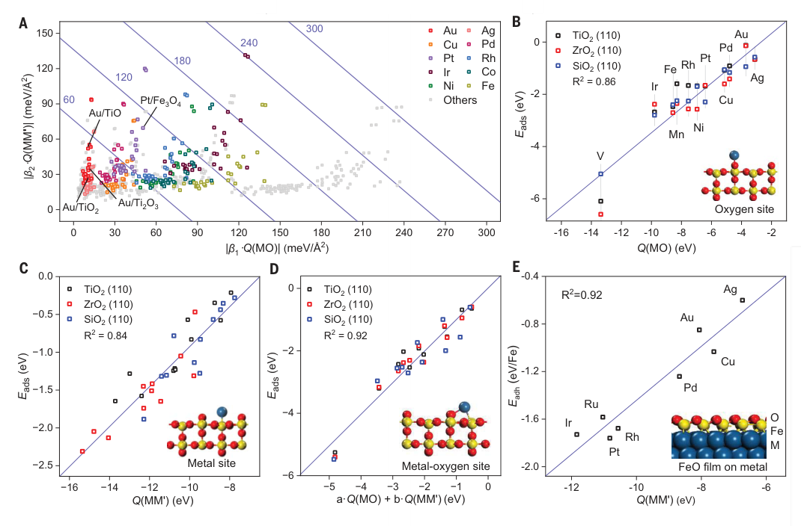
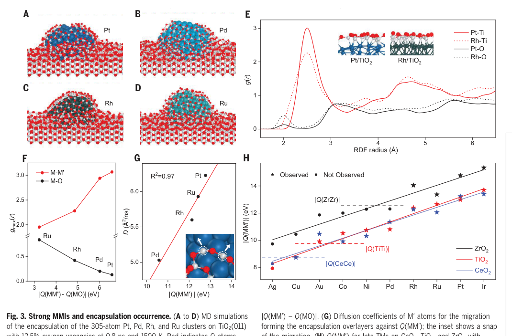

# Nature of metal-support interaction for metal catalysts on oxide supports

**Zotero key:** FPFCDLGA  
**Journal:** Science  
**DOI:** 10.1126/science.adp6034  
**Task date:** 2026-06-05  
**Source PDF:** paper.pdf

## Why This Paper / 为什么选这篇

**English:** This paper scores high on both journal quality and transferable learning value. It is not just another supported-catalyst case study. It tries to turn a notoriously messy catalysis concept, MSI/SMSI, into a compact predictive theory. It also rotates cleanly away from the previous two days: after a Nature materials-generation paper and an ACS Catalysis MLP perspective, today shifts to a Science mechanism-and-interface paper centered on oxide supports, encapsulation, and interpretable theory.

**中文：** 这篇文章同时满足“期刊质量高”和“可迁移学习价值强”两个标准。它不是又一篇单体系催化性能文章，而是在尝试把 MSI/SMSI 这种长期复杂、容易碎片化理解的概念，压缩成一套可预测、可解释的界面理论。轮换上也很合适：前两天分别是 `Nature` 的材料生成和 `ACS Catalysis` 的 MLP 方法 Perspective，今天换成 `Science` 上以氧化物载体、包覆机制和可解释理论为核心的界面论文，主题与期刊家族都发生了明显变化。

## Reading Guide / 读前导读

**English:** Read this paper in three passes. First, isolate the two descriptors `Q(MO)` and `Q(MM')` and understand what physical affinities they encode. Second, track how the authors extend the same theory from nanoparticle adhesion to atom adsorption and then to oxide-film interfaces. Third, read Fig. 3 and Eq. 3 as the practical takeaway: encapsulation is governed by relative metal-metal affinity, not by vague intuition about “stronger support interaction”.

**中文：** 建议分三遍读。第一遍只抓住两个描述符 `Q(MO)` 和 `Q(MM')`，搞清它们分别编码了什么物理亲和。第二遍看作者如何把同一套理论从纳米颗粒黏附推广到单原子吸附，再推广到氧化物薄膜/金属界面。第三遍重点看图 3 和包覆判据：这篇文章最可带走的结论是，包覆是否发生取决于相对金属-金属亲和，而不是模糊地说“载体作用更强了”。

## Terminology / 术语表

| English | 中文 | Reading note |
| --- | --- | --- |
| metal-support interaction, MSI | 金属-载体相互作用 | 支撑金属催化剂界面稳定性、形貌、电子结构和包覆行为的核心概念。 |
| strong metal-support interaction, SMSI | 强金属-载体相互作用 | 经典上常指高温还原后亚氧化物覆盖金属纳米颗粒等现象。 |
| metal-oxygen interaction, MOI | 金属-氧相互作用 | 界面处金属与氧原子成键贡献，主导很多体系的整体黏附强度。 |
| metal-metal interaction, MMI | 金属-金属相互作用 | 界面处支撑金属与氧化物中金属原子之间的成键/亲和贡献。 |
| adhesion energy, Eadh | 黏附能 | 本文量化 MSI 的关键物理量，用湿润实验文献数据训练与验证。 |
| oxophilicity, Q(MO) | 亲氧性描述符 | 表示支撑金属对氧的亲和程度。 |
| M' affinity, Q(MM') | 对载体金属的亲和描述符 | 表示支撑金属对氧化物中金属元素 M' 的亲和程度。 |
| SISSO | 可解释符号回归方法 | 用于从大量候选物理量中筛出简单、可解释且泛化好的公式。 |
| encapsulation | 包覆/包封 | 亚氧化物层迁移覆盖金属纳米颗粒，是经典 SMSI 现象之一。 |

## Reading Hints / 阅读提示

**English:** Treat this paper as a theory-building paper, not as a catalog of oxide supports. The real value is the decomposition `overall MSI = MOI term + MMI term + residual term`, and the way this decomposition reorganizes how you think about support effects.

**中文：** 不要把它读成“各种氧化物支持体现象汇编”，而要读成一篇理论建模论文。真正的价值在于作者把 `整体 MSI = MOI 项 + MMI 项 + 余项` 这件事讲清楚，并借此重组了你理解载体效应的方式。

## Page And Section Index

- [Metadata And Abstract](#S001)
- [Introduction](#S003)
- [Interpretable Model](#S004)
- [Descriptors And Physical Meaning](#S005)
- [Implications For Stability And Support Effects](#S006)
- [Adsorbed Atoms And Oxide Films](#S007)
- [Encapsulation Mechanism](#S008)
- [Encapsulation Fingerprints And Kinetics](#S009)
- [Criterion For Encapsulation](#S010)
- [Conclusion And Notes](#S011)
- [Related Reading](#related-reading)

## Bilingual Reader

## Metadata And Abstract

**Source:** p.1 S001

**Original:** Nature of metal-support interaction for metal catalysts on oxide supports. Tairan Wang, Jianyu Hu, Runhai Ouyang, Yutao Wang, Yi Huang, Sulei Hu, and Wei-Xue Li. Science 386, 915-920 (2024), published 22 November 2024.

**中文:** 题目为《氧化物载体上金属催化剂中金属-载体相互作用的本质》。作者为 Tairan Wang、Jianyu Hu、Runhai Ouyang、Yutao Wang、Yi Huang、Sulei Hu 和 Wei-Xue Li，发表于 Science 2024 年第 386 卷 915-920 页，2024 年 11 月 22 日上线。

**Source:** p.1 S002

**Original:** The metal-support interaction is one of the most important pillars in heterogeneous catalysis, but developing a fundamental theory has been challenging because of the intricate interfaces. Based on experimental data, interpretable machine learning, theoretical derivation, and first-principles simulations, we established a general theory of metal-oxide interactions grounded in metal-metal and metal-oxygen interactions. The theory applies to metal nanoparticles and atoms on oxide supports and oxide films on metal supports. We found that for late-transition metal catalysts, metal-metal interactions dominated the oxide support effects and suboxide encapsulation over metal nanoparticles. A principle of strong metal-metal interactions for encapsulation occurrence is formulated and substantiated by extensive experiments including 10 metals and 16 oxides.

**中文:** 摘要的核心信息很清楚：金属-载体相互作用是多相催化最关键的支柱之一，但界面太复杂，长期缺少统一理论。作者把实验数据、可解释机器学习、理论推导和第一性原理模拟结合起来，建立了一个以金属-金属相互作用和金属-氧相互作用为基础的金属-氧化物界面理论。这个理论既适用于氧化物负载的金属纳米颗粒/单原子，也适用于金属负载的氧化物薄膜。文章最重要的结论之一是：对于晚过渡金属催化剂，真正支配载体效应和亚氧化物包覆行为的往往不是“亲氧性更强”，而是更强的金属-金属相互作用。

## Introduction

**Source:** p.1 S003

**Original:** Oxide-supported transition metal catalysts are essential for petrochemical refining and industrial chemical manufacturing, as well as for environmental control systems such as exhaust catalysts. Metal-reactant interactions determine activity and selectivity, whereas metal-support interactions help stabilize dispersed catalysts and affect charge transfer, chemical composition, perimeter sites, particle morphology, and suboxide encapsulation. Although many descriptors have been proposed, developing a comprehensive theory of MSIs for metal catalysts on oxide supports remains a major challenge in heterogeneous catalysis.

**中文:** 引言先把问题落到催化语境里：氧化物负载过渡金属催化剂广泛服务于炼油、化工制造和尾气净化。金属-反应物相互作用决定活性和选择性，而金属-载体相互作用则影响颗粒稳定性、电荷转移、界面组成、周边位点、粒子形貌以及亚氧化物包覆等一系列界面过程。虽然过去已经提出过不少经验描述符，但要把这些现象统一到一个能够跨体系工作的 MSI 理论里，仍然是多相催化中的难题。

## Interpretable Model

**Source:** p.1-2 S004

**Original:** We used the sure independence screening and sparsifying operator (SISSO) to determine the functional form of MSIs. Adhesion energies between metal nanoparticles and oxide supports were compiled from reported experimental values covering 178 metal-oxide interfaces across 25 metals and 27 oxides. More than 30 billion mathematical expressions were explored from 14 distilled primary features, and an optimal two-dimensional model was identified. The developed model exhibited excellent performance on the test dataset with a root mean square error of 14 meV/A^2, comparable to experimental uncertainty and better than neural network models and previous descriptors.

**中文:** 方法上，作者没有直接上黑盒模型，而是用了 SISSO 这类可解释符号回归，从文献中整理的 178 个金属-氧化物界面黏附能数据出发，覆盖 25 种金属和 27 种氧化物。经过特征筛选后，他们在 14 个核心物理量上搜索了 300 多亿个数学表达式，最后得到一个二维、可解释的最优公式。这个公式在测试集上的均方根误差只有 14 meV/Ų，已经接近实验不确定度，并且优于神经网络模型和过去的经验描述符。

## Descriptors And Physical Meaning

**Source:** p.2 S005

**Original:** The obtained MSI model is composed of the MOI and MMI terms: Eadh = b1 * Q(MO) + b2 * Q(MM') + b0. Q(MO) reflects the oxygen affinity of the supported metal M, and Q(MM') reflects the affinity of metal M for the metal element M' in the oxide. For late transition metals, the magnitude of Q(MO) becomes relatively small, whereas Q(MM') can become considerably strong, indicating that MMIs may play a significant role in the corresponding MSIs. Explicit description of MSIs recovers the missing adhesion-energy map and reveals strong support effects for late transition metals.

**中文:** 模型的结构也非常干净：黏附能被写成 MOI 项和 MMI 项的线性组合，即 Eadh = b1·Q(MO) + b2·Q(MM') + b0。这里 Q(MO) 表示支撑金属对氧的亲和程度，Q(MM') 表示支撑金属对载体金属元素 M' 的亲和程度。作者指出，对晚过渡金属来说，亲氧性项往往没有那么强，但对载体金属的亲和可能非常强，这就意味着许多“载体效应”本质上是由金属-金属相互作用主导的。这个解释不仅把原先稀疏的实验黏附能图谱补全了，也把晚过渡金属对不同氧化物支持体为何差别巨大说清楚了。

### Fig. 1. Formulation of the MSI model

**Placed near:** p.2 S005  
**Source:** p.2 F001

**Original caption:** Fig. 1. Formulation of the MSI model. (A) A derivable formula was identified through interpretable machine learning. (B) Collected experimental adhesion energies of metal-support systems from the literature. (C) Pearson correlations between the selected 14 primary features. (D) The descriptors Q(MO) and Q(MM'). (E) Recovered adhesion-energy map. (F) Predicted contact angles of all 675 metal-oxide interfaces.

**中文图注:** 图 1 展示 MSI 模型的建立过程：先通过可解释机器学习得到可推导公式，再整理实验黏附能数据、筛选 14 个核心特征，构造 Q(MO) 与 Q(MM') 两个描述符，最终补全黏附能图谱并预测 675 个金属-氧化物界面的接触角。

**Reading note:** 这张图的重点不是每个点位本身，而是作者把“实验黏附能”压缩成两个物理上可解释的描述符空间，从而把支持体效应写成可推导的界面规律。

## Implications For Stability And Support Effects

**Source:** p.3 S006

**Original:** The full recovery of adhesion energies makes it possible to predict the contact angle and thus the stability of oxide-supported metal nanoparticles against thermal sintering. When MSI is neither too strong nor too weak and has an optimum contact angle of about 90 degrees, maximum thermal stability can be approached. Integration of MOIs and MMIs enabled us to disentangle their contributions to the overall MSIs. In most metal-oxide combinations the MOI term is greater, but the MMI term distinguishes the support effect for a given late transition metal catalyst on different oxides.

**中文:** 把黏附能图谱补全之后，作者进一步把它连到接触角和抗烧结稳定性上：当 MSI 不过强也不过弱、对应接触角接近 90° 时，热稳定性最好。更重要的是，把 MOI 和 MMI 分开以后，可以看到二者扮演的是不同角色。MOI 在很多体系里决定了整体黏附强弱的基线，但对于固定的晚过渡金属而言，真正区分“换一个氧化物载体之后为什么表现不同”的，是 MMI 这一项，也就是对载体金属元素的亲和差异。

## Adsorbed Atoms And Oxide Films

**Source:** p.3-4 S007

**Original:** For Au nanoparticles on TiO2, Ti2O3, and TiO sharing the same absolute Q(MM'), a gradual decrease in the oxide formation enthalpy strengthens adhesion from 13 to 30 to 49 meV/A^2. DFT calculations further show that when a metal atom adsorbs only on oxygen sites, adsorption energy scales with Q(MO); when it adsorbs only on metal sites, adsorption energy scales with Q(MM'); and when both participate, adsorption energy becomes a linear combination of the two. The MSI theory can also be extended to metal-supported oxide films such as FeO(111) bilayers on late transition metals, where stronger M' affinity leads to stronger adhesion.

**中文:** 作者用几个层层推进的例子说明这套理论不仅能解释颗粒黏附，还能解释更微观的界面成键。比如 Au 负载在 TiO2、Ti2O3 和 TiO 上时，在 Q(MM') 绝对值相同的前提下，只因为氧化态降低、载体金属更容易与 Au 形成相互作用，黏附能就会显著增强。DFT 结果也给出了一条很直观的规则：如果吸附原子只跟氧成键，吸附能主要跟 Q(MO) 走；只跟载体金属成键，就跟 Q(MM') 走；如果两者都参与，则是二者的线性组合。这个逻辑还能推广到 FeO(111) 双层膜负载在晚过渡金属上的模型体系，仍然是对载体金属更强的亲和对应更强的界面黏附。

### Fig. 2. Nature of the MSIs in different interfacial systems

**Placed near:** p.3-4 S007  
**Source:** p.3 F002

**Original caption:** Fig. 2. Nature of the MSIs and applications in different interfacial systems. The figure maps metal-oxide systems in the Q(MO)-Q(MM') space and shows how adsorption energies on oxygen-only, metal-only, or mixed bridge sites scale with the corresponding descriptors. It also extends the theory to FeO(111) films on late transition metals.

**中文图注:** 图 2 把 MSI 的物理本质进一步展开：不同金属-氧化物体系在 Q(MO)-Q(MM') 空间中的位置，对应不同强度的界面相互作用；而金属原子只与氧成键、只与载体金属成键、或同时与二者成键时，吸附能分别对应不同的线性关系。作者还把这套理论推广到了 FeO(111) 薄膜/金属模型体系。

**Reading note:** 如果你想把这篇文章真正变成自己的方法判断工具，图 2 比图 1 更关键，因为它直接告诉你：不同界面位点到底该由哪类描述符主导。

## Encapsulation Mechanism

**Source:** p.4 S008

**Original:** The nature of classic SMSI and encapsulation can be explained with the above MSI theory. Molecular dynamics simulations were used to investigate rutile TiO2(011)-supported 305-atom Pt, Pd, Rh, and Ru clusters under elevated temperatures with 12.5% oxygen vacancies to mimic reduction conditions. For Pt, Pd, Rh, and Ru, all with strong M' affinity and |Q(MM')| greater than 10.8 eV, migration of TiO2-x suboxide onto the metal nanoparticles was observed during 0.8-ns simulations, forming encapsulation overlayers. Cu and Ag were used as counterexamples and did not show such migration.

**中文:** 文章最有说服力的部分之一，是把经典 SMSI 的“包覆”现象也纳入同一套理论。作者做了高温 MD，研究 TiO2(011) 负载的 305 原子 Pt、Pd、Rh、Ru 团簇，并通过引入 12.5% 氧空位来模拟还原条件。结果显示，对 Pt、Pd、Rh、Ru 这些具有较强 M' 亲和、|Q(MM')| 大于 10.8 eV 的体系，TiO2-x 亚氧化物会在 0.8 ns 时间尺度上迁移到金属颗粒表面，形成包覆层；而 Cu 和 Ag 则不会发生这种迁移。这一步把“是否会包覆”从经验观察推进到了可预测机制。

### Fig. 3. Strong MMIs and encapsulation occurrence

**Placed near:** p.4-5 S008  
**Source:** p.4 F003

**Original caption:** Fig. 3. Strong MMIs and encapsulation occurrence. The figure shows MD simulations of Pt, Pd, Rh, and Ru clusters on TiO2(011) with oxygen vacancies, RDF fingerprints of encapsulation, diffusion coefficients of migrating support-metal atoms, and the criterion comparing Q(MM') with the self-affinity of the oxide metal.

**中文图注:** 图 3 是全文最关键的机制图：它展示了 TiO2(011) 负载 Pt、Pd、Rh、Ru 团簇时的 MD 包覆过程，给出包覆前后 RDF 指纹、迁移原子的扩散系数，以及用 Q(MM') 与载体金属自身亲和比较来判断包覆是否发生的判据。

**Reading note:** 这张图把“包覆是经验现象”变成了“包覆可由相对 MMI 强度预测”的论证闭环，是全文最值得反复读的一张图。

## Encapsulation Fingerprints And Kinetics

**Source:** p.5 S009

**Original:** For Pt and Pd nanoparticles, the encapsulation layer was a single Ti-suboxide overlayer, with Ti:O ratios consistent with experiments. The peak intensity of M-M' bonds increased substantially and became stronger than that of M-O bonds after annealing, serving as a fingerprint of encapsulation occurrence. The diffusion coefficients of M' atoms controlling migration of the suboxide overlayers were found to depend linearly on M' affinity. Therefore, the M' affinity of the supported metal determines not only the M-M' bond population across the encapsulation interfaces, but also the encapsulation kinetics.

**中文:** 更进一步，作者不仅说明了“会不会包覆”，还说明了“包覆以后界面长什么样、快慢由什么决定”。对 Pt 和 Pd 来说，模拟得到的是单层 Ti 亚氧化物包覆层，Ti:O 比与实验吻合。退火后径向分布函数里 M-M' 峰增强并超过 M-O 峰，这被作者视作包覆发生的一个结构指纹。与此同时，主导亚氧化物流动迁移的 M' 原子扩散系数与 M' 亲和呈线性关系，说明决定包覆动力学快慢的，也主要是金属-金属相互作用，而不是简单的亲氧性。

## Criterion For Encapsulation

**Source:** p.5 S010

**Original:** Strong M' affinity alone is not sufficient. For encapsulation to occur, the relative strength is more essential, requiring the M' affinity of supported metal M to be stronger than that of M' in the oxide support. Based on the definition of Q, the criterion can be reformulated as DeltaHf(MM') + DeltaHsub(M') - DeltaHsub(M) < 0. To substantiate the criterion, the authors examined 10 late transition metals on 16 distinct oxide supports. All experimentally reported encapsulation systems satisfied the proposed criterion, whereas Ag lacked intrinsic driving force and Pd, Ni, Co, Au, and Cu showed oxide-dependent behavior.

**中文:** 本文真正给出的工程化结论，不是“MMI 越强越好”这么简单，而是一个相对强度判据：支撑金属 M 对载体金属元素 M' 的亲和，必须强于载体中 M' 对其自身的亲和，包覆才有内在驱动力。按 Q 的定义，这个条件可改写为一个更直接的热力学判据：ΔHf(MM') + ΔHsub(M') - ΔHsub(M) < 0。作者随后用 10 种晚过渡金属和 16 种氧化物做了系统核验，几乎所有实验上已知的包覆体系都满足这一条件；而 Ag 缺少内在驱动力，Pd、Ni、Co、Au、Cu 则表现出明显的载体依赖性。

## Conclusion And Notes

**Source:** p.5-6 S011

**Original:** The developed MSI theory offers a constructive guideline to engineer interfaces between metals and supports for the design of more efficient catalysts. Data and materials needed to evaluate the conclusions are available in the main text, supplementary materials, or Zenodo. A correction issued on 13 December 2024 states that the coefficients c1 and c2 reported on page 916 were affected by a unit-conversion error; the correct values are c1 = 9.85 x 10^-2/eV and c2 = -3.06 x 10^-3/A^2.

**中文:** 总结来说，这篇文章把 MSI 从“很多体系都有、但难以统一理解的现象”推进成了一套可以落到界面设计上的原则：先分清 MOI 负责什么、MMI 负责什么，再用相对强度判断包覆是否会发生。作者也把支撑结论所需的数据放在正文、补充材料和 Zenodo 中，方便复核。需要注意的是，这篇 Science 论文在 2024 年 12 月 13 日发布过勘误：第 916 页中 c1 与 c2 的数值原先因单位换算出错而写错，正确值分别是 c1 = 9.85 × 10^-2/eV 与 c2 = -3.06 × 10^-3/Ų。阅读时应以更正后的数值为准。

## Related Reading / 相关必读

**English:** No strongly recommended related paper today. See `related_reading.md` for the rationale.

**中文：** 今日不强行推荐相关必读文献。理由见 `related_reading.md`。

## Critical Reading Notes / 批判性阅读提示

- The strongest contribution is not the fitted formula itself, but the separation of overall support effects into MOI-dominated and MMI-dominated regimes.
- 最值得带走的不是公式字面形式，而是作者把“整体载体效应”拆成 MOI 主导区和 MMI 主导区的思维方式。
- For late transition metals, support choice is often a question of how strongly the catalyst metal wants to bond with the cationic part of the oxide, not only with oxygen.
- 对晚过渡金属来说，换载体时真正要问的常常是“它有多愿意和载体中的金属元素成键”，而不只是“它有多亲氧”。
- The encapsulation criterion is especially actionable for catalyst design because it turns a post hoc observation into a pre-screening rule.
- 包覆判据的价值在于把事后观察变成了事前筛选规则，这对做计算筛选或界面设计尤其有用。
