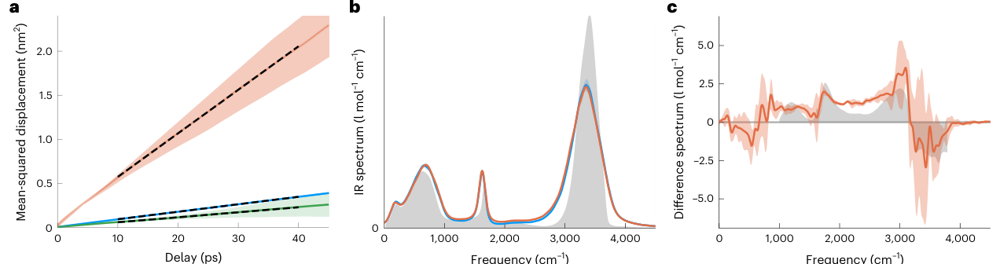
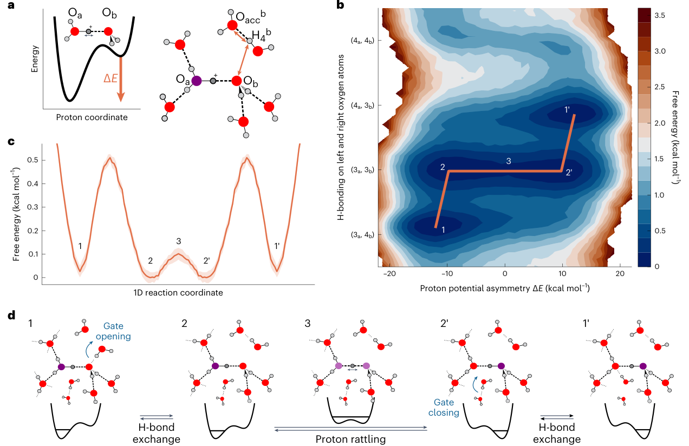
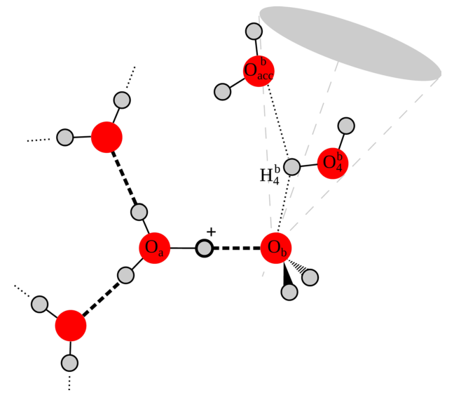
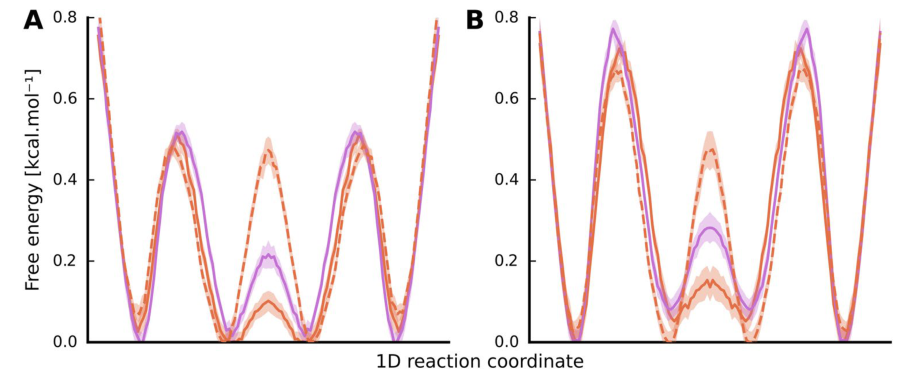
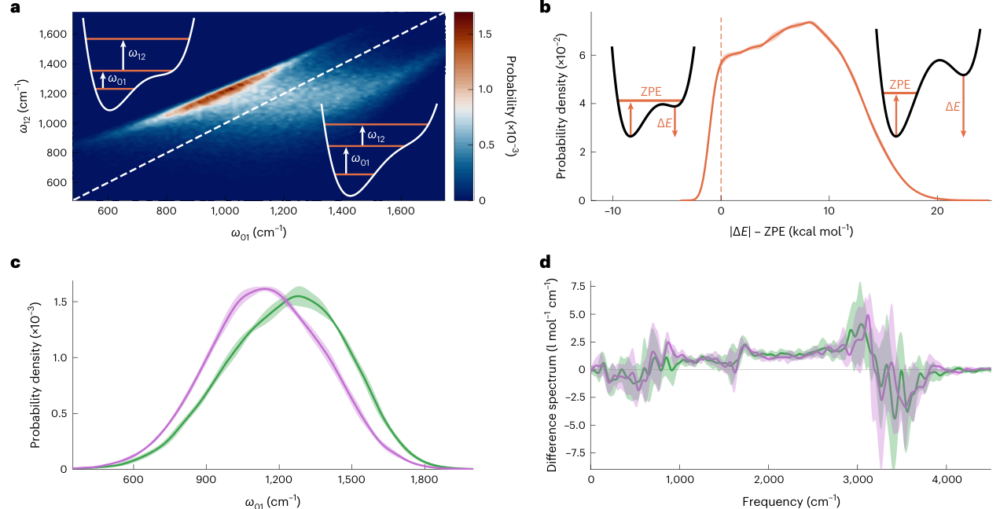
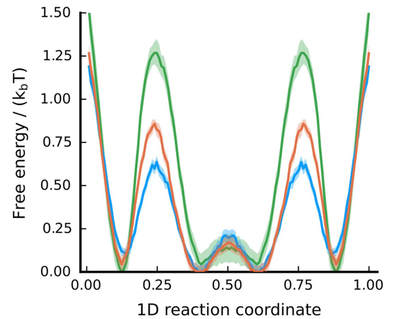
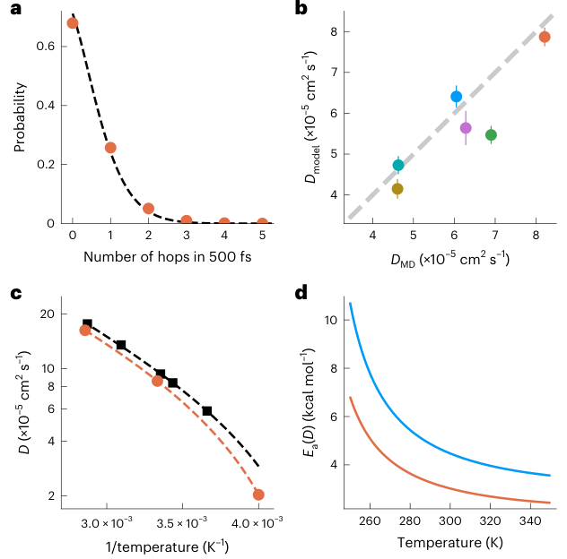
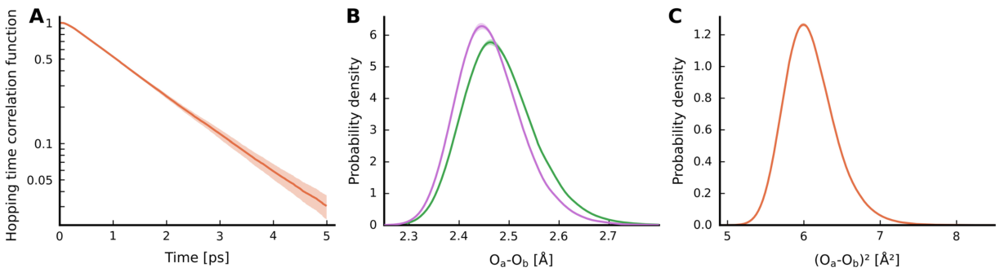
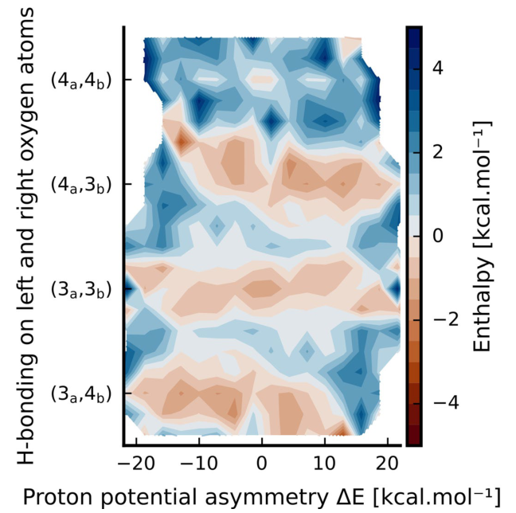

# Neural-network-based molecular dynamics simulations reveal that proton transport in water is doubly gated by sequential hydrogen-bond exchange

**Zotero key:** FTDJFF56  
**Attachment key:** 4BNFIHFL  
**Journal:** Nature Chemistry  
**DOI:** 10.1038/s41557-024-01593-y  
**Publication date:** 2024-08-20  
**Source PDF:** paper.pdf

## Why This Paper / 为什么选这篇

**English:** This paper is valuable because it connects neural-network molecular dynamics, nuclear quantum effects, vibrational spectroscopy and a precise mechanistic question about proton transport. It is also a useful model for reading simulation papers that must make one coordinate system explain structure, spectra and transport at the same time.

**中文:** 这篇论文很有价值，因为它将神经网络分子动力学、核量子效应、振动光谱学和有关质子输运的精确机械问题联系起来。它也是阅读模拟论文的有用模型，必须使一个坐标系同时解释结构、光谱和传输。

## Reading Guide / 读前导读

**English:** Read it in three passes. First identify the two structural coordinates: proton potential asymmetry and hydrogen-bond coordination. Then follow Fig. 2 to see why transport is sequential rather than concerted. Finally connect Fig. 3 and Fig. 4 back to experiment: spectroscopy sees the stable Zundel-like hydrogen-bond motif, while transport statistics identify the rate-limiting gate.

**中文:** 分三遍读完。首先确定两个结构坐标：质子势不对称性和氢键配位。然后按照图 2 看看为什么传输是顺序的而不是协调的。最后将图 3 和图 4 连接回实验：光谱学看到了稳定的 Zundel 样氢键基序，而传输统计则确定了限速门。

## Terminology / 术语表

| English | Chinese | Note |
|---|---|---|
| excess proton | 过量质子 | 本文中反复出现的关键术语。 |
| Eigen complex | 本征复合体 | 本文中反复出现的关键术语。 |
| Zundel complex | 尊德尔综合体 | 本文中反复出现的关键术语。 |
| hydrogen-bond exchange | 氢键交换 | 本文中反复出现的关键术语。 |
| proton potential asymmetry Delta E | 质子势不对称 Delta E | 本文中反复出现的关键术语。 |
| thermostatted ring-polymer molecular dynamics (TRPMD) | 恒温环聚合物分子动力学 (TRPMD) | 本文中反复出现的关键术语。 |
| deep neural-network potential (DNN/NNP) | 深度神经网络潜力 (DNN/NNP) | 本文中反复出现的关键术语。 |

## Page / Section Index

- `p.1-p.6`: main article text and Figs. 1-4
- `p.8-p.10`: Methods, data/code availability, author contributions and declarations
- `p.11-p.15`: Extended Data Figs. 1-5

## Bilingual Reader / 逐段中英对照

### Main text

**Source:** p.1 S001

**Original:** Axel Gomez 1, Ward H. Thompson 2 & Damien Laage 1

**中文:** 阿克塞尔·戈麦斯 1、沃德·H·汤普森 2 和达米安·拉格 1

### Main text

**Source:** p.1 S002

**Original:** The transport of excess protons in water is central to acid–base chemistry, biochemistry and energy production. However, elucidating its mechanism has been challenging. Recent nonlinear vibrational spectroscopy experiments could not be explained by existing models. Here we use both vibrational spectroscopy calculations and neural-network-based molecular dynamics simulations that account for nuclear quantum effects for all atoms to determine the proton transport mechanism. Our simulations reveal an equilibrium between two stable proton-localized structures with distinct Eigen-like and Zundel-like hydrogen-bond motifs. Proton transport follows a three-step mechanism gated by two successive hydrogen-bond exchanges: the first reduces the proton-acceptor water coordination, leading to proton transfer, and the second, the rate-limiting step, prevents rapid back-transfer by increasing the proton-donor coordination.

**中文:** 水中过量质子的传输对于酸碱化学、生物化学和能源生产至关重要。然而，阐明其机制一直具有挑战性。最近的非线性振动光谱实验无法用现有模型来解释。在这里，我们使用振动光谱计算和基于神经网络的分子动力学模拟来解释所有原子的核量子效应，以确定质子传输机制。我们的模拟揭示了两种稳定的质子局域结构之间的平衡，具有不同的本征状和 Zundel 状氢键基序。质子传输遵循由两次连续氢键交换控制的三步机制：第一步减少质子-受体水配位，导致质子转移，第二步是限速步骤，通过增加质子-供体配位防止快速反向转移。

### Main text

**Source:** p.1 S003

**Original:** This sequential mechanism is consistent with experimental characterizations of proton diffusion, explaining the low activation energy and the prolonged intermediate lifetimes in vibrational spectroscopy. These results are crucial for understanding proton dynamics in biochemical and technological systems.

**中文:** 这种顺序机制与质子扩散的实验表征一致，解释了振动光谱中的低活化能和延长的中间寿命。这些结果对于理解生化和技术系统中的质子动力学至关重要。

### Main text

**Source:** p.1 S004

**Original:** Proton transport in water governs aqueous acid–base reaction kinetics, powers cellular metabolism and controls energy production in fuel cells. However, despite decades of intensive experimental and theoretical investigations, its mechanism still has not been fully elucidated. Proton transport is generally understood to occur through a proton-transfer relay between hydrogen (H)-bonded water molecules, which results in its anomalously rapid diffusion compared with other ions. However, no consensus has been reached on the molecular mechanism of proton transport, the nature of its rate-limiting step and even the equilibrium structure of an excess proton in water. Two limiting structures have been proposed for the hydrated excess proton—the Eigen complex1, where a central hydronium ion is symmetrically solvated by three water molecules as H3O+(H2O)3, and the

**中文:** 水中的质子传输控制着水性酸碱反应动力学，为细胞新陈代谢提供动力并控制燃料电池的能量产生。然而，尽管经过数十年的深入实验和理论研究，其机制仍未完全阐明。一般认为，质子传输是通过氢 (H) 键合水分子之间的质子转移中继发生的，这导致其与其他离子相比异常快速扩散。然而，对于质子传输的分子机制、其限速步骤的性质，甚至水中过量质子的平衡结构，尚未达成共识。对于水合过量质子，提出了两种限制结构——本征络合物1，其中中心水合氢离子被三个水分子对称地溶剂化为H3O+(H2O)3，并且

### Main text

**Source:** p.1 S005

**Original:** Zundel complex2,3 H5O2 +, where the proton is equally shared between two flanking water molecules—and the proton is usually considered to adopt a broad distribution of structures between these limits. A major computational effort4–12 begun three decades ago has concluded that the Eigen form is more stable and that proton transport goes through an unstable Zundel transition state6–9,12,13. However, recent time-resolved vibrational spectroscopy results14–17 suggest that distorted Zundel-like structures are long-lived, contradicting this picture. This contradiction compounds another unresolved question about the nature of the rate-limiting step: the most recent proposed mechanisms8,9,13 involve the concerted rearrangement of at least two H-bonds, a requirement inconsistent with the measured very low diffusion activation energy18. Altogether, these results therefore call for a revised picture of proton transport.

**中文:** Zundel 复合体2,3 H5O2 +，其中质子在两个侧翼水分子之间平均分配，并且质子通常被认为在这些限制之间采用广泛的结构分布。三十年前开始的一项重大计算工作4-12得出的结论是，本征形式更加稳定，并且质子传输经历不稳定的Zundel过渡态6-9,12,13。然而，最近的时间分辨振动光谱结果 14-17 表明，扭曲的 Zundel 状结构是长期存在的，这与这一情况相矛盾。这种矛盾加剧了关于限速步骤性质的另一个未解决的问题：最近提出的机制8,9,13涉及至少两个氢键的协同重排，这一要求与测量的非常低的扩散活化能不一致18。总而言之，这些结果需要对质子传输进行修改。

### Main text

**Source:** p.2 S006

**Original:** To address this question, we have performed and analysed extensive neural network potential (NNP)-based molecular dynamics (MD) simulations combined with vibrational spectra calculations. Simulating proton transport requires combining an accurate description of electronic structure rearrangements caused by covalent bond breaking and making, an explicit description of nuclear quantum effects associated with high-frequency hydrogen motions6,19,20, and trajectories long-enough to resolve subtle stability differences between proton structures. Because of the large computational costs involved, previous simulations with ab initio and empirical valence bond MD had to compromise on some of these points. However, recent developments in machine learning now offer a solution to all three requirements via deep neural network (DNN) potentials that reproduce high-level reference electronic structure calculations at a fraction of the cost, allowing for unprecedented trajectory lengths21.

**中文:** 为了解决这个问题，我们结合振动谱计算进行了广泛的基于神经网络势（NNP）的分子动力学（MD）模拟和分析。模拟质子输运需要结合对共价键断裂和形成引起的电子结构重排的准确描述、与高频氢运动相关的核量子效应的明确描述6,19,20以及足够长的轨迹来解决质子结构之间细微的稳定性差异。由于涉及大量计算成本，以前使用从头计算和经验价键 MD 的模拟必须在其中一些点上做出妥协。然而，机器学习的最新发展现在通过深度神经网络（DNN）潜力提供了满足所有三个要求的解决方案，该潜力可以以一小部分成本重现高级参考电子结构计算，从而实现前所未有的轨迹长度21。

### Main text

**Source:** p.2 S007

**Original:** We have trained a DNN potential at the revPBE0-D3 hybrid density functional theory (DFT) level and used it to perform simulations of an excess proton in water at ambient conditions using thermostatted ring-polymer molecular dynamics (TRPMD)22 that explicitly account for nuclear quantum effects of all atoms in the system.

**中文:** 我们在 revPBE0-D3 混合密度泛函理论 (DFT) 水平上训练了 DNN 势，并使用它在环境条件下使用恒温环聚合物分子动力学 (TRPMD)22 对水中的过量质子进行模拟，该动力学明确解释了系统中所有原子的核量子效应。

### Main text

**Source:** p.2 S008

**Original:** Results and discussion. Diffusion coefficient and linear vibrational spectroscopy We first confirm that this technique quantitatively captures the hydrated proton’s anomalously fast diffusion and vibrational spectral features (Fig. 1). Our simulations yield accurate descriptions both for the excess proton diffusion coefficient (8.57 ± 0.05 × 10−5 cm2 s−1, in very good agreement with the 9.3 × 10−5 cm2 s−1 experimental value23) and the ratio between water and proton diffusion coefficients ( DH2O/DH+ = 0.207 ± 0.002 from our simulations and 0.25 experimentally23). The key role played by actual proton transfers in this enhanced diffusion is evidenced by the much-reduced vehicular diffusion coefficient (Dvehicular = 1.32 ± 0.01 × 10−5 cm2 s−1) of a hydronium ion whose internal covalent bonds are maintained intact. In addition, we verify that our computed infrared (IR) spectrum of an excess proton in water accurately reproduces all the vibrational hallmarks of the hydrated proton reported experimentally14–17,24 (Fig. 1b,c and Methods).

**中文:** 结果和讨论。扩散系数和线性振动光谱我们首先确认该技术定量捕获了水合质子的异常快速扩散和振动光谱特征（图1）。我们的模拟对过量质子扩散系数（8.57 ± 0.05 × 10−5 cm2 s−1，与 9.3 × 10−5 cm2 s−1 实验值23非常一致）和水与质子扩散系数之间的比率（来自我们的模拟的 DH2O/DH+ = 0.207 ± 0.002 和实验的 0.2523）产生了准确的描述。实际质子转移在这种增强扩散中发挥的关键作用可以通过其内部共价键保持完整的水合氢离子的显着降低的车辆扩散系数（D车辆 = 1.32 ± 0.01 × 10−5 cm2 s−1）来证明。此外，我们验证了我们计算的水中过量质子的红外（IR）光谱准确地再现了实验报告的水合质子的所有振动特征14-17,24（图1b，c和方法）。

### Fig. 1 | Diffusion constant and vibrational spectra

**Placed near:** p.2 F001

**Source:** p.2 F001

**Original caption:** Delay (ps) Frequency (cm) Frequency (cm) Fig. 1 | Diffusion constant and vibrational spectra. a, Mean-squared displacements of the excess proton (orange), of the excess proton undergoing vehicular diffusion in the absence of proton transfers (green) and of water molecules (blue) calculated from 20 independent 200 ps trajectories for the free simulations propagated with TRPMD using a DNN trained at the revPBE0-D3 level (revPBE0-D3/TRPMD is shown in ref. 48 to provide an excellent description of neat water structure, dynamics and vibrational spectra) and from 5 independent 200 ps trajectories for the constrained simulations (vehicular diffusion, green). Diffusion coefficients are determined from the slope of the mean-squared displacement on the 10–40 ps interval (dashes) and corrected for finite-size effects (Supplementary Fig. 9). The shaded regions show the 95% confidence interval derived from 20 independent trajectories (excess proton diffusion, orange; water diffusion, blue) or 5 independent trajectories (excess proton vehicular diffusion, green). b, Calculated IR spectra of the acidic (orange) and neat water (blue) solutions, with the experimental spectrum (grey) of liquid water (from ref. 49); the spectrum is calculated as the Fourier transform of the dipole time-derivative autocorrelation function, with the molecular dipoles obtained from separately trained DNNs (Methods). The shaded regions show the 95% confidence interval derived from five independent trajectories. c, Difference IR spectrum between acidic and neat water solutions from our simulations (orange) and from experiments16 (grey). The shaded regions show the 95% confidence interval derived from five independent trajectories.

**中文图注:** 延迟 (ps) 频率 (cm) 频率 (cm) 图 1 |扩散常数和振动光谱。 a，过量质子的均方位移（橙色）、在没有质子转移的情况下进行车辆扩散的过量质子的均方位移（绿色）和水分子的均方位移（蓝色），根据 20 个独立的 200 ps 轨迹计算得出，用于使用在 revPBE0-D3 级别训练的 DNN 传播 TRPMD 进行的自由模拟（revPBE0-D3/TRPMD 在参考文献 48 中显示，以提供出色的描述）整齐的水结构、动力学和振动光谱）以及来自 5 个独立的 200 ps 轨迹的约束模拟（车辆扩散，绿色）。扩散系数由 10-40 ps 间隔（虚线）上均方位移的斜率确定，并针对有限尺寸效应进行校正（补充图 9）。阴影区域显示从 20 个独立轨迹（过量质子扩散，橙色；水扩散，蓝色）或 5 个独立轨迹（过量质子车辆扩散，绿色）导出的 95% 置信区间。 b，计算出的酸性（橙色）和纯水（蓝色）溶液的红外光谱，以及液态水的实验光谱（灰色）（来自参考文献49）；谱计算为偶极子时间导数自相关函数的傅里叶变换，其中分子偶极子是从单独训练的 DNN 中获得的（方法）。阴影区域显示从五个独立轨迹得出的 95% 置信区间。 c，来自我们的模拟（橙色）和实验16（灰色）的酸性和纯水溶液之间的红外光谱差异。阴影区域显示从五个独立轨迹得出的 95% 置信区间。

**Reading note:** 这张图是原 PDF 中对应图的单独裁剪，不再使用整页截图或正文区域截图。

### Main text

**Source:** p.2 S009

**Original:** interval derived from 20 independent trajectories (excess proton diffusion, orange; water diffusion, blue) or 5 independent trajectories (excess proton vehicular diffusion, green). b, Calculated IR spectra of the acidic (orange) and neat water (blue) solutions, with the experimental spectrum (grey) of liquid water (from ref. 49); the spectrum is calculated as the Fourier transform of the dipole time-derivative autocorrelation function, with the molecular dipoles obtained from separately trained DNNs (Methods). The shaded regions show the 95% confidence interval derived from five independent trajectories. c, Difference IR spectrum between acidic and neat water solutions from our simulations (orange) and from experiments16 (grey). The shaded regions show the 95% confidence interval derived from five independent trajectories.

**中文:** 从 20 个独立轨迹（过量质子扩散，橙色；水扩散，蓝色）或 5 个独立轨迹（过量质子车辆扩散，绿色）得出的间隔。 b，计算出的酸性（橙色）和纯水（蓝色）溶液的红外光谱，以及液态水的实验光谱（灰色）（来自参考文献49）；谱计算为偶极子时间导数自相关函数的傅里叶变换，其中分子偶极子是从单独训练的 DNN 中获得的（方法）。阴影区域显示从五个独立轨迹得出的 95% 置信区间。 c，来自我们的模拟（橙色）和实验16（灰色）的酸性和纯水溶液之间的红外光谱差异。阴影区域显示从五个独立轨迹得出的 95% 置信区间。

### Main text

**Source:** p.2 S010

**Original:** Proton transfer mechanism We then determine the molecular mechanism of individual proton transfer events from our simulations. Characterizing this mechanism is particularly challenging due to the ultrafast dynamics involved. The excess proton undergoes sustained transfers6 every 100 fs or less based on changes in the defect-carrying oxygen atom identity observed in simulations8,25 and on the ultrafast proton structural dynamics measured by nonlinear vibrational spectroscopy15,26. In contrast, successful proton hops leading to diffusion measured by nuclear magnetic resonance27 and two-dimensional IR spectroscopy28 take place on a ten-times-slower picosecond timescale. This discrepancy is known29 to arise from the multiple back and forth transfers between the same pair of water molecules before a stable hop occurs and leads to diffusion. However, distinguishing this transient rattling from stable transfer events and determining what controls the slower hops is a major difficulty for simulations.

**中文:** 质子转移机制然后我们从模拟中确定单个质子转移事件的分子机制。由于涉及超快动力学，表征这种机制特别具有挑战性。根据模拟中观察到的携带缺陷的氧原子特性的变化 8,25 以及非线性振动光谱测量的超快质子结构动力学 15,26，过量的质子每 100 fs 或更短时间就会发生持续转移 6。相比之下，通过核磁共振27和二维红外光谱28测量，成功的质子跳跃导致扩散发生在慢十倍的皮秒时间尺度上。众所周知，这种差异29是由于在发生稳定的跳跃并导致扩散之前同一对水分子之间的多次来回转移而引起的。然而，区分这种瞬态震动和稳定传输事件并确定控制较慢跳跃的因素是模拟的主要困难。

### Main text

**Source:** p.2 S011

**Original:** Filtering procedures have been proposed5,9,30,31, but they all require arbitrary selections that typically ignore all transfers back to the previous proton-carrying oxygen, an exclusion contrary to the uniform random walk that predicts that the latter should receive one-third of the transfers. To overcome these difficulties and focus on the intrinsic rearrangements of the proton environment, we consider two key coordinates. The first one is the energy gap ΔE between two reference configurations where the proton is moved from the donor to the acceptor. This reports on the proton potential asymmetry and on whether it favours the proton on the donor (ΔE < 0) or acceptor (ΔE > 0) side (Fig. 2a). It is analogous to the electron transfer theory solvent coordinate and has already been successfully applied to proton transfer19,32. Its key advantage relative to the extensively used6,9,12,33 proton position coordinate is that large but transient OH bond elongations are not spuriously considered as transfers when the proton potential asymmetry keeps the proton localized on the donor.

**中文:** 过滤程序已被提出5、9、30、31，但它们都需要任意选择，通常会忽略返回到先前携带质子的氧气的所有转移，这种排除与预测后者应接收三分之一的转移的均匀随机游走相反。为了克服这些困难并关注质子环境的内在重排，我们考虑两个关键坐标。第一个是质子从施主移动到受主的两个参考构型之间的能隙 ΔE。该报告报告了质子势不对称性以及它是否有利于供体（ΔE < 0）或受体（ΔE > 0）侧的质子（图2a）。它类似于电子转移理论溶剂坐标并已成功应用于质子转移19,32。相对于广泛使用的 6,9,12,33 质子位置坐标，其主要优点是，当质子势不对称使质子位于供体上时，大但短暂的 OH 键伸长不会被错误地视为转移。

### Main text

**Source:** p.2 S012

**Original:** Out of the three hydrogen atoms in the hydronium ion, we focus here on the best candidate for proton transfer, that is, the one with the least asymmetric proton potential. A second coordinate is required to monitor H-bond rearrangements around the donor and the acceptor, since bulk water molecules form approximately four H-bonds, donating two and accepting two, while the hydronium ion is coordinated by only three H-bond acceptors.

**中文:** 在水合氢离子的三个氢原子中，我们在这里关注质子转移的最佳候选者，即具有最小不对称质子势的氢原子。需要第二个坐标来监测供体和受体周围的氢键重排，因为大量水分子形成大约四个氢键，给出两个并接受两个，而水合氢离子仅由三个氢键受体配位。

### Main text

**Source:** p.3 S013

**Original:** H-bond rearrangements were suggested early on to be key for proton transfer19, and simulation studies have all stressed their importance4–6,8,9,11–13,34. However, distinguishing between transient and stable H-bond reorganizations is critical. In water, H-bond breaks are frequent but transient because dangling H-bond configurations are unstable35. Stable H-bond rearrangements occur only when the H-bond donor jumps to another available H-bond partner36. This provides a natural definition for stable H-bond configurations. For the proton donor and acceptor oxygens, we examine whether the best fourth H-bond partner is closer to this oxygen or to another H-bond acceptor. This results in a continuous and periodic coordinate that monitors whether the proton-donor and proton-acceptor oxygen atoms have three or four stable H-bonded neighbours (Fig. 2a, Methods and Extended Data Fig. 1). The free energy surface calculated along these two coordinates from our 4-ns-long unconstrained MD simulations (Fig. 2b) reveals critical features of the proton structure and transfer mechanism not visible in previous analyses based on other more transient fluctuation-prone coordinates.

**中文:** 氢键重排很早就被认为是质子转移的关键19，模拟研究都强调了它们的重要性4-6,8,9,11-13,34。然而，区分瞬时氢键重组和稳定氢键重组至关重要。在水中，氢键断裂频繁但短暂，因为悬挂的氢键构型不稳定35。仅当氢键供体跳转到另一个可用的氢键伙伴时，才会发生稳定的氢键重排36。这为稳定的氢键构型提供了自然的定义。对于质子供体和受体氧，我们检查最佳的第四个氢键伙伴是否更接近该氧或另一个氢键受体。这产生了一个连续和周期性的坐标，用于监测质子供体和质子受体氧原子是否具有三个或四个稳定的氢键邻居（图2a，方法和扩展数据图1）。根据我们的 4 ns 长无约束 MD 模拟（图 2b），沿着这两个坐标计算的自由能表面揭示了质子结构和转移机制的关键特征，这些特征在之前基于其他更容易出现瞬态涨落的坐标的分析中不可见。

### Main text

**Source:** p.3 S014

**Original:** Concerning the equilibrium proton structure, it has been assumed in the literature that only one of the Eigen and Zundel forms is stable. Consequently, the focus has been on determining which structure is more stable, treating the other as the transition state crossed during

**中文:** 关于平衡质子结构，文献中假设只有本征型和 Zundel 型中的一种是稳定的。因此，重点是确定哪种结构更稳定，将另一种结构视为过渡态

### Main text

**Source:** p.3 S015

**Original:** c, Free energy profile along the pathway shown in b. Shaded regions show the 95% confidence interval derived from 20 independent trajectories. d, Schematic proton transfer mechanism with typical H-bond arrangements and proton potential energy profiles for key locations on the surface, where the transferred proton and defect-carrying oxygen atom are highlighted. While the Eigen-like (1 and 1′) and Zundel-like (2 and 2′) structures are stable, the ideal Zundel structure (3) is unstable.

**中文:** c，沿 b 所示路径的自由能分布。阴影区域显示从 20 个独立轨迹得出的 95% 置信区间。 d，示意性质子转移机制，具有典型的氢键排列和表面关键位置的质子势能分布，其中突出显示了转移的质子和携带缺陷的氧原子。虽然类本征结构（1 和 1'）和类 Zundel 结构（2 和 2'）是稳定的，但理想的 Zundel 结构 (3) 是不稳定的。

### Main text

**Source:** p.3 S016

**Original:** proton transfer. In contrast, the free energy surface in Fig. 2b reveals an equilibrium between two distinct stable H-bond arrangements while the proton remains bonded to the same water molecule. When the proton is favoured on the donor oxygen Oa (ΔE < 0), Oa is three-coordinate as expected around a hydronium ion (Supplementary Fig. 5), but the acceptor oxygen Ob exhibits two stable H-bond arrangements, three- and four-coordinate, that we denote (3a, 3b) and (3a, 4b), respectively. Two additional free energy basins are found for the equivalent structures with the proton on Ob when ΔE > 0. The (3a, 4b) and (4a, 3b) structures resemble the Eigen complex on Oa and Ob, respectively, where the hydronium ion is solvated by three bulk-like four-coordinated water molecules. In contrast, in the (3a, 3b) structure, Oa and Ob share a symmetric solvation environment where both have lost an H-bond: the H-bond arrangement is that expected around the Zundel form, and we will refer to it as ‘Zundel-like’.

**中文:** 质子转移。相比之下，图 2b 中的自由能表面揭示了两种不同的稳定氢键排列之间的平衡，而质子仍然与同一水分子键合。当质子有利于供体氧 Oa (ΔE < 0) 时，Oa 正如预期的那样在水合氢离子周围是三配位的（补充图 5），但受主氧 Ob 表现出两种稳定的氢键排列，三配位和四配位，我们分别表示为 (3a, 3b) 和 (3a, 4b)。当 ΔE > 0 时，发现了两个与 Ob 上的质子等效的结构的附加自由能盆。 (3a, 4b) 和 (4a, 3b) 结构分别类似于 Oa 和 Ob 上的本征络合物，其中水合氢离子被三个块状四配位水分子溶剂化。相比之下，在 (3a, 3b) 结构中，Oa 和 Ob 共享对称溶剂化环境，两者都失去了氢键：氢键排列是 Zundel 形式周围预期的排列，我们将其称为“类 Zundel”。

### Fig. 2 | Proton transfer mechanism

**Placed near:** p.3 F002

**Source:** p.3 F002

**Original caption:** Fig. 2 | Proton transfer mechanism. a, Definition of coordinates: proton potential asymmetry ΔE (left) and periodic H-bond coordinate probing the donor and acceptor numbers of H-bonded partners (right). b, Free energy surface along the proton potential asymmetry ΔE and H-bond coordinate noted (na, nb) where na,b is the number of H-bond partners for Oa,b, focusing on the best Ob proton acceptor candidate with the smallest |ΔE| asymmetry. The uncertainty on the free energy is <0.07 kcal mol−1 (Supplementary Fig. 2 and Supplementary Table 1). c, Free energy profile along the pathway shown in b. Shaded regions show the 95% confidence interval derived from 20 independent trajectories. d, Schematic proton transfer mechanism with typical H-bond arrangements and proton potential energy profiles for key locations on the surface, where the transferred proton and defect-carrying oxygen atom are highlighted. While the Eigen-like (1 and 1′) and Zundel-like (2 and 2′) structures are stable, the ideal Zundel structure (3) is unstable.

**中文图注:** 图2|质子转移机制。 a，坐标定义：质子势不对称性 ΔE（左）和探测氢键配体的供体和受体数量的周期性氢键坐标（右）。 b，沿着质子势不对称 ΔE 和氢键坐标的自由能表面 (na, nb)，其中 na,b 是 Oa,b 的氢键伙伴数量，重点关注具有最小 |ΔE| 的最佳 Ob 质子受体候选者不对称。自由能的不确定性<0.07 kcal mol−1（补充图2和补充表1）。 c，沿 b 所示路径的自由能分布。阴影区域显示从 20 个独立轨迹得出的 95% 置信区间。 d，示意性质子转移机制，具有典型的氢键排列和表面关键位置的质子势能分布，其中突出显示了转移的质子和携带缺陷的氧原子。虽然类本征结构（1 和 1'）和类 Zundel 结构（2 和 2'）是稳定的，但理想的 Zundel 结构 (3) 是不稳定的。

**Reading note:** 这张图是原 PDF 中对应图的单独裁剪，不再使用整页截图或正文区域截图。

### Main text

**Source:** p.3 S017

**Original:** However, the covalent bonding structure is not the idealized Zundel complex since the strong proton potential asymmetry |ΔE| keeps the proton localized on Oa or Ob (Supplementary Fig. 7). The distances between the hydronium ion and its hydration shell water molecules exhibit a hierarchy of H-bond lengths in quantitative agreement with recent X-ray results on protonated water complexes37; these distances do not change between the Eigen-like and Zundel-like states, but their gradation is markedly enhanced in the Zundel transition state (Supplementary Fig. 6).

**中文:** 然而，由于强质子势不对称性|ΔE|，共价键结构并不是理想化的Zundel配合物。保持质子位于 Oa 或 Ob 上（补充图 7）。水合氢离子与其水合壳层水分子之间的距离表现出氢键长度的层次结构，与最近质子化水复合物的 X 射线结果定量一致。这些距离在类本征态和类 Zundel 态之间没有变化，但它们的梯度在 Zundel 过渡态中显着增强（补充图 6）。

### Main text

**Source:** p.4 S018

**Original:** Our simulations thus show that the hydrated excess proton equilibrium structure is characterized by two features: (1) its covalent bonding pattern, which is Eigen-like and keeps the proton localized on a single water molecule, and (2) its H-bond arrangement in equilibrium between Eigen-like and Zundel-like stable solvation structures in almost equal proportions (this equilibrium is affected by, for example, temperature and isotopic substitution; Extended Data Figs. 2 and 3). This previously unnoticed structural equilibrium carries major implications for proton transfer. The most probable transfer mechanism is determined from the minimum free energy path for inverting the proton potential asymmetry from ΔE < 0 to ΔE > 0 on the surface (Fig. 2b,c); the associated transfer rates between intermediates are obtained from a time-correlation function analysis of our simulations. As seen in Fig. 2b,d, systems starting from the Eigen-like H-bond configuration (state 1) first require the breaking of an H-bond on the acceptor to reach the Zundel-like H-bonded state (state 2).

**中文:** 因此，我们的模拟表明，水合过量质子平衡结构具有两个特征：（1）其共价键模式，它是类本征的并将质子集中在单个水分子上，（2）其氢键排列在类本征和类Zundel稳定溶剂化结构之间以几乎相等的比例平衡（这种平衡受到温度和同位素取代等因素的影响；扩展数据图2和图3）。这种以前未被注意到的结构平衡对质子转移具有重大影响。最可能的转移机制是由将表面上质子势不对称性从 ΔE < 0 反转到 ΔE > 0 的最小自由能路径确定的（图 2b，c）；中间体之间的相关传输速率是通过我们的模拟的时间相关函数分析获得的。如图 2b、d 所示，从类本征氢键构型（状态 1）开始的系统首先需要断裂受体上的氢键以达到类 Zundel 氢键状态（状态 2）。

### Extended Data Fig. 1 | Hydrogen-bond coordinate

**Placed near:** p.11 F005

**Source:** p.11 F005

**Original caption:** Extended Data Fig. 1 | Hydrogen-bond coordinate. Schematic representation of the atoms involved in the calculation of the H-bond coordinate around Ob.

**中文图注:** 扩展数据图 1 |氢键坐标。参与计算 Ob 周围氢键坐标的原子示意图。

**Reading note:** 这张图是原 PDF 中对应图的单独裁剪，不再使用整页截图或正文区域截图。

### Main text

**Source:** p.4 S019

**Original:** This occurs on a 2.1 ± 0.4 ps timescale on each acceptor, slightly faster than typical H-bond exchanges in bulk water36 and, thus, three times faster on a 0.7 ± 0.2 ps timescale when the H-bond break can occur on any of the three acceptors. Once in the symmetric H-bond arrangement where both the donor and acceptor have a hydronium-like coordination, facile proton transfer can occur, overcoming a low and mostly entropic barrier (Extended Data Fig. 3) on a 0.6 ± 0.1 ps timescale, and taking the system through the ideal fully symmetric ΔE = 0 Zundel structure (state 3). This results in a Zundel-like H-bond configuration where the proton is now on the acceptor side (state 2′). Our proposed mechanism shares some features with previous theoretical works but differs in several critical points that are essential

**中文:** 这发生在每个受体上的 2.1 ± 0.4 ps 时间尺度上，比散装水中典型的氢键交换稍快36，因此，当氢键断裂可能发生在三个受体中的任何一个上时，在 0.7 ± 0.2 ps 时间尺度上快三倍。一旦处于供体和受体都具有类水合氢配位的对称氢键排列中，就可以发生轻松的质子转移，在 0.6 ± 0.1 ps 时间尺度上克服低且大部分熵的势垒（扩展数据图 3），并使系统通过理想的完全对称 ΔE = 0 Zundel 结构（状态 3）。这导致了类似 Zundel 的氢键构型，其中质子现在位于受体一侧（状态 2'）。我们提出的机制与以前的理论工作有一些共同特征，但在几个重要的关键点上有所不同

### Extended Data Fig. 2 | Proton transfer free energy profiles in H2O and D2O

**Placed near:** p.12 F006

**Source:** p.12 F006

**Original caption:** Extended Data Fig. 2 | Proton transfer free energy profiles in H2O and in D2O at 300 K. One-dimensional free energy profile along the reaction coordinate determined from the two-dimensional surface in Fig. 2b and Supplementary Fig. 2 (A) with the revPBE0-D3 NNP and (B) with the B3LYP-D3 NNP, respectively for H2O with nuclear quantum effects (solid orange lines), D2O with nuclear quantum effects (solid purple lines) and H2O with classical nuclei (orange dashes). Shaded regions show the 95% confidence interval derived from 20 independent trajectories.

**中文图注:** 扩展数据图 2 | 300 K 下 H2O 和 D2O 中的质子转移自由能分布。从图 2b 和补充图 2 中的二维表面确定的沿反应坐标的一维自由能分布（A）使用 revPBE0-D3 NNP 和（B）使用 B3LYP-D3 NNP，分别针对具有核量子效应的 H2O（橙色实线）、具有核量子效应的 D2O（紫色实线）和具有经典效应的 H2O细胞核（橙色虚线）。阴影区域显示从 20 个独立轨迹得出的 95% 置信区间。

**Reading note:** 这张图是原 PDF 中对应图的单独裁剪，不再使用整页截图或正文区域截图。

### Main text

**Source:** p.4 S020

**Original:** 20 independent trajectories. c, Probability distributions of the ω01 frequency in the Eigen-like (green) and Zundel-like (purple) H-bond arrangements. The shaded regions show the 95% confidence interval derived from 20 independent trajectories. d, Difference spectra between acidic solution and neat water decomposed into Eigen-like (green) and Zundel-like (purple) H-bond arrangements. The shaded regions show the 95% confidence interval derived from five independent trajectories.

**中文:** 20条独立轨迹。 c，类本征（绿色）和类 Zundel（紫色）H 键排列中 ω01 频率的概率分布。阴影区域显示从 20 个独立轨迹得出的 95% 置信区间。 d，酸性溶液和纯水之间分解成本征型（绿色）和 Zundel 型（紫色）氢键排列的差异光谱。阴影区域显示从五个独立轨迹得出的 95% 置信区间。

### Main text

**Source:** p.4 S021

**Original:** for explaining the experimental observations. First, we emphasize that our multistep mechanism with two stable configurations contrasts with all previously proposed mechanisms that involve a single stable Eigen state and an unstable Zundel transition state. The initial step in our mechanism involves the breaking of the H-bond on the acceptor, in agreement with early pioneering studies on proton transfer4,6,8,19,38 that had recognized its essential role. However, a key distinction arises as our results indicate that this step is not rate-limiting, in contrast to the conclusion of these early studies. Subsequent simulations9,11,13,29,30 suggested that additional H-bond rearrangements are involved, but the exact nature of the limiting step remained elusive. A presolvation picture was proposed9,39, involving the same H-bond breaking on the acceptor and H-bond formation on the donor as in our mechanism.

**中文:** 用于解释实验观察结果。首先，我们强调我们的具有两种稳定配置的多步机制与之前提出的涉及单个稳定本征态和不稳定 Zundel 过渡态的所有机制形成对比。我们机制的第一步涉及受体上氢键的断裂，这与质子转移的早期开创性研究一致4,6,8,19,38，这些研究已经认识到其重要作用。然而，一个关键的区别出现了，因为我们的结果表明，与这些早期研究的结论相反，这一步骤不是速率限制的。随后的模拟9,11,13,29,30表明涉及额外的氢键重排，但限制步骤的确切性质仍然难以捉摸。提出了预溶解图9,39，涉及与我们的机制中相同的受体上的氢键断裂和供体上的氢键形成。

### Main text

**Source:** p.4 S022

**Original:** However, in this model, both H-bond rearrangements must occur concertedly before the proton is transfered9,39. Such a concerted mechanism would be expected to have a proton diffusion activation energy typically twice that of water self-diffusion, since the latter involves a single H-bond exchange40. However, experiments indicate that proton transport has a smaller activation energy than water diffusion18. As we will show, this discrepancy is solved by our sequential mechanism, which involves the successive breaking of one H-bond, proton transfer and the reformation of another H-bond. Finally, the proton donor–acceptor pair in our symmetrically undercoordinated H-bond arrangement shares similarities with the previously proposed special pair4,8, including its H-bond configuration and strong H-bond interaction, but our simulations do not show the suggested8 rapid <100 fs switching of the partner’s identity among the central hydronium H-bond acceptors, since this requires stable

**中文:** 然而，在这个模型中，在质子转移之前，两个氢键重排必须同时发生9,39。这种协同机制预计具有通常是水自扩散活化能两倍的质子扩散活化能，因为后者涉及单个氢键交换40。然而，实验表明质子输运的活化能比水扩散的活化能小18。正如我们将要展示的，这种差异是通过我们的顺序机制解决的，该机制涉及一个氢键的连续断裂、质子转移和另一个氢键的重组。最后，我们的对称欠配位氢键排列中的质子供体-受体对与之前提出的特殊对4,8有相似之处，包括其氢键构型和强氢键相互作用，但我们的模拟没有显示建议的8中心水合氢氢键受体之间伙伴身份的快速<100 fs切换，因为这需要稳定的

### Main text

**Source:** p.5 S023

**Original:** H-bond breaking and making on the pair acceptor that occur on a picosecond timescale.

**中文:** 受体对上氢键的断裂和形成发生在皮秒时间尺度上。

### Main text

**Source:** p.5 S024

**Original:** Nonlinear vibrational spectroscopy A major challenge to the previously proposed mechanisms has recently come from ultrafast vibrational spectroscopy experiments14–17 that conclude that Zundel-like structures persist for several hundred femtoseconds and, thus, cannot be a transition state. This is based on three key observations. First, the 1,200 cm−1 proton transfer mode exhibits a positive anharmonicity, that is, the vibrationally excited-state absorption energy ℏω12 is larger than the ground-state one ℏω01, which indicates a broad proton well with steep walls as found in the Zundel complex but not in typical Eigen structures15,16. Two additional results— the slow recovery of the proton transfer mode frequency distribution after excitation15 and the long-lived coupling between the redshifted OH stretch and blueshifted bend modes16—reveal a long-lived structural heterogeneity and suggest that the Zundel-like state is stable.

**中文:** 非线性振动光谱 对先前提出的机制的一个主要挑战最近来自超快振动光谱实验14-17，该实验得出的结论是，类 Zundel 结构持续数百飞秒，因此不可能是过渡态。这是基于三个关键观察结果。首先，1,200 cm−1 质子转移模式表现出正非谐性，即振动激发态吸收能 ℏω12 大于基态吸收能 ℏω01，这表明在 Zundel 复合体中发现了具有陡壁的宽质子阱，但在典型的本征结构中却没有15,16。另外两个结果——激发后质子转移模式频率分布的缓慢恢复15以及红移OH拉伸和蓝移弯曲模式16之间的长寿命耦合——揭示了长寿命的结构异质性，并表明类Zundel态是稳定的。

### Main text

**Source:** p.5 S025

**Original:** We now demonstrate that our simulations and mechanism explain these observations. We show that the species identified by ultrafast vibrational spectroscopy is strongly evocative of the Zundel-like H-bond arrangement revealed in our simulations and that the long lifetimes observed by spectroscopy are caused by the distinct vibrational properties of the Eigen-like and Zundel-like stable H-bond configurations. We determine ω01 and ω12 from vibrational quantum energy level calculations for the proton-transfer mode (Methods). The correlation between the calculated ω01 and ω12 in Fig. 3a exhibits a maximum probability for ω12/ω01 ≃ 1.21 ± 0.01, in excellent agreement with the 1.1 experimental anharmonicity16. However, while previous studies had proposed that such ω12/ω01 values would be characteristic of a delocalized (symmetric15 or asymmetric16) Zundel structure, our results show that the proton potential asymmetry |ΔE| is larger than the proton zero-point energy and, thus, keeps the proton localized on the donor (Fig. 3b).

**中文:** 我们现在证明我们的模拟和机制可以解释这些观察结果。我们表明，超快振动光谱识别的物种强烈地让人想起我们模拟中揭示的类 Zundel 氢键排列，并且光谱观察到的长寿命是由类本征和类 Zundel 稳定氢键构型的独特振动特性引起的。我们通过质子转移模式的振动量子能级计算确定 ω01 和 ω12（方法）。图 3a 中计算出的 ω01 和 ω12 之间的相关性显示出 ω12/ω01 ≃ 1.21 ± 0.01 的最大概率，与 1.1 实验非谐性非常一致16。然而，虽然之前的研究提出这样的 ω12/ω01 值是离域（对称 15 或不对称 16）Zundel 结构的特征，但我们的结果表明质子势不对称性 |ΔE|大于质子零点能量，因此使质子保持局域于供体上（图3b）。

### Main text

**Source:** p.5 S026

**Original:** The proton-transfer ω01 frequency distribution redshifts by ~100 cm−1 between the Eigen-like and Zundel-like H-bond configurations (Fig. 3c) because of the stronger OaOb H-bond, a feature also reflected in the shorter donor–acceptor distance (Extended Data Fig. 4b). These different spectral densities imply that the proton transfer mode after excitation recovers its equilibrium frequency distribution on the timescale of the H-bond rearrangement on the proton acceptor; this is ~0.7 ps in our calculations, which explains the long-lived inhomogeneity observed experimentally15 (our interpretation is further supported by the absence of such inhomogeneity in experiments on H5O2 + in acetonitrile15, consistent with the lack of H-bond donors in this aprotic solvent). We further note that the observed proton-transfer mode’s strong IR and weak Raman activities33 are explained by the H-bonded pair undercoordination-induced symmetry breaking around the proton-carrying oxygen atom, without requiring the proton to be delocalized.

**中文:** 由于 OaOb 氢键较强，质子转移 ω01 频率分布在类 Eigen 和类 Zundel 氢键构型之间红移约 100 cm−1（图 3c），这一特征也反映在较短的供体-受体距离上（扩展数据图 4b）。这些不同的光谱密度意味着激发后的质子转移模式在质子受体上氢键重排的时间尺度上恢复了其平衡频率分布；在我们的计算中，这个值约为 0.7 ps，这解释了实验中观察到的长期不均匀性15（我们的解释得到了乙腈中 H5O2 + 实验中不存在这种不均匀性的进一步支持，这与这种非质子溶剂中缺乏氢键供体一致）。我们进一步注意到，观察到的质子转移模式的强红外和弱拉曼活性33可以通过氢键对配位不足引起的携带质子的氧原子周围的对称性破坏来解释，而不需要质子离域。

### Main text

**Source:** p.5 S027

**Original:** For frequencies above the proton-transfer mode, the calculated difference spectra in Fig. 3d show that both H-bond arrangements display redshifted OH stretch and blueshifted bend modes, a result consistent with the experimental observation of a single spectroscopic species in this frequency range16 and with previous calculations25,33. Although establishing an exact connection between a vibrational spectrum and a molecular structure remains challenging, complicated by the different possible choices of coordinates to describe the variety of proton structures, our results reveal an equilibrium between two stable structures, with different H-bond arrangements and different spectral densities for the proton transfer mode. Thus, our simulations provide a molecular interpretation for the proton structural dynamics observed in ultrafast vibrational spectroscopy, which could not be explained by previous models with a single stable configuration.

**中文:** 对于高于质子转移模式的频率，图 3d 中计算的差异光谱显示，两种氢键排列都显示出红移的 OH 拉伸和蓝移的弯曲模式，该结果与在此频率范围内单个光谱物质的实验观察16 以及之前的计算25,33 一致。尽管在振动光谱和分子结构之间建立精确的联系仍然具有挑战性，并且由于描述各种质子结构的坐标的不同可能选择而变得复杂，但我们的结果揭示了两种稳定结构之间的平衡，具有不同的氢键排列和质子转移模式的不同光谱密度。因此，我们的模拟为超快振动光谱中观察到的质子结构动力学提供了分子解释，这是以前具有单一稳定构型的模型无法解释的。

### Fig. 3 | Vibrational fingerprints of H-bond configurations

**Placed near:** p.4 F003

**Source:** p.4 F003

**Original caption:** 01 Fig. 3 | Vibrational fingerprints of H-bond configurations. a, Correlation diagram between the ℏω01 ground-state and ℏω12 excited-state absorption energies, determined from a discrete-variable representation calculation of the vibrational quantum energy levels for the proton-transfer mode (Methods and Supplementary Section 3). b, Probability distribution of the difference between proton transfer mode zero-point energy ZPE and proton potential asymmetry |ΔE| (see inset), showing that the proton is most frequently localized (|ΔE| − ZPE > 0). Shaded regions show the 95% confidence interval derived from 20 independent trajectories. c, Probability distributions of the ω01 frequency in the Eigen-like (green) and Zundel-like (purple) H-bond arrangements. The shaded regions show the 95% confidence interval derived from 20 independent trajectories. d, Difference spectra between acidic solution and neat water decomposed into Eigen-like (green) and Zundel-like (purple) H-bond arrangements. The shaded regions show the 95% confidence interval derived from five independent trajectories.

**中文图注:** 01 图3 |氢键构型的振动指纹。 a，ℏω01 基态和 ℏω12 激发态吸收能之间的相关图，通过质子转移模式振动量子能级的离散变量表示计算确定（方法和补充部分 3）。 b、质子转移模式零点能量ZPE与质子势不对称性|ΔE|之差的概率分布（参见插图），表明质子最常局域化（|ΔE| - ZPE > 0）。阴影区域显示从 20 个独立轨迹得出的 95% 置信区间。 c，类本征（绿色）和类 Zundel（紫色）H 键排列中 ω01 频率的概率分布。阴影区域显示从 20 个独立轨迹得出的 95% 置信区间。 d，酸性溶液和纯水之间分解成本征型（绿色）和 Zundel 型（紫色）氢键排列的差异光谱。阴影区域显示从五个独立轨迹得出的 95% 置信区间。

**Reading note:** 这张图是原 PDF 中对应图的单独裁剪，不再使用整页截图或正文区域截图。

### Extended Data Fig. 3 | Temperature-normalized free energy profiles

**Placed near:** p.13 F007

**Source:** p.13 F007

**Original caption:** Extended Data Fig. 3 | Proton transfer free energy profiles normalized by the thermal energy. One-dimensional free energy profile along the reaction coordinate calculated with the revPBE0-D3 NNP in simulations of H2O with nuclear quantum effects at 300 K (orange), 250 K (green) and 350 K (blue). The very small temperature dependence of the central barrier in kBT units suggests that it is mostly of entropic origin. Shaded regions show the 95% confidence interval derived from 20 independent trajectories.

**中文图注:** 扩展数据图 3 |由热能归一化的质子转移自由能分布。在 300 K（橙色）、250 K（绿色）和 350 K（蓝色）下模拟具有核量子效应的 H2O 时，使用 revPBE0-D3 NNP 计算沿反应坐标的一维自由能分布。 kBT 单位的中心势垒对温度的依赖性非常小，表明它主要是熵起源的。阴影区域显示从 20 个独立轨迹得出的 95% 置信区间。

**Reading note:** 这张图是原 PDF 中对应图的单独裁剪，不再使用整页截图或正文区域截图。

### Main text

**Source:** p.5 S028

**Original:** Proton transport We now determine how individual proton transfer events are related to long-range proton transport through the liquid, identify the diffusion rate-determining step and relate its activation energy to experimental measurements. Our analysis of the free energy surface in Fig. 2b shows that H-bond breaking on the acceptor is limiting only for the fraction of systems with an Eigen-like H-bond arrangement. Once the Zundel-like H-bond arrangement is obtained, the proton transfer can proceed easily and fast proton rattling via forward and backward transfers between the same donor–acceptor pair occurs as long as this H-bond arrangement persists. This implies that the limiting step for stable proton hopping on the acceptor is the H-bond reformation on the donor to prevent any back transfer. Proton transport is thus controlled not only by stable H-bond breaking on the acceptor that opens the gate in front of the proton and allows the proton transfer, but also mostly by stable H-bond reformation on the donor that subsequently closes the gate behind the proton, preventing fast back-transfer and leading to a doubly gated ‘pull–push’ mechanism (Fig. 2d).

**中文:** 质子传输我们现在确定单个质子传输事件如何与液体中的长程质子传输相关，确定扩散速率决定步骤并将其活化能与实验测量联系起来。我们对图 2b 中自由能表面的分析表明，受体上的氢键断裂仅对具有类本征氢键排列的系统的一部分有限制。一旦获得类似 Zundel 的氢键排列，质子转移就可以轻松进行，只要这种氢键排列持续存在，同一供体-受体对之间就会发生通过向前和向后转移的快速质子轰击。这意味着受体上稳定质子跳跃的限制步骤是供体上的氢键重组，以防止任何反向转移。因此，质子传输不仅通过受体上稳定的氢键断裂来控制，打开质子前面的门并允许质子转移，而且主要通过供体上稳定的氢键重组来控制，随后关闭质子后面的门，防止快速反向转移并导致双门“拉-推”机制（图2d）。

### Main text

**Source:** p.5 S029

**Original:** These two events are sequential and not concerted, leading to the intermittent

**中文:** 这两个事件是连续的而不是协同的，导致间歇性的

### Main text

**Source:** p.6 S030

**Original:** rattling phases observed in the simulations. Our calculated hopping time is 1.47 ± 0.05 ps (Methods and Extended Data Fig. 4a), in very good agreement with the experimental 1.6–1.7 ps timescale27,28. In addition, our identification of the rate-determining step as the H-bond formation on the donor results in a low barrier aligning with the recent experimental estimation of <1 kcal mol−1 for the proton transport free energy barrier41. It also explains the experimentally measured acceleration of proton diffusion by weak H-bond accepting anions41 that facilitate the H-bond exchange from the anion to the donor, whereas this could not be accounted for by other mechanisms that exclusively involve H-bond cleavage at oxygen sites as rate-determining steps. It has been suggested10,30,31 that multiple concerted hops could transfer the proton over several molecules, leading to ‘burst’ phases with much faster proton diffusion than during ‘rest’ phases.

**中文:** 模拟中观察到的振动阶段。我们计算出的跳跃时间为 1.47 ± 0.05 ps（方法和扩展数据图 4a），与实验的 1.6–1.7 ps 时间尺度非常一致27,28。此外，我们将速率决定步骤确定为供体上氢键的形成，导致低势垒，与最近的质子传输自由能垒<1 kcal mol−1 的实验估计一致41。它还解释了实验测量到的弱氢键接受阴离子41加速质子扩散，促进从阴离子到供体的氢键交换，而这不能通过仅涉及氧位点氢键裂解作为速率决定步骤的其他机制来解释。有人建议10,30,31多次协同跳跃可以将质子转移到多个分子上，从而导致“爆发”阶段的质子扩散速度比“静止”阶段快得多。

### Main text

**Source:** p.6 S031

**Original:** Our results do not support this suggestion. Our analysis of stable proton hops using the above donor H-bond reformation criteria shows that the probability of multiple jumps follows the Poisson distribution expected for a series of independent events (Fig. 4a). In agreement with previous work42, this shows that the correlated transfers found in some studies arise from transient rattling but disappear when only stable hops are considered. This supports a proton transport picture involving independent single-proton hops, and we model the diffusion constant as a random walk whose waiting time is the delay between successive stable hops and whose amplitude is the oxygen–oxygen distance, added to the vehicular contribution coming from the hydronium-ion diffusion in the absence of proton transfer. Figure 4b shows that this model quantitatively reproduces the simulated proton diffusion coefficient and captures the impacts of isotopic substitution, nuclear quantum effects and changes in the electronic structure level.

**中文:** 我们的结果不支持这一建议。我们使用上述供体氢键重整标准对稳定质子跳跃的分析表明，多次跳跃的概率遵循一系列独立事件预期的泊松分布（图4a）。与之前的工作一致42，这表明一些研究中发现的相关转移是由瞬态突变引起的，但当仅考虑稳定的突变时就会消失。这支持涉及独立单质子跳跃的质子传输图，并且我们将扩散常数建模为随机游走，其等待时间是连续稳定跳跃之间的延迟，其幅度是氧-氧距离，添加到在没有质子转移的情况下来自水合氢离子扩散的车辆贡献。图 4b 显示该模型定量再现了模拟的质子扩散系数，并捕获了同位素替代、核量子效应和电子结构水平变化的影响。

### Fig. 4 | Proton transport

**Placed near:** p.5 F004

**Source:** p.5 F004

**Original caption:** 1/temperature (K) Temperature (K) Fig. 4 | Proton transport. a, Probability distribution of the number n of stable hops during a T = 500 fs interval and Poisson distribution (1/n!) (T/τ) n exp (−T/τ) expected from the hopping time τ = 1.47 ps (dashes). The error bars representing the 95% confidence interval derived from 20 independent trajectories are smaller than the orange dots. b, Correlation between the finite-size proton diffusion coefficients obtained from our simulations DMD and from our model combining random walk due to proton hops and vehicular diffusion Dmodel (Methods). In addition to the revPBE0-D3 TRPMD simulations in H2O described in the text (orange), we have repeated our calculations with heavy water D2O at the same level (green), without the TRPMD description of nuclear quantum effects (classical, blue) and with a DNN trained on B3LYP-D3 electronic structure calculations (quantum H2O, purple; quantum D2O, gold; classical H2O, turquoise). The error bars show the 95% confidence interval derived from 20 independent trajectories. c, Temperature dependence of the excess proton diffusion coefficient from our revPBE0-D3 TRPMD simulations (orange dots) and experiments43 (black squares), with power-law fits (dashes; Supplementary Section 5.3). The error bars on simulated diffusion coefficients representing the 95% confidence interval derived from 20 independent trajectories are smaller than the orange dots. d, Diffusion activation energy of the excess proton (orange) and of water (blue) from power-law fits.

**中文图注:** 1/温度 (K) 温度 (K) 图 4 |质子运输。 a，T = 500 fs 间隔期间稳定跳数 n 的概率分布和根据跳变时间 τ = 1.47 ps（虚线）预期的泊松分布 (1/n!) (T/τ) n exp (−T/τ)。代表从 20 个独立轨迹得出的 95% 置信区间的误差条小于橙色点。 b，从我们的模拟 DMD 和我们的结合质子跳跃随机游动和车辆扩散 D 模型（方法）的模型获得的有限尺寸质子扩散系数之间的相关性。除了文本中描述的 revPBE0-D3 TRPMD 模拟 H2O 之外（橙色），我们还使用相同水平的重水 D2O（绿色）重复计算，没有核量子效应的 TRPMD 描述（经典，蓝色），并使用经过 B3LYP-D3 电子结构计算训练的 DNN（量子 H2O，紫色；量子 D2O，金色；经典 H2O，绿松石色）。误差线显示从 20 个独立轨迹得出的 95% 置信区间。 c，来自我们的 revPBE0-D3 TRPMD 模拟（橙色点）和实验43（黑色方块）的过量质子扩散系数的温度依赖性，以及幂律拟合（虚线；补充第 5.3 节）。代表从 20 个独立轨迹导出的 95% 置信区间的模拟扩散系数的误差线小于橙色点。 d，来自幂律拟合的过量质子（橙色）和水（蓝色）的扩散活化能。

**Reading note:** 这张图是原 PDF 中对应图的单独裁剪，不再使用整页截图或正文区域截图。

### Extended Data Fig. 4 | Random-walk diffusion model

**Placed near:** p.14 F008

**Source:** p.14 F008

**Original caption:** Extended Data Fig. 4 | Random walk modeling of the diffusion coefficient. (A) Stable proton hopping time-correlation function 1 −Cij(t) = 1 −⟨pi(0)pj(t)⟩ (see definition in ref. 59) from our revPBE0-D3/TRPMD H +,H2O simulation at 300 K. Shaded regions show the 95% confidence interval derived from 20 independent trajectories. (B) Distribution of Oa-Ob distances in Eigen-like (3a,4b) (green) and Zundel-like (3a,3b) (purple) H-bond arrangements from our revPBE0-D3/TRPMD H +,H2O simulation at 300 K. Shaded regions show the 95% confidence interval derived from 20 independent trajectories. (C) Distribution of (Oa-Ob)2 squared distances in our revPBE0- D3/TRPMD H +,H2O simulation at 300 K. Shaded regions show the 95% confidence interval derived from 20 independent trajectories.

**中文图注:** 扩展数据图 4 |扩散系数的随机游走建模。 (A) 稳定的质子跳跃时间相关函数 1 −Cij(t) = 1 −⟨pi(0)pj(t)⟩ （参见参考文献 59 中的定义），来自我们在 300 K 下的 revPBE0-D3/TRPMD H +,H2O 模拟。阴影区域显示从 20 个独立轨迹得出的 95% 置信区间。 (B) 300 K 下的 revPBE0-D3/TRPMD H +,H2O 模拟中本征型 (3a,4b)（绿色）和 Zundel 型 (3a,3b)（紫色）氢键排列中 Oa-Ob 距离的分布。阴影区域显示从 20 个独立轨迹得出的 95% 置信区间。 (C) 在 300 K 下的 revPBE0-D3/TRPMD H +,H2O 模拟中 (Oa-Ob)2 平方距离的分布。阴影区域显示从 20 个独立轨迹得出的 95% 置信区间。

**Reading note:** 这张图是原 PDF 中对应图的单独裁剪，不再使用整页截图或正文区域截图。

### Main text

**Source:** p.6 S032

**Original:** We have repeated our TRPMD simulations at 250 K and 350 K. Our simulated proton and water diffusion coefficients quantitatively reproduce the experimental temperature dependence (Fig. 4c), including the lower activation energy for proton diffusion than for water diffusion (Fig. 4d). This temperature study adds further support to our identification of the H-bond formation on the donor as the rate-limiting step, since the enthalpic barrier of this step determined from the enthalpic contribution to the two-dimensional free energy surface (Extended Data Fig. 5) is ΔH‡ ≃ 2.0 kcal mol−1, yielding the activation energy Ea ≃ ΔH‡ + kBT ≃ 2.6 kcal mol−1. This is in good agreement with the values from our simulations (3.0 kcal mol−1) and from experiments (2.8 kcal mol−1 (ref. 43)) and smaller than the 4.5 kcal mol−1 water diffusion activation energy40, as observed experimentally. Our proposed mechanism thus explains the low activation energy of proton diffusion, and as shown in Extended Data Fig. 3, its sequential nature involving successive barriers with different temperature responses leads to interesting experimentally accessible temperature (and isotope) effects, including in the supercooled regime.

**中文:** 我们在 250 K 和 350 K 下重复了 TRPMD 模拟。我们模拟的质子和水扩散系数定量地再现了实验温度依赖性（图 4c），包括质子扩散的活化能低于水扩散的活化能（图 4d）。这项温度研究进一步支持了我们将供体上的氢键形成确定为限速步骤，因为该步骤的焓垒是根据对二维自由能表面的焓贡献确定的（扩展数据图5）为ΔH‡ ≃ 2.0 kcal mol−1，产生活化能Ea ≃ ΔH‡ + kBT ≃ 2.6 kcal mol−1。这与我们的模拟值（3.0 kcal mol−1）和实验值（2.8 kcal mol−1（参考文献 43））非常一致，并且小于实验观察到的 4.5 kcal mol−1 水扩散活化能40。因此，我们提出的机制解释了质子扩散的低活化能，并且如扩展数据图 3 所示，其连续性质涉及具有不同温度响应的连续势垒，导致有趣的实验上可实现的温度（和同位素）效应，包括在过冷状态下。

### Extended Data Fig. 5 | Proton transfer enthalpy surface

**Placed near:** p.15 F009

**Source:** p.15 F009

**Original caption:** Extended Data Fig. 5 | Proton transfer enthalpy surface. Enthalpic contribution to the proton transfer free energy surface in Fig. 2b computed at the revPBE0-D3 level from TRPMD simulations of H2O at 300 K using fluctuation theory60.

**中文图注:** 扩展数据图 5 |质子转移焓表面。图 2b 中质子转移自由能表面的焓贡献是使用涨落理论在 300 K 下对 H2O 进行 TRPMD 模拟，在 revPBE0-D3 水平上计算得出的。

**Reading note:** 这张图是原 PDF 中对应图的单独裁剪，不再使用整页截图或正文区域截图。

## Critical Reading Notes / 批判性阅读提示

**English:** The key methodological lesson is that the same coordinate system must explain the structural equilibrium, the spectroscopic signatures and the diffusion kinetics. If any one of these three links were missing, the proposed double-gated mechanism would be much weaker.

**中文:** 关键的方法论教训是，相同的坐标系必须解释结构平衡、光谱特征和扩散动力学。如果这三个环节中的任何一个缺失，所提出的双门机制就会弱得多。

## Related Reading / 相关阅读

See `related_reading.md` for sparse strongly recommended background papers.

### Conclusion

**Source:** p.6 S033

**Original:** Conclusion The proton transport mechanism determined from our simulations shows that proton diffusion in water is a multistep process, limited by two successive stable H-bond exchanges, the key one being the reformation of a H-bond on the former proton donor after proton transfer. This sequential mechanism identifies the long-lived structures detected by recent experiments and explains the low diffusion activation energy. H-bond jump exchanges have already been shown to govern water dynamics and have been extensively characterized36,40,44. This insight will be crucial to determine how proton transport is affected in acid–base aqueous solutions45, in situations with different H-bonding environments including clusters24, protonated water complexes15,17,37 and aqueous interfaces, and in biochemical and technological systems whose properties are controlled by proton diffusion, including, for example, concentrated solutions and solutions in confinement46,47.

**中文:** 结论从我们的模拟中确定的质子传输机制表明，质子在水中的扩散是一个多步骤的过程，受到两次连续的稳定氢键交换的限制，其中关键是质子转移后前质子供体上氢键的重组。这种顺序机制识别了最近实验检测到的长寿命结构，并解释了低扩散活化能。氢键跳跃交换已被证明可以控制水动力学，并已被广泛表征36,40,44。这一见解对于确定质子传输在酸碱水溶液中45、在不同氢键环境（包括簇24、质子化水复合物15、17、37和水界面）以及性质受质子扩散控制的生化和技术系统（包括浓溶液和限制溶液46、47）中如何受到影响至关重要。

### Online content

**Source:** p.6 S034

**Original:** Online content Any methods, additional references, Nature Portfolio reporting summaries, source data, extended data, supplementary information, acknowledgements, peer review information; details of author contributions and competing interests; and statements of data and code availability are available at https://doi.org/10.1038/s41557-024-01593-y.

**中文:** 在线内容任何方法、附加参考文献、自然组合报告摘要、源数据、扩展数据、补充信息、致谢、同行评审信息；作者贡献和竞争利益的详细信息；数据和代码可用性声明可在 https://doi.org/10.1038/s41557-024-01593-y 上获取。

### Main text

**Source:** p.7 S035

**Original:** Publisher’s note Springer Nature remains neutral with regard to jurisdictional claims in published maps and institutional affiliations.

**中文:** 出版商说明施普林格·自然对于已出版地图和机构隶属关系中的管辖权主张保持中立。

### Main text

**Source:** p.7 S036

**Original:** Springer Nature or its licensor (e.g. a society or other partner) holds exclusive rights to this article under a publishing agreement with the author(s) or other rightsholder(s); author self-archiving of the accepted manuscript version of this article is solely governed by the terms of such publishing agreement and applicable law.

**中文:** Springer Nature 或其许可方（例如协会或其他合作伙伴）根据与作者或其他权利持有者签订的出版协议拥有本文的专有权；作者对本文已接受手稿版本的自行存档仅受此类出版协议条款和适用法律的约束。

### Main text

**Source:** p.7 S037

**Original:** © The Author(s), under exclusive licence to Springer Nature Limited 2024

**中文:** © 作者，获得 Springer Nature Limited 2024 独家许可

### Methods

**Source:** p.8 S038

**Original:** Methods NNPs NNPs are trained with DeePMD-kit 2.0 (ref. 50). The embedding network yielding the descriptors is made of three layers of 20, 40 and 80 neurons, and the fitting network giving the atomic energies and forces is made of four layers of 240 neurons. The embedding is performed according to the smooth edition scheme51 with a 6 Å cut-off. Atomic NNPs are constructed for each chemical element in the system, here O and H. Each NNP is trained for 1,000,000 batches by minimizing a loss function applied to the mean squared errors on the sum of atomic energies and on the forces predicted by the network compared with reference calculations on the same configurations. This minimization is performed with an exponential learning rate that decays from 10−3 at the beginning of the procedure to a final value of 10−8 with a decay rate of 0.944. Adjustable prefactors for the energy and force error terms are used, which put an emphasis on forces for the first batches (weights of 0.01 and 1,000 for the energies and forces, respectively), and equal weights for forces and energies are used in the final batches (1 for both).

**中文:** 方法 NNP NNP 使用 DeePMD-kit 2.0（参考文献 50）进行训练。生成描述符的嵌入网络由三层 20、40 和 80 个神经元组成，给出原子能量和力的拟合网络由四层 240 个神经元组成。嵌入是根据平滑版方案 51 进行的，截止值为 6 Å。原子 NNP 是针对系统中的每种化学元素（此处为 O 和 H）构建的。每个 NNP 都经过 1,000,000 批次的训练，通过与相同配置的参考计算相比，最小化应用于原子能量总和和网络预测的力的均方误差的损失函数。这种最小化是通过指数学习率执行的，该学习率从过程开始时的 10−3 衰减到最终值 10−8，衰减率为 0.944。使用能量和力误差项的可调整预因子，重点强调第一批的力（能量和力的权重分别为 0.01 和 1,000），并且在最后一批中使用相同的力和能量权重（两者均为 1）。

### Methods

**Source:** p.8 S039

**Original:** Hybrid functional DFT with dispersion correction was shown to provide a good description of liquid water. We selected the B3LYP-D3 functional owing to its wide use in chemistry and the revPBE0-D3 functional that was recently shown to yield an excellent description of the structure, dynamics and vibrational spectroscopy of neat liquid water when combined with nuclear quantum effects48. All reference electronic structure calculations are performed with the CP2K software with Goedecker-Teter-Hutter (GTH) pseudopotentials for core electrons and triple-ζ (TZV2P) basis set for valence electrons, with the auxiliary density matrix method. The target accuracy for self-consistent field convergence is set to 3 × 10−8. The training system is a cubic box of 12.42 Å side with 64 water molecules and 1 excess proton. The starting point of our revPBE0-D3 and B3LYP-D3 NNPs is a 20-ps-long ab initio MD trajectory propagated at the B3LYP-D3 level, from which 1,000 configurations are evenly selected.

**中文:** 具有色散校正的混合函数 DFT 可以很好地描述液态水。我们选择 B3LYP-D3 泛函是因为它在化学中广泛使用，而 revPBE0-D3 泛函最近被证明与核量子效应相结合可以很好地描述纯液态水的结构、动力学和振动光谱48。所有参考电子结构计算均使用 CP2K 软件进行，其中核心电子采用 Goedecker-Teter-Hutter (GTH) 赝势，价电子采用三重 ze (TZV2P) 基组，并采用辅助密度矩阵方法。自洽场收敛的目标精度设置为 3 × 10−8。训练系统是一个边长为 12.42 Å 的立方体，包含 64 个水分子和 1 个多余的质子。我们的 revPBE0-D3 和 B3LYP-D3 NNP 的起点是在 B3LYP-D3 级别传播的 20 ps 长的从头开始 MD 轨迹，从中均匀地选择 1,000 个配置。

### Methods

**Source:** p.8 S040

**Original:** The training set is iteratively augmented in five iterations using a query by committee approach with successive exploration, labelling and training steps following the method described in DP-GEN52. For this concurrent learning process, three NNPs are trained at each iteration and used to propagate a 20-ps-long six-bead PIGLET53 trajectory with i-PI54. The first set of configurations is removed from the training set after the first iteration. The model deviation between the three NNPs is computed from the bead configurations. Configurations with a maximal deviation on forces above 0.1 eV Å−1 are added to the training set. The iterative process is stopped when less than 7% of the configurations meet this criterion and less than 0.7% have a maximal deviation on forces above 0.15 eV Å−1. At this stage, the dataset contains 2,188 B3LYP-D3 configurations. Energies and forces are calculated for these configurations at the revPBE0-D3 level to create the training set55.

**中文:** 使用委员会查询方法，按照 DP-GEN52 中描述的方法，通过连续的探索、标记和训练步骤，在五次迭代中迭代增强训练集。对于这个并发学习过程，每次迭代都会训练三个 NNP，并用于通过 i-PI54 传播 20 ps 长的六珠 PIGLET53 轨迹。第一次迭代后，第一组配置将从训练集中删除。三个 NNP 之间的模型偏差是根据珠子配置计算的。力的最大偏差高于 0.1 eV Å−1 的配置被添加到训练集中。当少于 7% 的配置满足此标准并且少于 0.7% 的力的最大偏差高于 0.15 eV Å−1 时，迭代过程停止。在此阶段，数据集包含 2,188 个 B3LYP-D3 配置。在 revPBE0-D3 级别计算这些配置的能量和力，以创建训练集55。

### Methods

**Source:** p.8 S041

**Original:** Exploration with MD trajectories using the resulting NNP shows that the revPBE0-D3 NNP is converged and that no further iteration and addition to the training set is required (that is, the fraction of configurations requiring additional training is below the above criteria). We confirmed that the NNPs trained on smaller (64 H2O, H+) systems provide a quantitative description of the forces for the larger (192 H2O, H+) system used for our TRPMD simulations. The correlation between forces from reference DFT calculations and from our NNP evaluated on 40 uncorrelated configurations that were not included in the training set and were sampled every 100 ps from MD simulations is shown in Supplementary Fig. 1a,b. The NNP error remains below 0.1 eV Å−1, and the ratio of the root mean squared error to the standard deviation is smaller than 2.5% for the revPBE0-D3 NNP and smaller than 5.5% for the B3LYP-D3 NNP.

**中文:** 使用生成的 NNP 对 MD 轨迹进行探索表明，revPBE0-D3 NNP 已收敛，并且不需要进一步迭代和添加到训练集（即，需要额外训练的配置比例低于上述标准）。我们确认，在较小 (64 H2O, H+) 系统上训练的 NNP 可以定量描述用于 TRPMD 模拟的较大 (192 H2O, H+) 系统的力。参考 DFT 计算和我们的 NNP 在 40 个不相关配置上评估的力之间的相关性，这些配置不包括在训练集中，并且从 MD 模拟中每 100 ps 采样一次，如补充图 1a、b 所示。 NNP 误差保持在 0.1 eV Å−1 以下，并且 revPBE0-D3 NNP 的均方根误差与标准差之比小于 2.5%，B3LYP-D3 NNP 的均方根误差与标准差之比小于 5.5%。

### Methods

**Source:** p.8 S042

**Original:** This shows that the NNPs provide reactive force-field descriptions of hybrid DFT quality.

**中文:** 这表明 NNP 提供了混合 DFT 质量的反作用力场描述。

### Main text

**Source:** p.8 S043

**Original:** MD simulations Nuclear quantum effects are explicitly described for all atoms in our simulations via thermostatted ring-polymer molecular dynamics

**中文:** MD 模拟通过恒温环聚合物分子动力学，在我们的模拟中明确描述了所有原子的核量子效应

### Main text

**Source:** p.8 S044

**Original:** (TRPMD)22. Simulations are performed with the i-PI software54 using 32 beads per atom. Our simulated systems contain 1 excess proton in a box of 192 water molecules at the experimental water density. For each DFT level (revPBE0-D3 and B3LYP-D3) and each water isotope (H2O and D2O), 20 independent 200-ps-long TRPMD trajectories are propagated at 300 K with a 0.25 fs propagation timestep and configurations are saved every 5 fs. Five complementary 200-ps-long TRPMD simulations of H+ in H2O at the revPBE0-D3 level with a 0.5 fs output interval are performed for the IR spectroscopy calculations. Additional simulations using smaller boxes containing one excess proton and 64 water molecules are performed with the revPBE0-D3 NNP and TRPMD to determine finite-size corrections to the diffusion coefficient (Supplementary Fig. 9), and simulations where the hydronium internal covalent bonds are maintained intact are propagated for all NNPs and isotopes to determine the vehicular diffusion coefficient.

**中文:** （TRPMD）22。使用 i-PI 软件 54 使用每个原子 32 个珠子进行模拟。我们的模拟系统在实验水密度下的 192 个水分子盒中包含 1 个过量质子。对于每个 DFT 级别（revPBE0-D3 和 B3LYP-D3）和每个水同位素（H2O 和 D2O），20 个独立的 200 ps 长 TRPMD 轨迹在 300 K 下传播，传播时间步长为 0.25 fs，并且每 5 fs 保存一次配置。对 H2O 中的 H+ 在 revPBE0-D3 水平上进行五个互补的 200 ps 长 TRPMD 模拟，输出间隔为 0.5 fs，用于红外光谱计算。使用 revPBE0-D3 NNP 和 TRPMD 进行使用包含 1 个过量质子和 64 个水分子的较小盒子的附加模拟，以确定对扩散系数的有限尺寸校正（补充图 9），并且对所有 NNP 和同位素传播水合氢内部共价键保持完整的模拟，以确定车辆扩散系数。

### Main text

**Source:** p.8 S045

**Original:** To assess the impact of nuclear quantum effects on proton transport, we further perform MD simulations using LAMMPS with the same NNPs but with classical nuclei. We propagate one trajectory of 4 ns with each kind of NNP (revPBE0-D3 or B3LYP-D3) and the same system as in the TRPMD simulations. A 0.5 fs propagation timestep, a Bussi–Parrinello velocity rescaling thermostat with a time constant of 100 fs and an output interval of 5.0 fs are used for these simulations. Both trajectories are split in 20 blocks of 200 ps for analysis. Observables are computed independently for each trajectory of 200 ps (TRPMD simulations) or each block of 200 ps (classical nuclei simulations), and the values given in this paper are the average over all trajectories with an uncertainty corresponding to the standard deviation times Student coefficient for 95% confidence interval divided by the squared root of the number of trajectories.

**中文:** 为了评估核量子效应对质子输运的影响，我们进一步使用具有相同 NNP 但使用经典原子核的 LAMMPS 进行 MD 模拟。我们使用每种 NNP（revPBE0-D3 或 B3LYP-D3）以及与 TRPMD 模拟中相同的系统传播一条 4 ns 的轨迹。这些模拟使用 0.5 fs 的传播时间步长、时间常数为 100 fs 的 Bussi-Parrinello 速度重新调整恒温器和 5.0 fs 的输出间隔。两条轨迹均分为 20 个 200 ps 的块进行分析。对于 200 ps 的每个轨迹（TRPMD 模拟）或 200 ps 的每个块（经典核模拟），可观测量是独立计算的，本文给出的值是所有轨迹的平均值，其不确定性对应于标准差乘以 95% 置信区间的学生系数除以轨迹数量的平方根。

### Main text

**Source:** p.8 S046

**Original:** Calculation of IR spectra and proton transfer mode energy levels IR spectrum. The simulation box total dipole is determined a posteriori for each frame along the MD trajectory using the deep Wannier framework56. A deep Wannier neural network (DWNN) is trained to determine the relative positions of Wannier centroids with respect to the closest oxygen atom, using the Wannier centres computed with CP2K for each configuration in our training set. The correlations for test set configurations between the Wannier centroid positions from the DFT calculation and those from the DWNN show that Wannier centroids are accurately predicted by the DWNN (Supplementary Fig. 1c,d). The DWNNs are used to compute the Wannier centroids and the total dipole vector in each trajectory frame with a 0.5 fs output interval. Following refs. 22,57, the IR spectra are calculated from the Fourier transform of the TRPMD approximation of the Kubo-transformed total dipole time derivative autocorrelation function

**中文:** 计算红外光谱和质子转移模式能级红外光谱。模拟盒总偶极子是使用深度 Wannier 框架沿 MD 轨迹对每一帧进行后验确定的。深度 Wannier 神经网络 (DWNN) 被训练来确定 Wannier 质心相对于最近的氧原子的相对位置，使用 CP2K 为我们训练集中的每个配置计算的 Wannier 中心。 DFT 计算得出的 Wannier 质心位置与 DWNN 的测试集配置之间的相关性表明，DWNN 可以准确预测 Wannier 质心（补充图 1c，d）。 DWNN 用于计算每个轨迹帧中的 Wannier 质心和总偶极子向量，输出间隔为 0.5 fs。以下参考文献。 22,57，红外光谱是根据 Kubo 变换的总偶极子时间导数自相关函数的 TRPMD 近似的傅里叶变换计算得出的

### Main text

**Source:** p.8 S047

**Original:** where c is the speed of light, V the volume of the simulation box, ε0 the vacuum permittivity, kB the Boltzmann constant, T the temperature and M the total dipole.

**中文:** 其中c是光速，V是模拟盒的体积，ε0是真空介电常数，kB是玻尔兹曼常数，T是温度，M是总偶极子。

### Main text

**Source:** p.8 S048

**Original:** Proton transfer mode energy levels. The proton transfer mode energy levels are obtained a posteriori in each trajectory frame by quantizing the transferred proton vibration while keeping all other atoms fixed at their centroid positions. The proton one-dimensional potential energy profile is calculated with the NNP and placing the proton on the Oa–Ob donor–acceptor axis and scanning its position on a uniform grid with 100 points extending from 5% to 95% of the O–O distance (Supplementary Fig. 3). The quantum vibrational energy levels for the proton transfer mode are calculated by solving the vibrational Schrödinger equation using a discrete variable representation with a sinc-function basis set58 and the iterative Lanczos algorithm, with a 50 kcal mol−1

**中文:** 质子转移模式能级。通过量化转移的质子振动，同时保持所有其他原子固定在其质心位置，在每个轨迹框架中事后获得质子转移模式能级。质子一维势能分布是用 NNP 计算的，并将质子放置在 Oa-Ob 供体-受体轴上，并在均匀网格上扫描其位置，该网格有 100 个点，从 O-O 距离的 5% 延伸到 95%（补充图 3）。质子转移模式的量子振动能级是通过使用具有 sinc 函数基组58的离散变量表示和迭代 Lanczos 算法求解振动薛定谔方程来计算的，使用 50 kcal mol−1

### Main text

**Source:** p.9 S049

**Original:** energy cut-off and a 0.03 Å constant spacing grid along the δH proton position coordinate (Supplementary Fig. 4).

**中文:** 能量截止和沿 δH 质子位置坐标的 0.03 Å 恒定间距网格（补充图 4）。

### Main text

**Source:** p.9 S050

**Original:** Coordinates for the proton-transfer free energy surface Proton potential asymmetry ΔE coordinate. The proton potential asymmetry is probed by the ΔE environment coordinate19 that reports on the potential energy difference between two reference proton locations while all other atoms in the system are kept fixed. It is defined as

**中文:** 质子转移自由能面的坐标 质子势不对称性 ΔE 坐标。质子势不对称性通过 ΔE 环境坐标 19 进行探测，该坐标报告两个参考质子位置之间的势能差，同时系统中的所有其他原子保持固定。它被定义为

### Main text

**Source:** p.9 S051

**Original:** where V is the NNP potential energy, and R is the TRPMD centroid positions (that is, the centres of mass of the ring polymer) of all atoms except the transferred proton. rH a,b is the reference H positions of the transferred proton defined as

**中文:** 其中V是NNP势能，R是除转移质子之外的所有原子的TRPMD质心位置（即环聚合物的质心）。 rH a,b 是转移质子的参考 H 位置，定义为

### Main text

**Source:** p.9 S052

**Original:** where ra,b is the donor and acceptor Oa,b oxygen atom positions, respectively, and δH is the distance between the proton and the middle of the Oa,b flanking oxygen atom pair in the reference geometry, with δH = 0.3 Å. This value approximately corresponds to the position of the potential energy profile minimum in the Eigen configuration (Supplementary Fig. 3). ΔE is computed a posteriori in each MD frame for all three hydrogen atoms on the defect-carrying oxygen atom. These hydrogen atoms are then rank-ordered to identify the proton with the smallest |ΔE| asymmetry, which is the one most likely to be transferred.

**中文:** 其中 ra,b 分别是供体和受体 Oa,b 氧原子位置，δH 是参考几何中质子与 Oa,b 侧翼氧原子对中间之间的距离，其中 δH = 0.3 Å。该值大约对应于本征配置中势能剖面最小值的位置（补充图3）。 ΔE 是在每个 MD 框架中针对携带缺陷的氧原子上的所有三个氢原子进行后验计算的。然后对这些氢原子进行排序，以识别具有最小|ΔE|的质子。不对称性，这是最有可能被转移的一种。

### Main text

**Source:** p.9 S053

**Original:** Hydrogen-bond configuration coordinate. We define a coordinate that probes the presence of stable fourth water H-bond donors on the proton donor Oa and acceptor Ob oxygen atoms. The following procedure is used to identify the best potential fourth H-bond donor around Oa,b and to calculate the H-bond coordinate:

**中文:** 氢键构型坐标。我们定义了一个坐标，用于探测质子供体 Oa 和受体 Ob 氧原子上是否存在稳定的第四个水氢键供体。以下程序用于识别 Oa,b 周围最佳潜在第四氢键供体并计算氢键坐标：

### Main text

**Source:** p.9 S054

**Original:** where Θ is the Heaviside function. The γHB coordinate is continuous and 2π-periodic and has up to four basins centred on −π/4, π/4, 3π/4 and 5π/4. These basins respectively correspond to (3a, 4b), (3a, 3b), (4a, 3b) and (4a, 4b) states, where the first and second numbers are the numbers of H-bonds formed by Oa and Ob.

**中文:** 其中 θ 是赫维赛德函数。 γHB 坐标是连续的、2π 周期的，最多有四个以 −π/4、π/4、3π/4 和 5π/4 为中心的盆地。这些盆地分别对应于(3a,4b)、(3a,3b)、(4a,3b)和(4a,4b)态，其中第一和第二个数字是Oa和Ob形成的H键的数量。

### Main text

**Source:** p.9 S055

**Original:** H-bond hopping times Exchange times between free energy basins are computed from side-side time-correlation functions

**中文:** 氢键跳跃时间自由能盆之间的交换时间是根据边边时间相关函数计算的

### Main text

**Source:** p.9 S056

**Original:** where pi(t) is 1 when the system is in state i and 0 otherwise, with absorbing boundary conditions in the product state. We consider eight distinct states defined by ranges of γHB and ΔE coordinates centred on their local free energy minima. Their respective definitions are (1) −1.178 < γHB < 0.393, −15 < ΔE < −9 kcal mol−1, (2) 0.393 < γHB < 1.178, −13 < ΔE < −2 kcal mol−1, (3) 1.1963 < γHB < 2.749, −13 < ΔE < −2 kcal mol−1, (4) 3.534 < γHB < 4.320, −15 < ΔE < −9 kcal mol−1 and the symmetric states with positive ΔE ranges for the four remaining states. The exchange time τij from state i to state j is then determined as

**中文:** 其中，当系统处于状态 i 时，pi(t) 为 1，否则为 0，且产品状态具有吸收边界条件。我们考虑由以局部自由能最小值为中心的 γHB 和 ΔE 坐标范围定义的八种不同状态。它们各自的定义为 (1) −1.178 < γHB < 0.393, −15 < ΔE < −9 kcal mol−1, (2) 0.393 < γHB < 1.178, −13 < ΔE < −2 kcal mol−1, (3) 1.1963 < γHB < 2.749, −13 < ΔE < -2 kcal mol−1, (4) 3.534 < γHB < 4.320, −15 < ΔE < −9 kcal mol−1 以及其余四个状态具有正 ΔE 范围的对称状态。从状态 i 到状态 j 的交换时间 τij 确定为

### Main text

**Source:** p.9 S057

**Original:** The proton stable hopping time is determined as the time to go from an initial three-coordinate defect-carrying oxygen state to a state where the same oxygen atom is four-coordinate. We therefore calculate the time-correlation function Cij(t) equation (6), where state i is defined by −20 < δHB a < −0.7 Å and state j is defined by 0.7 < δHB a < 20 Å, with absorbing boundary conditions in state j (Extended Data Fig. 4a). The proton stable hopping time is then defined as

**中文:** 质子稳定跳跃时间被确定为从初始的三配位缺陷携带氧状态到相同氧原子为四配位状态的时间。因此，我们计算时间相关函数 Cij(t) 方程 (6)，其中状态 i 定义为 -20 < δHB a < -0.7 Å，状态 j 定义为 0.7 < δHB a < 20 Å，状态 j 具有吸收边界条件（扩展数据图 4a）。质子稳定跳跃时间定义为

### Main text

**Source:** p.9 S058

**Original:** Random walk model for proton diffusion coefficient The proton diffusion coefficient is modelled as resulting from a random walk due to proton hops and from vehicular diffusion,

**中文:** 质子扩散系数的随机游走模型质子扩散系数被建模为由质子跳跃和车辆扩散引起的随机游走的结果，

### Main text

**Source:** p.9 S059

**Original:** where ⟨OO2⟩ is the mean-squared distance between hydronium oxygen and H-bond acceptor oxygen atoms (Extended Data Fig. 4c and Supplementary Table 6), τ is the stable hopping time determined from a time-correlation function analysis (Supplementary Table 5) and Dvehicular is the vehicular diffusion constant (Supplementary Table 3).

**中文:** 其中⟨OO2⟩是水合氢氧和氢键受体氧原子之间的均方距离（扩展数据图4c和补充表6），τ是通过时间相关函数分析确定的稳定跳跃时间（补充表5），Dvehular是车辆扩散常数（补充表3）。

### Data availability

**Source:** p.9 S060

**Original:** Data availability Molecular configurations, energies and forces used for NNP training and the relative displacement of the Wannier centroids for DWNN are publicly available on Zenodo at https://doi.org/10.5281/ zenodo.11965260 (ref. 55). Source data are provided with this paper.

**中文:** 数据可用性 用于 NNP 训练的分子构型、能量和力以及 DWNN 的 Wannier 质心的相对位移可在 Zenodo 上公开获取，网址为 https://doi.org/10.5281/zenodo.11965260（参考文献 55）。本文提供了源数据。

### Acknowledgements

**Source:** p.10 S061

**Original:** Acknowledgements This work was supported through a PhD fellowship to A.G. from the French Ministry of Higher Education and Research and an HPC allocation from GENCI-IDRIS (D.L., grant A0110707156). W.H.T. acknowledges support from the Division of Chemical Sciences, Geosciences, and Biosciences, Office of Basic Energy Sciences of the US Department of Energy, through grant no. DE-SC0021114.

**中文:** 致谢 这项工作得到了法国高等教育和研究部 A.G. 的博士奖学金以及 GENCI-IDRIS 的 HPC 拨款（D.L.，拨款 A0110707156）的支持。 W.H.T.感谢美国能源部基础能源科学办公室化学科学、地球科学和生物科学司的支持，拨款号： DE-SC0021114。

### Author contributions

**Source:** p.10 S062

**Original:** Author contributions W.H.T. and D.L. conceptualized the project. A.G. performed the simulations. A.G., W.H.T. and D.L. analysed the data and wrote the manuscript.

**中文:** 作者贡献 W.H.T.和 D.L.对该项目进行了概念化。 A.G. 进行了模拟。 A.G.、W.H.T.和 D.L.分析数据并撰写手稿。

### Competing interests

**Source:** p.10 S063

**Original:** Competing interests The authors declare no competing interests.

**中文:** 竞争利益 作者声明不存在竞争利益。

### Additional information

**Source:** p.10 S064

**Original:** Additional information Extended data is available for this paper at https://doi.org/10.1038/s41557-024-01593-y.

**中文:** 其他信息 本文的扩展数据可在 https://doi.org/10.1038/s41557-024-01593-y 上获取。

### Supplementary information

**Source:** p.10 S065

**Original:** Supplementary information The online version contains supplementary material available at https://doi.org/10.1038/s41557-024-01593-y.

**中文:** 补充信息 在线版本包含补充材料，请访问 https://doi.org/10.1038/s41557-024-01593-y。

### Main text

**Source:** p.10 S066

**Original:** Correspondence and requests for materials should be addressed to Damien Laage.

**中文:** 信件和材料请求应发送给达米安·拉格 (Damien Laage)。

### Peer review information

**Source:** p.10 S067

**Original:** Peer review information Nature Chemistry thanks the anonymous reviewers for their contribution to the peer review of this work.

**中文:** 同行评审信息《自然化学》感谢匿名审稿人对这项工作的同行评审所做的贡献。

### Main text

**Source:** p.10 S068

**Original:** Reprints and permissions information is available at www.nature.com/reprints.

**中文:** 重印和许可信息可在 www.nature.com/reprints 上获取。

## Extended Data Figures / 扩展数据图