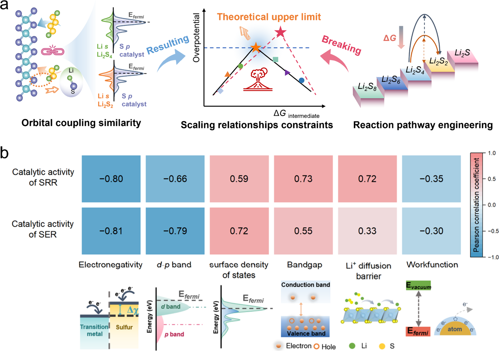
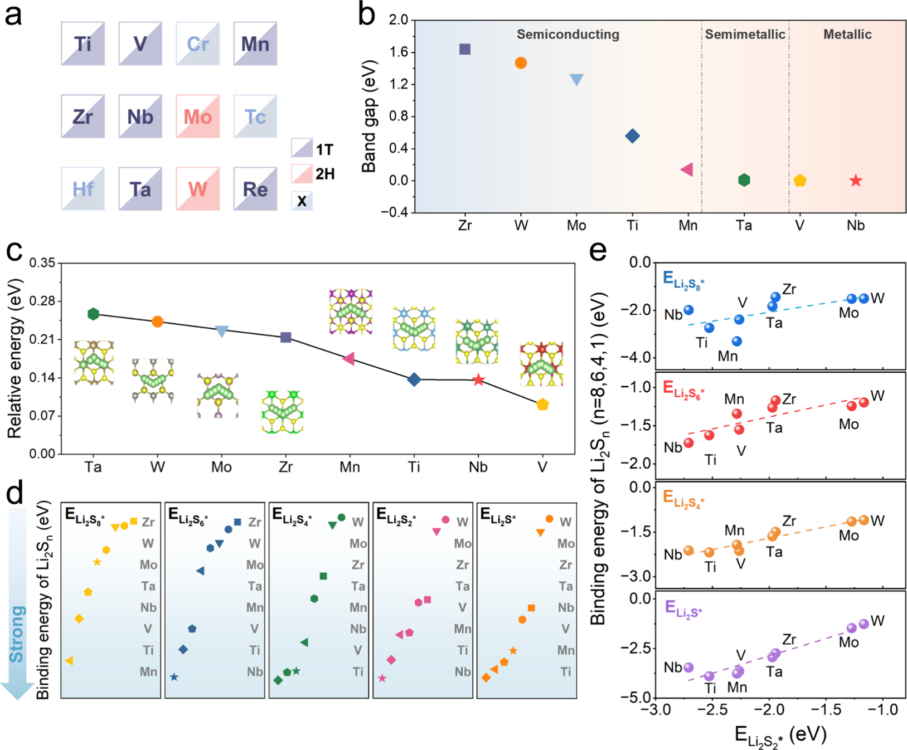
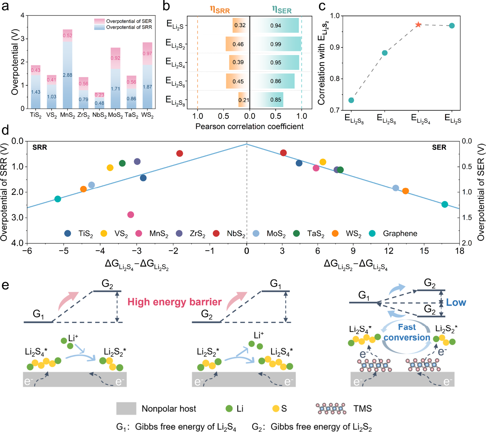
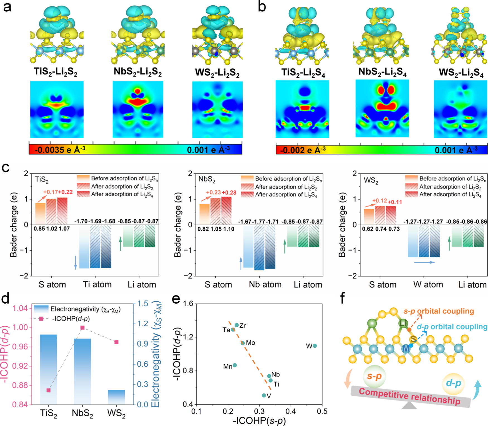
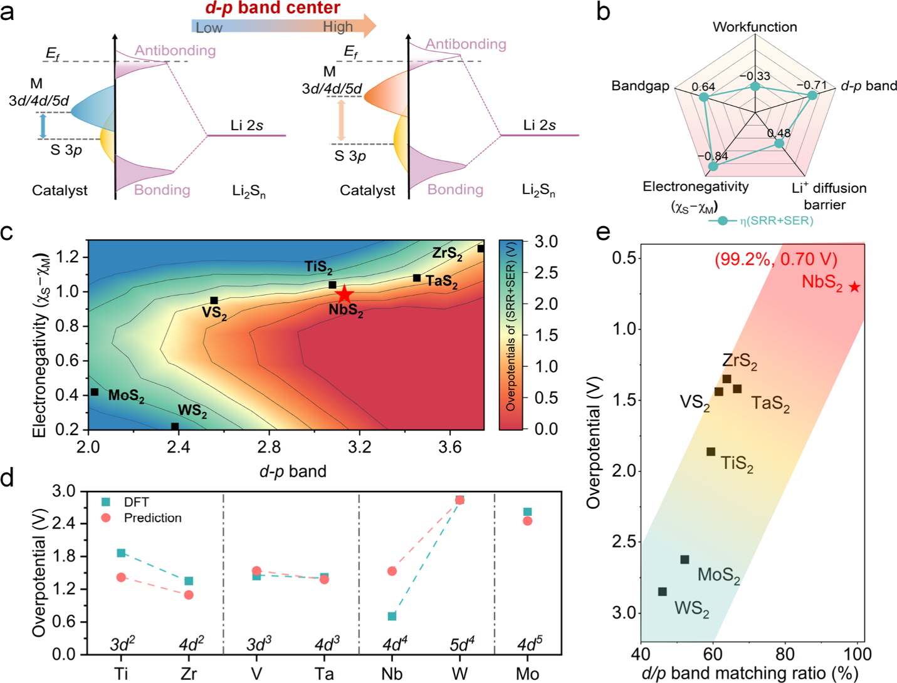
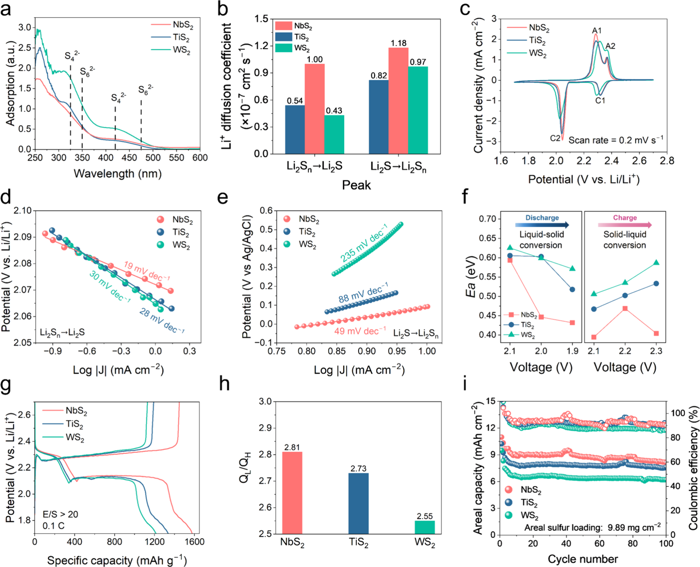

# A Band-Matching Descriptor Breaks Scaling Relations for Sulfur Electrocatalysts

**Zotero key:** EHSLLWP7  
**Attachment key:** JLA7YI9K  
**Journal:** Journal of the American Chemical Society  
**DOI:** 10.1021/jacs.6c02040  
**Task date:** 2026-06-11  
**Source PDF:** paper.pdf

## Why This Paper / 为什么选这篇

**English:** This paper is worth prioritizing because it does not merely report another catalyst-performing-better story. It tries to replace a failing sulfur-electrocatalysis descriptor with a more predictive electronic-structure rule, and it does so with both DFT and battery-level validation. For a computational-chemistry workflow, that makes it much more valuable than a narrow materials-comparison paper.

**中文说明:** 这篇文献值得优先读，不是因为它又报道了一个“某催化剂更强”，而是因为它试图把硫电催化里一个已经失灵的描述符框架换掉，提出一个更可预测的电子结构规则，而且同时给出了 DFT 与电池层面的双重验证。对计算化学训练来说，它比单纯材料横向对比的文章更有学习价值。

## Reading Guide / 读前导读

**English:** Read it in three passes. First, identify the problem: adsorption-energy scaling traps catalyst design. Second, ask how the authors move from single-intermediate adsorption to pathway-dependent free-energy differences. Third, examine how the band-matching ratio compresses several electronic variables into one transferable screening rule.

**中文说明:** 建议分三遍读。第一遍先抓住问题本身：吸附能标度关系把催化剂设计困住了。第二遍重点看作者怎样从“单个中间体吸附”切换到“限速路径自由能差”。第三遍再看 band-matching ratio 如何把多个电子结构变量压缩成一个可迁移的筛选规则。

## Terminology / 术语表

| English | 中文 | Note |
| --- | --- | --- |
| scaling relationship | 标度关系 | 指不同中间体吸附能或反应能之间的线性相关，常把催化剂活性压缩到火山型上限。 |
| band-matching ratio | 能带匹配比 | 本文核心描述符，综合 d-p 带心差、d 轨道周期数和价电子数，衡量电子结构接近最优匹配状态的程度。 |
| TMSs | 过渡金属硫化物 | 本文的模型催化剂家族，包含 TiS2、VS2、MnS2、ZrS2、NbS2、MoS2、TaS2 和 WS2。 |
| LiPSs | 锂多硫化物 | Li-S 电池中的一系列含硫中间体，例如 Li2S8、Li2S6、Li2S4、Li2S2 和 Li2S。 |
| SRR / SER | 硫还原反应 / 硫析出反应 | 分别对应放电和充电方向的关键硫氧化还原步骤。 |
| ICOHP | 积分晶体轨道哈密顿布居 | 用于量化键强度，数值越大通常表示成键越强。 |
| CI-NEB | 爬山弹性带方法 | 用于计算锂离子迁移能垒等过渡路径势垒。 |
| NTR | 成核-转化比 | 用循环伏安积分电量半定量表示 Li2S4 到 Li2S 的利用效率。 |

## Reading Hints / 阅读提示

**English:** Do not read this paper as if it were only about NbS2. The deeper lesson is that catalyst performance is being re-parameterized at the level of orbital matching and pathway bottlenecks rather than at the level of one adsorbate binding energy.

**中文说明:** 不要把这篇文章只读成 “NbS2 为什么最好”。更深的层次是：作者把催化活性的参数化方式，从“某个中间体吸附多强”重新改写成“轨道匹配 + 路径瓶颈”这一级别。

## Page / Section Index

- `p.1-p.2` Problem setup: why sulfur electrocatalysis still suffers from scaling limits
- `p.2-p.4` Model TMS selection, adsorption scaling, and pathway-dependent descriptor
- `p.5-p.7` Electronic-structure origin and formal construction of the band-matching ratio
- `p.7-p.10` Experimental validation: kinetics, activation energy, and full-cell performance
- `p.10-p.13` Associated content, author information, acknowledgements, and references note

## Bilingual Reader / 双语正文

## Metadata And Abstract

**Source:** p.1 S001

**Original:** A Band-Matching Descriptor Breaks Scaling Relations for Sulfur Electrocatalysts. Xin Jiang, Wenjia Qu, Ruiqing Ye, Chuannan Geng, Jiwei Shi, Qiang Li, Zhonghao Hu, Yufei Zhao, Haotian Yang, Weichao Wang, Li Wang, Wei Lv, and Quan-Hong Yang. J. Am. Chem. Soc. 2026, 148, 19048-19060.

**中文:** 题目为《一种能带匹配描述符打破硫电催化中的标度关系》。作者来自天津大学、清华深研院等单位，发表于 2026 年《Journal of the American Chemical Society》。

**Source:** p.1 S002

**Original:** The abstract states that conventional sulfur-electrocatalysis descriptors are still trapped by the adsorption-activity trade-off. The authors propose a d/p band-matching ratio between metal centers and surface sulfur atoms in transition-metal sulfides. This ratio correlates linearly with the overpotentials of sulfur reduction and evolution, and NbS2 reaches 99.2% matching with a minimal bifunctional overpotential of 0.70 V, far better than WS2 at 46.0% and 2.85 V.

**中文:** 摘要的核心信息是：传统硫电催化描述符仍被“吸附越强不一定越活、吸附越弱又抓不住中间体”的权衡困住。作者提出层状过渡金属硫化物中金属中心与表面硫原子的 d/p 能带匹配比，将其作为可预测的电子结构描述符。这个匹配比与硫还原和硫析出反应的过电位呈线性关系，其中 NbS2 的匹配比高达 99.2%，双功能过电位仅 0.70 V，显著优于 WS2 的 46.0% 和 2.85 V。

## Introduction

**Source:** p.1-2 S003

**Original:** The introduction revisits the classical scaling-relation framework derived from adsorption energies and Brønsted-Evans-Polanyi ideas. In Li-S batteries, sulfur conversion involves a 16-electron pathway with solid-liquid-solid transitions, so the kinetics bottleneck and shuttle suppression problem are much harder than in simpler electrocatalytic systems.

**中文:** 引言首先回到经典的标度关系框架：它原本依赖吸附能之间的线性相关以及 BEP 关系来预测催化活性。但在锂硫电池里，硫转化是一个 16 电子、多中间体、伴随固-液-固相变的复杂网络，因此动力学瓶颈和 shuttle 效应远比简单电催化体系更难同时处理。

**Source:** p.1-2 S004

**Original:** The authors argue that for sulfur electrocatalysis, merely tuning the adsorption of one key intermediate cannot break the intrinsic scaling constraint. Polysulfides are chemically unstable and even Li2S4 can disproportionate under realistic concentrations. Therefore, the more direct strategy is pathway engineering around the rate-determining steps and the multiple electronic-structure variables that control them.

**中文:** 作者特别强调：对 Li-S 体系来说，只去调一个“关键中间体”的吸附并不足以打破标度关系。多硫化锂本身就不稳定，例如 Li2S4 在实际工作浓度下会自发歧化成可溶的 Li2S6 和固态 Li2S。所以真正直接的策略是围绕限速步骤做路径工程，同时调控带结构、电负性、功函数、离子电导、表面态密度等多个电子结构变量。

### Fig. 1. Orbital-coupling scaling and descriptor landscape

**Placed near:** p.2 S004

**Source:** p.2 F001

**Original caption:** Figure 1 introduces the conceptual problem. Panel (a) illustrates how orbital-coupling-derived linear correlations among LiPS adsorption energies impose an activity upper bound. Panel (b) summarizes Pearson correlations between sulfur-redox activity and multiple electronic descriptors.

**中文图注:** 图 1 用来搭建全文概念框架。图 (a) 说明由轨道耦合导致的 LiPS 吸附能线性相关会把催化活性压在一个理论上限内；图 (b) 则汇总了硫氧化还原活性与多种电子结构描述符之间的 Pearson 相关性。

**Reading note:** 先看这张图，可以快速理解为什么作者不满足于继续调单个吸附能，而要改写整个描述符框架。

## Results - Revealing The Scaling Relationship

**Source:** p.2-3 S005

**Original:** The study chooses layered transition-metal sulfides from groups IVB to VIIB as model catalysts. Theoretical screening removes HfS2, TcS2, and CrS2 for conductivity, practicality, or overbinding reasons. For the remaining TMSs, the active plane is the (001) surface, band gaps stay within 0-1.64 eV, and lithium-ion diffusion barriers are all below 0.26 eV.

**中文:** 在模型体系选择上，作者把 IVB 到 VIIB 的层状过渡金属硫化物作为统一比较平台。HfS2 因带隙过大、电导差被排除，TcS2 因放射性和难合成被排除，CrS2 则因 Li2S 吸附过强、功函数过高和潜在毒性不适合作为可逆催化剂。保留下来的体系都以 (001) 面作为催化活性面，带隙处于 0-1.64 eV 之间，Li+ 扩散势垒全部低于 0.26 eV。

**Source:** p.3 S006

**Original:** DFT-D3 adsorption calculations show that LiPSs bind to TMS surfaces through Li-S interactions with moderate adsorption energies below -3.90 eV. More importantly, the binding energies of Li2S8, Li2S6, Li2S4, and Li2S all scale linearly with that of Li2S2, meaning that strengthening one intermediate generally strengthens the others as well and traps catalyst optimization inside the scaling relation.

**中文:** DFT-D3 计算表明，LiPS 与 TMS 表面主要通过 Li-S 相互作用吸附，吸附能总体处在适中的强度范围内。但更关键的是：Li2S8、Li2S6、Li2S4 和 Li2S 的吸附能都与 Li2S2 的吸附能呈线性相关。这意味着你一旦增强某一个中间体的吸附，其他中间体往往也会同步增强，优化自由度被重新压回到标度关系里。

### Fig. 2. Screening TMSs and identifying adsorption scaling

**Placed near:** p.3 S006

**Source:** p.3 F002

**Original caption:** Figure 2 combines catalyst screening, conductivity and Li-ion transport checks, adsorption strengths, and the actual scaling plots among sulfur species.

**中文图注:** 图 2 把候选催化剂筛选、电导与锂离子传输、吸附强度以及多硫物种之间的标度关系画在了一起。

**Reading note:** 这张图是“问题被确认存在”的证据：TMS 虽然都能吸附 LiPS，但吸附能之间确实被线性相关束缚。

## Results - Pathway Descriptor

**Source:** p.3-4 S007

**Original:** To get past single-intermediate descriptors, the authors correlate catalytic overpotentials with Gibbs free-energy differences along the conversion pathway. NbS2 gives the lowest SRR and SER overpotentials because it lowers the liquid-solid Li2S4 to Li2S2 barrier in reduction and the Li2S/Li2S2 oxidation barrier in evolution.

**中文:** 为了跳出“单一中间体吸附能”的思路，作者把注意力转向整条转化路径上的自由能差。结果显示，NbS2 在 SRR 和 SER 两个方向上都给出了最低过电位，原因在于它一方面降低了还原方向 Li2S4 到 Li2S2 的液-固转化势垒，另一方面又显著降低了充电方向 Li2S/Li2S2 的氧化势垒。

**Source:** p.4 S008

**Original:** The paper shows that individual LiPS adsorption energies correlate poorly with SRR overpotentials and only partially with SER. In contrast, the Gibbs free-energy differences for Li2S4 -> Li2S2 in SRR and Li2S2 -> Li2S4 in SER track the experimentally identified rate-determining steps and produce a clean linear relationship with activity.

**中文:** 作者进一步证明：单个 LiPS 吸附能与 SRR 过电位的相关性很弱，与 SER 的相关性也只是局部成立。真正与活性形成清晰线性关系的，是 Li2S4 -> Li2S2（放电）和 Li2S2 -> Li2S4（充电）这两个限速转化步骤对应的自由能差。这就是本文所谓的“路径依赖描述符”，它把还原和氧化放在同一个能量学框架下统一评估。

### Fig. 3. Pathway-dependent free-energy descriptor

**Placed near:** p.4 S008

**Source:** p.4 F003

**Original caption:** Figure 3 links sulfur-redox overpotentials to Gibbs free-energy differences for the Li2S4/Li2S2 bottleneck pair, showing how pathway regulation breaks away from single-adsorbate descriptors.

**中文图注:** 图 3 把硫氧化还原过电位与 Li2S4/Li2S2 这一对关键瓶颈步骤的 Gibbs 自由能差联系起来，说明路径调控如何跳出单一吸附物描述符。

**Reading note:** 如果只记住全文一个新思想，应该就是这张图：作者把“活性”重新绑定到了限速路径，而不是绑定到单个中间体。

## Results - Electronic Structure Origin

**Source:** p.5-6 S009

**Original:** Charge-density maps and Bader analysis reveal that NbS2 shows the strongest electronic interaction with Li2S2 and Li2S4. Before adsorption, surface sulfur atoms already gain charge from subsurface metals. After adsorption, Nb continues to donate electrons effectively, whereas Ti weakens and W changes little. This makes NbS2 the most favorable platform for interfacial charge redistribution.

**中文:** 差分电荷密度图和 Bader 电荷分析说明，NbS2 与 Li2S2 / Li2S4 的电子相互作用最强。在吸附前，表面硫原子就已经从次表层金属获得电子；吸附后，Nb 仍然能继续高效向表面硫供电子，而 Ti 的供电子能力下降、W 则几乎不变。因此 NbS2 对界面电荷重分布最有利，这正是其动力学优势的电子结构根源之一。

**Source:** p.6 S010

**Original:** ICOHP analysis shows a competition between subsurface metal-sulfur d-p coupling and Li-S s-p coupling at the adsorbate interface. If M-S bonding is too strong, Li-S interaction becomes too weak and kinetics slow down. If d-p separation is too large, the surface can overadsorb sulfur species and poison itself. The desired regime is balanced orbital coupling.

**中文:** ICOHP 分析把核心竞争关系讲得很清楚：次表层金属-表面硫的 d-p 成键，与吸附物 Li-S 的 s-p 成键之间存在此消彼长。如果 M-S 太强，Li-S 就会被削弱，电子转移变慢；如果 d-p 分离过大，又会导致多硫物种吸附过强、催化位点被“毒化”。所以最优催化并不是越强越好，而是要把轨道耦合调到平衡区间。

### Fig. 4. Charge transfer and orbital-competition origin

**Placed near:** p.5 S010

**Source:** p.5 F004

**Original caption:** Figure 4 visualizes differential charge density, charge transfer, M-S bond strength, Li-S bond strength, and the competition between d-p and s-p orbital coupling.

**中文图注:** 图 4 可视化了差分电荷密度、电荷转移、M-S 键强、Li-S 键强以及 d-p / s-p 轨道耦合之间的竞争关系。

**Reading note:** 这张图负责回答“为什么偏偏是 NbS2 最优”，因此是全文电子结构论证的核心证据。

## Results - Descriptor Construction

**Source:** p.6-7 S011

**Original:** Among several electronic features, the sulfur-metal electronegativity difference and the d-p band-center descriptor show the highest correlation with bifunctional overpotential. Multiple linear regression captures the trend reasonably well, but the authors argue that catalytic activity is really co-governed by electronegativity, band-center alignment, and metal valence-electron configuration.

**中文:** 在多个候选电子结构特征中，表面硫与金属的电负性差，以及 d-p 带心相关参数，与双功能过电位的相关性最高。多元线性回归已经能给出较合理的趋势，但作者认为真正控制活性的，不是某一个特征，而是电负性、带心匹配和金属价电子构型这三者的联合作用。

**Source:** p.7 S012

**Original:** The band-matching ratio is then constructed from three statistically identified ingredients: an optimal d-p band-center difference near 3.11 eV, an optimal d-orbital period number of 4, and an optimal valence-electron count of 5. A higher ratio means the catalyst sits closer to this electronic optimum and therefore tends to give a lower bifunctional overpotential.

**中文:** 接下来作者把“d/p 能带匹配比”正式定义出来：它由三个统计上最关键的电子结构因子共同构成，分别是最优 d-p 带心差约 3.11 eV、最优 d 轨道周期数为 4、以及最优价电子数为 5。一个催化剂的匹配比越高，就说明它的电子结构越接近这个最优状态，因此通常会给出更低的双功能过电位。

### Fig. 5. Building the d/p band-matching descriptor

**Placed near:** p.6-7 S012

**Source:** p.6 F005

**Original caption:** Figure 5 moves from qualitative orbital arguments to a statistical descriptor, relating electronegativity difference, d-p band-center alignment, and the resulting band-matching percentage to theoretical bifunctional overpotential.

**中文图注:** 图 5 把前面的定性轨道图景推进到定量描述符层面，展示了电负性差、d-p 带心匹配和最终能带匹配百分比如何共同决定理论双功能过电位。

**Reading note:** 读完这张图后，基本就能理解 band-matching ratio 为什么被作者视为一个可预测、可外推的设计规则。

**Source:** p.7 S013

**Original:** Across the TMS series, raising the band-matching ratio from 46.0% for WS2 to 99.2% for NbS2 lowers the bifunctional overpotential from 2.84-2.85 V to about 0.70 V. The same descriptor also gives a sensible point for nonlayered Ni3S2, suggesting it is not restricted to one crystal family. The authors therefore interpret 0.701 V as the intrinsic performance ceiling for pristine TMS sulfur redox catalysis.

**中文:** 在整个 TMS 序列里，匹配比从 WS2 的 46.0% 提升到 NbS2 的 99.2%，双功能过电位就从约 2.85 V 降到约 0.70 V。作者还把这个描述符外推到非层状的 Ni3S2，发现它仍然落在线性关系附近，说明这个框架并不局限于某一种晶体家族。因此文中把 0.701 V 解释为原始 TMS 体系硫氧化还原催化的一个内禀性能上限。

## Results - Experimental Validation

**Source:** p.7-8 S014

**Original:** Experimentally, TiS2, NbS2, and WS2 are chosen as representative catalysts. SEM and XRD confirm the expected layered morphologies and phases, and conductivity measurements follow the DFT trend: NbS2 is by far the most conductive, ahead of TiS2 and then WS2.

**中文:** 实验验证部分选取 TiS2、NbS2 和 WS2 作为代表。SEM 和 XRD 都证明它们具有预期的层状形貌和晶相，而电导测试也与 DFT 预测一致：NbS2 的电导最高，TiS2 居中，WS2 最低。

**Source:** p.8-9 S015

**Original:** UV-vis adsorption, lithium-ion diffusion analysis, cyclic voltammetry, and Tafel plots all point in the same direction. NbS2 adsorbs LiPSs more effectively, gives the highest lithium-ion diffusion coefficient, shifts cathodic and anodic peaks toward more favorable potentials, and shows the lowest Tafel slopes for key reduction and oxidation steps.

**中文:** 无论是 UV-vis 吸附实验、Li+ 扩散系数分析、循环伏安还是 Tafel 斜率，证据都指向同一个结论：NbS2 的动力学表现最佳。它对 LiPS 的吸附更强、Li+ 传输更快、阴极和阳极峰位都向更有利的方向移动，而且关键还原/氧化步骤的 Tafel 斜率最低。

**Source:** p.9 S016

**Original:** Decoupled LSV measurements for Li2S4 and Li2S2 conversion, Li2S potentiostatic nucleation tests, and temperature-dependent EIS all confirm that NbS2 lowers both reduction and oxidation barriers. Its activation energy remains the lowest across the relevant potential window, including a value as low as 0.40 eV at 2.3 V for sulfur evolution.

**中文:** 进一步把路径拆开看，针对 Li2S4 和 Li2S2 转化的 LSV、Li2S 恒电位成核实验、以及变温 EIS 全都说明 NbS2 同时降低了还原和氧化两端的势垒。在关键电位窗口里，它的表观活化能始终最低；在 2.3 V 的硫析出方向上甚至低到 0.40 eV。

## Results - Battery Performance

**Source:** p.9-10 S017

**Original:** When integrated into Li-S cells, NbS2 gives the highest specific capacity, the highest QL/QH ratio, the smallest voltage polarization, the best rate capability, and the best cycling stability. Even at 9.89 mg cm-2 sulfur loading, the cell starts from 10.98 mAh cm-2 and retains 90.29% capacity after 100 cycles. A multilayer pouch cell also delivers 2.16 Ah and 401 Wh kg-1 initially.

**中文:** 把催化剂真正放进 Li-S 电池后，NbS2 仍然在所有关键指标上领先：容量最高、QL/QH 最大、充放电极化最小、倍率性能最好、循环稳定性也最好。即使在 9.89 mg cm^-2 的高硫负载下，初始面容量仍达到 10.98 mAh cm^-2，100 圈后还能保留 90.29%。作者还组装了多层软包电池，初始总容量达到 2.16 Ah、比能量达到 401 Wh kg^-1。

### Fig. 6. Kinetics and battery-performance validation

**Placed near:** p.8-9 S017

**Source:** p.8 F006

**Original caption:** Figure 6 gathers UV-vis adsorption, Li-ion diffusion, CV, Tafel analysis, activation energies, galvanostatic profiles, QL/QH ratios, and high-loading cycling stability to validate the descriptor experimentally.

**中文图注:** 图 6 把 UV-vis 吸附、Li+ 扩散、CV、Tafel 分析、活化能、恒流充放电曲线、QL/QH 比值以及高负载循环稳定性集中展示出来，用实验把描述符闭环验证。

**Reading note:** 这不是单纯“性能更好”的展示，而是用多条实验链条去验证前面那套电子结构和路径描述符逻辑。

## Conclusion

**Source:** p.9-10 S018

**Original:** The conclusion is that d/p band matching provides a predictive electronic-structure principle that goes beyond the classical adsorption-activity volcano. By jointly encoding band alignment and metal electronic configuration, it explains why NbS2 lowers sulfur-redox barriers and offers a transferable design rule for broader electrochemical energy-conversion catalysts.

**中文:** 结论部分把全文压缩成一句方法学判断：d/p 能带匹配提供了一个超越传统吸附-活性火山图的预测性电子结构原则。它同时编码了带对齐和金属电子构型，因此不仅解释了为什么 NbS2 能降低硫氧化还原势垒，也给更广泛电化学能量转化催化剂提供了可迁移的设计规则。

## Supporting And End Matter

**Source:** p.10 S019

**Original:** The associated-content section states that the Supporting Information contains the detailed DFT setup, Gibbs free-energy calculations, Pearson-correlation workflow, sulfur-cathode preparation, electrochemical measurements, and supplementary figures and tables.

**中文:** 附加内容部分说明，Supporting Information 里包含了完整的 DFT 计算设置、Gibbs 自由能计算、Pearson 相关分析流程、硫正极制备、电化学测试方法以及全部补充图表。对希望复现实验与计算细节的读者，这些 SI 信息非常关键。

## Author Information And Notes

**Source:** p.10-11 S020

**Original:** Corresponding authors are Li Wang, Wei Lv, and Quan-Hong Yang. The author list is dominated by the Nanoyang Group at Tianjin University, with additional participation from Tsinghua Shenzhen International Graduate School and Nankai University. The authors declare no competing financial interest.

**中文:** 通讯作者为 Li Wang、Wei Lv 和 Quan-Hong Yang。作者团队主体来自天津大学 Nanoyang Group，并有清华大学深圳国际研究生院和南开大学等单位参与。作者声明不存在竞争性经济利益冲突。

## Acknowledgements And References Note

**Source:** p.11-13 S021

**Original:** The acknowledgements list support from the National Natural Science Foundation of China, the National Key R&D Program of China, and Shenzhen and Guangdong funding programs. The reference list then spans catalytic scaling relations, Li-S sulfur-redox mechanisms, and transition-metal-sulfide catalyst studies.

**中文:** 致谢部分列出了国家自然科学基金、国家重点研发计划以及深圳和广东地方项目的支持。其后的参考文献覆盖了催化标度关系、Li-S 硫氧化还原机理、以及过渡金属硫化物催化研究等多个脉络。按本次 reader 规则，参考文献列表会作为书目信息保留，不逐条展开翻译。

## Critical Reading Notes / 批判性阅读提示

**English:** The strongest part of the paper is not the regression itself, but the mechanistic reframing that moves descriptor design from single-intermediate adsorption to pathway bottlenecks. The weakest part is that the final band-matching ratio still depends on a relatively small training set and on a supplementary formula not stress-tested across a very wide materials family.

**中文说明:** 这篇文章最强的地方，不是最后那个回归式本身，而是它把描述符设计从“单一中间体吸附”重新转向“限速路径瓶颈”。相对薄弱的地方在于：最终 band-matching ratio 仍建立在较小的数据集上，而且其完整公式细节主要放在补充信息里，还没有在特别宽的材料家族上经受充分压力测试。

## Related Reading / 相关必读

**English:** See `related_reading.md` for two strongly justified follow-up papers.

**中文说明:** 强相关后续阅读见 `related_reading.md`，本次只保留两篇真正有承接关系的文献。

## Extraction / Layout Notes / 抽取与排版说明

**English:** Reference entries were not translated one by one. Supporting Information was not independently reprocessed. Figure assets come from embedded main-figure images in the publisher PDF.

**中文说明:** 参考文献没有逐条翻译，Supporting Information 也没有独立重建；正文中的图像资产直接提取自出版社 PDF 内嵌主图。
