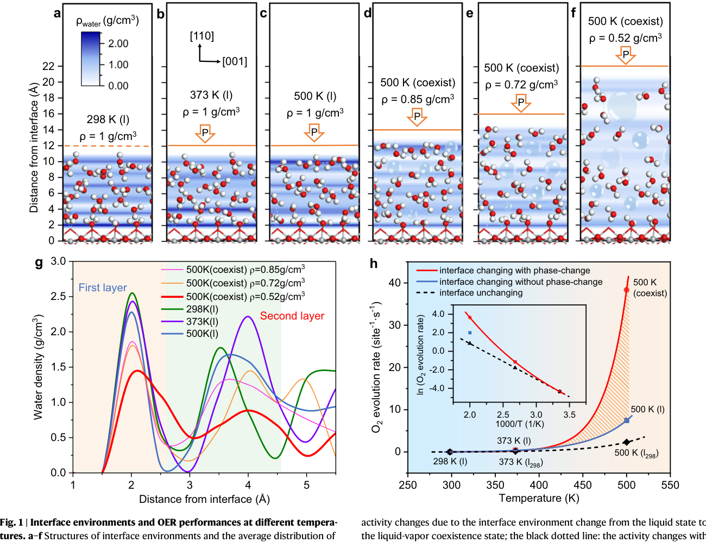
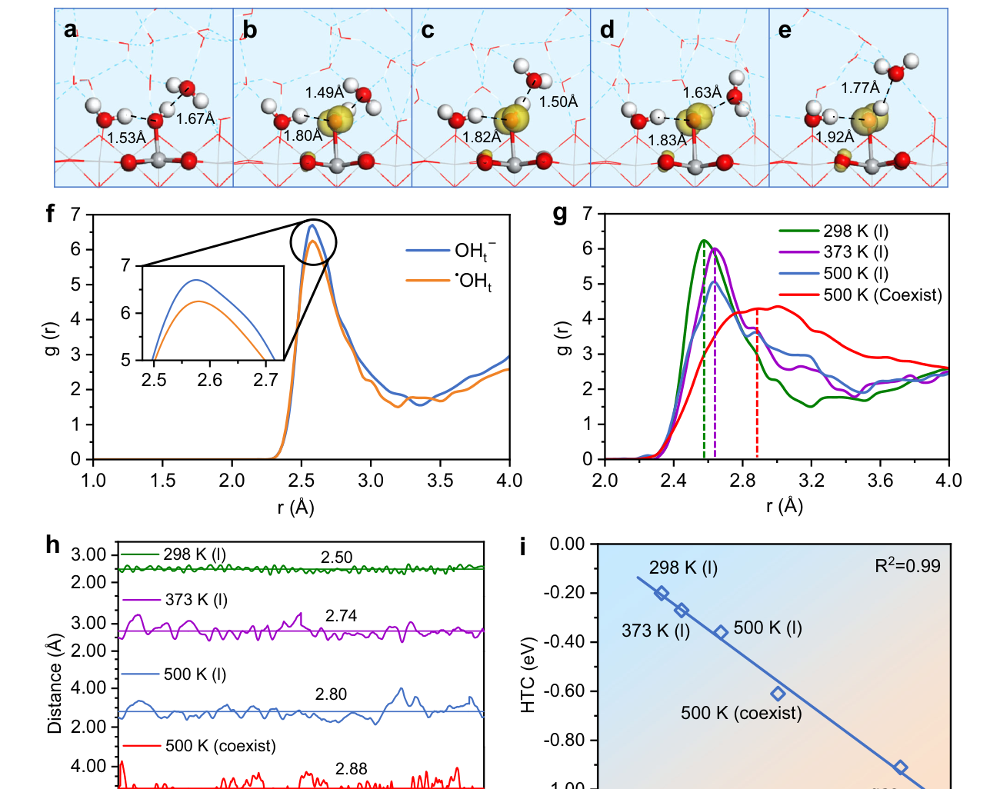
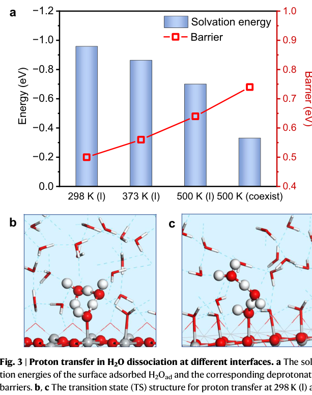
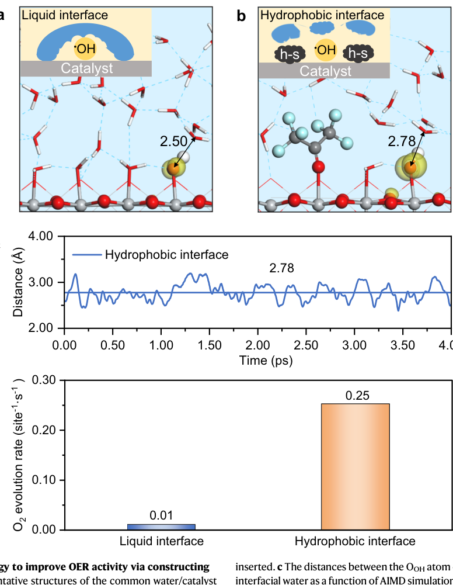

# Bubble-water/catalyst triphase interface microenvironment accelerates photocatalytic OER via optimizing semi-hydrophobic OH radical

**Zotero key:** IS6WHUPC
**Attachment key:** 3AESJZFE
**Journal:** Nature Communications
**DOI:** 10.1038/s41467-024-46749-z
**Publication date:** 2024-03-15
**Source PDF:** paper.pdf

## Why This Paper / 为什么选这篇

**English:** This paper is worth backfilling because it shifts photocatalytic OER analysis from a simple Arrhenius temperature picture to an interface-microenvironment picture. For your catalysis reading workflow, it is a useful example of how AIMD, microkinetics, and interface hydrogen-bond structure can be tied together.

**中文:** 这篇值得补进网页，因为它不是把高温促进 OER 简单归因于 Arrhenius 温度效应，而是把问题转到界面微环境：气泡-水-催化剂三相界面如何改变氢键网络、OH 自由基疏水性和 O-O 偶联。对你后面读光催化/界面催化文章很有帮助。

## Reading Guide / 读前导读

**English:** Read it in three passes: first separate the traditional temperature effect from the microenvironment effect; then follow how the authors identify OHt formation as rate-controlling; finally read the hydrophobic-modification proposal as a design rule rather than only a validation example.

**中文:** 建议分三遍读：第一遍区分传统温度效应和界面微环境效应；第二遍看作者如何用 DRC 找到 OHt 生成这一步；第三遍把疏水物质调控 TiO2 界面的部分当成设计规则，而不是单纯的验证案例。

## Terminology / 术语表

| English | 中文 | Note |
|---|---|---|
| photocatalytic water splitting, PWS | 光催化水分解 | 太阳能转化为化学能的核心反应；本文关注其 OER 半反应。 |
| oxygen evolution reaction, OER | 析氧反应 | 水氧化生成 O2 的四电子过程，通常是水分解的动力学瓶颈。 |
| bubble-water/catalyst triphase interface | 气泡-水-催化剂三相界面 | 高温下液-气共存造成的局部界面环境，是本文最重要的微环境变量。 |
| semi-hydrophobic OH radical | 半疏水 OH 自由基 | 界面氢键网络变松后形成的关键自由基状态，促进 O-O 偶联。 |
| degree of rate control, DRC | 速率控制度 | 判断哪一步 elementary step 对总反应速率影响最大。 |
| AIMD | 从头算分子动力学 | 用于描述水/TiO2 界面动态氢键网络和自由基环境。 |
| BEP relationship | Brønsted-Evans-Polanyi 关系 | 用于估计空穴迁移能垒与反应能之间的关联。 |

**Source:** p.1 S001

**Original:** Article https://doi.org/10.1038/s41467-024-46749-z Bubble-water/catalyst triphase interface microenvironment accelerates photocatalytic OER via optimizing semihydrophobic OH radical Photocatalytic water splitting (PWS) as the holy grail reaction for solar-tochemical energy conversion is challenged by sluggish oxygen evolution reaction (OER) at water/catalyst interface. Experimental evidence interestingly shows that temperature can significantly accelerate OER, but the atomic-level mechanism remains elusive in both experiment and theory. In contrast to the traditional Arrhenius-type temperature dependence, we quantitatively prove for the first time that the temperature-induced interface microenvironment variation, particularly the formation of bubble-water/TiO2(110) triphase interface, has a drastic influence on optimizing the OER kinetics. We demonstrate that liquid-vapor coexistence state creates a disordered and loose hydrogen-bond network while preserving the proton transfer channel, which greatly facilitates the formation of semi-hydrophobic •OH radical and O-O coupling, thereby accelerating OER. Furthermore, we propose that adding a hydrophobic substance onto TiO2(110) can manipulate the local microenvironment to enhance OER without additional thermal energy input. This result could open new possibilities for PWS catalyst design.

**中文:** 文章 https://doi.org/10.1038/s41467-024-46749-z 气泡水/催化剂三相界面微环境通过优化半疏水性 OH 自由基加速光催化 OER 光催化水分解 (PWS) 作为太阳能-化学能量转换的圣杯反应，但受到水/催化剂界面缓慢析氧反应 (OER) 的挑战。有趣的是，实验证据表明温度可以显着加速 OER，但原子级机制在实验和理论中仍然难以捉摸。与传统的阿伦尼乌斯型温度依赖性相比，我们首次定量证明了温度引起的界面微环境变化，特别是气泡水/TiO2(110)三相界面的形成，对优化OER动力学具有巨大影响。我们证明，液-气共存状态产生了无序且松散的氢键网络，同时保留了质子转移通道，这极大地促进了半疏水·OH自由基和O-O偶联的形成，从而加速了OER。此外，我们建议在 TiO2(110) 上添加疏水性物质可以操纵局部微环境以增强 OER，而无需额外的热能输入。这一结果可能为 PWS 催化剂设计开辟新的可能性。

**Source:** p.1 S002

**Original:** Understanding and optimizing the water/catalyst interface, which offers a unique microenvironment for reactions to occur, is fundamentally important and highly attractive in the field of heterogeneous catalysis and others1–4. In the vitally important case of photocatalytic water splitting to produce hydrogen and oxygen occurring at aqueous interface (corresponding to hydrogen/oxygen evolution reaction, HER/OER)5–11, recent studies suggested that the catalytic activity of the kinetically sluggish OER process can interestingly undergo a substantial increase at elevated temperatures12–16; specifically, the reaction rate in the boiled aqueous solution generated at high temperature is observably higher than that at the liquidwater/catalyst interface at room temperature4,17. This has attracted

**中文:** 了解和优化水/催化剂界面为反应的发生提供了独特的微环境，在多相催化和其他领域非常重要且极具吸引力1-4。在水界面发生光催化水分解产生氢气和氧气的极其重要的情况下（对应于析氢/析氧反应，HER/OER）5-11，最近的研究表明，动力学缓慢的 OER 过程的催化活性在高温下可以有趣地大幅增加12-16；具体而言，在高温下产生的沸腾水溶液中的反应速率明显高于室温下液态水/催化剂界面处的反应速率4,17。这吸引了

**Source:** p.1 S003

**Original:** widespread research interest and generated considerable debate. Generally, the origin of activity enhancement with temperature (T) is ascribed to the accelerated reaction kinetics using the Arrhenius equation, k = A × exp(−Ea/RT), in which the rate constant, k, is enlarged as T increases, while the other parameters remain constants (defined as the traditional temperature effect hereinafter)18–20. However, it was also reported that even with the increased temperature, there is almost no photocatalytic activity in the steamwater phase environment under normal pressure21, possibly due to the fact that the vapor phase in a macro-/micro-bubble environment is significantly less dense than liquid, and the number of molecules close to the active sites and the reaction probabilities are lower.

**中文:** 广泛的研究兴趣并引发了相当大的争论。一般来说，活性随温度（T）增强的起源归因于使用阿伦尼乌斯方程 k = A × exp（−Ea/RT）的加速反应动力学，其中速率常数 k 随着 T 的增加而增大，而其他参数保持恒定（下文定义为传统的温度效应）18-20。然而，也有报道称，即使温度升高，常压下的汽水相环境也几乎不具有光催化活性21，这可能是由于宏/微气泡环境中的气相密度明显低于液体，并且靠近活性位点的分子数量和反应概率较低。

**Source:** p.1-2 S004

**Original:** 1State Key Laboratory of Green Chemical Engineering and Industrial Catalysis, Centre for Computational Chemistry and Research Institute of Industrial Catalysis, East China University of Science and Technology, Shanghai 200237, China. 2School of Chemistry and Chemical Engineering, Queen’s University Belfast, Belfast, UK. 3These authors contributed equally: Guanhua Ren, Min Zhou. e-mail: hfwang@ecust.edu.cn Overall, it is therefore imperative to understand the complete mechanism underlying these phenomena. So far, several experiments have provided evidence of enhanced OER activity at elevated temperatures beyond the traditional temperature factor. Nurlaela et al. observed a decrease in the apparent activation energy of OER under visible light irradiation within the temperature range of 275−348 K19. Similarly, Li and colleagues utilized a photothermal substrate to convert liquid water into steam-water, revealing significantly higher OER activity at the steam-water/catalyst interface compared to the liquid-water/catalyst interface4,17. On the other hand, subsequent investigations have also demonstrated that water splitting can be improved by increasing the water coverage and reaction pressure in the steamwater reaction environment21,22. These findings highlight the significance of the liquid/solid interface microenvironment in driving photocatalytic activity enhancement, indicating that the traditional temperature effect alone cannot fully explain the observed activity enhancement. Noticeably, Wang et al. very recently developed an interesting floatable platform that exhibits impressive photocatalytic efficiency by facilitating the reaction at air-water biphase environment23. Therefore, it is of paramount importance to understand the chemical role of the interface microenvironment in general. Specifically, it is pivotal to disclose the relationship among the interface microenvironment, reaction temperature, and reaction activity in the photocatalytic process. Although the microenvironment may be expected to be of importance, to access how significant a role it can play in reaction processes is very challenging. Experimentally, it is extremely demanding to probe into the dynamic behavior of interface structures and reactions at the water/catalyst interface in situ. Theoretically, to model the systems with such complexity, particularly the photocatalytic reaction occurring on the excited semiconductor surface, is equally challenging due to the difficulties in simulating surface radical intermediates, the aqueous environment, and the complex reaction network. Overall, there are still crucial questions that need to be answered explicitly: (i) How does the temperature affect the liquid/solid interface environment? (ii) As compared to the traditional temperature effect, how is the photocatalytic OER activity influenced by the distinct interfaces under elevated temperatures and what is the inherent mechanism for such an activity response? (iii) Is it possible to manipulate the interface environment to boost OER at less thermal energy input (i.e., avoiding high temperature), and if so, what approach can be employed? Herein, we chose the most widely studied rutile-TiO2(110) surface24,25 as the photocatalyst and compared the OER activities at different water/TiO2(110) interface environments synchronized with different temperatures, utilizing the recently developed multi-point averaging molecular dynamics (MPA-MD)26 together with the first principles based microkinetic analysis27. An unexpected interface environment effect on the performance of OER caused by temperatures was discovered. We proved that the •OH radical as the pivotal intermediate of photocatalytic OER exhibits a unique relative hydrophobic feature, and the interface environment change due to temperature change influence the formation of •OH radical. We demonstrated that the microenvironment plays a huge role in chemical reactions, and the liquid-vapor coexistence environment induced by elevating temperature is pivotal to improve the OER activity. Moreover, we show that by introducing the hydrophobic organic molecules on the surface to modify the reaction microenvironment at the interface, the efficiency of photocatalytic OER can be improved by a factor of 25 at room temperature. This work represents one of the first attempts to quantitatively determine the water/catalyst interface microenvironment effect at the atomic level, and open up a new avenue for optimizing catalytic performances by manipulating interface microenvironments.

**中文:** 1华东理工大学计算化学中心、工业催化研究所绿色化工与工业催化国家重点实验室,上海 200237 2贝尔法斯特女王大学化学与化学工程学院，英国贝尔法斯特。 3 这些作者做出了同等贡献：任冠华、周敏。电子邮件：hfwang@ecust.edu.cn 总的来说，有必要了解这些现象背后的完整机制。到目前为止，一些实验已经提供了在超出传统温度因素的高温下 OER 活性增强的证据。努尔莱拉等人。观察到在 275−348 K19 的温度范围内可见光照射下 OER 的表观活化能降低。同样，Li 及其同事利用光热基质将液态水转化为蒸汽-水，结果表明，与液态-水/催化剂界面相比，蒸汽-水/催化剂界面的 OER 活性明显更高4,17。另一方面，随后的研究也表明，可以通过增加汽水反应环境中的水覆盖率和反应压力来改善水分解21,22。这些发现强调了液/固界面微环境在驱动光催化活性增强中的重要性，表明传统的温度效应单独不能完全解释观察到的活性增强。值得注意的是，王等人。最近开发了一种有趣的浮动平台，通过促进空气-水双相环境中的反应，表现出令人印象深刻的光催化效率23。因此，了解界面微环境的化学作用至关重要。具体而言，揭示光催化过程中界面微环境、反应温度和反应活性之间的关系至关重要。尽管微环境可能很重要，但要了解它在反应过程中发挥的重要作用却非常具有挑战性。在实验上，原位探究水/催化剂界面的界面结构和反应的动态行为要求极高。理论上，由于模拟表面自由基中间体、水环境和复杂的反应网络的困难，对如此复杂的系统进行建模，特别是在激发的半导体表面上发生的光催化反应同样具有挑战性。总的来说，仍然有一些关键问题需要明确回答：（i）温度如何影响液/固界面环境？ (ii) 与传统的温度效应相比，高温下不同界面如何影响光催化OER活性？这种活性响应的内在机制是什么？ (iii) 是否可以操纵界面环境以较少的热能输入（即避免高温）来提高 OER，如果可以，可以采用什么方法？在此，我们选择研究最广泛的金红石-TiO2(110)表面24,25作为光催化剂，并利用最近开发的多点平均分子动力学（MPA-MD）26以及基于第一原理的微动力学分析27，比较了不同水/TiO2(110)界面环境下与不同温度同步的OER活性。发现了温度对 OER 性能产生意想不到的界面环境影响。我们证明·OH自由基作为光催化OER的关键中间体表现出独特的相对疏水特性，并且温度变化引起的界面环境变化影响·OH自由基的形成。我们证明了微环境在化学反应中起着巨大的作用，并且升高温度引起的液汽共存环境对于提高OER活性至关重要。此外，我们表明通过在表面引入疏水性有机分子来改变反应微环境通过该界面，室温下光催化OER的效率可提高25倍。这项工作代表了在原子水平上定量确定水/催化剂界面微环境效应的首次尝试之一，并为通过操纵界面微环境来优化催化性能开辟了新途径。

**Source:** p.2 S005

**Original:** Results Interface environments and OER activities at different temperatures Figure 1a-f depict the specific water/TiO2(110) interface environments at different temperatures, showcasing characteristic snapshots from the quasi-equilibrium stage obtained from the AIMD simulations (covering the last ~4 ps duration). The profiles show the average water density distributions as a function of the O-catalyst distance perpendicular to TiO2(110), and the water density distribution profiles of first two layers are compared in Fig. 1g. Note that in this study, the interface environments at different temperatures are denoted as “temperature (state)”; for example, 298 K (l) represents the liquid-state water at 298 K, and 500 K (coexist) is the coexistence state of vapor and liquid at 500 K. It can be seen that as the temperature increases, the interfacial water network distribution is affected to a different extent. At room temperature (Fig. 1a), water molecules close to TiO2(110) bind to the Ti5c sites and form the first-layer chemisorbed water, and the second layer of water molecules contact the first water layer. The other water layers above the second layer resemble the bulk aqueous water, with the densities oscillating around the density of bulk water (~1 g/ cm3). As the temperature increases before reaching the liquid-gas phase transition (at 373 K (l); Fig. 1b), there is a slight decline in the density of the first layers, while the second layer water shifts up and the density increase slightly. At the 500 K (l) state stabilized at a high pressure (~27.8 atm), the hydrogen bonds are more damaged and the water tends to move upwards, so that the densities of the first and second layers show a decrease compared to that at 373 K (l). For comparison, we simulated the vaporization process of liquid water at 500 K under a high-pressure condition (Fig. 1c−f). As can be seen from Fig. 1d−f, as the external pressure decreases from 500 K (l), the volume of the surface water layer increases and the hydrogen bonding network is further damaged; this results in a dramatic decrease not only in the the density of the firstand second-layer water, but also in the bulk water density. Moreover, there is a clear reduction in the average number of hydrogen bonds per water molecule, accompanied by a noticeable increase in the average length of these hydrogen bonds (Supplementary Fig. 1). Consequently, the micro-bubbles diffuse stochastically in the aqueous region. It is worth emphasizing that as the temperature increases and the water density decreases, the surface coverage of water decreases and the bond length of water adsorption lengthens (see the statistical analysis shown in Supplementary Fig. 2 and Table 1). To comprehensively disclose the interface effects on the OER performance caused by temperature changes, it is necessary to disentangle and analyze the individual influencing factor, namely the traditional temperature effect and the microenvironment of water/ TiO2(110) interface. Firstly, the enthalpy changes of all the elementary steps in the OER process at different water/TiO2(110) interfaces and the related reaction barriers were calculated by utilizing the MPA-MD methodology (Supplementary Table 2). Note that the widely accepted reaction mechanism of photocatalytic OER on TiO2(110) involves several key steps (see reaction scheme in Supplementary Fig. 3)26. Initially, the dissociation of the adsorbed water (H2Oad) occurs first via proton transfer (PT), forming a Zundel-like hydrated proton (H5O2 +) in the water environment and generating terminal hydroxyl OHt −on the surface Ti5c site. Next, the photogenerated hole transferred from the bulk TiO2 to the surface can be trapped at OHt −, leading to the formation of the key intermediate •OHt radical (OHt −+ h+ →•OHt). Further, the •OHt radical undergoes deprotonation and yields another key Ot −

**中文:** 结果不同温度下的界面环境和 OER 活性图 1a-f 描述了不同温度下的特定水/TiO2(110) 界面环境，展示了从 AIMD 模拟获得的准平衡阶段的特征快照（涵盖最后约 4 ps 的持续时间）。该剖面显示了平均水密度分布作为垂直于 TiO2(110) 的 O 催化剂距离的函数，前两层的水密度分布剖面在图 1g 中进行了比较。注意，在本研究中，不同温度下的界面环境被表示为“温度（状态）”；例如，298 K(l)代表298 K时的液态水，500 K(共存)是500 K时蒸气和液体的共存状态。可见，随着温度的升高，界面水网分布受到不同程度的影响。在室温下（图1a），靠近TiO2（110）的水分子与Ti5c位点结合，形成第一层化学吸附水，第二层水分子与第一层水接触。第二层上方的其他水层类似于散装水，其密度围绕散装水的密度（~1 g/ cm3）振荡。随着温度在达到液-气相变之前升高（373 K（l）；图1b），第一层的密度略有下降，而第二层的水向上移动，密度略有增加。在高压（~27.8 atm）稳定的500 K（l）状态下，氢键受到更多破坏，水倾向于向上移动，因此第一层和第二层的密度与373 K（l）相比呈现下降。为了进行比较，我们模拟了高压条件下500 K液态水的汽化过程（图1c-f）。从图1d−f可以看出，随着外部压力从500 K(l)开始降低，表面水层体积增大，氢键网络进一步遭到破坏；这不仅导致第一层和第二层水的密度急剧下降，而且导致水的体积密度急剧下降。此外，每个水分子的平均氢键数量明显减少，同时这些氢键的平均长度显着增加（补充图1）。因此，微气泡在水性区域中随机扩散。值得强调的是，随着温度升高和水密度降低，水的表面覆盖率降低，水吸附的键长延长（参见补充图2和表1中的统计分析）。为了全面揭示温度变化对OER性能的界面影响，有必要对单个影响因素进行梳理和分析，即传统的温度效应和水/TiO2(110)界面的微环境。首先，利用MPA-MD方法计算了OER过程中不同水/TiO2(110)界面上所有基本步骤的焓变以及相关的反应势垒（补充表2）。请注意，广泛接受的 TiO2(110) 光催化 OER 反应机制涉及几个关键步骤（参见补充图 3 中的反应方案）26。最初，吸附水（H2Oad）首先通过质子转移（PT）发生解离，在水环境中形成Zundel状水合质子（H5O2 +），并在表面Ti5c位点上生成末端羟基OHt - 。接下来，从本体 TiO2 转移到表面的光生空穴可以被 OHt - 捕获，从而形成关键中间体•OHt 自由基（OHt -+ h+ →•OHt）。此外，•OHt 自由基经历去质子化并产生另一个关键的 Ot -

**Source:** p.2-3 S006

**Original:** radical on Ti5c site through a similar PT mode (•OHt →Ot −+ H+). The newly produced Ot −radical can couple with another adjacent Ot −to yield O2 2−, which can eventually generate O2 by capturing two successive holes (O2 2−+ 2 h+ →O2). By utilizing the obtained energetics of each elementary step, we are able to conduct microkinetic analyses to quantitatively evaluate the OER activity at different interfacial environments. Initially, we estimated the OER rates by employing the steady-state microkinetic model, in which the concentration of surface-reaching holes (h+) was assumed to be ~10−9 monolayer (ML)26. Figure 1h shows the calculated OER rates at different water/TiO2(110) interfaces as a function of temperature. From 298 K (l) to 373 K (l), the photocatalytic OER activity increases with temperatures as expected, with an increase from 0.01 site−1·s−1 to 0.43 site−1·s−1; when the temperature is further increased to 500 K while maintaining the liquid-phase state, the OER rate at 500 K (l) escalates to 7.48 site−1·s−1. For comparison, if we hypothetically postulate that the interfacial environment remains unchanged at elevated temperature (as at 298 K (l)) to assess the impact of interfacial conditions, the calculated OER rates at 373 K and 500 K (marked as 373 K (l298) and 500 K (l298) in Fig. 1h, respectively) are only 0.15 site−1·s−1 and 2.32 site−1·s−1, respectively; in this situation, there is a linear relationship between the reciprocal of the temperature (1/T) and these logarithmic rates of 298 K (l), 373 K(l298) and 500 K (l298) (Fig. 1h, black dotted line), as expected from the common Arrhenius equation, k = A × exp( −Ea/RT), where

**中文:** 通过类似的PT模式(•OHt →Ot −+ H+)在Ti5c位点上产生自由基。新产生的Ot - 自由基可以与另一个相邻的Ot - 结合产生O2 2− ，最终可以通过捕获两个连续的空穴（O2 2−+ 2 h+ →O2）来生成O2 。通过利用每个基本步骤获得的能量，我们能够进行微动力学分析，以定量评估不同界面环境下的 OER 活性。最初，我们通过采用稳态微动力学模型来估计 OER 速率，其中到达表面的空穴 (h+) 的浓度假设为 ~10−9 单层 (ML)26。图 1h 显示了不同水/TiO2(110) 界面处计算的 OER 速率与温度的函数关系。从 298 K (l) 到 373 K (l)，光催化 OER 活性随着温度的升高而增加，如预期的那样，从 0.01 site−1·s−1 增加到 0.43 site−1·s−1；当温度进一步升高至 500 K 同时保持液相状态时，500 K (l) 下的 OER 速率升至 7.48 site−1·s−1。为了进行比较，如果我们假设界面环境在高温（298 K (l)）下保持不变以评估界面条件的影响，则计算出的 373 K 和 500 K 下的 OER 速率（在图 1h 中分别标记为 373 K (l298) 和 500 K (l298)）仅为 0.15 site−1·s−1 和 2.32分别为site−1·s−1；在这种情况下，温度的倒数 (1/T) 与 298 K (l)、373 K(l298) 和 500 K (l298) 的对数速率之间存在线性关系（图 1h，黑色虚线），正如常见的阿伦尼乌斯方程所预期的那样，k = A × exp( −Ea/RT)，其中

**Source:** p.3 S007

**Original:** Ea is essentially a constant. In reality, however, it can be seen that there is an intriguing deviation from linearity in the temperature dependence of the OER activity, as indicated by the upward curvature of the red curve in Fig. 1h. These results reveal that the activation energies are altered with increasing temperature due to the influence of interfacial environment. Remarkably, when the liquidwater partially vaporizes and a vapor-liquid coexistence state (referred to as the 500 K (coexist) condition) is formed, the OER activity undergoes a dramatic improvement and reaches 38.36 site−1·s−1. This value is approximately 16.5 times higher than that observed at the same temperature without interfacial changes (2.32 site−1·s−1). It is worth noting that we also performed an investigation into the influence of the concentration surface-reaching hole on the OER rate, covering a range from 10−10 to 1 ML (Supplementary Fig. 4). Remarkably, the system consistently exhibits excellent OER activity under the 500 K (coexist) condition, which aligns with the activity trend described in Fig. 1h. These findings highlight the importance of interfacial microenvironments, in addition to temperature, in influencing the reaction rates.

**中文:** Ea 本质上是一个常数。然而，实际上，可以看出 OER 活性的温度依赖性存在有趣的线性偏差，如图 1h 中红色曲线的向上弯曲所示。这些结果表明，由于界面环境的影响，活化能随着温度的升高而改变。值得注意的是，当液态水部分汽化并形成汽液共存状态（称为500 K（共存）条件）时，OER活性显着提高并达到38.36 site−1·s−1。该值比相同温度下没有界面变化时观察到的值（2.32 site−1·s−1）高约 16.5 倍。值得注意的是，我们还研究了浓度表面到达孔对 OER 速率的影响，覆盖范围从 10−10 到 1 ML（补充图 4）。值得注意的是，该系统在 500 K（共存）条件下始终表现出优异的 OER 活性，这与图 1h 中描述的活性趋势一致。这些发现强调了除了温度之外界面微环境在影响反应速率方面的重要性。

### Fig. 1 | Interface environments and OER performances at different temperatures

**Placed near:** p.3 S007

**Source:** p.3 F001

**Original caption:** Interface environments and OER performances at different temperatures. Panels a-f show structures of interface environments and water density distribution along TiO2(110) under different temperature and density conditions. Panel g compares water density profiles in the first two layers. Panel h shows calculated OER rates at different water/TiO2(110) interfaces as a function of temperature, separating interface phase-change effects from normal temperature effects.

**中文图注:** 不同温度下的界面环境和OER性能。图 a-f 显示了不同温度和密度条件下沿 TiO2(110) 的界面环境结构和水密度分布。 g 面板比较了前两层的水密度分布。图 h 显示了计算出的不同水/TiO2(110) 界面的 OER 速率与温度的函数关系，将界面相变效应与常温效应分开。

**Reading note / 阅读提示:** 该图建立了中心观察结果：液汽共存界面改变了水密度和氢键，OER速率在500 K共存条件下急剧上升。

**Source:** p.3 S008

**Original:** interface changing with phase-change interface changing without phase-change interface unchanging Fig. 1 | Interface environments and OER performances at different temperatures. a−f Structures of interface environments and the average distribution of water molecules along the [110] direction on TiO2(110) at different water-density (ρ) and temperature conditions by controlling the external pressures, corresponding to 1 g/ml at 298 K, 1 g/ml at 373 K, 1 g/ml at 500 K, 0.85 g/ml at 500 K, 0.72 g/ml at 500 K, 0.52 g/ml at 500 K, respectively. Gray: Ti; red: O; white: H. g The water density distribution profiles of the first two layers. h Calculated OER rates at different water/TiO2(110) interfaces as a function of temperature. The red curve: the

**中文:** 有相变界面变化 无相变界面变化 界面不变 图 1 |不同温度下的界面环境和OER性能。 a−f 通过控制外部压力，在不同水密度（ρ）和温度条件下，界面环境的结构以及TiO2（110）上水分子沿[110]方向的平均分布，对应于298 K时1 g/ml、373 K时1 g/ml、500 K时1 g/ml、500 K时0.85 g/ml、500时0.72 g/ml K，500 K 时分别为 0.52 g/ml。灰色：钛；红色：O；白色：H. g 前两层的水密度分布剖面。 h 计算不同水/TiO2(110) 界面处的 OER 速率与温度的函数关系。红色曲线：

**Source:** p.3 S009

**Original:** activity changes due to the interface environment change from the liquid state to the liquid-vapor coexistence state; the black dotted line: the activity changes with the interface environment unchanged (liquid state, the same as 298 K (l)). The 500 K (coexist) corresponds to the liquid-vapor coexistence state at 500 K at ρ = 0.52 g/cm3. The shadow area shows the contribution of interface phase-change to activity enhancement. The inset shows the natural logarithmic plots of the OER rate at different water/TiO2(110) interfaces as a function of reciprocal temperature.

**中文:** 由于界面环境从液态变为液汽共存状态而导致活性变化；黑色虚线：界面环境不变（液态，同298K(l)）时活性变化。 500 K（共存）对应于 500 K、ρ = 0.52 g/cm3 时的液汽共存状态。阴影区域显示界面相变对活性增强的贡献。插图显示了不同水/TiO2(110) 界面的 OER 速率随温度倒数变化的自然对数图。

**Source:** p.4 S010

**Original:** Fig. 2 | The key characteristics of •OHt at different interfaces. Isosurfaces of the spin density (0.01 au) for the optimum interface structures: (a) hydroxide anion OHt −; (b−e) •OHt radical at different conditions: 298 K (l), 373 K (l), 500 K (l), 500 K (coexist), respectively. f Radial distribution function (RDF, g(r)) for the OHt −and •OHt radial at different conditions varying with the distance of Ow-OOH pair. h The distances of the OOH atom of •OHt and the Ow atom of nearest interface water as a function of simulation time. The horizontal line gives the average value of distance fluctuation. i The relationship between the hole trapping capacity (HTC) of •OHt and the solvation energy of •OHt at different interfaces.

**中文:** 图2| •OHt 在不同界面的关键特性。最佳界面结构的自旋密度（0.01 au）等值面：（a）氢氧根阴离子 OHt -； (b−e) ·不同条件下的OHt自由基：分别为298 K (l)、373 K (l)、500 K (l)、500 K（共存）。 f 不同条件下 OHt - 和•OHt 径向的径向分布函数（RDF，g(r)）随 Ow-OOH 对距离的变化而变化。 h •OHt 的OOH 原子与最近界面水的Ow 原子的距离作为模拟时间的函数。水平线给出了距离波动的平均值。 i 不同界面处•OHt 的空穴捕获能力(HTC) 与•OHt 溶剂化能之间的关系。

**Source:** p.4 S011

**Original:** Characteristics of •OHt radical and origin of OER activity modulated by interface environment To unveil the mechanism of interface microenvironment effect on the OER rate, the degree of rate control (DRC)27–29 of each elementary step was analyzed to identify the rate-limiting step. It was found that under ambient condition, the hole trapping at the terminal hydroxyl OHt −to form •OHt has the largest DRC value (Supplementary Fig. 5), indicating that this step is the rate-limiting step at 298 K (l). Comparing the DRC values of this step with those from other conditions, it can be seen that the formation of •OHt is dominant in all cases. Therefore, further investigation was conducted to explore the key characteristics of the •OHt radical. Firstly, we analyzed the H-bond configurations of an adsorbed hydroxyl anion (OHt −) and a hydroxyl radical (•OHt) at the water/ TiO2(110) interface. As shown in Fig. 2a, the adsorbed OHt −forms a short H-bond (1.53 Å) as an acceptor and a long H-bond (1.67 Å) as a donor

**中文:** •OHt自由基的特征和界面环境调节OER活性的起源为了揭示界面微环境对OER速率影响的机制，分析了每个基本步骤的速率控制程度（DRC）27-29，以确定限速步骤。结果发现，在环境条件下，末端羟基OHt - 处的空穴捕获形成·OHt 具有最大的DRC 值（补充图5），表明该步骤是298 K (l) 处的限速步骤。将此步骤的DRC 值与其他条件的DRC 值进行比较，可以看出，在所有情况下，•OHt 的形成均占主导地位。因此，我们进行了进一步的研究来探索·OHt自由基的关键特征。首先，我们分析了水/ TiO2(110) 界面处吸附的羟基阴离子(OHt -) 和羟基自由基(•OHt) 的氢键构型。如图2a所示，吸附的OHt - 形成短H键（1.53 Å）作为受体，长H键（1.67 Å）作为供体

**Source:** p.4 S012

**Original:** from/to nearby water molecules. In contrast, the •OHt radical can only form a long H-bond (1.80 Å) as an acceptor while maintaining a short H-bond (1.49 Å) as a donor with nearby water molecules. This observation demonstrates that OHt −preferentially acts as an H-bond acceptor and is very hydrophilic, whereas the surface •OHt predominantly act as an H-bond donor and becomes relatively hydrophobic30. Secondly, the interfacial surroundings of OHt −and •OHt at 298 K (l) were quantitatively compared using the radial distribution function (RDF, g(r); Fig. 2f). It was revealed that the first peak value of •OHt at approximately 2.56 Å is lower than that of OHt −, indicating that •OHt exhibits relatively hydrophobic characteristics compared to OHt −. This difference suggests that during the process of hole trapping at OHt −to form •OHt radical, the •OHt intermediate would push the water molecules away, leading to a lower water density surrounding •OHt relative to OHt −. This phenomenon can be attributed to a considerable reduction in the total charge of the central O atom in •OHt radical (Supplementary Table 3).

**中文:** 来自/到附近的水分子。相比之下，•OHt自由基只能作为受体形成长氢键（1.80 Å），同时与附近的水分子保持作为供体的短氢键（1.49 Å）。这一观察结果表明，OHt - 优先充当氢键受体，并且非常亲水，而表面·OHt 主要充当氢键供体，并且变得相对疏水30。其次，使用径向分布函数（RDF，g（r）；图2f）定量比较298 K（l）时OHt - 和•OHt 的界面环境。结果表明，•OHt 在约 2.56 Å 处的第一个峰值低于 OHt - 的峰值，表明•OHt 与 OHt - 相比表现出相对疏水的特性。这种差异表明，在 OHt - 处空穴捕获形成•OHt 自由基的过程中，•OHt 中间体会将水分子推开，导致•OHt 周围的水密度相对于 OHt - 更低。这种现象可归因于·OHt自由基中中心O原子的总电荷显着减少（补充表3）。

### Fig. 2 | Key characteristics of *OHt at different interfaces

**Placed near:** p.5 S017

**Source:** p.4 F002

**Original caption:** Key characteristics of the surface *OHt radical at different interfaces. Panels a-e compare spin-density isosurfaces for hydroxide and *OHt under different interface conditions. Panel f compares radial distribution functions. Panels h and i connect the OOH-water distance and hole trapping capacity with solvation energy.

**中文图注:** 不同界面处表面 *OHt 自由基的关键特征。图 a-e 比较了不同界面条件下氢氧化物和 *OHt 的自旋密度等值面。图 f 比较了径向分布函数。 h 和 i 面板将 OOH-水距离和空穴捕获能力与溶剂化能联系起来。

**Reading note / 阅读提示:** 该图解释了为什么界面在机械上很重要：随着局部水环境的松弛，*OHt 自由基变得更加疏水，从而提高了空穴捕获能力。

**Source:** p.5 S013

**Original:** possesses the hydrophobicity35,36 that might facilitate the •OHt radical formation to enhance photocatalytic activities in the system.

**中文:** 具有疏水性35,36，可能促进•OHt 自由基的形成，从而增强系统中的光催化活性。

**Source:** p.5 S014

**Original:** Relationship between proton transfer and interface environment There is no doubt that increasing the HTC blindly is not always effective. The highest HTC of •OHt (−0.91 eV) can be obtained if the gas phase condition is considered. However, it should be noted that the photocatalytic OER activity was negligible in the vapor phase environment under normal pressure, even though the temperature was increased21. To address this, the dissociation barriers of H2Oad via proton transfer were analyzed. Figure 3a demonstrates that as the temperature increases, the solvation effect provided by the interfacial solution becomes weaker and the corresponding deprotonation barrier becomes higher. Figure 3b, c show the TS structure of the H2Oad deprotonation process at 298 K (l) and 500 K (coexist), respectively. It can be observed that H2Oad deprotonates in solution through a Grotthuss-type proton transfer mechanism and the detaching H+

**中文:** 质子传递与界面环境的关系 毫无疑问，盲目增加HTC并不总是有效的。如果考虑气相条件，可以获得最高的HTC•OHt（-0.91 eV）。然而，应该指出的是，即使温度升高，常压下的气相环境中光催化OER活性也可以忽略不计21。为了解决这个问题，分析了 H2Oad 通过质子转移的解离势垒。图3a表明，随着温度升高，界面溶液提供的溶剂化效应变弱，相应的去质子化势垒变高。图3b、c分别显示了298 K（l）和500 K（共存）下H2Oad去质子化过程的TS结构。可以观察到 H2Oad 在溶液中通过 Grotthuss 型质子转移机制和分离的 H+ 去质子化

**Source:** p.5 S015

**Original:** bounds to the nearby water at the interface (Supplementary Fig. 6). Importantly, we found that the deprotonation barriers of H2Oad correlate well linearly with the solvation energy of H2Oad (Supplementary Fig. 7). Therefore, once the density of water falls below a certain value, it becomes challenging for the proton of H2Oad to touch the surrounding water, resulting in an increase in the deprotonation barrier. This observation helps explain why the dissociation of water is negligible under gas phase conditions, even with increased temperature21. On the other hand, when the water coverage and pressure are increased, the dissociation of water is enhanced21,22. Thus, the adequate density of the interface environment is the prerequisite to ensuring a successful reaction. The 500 K (coexist) interface microenvironment not only exhibits a sufficiently high HTC but also gives the appropriate water density, thereby leading to the superior OER activity.

**中文:** 与界面附近的水结合（补充图6）。重要的是，我们发现 H2Oad 的去质子化势垒与 H2Oad 的溶剂化能线性相关（补充图 7）。因此，一旦水的密度低于一定值，H2Oad 的质子就很难接触周围的水，导致去质子化势垒增加。这一观察结果有助于解释为什么在气相条件下，即使温度升高，水的解离也可以忽略不计21。另一方面，当水的覆盖范围和压力增加时，水的离解增强21,22。因此，足够密度的界面环境是保证反应成功的前提。 500 K（共存）界面微环境不仅表现出足够高的HTC，而且还提供适当的水密度，从而导致优异的OER活性。

### Fig. 3 | Proton transfer in H2O dissociation at different interfaces

**Placed near:** p.5 S015

**Source:** p.5 F003

**Original caption:** Proton transfer in water dissociation at different interfaces. Panel a compares solvation energies of adsorbed water and corresponding deprotonation barriers. Panels b and c show transition-state structures for proton transfer at 298 K liquid and 500 K coexistence interfaces.

**中文图注:** 水解离中不同界面的质子转移。图 a 比较了吸附水的溶剂化能和相应的去质子化势垒。图 b 和 c 显示了 298 K 液体和 500 K 共存界面处质子转移的过渡态结构。

**Reading note / 阅读提示:** 该图是对简单除水的警告：如果界面变得太稀疏，水的解离会变得更困难，因此仍然需要足够的界面水密度。

**Source:** p.5 S016

**Original:** Fig. 3 | Proton transfer in H2O dissociation at different interfaces. a The solvation energies of the surface adsorbed H2Oad and the corresponding deprotonation barriers. b, c The transition state (TS) structure for proton transfer at 298 K (l) and 500 K (coexist), respectively.

**中文:** 图3| H2O 解离中不同界面的质子转移。 a 表面吸附的 H2Oad 的溶剂化能和相应的去质子化势垒。 b、c 分别为 298 K (l) 和 500 K（共存）下质子转移的过渡态 (TS) 结构。

**Source:** p.5 S017

**Original:** With relatively hydrophobic nature of the •OHt radical, the influence of interfacial environments on the rate-limiting step (OHt −+ h+ →•OHt) can be disclosed. Firstly, according to Fig. 2b−e, the H-bonds surrounding •OHt gradually lengthen with increasing temperature. Additionally, the RDF of •OHt at different conditions (Fig. 2g) demonstrates that the peaks intensities decrease and shift towards higher distances as the temperature rises. Remarkably, at 500 K (coexist), the water density surrounding the •OHt radical decreases significantly and gives the largest distance between •OHt and the nearest interface water. Furthermore, when comparing the distance oscillations between the O atom of •OHt (OOH) and the O atom of the nearest interfacial water (Ow) as a function of AIMD simulation time (Fig. 2h), it is evident that the oscillation amplitudes increase and the average OwOOH distance becomes longer as the temperature increases. Particularly, under the 500 K (coexist) condition, the water density decreases and the average H-O distance increases to 2.88 Å, which favors the formation of •OHt radical. Figure 2i shows the linear correlation between the hole trapping capacity (HTC) of •OHt and the solvation energy of •OHt radical (see details in Methods and Supplementary Table 4) at different interfaces, where HTC was calculated by the energy difference between the trapped hole and the self-trapped hole in the bulk of TiO2

**中文:** 由于•OHt自由基的相对疏水性，可以揭示界面环境对限速步骤(OHt -+ h+ →•OHt)的影响。首先，根据图2b-e，随着温度的升高，•OHt 周围的氢键逐渐延长。此外，不同条件下•OHt 的RDF（图2g）表明，随着温度升高，峰强度降低并移向更高的距离。值得注意的是，在 500 K（共存）下，•OHt 自由基周围的水密度显着降低，并且•OHt 和最近的界面水之间的距离最大。此外，当比较·OHt（OOH）的O原子和最近界面水（Ow）的O原子之间的距离振荡作为AIMD模拟时间的函数时（图2h），很明显，随着温度的升高，振荡幅度增加，平均OwOOH距离变长。特别是在500 K（共存）条件下，水密度降低，平均H-O距离增加至2.88 Å，有利于·OHt自由基的形成。图2i显示了不同界面处•OHt的空穴捕获能力（HTC）与•OHt自由基的溶剂化能（详细信息参见方法和补充表4）之间的线性相关性，其中HTC是通过TiO2本体中捕获空穴和自捕获空穴之间的能量差计算的

**Source:** p.5 S018

**Original:** A strategy of manipulating the interface environment Based on the unveiled intriguing interface microenvironment effect, here we propose a potential strategy to enhance OER performance without providing additional thermal energy. In this strategy, a partially hydrophobic substance (referred to as h-s in Fig. 4b), such as solid electrolyte, polyolefins, and other hydrophobic polymers, is proposed to be incorporated onto the catalyst surface to construct the appropriate interface water microenvironment. By introducing and tailoring the properties of hydrophobic substance and its interaction with the catalyst surface, the water density and distribution around the active sites can be possibly optimized to promote the OER performance. In this work, hexafluoroacetone was chosen as a proof of concept to demonstrate the feasibility of the proposed strategy (see details in Supplementary Fig. 8). Figure 4b shows the optimized structure of the interfacial environment with hexafluoroacetone added. It can be observed that hexafluoroacetone creates some hydrophobic cavities for the reaction intermediates. Compared to the liquid-water/catalyst system (Fig. 4a), the presence of hexafluoroacetone leads to a thinner water density around the •OHt radical intermediate. Figure 4c illustrates the distance oscillations between OOH and the Ow atom of nearest interfacial water as a ~2.88 Å. This implies that this distance (~2.78 Å) does not impede proton transfer and can efficiently stabilize the species at the interface. Moreover, MPA-MD calculations demonstrate that the HTC of •OHt in the presence of hexafluoroacetone is reinforced to approximately −0.47 eV, compared to −0.20 eV at the pristine 298 K (l) condition. This indicates an enhanced hole trapping capacity. Finally, we calculated the elementary reaction steps of photocatalytic OER at the hexafluoroacetone modified water/TiO2(110) interface and performed the microkinetic simulations to assess the overall activity using the obtained reaction energetics. As Fig. 4d

**中文:** 操纵界面环境的策略基于所揭示的有趣的界面微环境效应，我们在此提出了一种在不提供额外热能的情况下增强 OER 性能的潜在策略。在该策略中，建议将部分疏水性物质（在图4b中称为h-s），例如固体电解质、聚烯烃和其他疏水性聚合物，结合到催化剂表面上以构建适当的界面水微环境。通过引入和定制疏水物质的特性及其与催化剂表面的相互作用，可以优化活性位点周围的水密度和分布，以提高 OER 性能。在这项工作中，选择六氟丙酮作为概念验证，以证明所提出策略的可行性（详见补充图8）。图4b显示了添加六氟丙酮后界面环境的优化结构。可以观察到六氟丙酮为反应中间体产生了一些疏水空腔。与液态水/催化剂系统（图4a）相比，六氟丙酮的存在导致·OHt自由基中间体周围的水密度更薄。图 4c 显示了 OOH 和最近界面水的 Ow 原子之间的距离振荡，约为 2.88 Å。这意味着这个距离（~2.78 Å）不会阻碍质子转移，并且可以有效地稳定界面处的物质。此外，MPA-MD 计算表明，与原始 298 K (l) 条件下的 -0.20 eV 相比，在六氟丙酮存在下，•OHt 的 HTC 增强至约 -0.47 eV。这表明空穴捕获能力增强。最后，我们计算了六氟丙酮改性水/TiO2(110)界面上光催化OER的基元反应步骤，并进行了微动力学模拟，以利用获得的反应能量学评估总体活性。如图4d

**Source:** p.5 S019

**Original:** 31. It reveals that HTC becomes stronger as the solvation energy is reduced. This is the main reason that the OER rate increase more remarkably under the liquid-vapor coexisting condition. It is worth noting that the •OHt radical formation is usually a slow step due to the low hole concentration under the ambient condition, thus hindering the whole OER progress26. In addition, the TiO2 photocatalysts are hydrophilic upon illumination under standard conditions32,33. Therefore, improving the absolute value of HTC is effective to enhance the overall OER activity. This result could offer an additional rational to the fascinating experimental results of Chen et al. who discovered that the black hydrogenated TiO2 holds the preeminent photocatalytic activities34: the black hydrogenated TiO2

**中文:** 31. 它表明，随着溶剂化能的降低，HTC 变得更强。这是液汽共存条件下OER率提高更为显着的主要原因。值得注意的是，由于环境条件下空穴浓度较低，•OHt自由基的形成通常是一个缓慢的步骤，从而阻碍了整个OER的进展26。此外，TiO2 光催化剂在标准条件下光照下具有亲水性32,33。因此，提高HTC的绝对值对于提升整体OER活跃度是有效的。这一结果可以为 Chen 等人的令人着迷的实验结果提供额外的合理性。谁发现黑色氢化二氧化钛具有卓越的光催化活性34：黑色氢化二氧化钛

### Fig. 4 | Hydrophobic-interface strategy for improving OER activity

**Placed near:** p.6 S019

**Source:** p.6 F004

**Original caption:** Strategy to improve OER activity by constructing a hydrophobic interface. Panels a and b compare common and hydrophobic water/catalyst interfaces. Panel c tracks the OOH-water distance during AIMD in the hydrophobic interface. Panel d compares photocatalytic OER activity in common and hydrophobic interfaces.

**中文图注:** 通过构建疏水界面提高 OER 活性的策略。图 a 和 b 比较了常见的和疏水的水/催化剂界面。图 c 跟踪 AIMD 期间疏水界面中的 OOH-水距离。图 d 比较了常见界面和疏水界面中的光催化 OER 活性。

**Reading note / 阅读提示:** 该图将该机理转化为一种设计方案：在催化剂表面附近添加部分疏水成分，以稳定有利的半疏水*OH自由基环境，而无需仅依赖加热。

**Source:** p.6 S020

**Original:** Fig. 4 | Illustration of the strategy to improve OER activity via constructing hydrophobic interface. Representative structures of the common water/catalyst interface (a) and the hydrophobic water/catalyst interface in the presence of hexafluoroacetone (b), where the changes of water distribution are illustrated as inserted. c The distances between the OOH atom of •OHt and the Ow atom of nearest interfacial water as a function of AIMD simulation time in the hydrophobic interface from the last ~4 ps. d Comparisons of the reaction activity of photocatalytic OER in the common and hydrophobic water/catalyst interfaces.

**中文:** 图4|通过构建疏水界面提高 OER 活性的策略说明。常见的水/催化剂界面（a）和六氟丙酮存在下的疏水性水/催化剂界面（b）的代表性结构，其中插入了水分布的变化。 c •OHt 的 OOH 原子与最近界面水的 Ow 原子之间的距离，作为最后 ~4 ps 疏水界面中 AIMD 模拟时间的函数。 d 普通和疏水水/催化剂界面中光催化OER反应活性的比较。

**Source:** p.6 S021

**Original:** shows, the OER rate reaches ~0.25 site−1·s−1, which gives a one-order-ofmagnitude improvement compared to that (~0.01 site−1·s−1) at the pristine water/TiO2(110) interface at the same temperature (298 K).

**中文:** 结果表明，OER 速率达到~0.25 site−1·s−1，与相同温度（298 K）下原始水/TiO2（110）界面的（~0.01 site−1·s−1）相比，提高了一个数量级。

**Source:** p.6 S022

**Original:** energy would be consumed to push the water network away in the formation of •OH radical. The liquid-vapor coexistence environment can not only help the surface •OH radical formation but also guarantee the functionality of water hydrogen-bond network for proton transfer, thus achieving the superior OER performance. Based on our findings, a simple and novel strategy has been demonstrated to enhance the photocatalytic OER activity by a factor of 25 under ambient condition by introducing hydrophobic hexafluoroacetone onto the TiO2(110) substrate, which is one of the highest improvements in the literature. This study enhances our understanding of atomic-level photocatalytic reactions at liquid/solid interfaces and open avenues for designing catalytic systems that leverage interface microenvironments to achieve high catalytic performances.

**中文:** 能量将被消耗以将水网络推开以形成·OH自由基。液汽共存环境不仅有利于表面•OH自由基的形成，而且保证了水氢键网络的质子转移功能，从而实现了优异的OER性能。基于我们的发现，通过将疏水性六氟丙酮引入到 TiO2(110) 基底上，一种简单而新颖的策略已被证明可以在环境条件下将光催化 OER 活性提高 25 倍，这是文献中最高的改进之一。这项研究增强了我们对液/固界面原子级光催化反应的理解，并为设计利用界面微环境实现高催化性能的催化系统开辟了途径。

**Source:** p.6 S023

**Original:** Discussion It is worth stressing that tremendous progress has been made in understanding chemical reactions at the atomic level in the last hundred years, in particular in the last fifty years or so with the advances of modern experimental and first-principles simulation techniques, but the microenvironment is one of the unturned stones in the field. It is clear from our work that the microenvironment plays a huge role in affecting the chemical reactions: The reaction rate can be enhanced by several orders of magnitude by adjusting the microenvironment; the microenvironment change due to temperature change is even more important than the traditional temperature effect. This work represents one of the first attempts to quantitively determine the temperature-dependent water/catalyst interface effect on the photocatalytic water splitting at the atomic level. We have found that the water/TiO2(110) interface microenvironment dynamically affects the photocatalytic OER rate, and how the liquid-vapor coexistence phase achieves high OER performance has been unearthed. We revealed that the surface •OH radical as the pivotal intermediate of photocatalytic oxygen evolution exhibits a unique relatively hydrophobic feature, resulting in the fact that additional

**中文:** 值得强调的是，在过去的一百年中，特别是在过去的五十年左右，随着现代实验和第一原理模拟技术的进步，在原子水平上理解化学反应已经取得了巨大的进步，但微环境是该领域的未解决的问题之一。从我们的工作中可以清楚地看出，微环境对化学反应的影响巨大：通过调节微环境可以将反应速率提高几个数量级；温度变化引起的微环境变化甚至比传统的温度效应更为重要。这项工作代表了在原子水平上定量确定温度依赖性水/催化剂界面对光催化水分解的影响的首次尝试之一。我们发现水/TiO2(110)界面微环境动态影响光催化OER速率，并且揭示了液汽共存相如何实现高OER性能。我们发现表面·OH自由基作为光催化析氧的关键中间体表现出独特的相对疏水性特征，导致额外的

**Source:** p.6 S024

**Original:** Methods Density functional theory (DFT) calculations All spin-polarized calculations were performed in the Vienna ab initio simulation package (VASP)37,38. The DFT functional was utilized at the Perdew-Burke-Ernzerhof (PBE) level within the generalized gradient approximation (GGA), and the project augmented wave (PAW) method was used to represent the core-valence electron interaction39. The valence electronic states were expanded in plane-wave basis sets with an energy cutoff of 450 eV. The rutile TiO2(110) surface was modeled by a four-layer p(1 × 4) periodical slabs with vacuum layer no less than

**中文:** 方法 密度泛函理论 (DFT) 计算 所有自旋极化计算均在维也纳从头算模拟软件包 (VASP)37,38 中进行。 DFT 泛函在广义梯度近似 (GGA) 内的 Perdew-Burke-Ernzerhof (PBE) 水平上使用，并使用投影增强波 (PAW) 方法来表示核价电子相互作用39。价电子态在能量截止为 450 eV 的平面波基组中展开。金红石型TiO2(110)表面采用四层p(1×4)周期板建模，真空层不小于

**Source:** p.7 S025

**Original:** ~15 Å. The reasons to choose such a model are given in Supplementary Fig. 9. Corresponding 1 × 2 × 1 k-points mesh was used during optimizations. The Broyden-Fletcher-Goldfarb-Shanno (BFGS) quasi-Newton method40 was applied to geometry relaxation until the HellmanFeynman force on each ion was less than 0.05 eV/Å. The constrained optimization technique was applied to search the transition states (TS)41,42, and the distance of the atoms that will form new bond is constrained at an estimated value. The TSs can be located via changing the fixed distance, and was verified when (i) all forces on the atoms vanish and (ii) the total energy is a maximum along the reaction coordinate but a minimum with respect to the rest of the degrees of freedom. To describe the van der Waals interaction in the system, the empirical DFT-D3 method with Becke-Jonson damping was used43,44. Considering the self-interaction error in TiO2 system, the DFT + U method with the on-site Hubbard-type correction31,45 was applied throughout this work. Ueff values of 6.3 eV and 4.2 eV were adopted for O 2p and Ti 3d orbitals, respectively, which has been demonstrated in our previous studies with similar structures and reasonable energies to that in HSE06 functional within a reasonable timescale26.

**中文:** ~15 埃。选择这种模型的原因在补充图 9 中给出。优化过程中使用了相应的 1 × 2 × 1 k 点网格。应用 Broyden-Fletcher-Goldfarb-Shanno (BFGS) 准牛顿法 40 进行几何弛豫，直到每个离子上的 HellmanFeynman 力小于 0.05 eV/Å。应用约束优化技术来搜索过渡态（TS）41,42，并将形成新键的原子距离限制在估计值。 TS 可以通过改变固定距离来定位，并且当（i）原子上的所有力消失并且（ii）总能量沿反应坐标为最大值但相对于其余自由度为最小值时得到验证。为了描述系统中的范德华相互作用，使用了带有 Becke-Jonson 阻尼的经验 DFT-D3 方法43,44。考虑到 TiO2 体系中的自相互作用误差，整个工作中应用了带有现场哈伯德型校正的 DFT + U 方法31,45。 O 2p 和 Ti 3d 轨道的 Ueff 值分别为 6.3 eV 和 4.2 eV，这在我们之前的研究中已被证明，在合理的时间尺度内具有与 HSE06 泛函相似的结构和合理的能量26。

**Source:** p.7 S026

**Original:** Calculations of interface energy. The interface energy (Eint(x)) of the adsorbate (x) is expressed by Eq. (1), which includes the contributions of adsorption energy (Eads(x)) and the solvation energy of x (Esol(x)), as shown in Eqs. (2) and (3), respectively.

**中文:** 界面能量的计算。吸附质 (x) 的界面能 (Eint(x)) 由式 (1) 表示。 (1)，其中包括吸附能(Eads(x))和x的溶剂化能(Esol(x))的贡献，如式(1)所示。分别为（2）和（3）。

**Source:** p.7 S027

**Original:** Here, Etot represents the total energy of the entire water and catalyst system with the adsorbate x adsorbed, Ewater+surf is the energy of the wholesolutionwater and catalyst system excluding adsorbate x; Ex/ surf, Esurf and Ex denote the single-point energies of adsorbate x adsorbed on the surface without the solution, the surface itself, and the adsorbate x, respectively. Supplementary Fig. 12 provides a further illustration of these energy components. To account for the configurational effect of interfacial water, these energies were obtained by averaging 10 samples selected from AIMD simulations. For specific energy information on the two key adsorbates (H2Oad and •OHt) discussed in the main text, please refer to Supplementary Table 4.

**中文:** 其中，Etot表示吸附有吸附质x的整个水和催化剂系统的总能量，Ewater+surf是除吸附质x之外的整个溶液水和催化剂系统的能量； Ex/ surf、Esurf 和 Ex 分别表示吸附在无溶液表面、表面本身和吸附物 x 上的吸附物 x 的单点能量。补充图 12 进一步说明了这些能量成分。为了考虑界面水的构型效应，这些能量是通过对 AIMD 模拟中选择的 10 个样本进行平均而获得的。有关正文中讨论的两种关键吸附物（H2Oad 和·OHt）的具体能量信息，请参阅补充表 4。

**Source:** p.7 S028

**Original:** Models for water/TiO2(110) systems at different temperatures To model the different water environments at water/TiO2(110) interface, the ab initio molecular dynamics (AIMD) simulations were performed, in which lattice-matched pure bulk ices (containing 26 H2O molecules) were applied above the surface as an initial aqueous network (see geometry in Supplementary Fig. 10a). k-sampling was restricted to the Γ point. A 0.5 fs movement was set for each step in the canonical (NVT) ensemble46,47 with Nosé-Hoover thermostats. Over 9 ps MD simulations were performed, and all the simulations reach the equilibrium plateau after ~5 ps (see energy profile in Supplementary Fig. 10a). Notably, to model the distinct microenvironment at water/ TiO2(110) interface under different conditions (T = 298 K, 373 K, and 500 K), the volume was chosen to accommodate different densities of water by adjusting the height of Ar layer relative to TiO2(110) surface (Supplementary Fig. 10b). The detailed parameters were presented in Supplementary Table 5, in which h is the distance between Ar layer and surface Ti5c site deducting ~2 Å from the additional repulsion between Ar and water.

**中文:** 不同温度下的水/TiO2(110)系统模型为了模拟水/TiO2(110)界面处的不同水环境，进行了从头算分子动力学（AIMD）模拟，其中将晶格匹配的纯块状冰（含有26个H2O分子）应用于表面上方作为初始水网络（参见补充图10a中的几何结构）。 k 采样仅限于 Γ 点。使用 Nosé-Hoover 恒温器为规范 (NVT) 系综 46,47 中的每个步骤设置 0.5 fs 的运动。进行了超过 9 ps 的 MD 模拟，所有模拟在约 5 ps 后达到平衡平台（参见补充图 10a 中的能量分布）。值得注意的是，为了模拟不同条件（T = 298 K、373 K和500 K）下水/TiO2（110）界面的不同微环境，通过调整Ar层相对于TiO2（110）表面的高度来选择体积以适应不同的水密度（补充图10b）。详细参数见补充表 5，其中 h 是 Ar 层和表面 Ti5c 位点之间的距离，从 Ar 和水之间的附加排斥力中扣除约 2 Å。

**Source:** p.7 S029

**Original:** Calculations of free energy The free energy of elementary reaction can be calculated with ΔG = ΔH – TΔS + ΔEZPE, where ΔH is the enthalpy change; TΔS is entropy change and can be obtained from the Handbook of Chemistry and Physics48. ΔEZPE is the zero-point-energies, which can be obtained through vibrational frequency calculations. For the surface reactions with no adsorption/desorption processes, the values of TΔS and ΔEZPE are typically small, and thereby can be neglected26. The free energy changes of surface reactions can be approximately estimated from the enthalpy change. However, for the H2O adsorption (step 1) and O2 desorption processes (step 7), entropy and zero-point-energies corrections should be considered and have displayed in Supplementary Table 6.

**中文:** 自由能的计算 基元反应的自由能可由ΔG = ΔH – TΔS + ΔEZPE 计算，其中ΔH 为焓变； TΔS 是熵变，可以从化学和物理手册中获得48。 ΔEZPE是零点能量，可以通过振动频率计算得到。对于没有吸附/解吸过程的表面反应，TΔS 和 ΔEZPE 的值通常很小，因此可以忽略不计26。表面反应的自由能变化可以从焓变近似估计。然而，对于 H2O 吸附（步骤 1）和 O2 解吸过程（步骤 7），应考虑熵和零点能量校正，并已显示在补充表 6 中。

**Source:** p.7 S030

**Original:** Simulation of radical species To simulate a photogenerated hole in the consideration of simplifying the complicated photoexcited system, we introduced an OH group as an electron acceptor on the bottom surface of the slab instead of extracting electrons, resulting in a hole in the system. The localization of hole is confirmed by the electronic structure analysis, including the site-projected magnetic moment and Bader charge analysis. It is worth noting that, in these strategies, the uncertain and relatively small electron-hole interaction that varies with the trapping center in the TiO2 system was neglected, while ensuring the electroneutrality of the periodic system (eliminating the energy correction resulting from the presence of background counter charge). Such an approache had been used in our previous work26,31,45,49.

**中文:** 自由基物种的模拟为了模拟光生空穴，考虑到简化复杂的光激发系统，我们在板的底表面引入OH基团作为电子受体，而不是提取电子，从而在系统中产生空穴。通过电子结构分析，包括位点投影磁矩和Bader电荷分析，证实了空穴的局域化。值得注意的是，在这些策略中，忽略了TiO2体系中随俘获中心变化的不确定且相对较小的电子-空穴相互作用，同时保证了周期体系的电中性（消除了由于背景反电荷的存在而导致的能量校正）。我们之前的工作中已经使用过这种方法26,31,45,49。

**Source:** p.7 S031

**Original:** Multi-point averaging molecular dynamics (MPA-MD) method To calculate the energies of reactions occurring at the water/TiO2(110) interface, the MPA-MD method was adopted, which was established in our previous study and has been demonstrated to calculate the solvation energy accurately in comparison to the energy obtained via the “slow-growth” method within the constrained AIMD framework26 (see details in Supplementary Fig. 11). Specifically, we firstly selected ~10 samples every 0.2 ps from the equilibrium structure, and further optimized them to obtain the total energy of each structure (Etot) using the DFT + U method. Next, considering the effect of different water network on Etot, we deduct the total energy of water structures (Ewater) and obtained the solvation-included energy of each intermediate (Esol-

**中文:** 多点平均分子动力学（MPA-MD）方法为了计算水/TiO2（110）界面处发生的反应能量，采用了MPA-MD方法，该方法在我们之前的研究中建立，并已被证明与通过约束AIMD框架内的“慢增长”方法获得的能量相比可以准确计算溶剂化能26（详细信息参见补充图11）。具体来说，我们首先从平衡结构中每0.2 ps选择约10个样本，并使用DFT + U方法进一步优化它们以获得每个结构的总能量（Etot）。接下来，考虑不同的水网络对Etot的影响，我们扣除水结构的总能量（Ewater），得到每个中间体的溶剂化包含能量（Esol-

**Source:** p.7 S032

**Original:** included). Namely, the solvation-included energy of each intermediate i can be expressed asEi solincluded = Ei tot  Ei water. Finally, we averaged the obtained solvation-included energies of all the samples in each intermediate. More details can be seen in our previous study26. In particular, it is worth noting that in order to obtain the samples of TS, the AIMD simulation was performed on a TS structure obtained using the constrained TS optimization technique. First, in this MD simulation, the reaction center of the TS structure was fixed, while all the other atoms (water solution and TiO2 slab) were allowed to relax, with the aim of obtaining the equilibrated water structure that well accommodates the reaction center; then, each aqueous TS sample selected from the stabilized MD simulations was further re-optimized/refined for the energy statistical calculation.

**中文:** 包括）。即，各中间体i的溶剂化包含能量可以表示为Ei sol include = Ei tot Ei water。最后，我们对每个中间体中所有样品获得的包含溶剂化的能量进行平均。更多细节可以参见我们之前的研究26。特别值得注意的是，为了获得TS的样本，对使用约束TS优化技术获得的TS结构进行了AIMD模拟。首先，在MD模拟中，TS结构的反应中心被固定，而所有其他原子（水溶液和TiO2板）被允许松弛，目的是获得很好地容纳反应中心的平衡水结构；然后，从稳定的MD模拟中选择的每个水性TS样品被进一步重新优化/细化以用于能量统计计算。

**Source:** p.7 S033

**Original:** Hole migration barrier in the microkinetic modeling To quantitatively determine the OER performance, the CATKINAS package27 was used, which is a microkinetic simulation package developed by our group and widely used50–53. The hole concentration is Ch+ = 10−9 ML54 and the hole migration barrier in the microkinetic modeling is estimated as Ea = 0.30 eV at 298 K (l)55. Generally, in the Marcus eletron transfer theory, the reduced reaction energy of surface species can contribute to lowering the electron transfer barrier. Additionally, Nurlaela and coworker reported that when the temperature is elevated, the mobility of holes and electrons is increased at 275−348 K, but the change in carrier density is negligible56. At higher temperatures (>400 K), the carrier concentration increases with temperature, which implies the hole transfer barrier reduces with

**中文:** 微动力学建模中的空穴迁移势垒为了定量确定OER性能，使用了CATKINAS软件包27，这是我们小组开发并广泛使用的微动力学模拟软件包50-53。空穴浓度为 Ch+ = 10−9 ML54，微动力学模型中的空穴迁移势垒估计为 298 K (l)55 时的 Ea = 0.30 eV。一般来说，在马库斯电子转移理论中，表面物质反应能的降低有助于降低电子转移势垒。此外，Nurlaela 和同事报告说，当温度升高时，空穴和电子的迁移率在 275−348 K 时增加，但载流子密度的变化可以忽略不计56。在较高温度 (>400 K) 下，载流子浓度随温度升高而增加，这意味着空穴传输势垒随温度降低而降低

**Source:** p.8 S034

**Original:** temperature. Moreover, the charge transfer to the surface OH fitting the Brønsted–Evans–Polanyi (BEP) relationship has been demonstrated, and the slope is around 0.519. In this work, we estimated that the BEP slope of hole migration is 0.3. According to the HTC value, we can estimate the hole migration barrier at different interfaces, and the results are shown in Supplementary Fig. 13. It is worth noting that, according to our analysis, the concrete value of BEP slope only influences the absolute value of O2 evolution rate under actual conditions, but the corresponding trend of O2 evolution rate is unanimous with the trend shown Fig. 1h. Although the BEP slope changed, the superior OER performance is still achieved at 500 K (coexist) condition.

**中文:** 温度。此外，表面OH的电荷转移符合Brønsted-Evans-Polanyi (BEP)关系，斜率约为0.519。在这项工作中，我们估计空穴迁移的 BEP 斜率为 0.3。根据HTC值，我们可以估计不同界面处的空穴迁移势垒，结果如补充图13所示。值得注意的是，根据我们的分析，BEP斜率的具体值仅影响实际条件下O2演化速率的绝对值，但O2演化速率的相应趋势与图1h所示的趋势一致。尽管 BEP 斜率发生了变化，但在 500 K（共存）条件下仍然实现了优异的 OER 性能。

**Source:** p.8 S035

**Original:** 16. Caudillo-Flores, U., Agostini, G., Marini, C., Kubacka, A. & Fernández-García, M. Hydrogen thermo-photo production using Ru/TiO2: heat and light synergistic effects. Appl. Catal. B 256, 117790 (2019). 17. Wang, Y. et al. Sulfur-deficient ZnIn2S4/oxygen-deficient WO3 hybrids with carbon layer bridges as a novel photothermal/photocatalytic integrated system for Z-scheme overall water splitting. Adv. Energy Mater. 11, 2102452 (2021). 18. Zhang, G. et al. Temperature effect on Co-based catalysts in oxygen evolution reaction. Inorg. Chem. 57, 2766–2772 (2018). 19. Nurlaela, E., Shinagawa, T., Qureshi, M., Dhawale, D. S. & Takanabe, K. Temperature dependence of electrocatalytic and photocatalytic oxygen evolution reaction rates using NiFe oxide. ACS Catal. 6, 1713–1722 (2016). 20. Dias, P., Lopes, T., Meda, L., Andrade, L. & Mendes, A. Photoelectrochemical water splitting using WO3 photoanodes: the substrate and temperature roles. Phys. Chem. Chem. Phys. 18, 5232–5243 (2016). 21. Li, Q. & Lu, G. Significant effect of pressure on the H2 releasing from photothermal-catalytic water steam splitting over TiSi2 and Pt/TiO2. Catal. Lett. 125, 376–379 (2008). 22. Yu, X. et al. Structural evolution of water on ZnO(1010): from isolated monomers via anisotropic H-bonded 2D and 3D structures to isotropic multilayers. Angew. Chem. Int. Ed. 58, 17751–17757 (2019). 23. Lee, W. H. et al. Floatable photocatalytic hydrogel nanocomposites for large-scale solar hydrogen production. Nat. Nanotechnol. 18, 754–762 (2023). 24. Schneider, J. et al. Understanding TiO2 photocatalysis: mechanisms and materials. Chem. Rev. 114, 9919–9986 (2014). 25. Wang, Q. & Domen, K. Particulate photocatalysts for light-driven water splitting: mechanisms, challenges, and design strategies. Chem. Rev. 120, 919–985 (2019). 26. Wang, D., Sheng, T., Chen, J., Wang, H.-F. & Hu, P. Identifying the key obstacle in photocatalytic oxygen evolution on rutile TiO2. Nat. Catal. 1, 291–299 (2018). 27. Chen, J., Jia, M., Hu, P. & Wang, H. CATKINAS: a large‐scale catalytic microkinetic analysis software for mechanism auto‐analysis and catalyst screening. J. Comput. Chem. 42, 379–391 (2021). 28. Campbell, C. T. Microand macro-kinetics: their relationship in heterogeneous catalysis. Top. Catal. 1, 353 (1994). 29. Stegelmann, C., Andreasen, A. & Campbell, C. T. Degree of rate control: how much the energies of intermediates and transition states control rates. J. Am. Chem. Soc. 131, 8077–8082 (2009). 30. Chen, J., Li, Y.-F., Sit, P. & Selloni, A. Chemical dynamics of the first proton-coupled electron transfer of water oxidation on TiO2 anatase. J. Am. Chem. Soc. 135, 18774–18777 (2013). 31. Wang, D., Wang, H. & Hu, P. Identifying the distinct features of geometric structures for hole trapping to generate radicals on rutile TiO2(110) in photooxidation using density functional theory calculations with hybrid functional. Phys. Chem. Chem. Phys. 17, 1549–1555 (2015). 32. Balajka, J. et al. High-affinity adsorption leads to molecularly ordered interfaces on TiO2 in air and solution. Science 361, 786–789 (2018). 33. Hussain, H. et al. Structure of a model TiO2 photocatalytic interface. Nat. Mater. 16, 461–466 (2017). 34. Chen, X., Liu, L., Yu, P. Y. & Mao, S. S. Increasing solar absorption for photocatalysis with black hydrogenated titanium dioxide nanocrystals. Science 331, 746–750 (2011). 35. Li, J., Stenlid, J. H., Ludwig, T., Lamoureux, P. S. & Abild-Pedersen, F. Modeling potential-dependent electrochemical activation barriers: revisiting the alkaline hydrogen evolution reaction. J. Am. Chem. Soc. 143, 19341–19355 (2021). 36. Kimmel, G. A., Petrik, N. G., Dohnalek, Z. & Kay, B. D. Crystalline ice growth on Pt(111): observation of a hydrophobic water monolayer. Phys. Rev. Lett. 95, 166102 (2005).

**中文:** 16. Caudillo-Flores, U., Agostini, G., Marini, C., Kubacka, A. & Fernández-García, M. 使用 Ru/TiO2 进行氢热光生产：热和光协同效应。应用。加塔尔。 B 256, 117790 (2019)。 17. Wang, Y. 等人。具有碳层桥的缺硫 ZnIn2S4/缺氧 WO3 杂化物作为一种新型光热/光催化集成系统，用于 Z 型整体水分解。副词。能源材料。 11, 2102452 (2021)。 18. 张 G. 等人。温度对析氧反应中钴基催化剂的影响。无机物。化学。 57, 2766–2772 (2018)。 19. Nurlaela, E.、Shinakawa, T.、Qureshi, M.、Dhawale, D. S. 和 Takanabe, K. 使用 NiFe 氧化物的电催化和光催化析氧反应速率的温度依赖性。 ACS目录。 6, 1713–1722 (2016)。 20. Dias, P.、Lopes, T.、Meda, L.、Andrade, L. 和 Mendes, A。使用 WO3 光阳极进行光电化学水分解：基材和温度的作用。物理。化学。化学。物理。 18, 5232–5243 (2016)。 21. Li, Q. & Lu, G. 压力对 TiSi2 和 Pt/TiO2 上光热催化水蒸汽分解释放 H2 的显着影响。加塔尔。莱特。 125, 376–379 (2008)。 22. Yu, X. 等人。 ZnO(10 10) 上水的结构演变：从孤立的单体通过各向异性氢键 2D 和 3D 结构到各向同性多层结构。安吉乌。化学。国际。埃德。 58, 17751–17757 (2019)。 23. Lee, W. H. 等人。用于大规模太阳能制氢的可浮动光催化水凝胶纳米复合材料。纳特。纳米技术。 18, 754–762 (2023)。 24.施奈德，J.等人。了解 TiO2 光催化：机制和材料。化学。修订版 114, 9919–9986 (2014)。 25. Wang, Q. & Domen, K. 用于光驱动水分解的颗粒光催化剂：机制、挑战和设计策略。化学。修订版 120, 919–985 (2019)。 26. 王丹、盛涛、陈建、王红峰。 & Hu, P. 确定金红石 TiO2 光催化析氧的关键障碍。纳特。加塔尔。 1, 291–299 (2018)。 27. Chen, J., Jia, M., Hu, P. & Wang, H. CATKINAS：用于机理自动分析和催化剂筛选的大规模催化微动力学分析软件。 J. 计算机。化学。 42, 379–391 (2021)。 28. Campbell, C. T. 微观和宏观动力学：它们在多相催化中的关系。顶部。加塔尔。 1, 353 (1994)。 29. Stegelmann, C.、Andreasen, A. 和 Campbell, C. T. 速率控制程度：中间体和过渡态的能量控制速率的程度。 J. Am.化学。苏克。 131, 8077–8082 (2009)。 30. Chen, J.、Li, Y.-F.、Sit, P. 和 Selloni, A. TiO2 锐钛矿上水氧化的首次质子耦合电子转移的化学动力学。 J. Am.化学。苏克。 135、18774–18777（2013）。 31. Wang, D., Wang, H. & Hu, P. 使用混合泛函密度泛函理论计算，识别光氧化中金红石 TiO2(110) 上空穴捕获产生自由基的几何结构的独特特征。物理。化学。化学。物理。 17, 1549–1555 (2015)。 32. Balajka，J. 等人。高亲和力吸附导致空气和溶液中 TiO2 上形成分子有序界面。科学 361, 786–789 (2018)。 33.Hussain, H. 等人。 TiO2 光催化界面模型的结构。纳特。马特。 16, 461–466 (2017)。 34. Chen, X., Liu, L., Yu, P. Y. & Mao, S. S. 用黑色氢化二氧化钛纳米晶体增加光催化的太阳能吸收。科学 331, 746–750 (2011)。 35. Li, J.、Stenlid, J. H.、Ludwig, T.、Lamoureux, P. S. 和 Abild-Pedersen, F. 模拟电位依赖性电化学活化势垒：重新审视碱性析氢反应。 J. Am.化学。苏克。 143, 19341–19355 (2021)。 36. Kimmel, G. A.、Petrik, N. G.、Dohnalek, Z. 和 Kay, B. D. Pt(111) 上的结晶冰生长：疏水水单层的观察。物理。莱特牧师。 95, 166102 (2005)。

**Source:** p.8 S036

**Original:** Data availability The data that support the findings of this study are available within the manuscript/ Supplementary Information and are also provided in Source Data file. Source data are provided with this paper.

**中文:** 数据可用性支持本研究结果的数据可在手稿/补充信息中获得，并且也在源数据文件中提供。本文提供了源数据。

**Source:** p.8 S037

**Original:** References 1. Wang, Y.-H. et al. In situ Raman spectroscopy reveals the structure and dissociation of interfacial water. Nature 600, 81–85 (2021). 2. Xing, Z., Hu, L., Ripatti, D. S., Hu, X. & Feng, X. Enhancing carbon dioxide gas-diffusion electrolysis by creating a hydrophobic catalyst microenvironment. Nat. Commun. 12, 136 (2021). 3. Kusaka, R., Nihonyanagi, S. & Tahara, T. The photochemical reaction of phenol becomes ultrafast at the air-water interface. Nat. Chem. 13, 306–311 (2021). 4. Guo, S., Li, X., Li, J. & Wei, B. Boosting photocatalytic hydrogen production from water by photothermally induced biphase systems. Nat. Commun. 12, 1343 (2021). 5. Takata, T. et al. Photocatalytic water splitting with a quantum efficiency of almost unity. Nature 581, 411–414 (2020). 6. Hisatomi, T. & Domen, K. Reaction systems for solar hydrogen production via water splitting with particulate semiconductor photocatalysts. Nat. Catal. 2, 387–399 (2019). 7. Zang, Y. et al. Tuning orbital orientation endows molybdenum disulfide with exceptional alkaline hydrogen evolution capability. Nat. Commun. 10, 1217 (2019). 8. Ning, X., Du, P., Han, Z., Chen, J. & Lu, X. New insight into transition metal hydroxide cover layer for enhancing photoelectrochemical water oxidation. Angew. Chem. Int. Ed. 60, 3504–3509 (2020). 9. Hisatomi, T., Kubota, J. & Domen, K. Recent advances in semiconductors for photocatalytic and photoelectrochemical water splitting. Chem. Soc. Rev. 43, 7520–7535 (2014). 10. Li, Y. F., Liu, Z. P., Liu, L. & Gao, W. Mechanism and activity of photocatalytic oxygen evolution on titania anatase in aqueous surroundings. J. Am. Chem. Soc. 132, 13008–13015 (2010). 11. Imanishi, A., Okamura, T., Ohashi, N., Nakamura, R. & Nakato, Y. Mechanism of water photooxidation reaction at atomically flat TiO2 (rutile) (110) and (100) surfaces: dependence on solution pH. J. Am. Chem. Soc. 129, 11569–11578 (2007). 12. Fang, S. et al. Photocatalytic hydrogen production over Rh-loaded TiO2: what is the origin of hydrogen and how to achieve hydrogen production from water? Appl. Catal. B 278, 119316 (2020). 13. Han, B. & Hu, Y. H. Highly efficient temperature-induced visible light photocatalytic hydrogen production from water. J. Phys. Chem. C. 119, 18927–18934 (2015). 14. Cao, S. et al. Ultrasmall CoP nanoparticles as efficient cocatalysts for photocatalytic formic acid dehydrogenation. Joule 2, 549–557 (2018). 15. Smith, J. R., Van Steenkiste, T. H. & Wang, X.-G. Thermal photocatalytic generation of H2 over CuAlO2 nanoparticle catalysts in H2O. Phys. Rev. B 79, 041403 (2009).

**中文:** 参考文献 1. Wang, Y.-H。等人。原位拉曼光谱揭示了界面水的结构和离解。自然 600, 81–85 (2021)。 2. Xing, Z., Hu, L., Ripatti, D. S., Hu, X. & Feng, X. 通过创建疏水催化剂微环境增强二氧化碳气体扩散电解。纳特。交流。 12, 136 (2021)。 3. Kusaka, R.、Nihonyanagi, S. 和 Tahara, T. 苯酚的光化学反应在空气-水界面处变得超快。纳特。化学。 13, 306–311 (2021)。 4.Guo, S., Li, X., Li, J. & Wei, B. 通过光热诱导双相系统促进光催化水产氢。纳特。交流。 12, 1343 (2021)。 5. 高田，T. 等人。光催化水分解的量子效率几乎为一。自然 581, 411–414 (2020)。 6. Hisatomi, T. & Domen, K. 利用颗粒半导体光催化剂通过水分解太阳能制氢的反应系统。纳特。加塔尔。 2、387-399（2019）。 7. Zang, Y. 等人。调整轨道方向赋予二硫化钼优异的碱性析氢能力。纳特。交流。 10, 1217 (2019)。 8. 宁X.，杜P.，韩Z.，陈J.和卢X.对过渡金属氢氧化物覆盖层增强光电化学水氧化的新见解。安吉乌。化学。国际。埃德。 60, 3504–3509 (2020)。 9. Hisatomi, T.、Kubota, J. 和 Domen, K。光催化和光电化学水分解半导体的最新进展。化学。苏克。修订版 43, 7520–7535 (2014)。 10. Li，Y. F.，Li，Z. P.，Liu，L.＆Gao，W.水环境中锐钛矿二氧化钛光催化析氧的机理和活性。 J. Am.化学。苏克。 132、13008-13015（2010）。 11. Imanishi, A.、Okamura, T.、Ohashi, N.、Nakamura, R. 和 Nakato, Y。原子级平面 TiO2（金红石）（110）和（100）表面的水光氧化反应机制：取决于溶液 pH 值。 J. Am.化学。苏克。 129, 11569–11578 (2007)。 12. Fang, S. 等人。负载 Rh 的 TiO2 光催化制氢：氢的来源是什么以及如何实现从水中制氢？应用。加塔尔。 B 278, 119316 (2020)。 13. Han, B. & Hu, Y. H. 高效温度诱导可见光光催化水制氢。 J. Phys。化学。 C.119, 18927–18934 (2015)。 14. 曹 S. 等人。超小型 CoP 纳米粒子作为光催化甲酸脱氢的有效助催化剂。焦耳 2, 549–557 (2018)。 15. Smith, J. R.、Van Steenkiste, T. H. 和 Wang, X.-G。 CuAlO2 纳米颗粒催化剂在水中热光催化生成 H2。物理。修订版 B 79, 041403 (2009)。

**Source:** p.9 S038

**Original:** 37. Kresse, G. & Furthmüller, J. Efficiency of ab-initio total energy calculations for metals and semiconductors using a plane-wave basis set. Comput. Mater. Sci. 6, 15–50 (1996). 38. Kresse, G. & Furthmüller, J. Efficient iterative schemes for ab initio total-energy calculations using a plane-wave basis set. Phys. Rev. B 54, 169–186 (1996). 39. Kresse, G. & Joubert, D. From ultrasoft pseudopotentials to the projector augmented-wave method. Phys. Rev. B 59, 1758–1775 (1999). 40. Dai, Y.-H. A perfect example for the BFGS method. Math. Program. 138, 501–530 (2013). 41. Alavi, A., Hu, P., Deutsch, T., Silvestrelli, P. L. & Hutter, J. CO Oxidation on Pt(111): an ab initio density functional theory study. Phys. Rev. Lett. 80, 3650–3653 (1998). 42. Wang, H. F. & Liu, Z. P. Comprehensive mechanism and structuresensitivity of ethanol oxidation on platinum: new transition-state searching method for resolving the complex reaction network. J. Am. Chem. Soc. 130, 10996–11004 (2008). 43. Tereshchuk, P. & Da Silva, J. L. F. Ethanol and water adsorption on close-packed 3d, 4d, and 5d transition-metal surfaces: a density functional theory investigation with van der Waals correction. J. Phys. Chem. C. 116, 24695–24705 (2012). 44. Grimme, S., Antony, J., Ehrlich, S. & Krieg, H. A consistent and accurate ab initio parametrization of density functional dispersion correction (DFT-D) for the 94 elements H-Pu. J. Chem. Phys. 132, 154104 (2010). 45. Zhang, J., Peng, C., Wang, H. & Hu, P. Identifying the role of photogenerated holes in photocatalytic methanol dissociation on rutile TiO2(110). ACS Catal. 7, 2374–2380 (2017). 46. Nosé, S. A molecular dynamics method for simulations in the canonical ensemble. Mol. Phys. 52, 255–268 (1984). 47. Nosé, S. A unified formulation of the constant temperature molecular dynamics methods. J. Chem. Phys. 81, 511–519 (1984). 48. Lide, D. R. CRC Handbook of Chemistry and Physics 85 (CRC Press, 2004). 49. Zhou, M. & Wang, H. Optimally selecting photoand electrocatalysis to facilitate CH4 activation on TiO2(110) surface localized photoexcitation versus global electric-field polarization. JACS Au 2, 188–196 (2022). 50. Lai, Z. et al. Resolving the intricate mechanism and selectivity of syngas conversion on reduced ZnCr2Ox: a quantitative study from DFT and microkinetic simulations. ACS Catal. 11, 12977–12988 (2021). 51. Yuan, H., Yang, H., Hu, P. & Wang, H. Origin of water-induced deactivation of MnO2-based catalyst for room-temperature NO oxidation: a first-principles microkinetic study. ACS Catal. 11, 6835–6845 (2021). 52. Chen, Z. J. et al. Understanding the dual active sites of the FeO/ Pt(111) interface and reaction kinetics: density functional theory study on methanol oxidation to formaldehyde. ACS Catal. 7, 4281–4290 (2017). 53. Wang, D., Jiang, J., Wang, H.-F. & Hu, P. Revealing the volcanoshaped activity trend of triiodide reduction reaction: a DFT study coupled with microkinetic analysis. ACS Catal. 6, 733–741 (2016). 54. Thompson, T. L. & Yates, J. T. Monitoring hole trapping in photoexcited TiO2(110) using a surface photoreaction. J. Phys. Chem. B 109, 18230–18236 (2005).

**中文:** 37. Kresse, G. 和 Furthmüller, J. 使用平面波基组对金属和半导体进行从头算总能量计算的效率。计算。马特。科学。 6, 15–50 (1996)。 38. Kresse, G. & Furthmüller, J. 使用平面波基组从头计算总能量的高效迭代方案。物理。修订版 B 54, 169–186 (1996)。 39. Kresse, G. 和 Joubert, D. 从超软赝势到投影增强波方法。物理。修订版 B 59, 1758–1775 (1999)。 40.戴，Y.-H。 BFGS 方法的完美示例。数学。程序。 138, 501–530 (2013)。 41. Alavi, A.、Hu, P.、Deutsch, T.、Silvestrelli, P. L. 和 Hutter, J. Pt(111) 上的 CO 氧化：从头算密度泛函理论研究。物理。莱特牧师。 80, 3650–3653 (1998)。 42. Wang, H. F. & Liu, Z. P. 铂上乙醇氧化的综合机理和结构敏感性：解决复杂反应网络的新过渡态搜索方法。 J. Am.化学。苏克。 130, 10996–11004 (2008)。 43. Tereshchuk, P. & Da Silva, J. L. F. 密堆积 3d、4d 和 5d 过渡金属表面上的乙醇和水吸附：采用范德华校正的密度泛函理论研究。 J. Phys。化学。 C.116, 24695–24705 (2012)。 44. Grimme, S.、Antony, J.、Ehrlich, S. 和 Krieg, H. 94 种 H-Pu 元素的密度泛函色散校正 (DFT-D) 的一致且准确的从头开始参数化。 J.化学。物理。 132, 154104 (2010)。 45.Zhang, J., Peng, C., Wang, H. & Hu, P. 确定光生空穴在金红石 TiO2(110) 光催化甲醇解离中的作用。 ACS目录。 7、2374-2380（2017）。 46. Nosé, S. 典型系综模拟的分子动力学方法。摩尔。物理。 52, 255–268 (1984)。 47. Nosé, S. 恒温分子动力学方法的统一表述。 J.化学。物理。 81, 511–519 (1984)。 48. Lide, D. R. CRC 化学和物理手册 85（CRC Press，2004 年）。 49. Zhou, M. & Wang, H. 优化选择光催化和电催化以促进 TiO2(110) 表面局部光激发与全局电场极化上的 CH4 活化。 JACS Au 2, 188–196 (2022)。 50.Lai，Z.等人。解决还原 ZnCr2Ox 合成气转化的复杂机制和选择性：DFT 和微动力学模拟的定量研究。 ACS目录。 11, 12977–12988 (2021)。 51. Yuan, H., Yang, H., Hu, P. & Wang, H. 室温 NO 氧化的 MnO2 基催化剂水致失活的起源：第一原理微动力学研究。 ACS目录。 11, 6835–6845 (2021)。 52. Chen, Z. J. 等人。了解FeO/ Pt(111)界面的双活性位点和反应动力学：甲醇氧化成甲醛的密度泛函理论研究。 ACS目录。 7、4281-4290（2017）。 53.王D.、蒋J.、王H.-F。 & Hu, P. 揭示三碘化物还原反应的火山形活性趋势：DFT 研究与微动力学分析相结合。 ACS目录。 6, 733–741 (2016)。 54. Thompson, T. L. & Yates, J. T. 使用表面光反应监测光激发 TiO2(110) 中的空穴捕获。 J. Phys。化学。 B 109, 18230–18236 (2005)。

**Source:** p.9 S039

**Original:** 55. Deskins, N. A. & Dupuis, M. Electron transport via polaron hopping in bulk TiO2: a density functional theory characterization. Phys. Rev. B 75, 195212 (2007). 56. Deskins, N. A.& Dupuis, M. Intrinsic hole migration rates in TiO2 from density functional theory. J. Phys. Chem. C. 113, 346–358 (2009).

**中文:** 55. Deskins, N. A. 和 Dupuis, M. 通过散装 TiO2 中极化子跳跃的电子传输：密度泛函理论表征。物理。修订版 B 75, 195212 (2007)。 56. Deskins, N. A. 和 Dupuis, M. 根据密度泛函理论计算 TiO2 中的固有空穴迁移率。 J. Phys。化学。 C.113, 346–358 (2009)。

**Source:** p.9 S040

**Original:** Acknowledgements This project was supported by National Key R&D Program of China (2021YFA1500700), NSFC (22202069, 92045303, 21703067, 21873028), Special Support by the China Postdoctoral Science Foundation (in front of the website) (2022TQ0106), the China Postdoctoral Science Foundation Funded Project (2022M721141), and the Fundamental Research Funds for the Central Universities.

**中文:** 致谢 本项目得到国家重点研发计划（2021YFA1500700）、国家自然科学基金（22202069、92045303、21703067、21873028）、中国博士后科学基金（2022TQ0106）、中国博士后科学基金资助项目的资助(2022M721141)、中央高校基本科研业务费专项资金。

**Source:** p.9 S041

**Original:** Author contributions H.F.W. supervised the work; G.R. and M.Z. conducted the research, analyzed the data, and wrote the paper. P.H. and J.C. discussed the results and commented on the manuscript. G. R. and M. Z. contributed equally to this work.

**中文:** 作者贡献 H.F.W.监督工作； G.R.和 M.Z.进行研究、分析数据并撰写论文。 PH.和 J.C. 讨论了结果并对手稿发表了评论。 G. R. 和 M. Z. 对这项工作做出了同样的贡献。

**Source:** p.9 S042

**Original:** Additional information Supplementary information The online version contains supplementary material available at https://doi.org/10.1038/s41467-024-46749-z.

**中文:** 其他信息 补充信息 在线版本包含补充材料，网址为 https://doi.org/10.1038/s41467-024-46749-z。

**Source:** p.9 S043

**Original:** Peer review information Nature Communications thanks Keju Sun, Gabriele Falciani and Wenbo Liao for their contribution to the peer review of this work. A peer review file is available.

**中文:** 同行评审信息 Nature Communications 感谢孙克举、Gabriele Falciani 和廖文波对这项工作的同行评审做出的贡献。同行评审文件可用。

**Source:** p.9 S044

**Original:** Publisher’s note Springer Nature remains neutral with regard to jurisdictional claims in published maps and institutional affiliations.

**中文:** 出版商说明施普林格·自然对于已出版地图和机构隶属关系中的管辖权主张保持中立。

**Source:** p.9 S045

**Original:** Open Access This article is licensed under a Creative Commons Attribution 4.0 International License, which permits use, sharing, adaptation, distribution and reproduction in any medium or format, as long as you give appropriate credit to the original author(s) and the source, provide a link to the Creative Commons licence, and indicate if changes were made. The images or other third party material in this article are included in the article’s Creative Commons licence, unless indicated otherwise in a credit line to the material. If material is not included in the article’s Creative Commons licence and your intended use is not permitted by statutory regulation or exceeds the permitted use, you will need to obtain permission directly from the copyright holder. To view a copy of this licence, visit http://creativecommons.org/ licenses/by/4.0/.

**中文:** 开放获取 本文根据知识共享署名 4.0 国际许可证获得许可，该许可证允许以任何媒介或格式使用、共享、改编、分发和复制，只要您对原作者和来源给予适当的认可，提供知识共享许可证的链接，并注明是否进行了更改。本文中的图像或其他第三方材料包含在文章的知识共享许可中，除非材料的信用额度中另有说明。如果文章的知识共享许可中未包含材料，并且您的预期用途不受法律法规允许或超出了允许的用途，则您需要直接获得版权所有者的许可。要查看此许可证的副本，请访问 http://creativecommons.org/licenses/by/4.0/。

## Critical Reading Notes / 批判性阅读提示

- Treat machine-learning or microkinetic conclusions as design logic, but check whether the dataset, reaction network, and validation experiments support the claimed generality.
- 对机器学习或微观动力学结论，要看作一种设计逻辑，同时检查数据集、反应网络和实验验证是否足以支撑作者声称的普适性。

## Related Reading / 相关阅读

See `related_reading.md` for the sparse strongly recommended follow-up reading.

相关阅读已单独写入 `related_reading.md`，只保留强相关、值得读的条目。
