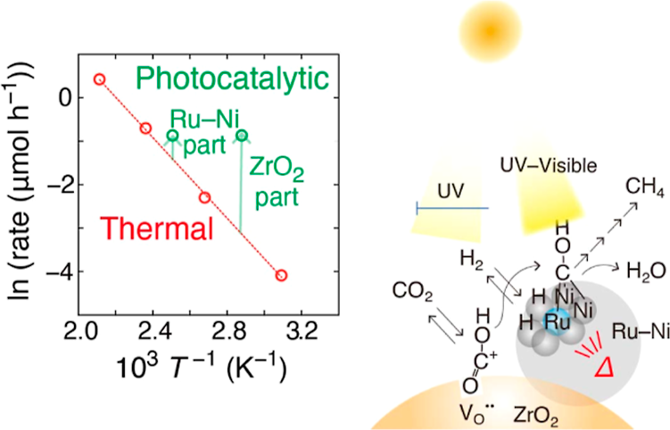
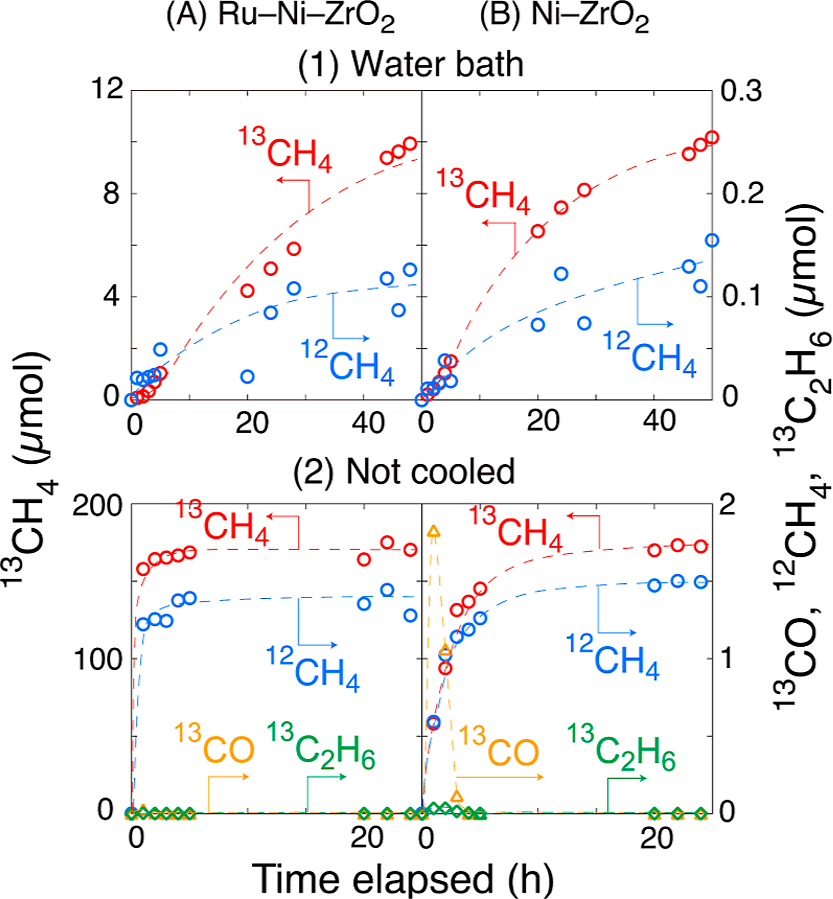
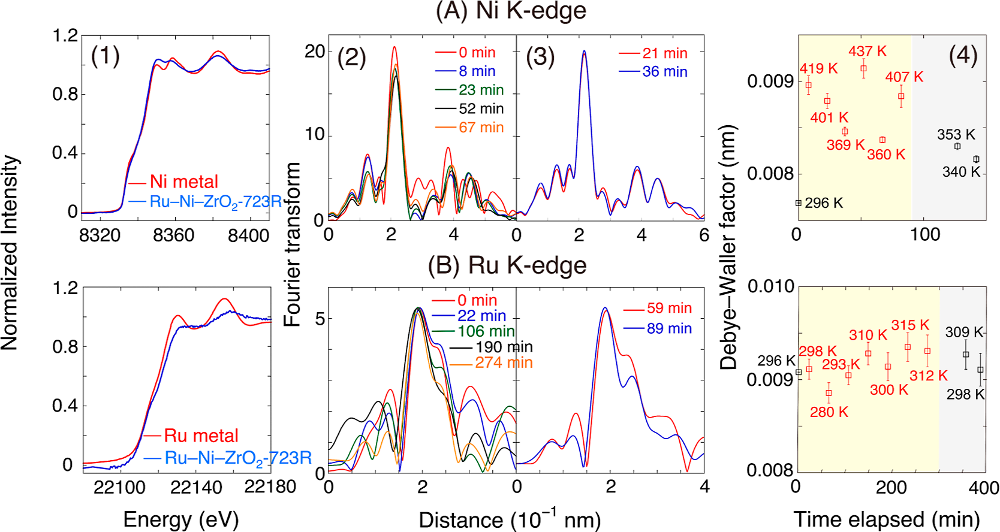

# Charge Separation and/or Hot Spots: Clarification of Efficient CO2 Reduction over Ru-Ni Nanoparticles Compared to Photocatalysis on Ru-Ni-ZrO2 Composites

**Zotero key:** XPNDGRHB  
**Attachment key:** GLTKIFLC  
**Journal:** Journal of the American Chemical Society  
**DOI:** 10.1021/jacs.5c17533  
**Task date:** 2026-07-02  
**Source PDF:** paper.pdf

## Why This Paper / 为什么选这篇

**English:** This paper is worth reading because it separates two effects that are often mixed together in photocatalysis: true charge-separation-driven chemistry on the semiconductor and hot-spot-driven thermal chemistry on metal nanoparticles. For computational catalysis, it is especially valuable because the mechanistic claim is not left at the level of rate curves; the authors combine isotopic kinetics, site-specific XAFS thermometry, in situ FTIR, and DFT/CI-NEB pathway analysis.

**中文说明:** 这篇文献值得优先读，不是因为它单纯又报告了一个“Ru 掺进去更快”的结果，而是因为它把光催化里最容易混淆的两件事拆开了：一类是真正由半导体电荷分离驱动的表面氧化还原步骤，另一类是金属热点升温带来的热催化步骤。对计算催化训练尤其有价值的是，作者没有停留在速率对比，而是把同位素动力学、位点分辨 XAFS 温度探测、原位 FTIR 和 DFT/CI-NEB 路径分析串成了一个完整证据链。

## Reading Guide / 阅读提示

**English:** Read this paper in four passes. First, identify the experimental paradox: Ru helps strongly without a 295 K bath but hardly helps with the bath. Second, track what the isotope ratios say about whether ZrO2 surface vacancies participate in the pathway. Third, focus on the XAFS result that Ni heats up while the isolated Ru site does not. Fourth, use the DFT section to compare the photocatalytic and purely thermal pathways step by step.

**中文说明:** 建议分四遍读。第一遍先抓住矛盾：没有 295 K 水浴时，Ru 促进效应很强；有水浴时，Ru 几乎不再提升。第二遍盯住同位素比例，看它如何判断 ZrO2 表面氧空位是否真正进入了反应路径。第三遍重点看 XAFS 热测温：升温的是 Ni 热点，而不是单个 Ru 位点。第四遍再用 DFT 路径比较光催化路线和纯热路线各自的决速步与活性位。

## Terminology / 术语表

| English | 中文 | Note |
| --- | --- | --- |
| hot spot | 热点 | 指局部金属位点在光照下形成的高温微区，而不是整个体系均匀升温。 |
| charge separation | 电荷分离 | 光生电子和空穴在半导体中分离并驱动表面氧化还原步骤。 |
| photothermal pathway | 光热路径 | 由光转热后主导的热催化路径，不等同于真正的半导体光催化。 |
| VO site | 氧空位位点 | ZrO2 表面的氧空位，是本文光催化还原 CO2 的关键起始位点。 |
| Debye-Waller factor | Debye-Waller 因子 | XAFS 中反映热振动和无序度的参数，本文用于局部位点测温。 |
| CI-NEB | 爬山弹性带方法 | 用于寻找反应路径过渡态和活化能。 |
| EXAFS / XANES | EXAFS / XANES | 扩展 X 射线吸收精细结构 / 近边结构，用于解析局部配位与温度变化。 |
| in situ FTIR | 原位 FTIR | 在反应气氛和光照条件下跟踪中间体吸附峰。 |

## Page / Section Index

- `p.1-p.2` Problem setup, abstract logic, and why Ru looks paradoxical
- `p.2-p.3` Experimental methods: catalyst synthesis, photoreduction tests, XAFS/FTIR/DFT setup
- `p.3-p.5` Kinetic comparison with vs without 295 K bath; isotopic evidence and XAFS thermometry
- `p.5-p.7` FTIR intermediate tracking and photocatalytic pathway on ZrO2 plus hot Ni
- `p.7-p.9` Thermal pathway on Ru-Ni surface, promoted CO2 dissociation, and mechanism comparison
- `p.9-p.11` Conclusions, supporting-information scope, author notes, acknowledgements, references note

## Bilingual Reader / 双语正文

## Metadata And Abstract

**Source:** p.1 S001

**Original:** Charge Separation and/or Hot Spots: Clarification of Efficient CO2 Reduction over Ru-Ni Nanoparticles Compared to Photocatalysis on Ru-Ni-ZrO2 Composites. Masahito Sasaki, Tomoki Oyumi, Keisuke Hara, Hongwei Zhang, and Yasuo Izumi. J. Am. Chem. Soc. 2026, 148, 13570-13580.

**中文:** 题目是《电荷分离还是热点？Ru-Ni 纳米颗粒上高效 CO2 还原与 Ru-Ni-ZrO2 复合体系光催化路径的澄清》。作者来自千叶大学、日本农业农村事务省沼气研究所等单位，发表于 2026 年的《Journal of the American Chemical Society》。

**Source:** p.1 S002

**Original:** The abstract states that the true catalytic role in this system is ambiguous because photocatalysis can mix charge separation, hot spots, and excited-state energy modulation. Under a 295 K cooling bath, adding 1.0 wt % Ru to Ni-ZrO2 hardly changes the 13CO2-to-13CH4 rate, but without the bath the Ru-Ni-ZrO2 catalyst exceeds Ni-ZrO2 by more than 2.7 times.

**中文:** 摘要先抛出核心矛盾：在这类体系里，光催化往往把电荷分离、热点升温和激发态能量调制混在一起，所以真实活性位和真实路径并不清楚。在 295 K 冷却水浴下，向 Ni-ZrO2 中加入 1.0 wt % 的 Ru 几乎不改变 13CO2 还原成 13CH4 的速率；但去掉水浴后，Ru-Ni-ZrO2 的速率会比 Ni-ZrO2 高出 2.7 倍以上。

## Abstract

**Source:** p.1 S003

**Original:** EXAFS shows that under light the Ni hot spot temperature rises from 295 to 399 ± 29 K even when the sample is externally cooled, whereas DFT and FTIR support two different routes: a photothermal route in which CO2 dissociates directly on a RuNi2 site with a 0.45 eV barrier, and a photocatalytic route initiated on ZrO2 oxygen vacancies and followed by hydrogenation on hot Ni.

**中文:** 摘要里最关键的证据链是：即使外部有冷却，光照下 Ni 热点温度仍会从 295 K 升到 399 ± 29 K；与此同时，DFT 和 FTIR 支持两条不同路线。一条是光热路线，CO2 在 RuNi2 位点上可直接解离，势垒只有 0.45 eV；另一条是真正的光催化路线，先在 ZrO2 氧空位上发生还原，再把中间体转移到升温的 Ni 位点上继续氢化。

## Introduction

**Source:** p.1-2 S004

**Original:** The introduction frames low CO2-to-fuel efficiency as the central bottleneck in semiconductor photocatalysis and argues that stronger irradiation may help, but only if one can distinguish genuine charge-separation chemistry from light-induced heating. Ru is presented as a historically puzzling promoter because it has been implicated in both thermal methanation and photocatalytic CO2 reduction.

**中文:** 引言把“半导体光催化中 CO2 制燃料效率低”作为总问题，并指出提高光强看起来是一个直接思路，但前提是必须分清增强到底来自真正的电荷分离化学，还是仅仅来自光转热。Ru 之所以麻烦，在于它历史上既出现在热催化甲烷化体系里，也被报道能促进光催化 CO2 还原，因此它到底在做什么并不清楚。

**Source:** p.2 S005

**Original:** The authors connect their question to recent photothermal thermometry work and to prior Fe-ZrO2 studies in which CO2 first undergoes a charge-separation-driven reduction on ZrO2 and then multiple hydrogenation steps on hot metal sites. Their central aim is therefore not simply to measure a better catalyst but to clarify which pathway operates under controlled temperature conditions.

**中文:** 作者把自己的问题放进两个更大的背景里：一是近期关于光热催化局部测温的工作，二是他们此前在 Fe-ZrO2 上提出的“两步路线”，即 CO2 先在 ZrO2 上经历电荷分离驱动的还原，再在发热的金属位上完成连续氢化。所以本文真正要回答的不是“哪个催化剂更快”，而是在受控温度条件下，究竟是哪条路径在工作。

## Experimental Methods

**Source:** p.2-3 S006

**Original:** Experimentally, the authors prepare Ru(x wt %)-Ni(10 wt %)-ZrO2 composites with Ru loadings from 0.5 to 2.0 wt %, using NaBH4 reduction after dispersing ZrO2 and adding Ni and Ru salts. They then run 13CO2/H2 photoreduction tests with and without a 295 K bath under Xe-lamp UV-visible irradiation, while monitoring products by online GC-MS.

**中文:** 实验上，作者先制备一系列 Ru(x wt %)-Ni(10 wt %)-ZrO2 复合催化剂，Ru 负载量从 0.5 到 2.0 wt %，合成路线是先分散 ZrO2、加入 Ni 和 Ru 前驱体，再用 NaBH4 还原。随后他们用 13CO2/H2 体系做光还原测试，在有无 295 K 水浴两种条件下接受氙灯 UV-visible 光照，并通过在线 GC-MS 跟踪气相产物。

**Source:** p.2-3 S007

**Original:** The characterization strategy is unusually strong. Ni and Ru K-edge XAFS is used under reaction gas and illumination to infer local site temperatures through the Debye-Waller factor, in situ FTIR tracks adsorbed CO-derived intermediates under controlled light intensities, and spin-polarized periodic DFT-D3 with RPBE + U and CI-NEB is used to compare the photocatalytic and thermal pathways.

**中文:** 这篇文章的方法学强度很高。作者在反应气氛和光照条件下做 Ni 与 Ru K 边 XAFS，用 Debye-Waller 因子反推局部位点温度；再用原位 FTIR 跟踪不同光强下的吸附 CO 类中间体；最后用自旋极化周期性 DFT-D3、RPBE+U 与 CI-NEB 去比较光催化和热催化两条路径。

## Results - CO2 Reduction Tests

**Source:** p.3 S008

**Original:** Screening of Ru loading shows that 1.0 wt % Ru maximizes CH4 formation, so the rest of the study focuses on Ru(1.0 wt %)-Ni(10 wt %)-ZrO2. With a 295 K bath under 568 mW cm-2 irradiation, however, Ru-Ni-ZrO2 gives only about 21 umol h-1 gcat-1 of 13CH4, essentially the same as or slightly below Ni-ZrO2 at 26 umol h-1 gcat-1.

**中文:** 前期筛选显示，Ru 负载量为 1.0 wt % 时 CH4 生成速率最高，因此后续重点都放在 Ru(1.0 wt %)-Ni(10 wt %)-ZrO2 上。但在 568 mW cm^-2 光照、并有 295 K 水浴冷却时，这个含 Ru 催化剂的 13CH4 速率只有约 21 umol h^-1 gcat^-1，和 Ni-ZrO2 的 26 umol h^-1 gcat^-1 基本相当，甚至略低。

## Results - Isotopic Evidence

**Source:** p.3-4 S009

**Original:** Under the bath, the fraction of 12CH4 in total methane stays around 5.0-5.2 mol %, which the authors interpret as evidence that 12CO2 previously adsorbed from air on ZrO2 oxygen vacancies participates in the route. That is a direct mechanistic clue that the semiconductor vacancy sites, not only the metal particle surface, are involved in the photocatalytic pathway.

**中文:** 在有水浴时，总甲烷里 12CH4 的比例大约保持在 5.0%-5.2%，作者把这解释为：那些此前从空气中吸附到 ZrO2 氧空位上的 12CO2，确实进入了反应路径。这相当于给出一个直接机理信号，说明真正的光催化路线里参与反应的不只是金属颗粒表面，半导体上的氧空位也在起作用。

## Results - No-Bath Condition

**Source:** p.4 S010

**Original:** Once the 295 K bath is removed, the picture changes completely. Under the same nominal light intensity, Ru-Ni-ZrO2 converts 2.3 kPa of 13CO2 within 1 h and reaches a 13CH4 formation rate above 7.9 mmol h-1 gcat-1, whereas Ni-ZrO2 reaches only 2.9 mmol h-1 gcat-1, establishing a >2.7x Ru promotion in the no-bath condition.

**中文:** 一旦去掉 295 K 水浴，图景就彻底变了。在名义光强相同的条件下，Ru-Ni-ZrO2 可以在 1 小时内把 2.3 kPa 的 13CO2 转完，13CH4 速率超过 7.9 mmol h^-1 gcat^-1；而 Ni-ZrO2 只有 2.9 mmol h^-1 gcat^-1，由此明确建立了“无水浴条件下 Ru 带来超过 2.7 倍促进”的事实。

### Fig. 1. With-bath vs no-bath kinetic contrast

**Placed near:** S010

**Source:** p.3 F001

**Original caption:** Figure 1 compares time courses of 13CO, 13CH4, 12CH4, and 13C2H6 over Ru-Ni-ZrO2 and Ni-ZrO2, showing that Ru has little effect with a 295 K bath but a strong promoting effect without the bath.

**中文图注:** 图 1 对比了 Ru-Ni-ZrO2 与 Ni-ZrO2 上 13CO、13CH4、12CH4 和 13C2H6 的时间演化，核心信息是：有 295 K 水浴时 Ru 基本不提升速率；去掉水浴后，Ru 的促进作用立刻变得非常明显。

## Results - Isotopic Contrast

**Source:** p.4-5 S011

**Original:** Without the bath, the 12CH4 fraction collapses to about 0.8-1.0 mol %, close to the isotopic impurity level of the 13CO2 feed itself. The authors therefore argue that under no-bath conditions the ZrO2 vacancy-bound 12CO2 no longer participates significantly, meaning the dominant chemistry has shifted from the vacancy-assisted photocatalytic route to a metal-surface thermal route.

**中文:** 而在无水浴条件下，12CH4 的比例会骤降到 0.8%-1.0%，几乎只剩下进料 13CO2 本身的同位素杂质水平。因此作者认为，这时吸附在 ZrO2 氧空位上的 12CO2 已经几乎不再参与反应，主导化学从“氧空位参与的光催化路线”切换成了“金属表面主导的热路线”。

## Results - XAFS Thermometry

**Source:** p.5-6 S012

**Original:** XAFS then explains why the bath does not truly eliminate thermal effects. Under CO2/H2 and UV-visible light, the Ni Debye-Waller factor changes rapidly and corresponds to a local temperature rise from 296 K to 399 ± 29 K, even in the externally cooled cell. By contrast, the isolated Ru site changes only slightly, to roughly 302 ± 12 K.

**中文:** XAFS 热测温进一步解释了为什么“有水浴”并不等于“没有热效应”。在 CO2/H2 气氛和 UV-visible 光照下，Ni 的 Debye-Waller 因子迅速变化，对应的局部温度会从 296 K 升到 399 ± 29 K，哪怕样品外部仍在冷却。相反，单个 Ru 位点温度只发生很小变化，大约升到 302 ± 12 K。

### Fig. 2. XAFS thermometry at Ni and Ru sites

**Placed near:** S012

**Source:** p.4-5 F002

**Original caption:** Figure 2 shows Ni and Ru K-edge XANES/EXAFS under reactive gas and illumination, with the Debye-Waller-factor-derived site temperatures. The crucial contrast is that Ni heats strongly while Ru does not.

**中文图注:** 图 2 给出了反应气氛和光照下的 Ni、Ru K 边 XANES/EXAFS 结果，并据此换算出位点温度。最关键的对比是：明显升温的是 Ni，而不是 Ru。

## Results - XAFS Interpretation

**Source:** p.6 S013

**Original:** This contrast leads to a precise mechanistic interpretation: the relevant hot spot is the Ni nanoparticle, not the isolated Ru atom. Ru appears to substitute into the Ni surface rather than form a separate metal cluster, and the measured local warming is fast enough and large enough to support multiple downstream hydrogenation steps on Ni.

**中文:** 这个对比给出了很清晰的机理判断：真正形成热点的是 Ni 纳米颗粒，而不是孤立的 Ru 原子。Ru 更像是取代进入 Ni 表面，而不是单独长成一个 Ru 团簇；同时，Ni 位点测得的局部升温既足够快，也足够大，足以支撑后续多个氢化步骤在 Ni 上进行。

## Results - FTIR Intermediates

**Source:** p.6-7 S014

**Original:** In situ FTIR adds chemical identity to the kinetic picture. On Ni-ZrO2, the CO stretching peak grows only weakly under illumination, but on Ru-Ni-ZrO2 a broad band near 1971 cm-1 appears even before irradiation and evolves into distinct CO-related peaks under light. At higher light intensities, methane vibrational signatures emerge rapidly, indicating that Ru facilitates early CO2 activation and CO formation on the metal surface in the no-bath regime.

**中文:** 原位 FTIR 给这个动力学图景补上了中间体身份信息。对 Ni-ZrO2 来说，受光后 CO 伸缩峰增长得并不明显；而对 Ru-Ni-ZrO2 来说，在照光前就能看到约 1971 cm^-1 的宽峰，照光后又进一步演化出更清楚的 CO 相关峰。当光强提高时，甲烷振动信号会很快出现，说明在无水浴条件下，Ru 的作用主要体现在更早地促进金属表面上的 CO2 活化与 CO 形成。

### Fig. 3. In situ FTIR tracking of CO-related intermediates

**Placed near:** S014

**Source:** p.6 F003

**Original caption:** Figure 3 follows the CO-stretching region and methane-formation signatures under different irradiation conditions, showing earlier and stronger CO-related intermediate formation on Ru-Ni-ZrO2.

**中文图注:** 图 3 跟踪了不同光照条件下的 CO 伸缩区和甲烷生成信号，说明 Ru-Ni-ZrO2 上更早、更强地出现了与 CO 活化相关的中间体。

## Results - Photocatalytic Pathway

**Source:** p.7 S015

**Original:** For the photocatalytic route, DFT supports an initial reduction on ZrO2 oxygen vacancies, where charge separation under light drives the first CO2-to-COH chemistry on the semiconductor side. The resulting COH-type species are then transferred to hot Ni for further hydrogenation. In this route, the Ru substitution gives little benefit, consistent with the weak Ru effect seen under the 295 K bath.

**中文:** 对于真正的光催化路线，DFT 支持的起点是在 ZrO2 氧空位上：光照诱导的电荷分离先在半导体一侧完成 CO2 到 COH 的初始化学。随后这些 COH 类中间体再被转移到升温的 Ni 位点上继续氢化。在这条路线里，Ru 取代带来的帮助很有限，这正好和 295 K 水浴下 Ru 几乎不促进速率的实验结果一致。

## Results - Thermal Pathway

**Source:** p.7-8 S016

**Original:** For the thermal or photothermal route, the DFT picture is different. The major chemistry is placed directly on the metal surface, and a single Ru atom alloyed into Ni stabilizes CO2 adsorption strongly enough to create a threefold-bound CO2 state at a RuNi2 site. From there, CO2 dissociation into CO and O proceeds with an activation barrier of only 0.45 eV, compared with 0.79 eV on pure Ni.

**中文:** 而对热路线或光热路线来说，DFT 图景完全不同。主要化学直接发生在金属表面，单个 Ru 原子合金化进 Ni 后，可以显著稳定 CO2 吸附，使其在 RuNi2 位点上形成一个三重配位的吸附态。从这个状态出发，CO2 解离成 CO 和 O 的活化势垒只有 0.45 eV；相比之下，纯 Ni 上同一步需要 0.79 eV。

### Scheme 2. Thermal pathway on Ru-Ni vs Ni surface

**Placed near:** S016

**Source:** p.8 F004

**Original caption:** Scheme 2 lays out the DFT free-energy pathway for thermal CO2 reduction on the Ru-Ni surface versus the Ni surface, pinpointing Ru-assisted CO2 dissociation as the decisive promoted step.

**中文图注:** Scheme 2 展示了 Ru-Ni 表面与纯 Ni 表面上热 CO2 还原的 DFT 自由能路径，明确指出真正被 Ru 显著促进的是 CO2 解离这一步。

**Source:** p.8 S017

**Original:** After that promoted dissociation step, the later hydrogenation sequence from CO to CH4 is largely similar on Ru-Ni and Ni surfaces, with the highest shared barrier around the CO-to-COH conversion. That means Ru does not globally accelerate every step; its decisive role is to make the first CO2 activation and dissociation on the metal surface much easier.

**中文:** 在这个被 Ru 显著促进的解离步骤之后，后续从 CO 到 CH4 的氢化序列在 Ru-Ni 和纯 Ni 表面上其实差别不大，共同的最高势垒仍出现在 CO 向 COH 的转化附近。也就是说，Ru 不是把所有步骤都普遍加速了，它真正决定性的作用是让金属表面上的第一步 CO2 活化与解离变得容易得多。

## Mechanism Comparison

**Source:** p.8-9 S018

**Original:** The paper therefore argues for a combination model rather than a single broad label. Under the 295 K bath, the chemistry is not simple thermal catalysis; it is a mixed pathway in which ZrO2 charge separation initiates reduction and local Ni heating accelerates downstream hydrogenations. Without the bath, the dominant pathway moves onto the Ru-Ni or Ni metal surface and behaves much more like a thermal Arrhenius process.

**中文:** 所以作者最后强调的不是给体系贴一个笼统标签，而是提出一个组合模型。在 295 K 水浴下，体系并不是简单热催化，而是一条混合路径：ZrO2 上的电荷分离负责起始还原，局部升温的 Ni 负责把后面的氢化步骤推快。而在无水浴时，主导路径则转移到 Ru-Ni 或 Ni 金属表面，更接近标准的 Arrhenius 型热反应。

### Scheme 3. Mechanistic comparison of photocatalytic vs thermal routes

**Placed near:** S018

**Source:** p.8-9 F005

**Original caption:** Scheme 3 summarizes the two route families and compares them to Arrhenius expectations, arguing that the with-bath condition is a combined route rather than a simple thermal reaction.

**中文图注:** Scheme 3 把光催化路线与热路线并列比较，并与 Arrhenius 预期相对照，强调有水浴条件下看到的是“组合路径”，而不是简单热反应。

## Conclusions

**Source:** p.9 S019

**Original:** The conclusion is that Ru promotion under strong light does not prove a stronger photocatalytic redox route by itself. Instead, the authors show that Ru mainly promotes the no-bath thermal pathway by lowering the CO2 dissociation barrier on the alloy surface, whereas under cooled conditions the decisive chemistry still begins at ZrO2 oxygen vacancies and is only later assisted by hot Ni.

**中文:** 结论部分最值得记住的一点是：在强光下看到 Ru 促进，并不能自动说明“光催化氧化还原本身更强了”。作者实际上证明，Ru 主要是通过降低合金表面 CO2 解离势垒来促进无水浴下的热路线；而在冷却条件下，真正决定成败的起始化学仍然发生在 ZrO2 氧空位上，Ni 热点只是随后接力。

## Supporting Information And Notes

**Source:** p.9-10 S020

**Original:** The supporting-information note states that the SI contains novelty claims, light wavelength and intensity distributions, detailed setups, UV-visible/XRD/HR-TEM/FTIR data, correlated Debye-model information, EXAFS data, Ru-content dependence, 13CO2 photoexchange results, and full DFT pathway details. This tells the reader that the main text presents only the top layer of a much larger mechanistic dataset.

**中文:** Supporting Information 说明里明确写到，补充材料包含创新点说明、光谱和光强分布、详细实验装置、UV-visible/XRD/HR-TEM/FTIR 数据、相关 Debye 模型信息、EXAFS 原始分析、Ru 含量依赖、13CO2 光交换结果以及完整 DFT 路径细节。这提醒读者，正文其实只是更大一套机理证据的上层摘要。

## Author Information And Acknowledgements

**Source:** p.9-10 S021

**Original:** Corresponding authors are Hongwei Zhang and Yasuo Izumi, and the authors declare no competing financial interest. The acknowledgements highlight support from JSPS, Photon Factory beamtime approvals, and supercomputing resources at the University of Tokyo, underscoring that the paper depends on both advanced spectroscopy infrastructure and substantial computation.

**中文:** 通讯作者是 Hongwei Zhang 和 Yasuo Izumi，作者声明不存在竞争性经济利益。致谢部分列出了日本学术振兴会资助、Photon Factory 光束线批准以及东京大学超算资源，这也反过来说明本文的证据链同时依赖高级谱学平台和相当重的计算支撑。

## References Note

**Source:** p.10-11 S022

**Original:** The reference list is especially informative at the conceptual level: it includes the authors' own earlier ZrO2-based CO2 photoreduction mechanism papers, recent Ru single-atom promotion studies, and broader photothermal hot-spot thermometry work. Following the reader rule for this workflow, the bibliography is kept as source context rather than translated line by line.

**中文:** 从概念脉络上看，参考文献本身也很有信息量：它既包括作者团队此前关于 ZrO2 路线的机理论文，也包括近期 Ru 单原子促进 CO2 还原的研究，以及更广义的光热热点测温工作。按照这套 reader 工作流的规则，参考文献在这里作为书目背景保留，不逐条展开翻译。

## Related Reading / 延伸阅读

### Efficient and Selective Interplay Revealed: CO2 Reduction to CO over ZrO2 by Light with Further Reduction to Methane over Ni0 by Heat Converted from Light

**中文题名 / 中文说明:** 光照下 ZrO2 先将 CO2 还原为 CO，再由 Ni0 上的光转热继续还原为甲烷的协同机制

**Why this one:** This is the most direct mechanistic precursor cited by the authors. It provides the ZrO2-vacancy-first plus hot-metal-follow-up framework that the current paper tests and refines with Ru substitution.

**为什么推荐:** 这是作者自己机理链条里最直接的前置工作，提出了“ZrO2 氧空位先起步、热金属位再接力”的框架，而本文正是在这个框架上用 Ru 取代去做检验和修正。

### Micro/Nanoscale Thermometry in Photothermal Catalysis

**中文题名 / 中文说明:** 光热催化中的微纳尺度测温

**Why this one:** If you want to understand why this paper insists on site-specific temperature measurement rather than reactor temperature, this is the key conceptual background reference.

**为什么推荐:** 如果你想理解本文为什么坚持做位点分辨的局部温度测量，而不满足于反应器整体温度，这篇工作是最关键的概念背景。
