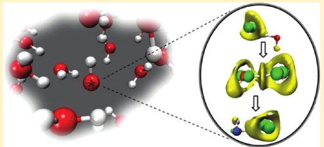
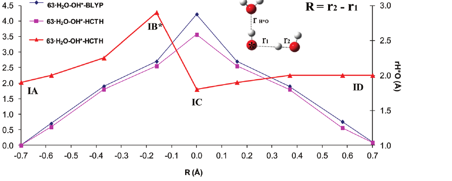

# Mobility Mechanism of Hydroxyl Radicals in Aqueous Solution via Hydrogen Transfer

**Zotero key:** C5VF7EZX
**Attachment key:** WAXS5TTD
**Journal:** Journal of the American Chemical Society
**DOI:** 10.1021/ja208874t
**Publication date:** 2011-12-05
**Source PDF:** paper.pdf

## Why This Paper / 为什么选这篇

**English:** This paper is a compact but important mechanistic companion to the newer water-radical/interface papers: it explains how hydrated hydroxyl radicals can migrate by hydrogen transfer rather than only by molecular diffusion. For simulation work, it is valuable because the authors explicitly connect hydration structure, spin/electronic structure, free-energy barriers, and finite-size/self-interaction artifacts.

**中文:** 这篇是读后续水相自由基/界面自由基文章时很有用的一篇机制基础文献：它讨论水合羟基自由基如何通过氢转移迁移，而不只是普通分子扩散。对做模拟尤其有价值，因为作者把水合结构、自旋/电子结构、自由能垒以及有限尺寸和自相互作用误差都放在同一条证据链里讨论。

## Reading Guide / 读前导读

**English:** Read it in three passes. First, understand the inactive OH*(H2O)4 hydration motif and why small boxes can over-stabilize hemibonds. Second, follow Fig. 1-3 to see how structural fluctuation opens the H-transfer pathway. Third, use Fig. 4 and the conclusion to judge what is robust and what remains functional/size dependent.

**中文:** 建议分三遍读。第一遍先理解 inactive OH*(H2O)4 水合构型，以及为什么小水盒容易过度稳定半键。第二遍结合图 1-3 看局部结构涨落如何打开 H-transfer 路径。第三遍再用图 4 和结论判断哪些机制判断是稳健的，哪些仍然依赖泛函和体系尺寸。

## 页面与结构索引

- p.532: 标题、摘要、引言开头
- p.533: 方法；结果与讨论开头
- p.534: Fig. 1；羟基自由基氢转移机制
- p.535: Fig. 2、Fig. 3；电子结构与自由能曲线
- p.536: Fig. 4；小体系 metadynamics 与半键结构
- p.537: 结论、Supporting Information、作者信息、致谢、参考文献开头
- p.538: 参考文献结束

## 术语表

| English term | 中文建议 | 说明 |
|---|---|---|
| hydroxyl radical, OH* | 羟基自由基 OH* | 原文用 OH* 表示自由基；阅读时可理解为 OH· |
| hydrogen transfer, H-transfer | 氢转移 | 本文讨论水分子与 OH* 之间的 H 迁移 |
| hydrogen atom transfer, HAT | 氢原子转移 | 电子和质子来自同一键 |
| electron-proton transfer, EPT | 电子-质子转移 | 文中认为该反应兼具 EPT 特征 |
| Car-Parrinello molecular dynamics, CPMD | Car-Parrinello 分子动力学 | DFT 基础上的从头算分子动力学 |
| self-interaction error, SIE | 自相互作用误差 | GGA DFT 中可能导致半键假象的重要误差 |
| hemibond | 半键 | 三电子二中心 O...O 相互作用，文中认为小体系中容易出现 |
| electron localization function, ELF | 电子局域函数 | 用于分析电子局域化和孤对电子/成键特征 |
| spin density | 自旋密度 | 表征未成对电子主要分布在哪里 |
| metadynamics | 元动力学 | 通过集体变量加速稀有事件、重构自由能面的采样方法 |

---

## Title And Abstract

**Source:** p.532 S001

**Original:** Mobility Mechanism of Hydroxyl Radicals in Aqueous Solution via Hydrogen Transfer. Edelsys Codorniu-Hernandez and Peter G. Kusalik. Department of Chemistry, University of Calgary.

**中文:** 题目是“水溶液中羟基自由基通过氢转移实现迁移的机制”。作者来自加拿大卡尔加里大学化学系。标题已经点明文章核心：OH* 在水中不一定只靠普通分子扩散，还可能通过与邻近水分子的氢转移，使自由基中心在氢键网络中“跳迁”。

### Graphical Abstract

**Placed near:** p.532 S002  
**Source:** p.532 graphical abstract

**Reading note:** 图文摘要展示的是水中 OH* 与邻近水分子发生 H-transfer 的整体想法：自由基中心可以从一个局部水合位点迁移到另一个位点，电子结构重排与氢原子/质子位置变化是机制关键。

**Source:** p.532 S002

**Original:** The hydroxyl radical (OH*) is a highly reactive oxygen species that plays a salient role in aqueous solution. The influence of water molecules upon the mobility and reactivity of the OH* constitutes a crucial knowledge gap. Specifically, the molecular mechanisms associated with OH* mobility and the possibility of diffusion in water via a H-transfer reaction remain open questions.

**中文:** 羟基自由基 OH* 是一种高度反应性的活性氧物种，在水溶液中非常重要。水分子如何影响 OH* 的迁移性和反应性，是理解许多关键反应时尚未补全的一块知识空白。更具体地说，OH* 在水中迁移的分子机制，以及它是否能通过氢转移反应完成扩散，仍然是开放问题。

**Source:** p.532 S003

**Original:** Here we report insights into the local hydration and electronic structure of the OH* in aqueous solution from Car-Parrinello molecular dynamics and explore the mechanism of H-transfer between OH* and a water molecule. The relatively small free energy barrier observed (~4 kcal/mol) supports a conjecture that the H-transfer can be a very rapid process in water.

**中文:** 作者用 Car-Parrinello 分子动力学研究水溶液中 OH* 的局部水合结构和电子结构，并考察 OH* 与水分子之间的氢转移机制。计算得到的自由能垒较小，约为 4 kcal/mol，因此支持一个重要判断：水中的 H-transfer 可能非常快，并且能显著贡献 OH* 的迁移。

**Source:** p.532 S004

**Original:** The findings reveal a novel H-transfer mechanism of hydrated OH*, resembling that of hydrated OH- and presenting hybrid characteristics of hydrogen-atom and electron-proton transfer processes, where local structural fluctuations play a pivotal role.

**中文:** 本文提出了一种水合 OH* 的新型氢转移机制。它与水合 OH- 的传输机制有相似之处，同时表现出氢原子转移 HAT 和电子-质子转移 EPT 的混合特征。关键触发因素不是单纯的静态结构，而是局部水合结构的涨落。

---

## Introduction

**Source:** p.532 S005

**Original:** The hydroxyl radical (OH*) is a highly reactive species that is ubiquitous in our environment. It plays crucial roles in fields ranging from water remediation, environmental cleanup, radiation processing and nuclear reactors, to medical diagnosis and therapy. OH* is also relevant in the lower atmosphere and in biological damage to DNA, lipids, and proteins.

**中文:** OH* 是环境中广泛存在的高反应性物种，涉及水处理、环境修复、辐射加工、核反应堆、医学诊断和治疗等许多领域。它也是低层大气化学的重要物种，并与 DNA、脂质和蛋白质损伤有关。作者先强调 OH* 的广泛重要性，是为了说明“它在水中如何移动”不是一个边缘问题。

**Source:** p.532 S006

**Original:** Its reactivity is apparently strongly influenced by water molecules. The possible existence of a H2O-OH* complex has been speculated to affect strongly the diffusion and oxidative capacity of the radical. Direct experimental measurements of transient neutral species are challenging, and data for OH* are limited.

**中文:** OH* 的反应性会强烈受到周围水分子的影响。此前有人推测，H2O-OH* 复合物可能显著改变自由基的扩散能力和氧化能力。不过，OH* 这类瞬态中性物种很难直接实验测量，所以可用数据有限。也就是说，实验上很难直接“看见”它怎么在水中移动。

**Source:** p.532 S007

**Original:** In addition to a molecular mechanism, OH* can be expected to diffuse in water via hydrogen exchange, analogous to the proton-exchange reaction in the case of hydroxide anion (OH-). However, such a process had not been demonstrated previously because of the challenges posed by OH* reactivity and lifetime.

**中文:** 除了普通的分子扩散，OH* 也可能像 OH- 的质子交换一样，通过氢交换在水中迁移。这个想法很自然：如果 OH* 从相邻水分子夺取一个 H，原来的水分子位置就可能变成新的 OH* 位点。但由于 OH* 反应性太强、寿命短，此前实验和计算都没有明确证明这种 H-hopping 过程。

**Source:** p.532 S008

**Original:** The authors performed extensive Car-Parrinello molecular dynamics simulations with a large 63 H2O-OH* system. They had recently shown that smaller systems were contaminated by system-size effects and biased toward a three-electron two-centered hemibond structure caused by self-interaction error in GGA DFT.

**中文:** 作者采用较大的 63 H2O-OH* 体系做 CPMD 模拟。这个选择很重要，因为他们此前指出，小体系容易受到体系尺寸效应污染，并偏向形成一种三电子二中心的半键结构；该结构可能是 GGA DFT 自相互作用误差造成的假象。因此本文的一个技术前提是：要用足够大的水盒子降低半键假象对机制判断的干扰。

---

## Methods

**Source:** p.533 S009

**Original:** The standard Car-Parrinello DFT-based ab initio molecular dynamics method was used with the CPMD code to study 63 H2O-OH* systems within a 12.56 A cubic simulation box. Periodic boundary conditions were applied, and the simulation temperature was set to 310 K.

**中文:** 方法上，作者使用 CPMD 程序进行基于 DFT 的 Car-Parrinello 从头算分子动力学模拟。主体系包含 63 个水分子和 1 个 OH*，放在边长 12.56 Å 的立方周期盒中，温度为 310 K。这个体系尺寸比早期 31 个水分子的体系更大，目的是更可靠地描述水合环境。

**Source:** p.533 S010

**Original:** The local spin density functional theory was used for the unpaired electron on OH*. Two density functionals were compared: BLYP and HCTH/120. HCTH/120 was primarily applied because it better reproduces liquid water properties; BLYP was included for comparison with previous studies.

**中文:** 因为 OH* 有未成对电子，作者使用局域自旋密度框架处理自旋。交换相关泛函比较了 BLYP 和 HCTH/120：HCTH/120 是主要选择，因为它对液态水性质的描述较好；BLYP 则用于和前人研究对照。这里的对照很关键，因为 BLYP 在小体系中更容易出现半键问题。

**Source:** p.533 S011

**Original:** For HCTH/120 the Troullier-Martins norm-conserving pseudopotential and a 90 Ry plane-wave cutoff were used. For BLYP the Goedecker pseudopotential and a 75 Ry cutoff were used, matching previous studies. The fictitious electron kinetic energy was stable, and the time step was 0.1 fs.

**中文:** 计算细节包括：HCTH/120 使用 Troullier-Martins 模守恒赝势和平面波 90 Ry 截断；BLYP 使用 Goedecker 模守恒赝势和 75 Ry 截断，以便与既有工作一致。模拟中监控了总能量和虚电子自由度动能，时间步长为 0.1 fs。这些细节说明作者在 Car-Parrinello 动力学稳定性上做了控制。

**Source:** p.533 S012

**Original:** The free energy of the hydrogen transfer reaction was determined using constrained molecular dynamics and metadynamics. For constrained MD, the difference between the O*-H and O-H distances was used as the constraint coordinate R. The free energy profile was obtained by thermodynamic integration.

**中文:** 氢转移反应的自由能使用两种方法估计：约束分子动力学和 metadynamics。约束 MD 中，反应坐标 R 定义为 O*-H 距离与 O-H 距离之差，也就是追踪氢在两个氧之间的位置。每隔 0.1 Å 做一段约束轨迹，平均约束力后通过热力学积分得到自由能曲线。

**Source:** p.533 S013

**Original:** Metadynamics was useful for a smaller 31 H2O-OH* system with HCTH/120 because the H-transfer did not proceed spontaneously there. The collective variables were coordination numbers of hydrogens around the radical oxygen and radical hydrogen.

**中文:** 对较小的 31 H2O-OH* 体系，H-transfer 不会自发频繁发生，因此 metadynamics 可以用来推动稀有事件并重构自由能。作者选取的集体变量是 OH* 氧周围氢原子的配位数，以及 OH* 氢周围氢原子的配位数。这个设计本质上是在捕捉“自由基位点的氢键/氢转移状态”。

---

## Results And Discussion: Inactive State

**Source:** p.533 S014

**Original:** OH* is found to exist in an "inactive" state, OH*(H2O)4, in which OH* has three H-bond-donating neighbors and one H-bond-accepting neighbor. This structure is compared with the OH-(H2O)4 inactive state of hydroxide.

**中文:** 在大体系中，OH* 主要可以处于一种“inactive”水合状态 OH*(H2O)4：周围有三个给氢键的水分子和一个接受氢键的水分子。作者把这个结构和 OH- 的 OH-(H2O)4 inactive 状态进行比较。这里的 inactive 不是说物种不反应，而是说该局部构型还不是直接发生 H-transfer 的反应构型。

### Fig. 1. OH* 与 OH- 第一溶剂化壳层的反应步骤示意

**Placed near:** p.533 S014  
**Source:** p.534 C001

**Original caption:** Schematic representation of the first solvation shell of the OH* (column I) and the OH- (column II) for different steps during the hydrogen or proton transfer reaction from a nearest neighbor water molecule. (A) prior to the reaction, the "inactive state"; (B) the "active" state; (C) the transition state; and (D) post-transfer. Dotted lines indicate rOO < 3 A. ELF isosurfaces for isolated OH* and OH- are shown.

**中文图注:** 图 1 比较 OH*（I 列）和 OH-（II 列）在氢/质子转移反应不同阶段的第一溶剂化壳层：A 为反应前 inactive state，B 为 active state，C 为过渡态，D 为转移后状态。虚线表示 O...O 距离小于 3 Å。顶部还给出孤立 OH* 和 OH- 的 ELF 等值面。

**Reading note:** 这张图是全文机制主线。OH* 和 OH- 的 active state 都接近三配位结构；H-transfer 之前，OH* 需要先从 OH*(H2O)4 的四配位 inactive state 转成 OH*(H2O)3 的 active state。

**Source:** p.533 S015

**Original:** The differences between inactive states of OH* and OH- can be explained with electron localization functions. OH- has three lone-pair electrons in a delocalized ring-like structure, whereas OH* has a delocalized beta-spin ELF and a p-like alpha-spin function for the unpaired electron.

**中文:** OH* 与 OH- 的 inactive state 差异可以用 ELF 来解释。OH- 的三个孤对电子在氧周围形成较离域的环状结构，因此支持四配位超配位状态；而 OH* 的 beta 自旋 ELF 类似连续环状分布，alpha 自旋中还出现未成对电子的 p-like 函数。这解释了为什么 OH* 的三个受氢键中有一个更强，它对应的是未成对电子参与的相互作用。

**Source:** p.533 S016

**Original:** In simulations, spontaneous H-transfers were observed on a roughly 30 ps time scale. However, if the inactive structure were directly the reactive structure, H-transfer would proceed essentially uncontrolled and OH* mobility would be extremely high, which is not observed.

**中文:** 模拟中确实观察到自发 H-transfer，粗略时间尺度约 30 ps。但作者指出，如果 inactive state 本身就是直接反应构型，那么 H-transfer 会几乎不受控地发生，OH* 迁移率会非常高；实际并非如此。这说明 inactive state 内部还存在结构和电子限制，必须先经过局部结构涨落才能进入真正可反应的 active state。

---

## H-Transfer Mechanism Of Hydrated OH*

**Source:** p.534 S017

**Original:** The transformation from inactive OH*(H2O)4 to an active OH*(H2O)3 arrangement occurs through weakening of the [H2O--HO*] hydrogen bond during local structural fluctuations. The active state must be visited before the H atom can be transferred and may be the rate-limiting step.

**中文:** 从 inactive OH*(H2O)4 到 active OH*(H2O)3 的转变，是通过局部结构涨落削弱 [H2O--HO*] 氢键完成的。作者把 active state 定义为反应可以从中发生的构型；因此在氢原子真正转移前，体系必须先访问这个 active state。这一步可能是整个 H-transfer 的限速环节。

**Source:** p.534 S018

**Original:** In the pre-transition state, OH* takes on some aspects of OH- character. The hydrogen atom has begun to transfer but is not fully shared by the two oxygens. A charge polarization of the (H3O2)* complex is observed, with partial negative charge developing on the hydroxyl moiety.

**中文:** 在 pre-transition state 中，OH* 开始表现出一部分 OH- 特征。此时氢原子已经开始转移，但还没有被两个氧完全共享；(H3O2)* 复合物发生电荷极化，羟基部分出现部分负电荷。这说明电子密度的移动早于氢原子完全到达对称共享位置。

### Fig. 2. 自发 H-transfer 过程中的结构与电子特征

**Placed near:** p.534 S018  
**Source:** p.535 C002

**Original caption:** Molecular configurations and electronic features for different states during the spontaneous H-transfer reaction. Row legends: IA initial state, IB* pre-transition state, IC transition state (H3O2)* complex, ID post-transfer state. Columns show structures, ELF, spin density, and HOMO.

**中文图注:** 图 2 展示自发 H-transfer 过程中不同状态的分子构型和电子结构。行分别为 IA 初始态、IB* 预过渡态、IC 过渡态 (H3O2)* 复合物、ID 转移后状态；列分别为结构、ELF、自旋密度和 HOMO。

**Reading note:** 这张图最值得看两点：第一，IB* 时电子结构已经明显向转移后的分布靠近；第二，IC 过渡态中电子结构在两个氧之间更对称，说明 H-transfer 不是单纯几何移动，而伴随电子重排。

**Source:** p.534 S019

**Original:** Although the reaction can be defined as hydrogen-atom transfer because both electron and proton come from the same bond, the electronic features suggest a hybrid mechanism involving aspects of HAT and electron-proton transfer.

**中文:** 从形式上看，该反应可称为氢原子转移 HAT，因为电子和质子来自同一条键。但 Fig. 2 的电子结构显示，电子运动和质子/氢原子运动并不完全同步，机制中还带有 EPT 的特征。因此作者认为它是 HAT/EPT 混合机制。

**Source:** p.534-p.535 S020

**Original:** At the transition state, the hydrogen atom or proton is fully shared by the two OH moieties, corresponding to a (H3O2)* entity. The [H2O--HO*] distance shortens to pre-solvate the newly formed water molecule. After H-transfer, the new OH* is formed in its inactive OH*(H2O)4 state and the radical center migrates to a new site in the H-bond network.

**中文:** 在过渡态中，氢原子/质子被两个 OH 片段完全共享，对应 (H3O2)* 实体；此时 [H2O--HO*] 距离显著缩短，为新生成的水分子提供预溶剂化环境。H-transfer 完成后，新的 OH* 进入 inactive OH*(H2O)4 状态。结果是：自由基中心从原来的局部氢键位点迁移到了新的氢键网络位置。

**Source:** p.535 S021

**Original:** The diffusion mechanism via H-transfer can be summarized as: formation of active OH*(H2O)3 by weakening of [H2O--HO*], formation of a (H3O2)* complex with early electron transfer, formation of a [H2O--HO*] hydrogen bond in the transition state to pre-solvate the new water, and completion of the HAT/EPT reaction.

**中文:** 作者把机制总结为四步：1）局部结构涨落削弱 [H2O--HO*] 氢键，形成 active OH*(H2O)3；2）形成 (H3O2)* 复合物，并出现早期电子转移，此时氢还未被两个氧均等共享；3）过渡态中形成 [H2O--HO*] 氢键，预溶剂化将要生成的新水分子；4）HAT/EPT 混合反应完成，产生新的 OH* 和新的水分子。

---

## Free Energy Barrier

**Source:** p.535 S022

**Original:** Constrained MD simulations were used to estimate the free energy barrier. The value obtained, about 4 kcal/mol, agrees with experimentally derived values and high-level ab initio calculations in the gas phase.

**中文:** 在确定机制后，作者用约束 MD 估算 H-transfer 的自由能垒，得到约 4 kcal/mol。这个数值与实验推导结果以及气相高水平从头算计算相符。4 kcal/mol 对液相热运动来说并不高，因此支持 H-transfer 可以较快发生。

### Fig. 3. 约束 MD 得到的 H-transfer 自由能曲线

**Placed near:** p.535 S022  
**Source:** p.535 C003

**Original caption:** Free energy profiles from constrained molecular dynamics simulations for the H-transfer reaction between OH* and a neighboring water molecule. BLYP and HCTH/120 were applied for the displacement coordinate R. The average rH*O distance is represented by the second axis and the red line.

**中文图注:** 图 3 是 OH* 与邻近水分子之间 H-transfer 的约束 MD 自由能曲线。横坐标 R 是位移反应坐标；蓝线和洋红线分别对应 BLYP 和 HCTH/120 的自由能，红线表示平均 rH*O 距离并使用右侧纵轴。

**Reading note:** 两条自由能曲线都给出低能垒；红线说明 H-bond-accepting 水邻居在预过渡态附近显著远离/减弱，到了过渡态又缩短，为新水分子形成提供合适配位。

**Source:** p.535-p.536 S023

**Original:** The average rH*O distances reveal that interaction with the H-bond-accepting water neighbor weakens just prior to the transition state and reaches a maximum in the pre-transition state. In the transition state this distance shortens to provide appropriate first-shell coordination of the newly formed water molecule.

**中文:** rH*O 距离的变化说明，OH* 的 H-bond-accepting 水邻居在过渡态形成前明显减弱，在 pre-transition state 达到最大距离；到了过渡态，该距离又缩短，从而给新形成的水分子提供第一溶剂化壳层中的合适配位。这再次强调：关键不只是 H 在两个氧之间移动，而是周围水合结构同步重排。

**Source:** p.536 S024

**Original:** Metadynamics was problematic for the 63 H2O-OH* system because H-transfer is not a rare event for the larger system. In a smaller 31 H2O-OH* system, however, the radical oxygen interacts strongly with a neighboring water oxygen to form a hemibonded structure, making H-transfer rare.

**中文:** 对 63 H2O-OH* 大体系，metadynamics 反而不太好用，因为 H-transfer 在这个体系中不是典型稀有事件。相反，在 31 H2O-OH* 小体系中，OH* 的氧会与邻近水分子的氧强相互作用，形成半键结构，使 H-transfer 变成稀有事件。这说明体系尺寸直接改变了局部电子结构和反应可达性。

### Fig. 4. 小体系 metadynamics 的自由能景观

**Placed near:** p.536 S024  
**Source:** p.536 C004

**Original caption:** Free energy landscape from a metadynamics simulation for the H-transfer reaction between OH* and a neighboring water molecule for a 31 H2O-OH* system. HCTH/120 was applied. The system evolves from a hemibonded initial state to the inactive states shown in Figure 1 and then follows the same mechanism from IA to ID.

**中文图注:** 图 4 给出 31 H2O-OH* 小体系中 H-transfer 的 metadynamics 自由能景观。该小体系起初存在半键结构；加入 metadynamics 后，体系先摆脱半键并进入 Fig. 1 所示 inactive state，然后沿 IA 到 ID 的同一机制完成转移。转移后，新生成的水又会与新 OH* 形成半键。

**Reading note:** Fig. 4 的重点不是说小体系机制更真实，而是说明小体系中半键会人为稳定局部结构；metadynamics 推动后仍能回到与大体系相同的 IA-ID 机制路径。

**Source:** p.536-p.537 S025

**Original:** The metadynamics barrier is only somewhat higher, by 1-2 kcal/mol, than the constrained MD result. This confirms an upper bound of about 6 kcal/mol and indicates that the barrier is small. OH* should be less mobile than OH-, but H-transfer can still represent an alternative diffusion mechanism under appropriate conditions.

**中文:** metadynamics 得到的能垒只比约束 MD 高约 1-2 kcal/mol，因此可把该反应的能垒上限估计为约 6 kcal/mol，仍然较小。作者进一步比较 OH* 和 OH- 的扩散，认为 OH* 应比 OH- 迁移慢，但 H-transfer 在合适条件下仍能作为 OH* 扩散的替代机制，并显著贡献其水溶液迁移性。

---

## Concluding Remarks

**Source:** p.537 S026

**Original:** Overall, the H-transfer reaction appears to exhibit a hybrid mechanism involving aspects of both HAT and EPT, with slight polarization of the pre-transition (H3O2)* complex.

**中文:** 总体而言，OH* 的 H-transfer 反应不是单一、简单的“氢原子搬家”。它表现出 HAT 与 EPT 的混合机制，并且在 pre-transition (H3O2)* 复合物中存在轻微极化。这是全文最核心的电子结构结论。

**Source:** p.537 S027

**Original:** The simulation results support a recent spectroscopic observation during irradiation of OH- in aqueous solution, where a novel geminate recombination channel of the electron and OH* was claimed to arise from ultrafast H-transfers from neighboring water molecules.

**中文:** 作者认为模拟结果支持一项近期光谱实验观察：在水溶液中照射 OH- 时，电子与 OH* 的一种新的孪生复合通道可能来自邻近水分子的超快 H-transfer。换句话说，本文的机制不仅是计算预测，也能为实验中观察到的超快过程提供微观解释。

**Source:** p.537 S028

**Original:** Direct detection of explicit transfer would be challenging because of its subpicosecond time scale, but experimental confirmation can now be pursued using the microscopic details provided here. H-transfer may represent an alternative mechanism for OH* diffusion in water and may be sensitive to local environment and fluctuations.

**中文:** 由于明确的 H-transfer 过程发生在亚皮秒时间尺度，直接实验探测很难。不过，本文提供的微观细节可以指导后续实验验证。作者最终强调：H-transfer 可能是水中 OH* 扩散的另一种机制，而且对局部环境和结构涨落非常敏感。

**Source:** p.537 S029

**Original:** The authors suggest that further detailed studies are warranted, including theoretical investigations of possible quantum effects, although such studies would be more challenging than the already extensive computations reported here.

**中文:** 作者建议未来继续深入研究这一机制，尤其是量子效应可能带来的影响。对氢转移来说，核量子效应、隧穿、零点能等都可能重要；但这些研究会比本文已有的 CPMD 计算更具挑战。

---

## Associated Content, Author Information, Acknowledgments

**Source:** p.537 S030

**Original:** Supporting Information includes radial distribution functions and coordination numbers; possible effects of fictitious electronic mass and system size; estimation of the self-diffusion coefficient of OH* in aqueous solution; details of metadynamics simulations; full list of authors of reference 1.

**中文:** 支持信息包括 RDF 和配位数、虚电子质量和体系尺寸可能带来的影响、水中 OH* 自扩散系数估算、metadynamics 模拟细节，以及参考文献 1 的完整作者列表。对于复现实验/模拟思路，支持信息尤其重要，因为它补充了 RDF、配位数和扩散系数等核心验证数据。

**Source:** p.537 S031

**Original:** Corresponding author: pkusalik@ucalgary.ca. The authors acknowledge support from the Natural Sciences and Engineering Research Council of Canada, the Canadian Foundation for Innovation, WestGrid, and the University of Calgary.

**中文:** 通讯作者为 Peter G. Kusalik。致谢部分说明经费来自加拿大自然科学与工程研究理事会、加拿大创新基金会等，计算资源来自 WestGrid 和卡尔加里大学。这也表明本文属于较重计算量的从头算分子动力学研究。

## References

**Source:** p.537-p.538 S032

**Original:** The paper cites foundational and comparative work on aqueous OH chemistry, OH* water complexes, hydroxide proton transfer, Car-Parrinello MD, metadynamics, ELF analysis, hemibond artifacts, and ultrafast spectroscopy. Key cited items include Garrett et al. Chem. Rev. 2005; Tuckerman, Marx, and Parrinello Nature 2002; Laio and Parrinello PNAS 2002; Adriaanse et al. JACS 2009; Iglev et al. JACS 2011.

**中文:** 参考文献覆盖几个关键背景：水相 OH 化学综述、OH*--H2O 复合物、OH- 质子转移机制、Car-Parrinello MD、metadynamics、ELF 分析、DFT 半键假象、以及超快光谱实验证据。若你后续要沿这篇文章做文献链，最值得优先读的是 Tuckerman 等关于 OH- 质子转移的 Nature 2002、Adriaanse 等关于半键/SIE 的 JACS 2009，以及 Iglev 等 JACS 2011 的实验光谱证据。

---

## Critical Reading Notes

1. **核心贡献：** 文章提出 OH* 在水中可通过 H-transfer 迁移，自由基中心随氢键网络重新定位；这个机制与 OH- 的质子转移有相似性，但不是完全相同。
2. **机制关键：** inactive OH*(H2O)4 需要先通过局部结构涨落转化为 active OH*(H2O)3；这一步可能控制反应发生频率。
3. **电子结构关键：** pre-transition state 中电子密度提前移动，(H3O2)* 复合物轻微极化，因此作者把机制解释为 HAT/EPT 混合。
4. **能垒判断：** 约束 MD 得到约 4 kcal/mol；metadynamics 给出的上限约 6 kcal/mol，支持 H-transfer 是可快速发生的过程。
5. **模拟可信度：** 作者特别强调大体系 63 H2O-OH*，因为小体系 31 H2O-OH* 容易形成 GGA DFT 自相互作用误差相关的半键假象。
6. **对你做模拟的启发：** 如果研究 OH/OH* 相关水相反应，不能只看静态氢键数；需要同时检查自旋密度、ELF/HOMO 或等价电子结构指标、局部水合涨落、以及体系尺寸/泛函对半键的影响。

## Extraction Notes

- PDF 文本层对少量连字符、负号、希腊字母和重音字符存在编码误读；本文件将明显错误统一为可读形式，例如 `OH-`、`Car-Parrinello`、`A`/`Å`、`alpha/beta`。
- 图像裁剪来自页面渲染：`assets/graphical_abstract.png`、`assets/fig1.png`、`assets/fig2.png`、`assets/fig3.png`、`assets/fig4.png`。
- 参考文献没有逐条翻译作者和期刊名；本文件保留其功能性解读，并在 `source_map.json` 中标记为 references block。

## Related Reading / 相关阅读

See `related_reading.md`.
