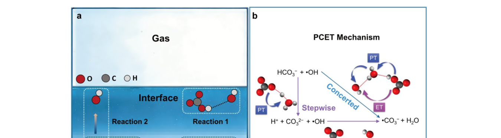
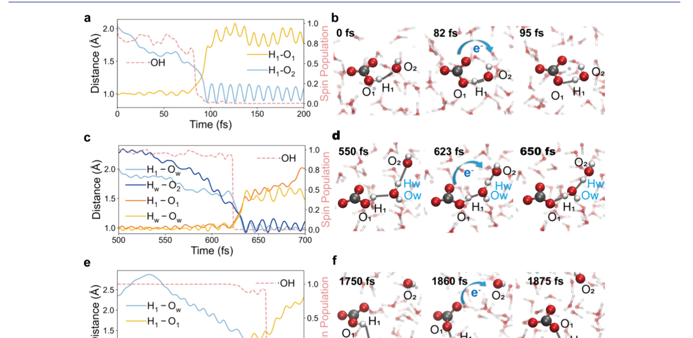
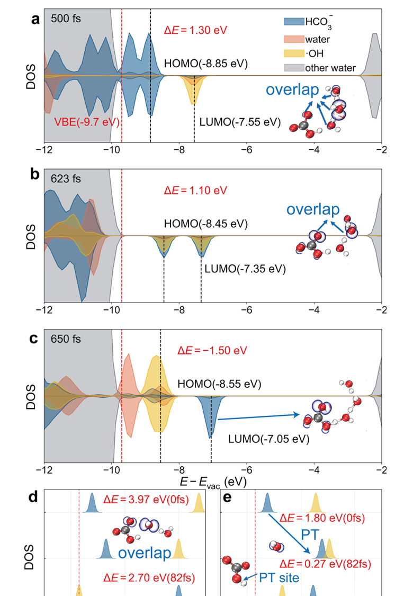
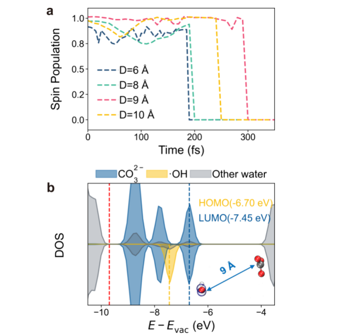
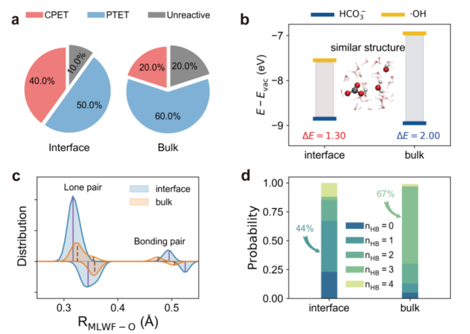

# Redefining ·CO3− Formation Chemistry: Zundel-like Switches Drive Carbonate-·OH Interfacial Reactivity

**Zotero key:** 8R59K9XG
**Attachment key:** 96MIVQKT
**Journal:** Journal of the American Chemical Society
**DOI:** 10.1021/jacs.6c01510
**Publication date:** 2026-06-17
**Source PDF:** paper.pdf

## Why This Paper / 为什么选这篇

**English:** This paper is worth prioritizing because it challenges a textbook bulk-solution picture of carbonate-radical chemistry. Instead of treating carbonate as a simple ·OH scavenger, it argues that the air-water interface can become the dominant ·CO3− source through Zundel-like proton-coupled electron-transfer switches. For your water-interface and radical-chemistry reading line, it is a useful bridge between AIMD, machine-learning potentials, microdroplet/interface reactivity, and environmental oxidation.

**中文:** 这篇值得优先读，是因为它直接挑战了“碳酸盐只是在均相体相里猝灭 ·OH”的传统图像。作者把重点转到气-液界面，提出类 Zundel 氢键构型像分子开关一样触发质子耦合电子转移，使界面成为 ·CO3− 的主要来源。对你后面读水界面、自由基化学、AIMD/机器学习势和微液滴/界面反应性文章很有衔接价值。

## Reading Guide / 读前导读

**English:** Read it in four passes. First, identify why the homogeneous-bulk paradigm fails in natural water, bubbling AOPs, and aerosol interfaces. Second, follow how HCO3− and ·OH become enriched at the air-water interface while CO3^2− remains bulk-preferring. Third, use Fig. 1-3 to separate CPET, water-mediated CPET, and PT-ET. Finally, read Fig. 5 as the design rule: partial solvation makes interfacial ·OH mobile enough to form the reactive Zundel-like geometry.

**中文:** 建议分四遍读。第一遍抓住均相体相范式为什么解释不了天然水、鼓泡 AOP 和气溶胶界面中的现象。第二遍看 HCO3− 和 ·OH 为什么富集在气-液界面，而 CO3^2− 更偏向体相。第三遍结合图 1-3 区分 CPET、水介导 CPET 和 PT-ET。最后把图 5 当作设计规则来读：部分溶剂化让界面 ·OH 具有足够迁移性，能够形成反应性的类 Zundel 几何构型。

## Terminology / 术语表

| English | 中文 | Note |
|---|---|---|
| carbonate radical, ·CO3− | 碳酸根自由基 ·CO3− | 本文追踪的关键氧化物种，是碳酸盐/羟基自由基反应的产物。 |
| hydroxyl radical, ·OH | 羟基自由基 ·OH | 强氧化性瞬态自由基；界面部分溶剂化后反应性显著改变。 |
| gas-liquid interface | 气-液界面 | 本文认为 ·CO3− 形成主要发生的微环境，而非传统均相体相。 |
| Zundel-like configuration | 类 Zundel 构型 | 具有 O···H···O 质子共享特征的氢键构型，被视为触发 PCET 的“分子开关”。 |
| PCET | 质子耦合电子转移 | 同时或先后涉及质子转移和电子转移的反应类型。 |
| CPET / PT-ET | 协同质子-电子转移 / 先质子后电子转移 | 本文区分的两条 HCO3− 与 ·OH 反应路径。 |
| PDOS | 投影态密度 | 用于解释反应物能级匹配、HOMO-LUMO 重叠和电子转移动力学。 |
| MACE-MP-0 | MACE-MP-0 机器学习势 | 用于突破 AIMD 时间尺度限制的原子体系机器学习势模型。 |
| NQE | 核量子效应 | 作者说明未显式计入，但认为主要影响绝对速率而非路径相对比例。 |

## Page / Section Index

- p.1-p.2: Abstract, introduction, and why the bulk paradigm fails
- p.2-p.3: Classical MD, BOMD, ML force-field setup, and NQE caveat
- p.3-p.4: Reactant localization and initial interfacial configurations
- p.4-p.5: CPET/PT-ET mechanisms and PDOS-based electronic explanation
- p.5-p.6: Interface versus bulk comparison, solvation, and Zundel-like switches
- p.7: Conclusions, data availability, author information, and acknowledgements

## Bilingual Reader / 逐段中英对照

**Source:** p.1 S001

**Original:** Redefining ·CO3−Formation Chemistry: Zundel-like Switches Drive Carbonate-·OH Interfacial Reactivity

**中文:** 重新定义·CO3−形成化学：类似 Zundel 的开关驱动碳酸盐-·OH 界面反应性

**Source:** p.1 S002

**Original:** ABSTRACT: The formation of carbonate radicals (·CO3−) via carbonate-hydroxyl radicals (·OH) reaction is the cornerstone of environmental oxidative cycles, yet its molecular mechanism has long been limited to homogeneous bulk-phase paradigms, a view that conflicts with enhanced reactivity in interfacial-rich systems. Characterizing these processes is hindered by the transience of ·OH, system heterogeneity, and the inability to resolve in situ pathways. Herein, we combine ab initio molecular dynamics and machine learning molecular dynamics to redefine ·CO3−formation chemistry. We reveal that the gas−liquid interfacial reaction dominates ·CO3−generation, mediated by two proton-coupled electron transfer pathways (concerted proton−electron transfer and stepwise proton-transfer followed by electron-transfer). Critical to this reactivity are Zundel/Zundel-like hydrogen-bonded configurations, which act as “molecular switches” to trigger rapid reactions, enabled by the intrinsic interfacial enrichment of ·OH (85.2%) and HCO3−(92.2%).

**中文:** 摘要：通过碳酸酯-羟基自由基（·OH）反应形成碳酸酯自由基（·CO3−）是环境氧化循环的基石，但其分子机制长期以来仅限于均质体相范式，这一观点与富界面体系中增强的反应性相冲突。 ·OH 的瞬时性、系统异质性以及无法解析原位途径阻碍了对这些过程的表征。在这里，我们结合从头算分子动力学和机器学习分子动力学来重新定义·CO3−形成化学。我们揭示了气液界面反应主导·CO3−生成，由两种质子耦合电子转移途径（协同质子电子转移和逐步质子转移随后电子转移）介导。这种反应性的关键是 Zundel/Zundel 类氢键构型，它充当“分子开关”来触发快速反应，这是由 ·OH (85.2%) 和 HCO3−(92.2%) 的内在界面富集实现的。

**Source:** p.1 S003

**Original:** The interfacial pathway outperforms bulk reactions in ·CO3−formation, with (90 ± 6.13)% yield [vs (80 ± 8.94)% in bulk] and approximately 100-fold faster rate [(1.15 ± 0.01) × 1011 M−1 s−1 vs (9.63 ± 0.03) × 108 M−1 s−1], attributed to the partial solvation of ·OH at the interface. Additionally, ·OH reacts with bulk-phase CO3^2−via heterogeneous electron transfer (bulk →interface), yielding a rate approximately 10-fold faster · CO3−formation than homogeneous bulk reactions. These findings challenge bulk-centric paradigms, establish the interface as the dominant ·CO3−source, and provide actionable insights for optimizing advanced oxidation processes, water remediation, and catalyst design by leveraging interfacial microenvironments. ■INTRODUCTION

**中文:** 界面途径在·CO3−形成方面优于本体反应，产率为 (90 ± 6.13)% [vs (80 ± 8.94)% 本体]，速率快约 100 倍 [(1.15 ± 0.01) × 1011 M−1 s−1 vs (9.63 ± 0.03) × 108 M−1 s−1]，归因于部分反应·OH在界面处的溶剂化。此外，·OH 通过非均相电子转移（体 → 界面）与体相 CO3^2− 发生反应，其生成速率比均相本体反应快约 10 倍。这些发现挑战了以本体为中心的范式，将界面确立为主要的·CO3源，并为利用界面微环境优化高级氧化过程、水修复和催化剂设计提供了可行的见解。 ■简介

**Source:** p.1 S004

**Original:** The formation of carbonate radicals (·CO3−) via carbonatehydroxyl radicals (·OH) reaction (involving HCO3−and CO3^2−) is the linchpin of the environmental oxidative cycle.1,2

**中文:** 通过碳酸酯羟基自由基 (·OH) 反应（涉及 HCO3− 和 CO3^2−）形成碳酸酯自由基 (·CO3−) 是环境氧化循环的关键。1,2

**Source:** p.1-2 S005

**Original:** It governs water purification via advanced oxidation processes (AOPs), self-purification of natural water, and formation of atmospheric secondary pollutants.1,3−5 Over half a century, its understanding has relied entirely on the so-called “homogeneous bulk” paradigm, the assumption that all reactions occur uniformly in a well-mixed solution without interfacial or spatial heterogeneity.6−9 Based on experimental data in homogeneous aqueous solutions, two core conclusions have been established: (i) carbonate acts as the efficient quencher of ·OH; (ii) as the concentration of carbonate increases, ·OH in the system is extensively consumed, leading to a predictable linear decrease in the system’s oxidative capacity.10 This paradigm is not only a classic theory in environmental chemistry textbooks but also directly informs practical work, including the design of bubbling AOPs reactors and the evaluation of pollution remediation in natural waters. However, accumulating evidence has revealed contradictions that the bulk paradigm cannot reconcile, indicating that real systems behave fundamentally differently from these classical predictions.

**中文:** 它通过高级氧化过程（AOP）控制水净化、天然水的自净化以及大气二次污染物的形成。1,3−5 半个多世纪以来，它的理解完全依赖于所谓的“均相本体”范式，即所有反应均匀地发生在充分混合的溶液中，没有界面或空间异质性。6−9 基于均质水溶液中的实验数据，建立了两个核心结论：（i）碳酸盐是·OH的有效猝灭剂；（i）碳酸盐是·OH的有效猝灭剂； (ii) 随着碳酸盐浓度的增加，系统中的·OH 被大量消耗，导致系统的氧化能力出现可预测的线性下降。 10 这一范式不仅是环境化学教科书中的经典理论，而且直接指导实际工作，包括鼓泡 AOP 反应器的设计和天然水体污染修复的评估。然而，越来越多的证据揭示了本体范式无法调和的矛盾，表明真实系统的行为与这些经典预测有根本不同。

**Source:** p.1-2 S006

**Original:** Recent studies across natural, engineered, and atmospheric environments consistently demonstrate this deviation. For natural water studies, Wang et al. used in situ laser-induced fluorescence to monitor lake surface water.11 As the HCO3− concentration increased, the bulk paradigm predicted that ·OH quenching would significantly suppress phenol degradation efficiency. Yet, the observed phenol degradation rate increased instead, and the total concentration of oxidatively active species in the system did not exhibit the expected decline. In industrial bubbling AOPs, the addition of NaHCO3 led to higher pollutant degradation efficiency.4,12,13 This directly conflicts with the bulk-phase assumption that “high carbonate inhibits AOPs.” Similarly, in atmospheric aerosol simulations, researchers have found that the concentration of ·CO3−(the key product of the carbonate-·OH reaction) at the gas−liquid interface is 2 orders of magnitude higher than that predicted for the bulk-phase, directly implying that interfacial reactions dominate ·CO3−formation.3,14,15 Collectively, these findings challenge the universality of the bulk paradigm.

**中文:** 最近对自然、工程和大气环境的研究一致证明了这种偏差。对于天然水研究，Wang 等人。使用原位激光诱导荧光来监测湖面水。11 随着 HCO3− 浓度的增加，本体范式预测 ·OH 猝灭将显着抑制苯酚降解效率。然而，观察到的苯酚降解率反而增加，并且系统中氧化活性物质的总浓度没有表现出预期的下降。在工业鼓泡 AOP 中，添加 NaHCO3 可以提高污染物降解效率。4,12,13 这与“高碳酸盐抑制 AOP”的体相假设直接相冲突。同样，在大气气溶胶模拟中，研究人员发现气液界面处·CO3−（碳酸盐-·OH 反应的关键产物）的浓度比体相预测的浓度高出 2 个数量级，直接意味着界面反应主导了·CO3− 的形成。 3,14,15 总的来说，这些发现挑战了体相范式的普遍性。

**Source:** p.1-2 S007

**Original:** Indeed, the surface layer of natural water bodies, aerosol interfaces, and gas−liquid contact zones in bubbling reactors share a unique feature: the existence of gas−liquid interface.16 This interface exhibits abnormal physical-chemical properties that affect the reaction compared to bulk-phase reactions.17,18 These observations further suggest that the key reaction between carbonate and ·OH may predominantly occur at the interface. The microenvironmental differences between the gas−liquid interface and the bulk phase provide important clues to these contradictions.19 On the one hand, unlike the disordered and random distribution of water molecules in the bulk phase, water molecules at the interface exhibit oriented ordering, forming an interfacial electric field that influences the reaction rate.17,20,21 On the other hand, the HCO3−form of carbonate spontaneously migrates and accumulates at the interface driven by entropy, increasing the collision probability between reactants.22,23 Meanwhile, ·OH shows significantly reduced solvation at the interface, resulting in more exposure of active sites and a longer residence time.24,25 These well-established interfacial advantages indicate that the gas−liquid interface could entirely alte

**中文:** 事实上，天然水体的表层、气溶胶界面和鼓泡反应器中的气液接触区都有一个独特的特征：气液界面的存在。 16 与体相反应相比，该界面表现出异常的物理化学性质，影响反应。 17,18 这些观察结果进一步表明，碳酸盐与·OH 之间的关键反应可能主要发生在界面处。气液界面和体相之间的微环境差异为这些矛盾提供了重要线索。 19 一方面，与体相中水分子无序、随机分布不同，界面处的水分子表现出定向有序，形成影响反应速率的界面电场。 17,20,21 另一方面，HCO3−形式的碳酸盐在熵的驱动下在界面处自发迁移和积累，增加了水分子与水分子之间的碰撞概率。 22,23 同时，·OH 在界面处表现出显着减少的溶剂化，导致更多的活性位点暴露和更长的停留时间。24,25 这些公认的界面优势表明气液界面可以完全改变

**Source:** p.1-2 S008

**Original:** r the conditions of carbonate-·OH reaction. Nevertheless, systematic investigations of this interfacial reaction remain scarce, primarily due to inherent limitations of conventional experimental techniques. Traditional methods (e.g., pulse radiolysis, laser flash photolysis) can quantify bulkphase kinetics but are unable to resolve atomic-scale interfacial dynamics, capture transient microenvironmental effects, or map reactants’ spatial distribution and solvation states at the gas−liquid boundary. As a result, the behavioral differences of ·OH and carbonate at the interface have not been quantitatively defined, nor has the specific impact of the interfacial environment on the reaction kinetics and product pathways been fully resolved. Consequently, the core question of whether the interfacial carbonate-·OH reaction is the root cause of the observed contradictions has remained speculative, leaving the interfacial mechanism insufficiently understood. To address this knowledge gap, this study employs a cuttingedge combination of ab initio molecular dynamics (AIMD) and machine learning (ML) to build high-precision potential energy surfaces that overcome AIMD’s time-scale limitations.

**中文:** r 碳酸酯-·OH反应的条件。然而，对这种界面反应的系统研究仍然很少，这主要是由于传统实验技术的固有局限性。传统方法（例如脉冲辐射分解、激光闪光光解）可以量化体相动力学，但无法解析原子尺度界面动力学、捕获瞬态微环境效应或绘制反应物在气液边界的空间分布和溶剂化状态。因此，·OH和碳酸盐在界面处的行为差异尚未得到定量定义，界面环境对反应动力学和产物途径的具体影响也没有得到完全解决。因此，界面碳酸酯-·OH反应是否是所观察到的矛盾的根本原因这一核心问题仍然是推测性的，使得界面机制还没有得到充分的了解。为了解决这一知识差距，本研究采用了从头算分子动力学 (AIMD) 和机器学习 (ML) 的前沿组合来构建高精度势能表面，克服了 AIMD 的时间尺度限制。

**Source:** p.1-2 S009

**Original:** We have investigated the reaction dynamics of ·OH with pHdependent carbonate species (HCO3−/CO3^2−) at the gas− liquid interface, aiming to redefine ·CO3−formation chemistry. We also resolve the proton-coupled electron transfer (PCET) mechanisms and identify the key “molecular switches” driving rapid ·CO3−generation. Most importantly, a systematic and quantitative comparison between homogeneous bulk solutions and gas−liquid interfacial systems is provided, yielding new understanding of oxidation chemistry beyond the bulk paradigm. ■THEORETICAL METHODS

**中文:** 我们研究了·OH 与 pH 依赖性碳酸盐物质 (HCO3−/CO3^2−) 在气液界面的反应动力学，旨在重新定义·CO3− 形成化学。我们还解决了质子耦合电子转移（PCET）机制，并确定了驱动快速·CO3−生成的关键“分子开关”。最重要的是，提供了均相本体溶液和气液界面系统之间的系统和定量比较，产生了超越本体范式的氧化化学的新理解。 ■理论方法

**Source:** p.2 S010

**Original:** Classical Molecular Dynamics Simulation Using the umbrella sampling method and periodic boundary conditions in the NVT ensemble, we computed the free-energy distribution of the reactants in various locations via the GROMACS program.26 A vacuum layer of 4 nm was added along the z-axis, and the water box size was fixed at a size of 2 × 2 × 2 nm, containing 267 water molecules. Nonbonded interactions were fitted using LennardJones and Coulomb potentials, whereas electrostatic interactions were fitted using the Ewald method, with a cutoff of 0.5 nm.27,28 There were 40 umbrella sample windows spaced 0.5 nm apart. The completed phase was run for 2 ns as the last source of free-energy data after pre-equilibration in each window, with the step size set to 2 fs. The Nose-Hoover thermostat was used to maintain the temperature at 300 K.29 Water molecules employed the SPC/E force field,30 while all reactants used the General Amber Force Field (GAFF).31 The weighted histogram analysis method (WHAM) was used to determine the free energy in various windows.32

**中文:** 经典分子动力学模拟 我们利用 NVT 系综中的伞式采样方法和周期性边界条件，通过 GROMACS 程序计算了反应物在不同位置的自由能分布。 26 沿 z 轴添加 4 nm 的真空层，水箱尺寸固定为 2 × 2 × 2 nm，包含 267 个水分子。使用 LennardJones 和库仑势拟合非键相互作用，而使用 Ewald 方法拟合静电相互作用，截止值为 0.5 nm。27,28 有 40 个间隔 0.5 nm 的伞状样本窗口。完成的阶段运行 2 ns，作为每个窗口中预平衡后的最后一个自由能数据源，步长设置为 2 fs。使用 Nose-Hoover 恒温器将温度维持在 300 K。29 水分子采用 SPC/E 力场，30 而所有反应物均使用通用琥珀力场 (GAFF)。31 使用加权直方图分析方法 (WHAM) 来确定各个窗口中的自由能。32

**Source:** p.2 S011

**Original:** By using the quickstep module of the CP2K code,33 the Born− Oppenheimer molecular dynamics (BOMD) simulation of ·OH and HCO3−was carried out using density functional theory (DFT) in conjunction with the Gaussian plane wave (GWP) approach in a 1.7 × 1.7 × 4.7 nm periodic box that included 128 water molecules. The Perdew−Burke−Ernzerhof (PBE) functional34 with the rVV10 nonlocal van der Waals correction35 was used to calculate the interaction and exchange of electrons. This combination is not only computationally efficient but also reliable for describing both the electronic structures and the energetics.36 The Goedecker-TeterHutter (GTH) pseudopotential37 was used to describe the nuclear electrons, whereas the triple Zeta-polarized TZVP plane wave basis set was used to represent the valence electrons. 520 Ry was chosen as the plane wave basis set’s energy cutoff.

**中文:** 通过使用 CP2K 代码的 Quickstep 模块，33 使用密度泛函理论 (DFT) 结合高斯平面波 (GWP) 方法，在包含 128 个水分子的 1.7 × 1.7 × 4.7 nm 周期盒中对·OH 和 HCO3− 进行了 Born−Oppenheimer 分子动力学 (BOMD) 模拟。使用带有 rVV10 非局域范德华校正的 Perdew−Burke−Ernzerhof (PBE) 函数 34 来计算电子的相互作用和交换。这种组合不仅计算效率高，而且对于描述电子结构和能量学也很可靠。 36 Goedecker-TeterHutter (GTH) 赝势 37 用于描述核电子，而三重 Zeta 极化 TZVP 平面波基组用于表示价电子。选择 520 Ry 作为平面波基组的能量截止值。

**Source:** p.2 S012

**Original:** The 3000 reaction structures and energy data obtained from the aforementioned BOMD simulation, 90% of which were used as the training set and 10% as the validation set, were utilized as a new data set for fine-tuning MACE-MP-0.38 The water cluster box was maintained in accordance with the aforementioned BOMD simulation settings while the Atomic Simulation Environment (ASE) program was utilized in conjunction with the refined ML force field model for molecular dynamics simulations.38 The Langevin thermostat was used to maintain the temperature of the NVT ensemble at 300 K,39 the simulation step was set to 1 fs, and the entire period was 20 ps. We conducted extra single-point energy calculations on the structural points chosen from the reaction trajectory on CP2K in order to gain precise information, such as the spin and charge of the reactants, as the MLP approach is unable to provide electronic structure information. We calculated the spin population every 10 fs during the reaction using hybrid DFT with PBEh(α) and 40%-HFX based on the ML trajectory.

**中文:** 上述BOMD模拟得到的3000个反应结构和能量数据，其中90%作为训练集，10%作为验证集，被用作微调MACE-MP-0.38的新数据集。按照上述BOMD模拟设置维护水簇盒，同时利用原子模拟环境（ASE）程序结合细化的ML力场模型进行分子动力学模拟。 38使用Langevin恒温器将 NVT 系综的温度保持在 300 K，39 模拟步长设置为 1 fs，整个周期为 20 ps。由于 MLP 方法无法提供电子结构信息，我们对从 CP2K 反应轨迹中选择的结构点进行了额外的单点能量计算，以获得精确的信息，例如反应物的自旋和电荷。我们使用基于 ML 轨迹的 PBEh(α) 和 40%-HFX 的混合 DFT 计算反应过程中每 10 fs 的自旋种群。

**Source:** p.2 S013

**Original:** Spin density, defined as the difference between the charge densities of spin-α and spin-β electrons, reflects the local distribution of unpaired electrons within a molecular system.40,41 It serves as a key observable for quantifying radical character, where positive and negative values correspond to net excesses of spin-α and spin-β electrons, respectively. In our calculations, ·OH has a net spin density of 1 corresponding to a doublet state (multiplicity = 2). This indicates one unpaired electron and confirms ·OH as an oxygencentered monoradical. Auxiliary density matrix method (ADMM) was utilized to speed up the computation, and the geometrical response basis valence set (ccGRB-T) was employed to describe the electrons.42

**中文:** 自旋密度定义为自旋 α 和自旋 β 电子的电荷密度之差，反映了分子系统内不成对电子的局部分布。 40,41 它是量化自由基特征的关键可观测值，其中正值和负值分别对应于自旋 α 和自旋 β 电子的净过量。在我们的计算中，·OH 的净自旋密度为 1，对应于双峰态（多重性 = 2）。这表明有一个不成对的电子，并证实·OH 是一个以氧为中心的单自由基。利用辅助密度矩阵法（ADMM）来加速计算，并利用几何响应基价集（ccGRB-T）来描述电子。 42

**Source:** p.2-3 S014

**Original:** It should be noted that the present classical molecular dynamics simulations do not explicitly account for quantum nuclear effects (NQEs), which are known to accelerate proton-transfer processes in aqueous environments.43,44 However, they primarily affect the absolute reaction rates while having a negligible impact on the relative rates between different reaction pathways and the corresponding branching ratios. This is because the tunneling and zero-point energy corrections are comparable for similar hydrogenbonded proton-transfer processes in the same system. Furthermore, the net effect of NQEs on the thermodynamic properties such as reaction free energies is typically small due to compensating enthalpic and entropic contributions.45,46 Thus, the qualitative conclusions regarding the reaction mechanism, the thermodynamic preference for interfacial localization of the reactants, and the role of key configurations remain valid. Future work employing path-integral molecular dynamics simulations will be conducted to obtain more precise absolute rate constants and further quantify the influence of the NQEs. ■RESULTS

**中文:** 应该指出的是，目前的经典分子动力学模拟并未明确考虑量子核效应（NQE），众所周知，量子核效应会加速水环境中的质子转移过程。 43,44 然而，它们主要影响绝对反应速率，而对不同反应途径之间的相对速率和相应支化比的影响可以忽略不计。这是因为对于同一系统中类似的氢键质子转移过程，隧道效应和零点能量校正是可比的。此外，由于补偿了焓和熵的贡献，NQE 对热力学性质（例如反应自由能）的净效应通常很小。45,46 因此，关于反应机理、反应物界面局部化的热力学偏好以及关键构型的作用的定性结论仍然有效。未来的工作将采用路径积分分子动力学模拟来获得更精确的绝对速率常数并进一步量化 NQE 的影响。 ■结果

**Source:** p.3-4 S015

**Original:** To address the long-standing bulk-phase paradigm that assumes carbonate-·OH reactions occur exclusively in homogeneous solutions, a critical prerequisite is to clarify the spatial distribution of reactants (·OH and carbonate) within the system. As emphasized in the introduction, this bulkcentric view fails to explain interfacial contradictions, and here we directly resolve this by mapping reactant locations. Figure S1 illustrates the movement of HCO3−/CO3^2−and ·OH across the air−water interface and the corresponding Gibbs freeenergy changes: HCO3−exhibits significant enrichment at the air−water interface (92.2%, corresponding to the lowest free energy), and ·OH also accumulates there (85.2%), while CO3^2−preferentially resides in the bulk phase, consistent with previous experimental findings23,47 but in stark contrast to the bulk paradigm’s implicit assumption. It is worth emphasizing that the interfacial preference results obtained from the ML force field simulations further validate these findings, with excellent agreement observed (Figure S2).

**中文:** 为了解决长期以来假定碳酸盐-·OH 反应仅发生在均相溶液中的体相范式，一个关键的先决条件是澄清系统内反应物（·OH 和碳酸盐）的空间分布。正如引言中所强调的，这种体积中心观点无法解释界面矛盾，在这里我们通过绘制反应物位置直接解决这个问题。图 S1 说明了 HCO3−/CO3^2− 和·OH 穿过空气 - 水界面的运动以及相应的吉布斯自由能变化：HCO3− 在空气 - 水界面处表现出显着富集（92.2％，对应于最低的自由能），并且·OH 也在那里积累（85.2％），而 CO3^2− 优先驻留在体相中，与之前的实验结果一致23,47 但与批量范式的隐含假设。值得强调的是，从 ML 力场模拟获得的界面偏好结果进一步验证了这些发现，并观察到了极好的一致性（图 S2）。

**Source:** p.3-4 S016

**Original:** Based on this spatial characterization, to elucidate the interfacial reaction mechanism and explicitly contrast interfacial and bulk behaviors, three distinct reaction systems were simulated (Figure 1a): (1) Interfacial carbonate-·OH reaction (·OH + HCO3−); (2) reaction between interfacial ·OH and bulk-phase CO3^2−; (3) bulk-phase carbonate-·OH reactions (·OH + HCO3−/CO3^2−). To comprehensively characterize the interfacial reaction mechanism, we designed initial reaction configurations considering two key factors: reactant distance (affecting the strength of intermolecular interactions) and relative orientation between the active site of ·OH (oxygen atom) and the reaction sites of HCO3−(e.g., hydroxyl oxygen, carbonate oxygen), altering the transition state stability. We constructed diverse spatial arrangements and simulated 22 trajectories for interfacial ·OH-HCO3−reactions (details in the Supporting Information).

**中文:** 基于这种空间表征，为了阐明界面反应机制并明确对比界面和本体行为，模拟了三个不同的反应系统（图1a）：（1）界面碳酸盐-·OH反应（·OH + HCO3−）； (2)界面·OH与体相CO3^2−之间的反应； (3)本体相碳酸盐-·OH反应(·OH + HCO3−/CO3^2−)。为了全面表征界面反应机理，我们设计了初始反应构型，考虑了两个关键因素：反应物距离（影响分子间相互作用的强度）以及·OH（氧原子）活性位点和HCO3−反应位点（例如羟基氧、碳酸氧）之间的相对方向，从而改变了过渡态稳定性。我们构建了不同的空间排列并模拟了 22 种界面·OH-HCO3−反应轨迹（详细信息参见支持信息）。

### Fig. 1. Interfacial/bulk models and PCET pathways

**Placed near:** S016
**Source:** p.3 F001

**Original caption:** Figure 1. (a) Modeling of the interfacial and bulk-phase reaction systems. (b) Two PCET reaction mechanisms, namely, the CPET and PT-ET pathways. Color codes: O (red), C (grey), and H (white).

**中文图注:** 图 1.(a) 界面和体相反应系统的建模。 (b)两种PCET反应机制，即CPET和PT-ET途径。颜色代码：O（红色）、C（灰色）和 H（白色）。

**Reading note:** Use this figure to separate the three simulated reaction environments and the two proton-coupled electron-transfer routes.

**阅读提示:** 使用该图来区分三个模拟反应环境和两个质子耦合电子转移路径。

**Source:** p.4 S017

**Original:** Formation Mechanism of ·CO3−from ·OH and HCO3−at the Air−Water Interface are revealed for the interfacial reaction between ·OH and HCO3−, namely, the concerted proton−electron transfer (CPET) and the stepwise proton-transfer followed by electron-transfer (PT-ET) pathways. Notably, the difference between these two mechanisms lies in that CPET involves the concerted transfer of an electron and a proton in a single elementary step, whereas PT-ET proceeds via a stepwise process with proton transfer preceding electron transfer.49,50

**中文:** 揭示了·OH和HCO3−之间的界面反应，在空气-水界面处由·OH和HCO3−形成·CO3−的形成机制，即协同质子电子转移（CPET）和逐步质子转移随后电子转移（PT-ET）途径。值得注意的是，这两种机制之间的区别在于，CPET 涉及在单个基本步骤中协调电子和质子的转移，而 PT-ET 通过逐步过程进行，质子转移先于电子转移。 49,50

**Source:** p.4 S018

**Original:** Meanwhile, these mechanisms are observed not only at the interface but also in the bulk phase (Figure 1a), with the 22 simulated trajectories detailed in Figure S4a, as well as the corresponding reaction ratios are presented in Figure S4b and their differences to be elaborated in detail in the subsequent discussion. Proton and electron transfer events are presented in Figure S4b. Specifically, the CPET mechanism accounts for 45% of the reactions, while the PT-ET mechanism contributes 33%. Figure 2a−c depicts the changes in the O−H distances and the spin multiplicity of ·OH to illustrate the proton transfer (PT) and electron transfer (ET) processes, respectively. Taking the anhydrous CPET mechanism (Figure 2a) as an example, over time, the gradual increase in the O1−H1 distance within HCO3−(yellow solid line) and the gradual decrease in the H1−O2 distance (blue line) denote the PT process, while the progressive reduction in the spin multiplicity of ·OH (red dashed line) signifies the ET process. Ultimately, the ·CO3−is generated, and the corresponding structural evolution is illustrated in Figure 2b.

**中文:** 同时，这些机制不仅在界面处而且在体相中也被观察到（图1a），图S4a中详细介绍了22个模拟轨迹，图S4b中给出了相应的反应比率，它们的差异将在随后的讨论中详细阐述。质子和电子转移事件如图 S4b 所示。具体来说，CPET机制占反应的45%，而PT-ET机制贡献33%。图 2a−c 描述了 OH 距离和·OH 自旋多重数的变化，分别说明了质子转移 (PT) 和电子转移 (ET) 过程。以无水CPET机理（图2a）为例，随着时间的推移，HCO3−（黄色实线）内O1−H1距离逐渐增大和H1−O2距离（蓝线）逐渐减小表示PT过程，而·OH（红色虚线）自旋多重数逐渐减小表示ET过程。最终，生成·CO3−，相应的结构演化如图2b所示。

### Fig. 2. Time-resolved ·CO3− formation mechanisms

**Placed near:** S018
**Source:** p.3 F002

**Original caption:** Figure 2. Characterization of different ·CO3− mechanisms for the interfacial reaction between ·OH and HCO3−. (a,c,e) Time-dependent changes in O-H distances and ·OH spin for different mechanisms: (a) CPET mechanism, (c) water-mediated CPET mechanism, and (e) PT-ET mechanism. (b,d,f) Structural snapshots of the corresponding mechanisms. Color codes: O (red), C (grey), and H (white).

**中文图注:** 图 2. ·OH 和 HCO3− 之间界面反应的不同 ·CO3− 机制的表征。 (a,c,e)不同机制的O-H距离和·OH自旋随时间的变化：(a) CPET机制，(c)水介导的CPET机制，和(e) PT-ET机制。 (b,d,f) 相应机制的结构快照。颜色代码：O（红色）、C（灰色）和 H（白色）。

**Reading note:** The key information is the timing relation between proton transfer, electron transfer, and the structural snapshots.

**阅读提示:** 关键信息是质子转移、电子转移和结构快照之间的时间关系。

**Source:** p.4 S019

**Original:** Both the interfacial reaction pathways of ·OH with HCO3− (CPET and PT-ET) belong to PCET,48 but they differ in the timing of PT and ET. CPET involves near-simultaneous PT and ET via a distinct configurational arrangement, and PT-ET follows a clear stepwise sequence: PT occurs first and then ET. Notably, not only the interfacial bimolecular reactions (·OHHCO3−in Figure 2a), but also the trimolecular reactions (e.g., ·OH-HCO3−with one water molecule in Figure 2b) and even tetramolecular reactions (·OH-HCO3−with two water molecules in Figure S9) require the prior formation of the aforementioned specific configurational arrangement to proceed. Such a configuration in the CPET mechanism is referred to as a hydrogen-bonded complex [HCO3−··· (H2O)n····OH], and our simulation results show that once this complex forms, the reaction proceeds promptly, even from mismatched initial configurations. This confirms that this specific type of hydrogen-bonded configuration drives the CPET mechanism.

**中文:** ·OH 与 HCO3− 的两种界面反应途径（CPET 和 PT-ET）都属于 PCET，48 但它们在 PT 和 ET 的时间上有所不同。 CPET 通过不同的构型排列涉及近乎同时的 PT 和 ET，而 PT-ET 遵循清晰的逐步顺序：首先发生 PT，然后发生 ET。值得注意的是，不仅界面双分子反应（图2a中的·OHHCO3−），而且三分子反应（例如图2b中的·OH-HCO3−与一个水分子）甚至四分子反应（图S9中的·OH-HCO3−与两个水分子）都需要事先形成上述特定的构型排列才能进行。 CPET机理中的这种构型被称为氢键配合物[HCO3−…(H2O)n…OH]，我们的模拟结果表明，一旦这种配合物形成，即使初始构型不匹配，反应也会迅速进行。这证实了这种特定类型的氢键构型驱动了 CPET 机制。

**Source:** p.4 S020

**Original:** Analysis of prereaction configurations reveals two scenarios for CPET: HCO3−···(·OH) forms a Zundel-like configuration (in Figure S8a), or HCO3−···H2O··· (·OH) forms dual Zundel-like configurations (in Figure S8b), which act as “molecular switches” to trigger rapid ·CO3− formation. These Zundel-like configurations possess the same O···H···O motif as the canonical Zundel structure.51,52

**中文:** 对预反应构型的分析揭示了 CPET 的两种情况：HCO3−··(·OH) 形成 Zundel 型构型（图 S8a），或 HCO3−·H2O·(·OH) 形成双 Zundel 型构型（图 S8b），其充当“分子开关”来触发快速·CO3− 形成。这些类似 Zundel 的构型具有与标准 Zundel 结构相同的 O·H·O 基序。 51,52

**Source:** p.4 S021

**Original:** However, they exhibit asymmetry because of the different chemical species involved. Therefore, they function as reactive intermediates rather than bulk solvation states. Prior studies have found that such configurations facilitate PT,53,54 and our trajectories further confirm that they also promote ET.55 For the PT-ET mechanism, all prereaction configurations adopt the motif HCO3−···(H2O)n (n ≥0). After this complex forms, a PT occurs from HCO3−to H2O, generating CO3^2−and H3O+. Approximately 50 fs later, an electron delocalizes from CO3^2−to ·OH, yielding ·CO3−and OH−. To further clarify the nature of the aforementioned reaction processes, we calculated the projected density of states (PDOS) for reactants in aforementioned mechanisms. For the water-mediated CPET mechanism (Figure 3a−c), the initial energy gap between HCO3−and ·OH is 1.30 eV. However, the strong highest occupied molecular orbital-lowest unoccupied molecular orbital (HOMO−LUMO) overlap (Figure 3b) reduces it to 1.10 eV, explaining why the formation of Zundel-like structures and the involvement of water could promote the reaction.

**中文:** 然而，由于涉及的化学物质不同，它们表现出不对称性。因此，它们充当反应中间体而不是本体溶剂化状态。先前的研究发现这种构型有利于 PT,53,54 并且我们的轨迹进一步证实它们也促进了 ET.55 对于 PT-ET 机制，所有预反应构型均采用基序 HCO3−·(H2O)n (n ≥0)。在这种复合物形成后，发生从 HCO3− 到 H2O 的 PT，生成 CO3^2− 和 H3O+。大约 50 fs 后，电子从 CO3^2− 离域到·OH，产生·CO3− 和 OH−。为了进一步阐明上述反应过程的性质，我们计算了上述机制中反应物的预计态密度（PDOS）。对于水介导的 CPET 机制（图 3a−c），HCO3− 和·OH 之间的初始能隙为 1.30 eV。然而，强烈的最高占据分子轨道-最低未占据分子轨道（HOMO−LUMO）重叠（图3b）将其降低至1.10 eV，这解释了为什么Zundel类结构的形成和水的参与可以促进反应。

### Fig. 3. PDOS energy-level changes

**Placed near:** S021
**Source:** p.5 F003

**Original caption:** Figure 3. Energy-level changes of different mechanisms. (a,b,c) Water-mediated CPET mechanism at different time points. PDOS is shown, with labeled orbital species assignments and energy values. ΔE represents the energy gap. The inset shows the orbital localization of the unpaired electron, revealing the prereaction orbital overlap. (d) Direct CPET mechanism at different time points. (e) PT-ET mechanism at different time points. The figure marks the reduction of energy gap caused by the PT process. In all figures, the red dashed line represents the aqueous solution valence band edge (VBE).

**中文图注:** 图3.不同机制的能级变化。 (a,b,c)不同时间点水介导的CPET机制。显示了 PDOS，并带有标记的轨道物种分配和能量值。 ΔE代表能隙。插图显示了不成对电子的轨道定位，揭示了预反应轨道重叠。 (d)不同时间点的直接CPET机制。 (e)不同时间点的PT-ET机制。该图标志着PT过程引起的能隙的减小。在所有图中，红色虚线代表水溶液价带边缘（VBE）。

**Reading note:** This is the electronic-structure explanation for why Zundel-like motifs lower the effective gap.

**阅读提示:** 这就是为什么类似 Zundel 的基序会降低有效间隙的电子结构解释。

**Source:** p.4 S022

**Original:** For the direct CPET mechanism (Figure 3d), even though the initial energy gap is as high as 3.7 eV, the reaction can still occur after the formation of Zundel-like structuresfurther highlighting the key role of Zundel-like structures. For PT-ET (Figure 3e), the initial gap is 1.8 eV; after PT converts HCO3−to CO3^2−, the gap narrows to 0.3 eV, enabling easy ET.

**中文:** 对于直接CPET机制（图3d），即使初始能隙高达3.7 eV，在类Zundel结构形成后仍然可以发生反应，进一步凸显了类Zundel结构的关键作用。对于 PT-ET（图 3e），初始能隙为 1.8 eV； PT 将 HCO3− 转换为 CO3^2− 后，能隙缩小至 0.3 eV，从而实现轻松的 ET。

**Source:** p.4 S023

**Original:** Formation Mechanism of ·CO3−between Interfacial ·OH and Bulk-Phase CO3^2−

**中文:** 界面·OH与体相CO3^2−之间·CO3−的形成机制

**Source:** p.4-6 S024

**Original:** Furthermore, we extend our study to account for pH, a critical environmental factor that regulates carbonate speciation. Generally, HCO3−undergoes pH-dependent dissociation (HCO3−⇌CO3^2−+ H+, pKa ≈10.3 at 25 °C), leading to dynamic shifts in the HCO3−/CO3^2−ratio: HCO3−dominates at pH 6.5−10.3, while CO3^2−becomes prevalent at pH > 10.3. This suggests that real environments feature pH-driven reaction process. Leveraging the bulk-dominant distribution of CO3^2−, the reaction between interfacial ·OH and bulk CO3^2−was simulated. Figure 4a presents four reaction trajectories of ·OH with CO3^2−at different distances (D ≈6, 8, 9, and 10 Å). Across all four trajectories, the spin density of ·OH drops to 0 within 300 fs, indicating a rapid reaction process. Taking the specific long-distance reaction configuration (·OH−CO3^2−at 9 Å) as an example, the PDOS analysis reveals that the origin of rapid electron transfer likely lies in a low-energy gap (0.75 eV in Figure 4b). The corresponding reaction proceeds exclusively via a singleelectron transfer mechanism. Critically, this differs from the homogeneous electron transfer observed in bulk-phase ·OH− CO3^2−simulations;

**中文:** 此外，我们将研究范围扩展到 pH 值，这是调节碳酸盐形态的关键环境因素。一般来说，HCO3− 经历 pH 依赖性解离（HCO3−⇌CO3^2−+ H+，25 °C 时 pKa ≈10.3），导致 HCO3−/CO3^2− 比率动态变化：HCO3− 在 pH 6.5−10.3 时占主导地位，而 CO3^2− 在 pH > 10.3 时占主导地位。这表明真实环境具有 pH 驱动的反应过程。利用 CO3^2− 的本体主导分布，模拟了界面·OH 和本体 CO3^2− 之间的反应。图 4a 显示了·OH 与 CO3^2− 在不同距离（D ≈6、8、9 和 10 Å）下的四种反应轨迹。在所有四个轨迹中，·OH 的自旋密度在 300 fs 内降至 0，表明反应过程快速。以特定的长距离反应构型（·OH−CO3^2−at 9 Å）为例，PDOS分析表明快速电子转移的根源可能在于低能隙（图4b中的0.75 eV）。相应的反应仅通过单电子转移机制进行。重要的是，这与体相 ·OH− CO3^2− 模拟中观察到的均匀电子转移不同；

### Fig. 4. Heterogeneous electron transfer from bulk CO3^2− to interfacial ·OH

**Placed near:** S024
**Source:** p.5 F004

**Original caption:** Figure 4. Characterization of the reaction mechanisms between interfacial ·OH and bulk-phase CO3^2−. (a) ·OH spin for all trajectories. (b) Energy-level gap between CO3^2− and ·OH in the prereaction structure at 9 Å, indicating that electrons can readily transfer from CO3^2− to the ·OH radical. The red dashed line represents the aqueous solution valence band edge (VBE).

**中文图注:** 图 4. 界面·OH 和体相 CO3^2− 之间反应机制的表征。 (a) ·所有轨迹的 OH 自旋。 (b) 预反应结构中CO3^2− 和·OH 之间的能级差距为9 Å，表明电子可以很容易地从CO3^2− 转移到·OH 自由基。红色虚线代表水溶液价带边缘（VBE）。

**Reading note:** Read it as the pH/speciation branch: CO3^2− stays bulk-like but can still transfer an electron to interfacial ·OH.

**阅读提示:** 将其解读为 pH/形态分支：CO3^2− 保持块状，但仍然可以将电子转移到界面·OH。

**Source:** p.4-6 S025

**Original:** instead, it constitutes heterogeneous electron transfer from bulk CO3^2−to interfacial ·OH, with a reaction rate nearly 10-fold faster than that in the bulk, which is attributed to the enrichment of ·OH at the interface. Our findings highlight that the gas−liquid interface acts as a “reaction hub” for carbonate−·OH chemistry, accommodating pH-dependent HCO3−/CO3^2−ratios via complementary mechanisms (CPET/PT-ET for HCO3−and heterogeneous single electron transfer for CO3^2−) and sustaining high oxidative activity. Comparison of Interfacial and Liquid-Phase ·CO3− Formation Mechanisms The significant concentration enrichment of HCO3−and ·OH at the gas−liquid interface, coupled with the rapid reaction kinetics from our simulations, points to interfacial reactions as a viable pathway. This stands in contrast to early pulse radiolysis studies in homogeneous liquid solutions, which underpinned the long-standing bulk-phase paradigm. To systematically compare similarities and differences between HCO3−and ·OH across distinct environments (interface vs bulk), we performed additional simulations in the liquid phase.

**中文:** 相反，它构成了从本体CO3^2−到界面·OH的异质电子转移，反应速率比本体快近10倍，这归因于界面·OH的富集。我们的研究结果强调，气液界面充当碳酸盐−·OH化学的“反应中心”，通过互补机制（HCO3−的CPET/PT-ET和CO3^2−的异质单电子转移）调节pH依赖性HCO3−/CO3^2−比率，并维持高氧化活性。界面和液相 ·CO3− 形成机制的比较 HCO3− 和 ·OH 在气液界面处的显着浓度富集，加上我们模拟的快速反应动力学，表明界面反应是一种可行的途径。这与早期均质液体溶液中的脉冲放射分解研究形成鲜明对比，后者支撑了长期存在的体相范式。为了系统地比较 HCO3− 和·OH 在不同环境（界面与本体）之间的异同，我们在液相中进行了额外的模拟。

**Source:** p.4-6 S026

**Original:** The initial configurations were selected with reference to those of interfacial reactions, excluding two trajectories where the −OH group of HCO3−faces the gas phase (case E), resulting in 20 trajectories. Bulk-phase reactivity reached (80 ± 8.94)% [(60 ± 13.40)%: PT-ET, (20 ± 8.90)%: CPET], whereas the gas−liquid interface achieved a (90 ± 6.13)% ·CO3−formation probability, 12.5 ± 10.80% points higher (Figure 5a). Notably, the proportions of the distinct PCET mechanisms differ at the interface as well. In particular, the CPET pathway accounts for (40 ± 10.40)% of the total mechanism at the interface in contrast to only (20 ± 8.90)% in the bulk phase. Kinetic analysis, deriving from ·OH spin dynamics and lifetime measurements (Figure S6), revealed interface rate constants up to 1011 s−1 (Table S1). Combined with the interfacial reactant enrichment, the reaction rate at the interface is more than 2 orders of magnitude faster than that in the bulk liquid [vinterface: (1.15 ± 0.01) × 1011 M−1 s−1 vs vbulk: (9.63 ± 0.03) × 108 M−1 s−1]. To uncover the origin of this rate difference, we compared the PDOS plots of reactions with matched initial configurations in both environments.

**中文:** 参考界面反应选择初始构型，排除HCO3−的-OH基团面向气相的两条轨迹（情况E），得到20条轨迹。体相反应性达到(80±8.94)%[(60±13.40)%：PT-ET，(20±8.90)%：CPET]，而气液界面达到(90±6.13)%·CO3−形成概率，高出12.5±10.80%(图5a)。值得注意的是，不同 PCET 机制的比例在界面上也有所不同。特别是，CPET 途径占界面总机制的 (40 ± 10.40)%，而在体相中仅占 (20 ± 8.90)%。由·OH 自旋动力学和寿命测量得出的动力学分析（图 S6）揭示了高达 1011 s−1 的界面速率常数（表 S1）。结合界面反应物富集，界面处的反应速率比本体液体中的反应速率快2个数量级以上[v界面：(1.15±0.01)×1011M−1s−1 vs vbulk：(9.63±0.03)×108M−1s−1]。为了揭示这种速率差异的根源，我们将两种环境中的反应 PDOS 图与匹配的初始配置进行了比较。

### Fig. 5. Interface versus liquid-phase ·OH-HCO3− reactions

**Placed near:** S026
**Source:** p.6 F005

**Original caption:** Figure 5. Comparison of ·OH-HCO3− reaction characteristics: liquid phase vs interface. (a) Reaction probability statistics. (b) Energy-level information on water-involved CPET mechanisms in interfacial and liquid-phase environments. (c) Distributions of distances from the intramolecular oxygen of ·OH to the maximally localized Wannier centers in the interfacial and liquid-phase environments. (d) Hydrogen bond acceptor statistics for ·OH.

**中文图注:** 图 5. ·OH-HCO3− 反应特性的比较：液相与界面。 (a) 反应概率统计。 (b)界面和液相环境中涉及水的CPET机制的能级信息。 (c) 界面和液相环境中·OH 的分子内氧到最大局部 Wannier 中心的距离分布。 (d) ·OH 的氢键受体统计。

**Reading note:** This figure connects solvation, energy alignment, and branching ratios into the paper's design rule.

**阅读提示:** 该图将溶剂化、能量排列和支化比连接到论文的设计规则中。

**Source:** p.4-6 S027

**Original:** As shown in Figure 5b, the prereaction energy gap between reactants is 2.0 eV in the bulk phase, significantly larger than the 1.3 eV gap at the interface. This energy alignment advantage explains the faster interfacial reaction process, directly validating the speculation that the interfacial microenvironment reshapes the reaction thermodynamics. It is worth emphasizing that the configurations in these two environments are similar and follow the same mechanism, as shown in Figure S10. While numerous studies have established that interfacial environments accelerate reactions relative to the bulk, the underpinning mechanism remains debated. Our work resolves this ambiguity by identifying a dual driver: the formation of stable Zundel-like hydrogen-bonded structure in the prereaction configuration [·OH···HCO3−···(H2O)n (n ≥0)] and the regulatory role of solvation extenttwo factors tightly coupled to reaction feasibility. Figure S5 tracks the hydrogenbond lifetimes in reactive configurations, linking the stable hydrogen-bond (a hallmark of Zundel-like structures) to the reaction success.

**中文:** 如图 5b 所示，体相中反应物之间的预反应能隙为 2.0 eV，明显大于界面处的 1.3 eV 能隙。这种能量排列优势解释了更快的界面反应过程，直接验证了界面微环境重塑反应热力学的推测。值得强调的是，这两个环境中的配置相似并且遵循相同的机制，如图S10所示。尽管大量研究已证实界面环境相对于整体而言会加速反应，但其基础机制仍存在争议。我们的工作通过确定双重驱动因素解决了这一歧义：在预反应构型中形成稳定的 Zundel 状氢键结构 [·OH·HCO3····(H2O)n (n ≥0)] 以及溶剂化程度的调节作用，这两个因素与反应可行性紧密耦合。图 S5 跟踪了反应构型中的氢键寿命，将稳定的氢键（类 Zundel 结构的标志）与反应成功联系起来。

**Source:** p.4-6 S028

**Original:** Reactive systems require persistent hydrogen bonds: bulk-phase reactions demand longer lifetimes (0.876 ps) to form such structures, whereas interfacial reactions achieve stability with shorter lifetimes (0.424 ps). In contrast, nonreactive configurations in both environments lack stable hydrogen bonds (lifetimes < 0.100 ps). This confirms that interface−bulk differences modulate ·CO3−formation probability by governing the ability to form Zundel-like hydrogenbonded geometries, with the interface inherently favoring this reactive arrangement. To dissect how solvation and Zundel-like structure formation shape reaction mechanisms, we compared the interfacial and bulk-phase trajectories with the matched initial configurations and quantified their reactivity. At the interface, ·OH exhibits enhanced mobility due to partial solvation. This flexibility allows ·OH to readily adjust its position relative to HCO3−, facilitating the formation of Zundel-like structures across different separations. In stark contrast, bulk-phase ·OH is fully solvated, drastically reducing its mobility.

**中文:** 反应系统需要持久的氢键：体相反应需要更长的寿命（0.876 ps）才能形成这种结构，而界面反应则以更短的寿命（0.424 ps）实现稳定性。相比之下，两种环境中的非反应性构型都缺乏稳定的氢键（寿命< 0.100 ps）。这证实了界面-体积差异通过控制形成 Zundel 状氢键几何形状的能力来调节·CO3-形成概率，界面本质上有利于这种反应排列。为了剖析溶剂化和类 Zundel 结构的形成如何塑造反应机制，我们将界面和体相轨迹与匹配的初始构型进行了比较，并量化了它们的反应性。在界面处，·OH 由于部分溶剂化而表现出增强的迁移率。这种灵活性使得·OH 能够轻松调整其相对于 HCO3− 的位置，从而促进在不同分离中形成类似 Zundel 的结构。与此形成鲜明对比的是，体相·OH 完全溶剂化，大大降低了其迁移率。

**Source:** p.4-6 S029

**Original:** We further elucidated the solvation effect both qualitatively and quantitatively by linking the electronic structure of ·OH to its hydrogen-bonding behavior and Zundel-like structure formation. Qualitatively, ·OH features one unpaired electron and one lone electron pair [as shown by maximally localized Wannier functions (MLWFs) in Figure 5c], making its proton positively charged (prone to donating to adjacent water molecules) and its oxygen electronegative (prone to accepting hydrogen bonds from adjacent water molecules due to the lone pair). Since hydrogen bonds are electrostatic interactions, their acceptor capacity can be approximated by the distance between the lone pair (negative charge center) and positive nuclei, directly reflecting local positivity. Analysis of these electron pair-nucleus distances (Figure 5c) reveals a key difference: compared to the bulk, interfacial ·OH has a stronger proton-donor ability but a weaker oxygen-acceptor ability. Quantitatively, this electronic signature makes interfacial ·OH hydrophobic, favoring monodentate hydrogenbonded configurations (44% in Figure 5d) that support a rapid reaction.

**中文:** 通过将·OH的电子结构与其氢键行为和类Zundel结构的形成联系起来，我们进一步定性和定量地阐明了溶剂化效应。定性地讲，·OH 具有一个不成对电子和一个孤电子对（如图 5c 中的最大局域 Wannier 函数 (MLWF) 所示），使其质子带正电（易于向邻近的水分子提供）和氧电负性（由于孤电子对，易于接受邻近水分子的氢键）。由于氢键是静电相互作用，其受体容量可以用孤电子对（负电荷中心）与正核之间的距离来近似，直接反映局部正性。对这些电子对-核距离的分析（图 5c）揭示了一个关键区别：与本体相比，界面·OH 具有更强的质子供体能力，但较弱的氧受体能力。从数量上讲，这种电子特征使界面·OH具有疏水性，有利于支持快速反应的单齿氢键构型（图5d中的44％）。

**Source:** p.4-6 S030

**Original:** In the bulk phase, the fraction of ·OH acting as the hydrogen-bond acceptor prereaction further confirms this trend: ·OH predominantly forms tridentate hydrogen-bonded structures (67% in Figure 5d), stabilized by an abundant surrounding solvent. This fully solvated configuration is thermodynamically stable but kinetically inertits rigidity hinders relaxation into the Zundel-like reactive geometry, forcing bulk reactions to rely more on PT from HCO3−than ET. Therefore, the different degrees of solvation of ·OH in the bulk liquid and at the interface not only explain the difference in reaction rates but also further account for the distinct proportions of the configuration-dependent CPET and PT-ET mechanisms. Notably, the simulated reaction between ·OH and CO3^2−is less sensitive to environmental conditions, an intriguing contrast to the ·OH−HCO3−system. All reactive trajectories in both bulk and interfacial environments complete within 300 fs, with the electron transfer time weakly depending on reactant distance. However, the underlying mechanism differs sharply between the two environments. The reaction of bulkphase ·OH with CO3^2−follows a homogeneous electron transfer pathway.

**中文:** 在本体相中，充当氢键受体预反应的·OH 部分进一步证实了这一趋势：·OH 主要形成三齿氢键结构（图 5d 中的 67%），并通过丰富的周围溶剂稳定。这种完全溶剂化的构型是热力学稳定的，但在动力学上是惰性的，其刚性阻碍了弛豫成类似 Zundel 的反应几何结构，迫使本体反应更多地依赖于来自 HCO3 的 PT，而不是 ET。因此，·OH在本体液体和界面处的不同溶剂化程度不仅解释了反应速率的差异，而且还进一步解释了构型依赖的CPET和PT-ET机制的不同比例。值得注意的是，·OH 和 CO3^2− 之间的模拟反应对环境条件不太敏感，这与·OH−HCO3− 系统形成了有趣的对比。本体和界面环境中的所有反应轨迹均在 300 fs 内完成，电子转移时间微弱地依赖于反应物距离。然而，两种环境之间的基本机制存在很大差异。体相·OH 与 CO3^2− 的反应遵循均相电子转移途径。

**Source:** p.4-6 S031

**Original:** In contrast, the reaction between interfacial ·OH and bulk CO3^2−proceeds via heterogeneous electron transfer, from bulk CO3^2−to interfacial ·OH, yielding a reaction rate nearly 10-fold faster than that in the bulk. ■CONCLUSIONS In this work, we present a comprehensive theoretical investigation of the ·CO3−formation via the carbonate-·OH reaction underpinning key environmental oxidative cycles, one that not only resolves the molecular-level reaction mechanism but also revolutionizes the decade-old “bulk-dominant” framework for this pivotal process. By combining MLaccelerated ab initio molecular dynamics, we overcome the intrinsic time-scale limitations of AIMD while surmounting experimental limitations that hinder atomic-scale tracking of interfacial dynamics, systematically exploring feasible reaction trajectories between ·OH and pH-dependent carbonate species (HCO3−/CO3^2−) at the gas−liquid interface. Our simulations reveal that the interface serves as a central hub for ·CO3− formation, driven by the intrinsic interfacial propensity of ·OH (85.2%) and HCO3−(92.2%).

**中文:** 相比之下，界面·OH 和本体 CO3^2− 之间的反应通过异质电子转移进行，从本体 CO3^2− 到界面·OH，反应速率比本体快近 10 倍。结论在这项工作中，我们对通过支撑关键环境氧化循环的碳酸盐-·OH反应形成·CO3−形成进行了全面的理论研究，不仅解决了分子水平的反应机制，而且彻底改变了这一关键过程已有十年历史的“本体主导”框架。通过结合ML加速从头算分子动力学，我们克服了AIMD固有的时间尺度限制，同时克服了阻碍界面动力学原子尺度跟踪的实验限制，系统地探索了气液界面·OH和pH依赖的碳酸盐物种(HCO3−/CO3^2−)之间的可行反应轨迹。我们的模拟表明，该界面是·CO3− 形成的中心枢纽，由·OH (85.2%) 和HCO3−(92.2%) 的固有界面倾向驱动。

**Source:** p.4-6 S032

**Original:** Two coupled electron transfer pathways (PT-ET and CPET) proceed through Zundel/ Zundel-like hydrogen-bonded configurations between reactants, which act as “molecular switches” initiating the rapid reaction. The interfacial mechanism is fundamentally distinct from the bulk-phase reaction, which suffers from strong solvation-induced rigidity and limited access to reactive configurations. The interfacial ·OH exhibits partial, hydrophobic solvation, primarily monodentate hydrogen bonding, in contrast to rigid Eigen-like solvation in the bulk. This solvation structure enhances molecular mobility, promotes Zundel-like “switch,” and increases ·CO3−formation probability by 12.5 ±

**中文:** 两条耦合电子转移途径（PT-ET 和 CPET）通过反应物之间的 Zundel/Zundel 样氢键构型进行，其充当启动快速反应的“分子开关”。界面机制从根本上不同于体相反应，后者受到溶剂化引起的强刚性和反应构型的限制。界面·OH表现出部分疏水性溶剂化，主要是单齿氢键，与本体中的刚性类本征溶剂化相反。这种溶剂化结构增强了分子迁移率，促进了类似 Zundel 的“开关”，并将·CO3− 形成概率增加了 12.5 ±

**Source:** p.7 S033

**Original:** 10.80%, leading to a reaction rate nearly 2 orders of magnitude higher than that in homogeneous solution ((1.15 ± 0.01) × 1011 M−1 s−1 vs (9.63 ± 0.03) × 108 M−1 s−1). The formed · CO3−can readily oxidize a wide range of organic compounds, particularly Sand N-containing phenolics, thereby explaining why elevated carbonate concentrations do not suppress oxidative activity in real environments, contrary to bulkphase predictions. We further identify a complementary heterogeneous electron-transfer pathway between interfacial ·OH and bulk-dominant CO3^2−, which proceeds nearly 10 times faster than bulk electron transfer. These findings establish a new interfacial mechanism for ·CO3−formation that resolves the contradiction between bulk-phase predictions and environmental observations, elucidate the role of Zundellike PCET and partial solvation in governing interfacial reactivity, and provide actionable insights for optimizing bubbling AOPs reactors, water remediation, and catalytic design. Overall, this work redefines the carbonate-·OH reaction as an intrinsically interfacial process and offers a general framework for understanding and exploiting interfacial redox chemistry in complex environmental systems.

**中文:** 10.80％，导致反应速率比均相溶液高近2个数量级（（1.15±0.01）×1011M−1s−1与（9.63±0.03）×108M−1s−1）。所形成的·CO3−可以很容易地氧化多种有机化合物，特别是含氮酚类化合物，从而解释了为什么升高的碳酸盐浓度不会抑制真实环境中的氧化活性，这与体相预测相反。我们进一步确定了界面·OH 和主体主导的 CO3^2− 之间的互补异质电子转移途径，其进行速度比体电子转移快近 10 倍。这些发现为·CO3−形成建立了一种新的界面机制，解决了体相预测和环境观测之间的矛盾，阐明了Zundellike PCET和部分溶剂化在控制界面反应性中的作用，并为优化鼓泡AOP反应器、水修复和催化设计提供了可行的见解。总体而言，这项工作将碳酸盐-·OH 反应重新定义为本质上的界面过程，并为理解和利用复杂环境系统中的界面氧化还原化学提供了通用框架。

**Source:** p.7 S034

**Original:** ■ASSOCIATED CONTENT Data Availability Statement Data generated and analyzed for this study that are not included in this article and its Supporting Information are available at https://github.com/s1lencewill/Carbonate--OHInterfacial-Reactivity. * sı Supporting Information The Supporting Information is available free of charge at https://pubs.acs.org/doi/10.1021/jacs.6c01510. Detailed computational methods, additional figures (including the interfacial preference of reactants, initial configuration setup, and reaction mechanisms), and calculated table of reaction rates (PDF) ■AUTHOR INFORMATION Corresponding Authors

**中文:** ■相关内容数据可用性声明本文中未包含的为本研究生成和分析的数据及其支持信息可在 https://github.com/s1lencewill/Carbonate--OHInterfacial-Reactivity 上获取。 * 支持信息 支持信息可在 https://pubs.acs.org/doi/10.1021/jacs.6c01510 免费获取。详细的计算方法、附加数据（包括反应物的界面偏好、初始构型设置和反应机制）以及反应速率计算表（PDF） ■作者信息 通讯作者

**Source:** p.7 S035

**Original:** Jinggang Lan −Faculty of Synthetic Biology, Shenzhen University of Advanced Technology, Shenzhen 518038, China; orcid.org/0000-0001-6353-2539; Email: jinggang.lan@suat-sz.edu.cn Joseph S. Francisco −Department of Earth and Environmental Science and Department of Chemistry, University of Pennsylvania, Philadelphia, Pennsylvania 19104-6316, United States; orcid.org/0000-0002-54611486; Email: frjoseph@sas.upenn.edu Xiuhui Zhang −State Key Laboratory of Environment Characteristics and Effects for Near-space, Beijing Key Laboratory of Intelligent Molecular Materials and Highthroughput Manufacturing, Key Laboratory of Cluster Science, Ministry of Education of China, School of Chemistry and Chemical Engineering, Beijing Institute of Technology, Beijing 100081, China; orcid.org/0000-0001-95707882; Email: zhangxiuhui@bit.edu.cn

**中文:** 兰景刚-深圳先进技术大学合成生物学学院，深圳 518038； orcid.org/0000-0001-6353-2539；电子邮件：jinggang.lan@suat-sz.edu.cn Joseph S. Francisco - 宾夕法尼亚大学地球与环境科学系和化学系，费城，宾夕法尼亚州 19104-6316，美国； orcid.org/0000-0002-54611486； Email: frjoseph@sas.upenn.edu 张秀慧 - 临近空间环境特征与效应国家重点实验室、智能分子材料与高通量制造北京市重点实验室、集群科学教育部重点实验室、北京理工大学化学化工学院，北京 100081； orcid.org/0000-0001-95707882；邮箱：zhangxiuhui@bit.edu.cn

**Source:** p.7 S036

**Original:** Science, Ministry of Education of China, School of Chemistry and Chemical Engineering, Beijing Institute of Technology, Beijing 100081, China; School of Resources, Environment and Architectural Engineering, Chifeng University, Chifeng 024000, China Xiaohua Yang −State Key Laboratory of Environment Characteristics and Effects for Near-space, Beijing Key Laboratory of Intelligent Molecular Materials and Highthroughput Manufacturing, Key Laboratory of Cluster Science, Ministry of Education of China, School of Chemistry and Chemical Engineering, Beijing Institute of Technology, Beijing 100081, China;

**中文:** 教育部理学部，北京理工大学化学化工学院，北京 100081；赤峰学院资源环境与建筑工程学院， 赤峰 024000 杨晓华——临近空间环境特征与效应国家重点实验室，智能分子材料与高通量制造北京市重点实验室，集群科学教育部重点实验室，北京理工大学化学化工学院，北京 100081；

**Source:** p.7 S037

**Original:** orcid.org/0000-0002-3435-6473 Jinkai Gu −State Key Laboratory of Environment Characteristics and Effects for Near-space, Beijing Key Laboratory of Intelligent Molecular Materials and Highthroughput Manufacturing, Key Laboratory of Cluster Science, Ministry of Education of China, School of Chemistry and Chemical Engineering, Beijing Institute of Technology, Beijing 100081, China Lili Qiu −State Key Laboratory of Environment Characteristics and Effects for Near-space, Beijing Key Laboratory of Intelligent Molecular Materials and Highthroughput Manufacturing, Key Laboratory of Cluster Science, Ministry of Education of China, School of Chemistry and Chemical Engineering, Beijing Institute of Technology, Beijing 100081, China; orcid.org/0000-0001-9693-4032 Ling Liu −State Key Laboratory of Environment Characteristics and Effects for Near-space, Beijing Key Laboratory of Intelligent Molecular Materials and Highthroughput Manufacturing, Key Laboratory of Cluster Science, Ministry of Education of China, School of Chemistry and Chemical Engineering, Beijing Institute of Technology, Beijing 100081, China;

**中文:** orcid.org/0000-0002-3435-6473 顾金凯 − 临近空间环境特征与效应国家重点实验室，智能分子材料与高通量制造北京市重点实验室，集群科学教育部重点实验室，北京理工大学化学化工学院，北京 100081 邱丽丽 − 临近空间环境特征与效应国家重点实验室，北京市重点实验室北京理工大学化学化工学院，智能分子材料与高通量制造，集群科学教育部重点实验室，北京 100081； orcid.org/0000-0001-9693-4032 Ling Liu – 北京理工大学化学化工学院，临近空间环境特征与效应国家重点实验室，智能分子材料与高通量制造北京市重点实验室，集群科学教育部重点实验室，北京 100081；

**Source:** p.7 S038

**Original:** orcid.org/0000-0003-3719-4083 An Ning −State Key Laboratory of Environment Characteristics and Effects for Near-space, Beijing Key Laboratory of Intelligent Molecular Materials and Highthroughput Manufacturing, Key Laboratory of Cluster Science, Ministry of Education of China, School of Chemistry and Chemical Engineering, Beijing Institute of Technology, Beijing 100081, China Hao Li −Laboratory of Atmospheric Environment and Pollution Control, Research Center for Eco-Environmental Sciences, Chinese Academy of Sciences, Beijing 100085, China; University of Chinese Academy of Sciences, Beijing 100049, China; orcid.org/0000-0002-1002-6357

**中文:** orcid.org/0000-0003-3719-4083 安宁 − 临近空间环境特征与效应国家重点实验室，智能分子材料与高通量制造北京市重点实验室，集群科学教育部重点实验室，北京理工大学化学化工学院，北京 100081 中国 郝力 − 大气环境与污染控制实验室，大气环境研究中心中国科学院生态环境科学研究院，北京 100085；中国科学院大学，北京 100049； orcid.org/0000-0002-1002-6357

**Source:** p.7 S039

**Original:** Complete contact information is available at: https://pubs.acs.org/10.1021/jacs.6c01510

**中文:** 完整的联系信息请访问：https://pubs.acs.org/10.1021/jacs.6c01510

**Source:** p.7 S040

**Original:** J.L., X.Y., and J.G. contributed equally. All authors approved the final version of the manuscript.

**中文:** J.L.、X.Y. 和 J.G.贡献均等。所有作者都批准了手稿的最终版本。

**Source:** p.7 S041

**Original:** This work was supported by the National Science Fund for Distinguished Young Scholars (grant number 22225607) and the National Natural Science Foundation of China (grant numbers 22402128, 22476201, 22206017, 22376013, and 22306011).

**中文:** 该工作得到了国家杰出青年科学基金（批准号22225607）和国家自然科学基金（批准号22402128、22476201、22206017、22376013和22306011）的支持。

## Critical Reading Notes / 批判性阅读提示

**English:** The central claim is mechanistic rather than only kinetic: interface enrichment, partial solvation, and Zundel-like motifs together reshape the PCET pathway. When reusing this paper, distinguish the relative-pathway conclusion from absolute rates, because the authors explicitly note that nuclear quantum effects may change absolute proton-transfer rates.

**中文:** 这篇的核心不是简单说“界面更快”，而是界面富集、部分溶剂化和类 Zundel 构型共同改变了 PCET 路径。后面引用时要区分“相对路径/分支比例”的结论和“绝对速率”的结论，因为作者自己也说明核量子效应可能改变绝对质子转移速率。

## Related Reading / 相关阅读

See `related_reading.md`.
