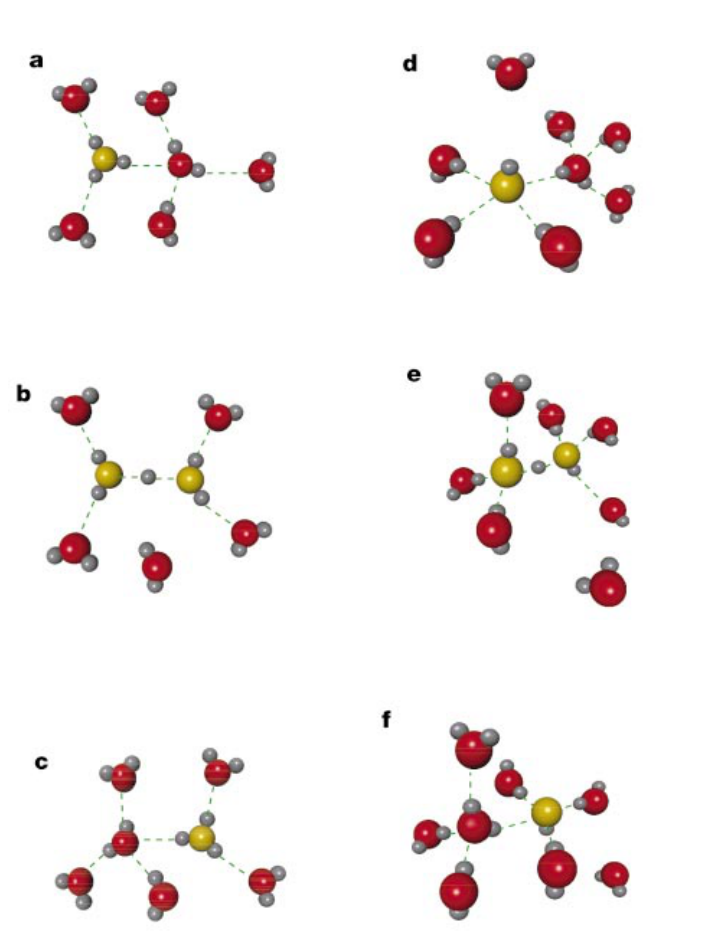
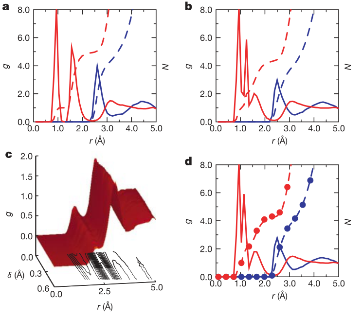
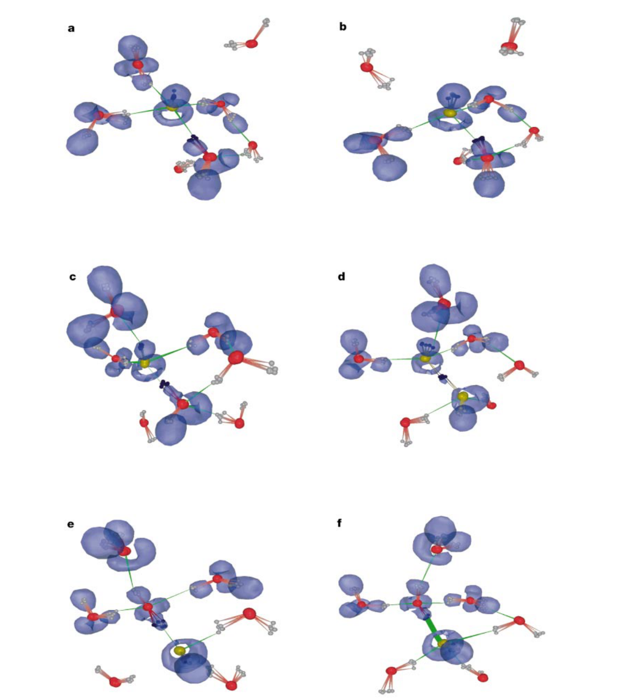
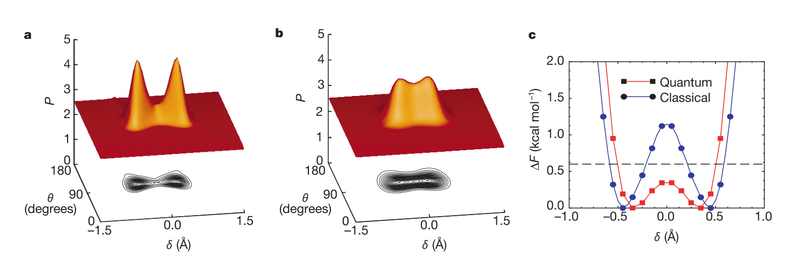

# The nature and transport mechanism of hydrated hydroxide ions in aqueous solution

**Zotero key:** QXM43Q3S  
**Attachment key:** I5JGPN8X  
**Journal:** Nature  
**DOI:** 10.1038/nature00797  
**Publication date:** 2002-06-27  
**Source PDF:** paper.pdf

## Why This Paper / 为什么选这篇

**English:** This paper is a classic mechanism paper for hydroxide transport in water. It challenges the intuitive proton-hole picture and shows that hydrated OH- transport requires specific solvation rearrangements, a transient shared-proton H3O2- state, and strong nuclear quantum effects.

**中文:** 这是一篇理解水中 OH- 迁移机制的经典论文。它不是简单把氢氧根看成“缺一个质子的水”，而是指出 OH- 的迁移依赖特定溶剂化构型转换、瞬态 H3O2- 共享质子结构以及显著的核量子效应。

## Reading Guide / 读前导读

**English:** Read it by following the contrast between H3O+ and OH-. First, understand why the old proton-hole analogy predicts a simple reversed Grotthuss process. Second, track how the authors use path-integral first-principles simulations and radial distribution functions to identify OH-(H2O)4, OH-(H2O)3 and H3O2-. Third, focus on Fig. 3 and Fig. 4: hydroxide transport is gated by solvation-shell rearrangement and quantum nuclei lower the barrier without making the shared-proton state stable.

**中文:** 阅读时抓住 H3O+ 与 OH- 的对比。第一步理解旧的“质子空穴”类比为什么会预期一个简单反向的 Grotthuss 过程。第二步看作者如何用第一性原理路径积分模拟和径向分布函数识别 OH-(H2O)4、OH-(H2O)3 和 H3O2-。第三步重点看 Fig. 3 和 Fig. 4：氢氧根迁移受溶剂化壳层重排控制，核量子效应降低能垒，但不会把共享质子态变成稳定主态。

## Terminology / 术语表

| English | 中文 | Note |
|---|---|---|
| hydrated hydroxide ion | 水合氢氧根离子 | 本文研究的 OH- 在水中的溶剂化和迁移状态。 |
| structural diffusion | 结构扩散 | 电荷通过氢键网络中的质子转移迁移，而不是单个离子整体扩散。 |
| proton-hole picture | 质子空穴图像 | 把 OH- 迁移看成 H3O+ 迁移的反向过程；本文认为该图像不充分。 |
| first-principles simulation | 第一性原理模拟 | 基于电子结构计算的分子动力学，不依赖预设经验势。 |
| path-integral molecular dynamics | 路径积分分子动力学 | 显式处理核量子效应的模拟方法。 |
| electron localization function (ELF) | 电子局域函数（ELF） | 用于分析孤对电子和氢键方向性的电子结构指标。 |
| OH-(H2O)4 | 四配位水合氢氧根 | 本文认为 OH- 的非活化主态，具有高配位和平面/环状孤对电子特征。 |
| OH-(H2O)3 | 三配位水合氢氧根 | 质子转移前的活化构型。 |
| H3O2- | 共享质子过渡复合物 | 本文中是瞬态/活化态，而不是稳定主物种。 |
| nuclear quantum effects | 核量子效应 | 会降低质子转移自由能垒并允许角度构型偏离经典理想构型。 |

## Page / Section Index

- p.1: title, authors, abstract, framing against proton-hole picture.
- p.2: simulation coordinates, Fig. 1 transport sketch, Fig. 2 radial distributions.
- p.3: Fig. 3 mechanistic configurations and ELF evidence.
- p.4: five-step mechanism, Fig. 4 quantum versus classical free-energy behavior.
- p.5: activation-energy estimate, electron localization explanation, conclusion, declarations.

## Bilingual Reader / 逐段中英对照

**Source:** p.1 S001

**Original:** .............................................................. The nature and transport mechanism of hydrated hydroxide ions in aqueous solution

**中文:** ................................................................... 水溶液中水合氢氧根离子的性质和传输机制

**Source:** p.1 S002

**Original:** Mark E. Tuckerman*, Dominik Marx† & Michele Parrinello‡§

**中文:** 马克·E·塔克曼*、多米尼克·马克思† 和米歇尔·帕里内洛‡§

**Source:** p.1 S003

**Original:** * Department of Chemistry and Courant Institute of Mathematical Sciences, New York University, 4 Washington Place, New York, New York 10003, USA † Lehrstuhl fur Theoretische Chemie, Ruhr-Universitat Bochum, 44780 Bochum, Germany ‡ Max-Planck-Institut fur Festkorperforschung, Heisenbergstrasse 1, 70569 Stuttgart, Germany ............................................................................................................................................................................. Compared to other ions, protons (H+) and hydroxide ions (OH-) exhibit anomalously high mobilities in aqueous solutions1. On a qualitative level, this behaviour has long been explained by ‘structural diffusion’—the continuous interconversion between hydration complexes driven by fluctuations in the solvation shell of the hydrated ions. Detailed investigations have led to a clear understanding of the proton transport mechanism at the molecular level2–8.

**中文:** * 纽约大学化学系和库朗数学科学研究所，4 Washington Place, New York, New York 10003, USA † Lehrstuhl Fur Theoretische Chemie, Ruhr-Universitat Bochum, 44780 Bochum, 德国 ‡ 马克斯普朗克研究所 Festkorperforschung, Heisenbergstrasse 1, 70569 Stuttgart,德国 ................................................................................................................................................................ 与其他离子相比，质子 (H+) 和氢氧根离子 (OH-) 在水溶液中表现出异常高的迁移率1。在定性层面上，这种行为长期以来一直用“结构扩散”来解释——由水合离子溶剂化壳层波动驱动的水合络合物之间的连续相互转化。详细的研究使人们对分子水平上的质子传输机制有了清晰的了解2-8。

**Source:** p.1 S004

**Original:** In contrast, hydroxide ion mobility in basic solutions has received far less attention2,3,9,10, even though bases and base catalysis play important roles in many organic and biochemical reactions and in the chemical industry. The reason for this may be attributed to the century-old notion11 that a hydrated OH- can be regarded as a water molecule missing a proton, and that the transport mechanism of such a ‘proton hole’ can be inferred from that of an excess proton by simply reversing hydrogen bond polarities11–18. However, recent studies2,3 have identified OH- hydration complexes that bear little structural similarity to proton hydration complexes. Here we report the solution structures and transport mechanisms of hydrated hydroxide, which we obtained from first-principles computer simulations that explicitly treat quantum and thermal fluctuations of all nuclei19–21.

**中文:** 相比之下，尽管碱和碱催化在许多有机和生化反应以及化学工业中发挥着重要作用，但碱性溶液中氢氧根离子的迁移率受到的关注要少得多2,3,9,10。其原因可能归因于一个世纪以来的观念11，即水合OH-可以被视为缺少质子的水分子，并且这种“质子空穴”的传输机制可以通过简单地反转氢键极性从过量质子的传输机制中推断出来11-18。然而，最近的研究 2,3 发现 OH-水合络合物与质子水合络合物的结构几乎没有相似性。在这里，我们报告了水合氢氧化物的溶液结构和传输机制，这是我们从明确处理所有原子核的量子和热波动的第一原理计算机模拟中获得的19-21。

**Source:** p.1 S005

**Original:** We find that the transport mechanism, which differs significantly from the proton hole picture, involves an interplay between the previously identified hydration complexes2,3 and is strongly influenced by nuclear quantum effects. Transport of a hydrated proton, H3O+, in water involves a continuous interconversion between two hydration complexes (Fig. 1a–c). A tricoordinate H3O+(H2O)3 complex (Fig. 1a) is transformed via proton transfer into a [H2O· · ·H· · ·OH-]þ or H5O2+ complex (Fig. 1b). This process, known as the ‘structural diffusion’ or ‘Grotthuss’ mechanism1, is driven by fluctuations in the second solvation shell of H3O+, which reduce the coordination of a first-solvation-shell water from four to three2–5. This water molecule is, thus, ‘prepared’ to become a properly solvated H3O+ by proton transfer H3O+ a ···H2Ob O H2Oa···H3O+ b , where Oa and Cb are the two oxygens involved in the hydrogen bond, respectively.

**中文:** 我们发现，传输机制与质子空穴图像显着不同，涉及先前确定的水合复合物2,3之间的相互作用，并且受到核量子效应的强烈影响。水合质子 H3O+ 在水中的传输涉及两个水合复合物之间的连续相互转化（图 1a-c）。三配位 H3O+(H2O)3 络合物（图 1a）通过质子转移转化为 [H2O···H···OH-]þ 或 H5O2+ 络合物（图 1b）。这一过程被称为“结构扩散”或“Grotthuss”机制1，是由 H3O+ 第二溶剂化层的波动驱动的，这会将第一溶剂化层水的配位从 4 个减少到 32-5 个。因此，该水分子通过质子转移“准备”成为适当溶剂化的 H3O+ H3O+ a …H2Ob O H2Oa…H3O+ b ，其中 Oa 和 Cb 分别是参与氢键的两个氧。

**Source:** p.2 S006

**Original:** Owing to quantum effects, the actual defect structure is best described as a fluxional defect5. Applying the proton-hole concept to the OH- case, one would expect the occurrence of tricoordinate OH-(H2O)3 (in which the hydroxide oxygen accepts three hydrogen bonds) and H3O2- (that is [HO...H...OH]-) complexes, analogous to H3O+(H2O)3 and H5O2+ ; respectively. Moreover, structural diffusion would be driven by similar second-solvationshell fluctuations. Interpretations of Raman and infrared spectra of concentrated basic solutions have been guided by the proton-hole picture, a fact that has led to controversies about the structure and

**中文:** 由于量子效应，实际的缺陷结构最好被描述为流变缺陷5。将质子空穴概念应用于 OH- 情况，可以预期会出现三配位 OH-(H2O)3（其中氢氧化物氧接受三个氢键）和 H3O2-（即 [HO...H...OH]-）配合物，类似于 H3O+(H2O)3 和 H5O2+ ；分别。此外，结构扩散将由类似的第二溶剂化层波动驱动。浓碱性溶液的拉曼光谱和红外光谱的解释一直以质子空穴图为指导，这一事实导致了关于结构和结构的争议。

**Source:** p.2 S007

**Original:** mechanism: In a, the H3O+ is shown in a threefold-coordinated, H3O+(H2O)3, state, and a complete coordination shell is shown for one of the first-solvation-shell waters. Thermal fluctuations cause an H-bond breaking between a first and second solvation-shell water of H3O+ to occur (b), leaving the first-solvation-shell water with a threefold coordination pattern, followed by a shrinking of the first-shell O*O distance and a migration of the proton to the centre of the bond, forming an intermediate H5O2+ complex. Complete transfer of the proton (c), yields a properly solvated H3O+ at a new site in the H-bond network. The ‘gate closes’ (no further proton transfer events are possible until another H-bond breaking event occurs) if the newly formed water acquires a fourth H-bond (shown as the water released by the H-bond breaking event in b, although it could be any nearby solvent water).

**中文:** 机理：在a中，H3O+显示为三重配位H3O+(H2O)3状态，并且显示了第一溶剂化层水之一的完整配位层。热波动导致 H3O+ 的第一和第二溶剂化层水之间发生氢键断裂 (b)，使第一溶剂化层水具有三重配位模式，随后第一层 O*O 距离缩小，质子迁移到键的中心，形成中间 H5O2+ 络合物。质子 (c) 的完全转移，在氢键网络中的新位点产生适当溶剂化的 H3O+。如果新形成的水获得第四个氢键（如b中氢键断裂事件释放的水，尽管它可能是任何附近的溶剂水），“门关闭”（在发生另一个氢键断裂事件之前，不可能发生进一步的质子转移事件）。

### Fig. 1. Proton and hydroxide transport motifs

**Placed near:** S007  
**Source:** p.2 figure caption

**Original caption:** Figure 1 Schematic illustration of proton and hydroxide ion transport in water at room temperature. Panels a–c show the transport mechanisms of H3O+, and panels d–f the transport mechanisms of OH-. Red and grey spheres are oxygen and hydrogen atoms, respectively, and yellow spheres are the H3O+ and OH- defect oxygens. Dashed green lines denote hydrogen bonds. These simplified sketches are idealized renderings of the classical limit of the ‘real’ processes shown in Fig. 3 and Fig. 1 of ref. 5. H3O+

**中文图注:** 图 1 室温下质子和氢氧根离子在水中传输的示意图。 a-c 图显示了 H3O+ 的传输机制，d-f 图显示了 OH- 的传输机制。红色和灰色球体分别是氧原子和氢原子，黄色球体是H3O+和OH-缺陷氧。绿色虚线表示氢键。这些简化的草图是参考文献图 3 和图 1 所示的“真实”过程的经典极限的理想化渲染。 5.水+

**Reading note:** Compare panels a-c with d-f: the paper argues that OH- cannot be understood as the exact reverse of H3O+ transport.

**Source:** p.2 S008

**Original:** OH- mechanism: In d, the OH- is shown in a fourfold-coordinated, OH-(H2O)4, state, and a complete coordinate shell is shown for one of the first-solvationshell waters. A neighbouring solvent is shown above the OH- hydrogen. Thermal fluctuations cause a first-solvation-shell H-bond breaking event (b), leaving the OH- in a threefold OH-(H2O)3 state, followed by a shrinking of a first-shell O*O distance and the formation of a weak H-bond between the OH- hydrogen and a neighbouring solvent water (see, also, Fig. 3b–d). Complete transfer of the proton (f) causes the OH-(H2O)3 to migrate to a new site in the H-bond network. The ‘gate closes’ if the newly formed hydroxide acquires a fourth H-bond (shown as the water released in b, although it could be any nearby solvent water), to complete the OH-(H2O)4 structure.

**中文:** OH- 机制：在 d 中，OH- 显示为四重配位 OH-(H2O)4 状态，并且显示了第一溶剂化壳层水之一的完整配位壳层。邻近的溶剂显示在 OH-氢上方。热波动导致第一溶剂化壳层氢键断裂事件（b），使 OH- 处于三重 OH-(H2O)3 状态，随后第一壳层 O*O 距离缩小，并在 OH- 氢和邻近溶剂水之间形成弱氢键（另见图 3b-d）。质子 (f) 的完全转移导致 OH-(H2O)3 迁移到氢键网络中的新位置。如果新形成的氢氧化物获得第四个氢键（如 b 中释放的水所示，尽管它可能是任何附近的溶剂水），“门就会关闭”，以完成 OH-(H2O)4 结构。

**Source:** p.2 S009

**Original:** dynamics of hydrated hydroxide14–17. Prompted by this controversy, we undertook an extensive ab initio path integral19,20 study of a hydroxide ion in bulk water at room temperature (see Fig. 2 for details).

**中文:** 水合氢氧化物的动力学14-17。受这一争议的推动，我们对室温下散装水中的氢氧根离子进行了广泛的从头算路径积分 19,20 研究（详细信息见图 2）。

**Source:** p.2 S010

**Original:** For each configuration generated in the simulation, the OH-

**中文:** 对于仿真中生成的每个配置，OH-

**Source:** p.2 S011

**Original:** charge defect, designated (O*H')-, is located in the hydrogen-bond (H-bond) network by identifying the oxygen with a single hydrogen. Next, for each H-bond, a displacement coordinate, ~d = ROaH - RObH; is defined, where ROaH and RObH are the distances between the shared proton and the two oxygens. A small value of d˜ indicates a propensity for proton transfer. Finally, a transfer coordinate, d, is defined in each configuration by selecting the H-bond with the smallest d˜. This H-bond, designated O*· · ·H*O- , is considered to be the ‘most active’ or most likely to experience proton transfer5. Invariably, it is found that one of the oxygens in this H-bond corresponds to the defect, O*.

**中文:** 电荷缺陷，指定为 (O*H')-，通过将氧与单个氢识别来定位在氢键 (H-键) 网络中。接下来，对于每个氢键，位移坐标，~d = ROaH - RObH；定义为，其中 ROaH 和 RObH 是共享质子和两个氧之间的距离。 d～的小值表示质子转移的倾向。最后，通过选择具有最小 d~ 的氢键，在每个配置中定义转移坐标 d。这种氢键，指定为 O*···H*O-，被认为是“最活跃”或最有可能经历质子转移5。总是发现该氢键中的一个氧对应于缺陷 O*。

### Fig. 2. Radial distributions and coordination during proton transfer

**Placed near:** S011  
**Source:** p.2 figure caption

**Original caption:** Figure 2 Radial distribution functions and coordination numbers during proton transfer. Shown are radial distribution functions, g(r), and, on the same scale, running coordination numbers, N(r), with respect to the hydroxide ion and a first-solvation-shell water at different stages in the proton transfer process. a, Radial distribution functions, g O*O (solid blue) and g O*H (solid red) and coordination numbers, N O*O (dashed blue) and N O*H (dashed red), with respect to the OH-, O*, for values of the proton transfer coordinate |d| = RO*H* 2 R (OH* . 0:5 )A: Here, H* denotes the shared proton, and O- denotes the oxygen of a water molecule that donates the ‘most active’ H-bond to O*, that is, O*· · ·H*O- . b, As a except for |d| , 0.1 A . c, Two-dimensional generalization of a hydrogen-oxygen radial distribution function g H' O(r,|d|) with respect to the OH-

**中文图注:** 图2 质子转移过程中的径向分布函数和配位数。显示的是质子转移过程中不同阶段的氢氧根离子和第一溶剂化壳层水的径向分布函数 g(r) 以及相同尺度的运行配位数 N(r)。 a，相对于 OH-、O* 的质子转移坐标 |d| 值的径向分布函数 g O*O（蓝色实线）和 g O*H（红色实线）以及配位数 N O*O（蓝色虚线）和 N O*H（红色虚线） = RO*H* 2 R (OH* . 0:5 )A：这里，H* 表示共享质子，O- 表示水分子中的氧，为 O* 提供“最活跃”的氢键，即 O*···H*O- 。 b，除 |d| 外均与 a 相同，0.1A。 c，氢氧径向分布函数 g H' O(r,|d|) 相对于 OH- 的二维推广

**Reading note:** The key evidence is that the hydroxide coordination changes with the transfer coordinate, exposing the transient H3O2- motif.

**Source:** p.2 S012

**Original:** In order to identify the role played by various solvation complexes of OH-, configurations with large and small |d| are selected. Figure 2a shows that, at large |d|, O* accepts, on average, four Hbonds from neighbouring waters. Representative configurations

**中文:** 为了确定 OH- 的各种溶剂化配合物所起的作用，具有大和小 |d| 的构型被选中。图 2a 显示，在 |d| 范围内，O* 平均接受来自邻近水域的 4 个 Hbond。代表性配置

**Source:** p.2 S013

**Original:** hydrogen, H', as a function of r and |d|. d, Radial distribution functions and coordination numbers with respect to O- for |d| , 0.1 A . The colour and line types are the same as in a. Coordination numbers from b are superimposed with red (O*H) and blue (O*O) circles. The simulations were performed using CPMD Version 3.0 (J. Hutter et al., Max-Planck-Institut fur Festkorperforschung and IBM Zurich Research Laboratory 1995–1996)21 at ambient conditions using 31 H2O with one OH- anion in a periodic cubic box of side length 9.8692 A , employing the BLYP functional, Troullier-Martins type pseudopotentials, and a Gamma-point plane wave expansion of the valence orbitals up to 70 Ry. This particular scheme has been shown to yield a good description of dynamical processes in aqueous systems5,6,30,32. The path integral was discretized using P = 8 Trotter replicas following the methodology of ref. 20. After careful equilibration, quantum and classical nuclear trajectories consisting of 322,000 and 346,000 configurations, with time steps of 5.0 a.u. and 7.0 a.u., respectively, were generated via the Car-Parrinello algorithm22.

**中文:** 氢，H'，作为 r 和 |d| 的函数。 d，|d| 相对于 O- 的径向分布函数和配位数，0.1A。颜色和线型与a中的相同。 b 中的配位数与红色 (O*H) 和蓝色 (O*O) 圆圈叠加。使用 CPMD 版本 3.0（J. Hutter 等人，Max-Planck-Institut Fur Festkorperforschung 和 IBM Zurich Research Laboratory 1995-1996）21 在环境条件下使用 31 H2O 和一个 OH- 阴离子在边长 9.8692 A 的周期性立方体中进行模拟，采用 BLYP 泛函、Troullier-Martins 型赝势，以及价轨道的伽马点平面波展开高达 70 Ry。这种特殊的方案已被证明可以很好地描述水系统中的动力学过程5,6,30,32。按照参考文献的方法，使用 P = 8 Trotter 副本对路径积分进行离散化。 20. 经过仔细平衡后，量子和经典核轨迹由 322,000 和 346,000 个构型组成，时间步长为 5.0 a.u。和 7.0 a.u. 分别是通过 Car-Parrinello 算法生成的。

**Source:** p.3 S014

**Original:** (Fig. 3a) reveal that the accepted H-bonds are in a roughly planar arrangement, forming the OH-(H2O)4 complex. Previous solution phase2 and quantum-chemical23 calculations have confirmed the stability of this structure. Furthermore, a recent spectroscopic study indicates that there is no cationic analogue of this complex24.

**中文:** （图 3a）表明，可接受的氢键大致呈平面排列，形成 OH-(H2O)4 络合物。之前的解相2和量子化学23计算已经证实了这种结构的稳定性。此外，最近的光谱研究表明，没有这种复合物的阳离子类似物24。

**Source:** p.3 S015

**Original:** Importantly, it is also found that in roughly half of the configurations, the hydroxide hydrogen, H', donates an additional weak Hbond, giving a total O*O coordination number of NO*O < 4.5. For small |d|, the O*O peak in the radial distribution functions (Fig. 2b) shifts to smaller distances, and NO*O decreases from 4.5 to

**中文:** 重要的是，我们还发现，在大约一半的构型中，氢氧化物氢 H' 提供了额外的弱 Hbond，给出了 NO*O 的总 O*O 配位数 < 4.5。对于较小的 |d|，径向分布函数中的 O*O 峰值（图 2b）移动到更小的距离，NO*O 从 4.5 降低到

**Source:** p.3 S016

**Original:** hydrogen, H', and the bulk water molecule from a and b is formed. As shown, when this H-bond forms, one of the shared protons between O* and a coordinating water begins to transfer. d, As the proton is transferred, the environments around each OH moiety become similar (see, also, Fig. 2d). (Note that a complete solvation shell for the water that transfers its proton to O* is not shown. However, the coordination number around this water is, nevertheless, 4.0—see Fig. 2d). The ELF shows two distorted rings around the yellow oxygens, emphasizing the symmetry of this configuration. e, After the proton transfer, the original OH- has been transformed into a properly solvated water molecule with two lone pairs, whereas the newly formed OH- (now shown in yellow) possesses the ring-shaped ELF. f, The process is completed by the acceptance of a fourth H-bond from the newly formed O*, which ‘closes the gate’ by forming a new, inactive OH-(H2O)4 complex with a fully intact ELF ring as in a. Although ab initio path-integral molecular dynamics method does not rigorously produce real-time evolution, processes that must occur and their approximate sequence can be inferred qualitatively.

**中文:** 氢，H'，以及由 a 和 b 形成的大量水分子。如图所示，当这种氢键形成时，O* 和配位水之间共享的质子之一开始转移。 d，随着质子转移，每个 OH 部分周围的环境变得相似（另参见图 2d）。 （请注意，未显示将质子转移到 O* 的水的完整溶剂化壳。然而，该水周围的配位数仍然为 4.0 - 见图 2d）。 ELF 显示黄色氧原子周围有两个扭曲的环，强调了这种构型的对称性。 e，质子转移后，原始的OH-已转化为具有两个孤对电子的适当溶剂化的水分子，而新形成的OH-（现在以黄色显示）具有环形ELF。 f，该过程通过接受来自新形成的 O* 的第四个 H 键而完成，它通过形成一个新的、不活泼的 OH-(H2O)4 复合物（具有完整的 ELF 环）来“关闭大门”，如 a 所示。虽然从头开始路径积分分子动力学方法不能严格产生实时演化，但可以定性地推断出必须发生的过程及其大致顺序。

**Source:** p.4 S017

**Original:** 4.1, very close to the value, 4.0, obtained for bulk water molecules. The number of accepted and donated H-bonds is 3.2 and 0.9, respectively. These imply that the emergent structure during proton transfer is the tetrahedral OH-(H2O)3 complex in which O* is approximately threefold coordinated (Fig. 3b), and that the donated H-bond involving H' plays a crucial role in activating the proton transfer process (Fig. 3c, d). The importance of this H'· · ·O H-bond is further demonstrated in the two-dimensional radial distribution function, gH' O(r,|d|) of Fig. 2c. A weak signal at r < 2 A , first apparent at large |d|, becomes prominent as |d| ! 0. It should be noted that the location of the O*O peak of the d-averaged radial distribution function, 2.5 A , is in good agreement with recent neutron diffraction data25. Moreover the d-averaged O*O coordination, 4.3, is consistent with experimental estimates26 (although the “effective hydration number” in ref. 26 is not precisely equivalent to the microscopic coordination number).

**中文:** 4.1，非常接近针对大量水分子获得的值 4.0。接受和捐赠的氢债数量分别为3.2和0.9。这意味着质子转移过程中出现的结构是四面体OH-(H2O)3复合物，其中O*大约是三重配位的（图3b），并且涉及H'的捐赠的氢键在激活质子转移过程中起着至关重要的作用（图3c，d）。这种 H'···O H 键的重要性在图 2c 的二维径向分布函数 gH' O(r,|d|) 中得到了进一步证明。 r < 2 A 处的弱信号首先在大 |d| 处明显，随着 |d| 变得突出！ 0. 应该指出的是，d 平均径向分布函数 2.5 A 的 O*O 峰的位置与最近的中子衍射数据非常一致25。此外，d 平均 O*O 配位数 4.3 与实验估计一致26（尽管参考文献 26 中的“有效水合数”并不完全等于微观配位数）。

**Source:** p.4 S018

**Original:** The above findings have led us to propose an alternative mechanism to that of the proton-hole picture (Fig. 3). Activation of a proton transfer event requires that the solvation pattern around OH- closely resemble that of a bulk water molecule. This pattern (which is not a free-energy minimum), is realized by two concerted yet distinct processes. The first is a transformation from the inactive OH-(H2O)4 to the active OH-(H2O)3 solvation state, a process that involves the breaking of a H-bond in the first solvation shell of OH- (as shown in the change from Fig. 3a to Fig. 3b). The relatively facile conversion from OH-(H2O)4 to OH-(H2O)3 is consistent with the estimated activation energy, 1.16 kcal mol^-1, reported in ref. 23 and with recent spectroscopic data24. The importance of this step can be understood from the chemical differences between the OH-(H2O)4 and OH-(H2O)3 complexes.

**中文:** 上述发现使我们提出了质子空穴图像的替代机制（图3）。质子转移事件的激活要求 OH- 周围的溶剂化模式与大量水分子的溶剂化模式非常相似。这种模式（不是自由能最小值）是通过两个协调但不同的过程实现的。第一个是从不活泼的 OH-(H2O)4 到活泼的 OH-(H2O)3 溶剂化状态的转变，这个过程涉及 OH- 第一个溶剂化壳层中氢键的断裂（如图 3a 到图 3b 的变化所示）。从 OH-(H2O)4 到 OH-(H2O)3 的相对容易的转化与参考文献中报告的估计活化能 1.16 kcal mol^-1 一致。 23 和最近的光谱数据24。该步骤的重要性可以从 OH-(H2O)4 和 OH-(H2O)3 络合物之间的化学差异来理解。

### Fig. 3. Representative proton-transfer configurations

**Placed near:** S018  
**Source:** p.3 figure caption

**Original caption:** Figure 3 Representative configurations showing the proton transfer mechanism. Each panel shows quantum-mechanical particle density snapshots of the OH- together with relevant first and second solvation-shell water molecules. Oxygen and hydrogen atoms are shown as red and grey spheres, respectively. The defect oxygen, O* and shared proton in the most active H-bond are shaded yellow and black, respectively. H-bonds are schematically shown as green lines. In blue are shown the eta = 0.93 isosurfaces of the electron localization function (ELF)29 of the path centroid configuration for the OH- and only those water molecules which are H-bonded to the OH-. a, The OH- is in its inactive OH-(H2O)4 structure with fourfold planar coordination around O*. The ELF shows that the three lone pairs around O* are in a delocalized ring structure, thus supporting the hypercoordination of the OH- (see text). An additional water molecule, which participates in the activation process (c and d), appears in the upper right corner. b, A first-solvationshell H-bond breaking event occurs, which transforms the OH-(H2O)4 structure into an approximately tetrahedral OH-(H2O)3 structure. c, A weak H-bond between the OH-

**中文图注:** 图 3 显示质子转移机制的代表性配置。每个面板显示 OH- 以及相关的第一和第二溶剂化层水分子的量子力学粒子密度快照。氧原子和氢原子分别显示为红色和灰色球体。最活跃的氢键中的缺陷氧、O* 和共享质子分别为黄色和黑色阴影。 H键示意性地显示为绿线。蓝色显示 OH- 的路径质心构型的电子局域化函数 (ELF)29 的 eta = 0.93 等值面，以及仅与 OH- 形成氢键的水分子。 a，OH- 处于其非活性 OH-(H2O)4 结构中，在 O* 周围有四重平面配位。 ELF 显示 O* 周围的三个孤对电子处于离域环结构中，从而支持 OH- 的超配位（见正文）。右上角出现一个额外的水分子，参与激活过程（c 和 d）。 b，发生第一溶剂化层氢键断裂事件，将OH-(H2O)4结构转变为近似四面体的OH-(H2O)3结构。 c, OH-之间的弱氢键

**Reading note:** Read this as the mechanistic movie: inactive OH-(H2O)4, activated OH-(H2O)3, transient shared-proton state, and gate closure.

**Source:** p.4 S019

**Original:** In the former, proton transfer through a H-bond would transform the OH- defect into a H2O molecule that accepts three H-bonds, an unfavourable configuration. In the latter, proton transfer through one of the acceptor H-bonds produces a H2O with the correct coordination. The second process required to initiate proton migration is the formation of a weak H-bond between the hydroxide hydrogen, H', and a neighbouring water molecule (Fig. 3b to c). When this occurs in the OH-(H2O)3 complex, the OH- is (fourfold) coordinated in such a way that when the proton, H*, is transferred, the original (O*H')-

**中文:** 在前者中，通过氢键的质子转移会将 OH- 缺陷转化为接受三个氢键的 H2O 分子，这是一种不利的构型。在后者中，质子通过一个受体氢键转移产生具有正确配位的 H2O。引发质子迁移所需的第二个过程是在氢氧化物氢 H' 和邻近的水分子之间形成弱氢键（图 3b 至 c）。当这种情况发生在 OH-(H2O)3 络合物中时，OH- 以这样的方式进行（四重）配位：当质子 H* 转移时，原始 (O*H')-

**Source:** p.4 S020

**Original:** becomes a tetrahedrally solvated water molecule with an ideal bulk solvation pattern. Note that, in the proton-hole picture, this H'· · ·O H-bond (Figs 2c, 3c, 3d) is assumed never to form.

**中文:** 成为具有理想整体溶剂化模式的四面体溶剂化水分子。注意，在质子空穴图中，假定永远不会形成该H'···O H键（图2c、3c、3d）。

**Source:** p.4 S021

**Original:** Once the OH-(H2O)3 complex is activated, the environment around the two oxygens in the most active H-bond is nearly

**中文:** 一旦OH-(H2O)3络合物被激活，最活跃的氢键中两个氧周围的环境几乎是

**Source:** p.4 S022

**Original:** identical (Fig. 2d). This observation suggests that, for |d| < 0, the structural motif of a solvated H3O2- core, emerges. However, in contrast to the proton-hole scenario, here, the H3O2- is a transient state that is necessarily visited when the proton is transferred. Thus, the complete structural diffusion mechanism, depicted in Fig. 3, can be summarized as: (1) transformation of OH-(H2O)4 to OH-(H2O)3 by first-solvation-shell H-bond breaking (Fig. 3a to b); (2) activation of OH-(H2O)3 by formation of the H'· · ·O Hbond (Fig. 3b to c); (3) formation of the transient H3O2- complex by partial proton transfer (Fig. 3c to d); (4) completion of proton transfer resulting in a new O* and OH-(H2O)3 complex (Fig. 3d to e); (5) acceptance of a fourth H-bond by the new O* resulting in a change from OH-(H2O)3 to OH-(H2O)4 and consequent inactivation (Fig. 3e to f). This completes the cycle: the OH-(H2O)4 complexes in Figs 3f and 3a are isostructural but are located at different sites in the network. In Fig. 1d–f a simplified sketch of this mechanism is contrasted to that for structural diffusion of H3O+ in acids (Fig. 1a–c).

**中文:** 相同（图2d）。这一观察结果表明，对于 |d| < 0，溶剂化 H3O2- 核心的结构基序出现。然而，与质子空穴场景相反，这里的 H3O2- 是质子转移时必然会经历的瞬态。因此，如图3所示，完整的结构扩散机制可以概括为：（1）通过第一溶剂化壳层氢键断裂将OH-（H2O）4转化为OH-（H2O）3（图3a至b）； (2)通过形成H'···O H键来活化OH-(H2O)3(图3b至c)； (3)通过部分质子转移形成瞬时H3O2-络合物(图3c至d)； (4) 质子转移完成，产生新的O*和OH-(H2O)3复合物（图3d至e）； (5)新的O*接受第四个氢键，导致从OH-(H2O)3变为OH-(H2O)4并随后失活（图3e至f）。这就完成了循环：图 3f 和 3a 中的 OH-(H2O)4 复合物是同构的，但位于网络中的不同位点。在图 1d-f 中，该机制的简化草图与 H3O+ 在酸中的结构扩散的机制（图 1a-c）进行了对比。

**Source:** p.4 S023

**Original:** Having established the mechanism, we examine how closely a purely classical treatment of the nuclear motion at 300 K approximates this picture. Classically (Fig. 4a), there is a significant funnelling of the angle (v) between the O*H' and O*O- bonds about the HOH bulk water bend angle (,1048) for |d| < 0, implying that the OH-(H2O)3 complex must be close to its ideal tetrahedral geometry. However, when nuclear quantum effects are included (Fig. 4b), this funnelling is largely washed out, implying a significant probability of proton transfer even when the geometry of the complex is distorted. Such a pronounced ‘corner cutting’ quantum effect27, having no analogue in hydrated H3O+ (ref. 5), may also explain why the observed H/D isotope effect on the mobility is larger in basic than in acidic solutions18.

**中文:** 建立了该机制后，我们研究了 300 K 下核运动的纯经典处理与该图的近似程度。传统上（图 4a），O*H' 和 O*O- 键之间关于 |d| 的 HOH 整体水弯曲角 (,1048) 之间存在显着的角度 (v) 漏斗。 < 0，意味着 OH-(H2O)3 配合物必须接近其理想的四面体几何形状。然而，当包括核量子效应时（图4b），这种漏斗现象在很大程度上被消除，这意味着即使复合体的几何形状发生扭曲，质子转移的可能性也很大。这种明显的“切角”量子效应27在水合H3O+中没有类似物（参考文献5），也可以解释为什么观察到的H/D同位素对迁移率的影响在碱性溶液中比在酸性溶液中更大18。

**Source:** p.4 S024

**Original:** Nuclear quantum effects also lower the proton transfer free energy barrier along the d-coordinate from roughly 1.28 to 0.34 kcal mol^-1 (Fig. 4c). Despite this reduction, the free energy retains its double-well character, implying that H3O2- is a transient complex or activated state (Figs 2d and 3d). This contradicts the proton-hole picture, in which H3O2- is understood to be a stable complex. It is also in contrast to the hydrated H3O+ case, in which a smaller (0.6 kcal mol^-1) barrier obtained at the classical level is washed out by nuclear quantum effects5. Finally, it contrasts with the gas-phase studies in ref. 28, where a pronounced barrier in the H3O2- complex is also completely washed out by nuclear quantum effects. If the present proton transfer free-energy value, 0.34 kcal mol^-1, is combined with the 1.16 kcal mol^-1 (ref. 23)

**中文:** 核量子效应还将沿 d 坐标的质子转移自由能垒从大约 1.28 kcal mol^-1 降低到 0.34 kcal mol^-1（图 4c）。尽管有这种减少，自由能仍保留其双阱特征，这意味着 H3O2- 是瞬态络合物或激活态（图 2d 和 3d）。这与质子空穴图相矛盾，其中 H3O2- 被认为是稳定的复合物。它也与水合 H3O+ 的情况形成对比，在水合 H3O+ 的情况下，在经典水平上获得的较小（0.6 kcal mol^-1）势垒被核量子效应冲掉了。最后，它与参考文献中的气相研究进行了对比。如图28所示，H3O2-复合物中的明显势垒也被核量子效应完全冲刷掉。如果当前的质子转移自由能值 0.34 kcal mol^-1 与 1.16 kcal mol^-1 相结合（参考文献 23）

**Source:** p.4 S025

**Original:** smoothed for presentation and symmetrized about d = 0 A . Comparison of the freeenergy profiles (c) along the d coordinate for classical (circles) and quantum (squares) treatment of the nuclei. Note the centroid of the coordinate, d, has been used for the quantum profile.

**中文:** 进行平滑演示并关于 d = 0 A 对称。沿 d 坐标比较经典（圆形）和量子（方形）原子核处理的自由能分布 (c)。请注意，坐标质心 d 已用于量子剖面。

### Fig. 4. Quantum and classical structural/free-energy changes

**Placed near:** S025  
**Source:** p.4 figure caption

**Original caption:** Figure 4 Structural changes occurring during proton transfer. Shown are the normalized two-dimensional probability distribution function, P(d, v), of the proton displacement coordinate, d and the angle, v, between the OH- covalent bond axis and the O*–O- vector of the most active H-bond for the classical (a) and quantum (b) simulations at 300 K. Contours of these distribution functions are also shown. The distribution functions are

**中文图注:** 图 4 质子转移过程中发生的结构变化。显示的是 300 K 下经典 (a) 和量子 (b) 模拟的质子位移坐标 d 和 OH- 共价键轴与最活跃氢键的 O*–O- 向量之间的角度 v 的归一化二维概率分布函数 P(d, v)。还显示了这些分布函数的轮廓。分布函数是

**Reading note:** Panel c is the main quantum-nuclear-effects result: the barrier along the proton-transfer coordinate is lowered but not erased.

**Source:** p.5 S026

**Original:** required for step (1) of the above mechanism, and assuming an additional 0.5 kcal mol^-1 (ref. 18) to reduce the length of each of the three H-bonds in the OH-(H2O)3 complex by 0.1 A after step (1), an estimate of approximately 3 kcal mol^-1 is obtained for the total activation energy of our mechanism. This rough estimate is consistent with the experimental value obtained from hydroxide mobility data18.

**中文:** 上述机制的步骤（1）所需的能量，并假设在步骤（1）后额外增加 0.5 kcal mol^-1（参考文献 18）将 OH-(H2O)3 复合物中三个氢键的长度减少 0.1 A，则我们机制的总活化能估计约为 3 kcal mol^-1。这一粗略估计与从氢氧化物迁移率数据获得的实验值一致18。

**Source:** p.5 S027

**Original:** The unexpectedly high coordination of the solvated hydroxide2,23,26 contrasts with the textbook picture that each of the three lone pairs of O* accepts a single H-bond. An explanation of this phenomenon is obtained by analysing the electron localization function29 along the mechanistic path of Fig. 3. The electron localization function indicates spatial regions where electron pairs are most likely to be found. The most striking feature of these functions (Fig. 3) is the presence of a continuous ring around the OH- bond axis30,31. This finding is corrobated by its electrostatic potential that displays a ring of maximum negative charge around its O terminus. This pattern, which suggests a lack of directionality in H-bonding to O*, supports both structural flexibility and high coordination, and is consistent with the spectroscopic picture of ref. 24.

**中文:** 溶剂化的氢氧化物 2,23,26 出人意料的高配位与教科书上的图像形成鲜明对比，即三个孤对 O* 中的每一个都接受单个 H 键。通过沿着图 3 的机械路径分析电子局域化函数 29 可以获得对此现象的解释。电子局域化函数指示最有可能发现电子对的空间区域。这些函数最显着的特征（图 3）是围绕 OH 键轴 30,31 存在连续环。这一发现得到了其静电势的证实，该静电势在其 O 末端周围显示出最大负电荷的环。这种模式表明氢键与 O* 缺乏方向性，支持结构灵活性和高度配位，并且与参考文献的光谱图一致。 24.

**Source:** p.5 S028

**Original:** The analysis presented here emphasizes the complex chemical differences between the hydrated H3O+ and OH- ions, and their effect on the anomalous transport mechanisms in acidic and basic solution (Fig. 1). We recognize the temptation to invoke symmetry arguments as a method to intuit mechanisms of seemingly similar processes. However, this approach cannot yield a correct picture when the chemistry of the two species is sufficiently different. Nevertheless, a common pattern of charge migration in acids and bases emerges: both require that the nascent species in the proton transfer process be correctly ‘pre-solvated’ by way of specific fluctuations in the local H-bond network.

**中文:** 这里提出的分析强调了水合 H3O+ 和 OH- 离子之间复杂的化学差异，以及它们对酸性和碱性溶液中异常传输机制的影响（图 1）。我们认识到调用对称性论证作为一种方法来直观地了解看似相似过程的机制的诱惑。然而，当两个物种的化学成分差异很大时，这种方法无法产生正确的图像。然而，酸和碱中出现了一种常见的电荷迁移模式：两者都要求质子转移过程中的新生物质通过局部氢键网络中的特定波动正确地“预溶剂化”。

**Source:** p.5 S029

**Original:** Received 4 January; accepted 10 May 2002; doi:10.1038/nature00797.

**中文:** 1 月 4 日收到； 2002 年 5 月 10 日接受； doi：10.1038/nature00797。

**Source:** p.5 S030

**Original:** Acknowledgements M.E.T. was supported by the National Science Foundation (NSF) and Research Corporation.

**中文:** 致谢 M.E.T.得到了美国国家科学基金会（NSF）和研究公司的支持。

**Source:** p.5 S031

**Original:** Competing interests statement

**中文:** 竞争利益声明

**Source:** p.5 S032

**Original:** The authors declare that they have no competing financial interests.

**中文:** 作者声明他们没有竞争的经济利益。

**Source:** p.5 S033

**Original:** Correspondence and requests for materials should be addressed to M.E.T. (e-mail: mark.tuckerman@nyu.edu).

**中文:** 信件和材料请求应发送至 M.E.T. （电子邮件：mark.tuckerman@nyu.edu）。

## Critical Reading Notes / 批判性阅读提示

**English:** The core claim is mechanistic, not merely structural: hydroxide mobility is controlled by how the solvation shell prepares a proton-transfer event. The strongest evidence is the combination of coordination analysis, ELF snapshots, and the quantum/classical comparison. The limitation is that path-integral ab initio dynamics in 2002 could not provide a long real-time trajectory, so the sequence is inferred qualitatively from statistically sampled configurations.

**中文:** 这篇的核心不是简单说 OH- 是几配位，而是说迁移事件由溶剂化壳层如何“预组织”质子转移来控制。最强证据来自配位分析、ELF 构型图以及量子/经典对比。限制也很清楚：2002 年的第一性原理路径积分动力学还不能给出很长的真实时间轨迹，因此 Fig. 3 的序列更多是从统计构型中定性重建出来的机制路径。

## Related Reading / 相关阅读

See `related_reading.md` for the small set of strongly recommended context papers.
