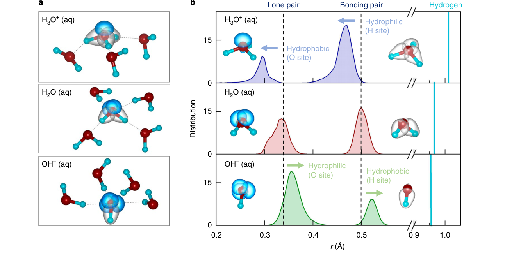
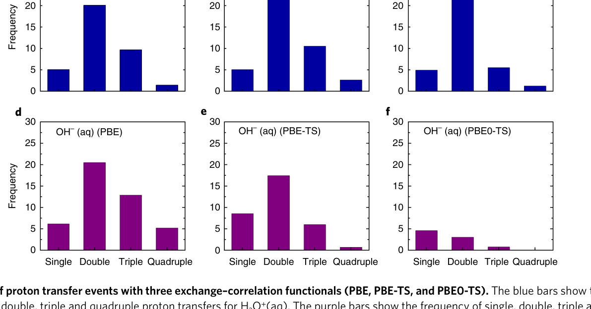
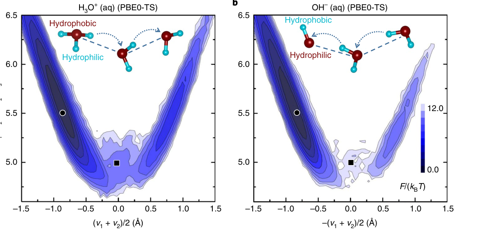
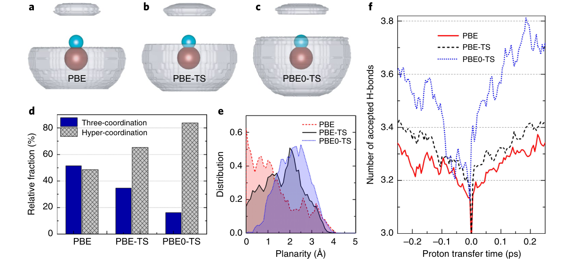

# Hydroxide diffuses slower than hydronium in water because its solvated structure inhibits correlated proton transfer

**中文题名:** 氢氧化物在水中的扩散速度比水合氢慢，因为其溶剂化结构抑制相关的质子转移

**Zotero key:** 2GSY9S3R
**Attachment key:** 9WCBZ5CD
**Journal:** Nature Chemistry
**Date:** 2018-10-22
**DOI:** 10.1038/s41557-018-0158-4
**Task date:** 2026-07-07
**Source PDF:** paper.pdf

## Why This Paper / 为什么选这篇

**English:** This paper belongs to the core proton/hydroxide transport reading thread selected for today. It helps connect microscopic solvation structure, hydrogen-bond rearrangement, and anomalous ion mobility in water.

**中文:** 这篇文献属于今天选定的质子/氢氧根传输核心阅读线索。它有助于把微观溶剂化结构、氢键重排以及水中离子的反常迁移率联系起来。

## Reading Guide / 读前导读

**English:** Read it by asking three questions: what structural motif carries the charge, what hydrogen-bond rearrangement enables transfer, and which observable or simulation coordinate supports the proposed mechanism.

**中文:** 阅读时抓住三个问题：电荷到底由什么结构单元承载，哪类氢键重排使转移成为可能，以及作者用哪种实验观测或模拟坐标支撑该机制。

## Terminology / 术语表

| English | 中文 | Note |
| --- | --- | --- |
| hydrated proton | 水合质子 | 通常指水中过量质子及其溶剂化结构 |
| hydroxide ion | 氢氧根离子 | OH-，在水中通过结构扩散和普通扩散共同迁移 |
| Grotthuss mechanism | Grotthuss 机制 | 通过氢键网络重排实现的质子/缺质子迁移 |
| proton transfer | 质子转移 | 常缩写为 PT |
| hydrogen-bond network | 氢键网络 | 决定水中离子溶剂化和传输通道 |
| potential of mean force | 平均力势 | 常用于表示反应坐标上的自由能剖面 |

## Full Bilingual Reader / 全文逐段中英对照

**Source:** p.1 S001

**Original:** HHydroxide diffuses slower than hydronium in water because its solvated structure inhibits correlated pProton transfer

**中文:** HHydroxy 在水中的扩散速度比水合氢慢，因为其溶剂化结构抑制相关的 p质子转移

**Source:** p.1 S002

**Original:** Mohan Chen 1,7, Lixin Zheng 1,7, Biswajit Santra 2, Hsin-Yu Ko 2, Robert A. DiStasio Jr 3, Michael L. Klein1,4,5, Roberto Car 2,6* and Xifan Wu 1,5*

**中文:** Mohan Chen 1,7、郑立新 1,7、Biswajit Santra 2、Hsin-Yu Ko 2、Robert A. DiStasio Jr 3、Michael L. Klein1,4,5、Roberto Car 2,6* 和 Xifan Wu 1,5*

**Source:** p.1 S003

**Original:** The anomalously high mobility of the hydronium, H3O+(aq), and hHydroxide, OH-(aq), ions solvated in water has fascinated scientists since the very beginning of molecular-based physical chemistry1,2. The two ions can be viewed as opposite topological defects in the fluctuating hydrogen-bond (H-bond) network in liquid water. In this picture, both ions bind to three water molecules by donating or accepting H-bonds. Diffusion is not dominated by hydrodynamics, but by a structural process usually referred to as the Grotthuss mechanism3, in which a proton is transferred from a hydronium to a neighbouring water molecule or from a water molecule to a neighbouring hHydroxide. In this process, a covalent O-H bond breaks while another forms as the topological defect jumps to an adjacent site in the network. Not surprisingly, pProton transfer has been intensively investigated, both experimentally and theoretically, for almost a century since the early molecular models4. Although the Grotthuss mechanism correctly identifies the origin of fast diffusion, some issues remain unresolved.

**中文:** 自分子物理化学诞生以来，水合氢离子 (H3O+(aq)) 和氢氧离子 (OH-(aq)) 异常高的迁移率就一直令科学家们着迷 1,2。这两种离子可以被视为液态水中波动氢键（H-键）网络中相反的拓扑缺陷。在这张图中，两个离子通过给予或接受氢键与三个水分子结合。扩散不是由流体动力学决定的，而是由通常被称为 Grotthuss 机制的结构过程决定的，其中质子从水合氢离子转移到邻近的水分子或从水分子转移到邻近的氢氧根。在此过程中，当拓扑缺陷跳跃到网络中的相邻位置时，共价 O-H 键断裂，同时形成另一个共价 O-H 键。毫不奇怪，自早期分子模型诞生以来近一个世纪以来，p质子转移一直在实验和理论上得到深入研究。尽管格罗萨斯机制正确地识别了快速扩散的起源，但仍有一些问题尚未解决。

**Source:** p.1 S004

**Original:** Experimentally, diffusivity is obtained via the Nernst equation from the measured electrical conductivity of the ions. While the diffusivity describes the combined effect of hydrodynamic and structural processes, the jump frequency of the protons in the structural process can be extracted from nuclear magnetic resonance (NMR) relaxation times. Conductivity5-7 and NMR5,8 experiments indicate that hydronium diffuses roughly twice as fast as hHydroxide. Predicting the transfer dynamics is difficult as it depends on the cleavage and formation of covalent bonds in a fluctuating liquid medium. Major progress in modelling pProton transfer came with the advent of ab initio molecular dynamics (AIMD)9. In this approach, the forces on the nuclei are derived from the instantaneous ground state of the electrons within density functional theory (DFT)10,11, while the electrons adjust on the fly and can thereby access bond breaking and forming events.

**中文:** 在实验上，扩散率是通过能斯特方程从测得的离子电导率获得的。虽然扩散率描述了流体动力学和结构过程的综合效应，但结构过程中质子的跳跃频率可以从核磁共振 (NMR) 弛豫时间中提取。电导率5-7 和NMR5,8 实验表明水合氢离子的扩散速度大约是氢氧根的两倍。预测转移动力学很困难，因为它取决于波动液体介质中共价键的裂解和形成。随着从头算分子动力学 (AIMD)9 的出现，p质子转移建模取得了重大进展。在这种方法中，原子核上的力源自密度泛函理论 (DFT)10,11 内电子的瞬时基态，而电子则动态调整，从而可以进行键断裂和形成事件。

**Source:** p.1 S005

**Original:** Importantly, the first AIMD study of hydronium and hHydroxide in bulk water12 showed that classical thermal fluctuations easily induce pProton transfer events on the picosecond time scale. In the case of hydronium, the first molecular simulations confirmed the long-held view that transfer involves interconversion of two defect complexes, that is, the solvated H3O+(aq) or Eigen ion13,14, and the solvated H5O2+(aq) or Zundel ion15-23. Even more notable were the results for hHydroxide, OH-(aq), which appeared to alternate between two configurations: an unexpected hypercoordinated form with four acceptor H-bonds and a nearly tetrahedral form with three acceptor H-bonds and, occasionally, a weak donor H-bond. PProton transfer only occurred in the latter configuration, suggesting a 'presolvation' mechanism, that is, access to the tetrahedral configuration, was necessary for pProton transfer in OH-(aq). Neutron diffraction24 and core-level spectroscopy data25 were consistent with the hypercoordinated structure, indirectly supporting the presolvation picture.

**中文:** 重要的是，对散装水中的水合氢和氢氧化物的第一个 AIMD 研究表明，经典的热波动很容易诱发皮秒时间尺度的质子转移事件。就水合氢而言，第一次分子模拟证实了长期以来的观点，即转移涉及两种缺陷复合物的相互转化，即溶剂化的 H3O+(aq) 或本征离子 13,14 和溶剂化的 H5O2+(aq) 或 Zundel 离子 15-23。更值得注意的是 hHydroxy, OH-(aq) 的结果，它似乎在两种构型之间交替：具有四个受体氢键的意外超配位形式和具有三个受体氢键的近四面体形式，以及偶尔的弱供体氢键。 p质子转移仅发生在后一种构型中，这表明“预溶剂化”机制，即进入四面体构型，对于 OH-(aq) 中的质子转移是必要的。中子衍射24和核心级光谱数据25与超配位结构一致，间接支持了预溶剂化图像。

**Source:** p.1 S006

**Original:** However, analysis of neutron scattering data24 suggested the solvation structure of OH-(aq) had a pot-like shape, differing from the planar structure predicted by the early AIMD simulations26, which employed the generalized gradient approximation (GGA) and treated nuclear dynamics classically. Subsequent path integral AIMD simulations, which treated the nuclei quantum mechanically, refined the model by stressing the fluxional character of the defect complexes, but did not change the basic picture as tunnelling was not found to be important26,27. In the latter scenario, pProton transfer events occur randomly due to thermal and/or quantal fluctuations. However, recent AIMD simulations added a new twist to the story: pProton transfer events are highly correlated and happen in bursts consisting of multiple jumps closely spaced in time followed by periods of inactivity28,29.

**中文:** 然而，对中子散射数据的分析24表明，OH-(aq)的溶剂化结构具有锅状形状，与早期AIMD模拟预测的平面结构不同26，后者采用广义梯度近似（GGA）并经典地处理核动力学。随后的路径积分 AIMD 模拟以量子力学方式处理原子核，通过强调缺陷复合体的流变特征来完善模型，但没有改变基本情况，因为隧道效应并不重要26,27。在后一种情况下，p质子转移事件由于热和/或量子波动而随机发生。然而，最近的 AIMD 模拟给这个故事增加了一个新的转折：p质子转移事件高度相关，并且以突发的方式发生，其中包括时间间隔很近的多次跳跃，随后是不活动的时期28,29。

**Source:** p.1 S007

**Original:** PProton transfer via hydronium and hHydroxide ions in water is ubiquitous. It underlies acid-base chemistry, certain enzyme reactions, and even infection by the flu. Despite two centuries of investigation, the mechanism underlying why hHydroxide diffuses slower than hydronium in water is still not well understood. Herein, we employ state-of-the-art density-functionaltheory-based molecular dynamics-with corrections for non-local van der Waals interactions, and self-interaction in the electronic ground state-to model water and hydrated water ions. At this level of theory, we show that structural diffusion of hydronium preserves the previously recognized concerted behaviour. However, by contrast, pProton transfer via hHydroxide is less temporally correlated, due to a stabilized hypercoordination solvation structure that discourages pProton transfer. Specifically, the latter exhibits non-planar geometry, which agrees with neutron-scattering results. Asymmetry in the temporal correlation of pProton transfer leads to hHydroxide diffusing slower than hydronium.

**中文:** 水中通过水合氢离子和氢氧根离子进行的质子转移是普遍存在的。它是酸碱化学、某些酶反应甚至流感感染的基础。尽管进行了两个世纪的研究，但氢氧化物在水中的扩散速度比水合氢慢的根本机制仍不清楚。在这里，我们采用最先进的基于密度泛函理论的分子动力学（对非局域范德华相互作用和电子基态中的自相互作用进行校正）来模拟水和水合水离子。在这个理论层面上，我们表明水合氢的结构扩散保留了先前公认的一致行为。然而，相比之下，由于稳定​​的超配位溶剂化结构阻碍了质子转移，通过氢氧化物的质子转移在时间上相关性较低。具体来说，后者表现出非平面几何形状，这与中子散射结果一致。 p质子转移的时间相关性的不对称性导致氢氧根的扩散速度比水合氢离子慢。

**Source:** p.1 S008

**Original:** 1Department of Physics, Temple University, Philadelphia, PA, USA. 2Department of Chemistry, Princeton University, Princeton, NJ, USA. 3Department of Chemistry and Chemical Biology, Cornell University, Ithaca, NY, USA. 4Department of Chemistry, Temple University, Philadelphia, PA, USA.

**中文:** 1美国宾夕法尼亚州费城天普大学物理系。 2普林斯顿大学化学系，美国新泽西州普林斯顿。 3美国纽约州伊萨卡康奈尔大学化学与化学生物学系。 4美国宾夕法尼亚州费城天普大学化学系。

**Source:** p.1 S009

**Original:** 5Institute for Computational Molecular Science, Temple University, Philadelphia, PA, USA. 6Department of Physics, Princeton University, Princeton, NJ, USA. 7These authors contributed equally: Mohan Chen, Lixin Zheng. *e-mail: rcar@princeton.edu; xifanwu@temple.edu

**中文:** 5天普大学计算分子科学研究所，美国宾夕法尼亚州费城。 6普林斯顿大学物理系，美国新泽西州普林斯顿。 7 这些作者做出了同等贡献：Mohan Chen、Lixin Cheng。 *电子邮件：rcar@princeton.edu； xifanwu@temple.edu

**Source:** p.2 S010

**Original:** Articles NATure CHemISTry

**中文:** 文章 自然化学

**Source:** p.2 S011

**Original:** D + DD +/ D-

**中文:** D+DD+/D-

**Source:** p.2 S012

**Original:** PBE-TS 12.8±​1.9 8.3±​1.6 1.54±​0.53

**中文:** PBE-TS 12.8±1.9 8.3±1.6 1.54±0.53

**Source:** p.2 S013

**Original:** PBE0-TS 8.3±​1.9 3.7±​0.4 2.24±​0.75

**中文:** PBE0-TS 8.3±1.9 3.7±0.4 2.24±0.75

**Source:** p.2 S014

**Original:** Exp. (H2O) 9.6a, 9.4c 5.4a, 5.2c 1.77a, 1.80c

**中文:** 过期。 (水) 9.6a, 9.4c 5.4a, 5.2c 1.77a, 1.80c

**Source:** p.2 S015

**Original:** Exp. (D2O) 6.9a, 6.7c 3.2a, 3.1c 2.15a, 2.15c

**中文:** 过期。 (D2O) 6.9a, 6.7c 3.2a, 3.1c 2.15a, 2.15c

**Source:** p.2 S016

**Original:** Exp. (H2O) 364.0a, 351c 206.0a, 195c 1.77a, 1.80c

**中文:** 过期。 (水) 364.0a, 351c 206.0a, 195c 1.77a, 1.80c

**Source:** p.2 S017

**Original:** Exp. (D2O) 261.6a, 252c 121.5a, 117c 2.15a, 2.15c

**中文:** 过期。 (D2O) 261.6a, 252c 121.5a, 117c 2.15a, 2.15c

**Source:** p.2 S018

**Original:** λ (H2O)/ λ (D2O) 1.39a, 1.39c, 1.364b 1.70a, 1.67c

**中文:** λ (H2O)/ λ (D2O) 1.39a, 1.39c, 1.364b 1.70a, 1.67c

**Source:** p.2 S019

**Original:** The simulation data for six exchange-correlation functionals: PW9157, BLYP58,59, HCTH/12060, PBE, PBE-TS and PBE0-TS, are reported. The data for the first three functionals are from ref.

**中文:** 报告了六种交换相关泛函的模拟数据：PW9157、BLYP58,59、HCTH/12060、PBE、PBE-TS 和 PBE0-TS。前三个泛函的数据来自参考文献。

**Source:** p.2 S020

**Original:** 26, those for the last three functionals are from the present simulation. We also show the standard deviations for computed D. The deuterium mass was used for both ions and water molecules in all AIMD simulations listed, while the experimental data (Exp.) based on both H and D are listed. See Supplementary Section 4 for more information on the procedures to compute diffusivities based on the AIMD simulations. The experimental diffusivity data were computed based on the Nernst equation λ = D RT

**中文:** 26，最后三个泛函来自当前的模拟。我们还显示了计算的 D 的标准偏差。在列出的所有 AIMD 模拟中，离子和水分子均使用氘质量，同时列出了基于 H 和 D 的实验数据 (Exp.)。有关基于 AIMD 模拟计算扩散率的程序的更多信息，请参阅补充部分 4。实验扩散率数据根据能斯特方程计算 λ = D RT

**Source:** p.2 S021

**Original:** F2 , where R is the gas constant, T is the temperature, and F is Faraday's constant.

**中文:** F2 ，其中 R 是气体常数，T 是温度，F 是法拉第常数。

**Source:** p.2 S022

**Original:** afrom ref. 5; bfrom ref. 6; cfrom ref. 7.

**中文:** 参考文献5； b来自参考文献。 6；来自参考文献。 7.

**Source:** p.2 S023

**Original:** The hypercoordinated hHydroxide form revealed by previous simulations breaks the mirror symmetry of the topological defect model between hydronium and hHydroxide. Yet, it is not evident why hHydroxide diffuses slower than hydronium. Previous simulations have adopted different flavours of the GGA for the exchange-correlation functional26. However, such GGAs not only overestimate the molecular polarizability and H-bond strength in liquid water, but also tend to grossly underestimate the equilibrium density of the liquid30-32 by neglecting long-range van der Waals or dispersion interactions. More significantly, although the predicted diffusivities of H3O+(aq) are relatively stable from different GGA functionals, those for OH-(aq) can vary by more than one order of magnitude4,26,27,33 (Table 1). This large discrepancy inevitably hinders a proper comparison of diffusivities between the two ions. Here we report AIMD simulations that adopt the hybrid functional PBE034,35 and include long-range van der Waals interactions using a self-consistent implementation of the Tkatchenko-Scheffler (TS)36 scheme.

**中文:** 先前的模拟揭示的超配位氢氧形式打破了水合氢和氢氧之间拓扑缺陷模型的镜像对称性。然而，为什么氢氧根的扩散速度比水合氢离子慢还不清楚。之前的模拟采用了不同风格的 GGA 来实现交换相关函数 26。然而，此类 GGA 不仅高估了液态水中的分子极化率和氢键强度，而且由于忽略了长程范德华或色散相互作用，往往严重低估了液体的平衡密度30-32。更重要的是，尽管不同 GGA 泛函预测的 H3O+(aq) 扩散率相对稳定，但 OH-(aq) 的预测扩散率可能相差一个以上数量级4,26,27,33（表 1）。这种巨大的差异不可避免地阻碍了两种离子之间扩散率的正确比较。在这里，我们报告了采用混合函数 PBE034,35 的 AIMD 模拟，并包括使用 Tkatchenko-Scheffler (TS)36 方案的自洽实现的远程范德华相互作用。

**Source:** p.2 S024

**Original:** The resulting PBE0-TS functional is less affected by the spurious self-interaction and better accounts for the molecular polarizability of water, greatly improving the overall description of neat water37. Our new data confirm the current picture of hydronium diffusion, namely pProton transfers are highly correlated and occur with relatively high frequency. The effects of the functional approximation are much more pronounced in OH-(aq), that is, hypercoordination increases, diffusivity decreases and the effect is accompanied by a strong suppression of multiple jumps. Double jumps are approximately four times more frequent than single jumps in the hydronium case, but they become slightly less frequent than single jumps for the hHydroxide. We explain this behaviour as a consequence of the strongly amphiphilic character through a novel electronic structure analysis, making the lone pair side of OH-(aq) more strongly hydrophilic and its H side more strongly hydrophobic. The diffusion constants of the two water ions and their ratio are in reasonable agreement with experiment.

**中文:** 由此产生的 PBE0-TS 泛函受虚假自相互作用的影响较小，并且更好地解释了水的分子极化性，极大地改善了纯水的整体描述37。我们的新数据证实了水合氢扩散的当前情况，即质子转移高度相关并且发生频率相对较高。函数近似的效应在 OH-(aq) 中更为明显，即超协调性增加，扩散性降低，并且该效应伴随着多次跳跃的强烈抑制。在水合氢离子的情况下，双跳的频率大约是单跳的四倍，但在氢氧化物的情况下，双跳的频率略低于单跳。我们通过一种新颖的电子结构分析将这种行为解释为强两亲性的结果，使 OH-(aq) 的孤对侧具有更强的亲水性，而其 H 侧具有更强的疏水性。两种水离子的扩散常数及其比例与实验结果吻合较好。

**Source:** p.2 S025

**Original:** Results and discussion PProton transfer via the hydronium ion. The electronic structure of H3O+(aq) comprises three bonding electron pairs and one lone electron pair, which are represented by the maximally localized Wannier functions39,40 in Fig. 1a. The protons of hydronium are positive and ready to be donated to neighbouring water molecules whereas the oxygen is likely to accept an H-bond from its neighbouring water molecules due to the negative lone electron pair. Since the H-bond is mainly attributed to an electrostatic attraction, the ability of donating (accepting) H-bonds can be conveniently measured by the distance separating the negative electrons from the positive nucleus, roughly estimating how positive (negative) the local environment is for a specific proton (oxygen). The resulting distance between electron pairs with respect to the nuclei, as obtained by the PBE0-TS trajectory, are shown in Fig. 1b for solvated ions and neat liquid water.

**中文:** 结果和讨论 P质子通过水合氢离子转移。 H3O+(aq) 的电子结构包括三个成键电子对和一个孤电子对，由图 1a 中的最大局域 Wannier 函数 39,40 表示。水合氢的质子是正的，可以被提供给邻近的水分子，而氧由于负孤电子对而可能接受邻近水分子的氢键。由于氢键主要归因于静电引力，因此可以通过负电子与正核之间的距离来方便地测量给予（接受）氢键的能力，粗略地估计局部环境对于特定质子（氧）的正（负）程度。对于溶剂化离子和纯液态水，通过 PBE0-TS 轨迹获得的电子对相对于原子核之间的距离如图 1b 所示。

**Source:** p.2 S026

**Original:** Compared to liquid water, the proton of hydronium has a stronger ability to donate an H-bond, while the oxygen of hydronium has a weaker ability to receive one (Supplementary Section 2). Therefore, in the absence of pProton transfers, the solvated hydronium is amphiphilic in nature with its proton (oxygen) site being hydrophilic (hydrophobic)41-45. Hence, H3O+(aq) forms the Eigen complex by stably donating three H-bonds to its neighbouring water molecules as shown in Fig. 1a. While supported by some experiments46,47, this conventional picture has been challenged by recent experiments17,21 suggesting that a long-lived Zundel complex plays a central role in proton solvation and transport. In the Zundel complex (H5O2+(aq)) the excess proton has two flanking water molecules, called the special pair, which contribute prominently to the observed vibrational spectra. In the dynamic picture of AIMD simulations, however, there is no sharp distinction between Eigen and Zundel configurations.

**中文:** 与液态水相比，水合氢的质子提供氢键的能力较强，而水合氢氧的氧接受氢键的能力较弱（补充部分2）。因此，在没有对质子转移的情况下，溶剂化的水合氢本质上是两亲性的，其质子（氧）位点是亲水（疏水）的41-45。因此，H3O+(aq) 通过稳定地向邻近的水分子提供三个氢键形成本征复合物，如图 1a 所示。虽然得到了一些实验的支持46,47，但这种传统的观点受到了最近实验的挑战17,21，表明长寿命的Zundel复合物在质子溶剂化和传输中发挥着核心作用。在 Zundel 络合物 (H5O2+(aq)) 中，多余的质子有两个侧翼水分子，称为特殊对，它们对观察到的振动光谱有显着贡献。然而，在 AIMD 模拟的动态图中，Eigen 和 Zundel 配置之间没有明显区别。

**Source:** p.2 S027

**Original:** While waiting for a pProton transfer event the solvated proton remains associated with a particular O atom but the corresponding complex keeps fluctuating through a continuum of structures including Eigenand Zundel-like geometries. As demonstrated in a recent paper these structures contribute almost equally to the observed infrared and Raman vibrational signatures23. For illustrative purposes we adopt the conventional H3O+(aq) picture in the figures. One proton of the hydronium can be transferred to a neighbouring water molecule, which in turn is converted to a new ion12,48. Moreover, pProton transfers are highly correlated in time evidenced by the preferred bursts of pProton transfer events to single pProton transfer events29. In Fig. 2a-c, we report the frequencies of pProton transfers categorized by the number (single, double, triple and quadruple) of transfer events during one burst. In general, the pProton transfers obtained from the three AIMD trajectories (PBE, PBE-TS and PBE0-TS) are all dominated by concerted events with largely preferred double jumps. By analysing the PBE0-TS trajectory, we illustrate the free energy map in Fig.

**中文:** 在等待 p质子转移事件时，溶剂化质子仍然与特定的 O 原子相关联，但相应的配合物在包括本征和 Zundel 状几何结构的连续体中不断波动。正如最近的一篇论文所证明的，这些结构对观察到的红外和拉曼振动特征的贡献几乎相同23。出于说明目的，我们在图中采用传统的 H3O+(aq) 图片。水合氢的一个质子可以转移到邻近的水分子，水分子又转化为新的离子12,48。此外，p质子转移在时间上高度相关，这可以从p质子转移事件的首选爆发到单个p质子转移事件29来证明。在图 2a-c 中，我们报告了 pProton 转移的频率，按一次突发期间转移事件的数量（一次、两次、三次和四次）进行分类。一般来说，从三个 AIMD 轨迹（PBE、PBE-TS 和 PBE0-TS）获得的 pProton 转移均以协同事件为主，其中很大程度上优选双跳。通过分析 PBE0-TS 轨迹，我们展示了图 2 中的自由能图。

**Source:** p.2 S028

**Original:** 3a with the length of water wire being a function of the pProton transfer coordinate. The analysis confirms the recent discovery that double pProton transfers are associated with the collective compression of a water wire29. This concerted behaviour enables the proton to diffuse rapidly through two or more water molecules within a single burst, which is enhanced when nuclear quantum effects (NQEs) are considered49,50. However, the H-bond network more physically modelled by the van der Waals interactions and exact exchange has non-negligible effects on the water wire compression and concerted pProton transfers. The van der Waals interaction, is an important effect causing denser water than ice under ambient conditions31,32. As in the case of pure water37, the structure of the solution with ions is softened under the influence of van der Waals interactions. The increased population of water molecules in the interstitial region weakens the H-bond network, while leaving the strength of the short-range directional H-bonds unchanged. As expected, water wires in the

**中文:** 如图3a所示，水线的长度是p质子转移坐标的函数。分析证实了最近的发现，即双质子转移与水线的集体压缩有关29。这种协同行为使质子能够在一次爆发内快速扩散通过两个或多个水分子，当考虑核量子效应 (NQE) 时，这种行为会得到增强49,50。然而，氢键网络更多地通过范德华相互作用和精确交换进行物理建模，对水线压缩和协调的质子转移具有不可忽视的影响。范德华相互作用是一种重要效应，在环境条件下导致水比冰密度更大31,32。与纯水的情况一样37，离子溶液的结构在范德华相互作用的影响下被软化。间隙区域水分子数量的增加削弱了氢键网络，而短程定向氢键的强度保持不变。正如预期的那样，水管中的水线

**Source:** p.3 S029

**Original:** Articles NATure CHemISTry

**中文:** 文章 自然化学

**Source:** p.3 S030

**Original:** Lone pair Bonding pair a b Hydrogen

**中文:** 孤对电子 键合对 a b 氢

**Source:** p.3 S031

**Original:** H3O+ (aq)

**中文:** H3O+（水溶液）

**Source:** p.3 S032

**Original:** H3O+ (aq)

**中文:** H3O+（水溶液）

**Source:** p.3 S033

**Original:** H2O (aq)

**中文:** H2O（水溶液）

**Source:** p.3 S034

**Original:** H2O (aq)

**中文:** H2O（水溶液）

**Source:** p.3 S035

**Original:** Distribution

**中文:** 分配

**Source:** p.3 S036

**Original:** OH- (aq)

**中文:** OH-（水溶液）

**Source:** p.3 S037

**Original:** OH- (aq)

**中文:** OH-（水溶液）

**Source:** p.3 S038

**Original:** H3O+ (aq) (PBE-TS)

**中文:** H3O+（水溶液）（PBE-TS）

**Source:** p.3 S039

**Original:** H3O+ (aq) (PBE)

**中文:** H3O+（水溶液）（PBE）

**Source:** p.3 S040

**Original:** Frequency Frequency

**中文:** 频率 频率

**Source:** p.3 S041

**Original:** OH- (aq) (PBE-TS)

**中文:** OH-（水溶液）（PBE-TS）

**Source:** p.3 S042

**Original:** OH- (aq) (PBE)

**中文:** OH-（水性）（PBE）

**Source:** p.3 S043

**Original:** Single Double Triple Quadruple

**中文:** 单人间 双人间 三人间 四人间

**Source:** p.3 S044

**Original:** Single Double Triple Quadruple Single Double Triple Quadruple

**中文:** 单人 双人 三人 四人 单人 双人 三人 四人

**Source:** p.3 S045

**Original:** softer liquid structure described by PBE-TS can be compressed with a slightly shorter compression length of 0.487 Å compared with that of 0.502 Å in the PBE trajectory (Supplementary Section 3).

**中文:** 与 PBE 轨迹中的 0.502 Å 相比，PBE-TS 描述的较软液体结构可以用稍短的 0.487 Å 压缩长度进行压缩（补充部分 3）。

**Source:** p.3 S046

**Original:** Hydrophilic (H site)

**中文:** 亲水性（H位）

**Source:** p.3 S047

**Original:** Hydrophobic (O site)

**中文:** 疏水性（O位点）

**Source:** p.3 S048

**Original:** Hydrophilic (O site)

**中文:** 亲水性（O位点）

**Source:** p.3 S049

**Original:** Hydrophobic (H site)

**中文:** 疏水性（H 位）

### Fig

**Placed near:** p.3 S049  
**Source:** p.3 F001

**Original caption:** Fig. 1 | Electronic structure of the solvated water molecule and water ions from PBE0-TS trajectories. a, From top to bottom: solvation structures and maximally localized Wannier functions of H3O+(aq), H2O(aq), and OH-(aq). H3O+(aq) donates three H-bonds, H2O(aq) accepts and, respectively, donates two H-bonds, OH-(aq) accepts four H-bonds. Density isosurfaces of maximally localized Wannier functions for loneand bonding-pair electrons are depicted in blue and grey, respectively. b, From top to bottom: distributions of the distances from the intramolecular oxygen of the maximally localized Wannier centres for H3O+(aq), H2O(aq), and OH-(aq). In each panel, the vertical cyan line indicates the average length of the covalent O-H bond,whereas the vertical dashed black line indicates the average distance from the intramolecular oxygen to the Wannier centres of lone and bonding pairs. The amphiphilic character of the ions emerges from the comparison with the neutral molecule: an ionic site, oxygen or hydrogen, is hydrophobic (hydrophilic) when the separation between the lone pair and oxygen, or between the bonding pair and hydrogen, is shorter (larger) than the corresponding distance in the neutral molecule.

**中文图注:** 图1| PBE0-TS 轨迹中溶剂化水分子和水离子的电子结构。 a，从上到下：H3O+(aq)、H2O(aq) 和 OH-(aq) 的溶剂化结构和最大局域 Wannier 函数。 H3O+(aq) 给出三个氢键，H2O(aq) 接受并分别给出两个氢键，OH-(aq) 接受四个氢键。孤电子和成键对电子的最大局域万尼尔函数的密度等值面分别用蓝色和灰色表示。 b，从上到下：H3O+(aq)、H2O(aq) 和 OH-(aq) 的最大局部 Wannier 中心与分子内氧的距离分布。在每个图中，垂直的青色线表示共价 O-H 键的平均长度，而垂直的黑色虚线表示从分子内氧到孤对和成键对的万尼尔中心的平均距离。离子的两亲特性是通过与中性分子的比较而显现出来的：当孤对对和氧之间或成键对和氢之间的间隔比中性分子中相应的距离更短（更大）时，离子位点（氧或氢）是疏水（亲水）的。

**Reading note / 读图提示:** 这张图对应正文中关于 氢氧根结构、配位或传输 的证据，建议和相邻段落一起看。

**Source:** p.3 S050

**Original:** H3O+ (aq) (PBE0-TS)

**中文:** H3O+（水溶液）(PBE0-TS)

**Source:** p.3 S051

**Original:** OH- (aq) (PBE0-TS)

**中文:** OH-（水溶液）（PBE0-TS）

### Fig

**Placed near:** p.3 S051  
**Source:** p.3 F002

**Original caption:** Fig. 2 | Frequency of proton transfer events with three exchange-correlation functionals (PBE, PBE-TS, and PBE0-TS). The blue bars show the frequency of single, double, triple and quadruple proton transfers for H3O+(aq). The purple bars show the frequency of single, double, triple and quadruple proton transfers for OH-(aq). The frequency is calculated by counting the average number of proton transfers of each kind during a time span of 10 ps. Consecutive jumps separated in time by 0.5 ps or less contribute to multiple (that is, concerted) proton transfer events. A time lapse of 0.5 ps is the typical observed time scale of compression of a water wire. Events in which a proton returns to its original site within 0.5 ps are considered to be rattling fluctuations and are not included in these counts.

**中文图注:** 图2|具有三个交换关联泛函（PBE、PBE-TS 和 PBE0-TS）的质子转移事件的频率。蓝色条显示 H3O+(aq) 的单质子、双质子、三重质子和四重质子转移的频率。紫色条显示 OH-(aq) 的单质子、双质子、三重质子和四重质子转移的频率。频率是通过计算 10 ps 时间跨度内每种质子转移的平均次数来计算的。时间间隔为 0.5 ps 或更小的连续跳跃会导致多个（即一致的）质子转移事件。 0.5 ps 的时间流逝是观察到的水线压缩的典型时间尺度。质子在 0.5 ps 内返回其原始位置的事件被认为是剧烈波动，不包括在这些计数中。

**Reading note / 读图提示:** 这张图对应正文中关于 氢氧根结构、配位或传输 的证据，建议和相邻段落一起看。

**Source:** p.3 S052

**Original:** The facilitated water wire compressions encourage more concerted pProton transfers as shown in Fig. 2b. Consequently, the diffusivity increases as compared with the PBE trajectory (see Table 1).

**中文:** 促进的水线压缩促进更协调的 p质子转移，如图 2b 所示。因此，与 PBE 轨迹相比，扩散率有所增加（参见表 1）。

**Source:** p.4 S053

**Original:** Articles NATure CHemISTry

**中文:** 文章 自然化学

**Source:** p.4 S054

**Original:** b OH- (aq) (PBE0-TS) a H3O+ (aq) (PBE0-TS) 6.5

**中文:** b OH- (aq) (PBE0-TS) a H3O+ (aq) (PBE0-TS) 6.5

**Source:** p.4 S055

**Original:** Hydrophobic Hydrophobic

**中文:** 疏水性 疏水性

**Source:** p.4 S056

**Original:** Hydrophilic

**中文:** 亲水性

**Source:** p.4 S057

**Original:** Electrons, as appropriately described by quantum mechanics, cannot interact with themselves. Yet, all conventional DFT functionals inherit self-interaction error, which artificially overestimates the H-bond strength37. Including fractional exact exchange in our PBE0-TS trajectories mitigates this self-interaction error. Compared with the van der Waals interactions, the exact exchange directly improves the overestimated H-bond strengths, which also affects the compression of water wire. The H-bond strengths among neighbouring water molecules become weaker resulting in a less polarizable liquid towards the experimental direction37. The reduced polarizability is mainly provided by the less negative electric environment of oxygen lone pair electrons37. The H-bonds binding hydronium to its three neighbouring water molecules are also weakened, as evidenced by the shorter distances between protons of the ion and their bonding electron pairs (0.542 Å in PBE0-TS compared to 0.550 Å in PBE-TS trajectories) yielding a less positive electric environment for protons (Supplementary Section 2).

**中文:** 正如量子力学所恰当描述的那样，电子不能与自身相互作用。然而，所有传统的 DFT 泛函都会继承自相互作用误差，从而人为地高估了氢键强度37。在我们的 PBE0-TS 轨迹中包含分数精确交换可以减轻这种自交互错误。与范德华相互作用相比，精确交换直接提高了高估的氢键强度，这也影响了水线的压缩。相邻水分子之间的氢键强度变弱，导致液体向实验方向的极化程度降低37。极化率降低主要是由氧孤对电子的负电环境较小造成的37。将水合氢离子与其三个相邻水分子结合的氢键也被削弱，离子质子与其键合电子对之间的距离较短（PBE0-TS 中的 0.542 Å 与 PBE-TS 轨迹中的 0.550 Å 相比）就证明了这一点，从而产生了质子的正电环境较差（补充部分 2）。

**Source:** p.4 S058

**Original:** As a result, the water wire compression with weaker H-bonding becomes less easy as evidenced by the longer compression length of 0.562 Å compared to 0.487 Å in the PBE-TS trajectory (Supplementary Section 3). Consistently, slower hydronium diffusion in water is observed compared to that in the PBE-TS trajectory in Table 1. Thermal fluctuations give rise to a continuum of Eigen-like and Zundel-like configurations in all our simulations, consistent with previous findings23,48. The more localized protons with the hybrid functional slightly favour Eigen-like configurations but the distinction between Eigen and Zundel should be further blurred by inclusion of NQEs48.

**中文:** 因此，氢键较弱的水线压缩变得不太容易，PBE-TS 轨迹中的压缩长度为 0.562 Å，而压缩长度为 0.487 Å（补充部分 3）。与表 1 中的 PBE-TS 轨迹相比，观察到水合氢在水中的扩散速度始终较慢。在我们的所有模拟中，热波动都会产生类本征和类 Zundel 结构的连续体，这与之前的发现一致23,48。具有混合功能的更局部化的质子稍微有利于类本征构型，但本征和 Zundel 之间的区别应该通过包含 NQEs48 进一步模糊。

**Source:** p.4 S059

**Original:** PProton transfer via the hHydroxide ion. The OH-(aq) ion is also amphiphilic38 as determined by its electronic ground state in Fig. 1b. Based on the same criterion, we can conveniently determine the hydrophobicity and hydrophilicity of OH-(aq) in Fig. 1b. The oxygen site of hHydroxide is hydrophilic and more electronegative than the oxygen site of water, whereas the proton site of hHydroxide

**中文:** P质子通过氢氧根离子转移。 OH-(aq) 离子也是两亲性的，如图 1b 中其电子基态所示。基于同样的标准，我们可以方便地确定图1b中OH-(aq)的疏水性和亲水性。 hHydroxy 的氧位点是亲水性的，并且比水的氧位点更具负电性，而 hHydroxy 的质子位点

**Source:** p.4 S060

**Original:** Hydrophilic

**中文:** 亲水性

**Source:** p.4 S061

**Original:** F/(kBT)

**中文:** F/(kBT)

### Fig

**Placed near:** p.4 S061  
**Source:** p.4 F003

**Original caption:** Fig. 3 | Free energy maps for water wire compression and double proton jumps with the PBE0-TS functional. The topographic map on the left is for H3O+(aq), the one on the right is for OH-(aq). The map gives the isocontours of the free energy in the plane of two collective coordinates, |rO(1) - rO(2)| +​ |rO(2) - rO(3)|, describing the compression of a wire made by three neighbouring molecules, and (v1 + v2)/2 or -(v1 + v2)/2, describing the displacement of the two protons attempting a jump, as depicted schematically on top of each map. From left to right, the three oxygens have coordinates rO(1), rO(2) and rO(3), respectively, while the two protons have coordinates rH(1) and rH(2), respectively. The transfer coordinate is v1 =​ |rO(1) - rH(1)| - |rH(1) - rO(2)| for the first proton, and v2 =​ |rO(2) - rH(2)| - |rH(2) - rO(3)| for the second proton. Successful double jumps correspond to the configurations on the right of each map, that is, v1 + v2 >​ 0 for H3O+(aq) or -(v1 + v2) > 0 for OH-(aq). All of the configurations in a trajectory of a three-water-wire, that is, a triplet of bonded molecules, are reported on the left of each map, but only a fraction of these configurations leads to a successful double jump. The free energy gives the relative probability of occurrence of the configurations in each map. The most stable configurations (left of the maps) are indicated by a black dot and the corresponding free energy is set equal to zero. The saddle points for double proton transfer are indicated by the black squares. The corresponding free energy barriers are 7.5 and 9.4 kBT for H3O+(aq) and OH-(aq), respectively. More details on barrier calculations are reported in Supplementary Section 3.

**中文图注:** 图3|使用 PBE0-TS 函数进行水线压缩和双质子跳跃的自由能量图。左边的地形图是H3O+(aq)，右边的地形图是OH-(aq)。该图给出了两个集体坐标 |rO(1) - rO(2)| 平面中自由能的等值线。 +​ |rO(2) - rO(3)|，描述由三个相邻分子构成的线的压缩，以及 (v1 + v2)/2 或 -(v1 + v2)/2，描述试图跳跃的两个质子的位移，如每个图顶部示意性所示。从左到右，三个氧的坐标分别为 rO(1)、rO(2) 和 rO(3)，而两个质子的坐标分别为 rH(1) 和 rH(2)。转移坐标为 v1 =​ |rO(1) - rH(1)| - |rH(1) - rO(2)|对于第一个质子， v2 =​ |rO(2) - rH(2)| - |rH(2) - rO(3)|对于第二个质子。成功的双跳对应于每个图右侧的配置，即 v1 + v2 >​ 0 对于 H3O+(aq) 或 -(v1 + v2) > 0 对于 OH-(aq)。三水线轨迹（即键合分子的三重态）中的所有构型均报告在每张图的左侧，但这些构型中只有一小部分导致成功的双跳。自由能给出了每个图中构型出现的相对概率。最稳定的构型（图的左侧）由黑点表示，相应的自由能设置为零。双质子转移的鞍点由黑色方块表示。 H3O+(aq) 和 OH-(aq) 相应的自由能垒分别为 7.5 和 9.4 kBT。有关势垒计算的更多详细信息请参见补充第 3 节。

**Reading note / 读图提示:** 这张图对应正文中关于 氢氧根结构、配位或传输 的证据，建议和相邻段落一起看。

**Source:** p.4 S062

**Original:** is hydrophobic and less electropositive compared to the proton site in water (Supplementary Section 2). Although both OH-(aq) and H3O+(aq) are amphiphilic, their electronic origins are different. The hydrophilicity of H3O+(aq) provided by its protons enables it to donate three H-bonds in the absence of pProton transfer. In contrast, the hydrophilicity of OH-(aq) provided by lone-pair electrons enables it to accept either three or four H-bonds, and both threeand hypercoordination solvation structures normally occur in the aqueous solution of OH-(aq). The three-coordination solvation structure is tetrahedral-like and encourages pProton transfers via the presolvation mechanism; while hypercoordination strongly disfavours pProton transfers. Therefore, the mirror symmetry of the pProton transfer mechanisms between the two ions is broken, and the pProton transfer via hHydroxide cannot be simply considered as the reverse process of the pProton transfer via hydronium by replacing the proton with a 'proton hole'26.

**中文:** 与水中的质子位点相比，它是疏水性的且电正性较低（补充部分2）。尽管 OH-(aq) 和 H3O+(aq) 都是两亲性的，但它们的电子来源不同。 H3O+(aq) 的质子提供的亲水性使其能够在没有 p质子转移的情况下提供三个氢键。相反，OH-(aq)由孤对电子提供的亲水性使其能够接受三个或四个氢键，并且三配位和超配位溶剂化结构通常出现在OH-(aq)的水溶液中。三配位溶剂化结构呈四面体状，通过预溶剂化机制促进质子转移；而超协调强烈不利于 p质子转移。因此，两个离子之间的p质子转移机制的镜像对称性被打破，并且通过hHydrox的p质子转移不能简单地认为是通过用“质子空穴”代替质子26通过水合氢离子进行p质子转移的逆过程。

**Source:** p.4 S063

**Original:** Interestingly, the pProton transfers described by PBE0-TS not only become less frequent but also the relative contribution of multiple jumps is strongly reduced, as reported in Fig. 2f. This mechanism differs from the traditional view29 based on GGA functionals, namely that pProton transfers via OH-(aq) should follow a similar trend as H3O+(aq), shown in Fig. 2d. While the pProton transfers become less concerted, the diffusivity of OH-(aq) also decreases relative to that of H3O+(aq), approaching a ratio that quantitatively agrees with the experimental value in Table 1. The revised pProton transfer mechanism for OH-(aq) implies drastic changes brought by the van der Waals interactions and the hybrid functional, rather than perturbed water wires compression observed in the H3O+(aq) solution. Indeed, changes in the solvation structure of OH-(aq) in Fig. 4d suggest substantially stabilized hypercoordination configurations.

**中文:** 有趣的是，PBE0-TS 描述的 pProton 转移不仅变得不那么频繁，而且多次跳跃的相对贡献也大大减少，如图 2f 所示。这种机制不同于基于 GGA 泛函的传统观点，即 pProton 通过 OH-(aq) 的转移应该遵循与 H3O+(aq) 类似的趋势，如图 2d 所示。虽然p质子转移变得不那么一致，OH-(aq)的扩散率相对于H3O+(aq)的扩散率也降低，接近与表1中的实验值定量一致的比率。修订后的OH-(aq)的p质子转移机制意味着范德华相互作用和混合泛函带来的剧烈变化，而不是在H3O+(aq)溶液中观察到的扰动水线压缩。事实上，图 4d 中 OH-(aq) 溶剂化结构的变化表明超配位构型基本稳定。

**Source:** p.4 S064

**Original:** The PBE functional overestimates the polarizability, yielding over-structured water, and this over-strengthened tetrahedral H-bond network energetically favours the tetrahedral-like three-coordination, that is, the presolvated structure of OH-(aq). Fig. 4d shows that PBE

**中文:** PBE 泛函高估了极化率，产生过度结构化的水，并且这种过度强化的四面体氢键网络大力支持类四面体三配位，即 OH-(aq) 的预溶剂化结构。图4d显示PBE

**Source:** p.5 S065

**Original:** Articles NATure CHemISTry

**中文:** 文章 自然化学

**Source:** p.5 S066

**Original:** PBE

**中文:** 聚苯醚

**Source:** p.5 S067

**Original:** PBE-TS

**中文:** PBE-TS

**Source:** p.5 S068

**Original:** PBE0-TS

**中文:** PBE0-TS

**Source:** p.5 S069

**Original:** Three-coordination Hyper-coordination 80

**中文:** 三协调 超协调 80

**Source:** p.5 S070

**Original:** Distribution

**中文:** 分配

**Source:** p.5 S071

**Original:** PBE-TS

**中文:** PBE-TS

**Source:** p.5 S072

**Original:** PBE0-TS

**中文:** PBE0-TS

**Source:** p.5 S073

**Original:** predicts 51% three-coordination and 49% hypercoordination. With the van der Waals interactions considered, the H-bond structure of liquid water is softened and facilitates the stabilization of hypercoordination of OH-(aq). As a result, the percentage of hypercoordination increases from 49% in the PBE trajectory to 65% in the PBE-TS trajectory. The hypercoordination is further stabilized to 84% in the PBE0-TS trajectory. The additional amount of hyper-coordination (~19%) is attributed to two physical effects. As far as the H-bond network of the liquid solution is concerned, the exact exchange yields a weakened directional H-bond strength, and generates a further softened liquid water structure, which again helps to stabilize the hypercoordination structure. In the above, the weakened directional H-bond strength is mainly provided by a less negative environment of the lone pair electrons of liquid water, which is reduced by 2.9% (as measured by the distance between maximally localized Wannier centres and oxygen in Fig. 1).

**中文:** 预测 51% 为三协调，49% 为超协调。考虑到范德华相互作用，液态水的氢键结构被软化，有利于 OH-(aq) 超配位的稳定。结果，超协调的百分比从 PBE 轨迹中的 49% 增加到 PBE-TS 轨迹中的 65%。在 PBE0-TS 轨迹中超协调进一步稳定到 84%。额外的超协调性（~19%）归因于两个物理效应。就液体溶液的氢键网络而言，精确的交换会减弱定向氢键强度，并产生进一步软化的液态水结构，这再次有助于稳定超配位结构。其中，定向氢键强度的减弱主要是由液态水孤对电子的负环境较小所提供的，减少了2.9%（通过图1中最大局域万尼尔中心与氧之间的距离测量）。

**Source:** p.5 S074

**Original:** At short-range scale, the H-bonding between OH-(aq) and the neighbouring waters is much less affected by the exact exchange than that of liquid water. The negative environment due to the lone pair electrons of the hHydroxide is only reduced about 1.1%. As a result, the amphiphilic propensity of the solvated hHydroxide is promoted, which enables the hHydroxide to attract more water molecules further favouring the hypercoordination structure. Conventional AIMD theories based on the GGA functionals repeatedly predicted a planar-like solvation structure of hypercoordinated OH-(aq), that is, the four hydrogen-bonded water molecules accepted by OH-(aq) roughly stay within a plane. We confirm in Fig. 4a that the distribution of water molecules surrounding OH-(aq) is relatively flat from the PBE trajectory. The planar structure can be clearly demonstrated by the planarity (defined as the distance from one water to the plane formed by the other three water molecules) analysis shown in Fig. 4e, where the distribution of planarity centres at around zero indicating the dominant planar structure of hypercoordination.

**中文:** 在短程尺度上，OH-(aq) 与邻近水域之间的氢键比液态水受到精确交换的影响要小得多。由于 hHydroxy 的孤对电子而产生的负环境仅减少了约 1.1%。结果，促进了溶剂化的h氢氧化物的两亲倾向，这使得h氢氧化物能够吸引更多的水分子，进一步有利于超配位结构。传统的基于GGA泛函的AIMD理论反复预测超配位OH-(aq)的平面状溶剂化结构，即OH-(aq)接受的四个氢键水分子大致保持在一个平面内。我们在图 4a 中证实，从 PBE 轨迹来看，OH-(aq) 周围的水分子分布相对平坦。平面结构可以通过图4e所示的平面度（定义为从一种水到其他三个水分子形成的平面的距离）分析清楚地证明，其中平面度的分布集中在零附近，表明超配位的主要平面结构。

**Source:** p.5 S075

**Original:** However, the experimental evidence based on the neutron scattering data24 yields a non-planar solvation pattern.

**中文:** 然而，基于中子散射数据的实验证据24产生了非平面溶剂化模式。

**Source:** p.5 S076

**Original:** PBE PBE-TS

**中文:** PBE PBE-TS

**Source:** p.5 S077

**Original:** PBE0-TS

**中文:** PBE0-TS

**Source:** p.5 S078

**Original:** Number of accepted H-bonds

**中文:** 接受的氢债数量

**Source:** p.5 S079

**Original:** PBE

**中文:** 聚苯醚

**Source:** p.5 S080

**Original:** PBE-TS

**中文:** PBE-TS

**Source:** p.5 S081

**Original:** PBE0-TS

**中文:** PBE0-TS

**Source:** p.5 S082

**Original:** 3.0 -0.2 -0.1 0.0 PProton transfer time (ps)

**中文:** 3.0 -0.2 -0.1 0.0 P质子传输时间 (ps)

### Fig

**Placed near:** p.5 S082  
**Source:** p.5 F004

**Original caption:** Fig. 4 | Solvation structures of OH-(aq) with three functional approximations (PBE, PBE-TS, and PBE0-TS). a-c, Isosurfaces representing the spatial distribution of the oxygen sites of the solvating molecules in the hypercoordinated structure of OH-(aq) with three functionals. The hydroxide ion has the hydrogen (cyan sphere) pointing upward and the oxygen (red sphere) pointing downward. d, Relative fraction of threeand hypercoordinated solvation structures with three functionals. In the three-coordinated structure OH-(aq) accepts three H-bonds, in the hypercoordinated structure it accepts four H-bonds or more. e, Planarity distribution of the hypercoordinated structures with three functionals. The planarity order parameter is defined by the distance between a coordinating oxygen atom and the plane formed by three other coordinating oxygen atoms. f, Coordination number (number of acceptor H-bonds) of OH-(aq) before (t < 0) and after (t >​ 0) a proton transfer event. Proton transfer events are very fast (~0.005 ps) on the time scale of the plot. Thus OH-(aq) is always unambiguously defined and we can follow its evolution by adopting the Lagrangian point of view.

**中文图注:** 图4|具有三种函数近似值（PBE、PBE-TS 和 PBE0-TS）的 OH-(aq) 溶剂化结构。 a-c，等值面代表具有三个官能团的 OH-(aq) 超配位结构中溶剂化分子的氧位点的空间分布。氢氧根离子的氢（青色球体）朝上，氧（红色球体）朝下。 d，三官能团和超配位溶剂化结构的相对分数。在三配位结构中，OH-(aq)接受三个H键，在超配位结构中，它接受四个或更多H键。 e，具有三泛函的超配位结构的平面分布。平面有序参数由配位氧原子与其他三个配位氧原子形成的平面之间的距离定义。 f, 质子转移事件之前 (t < 0) 和之后 (t > 0) OH-(aq) 的配位数（受体氢键数量）。在绘图的时间尺度上，质子转移事件非常快（~0.005 ps）。因此 OH-(aq) 总是被明确定义，我们可以通过采用拉格朗日观点来跟踪它的演变。

**Reading note / 读图提示:** 这张图对应正文中关于 氢氧根结构、配位或传输 的证据，建议和相邻段落一起看。

**Source:** p.5 S083

**Original:** In the PBE-TS and PBE0-TS trajectories, the H-bond network is modelled more accurately and the hypercoordination is stabilized. Therefore, more water molecules acquired by hypercoordination, are attracted to the first coordination shell. These additional water molecules are closer to the oxygen atom of OH-,(aq) that is, a strongly hydrophilic site, and filling in the space close by. Consequently, the hypercoordination in the PBE0-TS trajectory exhibits a non-planar structure with its planarity distribution centered significantly away from zero in Fig. 4e. Furthermore, the surrounding water molecule density has a pot-like structure, shown in Fig. 4c, as found in the neutron scattering experiments24. The agreement strongly suggests that an accurate H-bond description, which has been achieved via PBE0-TS, is crucial to understand the pProton transfer mechanism of OH-(aq). With more stabilized hypercoordination structures in OH-(aq) from the PBE0-TS trajectory, the presolvated structure (threecoordination) of hHydroxide becomes relatively rare. Therefore, the largely suppressed pProton transfers in Fig. 2f are expected.

**中文:** 在 PBE-TS 和 PBE0-TS 轨迹中，氢键网络的建模更加准确，超配位也变得稳定。因此，通过超配位获得的更多水分子被吸引到第一个配位壳。这些额外的水分子更接近 OH-,(aq) 的氧原子，即强亲水位点，并填充附近的空间。因此，PBE0-TS 轨迹中的超协调表现出非平面结构，其平面分布中心明显远离图 4e 中的零。此外，正如中子散射实验中发现的那样，周围的水分子密度具有锅状结构，如图4c所示。该协议强烈表明，通过 PBE0-TS 实现的准确氢键描述对于理解 OH-(aq) 的 p质子转移机制至关重要。随着 PBE0-TS 轨迹中 OH-(aq) 中的超配位结构更加稳定，hHydroxy 的预溶剂化结构（三配位）变得相对罕见。因此，预计图 2f 中的 p质子转移会受到很大程度上抑制。

**Source:** p.5 S084

**Original:** However, it is intriguing that the majority of the suppressed pProton transfers are of concerted types, while the frequency of single jump events is marginally influenced. The feature cannot be understood by the presolvation mechanism alone without considering the water wire compression. In this context, it is useful to compare the free-energy landscapes in Fig. 3a,b for the water wire compression as a function of the concerted (double) pProton transfers coordinate. Consistently, it is found that the energy barrier for a double pProton transfer to occur by the water wire compression in OH-(aq) is about 1.9 kBT larger than the similar energy barrier in H3O+(aq) (Supplementary Section 3). The significantly suppressed concerted pProton transfers can be attributed to the energetically stabilized hypercoordination of OH-(aq). Fig. 4f illustrates the changes of coordination number of OH-(aq) with respect to the time before (t < 0) and after pProton transfers (t > 0).

**中文:** 然而，有趣的是，大多数被抑制的 p质子转移都是协同类型的，而单跳事件的频率受到的影响却很小。在不考虑水线压缩的情况下，仅通过预溶解机制无法理解该特征。在这种情况下，比较图 3a、b 中水线压缩的自由能景观是有用的，作为协同（双）p质子传输坐标的函数。一致地，发现 OH-(aq) 中的水线压缩发生双 p质子转移的能垒比 H3O+(aq) 中的类似能垒大约 1.9 kBT（补充部分 3）。显着抑制的一致 p质子转移可归因于 OH-(aq) 的能量稳定超协调。图4f说明了OH-(aq)配位数相对于p质子转移之前(t < 0)和之后(t > 0)时间的变化。

**Source:** p.5 S085

**Original:** Consistent with the presolvation mechanism, all simulations show OH-(aq) relaxes from three-coordination back to the hypercoordination after each pProton transfer event and vice versa. However, the more energetically stabilized hypercoordinated OH-(aq) in the PBE0-TS trajectory

**中文:** 与预溶剂化机制一致，所有模拟均表明 OH-(aq) 在每次质子转移事件后从三配位松弛回到超配位，反之亦然。然而，PBE0-TS 轨迹中能量更加稳定的超配位 OH-(aq)

**Source:** p.6 S086

**Original:** Articles NATure CHemISTry

**中文:** 文章 自然化学

**Source:** p.6 S087

**Original:** enables a much faster relaxation than that obtained from the PBE and PBE-TS trajectories. On average, the timescale of such relaxation in PBE0-TS trajectory is about 0.3 ps shorter than that of the typical water wire compression (~0.5 ps)28. The observed fast relaxation back to the hypercoordinated OH-(aq) is a key to hinder the concerted pProton transfer.

**中文:** 比从 PBE 和 PBE-TS 轨迹获得的弛豫速度要快得多。平均而言，PBE0-TS 轨迹中这种松弛的时间尺度比典型水线压缩的时间尺度 (~0.5 ps) 短约 0.3 ps28。观察到的快速弛豫回到超配位 OH-(aq) 是阻碍协同 p质子转移的关键。

**Source:** p.6 S088

**Original:** Conclusions The origin of the different diffusion mechanisms of the hydrated water ions resides in their electronic ground states. Hence, an accurate theory of the solvent H-bond network is crucial. By utilizing state-of-the-art ab initio molecular dynamics, we confirmed pProton transfers via the H3O+(aq) are frequent, with mostly concerted jumps. By contrast, pProton transfers via the solvated hHydroxide ion are more rare, with much fewer concerted jumps, due to the formation of (and rapid relaxation to) a stable non-planar and hypercoordinated solvation structure. This unique solvation shell, which is structurally consistent with neutron scattering experiments, actively discourages pProton transfer in aqueous hHydroxide solutions. Because the Stokes diffusions of these two water ions are roughly the same at the level of PBE0-TS theory, which are (0.76 ±​ 0.22) ×​ 10-9 and (0.66 ±​ 0.08) ×​ 10-9 m2 s-1 for H3O+(aq) and OH-(aq), respectively, their differences in the nature of concerted pProton transfers against simple pProton transfer provide a rational explanation as to why hHydroxide diffuses slower than hydronium in water.

**中文:** 结论 水合水离子不同扩散机制的根源在于其电子基态。因此，溶剂氢键网络的准确理论至关重要。通过利用最先进的从头算分子动力学，我们证实 pProton 通过 H3O+(aq) 的转移是频繁的，并且大多是一致的跳跃。相比之下，由于形成（并快速弛豫）稳定的非平面和超配位溶剂化结构，通过溶剂化氢氧根离子进行的质子转移更加罕见，协同跳跃也少得多。这种独特的溶剂化壳在结构上与中子散射实验一致，可有效抑制氢氧化物水溶液中的质子转移。由于这两种水离子的斯托克斯扩散在 PBE0-TS 理论水平上大致相同，对于 H3O+(aq) 和 OH-(aq) 分别为 (0.76 ± 0.22) × 10-9 和 (0.66 ± 0.08) × 10-9 m2 s-1，因此它们在协同 p 质子转移与简单 p 质子转移性质上的差异提供了关于为什么氢在水中比水合氢扩散得慢的合理解释。

**Source:** p.6 S089

**Original:** The different roles played by concerted pProton transfer dynamics in H3O+(aq) and OH-(aq) have direct bearing on the interpretation of the NMR experiments, which mostly assumed so far a simple Markovian process to extract the pProton transfer rates5,8. NQEs play an important role in the dynamics of these two water ions; the concerted pProton transfers will be further enhanced by the delocalized protons50. Our main conclusion is expected to be intact since previous studies suggested NQEs do not qualitatively affect the energetics of the solvation structures of the water ions. In this context, the extra stabilization of the hypercoordination structure of OH-(aq) suggests a likely explanation for the large reported difference in the isotope effect on the transfer rates of the two aqua ions8, as the deeper free energy well associated to OH-(aq) in our simulation should translate in a comparatively larger quantum zero-point motion effect in OH-(aq) than in H3O+(aq).

**中文:** H3O+(aq) 和 OH-(aq) 中一致的质子转移动力学所发挥的不同作用对 NMR 实验的解释有直接影响，到目前为止，大多数假设采用简单的马尔可夫过程来提取质子转移速率 5,8。 NQE 在这两种水离子的动力学中发挥着重要作用；离域质子50将进一步增强一致的质子转移。我们的主要结论预计是完整的，因为之前的研究表明 NQE 不会定性地影响水离子溶剂化结构的能量。在这种情况下，OH-(aq)超配位结构的额外稳定性表明了同位素效应对两个水离子传输速率的巨大差异的可能解释，因为在我们的模拟中与OH-(aq)相关的更深的自由能应该转化为OH-(aq)中比H3O+(aq)中相对更大的量子零点运动效应。

**Source:** p.6 S090

**Original:** Methods We used the Quantum ESPRESSO51 software to perform simulations based on density functional theory. We used a method35 based on Wannier functions to compute efficiently exact exchange in PBE0 calculations, and evaluated selfconsistently37 the TS dispersion contribution. The pure water system is composed of 128 H2O. The hydronium system consists of 63 H2O with one excess proton (127 H atoms and 63 O atoms) whereas the hHydroxide system consists of 63 H2O with one hHydroxide ion (127 H atoms and 64 O atoms). In order to reproduce the experimental density of liquid water at ambient conditions, the cubic cells used for ion and pure water simulations have the cell lengths 12.4 and 15.7 Å, respectively. Only the gamma point was used to sample the Brillouin zone of the supercell. The periodic boundary conditions were utilized with the energy cutoff of plane wave basis being 72 Ry. Troullier-Martins52 norm-conserving pseudopotentials were employed. We performed the Car-Parrinello molecular dynamics9 with the standard Verlet algorithm to propagate nuclear and electronic degrees of freedom.

**中文:** 方法我们使用Quantum ESPRESSO51 软件进行基于密度泛函理论的模拟。我们使用基于 Wannier 函数的方法在 PBE0 计算中高效地计算精确交换，并自洽地评估了 TS 色散贡献。纯水系统由128 H2O组成。水合氢系统由 63 个 H2O 和 1 个过量质子（127 个 H 原子和 63 个 O 原子）组成，而 hHydroxy 系统由 63 个 H2O 和 1 个 h 氢氧根离子（127 个 H 原子和 64 个 O 原子）组成。为了重现环境条件下液态水的实验密度，用于离子和纯水模拟的立方晶胞的晶胞长度分别为 12.4 和 15.7 Å。仅使用伽玛点对超级单元的布里渊区进行采样。采用周期性边界条件，平面波基的能量截止值为72 Ry。采用 Troullier-Martins52 范数守恒赝势。我们使用标准 Verlet 算法执行 Car-Parrinello 分子动力学9，以传播核和电子自由度。

**Source:** p.6 S091

**Original:** We used a fictitious electronic mass of 150 a.u. to ensure the adiabatic separation between the nuclear and electronic degrees of freedom, and the mass preconditioning with a kinetic energy cutoff of 6 Ry was applied to all Fourier components of electronic wave functions53. All simulations were performed in the NVT ensemble at 330 K (ref. 37). The ionic temperature was controlled using the Nosé-Hoover chain thermostats54 with one Nosé-Hoover chain per atom and four thermostats in each chain. The time step was set to be 3.5 a.u. (~0.08 fs). The nuclear mass of deuterium (2.0135 a.m.u.) was set for each hydrogen atom to accelerate the convergence, while the nuclear mass of oxygen was set to 15.9995 a.m.u. We generated 28-, 45and 32-ps trajectories for the hydronium systems using the Perdew-Burke-Ernzerhof (PBE)55; PBE with the van der Waals interactions in the form of Tkatchenko and Scheffler36 (PBE-TS); and PBE-TS with a mixing of 25 per cent exact exchange34 (PBE0-TS) functionals, respectively; we also generated 54-, 55and 38-ps for the hHydroxide systems using the PBE,

**中文:** 我们使用了 150 个天文单位的虚构电子质量。为了确保核自由度和电子自由度之间的绝热分离，并对电子波函数的所有傅立叶分量应用动能截止为 6 Ry 的质量预处理53。所有模拟均在 330 K 的 NVT 系综中进行（参考文献 37）。使用Nosé-Hoover链恒温器54控制离子温度，每个原子有一个Nosé-Hoover链，每条链有四个恒温器。时间步长设置为 3.5 a.u。 （~0.08 fs）。为每个氢原子设置氘的核质量（2.0135 a.m.u.）以加速收敛，而氧的核质量设置为15.9995 a.m.u。我们使用 Perdew-Burke-Ernzerhof (PBE)55 为水合氢系统生成了 28、45 和 32-ps 轨迹； PBE 具有 Tkatchenko 和 Scheffler36 形式的范德华相互作用 (PBE-TS)；和 PBE-TS，分别混合了 25% 的精确交换 34 (PBE0-TS) 泛函；我们还使用 PBE 为 hHydroxy 系统生成了 54-、55 和 38-ps，

**Source:** p.6 S092

**Original:** PBE-TS, and PBE0-TS functionals, respectively. For the pure liquid water system, we have trajectories of 14, 14 and 25 ps for PBE, PBE-TS, and PBE0-TS trajectories, respectively. We defined the H-bond within a cutoff of 3.5 Å for O-O distance and an H-O-O angle less than 30° (ref. 56). We also used a cutoff of 1.24 Å for the O-H covalent bond.

**中文:** 分别为 PBE-TS 和 PBE0-TS 泛函。对于纯液态水系统，我们的 PBE、PBE-TS 和 PBE0-TS 轨迹分别为 14、14 和 25 ps。我们将 O-O 距离的截止值定义为 3.5 Å 以内的氢键，并且 H-O-O 角小于 30°（参考文献 56）。我们还对 O-H 共价键使用了 1.24 Å 的截止值。

**Source:** p.6 S093

**Original:** Data availability. The data that support the findings of this study are available from the corresponding authors upon reasonable request.

**中文:** 数据可用性。支持本研究结果的数据可根据合理要求从相应作者处获得。

**Source:** p.6 S094

**Original:** Received: 2 October 2017; Accepted: 23 January 2018; Published online: 12 March 2018

**中文:** 收稿日期：2017 年 10 月 2 日；接受日期：2018 年 1 月 23 日；在线发布：2018 年 3 月 12 日

**Source:** p.7 S095

**Original:** Articles NATure CHemISTry

**中文:** 文章 自然化学

**Source:** p.7 S096

**Original:** 27. Marx, D. PProton transfer 200 years after von Grotthuss: insights from ab initio simulations. ChemPhysChem 7, 1848-1870 (2006). 28. Hassanali, A., Prakash, M. K., Eshet, H. & Parrinello, M. On the recombination of hydronium and hHydroxide ions in water. Proc. Natl Acad. Sci. USA 108, 20410-20415 (2011). 29. Hassanali, A., Giberti, F., Cuny, J., Kühne, T. D. & Parrinello, M. PProton transfer through the water gossamer. Proc. Natl Acad. Sci. USA 110, 13723-13728 (2013). 30. Gillan, M. J., Alfè, D. & Michaelides, A. Perspective: how good is DFT for water? J. Phys. Chem. 144, 130901 (2016). 31. Gaiduk, A. P., Gygi, F. & Galli, G. Density and compressibility of liquid water and ice from first-principles simulations with hybrid functionals. J. Phys. Chem. Lett. 6, 2902-2908 (2015). 32. Miceli, G., de Gironcoli, S. & Pasquarello, A. Isobaric first-principles molecular dynamics of liquid water with nonlocal van der Waals interactions. J. Chem. Phys. 142, 034501 (2015). 33. Marx, D., Chandra, A. & Tuckerman, M. E. Aqueous basic solutions: hHydroxide solvation, structural diffusion, and comparison to the hydrated proton. Chem. Rev.

**中文:** 27. 马克思，D. 冯·格罗特胡斯 200 年后的 PProton 传输：从头开始模拟的见解。化学物理化学 7, 1848-1870 (2006)。 28. Hassanali, A.、Prakash, M. K.、Eshet, H. 和 Parrinello, M. 关于水中水合氢离子和氢氧根离子的重组。过程。国家科学院。科学。美国 108，20410-20415 (2011)。 29. Hassanali, A.、Giberti, F.、Cuny, J.、Kühne, T. D. 和 Parrinello, M. P质子通过水游丝传输。过程。国家科学院。科学。美国 110, 13723-13728 (2013)。 30. Gillan, M. J.、Alfè, D. 和 Michaelides, A. 观点：DFT 对水有多好？ J. Phys。化学。 144, 130901 (2016)。 31. Gaiduk, A. P.、Gygi, F. 和 Galli, G. 通过混合泛函的第一性原理模拟得出液态水和冰的密度和可压缩性。 J. Phys。化学。莱特。 6、2902-2908（2015）。 32. Miceli, G.、de Gironcoli, S. 和 Pasquarello, A. 具有非局域范德华相互作用的液态水的等压第一原理分子动力学。 J.化学。物理。 142, 034501 (2015)。 33. Marx, D.、Chandra, A. 和 Tuckerman, M. E. 水基溶液：氢氧化物溶剂化、结构扩散以及与水合质子的比较。化学。牧师。

**Source:** p.7 S097

**Original:** 110, 2174-2216 (2010). 34. Perdew, J. P., Ernzerhof, M. & Burke, K. Rationale for mixing exact exchange with density functional approximations. J. Phys. Chem. 105, 9982-9985 (1996). 35. Wu, X. F., Selloni, A. & Car, R. Order-N implementation of exact exchange in extended insulating systems. Phys. Rev. B 79, 085102 (2009). 36. Tkatchenko, A. & Scheffler, M. Accurate molecular van der Waals interactions from ground-state electron density and free-atom reference data. Phys. Rev. Lett. 102, 073005 (2009). 37. DiStasio, R. A. Jr, Santra, B., Li, Z., Wu, X. & Car, R. The individual and collective effects of exact exchange and dispersion interactions on the ab initio structure of liquid water. J. Phys. Chem. 141, 084502 (2014). 38. Crespo, Y. & Hassanali, A. Unveiling the Janus-like properties of OH-. J. Phys. Chem. Lett. 6, 272-278 (2015). 39. Marzari, N. & Vanderbilt, D. Maximally localized generalized Wannier functions for composite energy bands. Phys. Rev. B 56, 12847-12865 (1997). 40. Marzari, N., Mostofi, A. A., Yates, J. R., Souza, I. & Vanderbilt, D. Maximally localized Wannier functions: theory and applications. Rev. Mod. Phys.

**中文:** 110, 2174-2216 (2010)。 34. Perdew, J. P.、Ernzerhof, M. 和 Burke, K. 将精确交换与密度泛函近似混合的基本原理。 J. Phys。化学。 105, 9982-9985 (1996)。 35. Wu, X. F.、Selloni, A. 和 Car, R. 在扩展绝缘系统中精确交换的 Order-N 实施。物理。修订版 B 79, 085102 (2009)。 36. Tkatchenko, A. 和 Scheffler, M。根据基态电子密度和自由原子参考数据精确的分子范德华相互作用。物理。莱特牧师。 102, 073005 (2009)。 37. DiStasio, R. A. Jr, Santra, B., Li, Z., Wu, X. & Car, R. 精确交换和分散相互作用对液态水从头算结构的个体和集体影响。 J. Phys。化学。 141, 084502 (2014)。 38. Crespo, Y. 和 Hassanali, A. 揭示 OH- 的类似两面性的特性。 J. Phys。化学。莱特。 6、272-278（2015）。 39. Marzari, N. 和 Vanderbilt, D. 复合能带的最大局域广义 Wannier 函数。物理。修订版 B 56, 12847-12865 (1997)。 40. Marzari, N.、Mostofi, A. A.、Yates, J. R.、Souza, I. 和 Vanderbilt, D. 最大局域 Wannier 函数：理论与应用。修订版 Mod。物理。

**Source:** p.7 S098

**Original:** 84, 1419 (2012). 41. Hassanali, A. A., Giberti, F., Sosso, G. C. & Parrinello, M. The role of the umbrella inversion mode in proton diffusion. Chem. Phys. Lett. 599, 133-138 (2014). 42. Wang, F., Izvekov, S. & Voth, G. A. Unusual "amphiphilic" association of hydrated protons in strong acid solution. J. Am. Chem. Soc. 130, 3120-3126 (2008). 43. Iuchi, S., Chen, H., Paesani, F. & Voth, G. A. Hydrated excess proton at water-​hydrophobic interfaces. J. Phys. Chem. B 113, 4017-4030 (2008). 44. Tse, Y. L., Chen, C., Lindberg, G. E., Kumar, R. & Voth, G. A. Propensity of hydrated excess protons and hHydroxide anions for the air-water interface. J. Am. Chem. Soc. 137, 12610 (2015). 45. Giberti, F. & Hassanali, A. The excess proton at the air-water interface: the role of instantaneous liquid interfaces. J. Chem. Phys. 146, 244703 (2017). 46. Woutersen, S. & Bakker, H. J. Ultrafast vibrational and structural dynamics of the proton in liquid water. Phys. Rev. Lett. 96, 138305 (2006). 47. Tielrooij, K. J., Timmer, R. L. A., Bakker, H. J. & Bonn, M. Structure dynamics of the proton in liquid water probed with terahertz time-domain spectroscopy.

**中文:** 84, 1419 (2012)。 41. Hassanali, A. A.、Giberti, F.、Sosso, G. C. 和 Parrinello, M. 伞反转模式在质子扩散中的作用。化学。物理。莱特。 599, 133-138 (2014)。 42. Wang, F., Izvekov, S. & Voth, G. A. 强酸溶液中水合质子的异常“两亲”缔合。 J. Am.化学。苏克。 130, 3120-3126 (2008)。 43. Iuchi, S.、Chen, H.、Paesani, F. 和 Voth, G. A. 在水-疏水界面处水合过量质子。 J. Phys。化学。 B 113, 4017-4030 (2008)。 44. Tse, Y. L., Chen, C., Lindberg, G. E., Kumar, R. & Voth, G. A. 空气-水界面中水合过量质子和氢氧根阴离子的倾向。 J. Am.化学。苏克。 137、12610（2015）。 45. Giberti, F. 和 Hassanali, A。空气-水界面处的过量质子：瞬时液体界面的作用。 J.化学。物理。 146, 244703 (2017)。 46. Woutersen, S. 和 Bakker, H. J. 液态水中质子的超快振动和结构动力学。物理。莱特牧师。 96、138305（2006）。 47. Tielrooij, K. J.、Timmer, R. L. A.、Bakker, H. J. 和 Bonn, M. 用太赫兹时域光谱探测液态水中质子的结构动力学。

**Source:** p.7 S099

**Original:** Phys. Rev. Lett. 102, 198303 (2009). 48. Marx, D., Tuckerman, M. E., Hutter, J. & Parrinello, M. The nature of the hydrated excess proton in water. Nature 397, 601-604 (1999). 49. Chen, J., Li, X.-Z., Zhang, Q., Michaelides, A. & Wang, E. Nature of proton transport in a water-filled carbon nanotube and in liquid water. Phys. Chem. Chem. Phys. 15, 6344-6349 (2013).

**中文:** 物理。莱特牧师。 102、198303（2009）。 48. Marx, D.、Tuckerman, M. E.、Hutter, J. 和 Parrinello, M. 水中水合过量质子的性质。自然 397, 601-604 (1999)。 49. Chen, J.、Li, X.-Z.、Zhang, Q.、Michaelides, A. 和 Wang, E. 充水碳纳米管和液态水中质子传输的性质。物理。化学。化学。物理。 15、6344-6349（2013）。

**Source:** p.7 S100

**Original:** 50. Giberti, F., Hassanali, A. A., Ceriotti, M. & Parrinello, M. The role of quantum effects on structural and electronic fluctuations in neat and charged water. J. Phys. Chem. B 118, 13226-13235 (2014). 51. Giannozzi, P. et al. Advanced capabilities for materials modelling with Quantum ESPRESSO. J. Phys. Condens. Matter 29, 465901 (2017). 52. Troullier, N. & Martins, J. L. Efficient pseudopotentials for plane-wave calculations. Phys. Rev. B 43, 1993-2006 (1991). 53. Tassone, F., Mauri, F. & Car, R. Acceleration schemes for ab initio moleculardynamics simulations and electronic-structure calculations. Phys. Rev. B 50, 10561 (1994). 54. Martyna, G. J., Klein, M. L. & Tuckerman, M. E. Nosé-Hoover chains: the canonical ensemble via continuous dynamics. J. Phys. Chem. 97, 2635-2643 (1992). 55. Perdew, J. P., Burke, K. & Ernzerhof, M. Generalized gradient approximation made simple. Phys. Rev. Lett. 77, 3865 (1996). 56. Luzar, A. & Chandler, D. Hydrogen-bond kinetics in liquid water. Nature 379, 55-57 (1996). 57. Wang, Y. & Perdew, J. P.

**中文:** 50. Giberti, F.、Hassanali, A. A.、Ceriotti, M. 和 Parrinello, M. 量子效应对纯水和带电水结构和电子涨落的作用。 J. Phys。化学。 B 118, 13226-13235 (2014)。 51.Giannozzi，P.等人。使用 Quantum ESPRESSO 进行材料建模的高级功能。 J. Phys。凝结。事宜 29, 465901 (2017)。 52. Troullier, N. & Martins, J. L. 平面波计算的高效赝势。物理。修订版 B 43，1993-2006（1991）。 53. Tassone, F.、Mauri, F. 和 Car, R. 从头算分子动力学模拟和电子结构计算的加速方案。物理。修订版 B 50, 10561 (1994)。 54. Martyna, G. J.、Klein, M. L. 和 Tuckerman, M. E. Nosé-Hoover 链：通过连续动力学的规范系综。 J. Phys。化学。 97, 2635-2643 (1992)。 55. Perdew, J. P.、Burke, K. 和 Ernzerhof, M. 广义梯度近似变得简单。物理。莱特牧师。 77、3865（1996）。 56. Luzar, A. 和 Chandler, D. 液态水中的氢键动力学。自然 379, 55-57 (1996)。 57. Wang, Y. & Perdew, J. P.

**Source:** p.7 S101

**Original:** Correlation hole of the spin-polarized electron gas, with exact small-wave-vector and high-density scaling. Phys. Rev. B 44, 13298 (1991). 58. Becke, A. D. Density-functional exchange-energy approximation with correct asymptotic behavior. Phys. Rev. A 38, 3098 (1988). 59. Lee, C., Yang, W. & Parr, R. G. Development of the Colle-Salvetti correlation-energy formula into a functional of the electron density. Phys. Rev. B 37, 785 (1988). 60. Boese, A. D., Doltsinis, N. L., Handy, N. C. & Sprik, M. New generalized gradient approximation functionals. J. Phys. Chem. 112, 1670-1678 (2000).

**中文:** 自旋极化电子气的相关空穴，具有精确的小波矢和高密度缩放。物理。修订版 B 44, 13298 (1991)。 58. Becke, A. D. 具有正确渐近行为的密度泛函交换能量近似。物理。修订版 A 38, 3098 (1988)。 59. Lee, C.、Yang, W. 和 Parr, R. G. 将 Colle-Salvetti 相关能量公式发展为电子密度的函数。物理。修订版 B 37, 785 (1988)。 60. Boese, A. D.、Doltsinis, N. L.、Handy, N. C. 和 Sprik, M. 新广义梯度近似泛函。 J. Phys。化学。 112, 1670-1678 (2000)。

**Source:** p.7 S102

**Original:** Acknowledgements This project was supported by US Department of Energy SciDAC under grant numbers DE-SC0008726 and DE-SC0008626 and partially supported by the Division of Materials Research (DMR) under Award DMR-1552287. R.A.D. acknowledges partial support from Cornell University through start-up funding and the Cornell Center for Materials Research (CCMR) with funding from the National Science Foundation (NSF) MRSEC programme (DMR-1719875). This research used resources of the Argonne Leadership Computing Facility at Argonne National Laboratory, which is supported by the Office of Science of the US Department of Energy under contract number DE-AC02-06CH11357. This research also used resources of the National Energy Research Scientific Computing Center, which is supported by the Office of Science of the US Department of Energy under contract number DE-AC02-05CH11231. X.W. is grateful for the useful discussions with D. Vanderbilt at Rutgers University and A. J. Shanahan at University Medical Center of Princeton.

**中文:** 致谢 该项目得到了美国能源部 SciDAC 的资助，资助号为 DE-SC0008726 和 DE-SC0008626，部分得到了材料研究部 (DMR) 资助的 DMR-1552287 资助。 R.A.D.感谢康奈尔大学通过启动资金提供的部分支持，以及康奈尔材料研究中心 (CCMR) 通过国家科学基金会 (NSF) MRSEC 计划 (DMR-1719875) 的资助提供的部分支持。这项研究使用了阿贡国家实验室的阿贡领导计算设施的资源，该设施得到了美国能源部科学办公室的支持，合同号为 DE-AC02-06CH11357。这项研究还使用了国家能源研究科学计算中心的资源，该中心得到了美国能源部科学办公室的支持，合同号为 DE-AC02-05CH11231。 X.W.感谢与罗格斯大学的 D. Vanderbilt 和普林斯顿大学医学中心的 A. J. Shanahan 进行的有益讨论。

**Source:** p.7 S103

**Original:** Author contributions X.W., R.C. and M.L.K. designed the project. M.C. and L.Z. carried out the simulations. M.C. and L.Z. performed the analysis. R.A.D., B.S. and H.-Y.K. developed methodologies in Quantum ESPRESSO. X.W., R.C., M.L.K. and R.A.D. wrote the manuscript. All authors contributed to the discussions and revisions of the manuscript.

**中文:** 作者贡献 X.W., R.C.和 M.L.K.设计了该项目。 MC和 L.Z.进行了模拟。 MC和 L.Z.进行了分析。 R.A.D.，理学学士和 H.-Y.K.开发了 Quantum ESPRESSO 的方法。 X.W.、R.C.、M.L.K.和 R.A.D.写了手稿。所有作者都对手稿的讨论和修改做出了贡献。

**Source:** p.7 S104

**Original:** Competing interests The authors declare no competing interests.

**中文:** 竞争利益 作者声明不存在竞争利益。

**Source:** p.7 S105

**Original:** Additional information Supplementary information is available for this paper at https://doi.org/10.1038/ s41557-018-0010-2.

**中文:** 其他信息 本文的补充信息可在 https://doi.org/10.1038/s41557-018-0010-2 上获取。

**Source:** p.7 S106

**Original:** Reprints and permissions information is available at www.nature.com/reprints.

**中文:** 重印和许可信息可在 www.nature.com/reprints 上获取。

**Source:** p.7 S107

**Original:** Correspondence and requests for materials should be addressed to R.C. and X.W.

**中文:** 信件和材料请求应发送至 R.C.和 X.W.

**Source:** p.7 S108

**Original:** Publisher's note: Springer Nature remains neutral with regard to jurisdictional claims in published maps and institutional affiliations.

**中文:** 出版商注：施普林格·自然对于已出版地图和机构隶属关系中的管辖权主张保持中立。

## Critical Reading Notes / 批判性阅读提示

**English:** Compare the proposed transport coordinate with the actual structural evidence in the figures. For this topic, small differences in hydrogen-bond definition, exchange-correlation functional, nuclear quantum treatment, and sampling length can change the mechanistic interpretation.

**中文:** 建议把作者提出的传输坐标和图中的结构证据对应起来看。对于水中质子/氢氧根传输这类问题，氢键定义、泛函选择、核量子效应处理以及采样长度的细微差别，都可能改变机制解释。

## Related Reading / 相关阅读

**English:** Strongly recommended follow-up papers are provided in `related_reading.md`.

**中文:** 强推荐的后续阅读文献见 `related_reading.md`。
