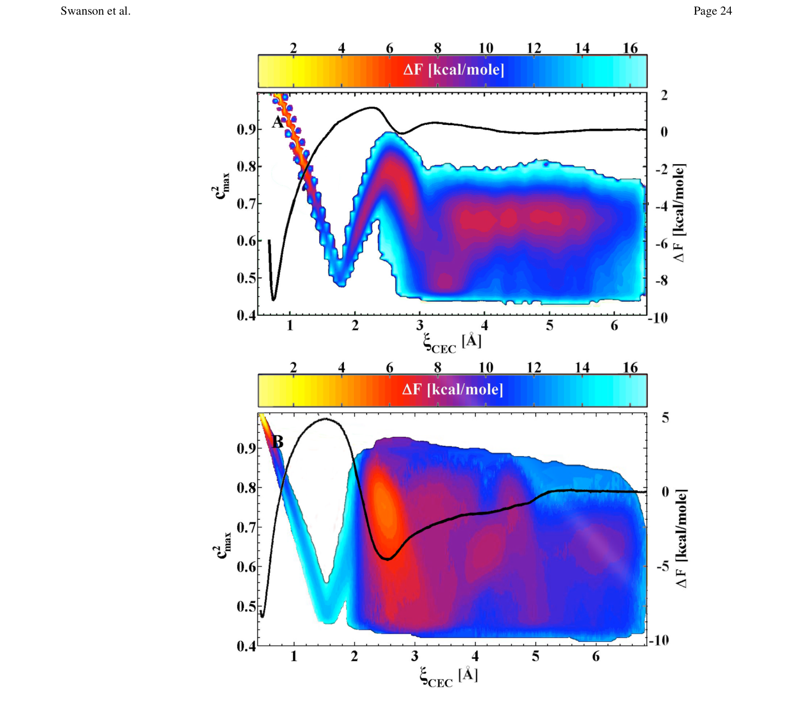
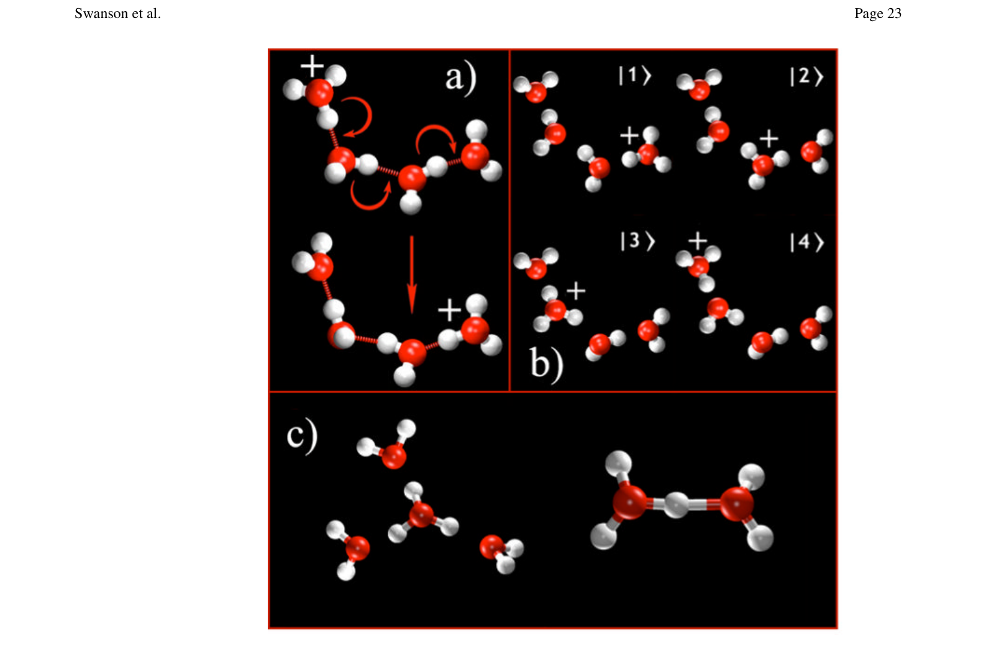
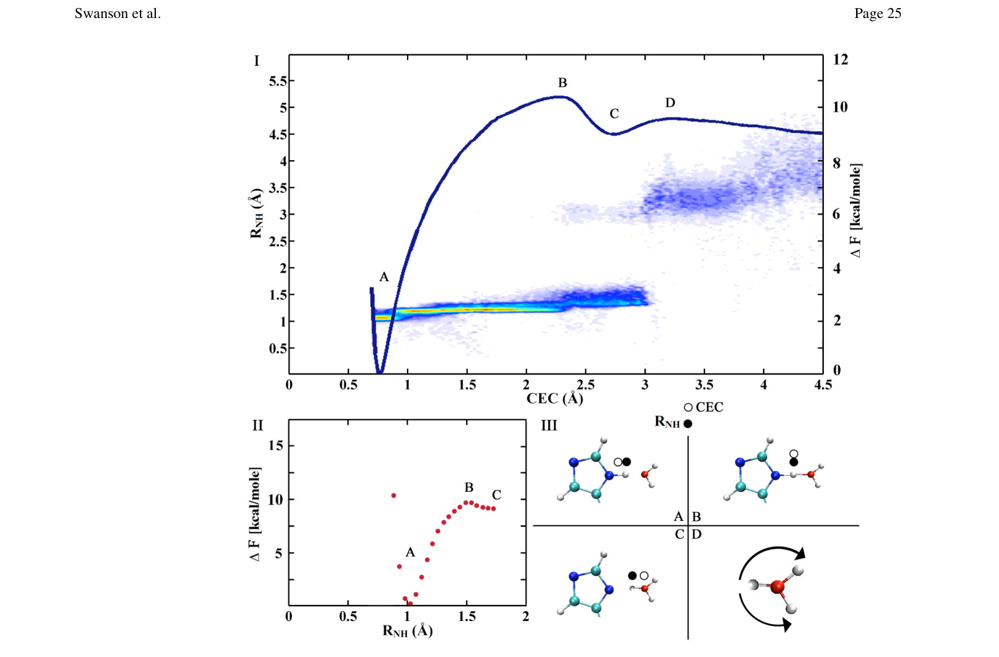
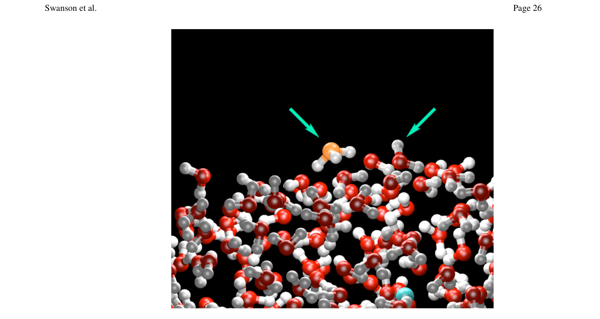
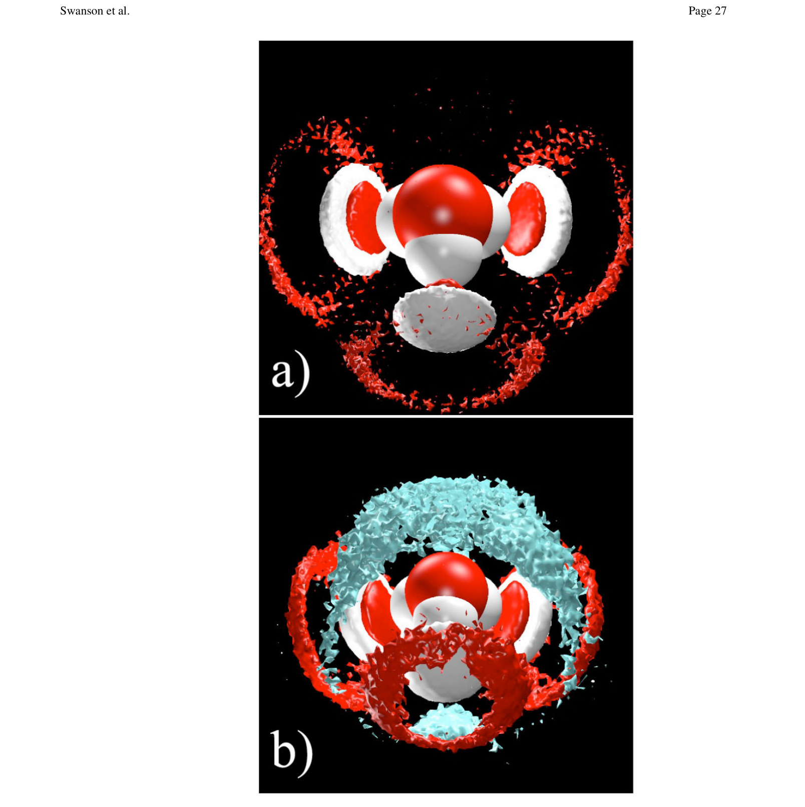
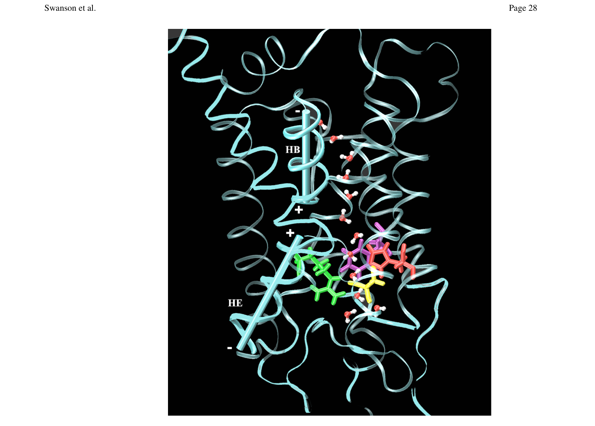
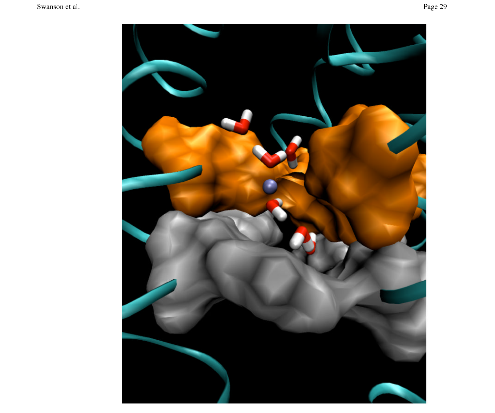
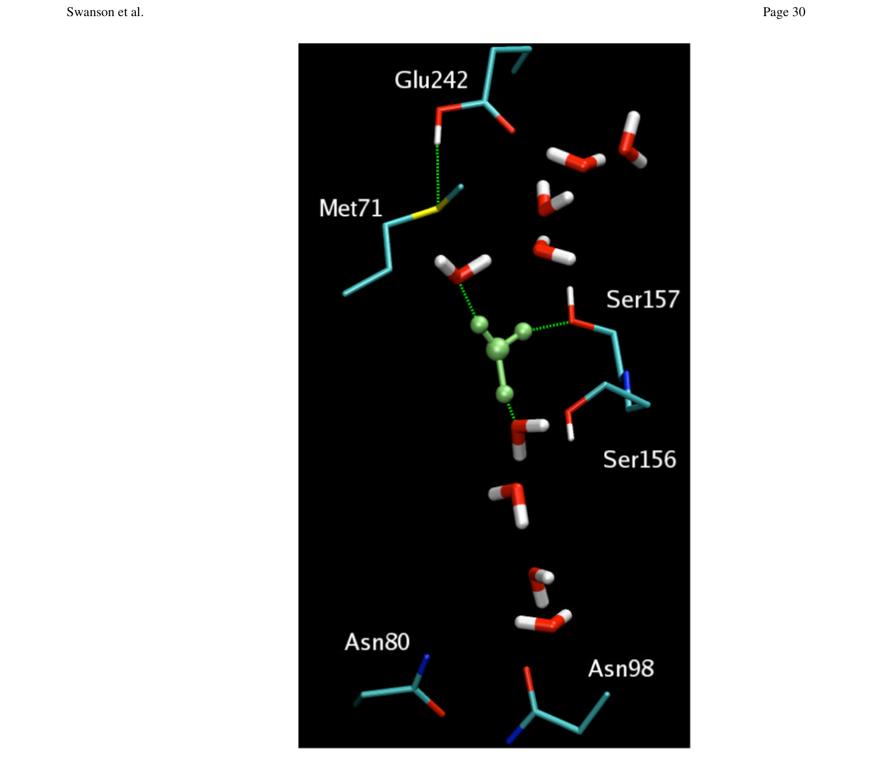

# Proton Solvation and Transport in Aqueous and Biomolecular Systems: Insights from Computer Simulations

**中文题名:** 水和生物分子系统中的质子溶剂化和传输：来自计算机模拟的见解

**Zotero key:** 86XBHE8Y
**Attachment key:** VMT8RUA9
**Journal:** The Journal of Physical Chemistry B
**Date:** 2007-05-05
**DOI:** 10.1021/jp065956o
**Task date:** 2026-07-07
**Source PDF:** paper.pdf

## Why This Paper / 为什么选这篇

**English:** This paper belongs to the core proton/hydroxide transport reading thread selected for today. It helps connect microscopic solvation structure, hydrogen-bond rearrangement, and anomalous ion mobility in water.

**中文:** 这篇文献属于今天选定的质子/氢氧根传输核心阅读线索。它有助于把微观溶剂化结构、氢键重排以及水中离子的反常迁移率联系起来。

## Reading Guide / 读前导读

**English:** Read it by asking three questions: what structural motif carries the charge, what hydrogen-bond rearrangement enables transfer, and which observable or simulation coordinate supports the proposed mechanism.

**中文:** 阅读时抓住三个问题：电荷到底由什么结构单元承载，哪类氢键重排使转移成为可能，以及作者用哪种实验观测或模拟坐标支撑该机制。

## Terminology / 术语表

| English | 中文 | Note |
| --- | --- | --- |
| hydrated proton | 水合质子 | 通常指水中过量质子及其溶剂化结构 |
| hydroxide ion | 氢氧根离子 | OH-，在水中通过结构扩散和普通扩散共同迁移 |
| Grotthuss mechanism | Grotthuss 机制 | 通过氢键网络重排实现的质子/缺质子迁移 |
| proton transfer | 质子转移 | 常缩写为 PT |
| hydrogen-bond network | 氢键网络 | 决定水中离子溶剂化和传输通道 |
| potential of mean force | 平均力势 | 常用于表示反应坐标上的自由能剖面 |

## Full Bilingual Reader / 全文逐段中英对照

**Source:** p.1 S001

**Original:** Proton Solvation and Transport in Aqueous and Biomolecular

**中文:** 水和生物分子中的质子溶剂化和传输

**Source:** p.1 S002

**Original:** Jessica M. J. Swanson, C. Mark Maupin, Hanning Chen, Matt K. Petersen, Jiancong Xu, Yujie Wu, and Gregory A. Voth*

**中文:** Jessica M. J. Swanson、C. Mark Maupin、Hanning Chen、Matt K. Petersen、Jiangong Xu、Yujie Wu 和 Gregory A. Voth*

**Source:** p.1 S003

**Original:** Center for Biophysical Modeling and Simulation and Department of Chemistry, University of Utah, 315 S. 1400 E., Rm 2020, Salt Lake City, Utah, 84112-0850

**中文:** 犹他大学生物物理建模与模拟中心和化学系，315 S. 1400 E.，Rm 2020，盐湖城，犹他州，84112-0850

**Source:** p.1 S004

**Original:** NIH Public Access Author Manuscript J Phys Chem B. Author manuscript; available in PMC 2008 September 23.

**中文:** NIH 公共获取作者手稿 J Phys Chem B。作者手稿；于 PMC 2008 9 月 23 日发布。

**Source:** p.1 S005

**Original:** Published in final edited form as: J Phys Chem B. 2007 May 3; 111(17): 4300-4314. doi:10.1021/jp070104x.

**中文:** 以最终编辑形式出版：J Phys Chem B. 2007 年 5 月 3 日； 111(17)：4300-4314。 doi：10.1021/jp070104x。

**Source:** p.1 S006

**Original:** NIH-PA Author Manuscript NIH-PA Author Manuscript NIH-PA Author Manuscript

**中文:** NIH-PA 作者手稿 NIH-PA 作者手稿 NIH-PA 作者手稿

**Source:** p.1 S007

**Original:** Systems:

**中文:** 系统：

**Source:** p.1 S008

**Original:** Insights from Computer Simulations

**中文:** 计算机模拟的见解

**Source:** p.1 S009

**Original:** Abstract

**中文:** 抽象的

**Source:** p.1 S010

**Original:** Keywords

**中文:** 关键词

**Source:** p.1 S011

**Original:** charge transport; proton solvation; bioenergetics; MS-EVB; Grotthuss shuttling

**中文:** 电荷传输；质子溶剂化；生物能量学； MS-EVB；格罗萨斯穿梭

**Source:** p.1 S012

**Original:** INTRODUCTION

**中文:** 介绍

**Source:** p.1 S013

**Original:** The solvation structure and high mobility of excess protons in liquid water is a critically important phenomenon in numerous chemical and biological processes. Protons play a key role in acid-base reactions, enzyme catalysis, and many forms of energy transfer and conversion in biomolecules and complex materials. For these reasons, the mechanism of proton solvation and transport (PS&T) has been the focus of scientific exploration for over two centuries. The most recognized foundational theory was presented by the Lithuanian scientist C. von Grotthuss, who first postulated that charged bodies are transferred through water by hopping from molecule to molecule.1 This mechanism, still referred to as "Grotthuss shuttling", has been significantly modified since that time. It is now appreciated that the protonic charge is transferred from the hydronium ion (H3O+) to surrounding water molecules via the rearrangement of covalent and hydrogen-bonds (h-bonds), thus resulting in structural diffusion that can be much faster than conventional diffusion under the proper conditions (e.g., along quasi-one-dimensional "water wires" in proteins).

**中文:** 液态水中过量质子的溶剂化结构和高迁移率是许多化学和生物过程中至关重要的现象。质子在酸碱反应、酶催化以及生物分子和复杂材料中多种形式的能量转移和转换中发挥着关键作用。由于这些原因，两个多世纪以来，质子溶剂化和传输（PS＆T）机制一直是科学探索的焦点。最受认可的基础理论是由立陶宛科学家 C. von Grotthuss 提出的，他首先假设带电体通过在水中从一个分子跳跃到另一个分子来转移。1 这种机制仍然被称为“Grotthuss 穿梭”，自那时以来已经进行了重大修改。现在人们认识到，质子电荷通过共价键和氢键（h键）的重排从水合氢离子（H3O+）转移到周围的水分子，从而导致在适当条件下（例如，沿着蛋白质中的准一维“水线”）比传统扩散快得多的结构扩散。

**Source:** p.1 S014

**Original:** This shuttling mechanism also seems to explain why protons are significantly more mobile than other solvated cations of similar charge and size in aqueous media.

**中文:** 这种穿梭机制似乎也解释了为什么质子在水介质中比其他具有相似电荷和大小的溶剂化阳离子具有更高的移动性。

**Source:** p.1 S015

**Original:** *To whom correspondence should be addressed: Gregory A. Voth, E-mail: voth@chem.utah.edu

**中文:** *通信收件人：Gregory A. Voth，电子邮件：voth@chem.utah.edu

**Source:** p.1 S016

**Original:** The excess proton in aqueous media plays a pivotal role in many fundamental chemical (e.g., acidbase chemistry) and biological (e.g., bioenergetics and enzyme catalysis) processes. Understanding the hydrated proton is, therefore, crucial for chemistry, biology, and materials sciences. Although well studied for over 200 years, excess proton solvation and transport remains to this day mysterious, surprising, and perhaps even misunderstood. In this feature article various efforts to address this problem through computer modeling and simulation will be described. Applications of computer simulations to a number of important and interesting systems will be presented, highlighting the roles of charge delocalization and Grotthuss shuttling, a phenomenon unique in many ways to the excess proton in water.

**中文:** 水介质中的过量质子在许多基础化学（例如酸碱化学）和生物（例如生物能学和酶催化）过程中发挥着关键作用。因此，了解水合质子对于化学、生物学和材料科学至关重要。尽管人们对过量的质子溶剂化和传输进行了 200 多年的深入研究，但迄今为止，它仍然是神秘的、令人惊讶的，甚至可能被误解。在这篇专题文章中，将描述通过计算机建模和模拟来解决这个问题的各种努力。将介绍计算机模拟在许多重要且有趣的系统中的应用，强调电荷离域和格罗萨斯穿梭的作用，这是水中过量质子在许多方面独特的现象。

**Source:** p.2 S017

**Original:** Although numerous theoretical and experimental efforts have synergistically and significantly advanced our understanding of PS&T over the last three decades, they have frequently provided conflicting and even contradictory conclusions. Indeed, we have yet to identify a complete and conclusive microscopic picture of the solvation and transport of excess protons in aqueous systems. This challenge will not likely be solved by experiment alone, but rather by computational simulations benchmarked against experimental results. It is within this context that the present feature article has been cast.

**中文:** 尽管在过去的三十年里，大量的理论和实验工作协同并显着地促进了我们对 PS&T 的理解，但它们经常提供相互矛盾甚至矛盾的结论。事实上，我们尚未确定水系统中过量质子的溶剂化和传输的完整且结论性的微观图景。这一挑战不太可能仅通过实验来解决，而是通过以实验结果为基准的计算模拟来解决。本专题文章正是在这种背景下诞生的。

**Source:** p.2 S018

**Original:** NIH-PA Author Manuscript NIH-PA Author Manuscript NIH-PA Author Manuscript

**中文:** NIH-PA 作者手稿 NIH-PA 作者手稿 NIH-PA 作者手稿

**Source:** p.2 S019

**Original:** PS&T is one of the most challenging molecular processes to study through computer simulation for several reasons. First, it involves a chemical bonding topology that is dynamically rearranging, i.e. covalent and h-bonds are continuously formed and broken (cf. Fig. 1a). Second, the proton is light enough that quantum effects such as tunneling and zero-point energy contributions, might affect the mechanism of transfer. Third, the proton does not exist as a single "hydronium cation" (H3O+, cf. Fig 1b), as is commonly taught in high school chemistry, but as a protonic charge that is delocalized over multiple water molecules and shuttled by numerous hydrogen nuclei. Thus, the identity of the protonic charge is constantly changing, predominantly in the form of either an Eigen (H9O4+) or Zundel cation (H5O2+) surrounded by a dynamically rearranging network of h-bonded water molecules (cf. Fig. 1c). The electrostatic interactions of the "excess proton" with its water environment therefore defy traditional solvation models for ions in polar media.

**中文:** 由于多种原因，PS&T 是通过计算机模拟研究的最具挑战性的分子过程之一。首先，它涉及动态重排的化学键拓扑，即共价键和氢键不断形成和断裂（参见图1a）。其次，质子足够轻，以至于隧道效应和零点能量贡献等量子效应可能会影响转移机制。第三，质子并不像高中化学中通常教授的那样以单个“水合氢阳离子”（H3O+，参见图 1b）的形式存在，而是以质子电荷的形式存在，该质子电荷在多个水分子上离域并由许多氢核穿梭。因此，质子电荷的身份不断变化，主要以本征 (H9O4+) 或 Zundel 阳离子 (H5O2+) 的形式被氢键水分子的动态重排网络包围（参见图 1c）。因此，“过量质子”与其水环境的静电相互作用违背了极性介质中离子的传统溶剂化模型。

**Source:** p.2 S020

**Original:** Despite these challenges, computer simulations can play an important, even critical, role in determining the mechanism of PS&T. However, as with any computer simulation approach, care must be taken to ensure that as much of the relevant physics is represented in the modeling as possible, including an accurate and physically complete potential energy surface.

**中文:** 尽管存在这些挑战，计算机模拟在确定 PS&T 机制方面仍可以发挥重要甚至关键的作用。然而，与任何计算机模拟方法一样，必须注意确保在建模中尽可能多地表示相关物理现象，包括准确且物理上完整的势能表面。

**Source:** p.2 S021

**Original:** A variety of computational approaches have been presented to study PS&T. They range from pure quantum mechanical treatment of the system via ab initio molecular dynamics (MD), to mixed quantum/classical dynamics approaches, to empirical force field MD simulations, and even to non-deterministic, stochastic methods. In this article we will review how theory and computational simulations have contributed to our understanding of PS&T in aqueous and biomolecular systems, primarily focusing on our group's long-standing efforts2-37 to develop the multi-state empirical valence bond (MS-EVB) formalism. A number of aqueous and biomolecular systems will be described, including PS&T in bulk water,4-14 in aqueous weak acids,15-17 at the water liquid-vapor interface,18 in protonated water clusters,19-21 in wateralcohol mixtures,22 in water-filled hydrophobic channels23, in synthetic ion channels,24,25

**中文:** 已经提出了多种计算方法来研究 PS&T。它们的范围从通过从头开始分子动力学 (MD) 对系统进行纯量子力学处理，到混合量子/经典动力学方法，到经验力场 MD 模拟，甚至到非确定性随机方法。在本文中，我们将回顾理论和计算模拟如何有助于我们理解水性和生物分子系统中的 PS&T，主要关注我们小组为开发多态经验价键 (MS-EVB) 形式主义而做出的长期努力2-37。将描述许多水性和生物分子系统，包括散装水中的 PS&T、4-14 水性弱酸、15-17 水液-蒸汽界面、18 质子化水簇、19-21 水醇混合物、22 充满水的疏水通道23、合成离子通道24,25

**Source:** p.2 S022

**Original:** at the water/lipid bilayer interface,26 through lipid bilayers,27,28 in large transmembrane biomolecular proton channels29-37 such as the aquaporin channels33-35 and the M2 channel in influenza A,29-32 and finally in enzymes such as carbonic anhydrase and cytochrome c oxidase.36,37 Most of the aforementioned computational studies have relied upon experimental data for their development and validation. Since space limitations do not allow us to discuss them herein, we refer the reader to relevant reviews and literature on several related topics, including the experimental analysis of PS&T;38 PS&T in complex materials, such as Nafion™, for which there are very high acid concentrations;39,40 and "pProton transfer" reactions in which the proton exchanges between donor and acceptor groups.41-43

**中文:** 在水/脂质双层界面，26通过脂质双层，27,28在大型跨膜生物分子质子通道29-37中，例如水通道蛋白通道33-35和甲型流感中的M2通道，29-32，最后在碳酸酐酶和细胞色素c氧化酶等酶中。36,37大多数上述计算研究都依赖于实验数据来进行开发和验证。由于篇幅限制，我们无法在本文中讨论它们，因此我们请读者参考几个相关主题的相关评论和文献，包括 PS&T 的实验分析；38 PS&T 在复杂材料中的实验分析，例如 Nafion™，其酸浓度非常高；39,40 以及供体和受体基团之间进行质子交换的“p质子转移”反应。 41-43

**Source:** p.2 S023

**Original:** COMPUTATIONAL METHODOLOGIES

**中文:** 计算方法

**Source:** p.2 S024

**Original:** The most important component in a computer simulation of PS&T is a physically complete and accurate potential energy function for the system, especially given the fact that the Grotthuss shuttling involves the constant rearrangement of the chemical bonding topology (cf. Fig. 1a). If an accurate potential energy function is in hand, both the dynamics (e.g., selfdiffusion) and free energies (e.g., solvation free energies or free energy barriers to proton transport) can be calculated from the dynamical simulations using deterministic (Newtonian)

**中文:** PS&T 计算机模拟中最重要的组成部分是系统的物理上完整且准确的势能函数，特别是考虑到 Grotthuss 穿梭涉及化学键拓扑的不断重排（参见图 1a）。如果掌握了准确的势能函数，则可以使用确定性（牛顿）从动力学模拟中计算动力学（例如自扩散）和自由能（例如溶剂化自由能或质子传输的自由能势垒）

**Source:** p.2 S025

**Original:** J Phys Chem B. Author manuscript; available in PMC 2008 September 23.

**中文:** J Phys Chem B. 作者手稿；于 PMC 2008 9 月 23 日发布。

**Source:** p.3 S026

**Original:** equations of motion subject to the proper ensemble constraints such as constant temperature, pressure, etc.. Replacing all-atom, deterministic MD with more phenomenological approximations (e.g., dielectric continuum models, stochastic dynamics, etc.), can introduce uncontrolled errors. Similarly, inadequate sampling in the MD or an intrinsically inaccurate or incomplete potential energy function can also introduce errors, although these errors are generally more controllable (via improved simulation statistics, potential energy function refinement, etc.). With this perspective in mind the MS-EVB approach that has been extensively developed and utilized in our group will be described along with other PS&T computer simulation approaches.

**中文:** 运动方程受到适当的系综约束，例如恒定的温度、压力等。用更多唯象近似（例如，介电连续体模型、随机动力学等）代替全原子、确定性MD，可能会引入不受控制的误差。类似地，MD 中的不充分采样或本质上不准确或不完整的势能函数也可能引入误差，尽管这些误差通常更可控（通过改进的模拟统计、势能函数细化等）。考虑到这一点，我们小组已广泛开发和使用的 MS-EVB 方法将与其他 PS&T 计算机模拟方法一起进行描述。

**Source:** p.3 S027

**Original:** NIH-PA Author Manuscript NIH-PA Author Manuscript NIH-PA Author Manuscript

**中文:** NIH-PA 作者手稿 NIH-PA 作者手稿 NIH-PA 作者手稿

**Source:** p.3 S028

**Original:** The Multi-State Empirical Valence Bond (MS-EVB) Method

**中文:** 多态经验价键 (MS-EVB) 方法

**Source:** p.3 S029

**Original:** In the MS-EVB method PS&T can be simulated explicitly by evolving the system on a reactive potential energy surface defined by a linear combination of multiple diabatic potentials. This reactive potential energy surface enables the formation and cleavage of molecular bonds in a deterministic classical MD simulation. Each of the diabatic potentials represents one possible protonation configuration, or a limiting "state" of the system. Thus, in the full MS-EVB potential the proton is represented as a protonic charge delocalized over multiple molecules surrounded by dynamically rearranging h-bonds and transferred by dynamically rearranging covalent bonds (i.e., the Grotthuss PT mechanism). The sum of states composes the basis states in an overall "Hamiltonian" matrix. Empirical potentials are used for the diagonal elements which describe the bonded and non-bonded interactions for a bonding topology. The offdiagonal elements allow for transitions between states as a function of the instantaneous nuclear configurations. Figure 1b shows the MS-EVB states necessary to model a proton shuttle through a short water wire.

**中文:** 在 MS-EVB 方法中，可以通过在由多个非绝热势的线性组合定义的无功势能表面上演化系统来显式模拟 PS&T。这种反应势能表面能够在确定性经典 MD 模拟中形成和裂解分子键。每个非绝热势代表一种可能的质子化构型，或系统的限制“状态”。因此，在完整的 MS-EVB 电势中，质子表示为在多个分子上离域的质子电荷，这些分子被动态重排的氢键包围，并通过动态重排的共价键进行转移（即 Grotthuss PT 机制）。状态之和构成了整体“哈密尔顿”矩阵中的基础状态。经验势用于对角元素，描述键合拓扑的键合和非键合相互作用。非对角元素允许状态之间的转变作为瞬时核构型的函数。图 1b 显示了模拟通过短水线的质子穿梭机所需的 MS-EVB 状态。

**Source:** p.3 S030

**Original:** In the bulk liquid phase, many states are necessary (as many as 20-30 in order to describe the first three solvation shells of a hydronium ion) and their identities must be allowed to change dynamically in time. Each state contains all of the molecules of the condensed phase system and has the proton bonded to a different water molecule. During an MS-EVB MD simulation, the Hamiltonian matrix is diagonalized and the lowest eigenfunctions are determined at each time-step. The forces on the nuclei are calculated using the Hellmann-Feynman theorem for the lowest state then and fed into an MD integrator such as Velocity Verlet. Thus the resulting MD trajectory explicitly includes the excess proton delocalization and shuttling through the water molecules.

**中文:** 在本体液相中，许多状态是必要的（多达 20-30 个状态才能描述水合氢离子的前三个溶剂化壳层），并且必须允许它们的特性随时间动态变化。每个状态都包含凝聚相系统的所有分子，并且质子与不同的水分子键合。在 MS-EVB MD 模拟期间，哈密顿矩阵被对角化，并在每个时间步确定最低特征函数。使用最低状态的赫尔曼-费曼定理计算原子核上的力，并将其输入 MD 积分器（例如 Velocity Verlet）。因此，所得的 MD 轨迹明确包括过量的质子离域和穿过水分子的穿梭。

**Source:** p.3 S031

**Original:** The MS-EVB parameters, which form the diagonal and off-diagonal matrix elements, are generally chosen to be compatible with molecular mechanics force fields such as AMBER and CHARMM. They have been optimized to accurately reproduce binding energies and pProton transfer barriers calculated with high level ab initio methods,5,6,11 as well as structural, transport, and spectroscopic properties of the proton in bulk water,5-11,13 including nuclear quantum effects.6,8 At any time-step in the simulation the protonic charge is defined by the

**中文:** 形成对角线和非对角线矩阵元素的 MS-EVB 参数通常选择与 AMBER 和 CHARMM 等分子力学力场兼容。它们经过优化，可准确再现使用高水平从头计算方法计算的结合能和 p质子转移势垒 5,6,11 以及散装水中质子的结构、传输和光谱特性，5-11,13 包括核量子效应。6,8 在模拟中的任何时间步骤，质子电荷由下式定义：

**Source:** p.3 S032

**Original:** ground state MS-EVB vector of state coefficients,

**中文:** 基态 MS-EVB 状态系数向量，

**Source:** p.3 S033

**Original:** , reflecting the delocalization of the excess charge over the h-bond network and the weights of the N-different

**中文:** ，反映了h键网络上多余电荷的离域性和N-不同的权重

**Source:** p.3 S034

**Original:** EVB states given by the amplitudes,

**中文:** EVB 状态由振幅给出，

**Source:** p.3 S035

**Original:** . The process of PS&T in an MS-EVB simulation is characterized by the constant and dynamically evolving redistribution of these amplitudes, as a function of the propagation of the nuclear coordinates. The distribution of the first (largest)

**中文:** 。 MS-EVB 模拟中的 PS&T 过程的特点是这些振幅不断且动态演变的重新分布，作为核坐标传播的函数。第一个（最大）的分布

**Source:** p.3 S036

**Original:** MS-EVB amplitude,

**中文:** MS-EVB 幅度，

**Source:** p.3 S037

**Original:** , in bulk water is usually bimodal, with a maximum at

**中文:** ，散装水通常是双峰的，最大值为

**Source:** p.3 S038

**Original:** , is somewhat less thermodynamically stable than the Eigen in bulk water in the present version of the MS-EVB potential,11 in agreement with other theoretical predictions.44 The effective spatial position of the excess proton can be defined as the center of excess charge (CEC) of the MS-EVB complex:11

**中文:** ，在当前版本的 MS-EVB 势中，热力学稳定性比散装水中的本征稍低，11 与其他理论预测一致。44 过量质子的有效空间位置可以定义为 MS-EVB 复合体的过量电荷中心 (CEC)：11

**Source:** p.3 S039

**Original:** J Phys Chem B. Author manuscript; available in PMC 2008 September 23.

**中文:** J Phys Chem B. 作者手稿；于 PMC 2008 9 月 23 日发布。

**Source:** p.4 S040

**Original:** NIH-PA Author Manuscript NIH-PA Author Manuscript NIH-PA Author Manuscript

**中文:** NIH-PA 作者手稿 NIH-PA 作者手稿 NIH-PA 作者手稿

**Source:** p.4 S041

**Original:** where ri(t) is the center of charge vector of the hydronium in the ith MS-EVB state at time t. The (classical and non-Grotthuss-shuttling) hydronium ion is represented as a simple limit of the MS-EVB model corresponding to a single (1×1) diagonal element of the MS-EVB Hamiltonian. Throughout this article the terms "proton" and "hydronium" stand for the center of excess charge of the full MS-EVB model and the single state MS-EVB model (the "classical" hydronium cation), respectively.

**中文:** 其中 ri(t) 是水合氢在时间 t 处第 i 个 MS-EVB 态的电荷矢量中心。 （经典和非 Grotthuss 穿梭）水合氢离子表示为 MS-EVB 模型的简单极限，对应于 MS-EVB 哈密顿量的单个 (1×1) 对角元素。在本文中，术语“质子”和“水合氢离子”分别代表完整 MS-EVB 模型和单态 MS-EVB 模型（“经典”水合氢阳离子）的过量电荷中心。

**Source:** p.4 S042

**Original:** Within any MD simulation methodology it is important to give careful consideration to the actual target of the calculation. Proton transport over long length and time scales is quite different from simpler kinetic pProton transfer processes; it can involve numerous free energy barriers and subtle dynamical effects, such as h-bond network rearrangements in aqueous solution or long time scale protein conformational changes in a biomolecular environment. For systems in which there is a large free energy barrier influencing proton transport, the simulation may also involve the calculation of the potential of mean force for the excess protonic charge (which is, as described earlier, characterized as a function of the center of excess charge coordinate in the MS-EVB model). The potential of mean force, in essence, provides a picture of the free energy landscape sampled by an ensemble of excess protons as they diffuse through a confined space such as a proton channel. However, the potential of mean force alone is not always enough to determine the true transport behavior of the excess protonic charge.

**中文:** 在任何 MD 模拟方法中，仔细考虑计算的实际目标非常重要。长距离和时间尺度上的质子传输与更简单的动力学p质子传输过程有很大不同。它可能涉及大量的自由能垒和微妙的动力学效应，例如水溶液中的氢键网络重排或生物分子环境中的长期蛋白质构象变化。对于存在影响质子输运的大自由能垒的系统，模拟还可能涉及计算过量质子电荷的平均力势（如前所述，其特征为 MS-EVB 模型中过量电荷坐标中心的函数）。平均力的势本质上提供了一幅由过量质子在质子通道等有限空间扩散时采样的自由能景观的图片。然而，仅平均力的潜力并不总是足以确定过量质子电荷的真实输运行为。

**Source:** p.4 S043

**Original:** In some cases, the self-diffusion constant of the excess proton must be evaluated explicitly in addition to the potential of mean force to calculate the overall proton conductance.34,35

**中文:** 在某些情况下，除了计算总体质子电导的平均力的潜力之外，还必须明确评估过量质子的自扩散常数。 34,35

**Source:** p.4 S044

**Original:** It is important to describe how the MS-EVB methodology relates to the work of other researchers. The original Empirical Valence Bond (EVB) method was developed by Warshel and co-workers.42,43,45,46 The EVB approach was in many ways a pioneering development in molecular simulation because it allowed for reactive processes to be described by a relatively simple empirical potential energy function. The original EVB method employs an insightful interpolation scheme that utilizes the concept of a superposition state in quantum mechanics. The EVB approach was developed in order to study proton and hydride transfer in enzymes, as well as electron transfer reactions. Generally these applications require only a few diabatic basis states in the EVB parameterization and the identity of those states is fixed with the molecular frame of the donor and acceptor species (and perhaps a few intervening water molecules).

**中文:** 描述 MS-EVB 方法与其他研究人员的工作之间的关系非常重要。最初的经验价键 (EVB) 方法是由 Warshel 及其同事开发的。42,43,45,46 EVB 方法在许多方面都是分子模拟领域的开创性发展，因为它允许通过相对简单的经验势能函数来描述反应过程。最初的 EVB 方法采用了一种富有洞察力的插值方案，该方案利用了量子力学中叠加态的概念。 EVB 方法的开发是为了研究酶中的质子和氢化物转移以及电子转移反应。一般来说，这些应用在 EVB 参数化中只需要一些非绝热基态，并且这些状态的特性由供体和受体物种（可能还有一些中间水分子）的分子框架固定。

**Source:** p.4 S045

**Original:** By contrast, the MS-EVB approach represents an extensive generalization of these ideas to describe PS&T over much longer distances, involving Grotthuss shuttling through many moving (diffusing) water molecules and also possibly through ionizable molecular groups such as amino acids. A critical element of the MS-EVB approach is that the identity of the states included in the MS-EVB complex is constantly changing during the simulation. These states are selected by virtue of a rather intricate state-searching algorithm in order to ensure as much continuity in the molecular forces as possible, which in turn helps to ensure good energy conservation in the MD simulation so that the trajectory generates a reliable ensemble average of dynamical observables. This essential dynamically rearranging multi-state feature of the MS-EVB method allows the critical process of molecular diffusion to be included in the MSEVB methodology.

**中文:** 相比之下，MS-EVB 方法代表了这些想法的广泛概括，用于描述更长距离的 PS&T，包括 Grotthuss 穿梭于许多移动（扩散）的水分子，也可能穿过可电离的分子组，如氨基酸。 MS-EVB 方法的一个关键要素是 MS-EVB 复合体中包含的状态标识在仿真过程中不断变化。这些状态是通过相当复杂的状态搜索算法来选择的，以确保分子力尽可能多的连续性，这反过来又有助于确保 MD 模拟中良好的能量守恒，从而使轨迹生成可靠的动态可观测量的系综平均值。 MS-EVB 方法的这种重要的动态重排多态特征使得分子扩散的关键过程能够包含在 MSEVB 方法中。

**Source:** p.4 S046

**Original:** Including the physics of diffusion, in addition to Grotthuss shuttling, was essential to the development of an empirical simulation methodology for proton transport processes, as opposed to simpler pProton transfer reactions between a fixed donor and acceptor group. The interplay between molecular diffusion and Grotthuss proton shuttling is indeed

**中文:** 除了格罗特胡斯穿梭之外，包括扩散物理学对于开发质子传输过程的经验模拟方法至关重要，这与固定供体和受体基团之间更简单的质子转移反应相反。分子扩散和格罗萨斯质子穿梭之间的相互作用确实是

**Source:** p.4 S047

**Original:** J Phys Chem B. Author manuscript; available in PMC 2008 September 23.

**中文:** J Phys Chem B. 作者手稿；于 PMC 2008 9 月 23 日发布。

**Source:** p.5 S048

**Original:** critical for understanding the process of PS&T in aqueous and more complex physical and biomolecular systems.

**中文:** 对于理解水性和更复杂的物理和生物分子系统中的 PS&T 过程至关重要。

**Source:** p.5 S049

**Original:** It should also be appreciated that Vuilleumier and Borgis47-51 independently developed their own multi-state model for the excess proton in bulk water. Both this and our MS-EVB model are derived from the original 2-state EVB model for the excess proton in water of Lobaugh and Voth.4 However, there are important differences between the Vuilleumier and Borgis model and MS-EVB, particularly in the treatment of the off-diagonal matrix elements, the state selection algorithm, and the ability to conserve energy (the latter being related to the multistate selection algorithm, which is at the heart of the MS-EVB methodology). The second generation MS-EVB model (denoted MS-EVB2)11 and its underlying multi-state algorithm has significantly expanded upon some of the initial MS-EVB concepts, and the third generation model (soon to be published) will continue along this path of refinement. It should be also noted that Laria et al.52 have recently used the MS-EVB model to study protons in supercritical water and found that their simulations were in agreement with several experimental results.

**中文:** 还应该理解的是，Vuilleumier 和 Borgis47-51 独立开发了他们自己的散装水中过量质子的多态模型。该模型和我们的 MS-EVB 模型均源自 Lobaugh 和 Voth 的水中过量质子的原始 2 态 EVB 模型。4 然而，Vuilleumier 和 Borgis 模型与 MS-EVB 之间存在重要差异，特别是在非对角矩阵元素的处理、状态选择算法和节能能力方面（后者与多态选择算法相关，这是 MS-EVB 方法的核心）。第二代 MS-EVB 模型（表示为 MS-EVB2）11 及其底层多状态算法在一些初始 MS-EVB 概念的基础上进行了显着扩展，第三代模型（即将发布）将继续沿着这条改进之路发展。还应该指出的是，Laria 等人 52 最近使用 MS-EVB 模型研究了超临界水中的质子，发现他们的模拟与几个实验结果一致。

**Source:** p.5 S050

**Original:** NIH-PA Author Manuscript NIH-PA Author Manuscript NIH-PA Author Manuscript

**中文:** NIH-PA 作者手稿 NIH-PA 作者手稿 NIH-PA 作者手稿

**Source:** p.5 S051

**Original:** Other Simulation Approaches for Proton Solvation and Transport

**中文:** 质子溶解和传输的其他模拟方法

**Source:** p.5 S052

**Original:** Parrinello and collaborators53-60 have used the Car-Parrinello MD method to study the excess proton in water and other systems. In this approach, the electronic structure at the level of gradient-corrected density functional theory (DFT) is solved simultaneously with the nuclear dynamics. Ab initio MD approaches such as Car-Parrinello MD can describe the chemical bonding rearrangements that occur in the Grotthuss mechanism, and potentially offer the attractive reduction in the uncertainties and hard work involved in developing a more empirical potential such as the MS-EVB model. They suffer, however, from very high computational cost, which limits all ab initio MD simulations to rather small system sizes (on the order of 100 water molecules or less) and short simulation times (tens of ps). The computer simulation of proton transport, especially in biomolecular systems, can require as much as hundreds of nanoseconds of MD simulation time, for systems involving tens of thousands of atoms.

**中文:** Parrinello 和合作者 53-60 使用 Car-Parrinello MD 方法研究水和其他系统中的过量质子。在这种方法中，梯度校正密度泛函理论（DFT）水平的电子结构与核动力学同时求解。 Car-Parrinello MD 等从头开始 MD 方法可以描述 Grotthuss 机制中发生的化学键重排，并有可能减少不确定性，并减少开发更具经验潜力（例如 MS-EVB 模型）所需的艰苦工作。然而，它们的计算成本非常高，这将所有从头开始 MD 模拟限制在相当小的系统尺寸（大约 100 个水分子或更少）和较短的模拟时间（数十 ps）。对于涉及数万个原子的系统，质子输运的计算机模拟，尤其是在生物分子系统中，可能需要长达数百纳秒的 MD 模拟时间。

**Source:** p.5 S053

**Original:** However, the so-called quantum mechanics/molecular mechanics (QM/MM) implementation of Car-Parrinello MD61 promises to make that methodology more relevant to complex systems provided the underlying electronic structure is of sufficient accuracy (see below).

**中文:** 然而，Car-Parrinello MD61 的所谓量子力学/分子力学 (QM/MM) 实现有望使该方法与复杂系统更加相关，前提是底层电子结构具有足够的精度（见下文）。

**Source:** p.5 S054

**Original:** A second concern in Car-Parrinello MD simulations of PS&T is the accuracy of the underlying electronic DFT used in such simulations. As an example, recent work14,62-64 has suggested that the simple Generalized Gradient Approximation (GGA) DFT required by the CarParrinello MD method may give poor structural and dynamical results for the underlying liquid water solvent, contrary to the reports of earlier simulations in the literature. In general, the CarParrinello MD water for the widely used Becke-Lee-Yang-Parr (BLYP) and Perdew-BurkeErnzerhof (PBE) functional is too highly structured and slowly diffusing. It should be noted that these ab initio MD results on pure water have recently been called into question65 through a Car-Parrinello MD simulation with the BLYP functional utilizing a "complete" basis set, as opposed to the incomplete plane-wave basis set used in all earlier Car-Parrinello MD simulations of aqueous systems. This latter paper reports what appears to be improved water structural properties in the complete basis set limit (namely a oxygen-oxygen radial distribution function in better agreement with experiment).

**中文:** PS&T 的 Car-Parrinello MD 模拟的第二个问题是此类模拟中使用的基础电子 DFT 的准确性。例如，最近的工作 14,62-64 表明，CarParrinello MD 方法所需的简单广义梯度近似 (GGA) DFT 可能会为基础液态水溶剂提供较差的结构和动力学结果，这与文献中早期模拟的报告相反。一般来说，广泛使用的 Becke-Lee-Yang-Parr (BLYP) 和 Perdew-BurkeErnzerhof (PBE) 泛函的 CarParrinello MD 水的结构太高且扩散缓慢。应该指出的是，这些纯水从头开始的 MD 结果最近通过使用“完整”基组的 BLYP 函数进行 Car-Parrinello MD 模拟而受到质疑 65，而不是在所有早期的水系统 Car-Parrinello MD 模拟中使用的不完整平面波基组。后一篇论文报告了在完整基组极限下似乎改善的水结构特性（即与实验更好地一致的氧-氧径向分布函数）。

**Source:** p.5 S055

**Original:** However, no water self-diffusion data was reported. Moreover, given that GGA-DFT has been known for some time to be fairly inaccurate for pProton transfer barriers for gas phase Zundel cations with various fixed oxygen-oxygen distances,66 it seems unclear to what degree these functionals can be trusted to provide accurate proton hopping barriers in the more complex condensed phase environment of liquid water or solvated biomolecules. Indeed, it has been shown that the spurious (overly structured and slowly diffusing) properties of liquid water in GGA-DFT Car-Parrinello MD simulations, especially for the commonly used BLYP functional, can translate into a rather poor description

**中文:** 然而，没有报道水自扩散数据。此外，鉴于一段时间以来，GGA-DFT 已知对于具有各种固定氧-氧距离的气相 Zundel 阳离子的 p 质子转移势垒相当不准确，66 似乎不清楚这些泛函在多大程度上可以在液态水或溶剂化生物分子的更复杂的凝聚相环境中提供准确的质子跳跃势垒。事实上，已经表明，GGA-DFT Car-Parrinello MD 模拟中液态水的虚假（过度结构化和缓慢扩散）特性，特别是对于常用的 BLYP 泛函，可能会转化为相当糟糕的描述

**Source:** p.5 S056

**Original:** J Phys Chem B. Author manuscript; available in PMC 2008 September 23.

**中文:** J Phys Chem B. 作者手稿；于 PMC 2008 9 月 23 日发布。

**Source:** p.6 S057

**Original:** of the excess proton diffusion rate.14 A different recent report60 suggested a faster proton diffusion rate in BLYP-level Car-Parrinello MD simulations, attributing the difference to a more complete equilibration of the Car-Parrinello MD water simulation, although these results have not yet been reproduced by other researchers. Yet another prediction, made with ab initio MD combined with quasi-chemical theory,62 was that the Zundel cation is substantially more stable than the Eigen cation in liquid water at 300K, a prediction which is at odds with theoretical predictions44 as well as other ab initio MD and empirical (e.g., MS-EVB) simulations. It seems, therefore, that there are some issues of reproducibility and accuracy in ab initio MD simulations that remain to be resolved. An important future challenge for both electronic structure theory and ab initio MD methods will be the accurate and statistically reliable simulation of liquid water, both with and without excess protons.

**中文:** 14 最近的另一份报告60表明，BLYP 级 Car-Parrinello MD 模拟中的质子扩散速率更快，将差异归因于 Car-Parrinello MD 水模拟的更完全平衡，尽管其他研究人员尚未重现这些结果。另一项利用从头MD结合准化学理论62做出的预测是，Zundel阳离子在300K的液态水中比本征阳离子更加稳定，这一预测与理论预测44以及其他从头MD和经验（例如MS-EVB）模拟不一致。因此，从头开始 MD 模拟似乎存在一些有待解决的再现性和准确性问题。电子结构理论和从头开始 MD 方法的一个重要未来挑战将是对液态水进行精确且统计上可靠的模拟，无论是否有多余的质子。

**Source:** p.6 S058

**Original:** NIH-PA Author Manuscript NIH-PA Author Manuscript NIH-PA Author Manuscript

**中文:** NIH-PA 作者手稿 NIH-PA 作者手稿 NIH-PA 作者手稿

**Source:** p.6 S059

**Original:** The inherent challenges in the "pure" ab initio MD simulation of PS&T have not deterred researchers from developing a number of mixed QM/MM approaches to the problem.61,67, 68 In such methods there is an ab initio quantum mechanical (QM) region embedded in a much larger empirical molecular mechanics (MM) environment. Space limitations do not allow us to delve into these methods in detail, but in short they could offer a solution to the "size issue" for ab initio MD simulations of PS&T in some complex systems (e.g., proteins in which the excess proton is solvated and transported in a fairly small region such as bacteriorhodopsin68).

**中文:** PS&T 的“纯”从头开始 MD 模拟的固有挑战并没有阻止研究人员开发多种混合 QM/MM 方法来解决该问题。 61,67, 68 在这些方法中，有一个从头开始量子力学 (QM) 区域嵌入在更大的经验分子力学 (MM) 环境中。空间限制不允许我们详细研究这些方法，但简而言之，它们可以为某些复杂系统中 PS&T 的从头 MD 模拟的“尺寸问题”提供解决方案（例如，过量质子在相当小的区域中被溶剂化和运输的蛋白质，如细菌视紫红质 68）。

**Source:** p.6 S060

**Original:** The computational demands of the QM calculation in such systems are still formidable, so researchers have also sought more semi-empirical solutions for the QM calculation, e.g., a semi empirical DFT QM/MM approach based on the self-consistent charge density functional tight binding (SCC-DFTB) method.67 It should be noted though that QM/ MM approaches are still challenged by the issue of the overall accuracy of the underlying electronic structure calculation and, in the case of a semiempirical approach, the accuracy of the additional parameterizations inherent in that level of electronic structure theory. 69 Another significant challenge for QM/MM approaches to PS&T is that in true proton transport problems there is a significant contribution from water diffusion, which greatly complicates the definition and treatment of the boundary region between the QM and MM regions (i.e., waters can diffuse from one region to the other and thus must somehow be "switched" from a QM water to an MM water or vice versa).

**中文:** 此类系统中 QM 计算的计算需求仍然巨大，因此研究人员还为 QM 计算寻求更多的半经验解决方案，例如基于自洽电荷密度功能紧束缚（SCC-DFTB）方法的半经验 DFT QM/MM 方法。 67 应该指出的是，QM/MM 方法仍然受到基础电子结构计算的整体准确性问题的挑战，在半经验方法的情况下，该级别电子结构理论中固有的附加参数化的准确性。 69 PS&T 的 QM/MM 方法的另一个重大挑战是，在真正的质子输运问题中，水扩散起着很大的作用，这使得 QM 和 MM 区域之间边界区域的定义和处理变得非常复杂（即，水可以从一个区域扩散到另一个区域，因此必须以某种方式从 QM 水“切换”到 MM 水，反之亦然）。

**Source:** p.6 S061

**Original:** In light of these complications, it remains to be seen if ab initio MD or OM/MM approaches offer any real advantage over more empirical MD modeling. Nevertheless, if these complications can be resolved our understanding of PS&T will certainly benefit from more "first principles" analyses. One example of this might be the recent prediction of "proton hole" (i.e., hHydroxide) migration being favored over more standard Grotthuss proton shuttling in the active site of the enzyme carbonic anhydrase.70 The inherent inaccuracies in the semi-empirical DFT approach used to make this prediction appear to undermine its reliability in the absence of any confirming experimental results. However, it is an intriguing prediction nevertheless and highlights the need for greater predictive accuracy in QM/MM approaches for PS&T in complex systems.

**中文:** 鉴于这些复杂性，从头开始的 MD 或 OM/MM 方法是否比更多的经验 MD 模型具有真正的优势还有待观察。然而，如果这些复杂问题能够得到解决，我们对 PS&T 的理解肯定会受益于更多的“第一原理”分析。其中一个例子可能是最近对碳酸酐酶活性位点中“质子空穴”（即 hHydroxy）迁移的预测比更标准的 Grotthuss 质子穿梭更受青睐。 70 用于做出这一预测的半经验 DFT 方法固有的不准确性似乎在没有任何证实的实验结果的情况下破坏了其可靠性。然而，这仍然是一个有趣的预测，并强调复杂系统中 PS&T 的 QM/MM 方法需要更高的预测准确性。

**Source:** p.6 S062

**Original:** Empirical modeling of PS&T is also, however, not without its potential pitfalls. In some PS&T simulation studies (e.g., Ref. 71,72) the PM6 model73 for the excess proton in water has been utilized. While appealing in some ways, this model has proven to be qualitatively inaccurate in describing PS&T bulk water and quantitatively inaccurate for proton hopping barriers in protonated water chains.35 Other approaches74,75 to simulate PS&T may be best described as approximations to a full multi-state MS-EVB methodology. In these approaches two EVBlike states are used to transfer an excess proton between two water molecules and then these two states are somehow moved along to the next proton hopping step. However, because they do not contain the full symmetry of the proton solvation process in water, these approaches tend to overemphasize the population of the Zundel cation;76 more recent results suggest that this leads to an incomplete description of the physics of the PS&T process.11,39 All of these

**中文:** 然而，PS&T 的经验建模也并非没有潜在的缺陷。在一些 PS&T 模拟研究（例如，参考文献 71,72）中，已经利用了水中过量质子的 PM6 模型73。虽然该模型在某些方面很有吸引力，但事实证明，该模型在描述 PS&T 散装水方面在质量上不准确，在质子化水链中的质子跳跃势垒方面在数量上不准确。35 模拟 PS&T 的其他方法74,75 可能最好描述为完整的多状态 MS-EVB 方法的近似值。在这些方法中，两个类似 EVB 的状态用于在两个水分子之间转移多余的质子，然后这两个状态以某种方式移动到下一个质子跳跃步骤。然而，由于它们不包含水中质子溶剂化过程的完全对称性，这些方法往往过分强调 Zundel 阳离子的数量；76 最近的结果表明，这导致对 PS&T 过程的物理描述不完整。 11,39 所有这些

**Source:** p.6 S063

**Original:** J Phys Chem B. Author manuscript; available in PMC 2008 September 23.

**中文:** J Phys Chem B. 作者手稿；于 PMC 2008 9 月 23 日发布。

**Source:** p.7 S064

**Original:** alternative empirical MD approaches have nevertheless proven to be useful in the study of certain aspects of PS&T and thus contributed to our overall understanding of this phenomenon.

**中文:** 然而，替代的经验 MD 方法已被证明在 PS&T 某些方面的研究中是有用的，从而有助于我们对这一现象的整体理解。

**Source:** p.7 S065

**Original:** Another approach to simulating PS&T is the Q-HOP model,77 which employs a stochastic hopping algorithm to describe the proton shuttling process. Stochastic algorithms are not deterministic, meaning that the dynamics are not directly derived from an underlying potential energy function in the form of Newton's equations. It is therefore difficult to associate actual physical interactions with the underlying stochastic proton hopping dynamics, and several other assumptions must be made in order to define the stochastic proton hopping probability. Consequently, additional systematic errors may be introduced into the simulation results. Despite these shortcomings the Q-HOP method may be appealing to some researchers because it is fast and easy to implement in a simulation context. A more phenomenological stochastic approach for describing proton transport via a Monte Carlo algorithm has also recently been developed within the context of the enzyme and proton pump cytochrome c oxidase.78

**中文:** 另一种模拟 PS&T 的方法是 Q-HOP 模型，77 它采用随机跳跃算法来描述质子穿梭过程。随机算法不是确定性的，这意味着动力学不是直接从牛顿方程形式的潜在势能函数导出的。因此，很难将实际的物理相互作用与潜在的随机质子跳跃动力学联系起来，并且必须做出几个其他假设才能定义随机质子跳跃概率。因此，额外的系统误差可能会引入到模拟结果中。尽管存在这些缺点，Q-HOP 方法可能对一些研究人员有吸引力，因为它在模拟环境中快速且易于实现。最近还在酶和质子泵细胞色素 c 氧化酶的背景下开发了一种通过蒙特卡罗算法描述质子传输的更现象学随机方法。 78

**Source:** p.7 S066

**Original:** NIH-PA Author Manuscript NIH-PA Author Manuscript NIH-PA Author Manuscript

**中文:** NIH-PA 作者手稿 NIH-PA 作者手稿 NIH-PA 作者手稿

**Source:** p.7 S067

**Original:** In light of the methodological advances described in this section (and their potential pitfalls) for simulating PS&T, the following sections will highlight selected results for a number of interesting and challenging systems. These results will be largely taken from a body of work using the MS-EVB simulation methodology.2-37 In general, the objective in this body of work has been to study realistic systems for sufficiently long MD simulation times (tens to hundreds of nanoseconds) to calculate statistically converged structural and dynamical properties. Many interesting and sometimes unexpected results have been obtained, as summarized below. It is likely, however, that some of these results may require updating and even revision in the future as increasingly accurate versions of the overall PS&T simulation methodology become available (e.g., in the underlying MS-EVB method, ab initio MD approaches, protein force fields, altogether new methods, etc.).

**中文:** 鉴于本节中描述的用于模拟 PS&T 的方法进展（及其潜在陷阱），以下各节将重点介绍一些有趣且具有挑战性的系统的选定结果。这些结果主要取自使用 MS-EVB 模拟方法的大量工作。2-37 一般来说，这项工作的目标是研究现实系统足够长的 MD 模拟时间（数十到数百纳秒），以计算统计上收敛的结构和动力学特性。已经获得了许多有趣的、有时是意想不到的结果，总结如下。然而，随着整体 PS&T 模拟方法的版本越来越准确（例如，在基础 MS-EVB 方法、从头开始 MD 方法、蛋白质力场、全新方法等中），其中一些结果可能需要在未来更新甚至修订。

**Source:** p.7 S068

**Original:** PS&T IN BULK WATER

**中文:** 散装水中的 PS&T

**Source:** p.7 S069

**Original:** It is not only intrinsically interesting but also a crucial test of accuracy for simulation models to study PS&T in bulk water before moving on to more complex systems. This has been a central point of validation for the MS-EVB methodology. To a reasonable degree of accuracy, the model reproduces the self-diffusion properties for the hydrated proton6,9, predicts a solvation structure composed of a roughly 65:35 mixture of the Eigen and Zundel cations5

**中文:** 在转向更复杂的系统之前，研究散装水中的 PS&T 不仅本质上很有趣，而且也是对模拟模型准确性的关键测试。这是 MS-EVB 方法验证的中心点。该模型以合理的准确度重现了水合质子的自扩散特性6,9，预测了由大约 65:35 的 Eigen 和 Zundel 阳离子混合物组成的溶剂化结构5

**Source:** p.7 S070

**Original:** (which can be modified to some degree by nuclear quantum effects6,8), reproduces infrared spectroscopy results10, reproduces the activation energy for the excess proton self-diffusion constant, and agrees with the observed deuterium isotope effects.8 In the second-generation MS-EVB2 model a more advanced EVB state selection algorithm was introduced to improve energy conservation, which is also a crucial point of physical validation. Although the numerical value of the self-diffusion constant from MS-EVB classical MD simulations is below the experimental result, quantizing the MS-EVB model with quantum path integral simulations increases the excess proton diffusion rate such that it is in reasonable agreement with experiment.6-8 Accounting for quantum effects must therefore correct the very small deviation in the PT activation barrier, lowering it from 2.7 kcal/mol in classical simulations such that it is closer to the experimental value of 2.5 kcal/mol. However, despite its demonstrated successes for simulating PS&T in bulk water, the MS-EVB model can and should be refined, as will be briefly discussed at the end of this article.

**中文:** （可以通过核量子效应在一定程度上进行修改6,8），再现红外光谱结果10，再现过量质子自扩散常数的活化能，并且与观测到的氘同位素效应一致。8在第二代MS-EVB2模型中，引入了更先进的EVB状态选择算法来提高能量守恒，这也是物理验证的关键点。尽管 MS-EVB 经典 MD 模拟的自扩散常数数值低于实验结果，但通过量子路径积分模拟对 MS-EVB 模型进行量化会增加过量质子扩散速率，从而与实验结果合理一致。6-8 因此，考虑量子效应必须纠正 PT 激活势垒中非常小的偏差，将其从经典模拟中的 2.7 kcal/mol 降低，使其更接近实验值 2.5 kcal/mol。然而，尽管 MS-EVB 模型在模拟散装水中的 PS&T 方面取得了成功，但它可以而且应该进行改进，正如本文末尾将简要讨论的那样。

**Source:** p.7 S071

**Original:** Once a simulation can reasonably reproduce these important experimental observables, i.e. the excess proton diffusion rate, spectroscopy, and activation energy, one can begin to address the question of the mechanism for Grotthuss-assisted diffusion in bulk water. In 1995, Agmon79 proposed a mechanism in which the h-bond being donated to the acceptor water molecule must first be broken before the proton is transferred (donor to acceptor via an Eigen-

**中文:** 一旦模拟能够合理地再现这些重要的实验观测值，即过量质子扩散速率、光谱和活化能，我们就可以开始解决体水中格罗萨斯辅助扩散的机制问题。 1995年，Agmon79提出了一种机制，其中在质子转移之前必须首先破坏被提供给受体水分子的氢键（通过本征-供体到受体）

**Source:** p.7 S072

**Original:** J Phys Chem B. Author manuscript; available in PMC 2008 September 23.

**中文:** J Phys Chem B. 作者手稿；于 PMC 2008 9 月 23 日发布。

**Source:** p.8 S073

**Original:** Zundel-Eigen interconversion), and a new h-bond is finally formed with the donor water molecule that the proton leaves behind. According to this "Moses mechanism", so coined due to its analogy to Moses parting the Red Sea, the rate limiting step to PT should be cleavage of the acceptor water molecule's h-bond, and the coordination numbers of the 1st solvation shell water molecule and the hydronium cation should be approximately four and three, respectively. Early Car-Parrinello MD studies proposed a Zundel-Zundel transition mechanism,53 but more recent simulations have supported the Eigen-Zundel-Eigen interconversion in the Moses mechanism.55,56 (although the validity of these results may be influenced by the previously discussed concerns over the accuracy of Car-Parrinello MD for liquid water and the limited statistics available from those simulations).

**中文:** Zundel-Eigen 互变），最终与质子留下的供体水分子形成新的氢键。根据这种因类似于摩西分开红海而创造的“摩西机制”，PT 的速率限制步骤应该是受体水分子的氢键的裂解，并且第一溶剂化层水分子和水合氢阳离子的配位数应分别约为 4 和 3。早期的 Car-Parrinello MD 研究提出了 Zundel-Zundel 转换机制，53 但最近的模拟支持了 Moses 机制中的 Eigen-Zundel-Eigen 相互转换。 55,56 （尽管这些结果的有效性可能受到之前讨论的 Car-Parrinello MD 对液态水的准确性的影响以及这些模拟中可用的有限统计数据的影响）。

**Source:** p.8 S074

**Original:** NIH-PA Author Manuscript NIH-PA Author Manuscript NIH-PA Author Manuscript

**中文:** NIH-PA 作者手稿 NIH-PA 作者手稿 NIH-PA 作者手稿

**Source:** p.8 S075

**Original:** By contrast, some experimental results suggest that 1st solvation-shell waters do not have a coordination number of four, as predicted by the Moses mechanism, but form stronger h-bonds with cations than other water molecules.80 Moreover, extensive MS-EVB simulations lasting multiple nanoseconds indicate that 1st solvent-shell water molecules have coordination numbers that are not bulk-like (∼ 4) but closer to 3.6.9,11,50 Thus, the h-bond being donated to the 1st shell acceptor water molecule is unfavorable 40% of the time, suggesting that its cleavage might not be rate limiting as predicted by the Moses mechanism. In 2005 Lapid et al.

**中文:** 相比之下，一些实验结果表明，第一溶剂化层水分子的配位数并不像摩西机制所预测的那样为 4，而是与阳离子形成比其他水分子更强的氢键。 80 此外，持续数纳秒的广泛 MS-EVB 模拟表明，第一溶剂化层水分子的配位数不是块状的 (∼ 4)，而是更接近 3.6.9,11,50 因此，氢键被捐赠给第一壳受体水分子有 40% 的时间是不利的，这表明它的裂解可能不会像摩西机制所预测的那样受到速率限制。 2005 年，拉皮德等人。

**Source:** p.8 S076

**Original:** 13 extended a Pauling bond order analysis to analyze tens of nanoseconds of MS-EVB2 simulation trajectory data and found evidence for a significantly more complicated bulk water PT mechanism that, in agreement with work by Ohmine and Saito,81 involves collective motion of clusters of water molecules that extend beyond the 1st solvation shell.13 In this mechanism PT is preceded by cleavage of h-bonds donated from the acceptor water molecule, which are favorable, and formation of those donated to the donor water molecule, which are unfavorable. Some number of these h-bonds must remain broken in order to disrupt the 3-fold solvation symmetry around the hydronium ion and induce pProton transfer. Although each hbond formation or cleavage event is fast (50-150 fs), they occur in a collective manner. The activation energy of transfer should be related to this collective process and, not surprisingly, its experimentally measured value is close to the strength of the collective rearrangement of h-bonding in liquid water (2.6 kcal/mol), a quantity which is often incorrectly described as the strength of a single h-bond.

**中文:** 13 扩展了鲍林键级分析以分析数十纳秒的 MS-EVB2 模拟轨迹数据，并发现了明显更复杂的大量水 PT 机制的证据，与 Ohmine 和 Saito 的工作一致，81 涉及延伸到第一个溶剂化壳之外的水分子簇的集体运动。 13 在这种机制中，PT 之前是从受体水分子捐赠的氢键（这是有利的），并形成捐赠给供体的氢键。水分子，这是不利的。为了破坏水合氢离子周围的三重溶剂化对称性并诱导 p质子转移，一些氢键必须保持断裂状态。尽管每个 hbond 形成或裂解事件都很快（50-150 fs），但它们以集体方式发生。转移活化能应该与这个集体过程有关，毫不奇怪，其实验测量值接近液态水中氢键集体重排的强度（2.6 kcal/mol），这个量经常被错误地描述为单个氢键的强度。

**Source:** p.8 S077

**Original:** An important distinction between this latter PT mechanism and the original Moses mechanism is that PT is driven by the collective breaking of h-bonds as opposed to a single h-bond cleavage. Although this mechanism shows agreement with some available experimental results, it can be argued that the precise mechanism for the excess proton mobility in bulk water is still an unresolved question. Its ultimate resolution will require further studies, using increasingly accurate simulation models and statistical analysis, in conjunction with additional experimental measurements.

**中文:** 后一种 PT 机制与最初的 Moses 机制之间的一个重要区别是，PT 是由氢键的集体断裂驱动的，而不是单个氢键断裂。尽管该机制与一些现有的实验结果一致，但可以认为，大量水中过量质子迁移率的精确机制仍然是一个未解决的问题。其最终分辨率需要进一步研究，使用越来越精确的模拟模型和统计分析，并结合额外的实验测量。

**Source:** p.8 S078

**Original:** WEAK ACID IONIZATION AND PROTONATABLE RESIDUES

**中文:** 弱酸电离和可质子化残留物

**Source:** p.8 S079

**Original:** Weak acids play an essential role in both chemical and biological systems. In fact almost every biological system involves ionizable residues, such as glutamate or histidine, that must be modeled as proton donors and acceptors. To this end the MS-EVB methodology with an additional state representing the protonated residue and Car-Parrinello MD simulations have been used to evaluate the ionization of biologically relevant moieties. One interesting facet now demonstrated by both approaches is the formation of a metastable contact ion pair upon the deprotonation of an acidic residue. This is in agreement with and extends the earlier work of Ando and Hynes82,83 who used ab initio quantum calculations along with Monte Carlo simulations to map out the preliminary stages of acid dissociation for HCl, a acid strong enough to form a stable contact ion pair, and HF, a weaker acid that must overcome a significant barrier to form a metastable contact ion pair.

**中文:** 弱酸在化学和生物系统中都发挥着重要作用。事实上，几乎每个生物系统都涉及可电离的残基，例如谷氨酸或组氨酸，必须将其建模为质子供体和受体。为此，使用代表质子化残基的附加状态的 MS-EVB 方法和 Car-Parrinello MD 模拟来评估生物相关部分的电离。现在两种方法都证明了一个有趣的方面是在酸性残基去质子化时形成亚稳态接触离子对。这与 Ando 和 Hynes82,83 的早期工作一致并扩展了他们的工作，他们使用从头开始量子计算和蒙特卡罗模拟来绘制 HCl 酸解离的初步阶段，HCl 是一种强到足以形成稳定接触离子对的酸，而 HF 是一种较弱的酸，必须克服一个重要的障碍才能形成亚稳态接触离子对。

**Source:** p.8 S080

**Original:** Similarly, a metastable contact ion pair was reported for glutamic acid with an MS-EVB study that clearly identified the stabilized proton acceptor as an Eigen cation.17 More recently a Car-Parrinello MD study84 of acetic acid (the small

**中文:** 同样，通过 MS-EVB 研究报告了谷氨酸的亚稳态接触离子对，该研究清楚地将稳定的质子受体识别为本征阳离子。 17 最近，Car-Parrinello MD 研究84 乙酸（小

**Source:** p.8 S081

**Original:** J Phys Chem B. Author manuscript; available in PMC 2008 September 23.

**中文:** J Phys Chem B. 作者手稿；于 PMC 2008 9 月 23 日发布。

**Source:** p.9 S082

**Original:** molecule analogue of glutamic acid) identified the formation of a transient contact ion pair upon acid deprotonation. However, the precise identity of the contact cation (i.e., an Eigen cation versus a "free hydronium", as referred to in the latter work) was unclear, as was the statistical significance of the contact ion pair due to Car-Parrinello MD sampling limitations. MS-EVB studies have also previously shown that moieties such as imidazole16 and histidine, 17 although they lack a formal charge upon deprotonation, can form a stabilized Eigen cation in the first solvation shell.

**中文:** 谷氨酸的分子类似物）鉴定出酸去质子化时瞬态接触离子对的形成。然而，接触阳离子（即本征阳离子与“游离水合氢”，如后一工作中提到的）的精确身份尚不清楚，由于 Car-Parrinello MD 采样限制，接触离子对的统计显着性也不清楚。 MS-EVB 研究此前还表明，咪唑 16 和组氨酸 17 等部分尽管在去质子化时缺乏形式电荷，但可以在第一个溶剂化壳层中形成稳定的本征阳离子。

**Source:** p.9 S083

**Original:** NIH-PA Author Manuscript NIH-PA Author Manuscript NIH-PA Author Manuscript

**中文:** NIH-PA 作者手稿 NIH-PA 作者手稿 NIH-PA 作者手稿

### Figure 2

**Placed near:** p.9 S083  
**Source:** p.9 F001

**Original caption:** Figure 2 shows the potential of mean forces (free energy profiles) for the deprotonation of histidine and glutamic acid as a function of the distance of the excess proton center of excess charge from the histidine nitrogen or glutamic acid oxygen, respectively. The deep minimum in these potential of mean force curves corresponds to the protonated acid, while the second shallower minimum corresponds to the stabilized Eigen cation in a contact ion pair with the conjugate base moiety. Also shown in Fig. 2 is the value of the square of the maximum EVB state amplitude, which in general reflects the nature of the hydrated proton for a particular environment as described earlier, as a function of the acid dissociation coordinate. The behavior of the maximum EVB state amplitude squared is quite complex (i.e., there are a variety of dominant states) during the acid deprotonation. In particular, the excess proton first transitions from a protonated acid to a mixed (50-50%) state between an acceptor water molecule and the conjugate base of the acid. Then, it proceeds through a more hydronium-like localized species at the top of the potential of mean force free energy barrier, to the Eigen-conjugate base contact ion pair, and finally to the solvent-separated hydrated proton having the typical bulk-like mixture of Eigen and Zundel cation character, the former being somewhat more dominant.

**中文图注:** 图2显示了组氨酸和谷氨酸去质子化的平均力（自由能曲线）分别作为过量电荷的过量质子中心距组氨酸氮或谷氨酸氧的距离的函数。这些平均力曲线电势中的深最小值对应于质子化酸，而第二个浅最小值对应于与共轭碱基部分的接触离子对中的稳定本征阳离子。图 2 中还显示了最大 EVB 态振幅的平方值，该值通常反映了特定环境下水合质子的性质（如前所述），作为酸解离坐标的函数。在酸去质子化过程中，最大 EVB 态振幅平方的行为相当复杂（即存在多种主导态）。特别是，过量的质子首先从质子化酸转变为受体水分子和酸的共轭碱之间的混合（50-50%）状态。然后，它通过平均力自由能势垒势垒顶部的更像水合氢离子的局域物种，到达本征共轭碱接触离子对，最后到达溶剂分离的水合质子，具有典型的本征和 Zundel 阳离子特征的块状混合物，前者更占主导地位。

**Reading note / 读图提示:** 这张图对应正文中关于 质子溶剂化或质子转移 的证据，建议和相邻段落一起看。

**Source:** p.9 S084

**Original:** In addition to structural characterization of ionizable residues it is crucial that theoretical models be able to reproduce experimentally measurable pKa values. Both the MS-EVB17 and Car-Parrinello MD85,86 formalisms have been used to address this challenge, but the latter have focused on computing relative pKa values due to the computational expense of CarParrinello MD. Comparing the MS-EVB simulation to a recent Car-Parrinello MD analysis of the histidine pK 85a highlights some important differences between the MS-EVB and CarParrinello MD approaches. First, the Car-Parrinello MD study defined the reaction coordinate as the distance between the histidine epsilon nitrogen and the neighboring hydrogen (RNH), while the MSEVB study used the distance between the histidine epsilon nitrogen and the excess proton center of excess charge. Figure 3 shows both the MS-EVB (panel I) and Car-Parrinello MD (panel II) potential of mean forces of histidine deprotonation in terms of these respective coordinates, as well as the distribution of RNH distances (panel I) in the MS-EVB simulation for a given center of excess charge value.

**中文:** 除了可电离残基的结构表征之外，理论模型能够重现实验可测量的 pKa 值也至关重要。 MS-EVB17 和 Car-Parrinello MD85,86 形式主义都已用于解决这一挑战，但由于 CarParrinello MD 的计算费用，后者专注于计算相对 pKa 值。将 MS-EVB 模拟与最近对组氨酸 pK 85a 进行的 Car-Parrinello MD 分析进行比较，突显了 MS-EVB 和 CarParrinello MD 方法之间的一些重要差异。首先，Car-Parrinello MD研究将反应坐标定义为组氨酸ε氮和邻近氢(RNH)之间的距离，而MSEVB研究使用组氨酸ε氮和过量电荷的过量质子中心之间的距离。图 3 显示了组氨酸去质子化的平均力的 MS-EVB（图 I）和 Car-Parrinello MD（图 II）在这些各自坐标方面的潜力，以及 MS-EVB 模拟中给定的过量电荷值中心的 RNH 距离分布（图 I）。

**Source:** p.9 S085

**Original:** Although the two potential of mean forces are very similar at short distances, the bimodal distribution of RNH distances in the MS-EVB simulation suggests that the RNH reaction coordinate breaks down as the center of excess charge traverses past the first stabilized Eigen contact ion pair and continues into the bulk environment. The RNH reaction coordinate therefore can not sample the delocalized protonic charge in the stabilized first solvation shell Eigen cation or the subsequent transfer of the protonic charge via different protons into the bulk region. Thus, it cannot sample the true asymptotic solvated proton state that largely defines the value of the pKa relative to the protonated acid state. Rather, the RNH reaction coordinate likely samples the reorientation and/or diffusion of the nearest first solvation shell water, the original proton acceptor. In addition, the Car-Parrinello MD study calculated the pKa of histidine relative to that of water based on the assumption that the potential of mean force for histidine and water are equivalent past the initial pProton transfer.

**中文:** 尽管平均力的两个势在短距离上非常相似，但 MS-EVB 模拟中 RNH 距离的双峰分布表明，当过量电荷的中心穿过第一个稳定的本征接触离子对并继续进入本体环境时，RNH 反应坐标会分解。因此，RNH 反应坐标无法对稳定的第一溶剂化层本征阳离子中的离域质子电荷或随后通过不同质子将质子电荷转移到本体区域中进行采样。因此，它无法对真正的渐近溶剂化质子态进行采样，而该态在很大程度上定义了相对于质子化酸态的 pKa 值。相反，RNH 反应坐标可能采样最近的第一溶剂化层水（原始质子受体）的重新定向和/或扩散。此外，Car-Parrinello MD 研究计算了组氨酸相对于水的 pKa，其假设是组氨酸和水的平均力在初始 p质子转移后相等。

**Source:** p.9 S086

**Original:** From panel (I) of figure 3 it is evident that care must be taken in making this assumption. It should be noted, however, that the autoionization process in water has been directly studied via the Car-Parrinello MD approach combined with transition path sampling. 87

**中文:** 从图 3 的面板 (I) 可以明显看出，做出这一假设时必须小心谨慎。然而，应该指出的是，水中的自电离过程已经通过 Car-Parrinello MD 方法结合过渡路径采样直接研究。 87

**Source:** p.9 S087

**Original:** J Phys Chem B. Author manuscript; available in PMC 2008 September 23.

**中文:** J Phys Chem B. 作者手稿；于 PMC 2008 9 月 23 日发布。

**Source:** p.10 S088

**Original:** PS&T AT INTERFACES AND OTHER INHOMOGENEOUS ENVIRONMENTS

**中文:** 界面和其他不均匀环境的 PS&T

**Source:** p.10 S089

**Original:** The current body of work on acids in water illuminates the complexities and intricate nature of the dissociation of ionizable residues in bulk water, complications that will only increase in biomolecular environments. Continued careful study of the acid deprotonation event in bulk water will therefore be essential in establishing a solid foundation to evaluate the role of amino acids and other ionizable residues in PS&T in biological systems.

**中文:** 当前关于水中酸的工作揭示了散装水中可电离残留物解离的复杂性和复杂性，这种复杂性只会在生物分子环境中增加。因此，继续仔细研究散装水中的酸去质子化事件对于建立坚实的基础来评估生物系统中 PS&T 中氨基酸和其他可电离残基的作用至关重要。

**Source:** p.10 S090

**Original:** NIH-PA Author Manuscript NIH-PA Author Manuscript NIH-PA Author Manuscript

**中文:** NIH-PA 作者手稿 NIH-PA 作者手稿 NIH-PA 作者手稿

**Source:** p.10 S091

**Original:** Liquid-Vapor Interface and Protonated Water Clusters

**中文:** 液-汽界面和质子化水簇

**Source:** p.10 S092

**Original:** Recent experimental and computational developments have brought into doubt long held views of ionic solvation near the liquid/vapor interface. The conventional analysis of ion solvation near the dielectric boundary at the liquid vapor interface, first formulated by Wagner88 and later quantified by Onsager and Samaras,89 holds that ions should be expelled from the interface by the repulsive interaction with their associated image charges.

**中文:** 最近的实验和计算发展使人们对液/汽界面附近离子溶剂化的长期观点产生了怀疑。液汽界面介电边界附近离子溶剂化的传统分析首先由 Wagner88 提出，后来由 Onsager 和 Samaras 量化，89 认为离子应通过与其相关图像电荷的排斥相互作用从界面中排出。

**Source:** p.10 S093

**Original:** Recently, however, the inability to reconcile the seemingly anomalous uptake of Cl2 and Br2 gases by halide salt aerosols led Hu et al. to question this conventional view and instead propose a concentration gradient that favors these anions at the interface.90 Subsequent MD simulations have supported anion surface enhancement and further clarified that the degree of enhancement should increase with anion size and polarizability, but that cations should be repelled from the interface according to the conventional picture of ion solvation.91-95 More recently, spectroscopic investigations96-99 have indicated that specific anions are indeed present at the interface, and at greater concentration relative to the bulk.

**中文:** 然而，最近，Hu 等人无法协调卤化物盐气溶胶对 Cl2 和 Br2 气体看似异常的吸收。质疑这一传统观点，并提出有利于界面处这些阴离子的浓度梯度。90随后的MD模拟支持阴离子表面增强，并进一步阐明增强程度应随着阴离子尺寸和极化率的增加而增加，但根据离子溶剂化的传统图片，阳离子应从界面上被排斥。91-95最近，光谱研究96-99表明特定阴离子确实存在于界面处，并且相对浓度更高到批量。

**Source:** p.10 S094

**Original:** As described earlier, the nature of solvation and transport of the smallest cation, the excess proton, is fundamentally different than that of other cations.1,100,101 Nevertheless, MS-EVB simulations have predicted an enrichment of the solvated proton at the water liquid/vapor interface18 and the surface of water clusters.19-21 The apparent reason for this behavior is the highly anisotropic solvation of the hydronium cation and to a lesser degree its intrinsic polarizability, which imparts to it an "amphiphilic" character, thus causing the interfacial preference. As shown in Fig. 4 the lone pair side of the hydronium cation (left arrow in the figure) preferentially orients toward the vacuum interface so that its O-H bonds can still participate in three strong hydrogen bonds with water molecules. Thus, an increased number of dangling water O-H bonds (c.f. right arrow in Fig.

**中文:** 如前所述，最小阳离子（过量质子）的溶剂化和传输性质与其他阳离子有根本不同。1,100,101 然而，MS-EVB 模拟预测溶剂化质子会在水液/蒸汽界面18 和水簇表面富集。19-21 这种行为的明显原因是水合氢阳离子的高度各向异性溶剂化以及较小程度的其固有的溶剂化。极化性，赋予其“两亲”特性，从而导致界面偏好。如图4所示，水合氢阳离子的孤对侧（图中左箭头）优先朝向真空界面，因此其O-H键仍可参与与水分子的三个强氢键。因此，悬挂水 O-H 键的数量增加（参见图 1 中的右箭头）。

**Source:** p.10 S095

**Original:** 4) become "tied up" by the surface hydronium.18 The interfacial enrichment of excess proton has also been demonstrated for nondissociable hydronium potentials18,102 as well as ab initio MD simulations of protonated clusters.19,20 The predicted interfacial enrichment is now supported in second harmonic generation (SHG) spectroscopy103-105 and sum frequency generation (SFG) spectroscopy studies,106-113 as well as detailed thermodynamic analysis.114 It also appears to provide an explanation for the anomalous surface tension behavior of acids versus other salts105,114 and the Jones-Ray effect.105 This putative surface enrichment, assuming it stands further experimental and computational scrutiny, will likely have significant implications for atmospheric chemistry, biochemistry/biophysics, and materials science.

**中文:** 4) 被表面水合氢“束缚”。18 过量质子的界面富集也已在不可解离水合氢势 18,102 以及质子化团簇的从头开始 MD 模拟中得到证明。19,20 预测的界面富集现在也得到了二次谐波发生 (SHG) 光谱 103-105 和和频发生 (SFG) 光谱研究 106-113 的支持。 114 它似乎还为酸相对于其他盐的异常表面张力行为和琼斯雷效应提供了解释。 105 这种假定的表面富集，假设它经得起进一步的实验和计算审查，可能会对大气化学、生物化学/生物物理学和材料科学产生重大影响。

**Source:** p.10 S096

**Original:** Water-Alcohol Mixtures

**中文:** 水-醇混合物

**Source:** p.10 S097

**Original:** The previously discussed anisotropic ordering and enrichment at the liquid/vapor interface for the hydronium cation is akin in some ways to that for the small amphiphile methanol. Computer simulation115 and sum-frequency vibrational spectroscopy data116 have demonstrated a preferential ordering of methanol at the liquid/vapor interface in the neat liquid, such that the methyl groups of the interfacial molecules are directed away from the liquid into the vapor phase. Furthermore, both simulation117 and experiment118,119 of water-methanol mixtures exhibit methanol surface enrichment and the same preferential orientation of the methanol methyl groups. In light of the similar anisotropic solvation and surface enrichment exhibited

**中文:** 前面讨论的水合氢阳离子在液/气界面的各向异性排序和富集在某些方面类似于小两亲物甲醇。计算机模拟115和和频振动光谱数据116已经证明甲醇在纯液体中的液/气界面处优先排序，使得界面分子的甲基被引导远离液体进入气相。此外，水-甲醇混合物的模拟117和实验118,119都表现出甲醇表面富集和甲醇甲基的相同优先取向。鉴于相似的各向异性溶剂化和表面富集表现出

**Source:** p.10 S098

**Original:** J Phys Chem B. Author manuscript; available in PMC 2008 September 23.

**中文:** J Phys Chem B. 作者手稿；于 PMC 2008 9 月 23 日发布。

**Source:** p.11 S099

**Original:** by both methanol and the solvated proton, one would naturally ask whether the previously demonstrated hydronium amphiphile-like behavior18 extends to other mixed dielectrics, such as water-amphiphile mixtures.

**中文:** 通过甲醇和溶剂化质子，人们自然会问，先前证明的水合氢两亲物样行为18是否扩展到其他混合电介质，例如水-两亲物混合物。

**Source:** p.11 S100

**Original:** NIH-PA Author Manuscript NIH-PA Author Manuscript NIH-PA Author Manuscript

**中文:** NIH-PA 作者手稿 NIH-PA 作者手稿 NIH-PA 作者手稿

**Source:** p.11 S101

**Original:** MS-EVB simulations of methanol-water solutions of varying concentration were performed and the solvated proton was found to have a significant anisotropic association with methanol's hydrophobic methyl group.3,22 Figure 5 contrasts atomic isodensity surfaces of bulk water and water-methanol solutions surrounding the hydronium cation. As shown in panel (a), the bulk solvation of the hydronium cation is marked by a highly anisotropic solvation: the three hydrogen atoms of the hydronium ion are each strongly solvated while the hydronium lone pair region is devoid of any appreciable density. The density plots for the water-methanol solution (cf Fig. 5b) display this same anisotropic solvation about the hydronium hydrogen atoms. The lone pair region, however, is occupied by a significant distribution of methyl carbon density at a distance equivalent to that for the second water solvation shell of the cation. This anisotropic hydrophilic/hydrophobic association, first noted for the water liquid/vapor interface, apparently also applies to an amphiphile-like solvation in water-methanol solutions.

**中文:** 对不同浓度的甲醇-水溶液进行了 MS-EVB 模拟，发现溶剂化质子与甲醇的疏水性甲基具有显着的各向异性关联。3,22 图 5 对比了水合氢阳离子周围的本体水和水-甲醇溶液的原子等密度表面。如图 (a) 所示，水合氢阳离子的整体溶剂化以高度各向异性溶剂化为特征：水合氢离子的三个氢原子均被强烈溶剂化，而水合氢孤对对区域没有任何明显的密度。水-甲醇溶液的密度图（参见图5b）显示了关于水合氢原子的相同的各向异性溶剂化。然而，孤对区域被甲基碳密度的显着分布所占据，其距离相当于阳离子的第二水溶剂化壳层的距离。这种各向异性的亲水/疏水缔合首先在水液/蒸汽界面中注意到，显然也适用于水-甲醇溶液中的两亲物样溶剂化。

**Source:** p.11 S102

**Original:** The diffusion of the center of excess charge was also calculated across the range of concentrations.22 While the absolute diffusion for each concentration was smaller than measured in experiment, the diffusion trend across concentrations was accurately reproduced. As with proton diffusion in bulk water, the multiplicative correction factor is believed to largely result from a nuclear quantum correction7,8 to the classical MS-EVB simulation. It should be noted that at larger concentrations (∼90% methanol) the protonated methanol states, which were excluded in this particular MS-EVB model, might also possibly impact the diffusion rates. It is, however, unclear what effect the inclusion of the methoxonium states may have in the MS-EVB model. Recent Car-Parrinello MD studies suggest a role for the protonation of methanol at water/methanol interfaces,58 but the aforementioned concerns over the accuracy of the underlying electronic structure in these simulations remain an issue to be resolved. In addition, the absolute quantitative accuracy of the MS-EVB model for such mixtures should also be a future target for quantitative improvement.

**中文:** 还计算了整个浓度范围内过量电荷中心的扩散。22 虽然每个浓度的绝对扩散小于实验中测量的值，但可以准确地再现跨浓度的扩散趋势。与质子在大量水中的扩散一样，乘法校正因子被认为主要来自对经典 MS-EVB 模拟的核量子校正7,8。应该指出的是，在较高浓度（~90% 甲醇）下，质子化甲醇态（在该特定 MS-EVB 模型中被排除）也可能会影响扩散速率。然而，尚不清楚甲氧鎓态的包含对 MS-EVB 模型可能产生什么影响。最近的 Car-Parrinello MD 研究表明甲醇在水/甲醇界面的质子化发挥了作用，58 但上述对这些模拟中基础电子结构准确性的担忧仍然是一个有待解决的问题。此外，MS-EVB模型对此类混合物的绝对定量精度也应该是未来定量改进的目标。

**Source:** p.11 S103

**Original:** Lipid Bilayers

**中文:** 脂质双层

**Source:** p.11 S104

**Original:** One of the first applications of MS-EVB method for PS&T was to study the behavior of an excess proton at the water-phospholipid interface.26 In this work, it was found that a favorable free energy exists for "trapping" the excess proton near the phospholipid head groups in "Eigenlike" and "Zundel-like" structures formed by the excess proton, some number of water molecules, and the lipid head group(s). The simulations also revealed that protons likely permeate pure lipid bilayers in a highly concerted mechanism involving charge delocalization and Grotthuss shuttling through complicated (non-single-file) water networks, a process which is different from Grotthuss hopping through a single-file chain of water molecules. Later work28 has gone on to analyze this permeation mechanism in more detail, especially in comparison to the permeation of more "standard" cations such as Na+. Strikingly, the free energy barrier for permeation five Angstroms into the lipid bilayer is considerably lower for the excess proton than for Na+.

**中文:** MS-EVB 方法在 PS&T 中的首次应用之一是研究水-磷脂界面上过量质子的行为。 26 在这项工作中，发现存在有利的自由能，有利于在由过量质子、一定数量的水分子和脂质头基形成的“本征样”和“Zundel 样”结构中“捕获”磷脂头基附近的过量质子。模拟还表明，质子可能以高度协调的机制渗透纯脂质双层，该机制涉及电荷离域和通过复杂（非单列）水网络的格罗萨斯穿梭，这一过程不同于通过单列水分子链的格罗萨斯跳跃。后来的工作28继续更详细地分析了这种渗透机制，特别是与更多“标准”阳离子（例如Na+）的渗透进行比较。引人注目的是，过量质子渗透 5 埃进入脂质双层的自由能垒比 Na+ 低得多。

**Source:** p.11 S105

**Original:** This behavior likely translates into a substantially lower overall free energy to permeation, although the precise collective "coordinate" for this permeation process in lipid bilayers remains rather unclear. It is intriguing to consider the connection between the proton's facilitated bilayer permeation and its aforementioned "amphiphilic" character in the previous two subsections.

**中文:** 这种行为可能会转化为渗透的总体自由能显着降低，尽管脂质双层中这种渗透过程的精确集体“坐标”仍然相当不清楚。考虑质子促进的双层渗透与其前面两小节中提到的“两亲”特性之间的联系是很有趣的。

**Source:** p.11 S106

**Original:** Water-Filled Channels

**中文:** 充水通道

**Source:** p.11 S107

**Original:** Another early application of the MS-EVB model was to study PT through narrow water-filled hydrophobic channels as a function of the channel radius.23 This study revealed a significant

**中文:** MS-EVB 模型的另一个早期应用是研究通过狭窄的充满水的疏水通道的 PT 作为通道半径的函数。23 这项研究揭示了一个重要的

**Source:** p.11 S108

**Original:** J Phys Chem B. Author manuscript; available in PMC 2008 September 23.

**中文:** J Phys Chem B. 作者手稿；于 PMC 2008 9 月 23 日发布。

**Source:** p.12 S109

**Original:** enhancement of the PT rate by more than an order of magnitude when the channel becomes so narrow that only a single-file chain of water molecules can fill it (i.e., a quasi-one-dimensional "water wire" or "proton wire" is formed). Subsequently, Dellago et al.120 utilized the MSEVB and Car-Parrinello MD approaches to study PS&T through water-filled carbon nanotubes and found a similarly enhanced PT rate. For both studies, however, it should be noted that the free energy cost was not calculated for moving the excess proton from the bulk water environment into the hydrophobic channel, so the enhanced rate of diffusion within the channel may be less relevant to the overall transport process if the proton desolvation penalty at the channel's entrance is rate limiting. Indeed, the MS-EVB and other results for proton exclusion by water-filled biological aquaporin channels described later suggest that such free energy costs for the excess proton to leave the bulk water environment can be substantial (although not necessarily as large as for other cations - see the discussion the synthetic LS2 channel below).

**中文:** 当通道变得如此狭窄以至于只有单列水分子链可以填充它时（即形成准一维“水线”或“质子线”）时，PT速率会提高一个数量级以上。随后，Dellago 等人120 利用 MSEVB 和 Car-Parrinello MD 方法通过充水碳纳米管研究 PS&T，并发现类似的增强 PT 率。然而，对于这两项研究，应该指出的是，没有计算将多余的质子从大量水环境转移到疏水通道中的自由能成本，因此如果通道入口处的质子去溶剂化惩罚受到速率限制，则通道内增强的扩散速率可能与整个传输过程不太相关。事实上，MS-EVB 和稍后描述的充满水的生物水通道蛋白通道排除质子的其他结果表明，过量质子离开大量水环境的自由能量成本可能是巨大的（尽管不一定与其他阳离子一样大 - 请参阅下面的合成 LS2 通道的讨论）。

**Source:** p.12 S110

**Original:** NIH-PA Author Manuscript NIH-PA Author Manuscript NIH-PA Author Manuscript

**中文:** NIH-PA 作者手稿 NIH-PA 作者手稿 NIH-PA 作者手稿

**Source:** p.12 S111

**Original:** PS&T IN BIOMOLECULAR SYSTEMS

**中文:** 生物分子系统中的 PS&T

**Source:** p.12 S112

**Original:** Biomolecular systems have presented the most challenging and arguably important application for the MS-EVB simulation methodology to date.29-37 Here we highlight our efforts, and summarize those of others, to characterize PS&T in variety of biomolecular systems including aquaporin channels, the M2 proton channel, the enzyme carbonic anhydrase, and the proton pump cytochrome c oxidase. Many of these simulations have not only been in basic agreement with experimental results but provided new insight into the mechanism and function of PT in biology.

**中文:** 生物分子系统为 MS-EVB 模拟方法提供了迄今为止最具挑战性且可以说是最重要的应用。29-37 在这里，我们重点介绍我们的努力，并总结其他人的努力，以表征各种生物分子系统中的 PS&T，包括水通道蛋白通道、M2 质子通道、碳酸酐酶和质子泵细胞色素 C 氧化酶。其中许多模拟不仅与实验结果基本一致，而且为生物学中 PT 的机制和功能提供了新的见解。

**Source:** p.12 S113

**Original:** Aquaporin Channels

**中文:** 水通道蛋白通道

**Source:** p.12 S114

**Original:** One of the most interesting biological systems studied to date is the transmembrane water channel, aquaporin.33-35 The aquaporin channels are unique in their ability to simultaneously conduct water and block all cations, including water-hopping protons.121,122 Ion exclusion has been linked to several filtering properties, including the channel's narrow selectivity filter, a narrow region thought to block most ions due to a high desolvation penalty, and the relatively small number of carbonyl groups lining the channel's interior, which would otherwise aid ion desolvation as they do in ion channels. The mechanism of proton exclusion, however, is less clear given the excess proton's ability to delocalize and shuttle, and this topic has been the subject of much debate, especially in the area of computational analysis.

**中文:** 迄今为止研究的最有趣的生物系统之一是跨膜水通道，即水通道蛋白。33-35 水通道蛋白通道的独特之处在于其能够同时传导水和阻挡所有阳离子（包括水跳跃质子）。121,122 离子排斥与多种过滤特性有关，包括通道的窄选择性过滤器、由于高去溶剂化惩罚而被认为阻挡大多数离子的狭窄区域，以及内衬的羰基数量相对较少。通道的内部，否则将有助于离子去溶剂化，就像在离子通道中一样。然而，考虑到过量质子的离域和穿梭能力，质子排斥的机制还不太清楚，并且这个话题一直是很多争论的主题，特别是在计算分析领域。

**Source:** p.12 S115

**Original:** A variety of formalisms have been used to address this interesting phenomenon of PT blockage, including stochastic simulations,123 continuum electrostatic calculations,72 MD simulations using a dissociable empirical potential,72,124 phenomenological EVB treatments,125,126 and explicit MS-EVB MD simulations.33-35 Several of these studies have predicted that the free energy barrier to proton translocation occurs in the selectivity filter known as the Asn-Pro-Ala (NPA) motif, though the magnitude and interpretation of the origin(s) of this barrier have varied. Some have argued that the NPA region creates a bi-polar orientation in the water-file, which limits Grotthuss-like shuttling. Others argue that the barrier is electrostatic in nature from the opposing macrodipoles of two α-helices that line the channel124 or primarily caused by the channel dehydration penalty, which should peak near the NPA region.125,126

**中文:** 各种形式主义已被用来解决这种有趣的 PT 阻塞现象，包括随机模拟、123 连续静电计算、72 使用可解离经验势的 MD 模拟、72,124 现象学 EVB 处理、125,126 和显式 MS-EVB MD 模拟。 33-35 其中一些研究预测，质子易位的自由能垒发生在称为选择性过滤器的选择性过滤器中。 Asn-Pro-Ala (NPA) 基序，尽管该屏障的大小和起源的解释各不相同。一些人认为，NPA 区域在水文件中产生了双极方向，这限制了类似格罗特胡斯的穿梭。其他人认为，屏障本质上是静电，来自排列在通道上的两个 α 螺旋的相对巨偶极子124，或者主要是由通道脱水损失引起的，该损失应该在 NPA 区域附近达到峰值。 125,126

**Source:** p.12 S116

**Original:** In an effort to clarify which of these factors is the true source of proton blockage, MS-EVB2 simulations were carried out33-35 on aquaporin-1 (Aqp1), a member of the orthodox aquaporin subfamily, and the Escherichia coli glycerol facilitator (GlpF), a member of the aquaglyceroporin subfamily, as well as several mutants of Aqp1 (cf. Fig. 6).127 In one study, the permeation free-energy profiles and the maximum proton conductance were calculated for both the delocalized proton, capable of Grotthuss-like charge delocalization and shuttling, and a classical hydronium ion (H3O+).35 Surprisingly, the results indicated that proton blockage is caused by not one, but a balance of multiple factors. Moreover, the mechanism of proton

**中文:** 为了阐明这些因素中哪一个是质子阻断的真正来源，对水通道蛋白-1 (Aqp1)（传统水通道蛋白亚家族的成员）和大肠杆菌甘油促进剂 (GlpF)（水甘油通道蛋白亚家族的成员）以及 Aqp1 的几个突变体进行了 MS-EVB2 模拟33-35（参见图 1）。 6).127 在一项研究中，计算了能够进行类 Grotthuss 电荷离域和穿梭的离域质子和经典水合氢离子 (H3O+) 的渗透自由能曲线和最大质子电导。 35 令人惊讶的是，结果表明质子阻塞不是由一个因素引起的，而是由多种因素的平衡引起的。此外，质子的作用机制

**Source:** p.12 S117

**Original:** J Phys Chem B. Author manuscript; available in PMC 2008 September 23.

**中文:** J Phys Chem B. 作者手稿；于 PMC 2008 9 月 23 日发布。

**Source:** p.13 S118

**Original:** blockage for GlpF seems somewhat different from that of Aqp1. Confirming simulations on a number of mutants34 (Fig. 6) further indicated that the selectivity filter inhibits PT not only via a desolvation penalty but by direct electrostatic repulsion. The macrodipoles of two αhelices that line the channel, HB and HE, were found to be responsible for the primary free energy peak located at the NPA domain, but this barrier alone does not block the proton permeation. The MS-EVB2 simulation studies,33-35 taken together and in conjunction with the experimental mutation results,127 present a reasonably conclusive picture that the bipolar field, direct electrostatic interactions with certain amino acid residues, and the dehydration penalty for the hydrated proton to enter the channel are all important in blocking PT through aquaporin channels.

**中文:** GlpF 的阻断似​​乎与 Aqp1 的阻断有些不同。对许多突变体的模拟验证34（图6）进一步表明，选择性过滤器不仅通过去溶剂化惩罚而且通过直接静电排斥来抑制PT。研究发现，通道内的两个 α 螺旋的巨偶极子 HB 和 HE 是位于 NPA 域的主要自由能峰的原因，但仅此屏障并不能阻止质子渗透。 MS-EVB2 模拟研究，33-35 综合起来并与实验突变结果相结合，127 提出了一个合理结论性的图景，即双极场、与某些氨基酸残基的直接静电相互作用以及水合质子进入通道的脱水惩罚对于通过水通道蛋白通道阻断 PT 都很重要。

**Source:** p.13 S119

**Original:** NIH-PA Author Manuscript NIH-PA Author Manuscript NIH-PA Author Manuscript

**中文:** NIH-PA 作者手稿 NIH-PA 作者手稿 NIH-PA 作者手稿

**Source:** p.13 S120

**Original:** M2 Proton Channel in Influenza A

**中文:** 甲型流感中的 M2 质子通道

**Source:** p.13 S121

**Original:** In contrast to the proton-blocking aquaporin channels, the transmembrane M2 channel128 of the influenza A virus is highly proton-selective, conducting protons over 100-fold more efficiently than all other cations. The M2 channel is believed to play an essential role in the viral life cycle by allowing proton flux from endoplasm into virion and thus enabling the uncoating and release of the viral RNA into the host cell.129,130 Before recent mutations of the M2 channel occurred, proton transport could be efficiently blocked by the anti-flu drug amantadine.131 A substantial amount of evidence has confirmed that PT in the M2 channel is activated by low pH,132-135 and this behavior is related to the protonation of one or more of the four His37 residues (one on each monomer) that reside near the center of the channel (cf. Fig 7),134 as well as their interactions with four proximal Trp41 residues.32 Nevertheless, the exact protonation states of the His37 residues and the conformational changes associated with different His37/Trp41 adducts during channel opening are still not entirely clear.

**中文:** 与质子阻断水通道蛋白通道相比，甲型流感病毒的跨膜 M2 通道128 具有高度质子选择性，传导质子的效率比所有其他阳离子高 100 倍以上。 M2 通道被认为在病毒生命周期中发挥着重要作用，它允许质子从内质流入病毒体，从而使病毒 RNA 脱壳并释放到宿主细胞中。129,130 在 M2 通道最近发生突变之前，质子运输可以被抗流感药物金刚烷胺有效阻断。131 大量证据已证实，M2 通道中的 PT 会被低 pH 值激活，132-135 并且这种行为与相关通道中心附近的四个 His37 残基（每个单体上一个）中的一个或多个的质子化（参见图 7）134 以及它们与四个邻近的 Trp41 残基的相互作用。 32 然而，His37 残基的确切质子化状态以及通道开放期间与不同 His37/Trp41 加合物相关的构象变化仍然不完全清楚。

**Source:** p.13 S122

**Original:** Two PT mechanisms have been proposed to date: The "shuttling mechanism" suggests that PT is aided by the protonation, rotation, and deprotonation of the His37 imidazole rings,128 while the "shutter mechanism" links the protonation of His37 residues to an electrostatic repulsion that opens the previously occluded channel to the formation of a continuous water wire (cf. Fig. 7) and proton conduction.136 (Here, the phrase "protonation" of a His37 residue refers to it being doubly protonated.)

**中文:** 迄今为止，已提出两种 PT 机制：“穿梭机制”表明 PT 受到 His37 咪唑环的质子化、旋转和去质子化的帮助，128 而“快门机制”将 His37 残基的质子化与静电排斥联系起来，从而打开先前闭塞的通道，形成连续的水线（参见图 7）和质子传导。 136（这里，短语His37 残基的“质子化”是指它被双质子化。）

**Source:** p.13 S123

**Original:** To shed a light on the PT mechanism in the M2 channel, especially in the His37/Trp41 domain, an explicit proton MSEVB2 simulation was carried out on the M2 transmembrane peptide domain channel in a fully solvated dimyristoylphosphatidylcholine (DMPC) bilayer.29 This simulation showed that the proton was able to shuttle through a water wire temporarily formed in the gating His37/Trp41 domain in less than 1ns. More recently, the potential of mean force of proton permeation and the maximum ion conductance of the excess proton were calculated for all five possible His37 protonation states.135 The results from these MS-EVB2 simulations indicate that, although all of the protonation states form stable α-helix tetramers in DMPC liposome, that with three protonated His37 residues has a substantially lower PT free energy barrier than the other protonation states. Moreover, these protonation states have different His37/Trp41 conformations than the proposed closed-state M2 structures.

**中文:** 为了阐明 M2 通道（尤其是 His37/Trp41 结构域）中的 PT 机制，我们对完全溶剂化的二肉豆蔻酰磷脂酰胆碱 (DMPC) 双层中的 M2 跨膜肽结构域通道进行了显式质子 MSEVB2 模拟。 29 该模拟表明，质子能够在不到 1 ns 的时间内穿过门控 His37/Trp41 结构域中临时形成的水线。最近，计算了所有五种可能的 His37 质子化态的质子渗透平均力和过量质子的最大离子电导。 135 这些 MS-EVB2 模拟的结果表明，尽管所有质子化态在 DMPC 脂质体中形成稳定的 α-螺旋四聚体，但具有三个质子化 His37 残基的 PT 自由能垒比其他质子化态低得多。此外，这些质子化态具有与所提出的闭合态 M2 结构不同的 His37/Trp41 构象。

**Source:** p.13 S124

**Original:** Thus, the open M2 channel is proposed to have three protonated His37 residues, in agreement with inferences from experimental results.134,135 Furthermore, the pKa values, predicted by continuum calculations, of the different protonation-state conformations suggest the gating pH is 5.5, which is also in good agreement with experimental observations.134 Future MS-EVB simulations will incorporate dynamically protonatable His37 groups,17 which should help to distinguish which of the two proposed PT mechanisms is more kinetically favored.

**中文:** 因此，开放 M2 通道被认为具有三个质子化的 His37 残基，与实验结果的推论一致。134,135 此外，通过连续计算预测的不同质子化态构象的 pKa 值表明门控 pH 值为 5.5，这也与实验观察结果非常一致。134 未来的 MS-EVB 模拟将纳入动态可质子化的 His37 基团，17 这应有助于区分这两个基团中的哪一个所提出的 PT 机制在动力学上更受青睐。

**Source:** p.13 S125

**Original:** Carbonic Anhydrase

**中文:** 碳酸酐酶

**Source:** p.13 S126

**Original:** Carbonic anhydrase (CA), one of the fastest known enzymes, catalyzes the interconversion of carbon dioxide to bicarbonate and an excess proton at a rate close to the diffusion-controlled

**中文:** 碳酸酐酶 (CA) 是已知最快的酶之一，以接近扩散控制的速率催化二氧化碳向碳酸氢盐和过量质子的相互转化。

**Source:** p.13 S127

**Original:** J Phys Chem B. Author manuscript; available in PMC 2008 September 23.

**中文:** J Phys Chem B. 作者手稿；于 PMC 2008 9 月 23 日发布。

**Source:** p.14 S128

**Original:** limit. The PT mechanism is thought to begin with the autoionization of a Zn-bound water molecule, which releases a proton that is subsequently transported through an intramolecular water wire. Although this autoionization would be very unfavorable in bulk-water, the Znmediated protein environment effectively lowers its barrier by ∼ 9 kcal/mol. In this way CA epitomizes the ability of biological systems to effectively solvate and transport an excess protonic charge. (Note, however, the alternative "proton hole" mechanism recently proposed and described earlier based on semiempirical DFT "QM/MM" calculations.70) Human Carbonic Anhydrase II (HCA II), the fastest of the seven mammalian isozymes,137,138 has become a key system for the experimental137-154 and theoretical67,70,155-163 explorations of how the protein environment stabilizes PT. The intramolecular water wire in HCA II spans 8-10 Angstroms between the Zn-bound water in the active site and His-64, the latter amino acid residue being the enzyme's likely final proton acceptor during catalysis.

**中文:** 限制。 PT 机制被认为始于 Zn 结合水分子的自电离，释放质子，随后通过分子内水线传输。尽管这种自电离在大量水中非常不利，但锌介导的蛋白质环境有效地将其势垒降低了约 9 kcal/mol。通过这种方式，CA 体现了生物系统有效溶剂化和运输过量质子电荷的能力。 （但请注意，最近提出并描述了基于半经验 DFT“QM/MM”计算的替代“质子空穴”机制。70）人碳酸酐酶 II (HCA II)，七种哺乳动物同工酶中速度最快的，137,138 已成为蛋白质环境如何稳定 PT 的实验 137-154 和理论 67,70,155-163 探索的关键系统。 HCA II 中的分子内水线在活性位点的 Zn 结合水和 His-64 之间跨度 8-10 埃，后者的氨基酸残基是酶在催化过程中可能的最终质子受体。

**Source:** p.14 S129

**Original:** The exact structure and number of water molecules contributing to the intramolecular water wire is a matter of debate, but a consensus has been reached that two to four water molecules are involved. 145,150-152,158-160,163 Given the timescale discrepancies between water wire formation (ps) and the PT event (μs), it is possible that multiple water wire formations contribute to the PT event. In fact, CA represents an interesting and very well experimentally characterized system at the boundary of proton "transfer", in which the proton exchanges between a single donor and acceptor group, and proton "transport" behavior, in which the proton is transferred through several water molecules over a longer distance via Grotthuss shuttling.

**中文:** 形成分子内水线的水分子的确切结构和数量仍存在争议，但已达成共识，即涉及两到四个水分子。 145,150-152,158-160,163 鉴于水线形成 (ps) 和 PT 事件 (μs) 之间的时间尺度差异，多个水线形成可能对 PT 事件有贡献。事实上，CA 代表了一个有趣且经过良好实验表征的系统，其边界为质子“转移”（其中单个供体和受体基团之间的质子交换）和质子“传输”行为（其中质子通过 Grotthuss 穿梭穿过多个水分子更长的距离）。

**Source:** p.14 S130

**Original:** NIH-PA Author Manuscript NIH-PA Author Manuscript NIH-PA Author Manuscript

**中文:** NIH-PA 作者手稿 NIH-PA 作者手稿 NIH-PA 作者手稿

**Source:** p.14 S131

**Original:** Given the key role believed to be played by the water wire(s) in the active site, a complete and accurate evaluation of CA's PT mechanism will require accounting for all PT pathways (i.e., statistically-converged free energy sampling of multiple water-wire formations with proton transport through them). To this end, the MS-EVB2 methodology is currently being extended in our group to study HCA II. With the recent parameterization of histidine17 and the ongoing parameterization of the zinc active site, a complete HCA II model will soon be available. It will be used to sample dynamically over varying water wire sizes and long time scales to calculate the potential of mean force (free energy barrier) of PT in HCA II. This analysis will be compared to previous studies described below, which employed DFT on small molecular subsystems, semi-empirical calculations, and the two-state (or few-state) EVB approach.

**中文:** 考虑到水线在活性位点中发挥的关键作用，对 CA 的 PT 机制的完整而准确的评估将需要考虑所有 PT 路径（即，对多个水线结构进行统计收敛的自由能采样，并通过它们传输质子）。为此，我们组目前正在扩展 MS-EVB2 方法来研究 HCA II。随着最近组氨酸 17 的参数化和锌活性位点的持续参数化，完整的 HCA II 模型将很快可用。它将用于在不同的水线尺寸和长时间尺度上进行动态采样，以计算 HCA II 中 PT 的平均力（自由能垒）的潜力。该分析将与下面描述的先前研究进行比较，这些研究在小分子子系统上采用了 DFT、半经验计算和两态（或少态）EVB 方法。

**Source:** p.14 S132

**Original:** The early DFT calculations indicated that increasing the number of bridging waters in the water wire from two to four causes PT to change from a concerted process, to a partially concerted process, and finally to a stepwise process.160 These calculations suggested barriers that are somewhat smaller than the experimentally determined barrier, even with the inclusion of the water wire formation energy.158 In order to improve on gas phase calculations and account for the protein environment, the SCC-DFTB method described earlier, a semiempirical approximation of DFT,67 was used in a QM/MM-like approach. Due to the size of the system true dynamical simulations were prohibitive. Instead adiabatic mapping and minimum energy pathways were calculated for PT through 2 and 4 molecule water wires.67,162,163 These calculations lead to two counter-intuitive results. First, instead of decreasing the PT activation energy as CA is expected to do, including the protein environment increased the PT activation energy to values close to that measured experimentally.

**中文:** 早期的 DFT 计算表明，将水线中的桥水数量从 2 个增加到 4 个会导致 PT 从协同过程变为部分协同过程，最后变为逐步过程。 160 这些计算表明，即使包含水线形成能，势垒也比实验确定的势垒稍小。 158 为了改进气相计算并考虑蛋白质环境，前面描述的 SCC-DFTB 方法是一种半经验近似DFT,67 用于类似 QM/MM 的方法。由于系统的规模，真正的动态模拟是令人望而却步的。相反，通过 2 和 4 分子水线计算 PT 的绝热映射和最小能量路径。67,162,163 这些计算导致两个反直觉的结果。首先，蛋白质环境并没有像 CA 预期那样降低 PT 活化能，而是将 PT 活化能增加到接近实验测量值。

**Source:** p.14 S133

**Original:** Second, changing the water wire length from 2 to 4 molecules increased the activation energy by more than 10 kcal/mol. These conclusions will benefit from further validation because the absolute accuracy of the SCCDFTB approach for PS&T remains to be established69 and the calculated barriers in CA are not true free energy barriers, so they do not include entropic and other temperature-dependent (e.g., anharmonic) effects. In addition, as described earlier the same SCC-DFTB QM/MM approach has been utilized more recently along with some degree of free energy sampling and predicted a "proton hole" hHydroxide transfer instead of a more standard Grotthuss shuttling PT event between the zinc-bound water and His64.70

**中文:** 其次，将水丝长度从 2 分子改为 4 分子，活化能增加了 10 kcal/mol 以上。这些结论将受益于进一步的验证，因为 PS&T 的 SCCDFTB 方法的绝对准确性仍有待确定69，并且 CA 中计算的势垒不是真正的自由能势垒，因此它们不包括熵和其他与温度相关的（例如非谐波）效应。此外，如前所述，最近使用了相同的 SCC-DFTB QM/MM 方法以及一定程度的自由能采样，并预测了“质子空穴”h氢氧化物转移，而不是锌结合水和 His64.70 之间更标准的 Grotthuss 穿梭 PT 事件。

**Source:** p.14 S134

**Original:** J Phys Chem B. Author manuscript; available in PMC 2008 September 23.

**中文:** J Phys Chem B. 作者手稿；于 PMC 2008 9 月 23 日发布。

**Source:** p.15 S135

**Original:** A two-state (or few-state) EVB methodology has also been applied in a collection of pioneering studies of CA by Warshel and co-workers, in order to evaluate the nucleophilic attack of the Zn-bound hHydroxide by CO2156,157 and the deprotonation event of the Zn-bound water. 155,157,161,164,165 The initial deprotonation event was modeled with a united-atom force field, utilizing the x-ray crystallographic waters. In spite of these approximations, the method accurately predicted the magnitude of the reaction barrier as well as the reaction rate.155 More recently CA has been modeled with a framework involving EVB and modified Marcus theory. 155,161,164 The original study in this regard,164 which used fixed EVB states along a water wire in implicit solvent, was subsequently reexamined to identify the origin of the observed linear free energy relationship in CA.161 All of these studies utilizing the simpler few-state EVB approach bode well for the eventual success of more comprehensive MS-EVB studies of PS&T in the various isozymes of CA, simulations which are currently underway.

**中文:** Warshel 及其同事在 CA 的一系列开创性研究中也应用了两种态（或少态）EVB 方法，以评估 CO2156,157 对 Zn 结合氢氧化物的亲核攻击以及 Zn 结合水的去质子化事件。 155,157,161,164,165 利用 X 射线结晶水，通过联合原子力场对初始去质子化事件进行了建模。尽管有这些近似值，该方法仍然准确地预测了反应势垒的大小以及反应速率。155 最近，CA 已使用涉及 EVB 和修改的 Marcus 理论的框架进行建模。 155,161,164 这方面的原始研究 164 在隐式溶剂中沿着水线使用固定 EVB 态，随后进行了重新检查，以确定 CA 中观察到的线性自由能关系的起源。 161 所有这些利用更简单的少态 EVB 方法的研究都预示着 CA 各种同工酶中 PS&T 更全面的 MS-EVB 研究的最终成功，目前正在进行模拟。

**Source:** p.15 S136

**Original:** NIH-PA Author Manuscript NIH-PA Author Manuscript NIH-PA Author Manuscript

**中文:** NIH-PA 作者手稿 NIH-PA 作者手稿 NIH-PA 作者手稿

**Source:** p.15 S137

**Original:** Cytochrome c Oxidase

**中文:** 细胞色素c氧化酶

**Source:** p.15 S138

**Original:** Another key application of the MS-EVB method has been PT in the D-channel of cytochrome c oxidase (CcO).36,37 CcO, the terminal membrane-bound enzyme in the respiratory chain, catalyzes the reduction of dioxygen to water and simultaneously pumps protons across the mitochondrial or bacterial membrane. The enzymes ability to transport protons destined for both catalysis and pumping through the same proton channel has been a model bioenergetic curiosity, attracting extensive experimental and theoretical research.166 Computational analyses other than the MS-EVB approach, including continuum calculations, classical MD simulations, Monte Carlo algorithms, the temperature-dependent Hartree approximation with adiabatic simulation method and quantum calculations,167-174 have been used to postulate CcO's proton pumping mechanism. None of these studies, however, incorporated full Grotthuss proton delocalization and transport over multiple water molecules, as has been done with the MS-EVB2 model.36,37

**中文:** MS-EVB 方法的另一个关键应用是细胞色素 c 氧化酶 (CcO) D 通道中的 PT。36,37 CcO 是呼吸链中的末端膜结合酶，催化双氧还原成水，同时泵送质子穿过线粒体或细菌膜。酶通过同一质子通道传输用于催化和泵送的质子的能力一直是生物能好奇心的模型，吸引了广泛的实验和理论研究。 166 MS-EVB 方法以外的计算分析，包括连续介质计算、经典 MD 模拟、蒙特卡罗算法、绝热模拟方法的温度相关 Hartree 近似和量子计算，167-174 已用于假设 CcO 的质子泵送机构。然而，这些研究都没有像 MS-EVB2 模型那样，纳入完整的 Grotthuss 质子离域和多个水分子的传输。 36,37

**Source:** p.15 S139

**Original:** The MS-EVB2 simulations of the wild type enzyme have indicated that proton transport in the D-channel, one of two channels known to deliver the protons to the active site and to be pumped, is very rapid once Glu242 (bovine heart notation), a residue at the top of the channel, is deprotonated.36 This is in agreement with experimental evidence that Glu242 plays a critical role in PT and proton pumping. When Glu242 is protonated, these simulations also revealed for the first time that a "proton trap" exists in the channel (cf. Fig. 8) where a proton resides "waiting" for the deprotonation of Glu242 and hence rapidly reprotonates it. The existence of a proton trap and D-channel proton was recently supported by a high resolution crystal structure.175,176 If this discovery withstands the test of further experimental validation, it will have significant implications for CcO's proton pumping mechanism, many details of which remain to be resolved.

**中文:** 野生型酶的 MS-EVB2 模拟表明，一旦通道顶部的残基 Glu242（牛心标记）去质子化，D 通道（已知将质子输送到活性位点并被泵送的两个通道之一）中的质子传输非常迅速。 36 这与 Glu242 在 PT 和质子泵送中发挥关键作用的实验证据一致。当 Glu242 质子化时，这些模拟还首次揭示了通道中存在“质子陷阱”（参见图 8），其中质子驻留“等待”Glu242 去质子化，因此快速将其重新质子化。质子陷阱和 D 通道质子的存在最近得到了高分辨率晶体结构的支持。175,176 如果这一发现经受住进一步实验验证的考验，它将对 CcO 的质子泵浦机制产生重大影响，其中许多细节仍有待解决。

**Source:** p.15 S140

**Original:** For example, a recent semi-quantitative analysis suggested a concerted mechanism that does not require Glu242 to be protonated/deprotonated.170 This is at odds with the MS-EVB potential of mean force calculations, which indicate that the barrier for a proton to escape from the trap region and approach the protonated Glu242 is quite large.

**中文:** 例如，最近的一项半定量分析提出了一种不需要 Glu242 质子化/去质子化的协同机制。 170 这与平均力计算的 MS-EVB 潜力不一致，这表明质子逃离陷阱区域并接近质子化的 Glu242 的势垒相当大。

**Source:** p.15 S141

**Original:** MS-EVB2 simulations have also been carried out on a N98D CcO mutant,37 which decouples proton pumping and catalysis such that the enzyme can still transport protons to the active site to reduce oxygen to water, but it can not pump protons across the membrane. These simulations suggest that this mutation effectively perturbs the proton trap region, thus accelerating proton conductivity. This supports the hypothesis that the putative proton trap plays a critical role in proton pumping mechanism.

**中文:** MS-EVB2 模拟也在 N98D CcO 突变体上进行，37 该突变体将质子泵送和催化解耦，使得酶仍然可以将质子运输到活性位点以将氧气还原为水，但它不能泵送质子穿过膜。这些模拟表明，这种突变有效地扰乱了质子陷阱区域，从而加速了质子传导性。这支持了假定的质子陷阱在质子泵送机制中起着关键作用的假设。

**Source:** p.15 S142

**Original:** FUTURE CHALLENGES AND IMPROVEMENTS

**中文:** 未来的挑战和改进

**Source:** p.15 S143

**Original:** There is an ongoing effort in our group and elsewhere to increase the accuracy and generality of the MS-EVB methodology. The original model was developed to study proton translocation

**中文:** 我们的团队和其他地方正在不断努力提高 MS-EVB 方法的准确性和通用性。最初的模型是为了研究质子易位而开发的

**Source:** p.15 S144

**Original:** J Phys Chem B. Author manuscript; available in PMC 2008 September 23.

**中文:** J Phys Chem B. 作者手稿；于 PMC 2008 9 月 23 日发布。

**Source:** p.16 S145

**Original:** phenomena in biomolecular systems. Accordingly, the water potential energy function for the original and second generation MS-EVB models was chosen because it is simple enough for large scale MD simulations and compatible with existing biomolecular force fields. A priority for the third generation MS-EVB model will be to incorporate a better empirical potential for the underlying water molecules177 along with a revised MS-EVB parameter set and stateselection algorithm. The physical effects of nuclear quantization and electronic polarization are only implicitly included in such empirical water forcefields. One of the original MS-EVB papers6 showed that quantization of the MS-EVB potential enhances the proton hopping rate by about a factor of two, bringing it closer into agreement with experiment.

**中文:** 生物分子系统中的现象。因此，原始和第二代 MS-EVB 模型选择了水势能函数，因为它对于大规模 MD 模拟来说足够简单，并且与现有的生物分子力场兼容。第三代 MS-EVB 模型的首要任务是将更好的潜在水分子经验潜力与修订后的 MS-EVB 参数集和状态选择算法结合起来。核量子化和电子极化的物理效应仅隐式地包含在这种经验水力场中。一篇原始的 MS-EVB 论文6表明，MS-EVB 电势的量化将质子跳跃率提高了约两倍，使其与实验更接近。

**Source:** p.16 S146

**Original:** The inclusion of electronic polarizibility is another important goal of future MS-EVB models, due to the growing evidence that the electronic polarizability of water is desirable for MD simulations that involve interfaces102 (with and without charged ions) or solvated systems of ions and charged amino acid groups in proteins.178 Toward this goal, a polarizable version of the MSEVB model has recently been published,179 although its properties such as energy conservation remain to be elucidated.

**中文:** 包含电子极化率是未来 MS-EVB 模型的另一个重要目标，因为越来越多的证据表明，水的电子极化率对于涉及界面 102（带电离子和不带电离子）或离子溶剂化系统和蛋白质中带电氨基酸基团的 MD 模拟是理想的。 178 为了实现这一目标，最近发布了 MSEVB 模型的极化版本，179 尽管其能量守恒等属性仍有待阐明。

**Source:** p.16 S147

**Original:** NIH-PA Author Manuscript NIH-PA Author Manuscript NIH-PA Author Manuscript

**中文:** NIH-PA 作者手稿 NIH-PA 作者手稿 NIH-PA 作者手稿

**Source:** p.16 S148

**Original:** An MS-EVB model for the hHydroxide anion, OH-, is also currently being developed. When combined with the Self-Consistent Iterative MS-EVB method,12 the existence of a combined hydronium and hHydroxide MS-EVB model will allow for the development of an autoionizable empirical model for water, something that has been a long-standing goal in the field of molecular simulation.

**中文:** 目前还正在开发氢氧根阴离子 OH- 的 MS-EVB 模型。当与自洽迭代 MS-EVB 方法相结合时，12 水合氢和氢氧化物 MS-EVB 组合模型的存在将允许开发水的自电离经验模型，这一直是分子模拟领域的长期目标。

**Source:** p.16 S149

**Original:** CONCLUSIONS AND FUTURE OUTLOOK

**中文:** 结论和未来展望

**Source:** p.16 S150

**Original:** In this article we have reviewed our multi-year effort to develop a robust and accurate computer simulation methodology for the study of PS&T in a host of realistic physical and biological systems,2-37,158,159,180 as well as summarized related efforts on this topic. This combined body of computational research has yielded an unprecedented, yet in some ways incomplete, understanding of this complex and important phenomenon, a goal which dates back to the original work of Grotthuss 200 years ago.1 In general the hydrated proton -- or to be more correct the charge defect associated with the excess proton -- possesses the ability to shuttle and delocalize in an aqueous environment. This behavior undoubtedly gives rise to the proton's enhanced transport rates, yet the exact mechanism of PS&T remains enigmatic in certain systems. The system-specific mechanisms studied to date have been surprisingly complex and diverse, each uniquely fit to the physical or biomolecular system under investigation.

**中文:** 在本文中，我们回顾了我们多年来为研究大量现实物理和生物系统中的 PS&T 而开发稳健且准确的计算机模拟方法的努力，2-37,158,159,180 并总结了该主题的相关工作。这种计算研究的综合体对这种复杂而重要的现象产生了前所未有的、但在某些方面并不完整的理解，这一目标可以追溯到 200 年前 Grotthuss 的原始工作。 1 一般来说，水合质子——或者更准确地说是与过量质子相关的电荷缺陷——具有在水环境中穿梭和离域的能力。这种行为无疑会提高质子的传输速率，但 PS&T 的确切机制在某些系统中仍然是个谜。迄今为止所研究的系统特异性机制极其复杂和多样，每种机制都独特地适合所研究的物理或生物分子系统。

**Source:** p.16 S151

**Original:** The proton blockage in aquaporin channels epitomizes this complexity; it results from several complementary factors, including direct electrostatic interactions with specific protein residues, a bipolar field at the channel's center that restricts the solvent structure and dynamics, and a proton dehydration penalty at the channel entrance. Given the subtleties that have proven to be essential in each system, it is unlikely that a single or even a handful of 'universal' PS&T mechanisms will emerge, making extrapolations between systems potentially unreliable. Nevertheless, each application of computer simulation to PS&T has offered insights into the nature of this process, and some have demonstrated trends that may be true for broader classes of systems. For example, the anisotropic solvation structure surrounding a hydronium ion, leading to its trend to be excluded from bulk water and a preference for interfaces, is expected to be a guiding principle that describes polar-apolar interfaces. On the other hand, we clearly still have much to learn.

**中文:** 水通道蛋白通道中的质子阻塞体现了这种复杂性。它是由几个互补因素造成的，包括与特定蛋白质残基的直接静电相互作用、通道中心限制溶剂结构和动力学的双极场，以及通道入口处的质子脱水惩罚。鉴于已被证明在每个系统中至关重要的微妙之处，单个甚至少数“通用”PS&T 机制不太可能出现，从而使得系统之间的推断可能不可靠。尽管如此，计算机模拟在 PS&T 中的每一次应用都提供了对这一过程本质的见解，并且有些已经证明了对于更广泛的系统类别可能是正确的趋势。例如，水合氢离子周围的各向异性溶剂化结构导致其被排除在大量水之外以及对界面的偏好，预计将成为描述极性-非极性界面的指导原则。另一方面，我们显然还有很多东西需要学习。

**Source:** p.16 S152

**Original:** Computer simulations coupled with experimental validation and guidance will be critical in this pursuit. Continued improvement and extension of the underlying computer modeling and simulation approaches, in addition to diligent application of the MS-EVB and other PS&T simulation methodologies to important physical and biological systems, will therefore remain key priorities in computational chemistry, biophysics, and materials science for a long time to come.

**中文:** 计算机模拟加上实验验证和指导对于这一追求至关重要。因此，除了将 MS-EVB 和其他 PS&T 模拟方法积极应用于重要的物理和生物系统之外，基础计算机建模和模拟方法的持续改进和扩展在未来很长一段时间内仍将是计算化学、生物物理学和材料科学的关键优先事项。

**Source:** p.16 S153

**Original:** J Phys Chem B. Author manuscript; available in PMC 2008 September 23.

**中文:** J Phys Chem B. 作者手稿；于 PMC 2008 9 月 23 日发布。

**Source:** p.17 S154

**Original:** Acknowledgments

**中文:** 致谢

**Source:** p.17 S155

**Original:** Different aspects of this research has been supported by the the National Institutes of Health and the National Science Foundation. We are grateful to the other present and former members of the Voth group and to our collaborators. Without their exceptional efforts this body of work would not have been possible. Various computational studies described in this research were supported in part by the National Science Foundation through TeraGrid resources provided by the National Center for Supercomputing Applications, the San Diego Supercomputer Center, the Pittsburgh Supercomputing Center, and the Texas Advanced Computing Center.

**中文:** 这项研究的不同方面得到了美国国立卫生研究院和美国国家科学基金会的支持。我们感谢 Voth 团队的其他现任和前任成员以及我们的合作者。没有他们的非凡努力，这项工作是不可能完成的。本研究中描述的各种计算研究部分得到了美国国家科学基金会通过国家超级计算应用中心、圣地亚哥超级计算中心、匹兹堡超级计算中心和德克萨斯州高级计算中心提供的 TeraGrid 资源的支持。

**Source:** p.17 S156

**Original:** NIH-PA Author Manuscript NIH-PA Author Manuscript NIH-PA Author Manuscript

**中文:** NIH-PA 作者手稿 NIH-PA 作者手稿 NIH-PA 作者手稿

**Source:** p.17 S157

**Original:** Biography

**中文:** 传

**Source:** p.17 S158

**Original:** Jessica M.J. Swanson received her B.S. in Biochemistry from the University of California, Davis in 2000 and her Ph.D. in Physical Chemistry from the University of California, San Diego in 2006 under the supervision of J. Andrew McCammon. In 2006 she was awarded a NIH NRSA fellowship to study the proton pumping mechanism in cytochrome c oxidase. Her long-term research interests are focused on the charge transport processes underlying important biomedical and alternative energy problems.

**中文:** 杰西卡·M·J·斯旺森 (Jessica M.J. Swanson) 获得理学士学位2000 年获得加州大学戴维斯分校生物化学博士学位，2007 年获得加州大学戴维斯分校生物化学博士学位。 2006 年在 J. Andrew McCammon 的指导下获得加州大学圣地亚哥分校物理化学博士学位。 2006 年，她获得了 NIH NRSA 奖学金，以研究细胞色素 C 氧化酶的质子泵机制。她的长期研究兴趣集中在重要生物医学和替代能源问题背后的电荷传输过程。

**Source:** p.17 S159

**Original:** C. Mark Maupin received his B.S in Chemistry from Boise State University in 2000, an M.S. in Interdisciplinary Science: Biochemistry from Boise State University in 2002, and is currently a fifth year graduate student in Physical Chemistry at the University of Utah under the supervision of Gregory A. Voth. His graduate research has included computational methods development, force field parameterization, and the study of proton transport in a variety of systems including ionizable amino acids and human carbonic anhydrase II.

**中文:** C. Mark Maupin 于 2000 年在博伊西州立大学获得化学学士学位，并于 2000 年在麻省理工学院获得硕士学位。 2002 年获得博伊西州立大学跨学科科学：生物化学博士学位，目前是犹他大学物理化学专业五年级研究生，师从 Gregory A. Voth。他的研究生研究包括计算方法开发、力场参数化以及各种系统（包括可电离氨基酸和人碳酸酐酶 II）中质子传输的研究。

**Source:** p.17 S160

**Original:** Hanning Chen received his B.S. in Polymer Science and Engineering from the University of Science and Technology of China in 1999 and his M.S. in Physical Chemistry from the University of New Orleans in 2003. In 2003, he joined Professor Gregory A. Voth's research

**中文:** 陈汉宁 (Hanning Chen) 获得学士学位1999年获中国科学技术大学高分子科学与工程学士学位，1999年获硕士学位。 2003年获得新奥尔良大学物理化学博士学位。2003年加入Gregory A. Voth教授的研究

**Source:** p.17 S161

**Original:** J Phys Chem B. Author manuscript; available in PMC 2008 September 23.

**中文:** J Phys Chem B. 作者手稿；于 PMC 2008 9 月 23 日发布。

**Source:** p.18 S162

**Original:** group as a Ph.D. student where he helps develop molecular simulations methods for proton transport in the condensed phase, as well as their applications to study proteins such as ion channels.

**中文:** 小组作为博士学位。作为一名学生，他帮助开发凝聚相质子传输的分子模拟方法，以及它们在研究离子通道等蛋白质方面的应用。

**Source:** p.18 S163

**Original:** NIH-PA Author Manuscript NIH-PA Author Manuscript NIH-PA Author Manuscript

**中文:** NIH-PA 作者手稿 NIH-PA 作者手稿 NIH-PA 作者手稿

**Source:** p.18 S164

**Original:** Matt K. Petersen received his B.S. in Professional Chemistry in 1998 and his B.S. in Mathematics with Physics Minor in 2000 from the University of Idaho. In 2006 he received his Ph.D. in Physical Chemistry from the University of Utah under the direction of Gregory A. Voth. His research interests include alternative energy technology, including proton conducting membranes for fuel cell applications.

**中文:** 马特·彼得森 (Matt K. Petersen) 获得理学士学位1998 年获得专业化学学士学位，并于 1998 年获得理学士学位。 2000 年获得爱达荷大学数学博士学位，辅修物理。 2006年，他获得博士学位。在 Gregory A. Voth 的指导下获得犹他大学物理化学博士学位。他的研究兴趣包括替代能源技术，包括用于燃料电池应用的质子传导膜。

**Source:** p.18 S165

**Original:** Jiancong Xu received her M.S in Molecular and Cellular Biology from the University of Heidelberg, Germany in 2002 and began pursuing her Ph.D. in Physical Chemistry under the direction of Gregory A. Voth in August 2002. Her research interests include the mechanism of coupled proton-electron transfer in cytochrome c oxidase, molecular modeling of proton translocation in biological systems, and structure-function correlations.

**中文:** 徐建聪于 2002 年在德国海德堡大学获得分子和细胞生物学硕士学位，并开始攻读博士学位。 2002 年 8 月，在 Gregory A. Voth 的指导下获得物理化学博士学位。她的研究兴趣包括细胞色素 C 氧化酶中质子-电子耦合转移的机制、生物系统中质子易位的分子模型以及结构功能相关性。

**Source:** p.18 S166

**Original:** Yujie Wu (not shown in photo) received his B.S. in Biochemistry and Molecular Biology from Nankai University (China) in 1994, his M.S. in Biochemistry and Biophysics from the Institute of Biophysics, Chinese Academy of Sciences in 1997, and his Ph.D. in Physical Chemistry from the University of Utah in 2004. His Ph.D. and postdoctoral research was supervised by Dr. Gregory A. Voth and focused on theoretical/computational studies of biological proton channel systems and the development of the relevant methods and force fields. He is now a senior scientist and developer at Schrödinger, Inc. in New York City.

**中文:** 吴宇杰（照片中未显示）获得了学士学位。 1994年，他在中国南开大学获得生物化学与分子生物学博士学位，并获得硕士学位。 1997年获中国科学院生物物理研究所生物化学与生物物理学博士学位，1999年获中国科学院生物物理研究所博士学位。 2004 年获得犹他大学物理化学博士学位。博士后研究由Gregory A. Voth博士指导，重点关注生物质子通道系统的理论/计算研究以及相关方法和力场的发展。他现在是纽约薛定谔公司的高级科学家和开发人员。

**Source:** p.18 S167

**Original:** Gregory A. Voth is Distinguished Professor of Chemistry at the University of Utah. He has authored or co-authored approximately 300 scientific publications and mentored over 70 postdoctoral fellows, 30 graduate students, and 10 undergraduates. His research interests include the theory and simulation of charge transport, solvation, and multiscale phenomena in liquid state, biomolecular, and materials systems.

**中文:** Gregory A. Voth 是犹他大学杰出化学教授。他撰写或合着了约 300 篇科学出版物，并指导了 70 多名博士后研究员、30 名研究生和 10 名本科生。他的研究兴趣包括液态、生物分子和材料系统中的电荷传输、溶剂化和多尺度现象的理论和模拟。

**Source:** p.19 S168

**Original:** (20). Iyengar SS, Petersen MK, Day TJF, Burnham CJ, Tiege VE, Voth GA. J. Chem. Phys 2005;123:084309. [PubMed: 16164293] (21). Burnham CJ, Petersen MK, Day TJF, Iyengar SS, Voth GA. J. Chem. Phys 2006;124:024327. [PubMed: 16422603] (22). Petersen MK, Voth GA. J. Phys. Chem. B 2006;110:7085. [PubMed: 16599467] (23). Brewer ML, Schmitt UW, Voth GA. Biophys. J 2001;80:1691. [PubMed: 11259283] (24). Wu Y, Ilan B, Voth GA. Biophys. J 2007;92:61. [PubMed: 17056732] (25). Wu Y, Voth GA. Biophys. J 2003;85:864. [PubMed: 12885634] (26). Smondyrev M, Voth GA. Biophys. J 2002;82:1460. [PubMed: 11867461] (27). Tepper HL, Voth GA. Biophys. J 2005;88:3095. [PubMed: 15695636] (28). Tepper HL, Voth GA. J. Phys. Chem. B 2006;110:21327. [PubMed: 17048962] (29). Smondyrev M, Voth GA. Biophys. J 2002;83:1987. [PubMed: 12324417] (30). Wu Y, Voth GA. FEBS Lett 2003;552:23. [PubMed: 12972147] (31). Wu, Y.; Voth, GA. Computer simulations of proton transport through the M2 channel of the influenza A virus. Kluwer Academic/Plenum Publishers; New York: 2004. (32). Wu Y, Voth GA. Biophys. J 2005;89:2402. [PubMed: 16040757] (33).

**中文:** （20）。艾扬格 SS、彼得森 MK、戴 TJF、伯纳姆 CJ、蒂格 VE、沃斯 GA。 J.化学。物理学 2005；123：084309。 [考研：16164293]（21）。伯纳姆 CJ、彼得森 MK、戴 TJF、艾扬格 SS、沃斯 GA。 J.化学。物理学 2006；124：024327。 [考研：16422603]（22）。彼得森 MK，沃斯 GA。 J. Phys。化学。 B 2006；110：7085。 [考研：16599467]（23）。布鲁尔 ML、施密特 华盛顿大学、沃斯 GA。生物物理学。 J 2001；80：1691。 [考研：11259283]（24）。吴Y，Ilan B，Voth GA。生物物理学。 J 2007；92：61。 [考研：17056732]（25）。吴Y，Voth GA。生物物理学。 J 2003；85：864。 [考研：12885634]（26）。斯蒙德列夫 M，沃斯 GA。生物物理学。 J 2002；82：1460。 [考研：11867461]（27）。泰珀 HL，沃斯 GA。生物物理学。 J 2005；88：3095。 [考研：15695636]（28）。泰珀 HL，沃斯 GA。 J. Phys。化学。 B 2006；110：21327。 [考研：17048962]（29）。斯蒙德列夫 M，沃斯 GA。生物物理学。 J 2002；83：1987。 [考研：12324417]（30）。吴Y，Voth GA。 FEBS Lett 2003；552：23。 [考研：12972147]（31）。吴，Y。佐治亚州沃斯。计算机模拟甲型流感病毒 M2 通道的质子传输。 Kluwer 学术/全会出版社；纽约：2004 年。(32)。吴Y，Voth GA。生物物理学。 J 2005；89：2402。 [考研：16040757]（33）。

**Source:** p.19 S169

**Original:** Ilan B, Tajkhorshid E, Shulten K, Voth GA. Prot. Struct. Func. Bioinf 2004;55:223. (34). Chen H, Wu Y, Voth GA. Biophys. J 2006;90:L73. [PubMed: 16581846] (35). Chen H, Ilan B, Wu Y, Zhu F, Schulten K, Voth GA. Biophys. J 2007;92:46. [PubMed: 17056733] (36). Xu J, Voth GA. Proceedings of the National Academy of Science 2005;102:6795. (37). Xu J, Voth GA. Biochimica Et Biophysica Acta-Bioenergetics 2006;1757:852. (38). Decoursey TE. Physiol. Rev 2003;83:475. [PubMed: 12663866] (39). Petersen MK, Voth GA. J. Phys. Chem. B 2006;110:18594. [PubMed: 16970488] (40). Petersen MK, Wang F, Blake NP, Metiu H, Voth GA. J. Phys. Chem. B 2005;109:3727. [PubMed: 16851417] (41). Hammes-Schiffer S. Curr. Opin. Struct. Biol 2004;14:192. [PubMed: 15093834] (42). Warshel A, Parson WW. Quart. Rev. Biophys 2001;34:563. (43). Warshel A. Ann. Rev. Biophys. Biomol. Struct 2003;32:425. [PubMed: 12574064] (44). Agmon N. Journal de Chimie Physique 1996;93:1714. (45). Warshel A, Weiss RM. J. Am. Chem. Soc 1980;102:6218. (46). Warshel, A. Computer Modeling of Chemical Reactions in Enzymes and Solutions. John Wiley and Sons; New York: 1991. (47).

**中文:** 伊兰·B，塔克霍希德·E，舒尔滕·K，沃斯·GA。普罗特。结构。功能。 Bioinf 2004；55:223。 （34）。陈 H，吴 Y，Voth GA。生物物理学。 J 2006；90：L73。 [考研：16581846]（35）。陈 H，伊兰 B，吴 Y，朱 F，舒尔滕 K，Voth GA。生物物理学。 J 2007；92：46。 [考研：17056733]（36）。徐J，沃斯GA。美国国家科学院院刊 2005；102：6795。 (37)。徐J，沃斯GA。生物化学与生物物理学学报-生物能量学 2006；1757：852。 (38)。德古西 TE。生理学。 2003 年修订版；83：475。 [考研：12663866]（39）。彼得森 MK，沃斯 GA。 J. Phys。化学。 B 2006；110：18594。 [考研：16970488]（40）。彼得森 MK、王 F、布莱克 NP、梅蒂乌 H、沃斯 GA。 J. Phys。化学。 B 2005；109：3727。 [考研：16851417]（41）。 Hammes-Schiffer S. Curr。意见。结构。生物学 2004；14：192。 [考研：15093834]（42）。沃谢尔 A，帕森 WW。夸脱。生物物理学修订版 2001；34：563。 (43)。沃谢尔·A·安.生物物理学牧师。生物分子。结构 2003；32：425。 [考研：12574064]（44）。 Agmon N.《化学体质杂志》1996 年；93：1714。 (45)。沃谢尔 A，韦斯 RM。 J. Am.化学。社会学会 1980；102：6218。 (46)。 Warshel, A. 酶和溶液中化学反应的计算机建模。约翰·威利父子；纽约：1991。（47）。

**Source:** p.19 S170

**Original:** Vuilleumier R, Borgis D. J. mol. Struct 1997;436:555. (48). Vuilleumier R, Borgis D. J. Phys. Chem. B 1998;102:4261. (49). Vuilleumier R, Borgis D. Chem. Phys. Lett 1998;284:71. (50). Vuilleumier R, Borgis D. Isr. J. Chem 1999;39:457. (51). Vuilleumier R, Borgis D. J. Chem. Phys 1999;111:4251. (52). Laria D, Marti J, Guardia E. Journal of American Chemical Society 2004;126:2125. (53). Tuckerman M, Laasonen K, Sprik M, Parrinello M. J. Chem. Phys 1995;103:150. (54). Sagnella DE, Laasonen K, Klein ML. Biophys. j 1996;71:1172. [PubMed: 8873991] (55). Tuckerman ME, Marx D, Klein ML, Parrinello M. Sci 1997;275:817. (56). Marx D, Tuckerman ME, Hutter J, Parrinello M. Nature 1999;397:601. (57). Jensen MØ, Rothlisberger U, Rovira C. Biophys. J 2005;89:1744. [PubMed: 15951380] (58). Morrone JA, Haslinger KE, Tuckerman M. J. Phys. Chem. B 2006;110:3712. [PubMed: 16494428] (59). Marx D. Chem. Phys. Chem 2006;7:1849. (60). Tuckerman M, A C, Marx D. Acc. Chem. Res 2006;39:151. [PubMed: 16489735] (61). Laio A, VandeVondele J, Rothlisberger U. J. Chem. Phys 2002;116:6941. (62). Asthagiri D, Pratt LR, Kress JD. Phys. Rev. E 2003;68:041505. (63).

**中文:** Vuilleumier R，Borgis D. J. mol。结构 1997；436：555。 (48)。 Vuilleumier R，Borgis D. J. Phys。化学。 B 1998；102：4261。 (49)。 Vuilleumier R，Borgis D.化学。物理。莱特 1998；284：71。 （50）。 Vuilleumier R，Borgis D. Isr。化学杂志 1999；39：457。 (51)。 Vuilleumier R，Borgis D. J. Chem。物理学 1999；111：4251。 （52）。 Laria D、Marti J、Guardia E。美国化学会杂志 2004 年；126：2125。 (53)。塔克曼 M、拉索宁 K、斯普里克 M、帕里内洛 M. J. 化学。物理学 1995 年；103：150。 （54）。萨涅拉·DE，拉索宁·K，克莱因·ML。生物物理学。 1996 年；71：1172。 [公共医学：8873991]（55）。塔克曼 ME、马克思 D、克莱因 ML、帕里内洛 M. Sci 1997；275:817。 （56）。马克思 D、塔克曼 ME、哈特 J、帕里内洛 M。《自然》1999 年；397：601。 （57）。 Jensen MØ，Rothlisberger U，Rovira C. Biophys。 J 2005；89：1744。 [考研：15951380]（58）。 Morrone JA、Haslinger KE、Tuckerman M. J. Phys。化学。 B 2006；110：3712。 [考研：16494428]（59）。马克思 D.化学。物理。化学 2006；7：1849。 （60）。塔克曼 M、AC、马克思 D. Acc。化学。 2006 年研究报告；39:151。 [考研：16489735]（61）。 Laio A、VandeVondele J、Rothlisberger U. J. Chem。物理学 2002；116：6941。 （62）。 Asthagiri D、Pratt LR、Kress JD。物理。修订版 E 2003；68：041505。 （63）。

**Source:** p.19 S171

**Original:** Grossman JX, Schwegler E, Draeger EW, Gygi F, Galli G. J. Chem. Phys 2004;120:300. [PubMed: 15267290]

**中文:** 格罗斯曼 JX、施韦格勒 E、德尔格 EW、吉吉 F、加利 G. J. 化学。物理学 2004 年；120:300。 [考研：15267290]

**Source:** p.19 S172

**Original:** NIH-PA Author Manuscript NIH-PA Author Manuscript NIH-PA Author Manuscript

**中文:** NIH-PA 作者手稿 NIH-PA 作者手稿 NIH-PA 作者手稿

**Source:** p.19 S173

**Original:** J Phys Chem B. Author manuscript; available in PMC 2008 September 23.

**中文:** J Phys Chem B. 作者手稿；于 PMC 2008 9 月 23 日发布。

**Source:** p.20 S174

**Original:** (64). VandeVondele J, Mohamed F, Krack M, Hutter J, Sprik M, Parrinello M. J. Chem. Phys 2005;122:14515. [PubMed: 15638682] (65). Lee HS, Tuckerman M. J. Chem. Phys 2006;125:154507. [PubMed: 17059272] (66). Sadhukhan S, Munoz D, Adamo C, Scuseria G. Chem. Phys. Lett 1999;306:83. (67). König PH, Ghosh N, Hoffmann M, Elstner M, Tajkhorshid E, Th F, Cui Q. J. Chem. Phys. A 2006;110:548. (68). Lee YS, Krauss M. J. Am. Chem. Soc 2004;126:2225. [PubMed: 14971958] (69). Sattelmeyer KW, Tirado-Rives J, Jorgensen WL. Journal of Physical Chemistry A 2006;110:13551. (70). Riccardi D, Konig P, Prat-Resina X, Haibo Y, Elstner M, Frauenheim T, Cui Q. Journal of American Chemical Society 2006;128:16302. (71). Pomes R, Roux B. Biophys. J 2002;82:2304. [PubMed: 11964221] (72). Chakrabarti N, Roux B, Pomes R. J. Mol. Biol 2004;343:493. [PubMed: 15451676] (73). Stillinger FH, David CW. J. Chem. Phys 1978;69:1473. (74). Zahn D, Brickman J. Isr. J. Chem 1999;39:469. (75). Walbran S, Kornyshev AA. J. Chem. Phys 2001;114:10039. (76). Kornyshev AA, Kuznetsov AM, Spohr E, Ulstrup J. J. Phys. Chem. B 2003;107:3351. (77). Lill MA, Helms V. J. Chem.

**中文:** （64）。 VandeVondele J、Mohamed F、Krack M、Hutter J、Sprik M、Parrinello M. J. Chem。物理学 2005；122：14515。 [考研：15638682]（65）。李 HS，塔克曼 M. J. 化学。物理学 2006；125：154507。 [考研：17059272]（66）。 Sadhukhan S、Munoz D、Adamo C、Scuseria G. 化学。物理。快报 1999；306：83。 （67）。 König PH、Ghosh N、Hoffmann M、Elstner M、Tajkhorshid E、Th F、Cui Q. J. Chem。物理。 2006 年；110：548。 （68）。李 YS，克劳斯 M. J. Am。化学。社会学会 2004 年；126：2225。 [考研：14971958]（69）。 Sattelmeyer KW、Tirado-Rives J、Jorgensen WL。物理化学杂志 A 2006；110：13551。 （70）。 Riccardi D、Konig P、Prat-Resina X、Haibo Y、Elstner M、Frauenheim T、Cui Q。美国化学会杂志 2006；128：16302。 (71)。 Pomes R，Roux B. 生物物理学。 J 2002；82：2304。 [考研：11964221]（72）。 Chakrabarti N、Roux B、Pomes R. J. Mol。生物学 2004；343：493。 [考研：15451676]（73）。斯蒂林格 FH，大卫 CW。 J.化学。物理学 1978；69：1473。 (74)。 Zahn D，布里克曼 J. Isr。化学杂志 1999；39：469。 (75)。沃尔布兰·S，科尔内舍夫·AA。 J.化学。物理学 2001；114：10039。 (76)。 Kornyshev AA、Kuznetsov AM、Spohr E、Ulstrup J. J. Phys。化学。 B 2003；107：3351。 (77)。 Lill MA，Helms V. J. Chem。

**Source:** p.20 S175

**Original:** Phys 2001;115:7993. (78). Olsson MHM, Warshel A. Proc. Nat. Acad. Sci 2006;103:6500. [PubMed: 16614069] (79). Agmon N. Chem. Phys. Lett 1995;244:456. (80). Omta A, Kropman M, Woutersen S, Bakker H. Sci 2003;301:347. (81). Ohmine J, Saito S. Acc. Chem. Res 1999;32:741. (82). Ando K, Hynes JT. J. Phys. Chem. B 1997;101:10464. (83). Ando K, Hynes JT. J. Phys. Chem. A 1999;103:10398. (84). Park JM, Laio A, Iannuzzi M, Parrinello M. J. Am. Chem. Soc 2006;128:11318. [PubMed: 16939231] (85). Ivanov I, Chen B, Raugei S, Klein ML. J. Phys. Chem. B 2006;110:6365. [PubMed: 16553455] (86). Ivanov I, Klein ML. J. Am. Chem. Soc 2002;124:13380. [PubMed: 12418879] (87). Geissler PL, Dellago C, Chandler D, Hutter J, Parrinello M. Sci 2001;291:2121. (88). Wagner C. Phys. Z 1924;25:474. (89). Onsager L, Samaras NNT. J. Chem. Phys 1934;2:528. (90). Hu JH, Shi Q, Davidovits P, Worsnop DR, Zahniser MS, Kolb CE. J. Phys. Chem 1995;99:8768. (91). Dang LX. J. Chem. Phys 1999;110:1526. (92). Knipping EM, Lakin MJ, Foster KL, Jungwirth P. Sci 2000;288:301. (93). Jungwirth P, Tobias D. J. Phys. Chem. B 2001;105:10468. (94). Jungwirth P, Tobias D. J. Phys. Chem.

**中文:** 物理学 2001；115：7993。 (78)。奥尔森 MHM，Warshel A. Proc。纳特。阿卡德。科学 2006；103：6500。 [考研：16614069]（79）。阿格蒙·N·化学。物理。快报 1995；244：456。 (80)。 Omta A、Kropman M、Woutersen S、Bakker H.Sci 2003；301：347。 (81)。 Ohmine J，Saito S. Acc。化学。 1999 年研究；32：741。 (82)。安藤 K，海因斯 JT。 J. Phys。化学。 B 1997；101：10464。 (83)。安藤 K，海因斯 JT。 J. Phys。化学。 1999 年；103：10398。 (84)。 Park JM、Laio A、Iannuzzi M、Parrinello M. J. Am。化学。社会学会 2006 年；128：11318。 [考研：16939231]（85）。伊万诺夫一世，陈B，劳盖S，克莱因ML。 J. Phys。化学。 B 2006；110：6365。 [公共医学：16553455]（86）。伊万诺夫一世，克莱因 ML。 J. Am.化学。社会学会 2002 年；124：13380。 [公共医学：12418879]（87）。 Geissler PL、Dellago C、Chandler D、Hutter J、Parrinello M. Sci 2001；291：2121。 (88)。瓦格纳·C·物理学。 Z 1924；25：474。 (89)。昂萨格·L，萨马拉斯·NNT。 J.化学。物理学 1934 年；2：528。 （90）。胡 JH，施 Q，Davidovits P，Worsnop DR，Zahniser MS，Kolb CE。 J. Phys。化学 1995；99：8768。 (91)。党LX. J.化学。物理学 1999；110：1526。 (92)。 Knipping EM、Lakin MJ、Foster KL、Jungwirth P.Sci 2000；288:301。 (93)。 Jungwirth P，Tobias D. J. Phys。化学。 B 2001；105：10468。 (94)。 Jungwirth P，Tobias D. J. Phys。化学。

**Source:** p.20 S176

**Original:** B 2002;106:6361. (95). Garrett BC. Sci 2004;303:1146. (96). Raymond EA, Tarbuck TL, Brown MG, Richmond GL. J. Phys. Chem. B 2003:546. (97). Raymond EA, Richmond GL. J. Phys. Chem. B 2004;108:5051. (98). Petersen PB, Saykally R. J. Chem. Phys. Lett 2004;397:51. (99). Liu Z, Carbery JM, Agre P, Rosen BP. Biochem. Biophys. Res. Comm 2004;316:1178. [PubMed: 15044109] (100). Eigen M. Angewandte Chemie International Edition 1964;3:1. (101). Zundel, G. The hydrogen bond - Recent developments in theory and experiments. II Structure and spectroscopy. North-Holland, Amsterdam: 1976. (102). Mucha A, Frigato T, Levering LM, Allen HC, Tobias DJ, Dang LX, Jungwirth P. J. Phys. Chem. B 2005;109:7617. [PubMed: 16851882] (103). Petersen PB, Saykally RJ. J. Phys. Chem. B 2005;109:7976. [PubMed: 16851932] (104). Petersen PB, Saykally RJ. J. Phys. Chem. B 2006;110:14060. [PubMed: 16854101] (105). Petersen PB, Saykally RJ. Annu. Rev. Phys. Chem 2006;57:333. [PubMed: 16599814] (106). Baldelli S, Schnitzer C, Shultz MJ. Chem. Phys. Lett 1999;302:157.

**中文:** B 2002；106：6361。 （95）。公元前加勒特。科学 2004；303：1146。 （96）。雷蒙德 EA、塔巴克 TL、布朗 MG、里士满 GL。 J. Phys。化学。 B 2003：546。 （97）。雷蒙德 EA，里士满 GL。 J. Phys。化学。 B 2004；108：5051。 （98）。 Petersen PB，Saykally R. J. Chem。物理。快报 2004 年；397：51。 （99）。刘Z，卡伯里JM，阿格雷P，罗森BP。生物化学。生物物理学。资源。通讯 2004 年；316：1178。 [考研：15044109]（100）。 Eigen M. Angewandte Chemie 国际版 1964 年；3:1。 （101）。 Zundel, G. 氢键 - 理论和实验的最新进展。 II 结构和光谱。北荷兰省，阿姆斯特丹：1976 年。(102)。 Mucha A、Frigato T、Levering LM、Allen HC、Tobias DJ、Dang LX、Jungwirth P. J. Phys。化学。 B 2005；109：7617。 [考研：16851882]（103）。彼得森 PB，赛卡利 RJ。 J. Phys。化学。 B 2005；109：7976。 [考研：16851932]（104）。彼得森 PB，赛卡利 RJ。 J. Phys。化学。 B 2006；110：14060。 [考研：16854101]（105）。彼得森 PB，赛卡利 RJ。安努。物理博士。化学，2006；57：333。 [考研：16599814]（106）。巴尔德里 S、施尼策 C、舒尔茨 MJ。化学。物理。快报 1999；302：157。

**Source:** p.20 S177

**Original:** NIH-PA Author Manuscript NIH-PA Author Manuscript NIH-PA Author Manuscript

**中文:** NIH-PA 作者手稿 NIH-PA 作者手稿 NIH-PA 作者手稿

**Source:** p.20 S178

**Original:** J Phys Chem B. Author manuscript; available in PMC 2008 September 23.

**中文:** J Phys Chem B. 作者手稿；于 PMC 2008 9 月 23 日发布。

**Source:** p.21 S179

**Original:** (107). Baldelli S, Schnitzer C, Shultz MJ, Campbell DJ. J. Phys. Chem. B 1997;101:10435. (108). Baldelli S, Schnitzer C, Shultz MJ, Campbell DJ. Chem. Phys. Lett 1998;287:143. (109). Gopalakrishnan S, Dingfanf L, Allen HC, Kuo M, Shultz MJ. Chem. Rev 2006;106:1155. [PubMed: 16608176] (110). Tarbuck TL, Ota ST, Richmond GL. J. Am. Chem. Soc 2006;128:14519. [PubMed: 17090035] (111). Radüge C, Pflumio V, Shen YR. Chem. Phys. Lett 1997;274:140. (112). Schnitzer C, Baldelli S, Shultz MJ. Chem. Phys. Lett 1999;313:416. (113). Schnitzer C, Baldelli S, Shultz MJ. J. Phys. Chem. B 2000;104:585. (114). Pegram LM, Record TM. Proc. Nat. Acad. Sci 2006;102:1278. (115). Matsumoto M, Kataoka Y. J. Chem. Phys 1989;90:2398. (116). Superfine R, Huang JY, Shen YR. Phys. Rev. Lett 1991;66:1066. [PubMed: 10043987] (117). Matsumoto M, Takaoka Y, Kataoka Y. J. Chem. Phys 1993;98:1464. (118). Miranda PB, Shen YR. J. Phys. Chem. B 1999;103:3292. (119). Raina G, Kulkarni GU, Rao CNR. J. Phys. Chem. A 2001;105:10204. (120). Dellago C, Naor MM, Hummer G. Phys. Rev. Lett 2003;90:105902. [PubMed: 12689010] (121). Denker BM, Smith BL, Kuhajda FP, Agre P. J. Biol.

**中文:** （107）。巴尔德利 S、施尼策 C、舒尔茨 MJ、坎贝尔 DJ。 J. Phys。化学。 B 1997；101：10435。 （108）。巴尔德利 S、施尼策 C、舒尔茨 MJ、坎贝尔 DJ。化学。物理。快报 1998；287：143。 （109）。 Gopalakrishnan S、Dingfanf L、Allen HC、Kuo M、Shultz MJ。化学。 2006 年修订版；106：1155。 [考研：16608176]（110）。塔巴克 TL、奥塔 ST、里士满 GL。 J. Am.化学。社会学会 2006；128：14519。 [考研：17090035]（111）。 Radüge C，Pflumio V，Shen YR。化学。物理。快报 1997 年；274：140。 （112）。施尼策 C、巴尔德里 S、舒尔茨 MJ。化学。物理。快报 1999；313：416。 （113）。施尼策 C、巴尔德里 S、舒尔茨 MJ。 J. Phys。化学。 B 2000；104：585。 （114）。佩格拉姆 LM，记录 TM。过程。纳特。阿卡德。科学 2006；102：1278。 （115）。松本 M，片冈 Y. J. 化学。物理学 1989；90：2398。 （116）。超细R，黄JY，沉YR。物理。莱特牧师 1991；66：1066。 [考研：10043987]（117）。松本 M，高冈 Y，片冈 Y. J. 化学。物理学 1993；98：1464。 （118）。米兰达 PB，沉 YR。 J. Phys。化学。 B 1999；103：3292。 （119）。 Raina G、Kulkarni GU、Rao CNR。 J. Phys。化学。 2001 年；105：10204。 （120）。 Dellago C、Naor MM、Hummer G. 物理。莱特牧师 2003 年；90:105902。 [考研：12689010]（121）。 Denker BM、Smith BL、Kuhajda FP、Agre P. J. Biol。

**Source:** p.21 S180

**Original:** Chem 1988;263:15634. [PubMed: 3049610] (122). Fu D, Libson A, Miercke LJW, Weitzman C, Nollert P, Krucinski J, Stroud RM. Sci 2000;290:481. (123). de Groot BL, Frigato T, Helms V, Grubmueller H. J. Mol. Biol 2003;333:279. [PubMed: 14529616] (124). Chakrabarti N, Tajkhorshid E, Roux B, Pomes R. Struct 2004;12:65. (125). Burykin A, Warshel A. Biophys. J 2003;85:3696. [PubMed: 14645061] (126). Burykin A, Warshel A. FEBS Lett 2004;570:41. [PubMed: 15251436] (127). Beitz E, Wu B, Holm LM, Schultz JE, Zeuthen T. Proc. Nat. Acad. Sci 2006;103:269. [PubMed: 16407156] (128). Pinto LH, Holsinger LJ, Lamb RA, Dieckmann GR, Gandhi CS, C.G. P, Graman J, Shaughnessy MA, Lear JD, Lambo RA, DeGrado WF. Proc. Nat. Acad. Sci 1997;94:11301. [PubMed: 9326604] (129). Helenius. Cell 1991;67:117. [PubMed: 1913813] (130). Helenius. Cell 1992:69. [PubMed: 1623523] (131). Wang C, Takeuchi K, Pinto LH, Lamb RA. J. Vir 1993;67:5585. (132). Pinto LH, Holsinger LJ, Lamb RA. Cell 1992;69:517. [PubMed: 1374685] (133). Shimbo K, Brassard DL, Lamb RA, Pinto LH. Biophys. J 1996;70:1335. [PubMed: 8785289] (134).

**中文:** 化学 1988；263：15634。 [公共医学：3049610]（122）。 Fu D、Libson A、Miercke LJW、Weitzman C、Nollert P、Krucinski J、Stroud RM。科学 2000；290：481。 （123）。 de Groot BL、Frigato T、Helms V、Grubmueller H. J. Mol。生物学 2003；333：279。 [考研：14529616]（124）。 Chakrabarti N、Tajkhorshid E、Roux B、Pomes R.Struct 2004；12:65。 （125）。 Burykin A，Warshel A.生物物理学。 J 2003；85：3696。 [考研：14645061]（126）。 Burykin A，Warshel A。FEBS Lett 2004；570：41。 [考研：15251436]（127）。 Beitz E、Wu B、Holm LM、Schultz JE、Zeuthen T.Proc。纳特。阿卡德。科学 2006；103：269。 [考研：16407156]（128）。 Pinto LH、Holsinger LJ、Lamb RA、Dieckmann GR、Gandhi CS、C.G. P、格拉曼 J、肖内西 MA、李尔 JD、兰博 RA、德格拉多 WF。过程。纳特。阿卡德。科学 1997；94：11301。 [考研：9326604]（129）。海伦纽斯。细胞 1991；67：117。 [公共医学：1913813]（130）。海伦纽斯。细胞1992：69。 [公共医学：1623523]（131）。王 C，竹内 K，平托 LH，兰姆 RA。 J.Vir 1993；67：5585。 （132）。平托 LH、霍尔辛格 LJ、兰姆 RA。细胞 1992；69：517。 [公共医学：1374685]（133）。 Shimbo K、Brassard DL、Lamb RA、Pinto LH。生物物理学。 J 1996；70：1335。 [公共医学：8785289]（134）。

**Source:** p.21 S181

**Original:** Hu J, Fu R, Nishimura K, Zhang L, Zhou H, Busath D, Vijayvergiya V, Cross TA. Proc. Nat. Acad. Sci 2006;103:6865. [PubMed: 16632600] (135). Chen H, Wu Y, Voth GA. Submitted to Biophys. J. 2007 (136). Sansom MSP, Kerr ID, Smith GR, Son HS. Virology 1997;233:163. [PubMed: 9201226] (137). Maren TH. Physiological Review 1967;47:595. (138). Tashian RE. BioEssays 1989;10:186. [PubMed: 2500929] (139). Liljas A, Kannan KK, Bergsten PC, Waara I. Nature 1972;235:131. (140). Lindskog S, Coleman JE. Proceedings of the National Academy of Science 1973;70:2505. (141). Lindskog, S. Carbonic Anhydrase. Wiley; New York: 1983. (142). Silverman DN, Vincent SH. CRC Crit. Rev. Biochem 1983;14:207. [PubMed: 6313293] (143). Kannan KK, Ramanadham M, Jones TA. Ann. N. Y. Acad. Sci 1984;429:49. [PubMed: 6430186] (144). Fersht, A. Enzme Structure and Mechanism. W. H. Freeman; New York: 1985. (145). Eriksson AE, Jones AT, Liljas A. Prot 1988;4:274. (146). Silverman DN, Lindskog S. Acc. Chem. Res 1988;21:30. (147). Christianson DW, Fierke CA. Adv. Protein Chem 1991;42:281. [PubMed: 1793007] (148).

**中文:** 胡J，付R，西村K，张L，周H，Busath D，Vijayvergiya V，Cross TA。过程。纳特。阿卡德。科学 2006；103：6865。 [考研：16632600]（135）。陈 H，吴 Y，Voth GA。提交给 Biophys。 J.2007（136）。桑塞姆 MSP、克尔 ID、史密斯 GR、儿子 HS。病毒学 1997；233：163。 [公共医学：9201226]（137）。马伦·TH.生理评论 1967 年；47：595。 （138）。塔什安 RE。生物论文 1989；10：186。 [公共医学：2500929]（139）。 Liljas A、Kannan KK、Bergsten PC、Waara I。《自然》1972 年；235：131。 （140）。林斯科格 S，科尔曼 JE。美国国家科学院院刊 1973；70：2505。 （141）。 Lindskog，S.碳酸酐酶。威利；纽约：1983。（142）。西尔弗曼 DN，文森特 SH。 CRC 临界值。生物化学修订版 1983；14：207。 [公共医学：6313293]（143）。 Kannan KK、Ramanadham M、琼斯 TA。安.纽约学院。科学 1984；429：49。 [考研：6430186]（144）。 Fersht, A. 酶结构和机制。 W.H.弗里曼；纽约：1985 年。(145)。埃里克森 AE、琼斯 AT、Liljas A. Prot 1988；4:274。 （146）。 Silverman DN，Lindskog S. Acc。化学。 1988 年研究；21:30。 （147）。克里斯蒂安森 DW，Fierke CA。副词。蛋白质化学 1991；42：281。 [公共医学：1793007]（148）。

**Source:** p.21 S182

**Original:** Lindskog, S.; Behravean, G.; Engstrant, C.; Forsman, C.; Jonsson, B.; Liang, Z.; Ren, X.; Xue, Y. Carbonic Anhydrase: From Biochemistry and Genetics to Physiology and Clinical Medicine. Weinheim; 1991. (149). Nair SK, Christianson DW. J. Am. Chem. Soc 1991;117:9455.

**中文:** 林斯科格，S.；贝赫拉文，G.；恩格斯特朗，C.；福斯曼，C.；琼森，B.；梁，Z。任，X。薛，Y。碳酸酐酶：从生物化学和遗传学到生理学和临床医学。魏因海姆； 1991。（149）。奈尔 SK，克里斯蒂安森 DW。 J. Am.化学。社会学会 1991；117：9455。

**Source:** p.21 S183

**Original:** NIH-PA Author Manuscript NIH-PA Author Manuscript NIH-PA Author Manuscript

**中文:** NIH-PA 作者手稿 NIH-PA 作者手稿 NIH-PA 作者手稿

**Source:** p.21 S184

**Original:** J Phys Chem B. Author manuscript; available in PMC 2008 September 23.

**中文:** J Phys Chem B. 作者手稿；于 PMC 2008 9 月 23 日发布。

**Source:** p.22 S185

**Original:** (150). Håkansson K, Carlsson M, Svensson LA, Liljas A. J. Mol. Biol 1992;227:1192. [PubMed: 1433293] (151). Lesburg CA, Chritianson DW. J. Am. Chem. Soc 1995;117:6838. (152). Toba S, Colombo G, Merz KMJ. J. Am. Chem. Soc 1999;121:2290. (153). Duda D, Tu C, Qian M, Laipis P, Agvandje-McKenna A, Silverman DN, McKenna R. Biochem 2001;40:1741. [PubMed: 11327835] (154). Duda D, Govindasamy L, Agbandje-McKenna, Tu C, Silverman DN, McKenna R. Acta. Crystallogr. D Biol Crystallogr 2003;59:93. [PubMed: 12499545] (155). Åqvist IJ, Warshel A. J. Biol. Chem 1992;224:7. (156). Åqvist IJ, Fothergill M, Warshel A. J. Am. Chem. Soc 1993;115 (157). Åqvist IJ, Warshel A. Chem. Rev 1993;93:2523. (158). Lu D, Voth GA. Prot. Struct. Funct. Gen 1998;33:119. (159). Lu D, Voth GA. J. Am. Chem. Soc 1998;120:4006. (160). Cui Q, Karplus KJ. Phys. Chem. B 2003;107:1071. (161). Schutz CN, Warshel A. J. Phys. Chem. B 2004;108:2066. (162). Schaefer P, Riccardi D, Cui Q. J. Chem. Phys 2005;123:014905. [PubMed: 16035867] (163). Riccardi D, Schaefer P, Yang Y, Yu H, Ghosh N, Prat-Resina X, Konig P, Li G, Xu D, Guo H, Elstner M, Cui Q. J. Phys. Chem.

**中文:** （150）。 Håkansson K、Carlsson M、Svensson LA、Liljas A. J. Mol。生物学 1992；227：1192。 [公共医学：1433293]（151）。加利福尼亚州莱斯堡，DW 克里斯蒂安森。 J. Am.化学。社会学会 1995；117：6838。 （152）。托巴·S，科伦坡·G，梅尔兹·KMJ。 J. Am.化学。社会学会 1999；121：2290。 （153）。 Duda D、Tu C、Qian M、Laipis P、Agvandje-McKenna A、Silverman DN、McKenna R.Biochem 2001；40：1741。 [公共医学：11327835]（154）。 Duda D、Govindasamy L、Agbandje-McKenna、Tu C、Silverman DN、McKenna R. Acta。晶体学家。 D Biol Crystallogr 2003；59:93。 [公共医学：12499545]（155）。 Åqvist IJ，Warshel A. J. Biol。化学 1992；224：7。 （156）。 Åqvist IJ、Fothergill M、Warshel A. J. Am。化学。社会学会 1993；115 (157)。 Åqvist IJ，Warshel A. Chem。修订版 1993；93：2523。 （158）。卢 D，沃斯 GA。普罗特。结构。功能。创 1998；33：119。 （159）。卢 D，沃斯 GA。 J. Am.化学。社会学会 1998；120：4006。 （160）。崔Q，卡普拉斯KJ。物理。化学。 B 2003；107：1071。 （161）。 Schutz CN，Warshel A. J. Phys。化学。 B 2004；108：2066。 （162）。 Schaefer P，Riccardi D，Cui Q. J. Chem。物理学 2005；123：014905。 [考研：16035867]（163）。 Riccardi D、Schaefer P、Yang Y、Yu H、Ghosh N、Prat-Resina X、Konig P、Li G、Xu D、Guo H、Elstner M、Cui Q. J. Phys。化学。

**Source:** p.22 S186

**Original:** B 2006;110:6458. [PubMed: 16570942] (164). Braun-Sand S, Strajbl M, Warshel A. Biophys. J 2004;87:2221. [PubMed: 15454425] (165). Hwang JK, Warshel A. J. Am. Chem. Soc 1996;118:11745. (166). Wikstrom M. Biochimica Et Biophysica Acta-Bioenergetics 2004;1655:241. (167). Siegbahn PEM, Blomberg MRA, Blomberg ML. Journal of Physical Chemistry B 2003;107:10946. (168). Zheng XH, Medvedev DM, Swanson J, Stuchebrukhov AA. Biochimica Et Biophysica ActaBioenergetics 2003;1557:99. (169). Cukier RI. Journal of Chemical Physics 2004;305:197. (170). Olsson MHM, Sharma PK, Warshel A. Febs Letters 2005;579:2026. [PubMed: 15811313] (171). Popovic DM, Quenneville J, Stuchebrukhov AA. Journal of Physical Chemistry B 2005;109:3616. (172). Olsson MHM, Warshel A. Proceedings of the National Academy of Science 2006;103:6500. (173). Hofacker I, Schulten K. Prot. Struct. Funct. Bioinf 1998;30:100. (174). Wikstrom M, Verkhovsky MI, Hummer G. Biochimica Et Biophysica Acta-Bioenergetics 2003;1604:61. (175). Xu J, Sharpe MA, Qin L, Ferguson-Miller S, Voth GA. J. Am. Chem. Soc. 2007In press (176). Qin L, Hiser C, Mulichak A, Garavito MR, Ferguson-Miller S. Proc.

**中文:** B 2006；110：6458。 [考研：16570942]（164）。 Braun-Sand S、Strajbl M、Warshel A. 生物物理学。 J 2004；87：2221。 [公共医学：15454425]（165）。黄 JK，Warshel A. J. Am。化学。社会学会 1996 年；118：11745。 （166）。 Wikstrom M.《生物化学与生物物理学学报-生物能量学》2004；1655：241。 （167）。 Siegbahn PEM、布隆伯格 MRA、布隆伯格 ML。物理化学杂志 B 2003；107：10946。 （168）。郑XH，梅德韦杰夫DM，斯旺森J，Stuchebrukhov AA。生物化学与生物物理学学报生物能量学 2003；1557：99。 （169）。库基尔 RI。化学物理杂志 2004 年；305：197。 （170）。奥尔森 MHM、夏尔马 PK、沃谢尔 A. 二月信件 2005；579:2026。 [考研：15811313]（171）。波波维奇 DM、昆内维尔 J、斯图切布鲁霍夫 AA。物理化学杂志 B 2005；109：3616。 （172）。 Olsson MHM，Warshel A。《美国国家科学院院刊》2006 年；103：6500。 （173）。霍法克 I，舒尔滕 K. Prot。结构。功能。生物信息学 1998；30:100。 （174）。 Wikstrom M、Verkhovsky MI、Hummer G.《生物化学与生物物理学学报-生物能学》2003；1604：61。 （175）。徐 J，夏普 MA，秦 L，弗格森米勒 S，沃斯 GA。 J. Am.化学。苏克。 2007 年出版 (176)。秦 L, Hiser C, Mulichak A, Garavito MR, Ferguson-Miller S. Proc。

**Source:** p.22 S187

**Original:** Nat. Acad. Sci 2006;103:16117. [PubMed: 17050688] (177). Wu Y, Tepper HL, Voth GA. J. Chem. Phys 2006;124:024503. [PubMed: 16422607] (178). Kim B, Young T, Harder E, Friesner RA, Berne BJ. J. Phys. Chem. B 2005;109:16529. [PubMed: 16853101] (179). Brancato G, Tuckerman ME. J. Chem. Phys 2005;122:224507. [PubMed: 15974691] (180). Pavese M, Chawla S, Lu D, Lobaugh J, Voth GA. J. Chem. Phys 1997;107:7428.

**中文:** 纳特。阿卡德。科学 2006；103：16117。 [考研：17050688]（177）。吴 Y，Tepper HL，Voth GA。 J.化学。物理学 2006；124：024503。 [考研：16422607]（178）。 Kim B、Young T、Harder E、Friesner RA、Berne BJ。 J. Phys。化学。 B 2005；109：16529。 [考研：16853101]（179）。布兰卡托 G，塔克曼 ME。 J.化学。物理学 2005；122：224507。 [考研：15974691]（180）。 Pavese M，Chawla S，Lu D，Lobaugh J，Voth GA。 J.化学。物理学 1997 年；107：7428。

**Source:** p.22 S188

**Original:** NIH-PA Author Manuscript NIH-PA Author Manuscript NIH-PA Author Manuscript

**中文:** NIH-PA 作者手稿 NIH-PA 作者手稿 NIH-PA 作者手稿

**Source:** p.22 S189

**Original:** J Phys Chem B. Author manuscript; available in PMC 2008 September 23.

**中文:** J Phys Chem B. 作者手稿；于 PMC 2008 9 月 23 日发布。

**Source:** p.23 S190

**Original:** NIH-PA Author Manuscript NIH-PA Author Manuscript NIH-PA Author Manuscript

**中文:** NIH-PA 作者手稿 NIH-PA 作者手稿 NIH-PA 作者手稿

### Figure 1

**Placed near:** p.23 S190  
**Source:** p.23 F002

**Original caption:** Figure 1. a) The Grotthuss shuttling process for the excess proton in a small chain of water molecules. Note that the chemical bonds and hydrogen bonds are rearranged, thereby moving the excess charge without any (or little) molecular diffusion. b) The MS-EVB basis states used to describe this process. Transitions between MS-EVB states via the MS-EVB algorithm allow for a continuous and deterministic trajectory describing Grotthuss shuttling and proton delocalization. c) The stable Eigen (left; H9O4+) and Zundel (right; H5O2+) cations

**中文图注:** 图 1.a) 小水分子链中过量质子的 Grotthuss 穿梭过程。请注意，化学键和氢键会重新排列，从而在没有任何（或很少）分子扩散的情况下移动多余的电荷。 b) 用于描述此过程的 MS-EVB 基础状态。通过 MS-EVB 算法在 MS-EVB 状态之间进行转换，可实现描述 Grotthuss 穿梭和质子离域的连续且确定的轨迹。 c) 稳定的 Eigen（左；H9O4+）和 Zundel（右；H5O2+）阳离子

**Reading note / 读图提示:** 这张图对应正文中关于 质子溶剂化或质子转移 的证据，建议和相邻段落一起看。

**Source:** p.23 S191

**Original:** J Phys Chem B. Author manuscript; available in PMC 2008 September 23.

**中文:** J Phys Chem B. 作者手稿；于 PMC 2008 9 月 23 日发布。

**Source:** p.24 S192

**Original:** NIH-PA Author Manuscript NIH-PA Author Manuscript NIH-PA Author Manuscript

**中文:** NIH-PA 作者手稿 NIH-PA 作者手稿 NIH-PA 作者手稿

### Figure 2

**Placed near:** p.24 S192  
**Source:** p.24 F003

**Original caption:** Figure 2. The potential of mean force (free energy profile), ΔF, and largest MS-EVB amplitude,

**中文图注:** 图 2. 平均力的潜力（自由能曲线）、ΔF 和最大 MS-EVB 振幅，

**Reading note / 读图提示:** 这张图对应正文中关于 自由能或势能面 的证据，建议和相邻段落一起看。

**Source:** p.24 S193

**Original:** , for deprotonation/protonation event in histidine (A) and glutamic acid (B). The reaction coordinate is the location of center of excess charge (CEC). The physical nature of the excess

**中文:** ，对于组氨酸 (A) 和谷氨酸 (B) 中的去质子化/质子化事件。反应坐标是过量电荷中心（CEC）的位置。过量的物理性质

**Source:** p.24 S194

**Original:** (∼ 0.65 for an Eigen cation and ∼ 0.5 for Zundel), varies significantly over the range of the reaction coordinate. The color bar depicts the free energy cost of sampling these configurations (with their corresponding MS-EVB amplitudes) relative to the protonated amino acid.

**中文:** （对于本征阳离子约为 0.65，对于 Zundel 约为 0.5），在反应坐标范围内变化显着。颜色条描绘了相对于质子化氨基酸对这些配置（及其相应的 MS-EVB 振幅）进行采样的自由能量成本。

**Source:** p.24 S195

**Original:** J Phys Chem B. Author manuscript; available in PMC 2008 September 23.

**中文:** J Phys Chem B. 作者手稿；于 PMC 2008 9 月 23 日发布。

**Source:** p.25 S196

**Original:** NIH-PA Author Manuscript NIH-PA Author Manuscript NIH-PA Author Manuscript

**中文:** NIH-PA 作者手稿 NIH-PA 作者手稿 NIH-PA 作者手稿

### Figure 3

**Placed near:** p.25 S196  
**Source:** p.25 F004

**Original caption:** Figure 3. The MS-EVB (I) and Car-Parrinello MD (II) potential of mean forces (free energy profiles) for PT from histidine (A), through the Zundel transition state (B), to the stabilized Eigen cation (C), and into bulk solvent (D). The scatter plot in I represents the density (red for most dense, blue for least dense) of RNH distances in the MS-EVB simulation along the center of excess charge (CEC) reaction coordinate, highlighting the fundamental difference between the CEC and RNH coordinates. Each state is depicted in III where an open circle denotes the location of the CEC and filled circle denotes the RNH hydrogen. The MS-EVB RNH jump from ∼1.4_ to 3.5_ corresponds to the rotation of the 1st-solvation shell water molecule, also shown in III D, after the CEC is transferred to a 2nd-solvation shell water molecule and beyond.

**中文图注:** 图 3. MS-EVB (I) 和 Car-Parrinello MD (II) PT 从组氨酸 (A) 通过 Zundel 过渡态 (B) 到稳定的本征阳离子 (C) 并进入本体溶剂 (D) 的平均力（自由能曲线）势。 I 中的散点图表示 MS-EVB 模拟中沿着过量电荷中心 (CEC) 反应坐标的 RNH 距离的密度（红色表示最密集，蓝色表示最不密集），突出显示了 CEC 和 RNH 坐标之间的根本差异。 III 中描述了每种状态，其中空心圆圈表示 CEC 的位置，实心圆圈表示 RNH 氢。 MS-EVB RNH 从~1.4_ 跃迁到 3.5_ 对应于第一溶剂化层水分子的旋转，也显示在 III D 中，在 CEC 转移到第二溶剂化层水分子及以上之后。

**Reading note / 读图提示:** 这张图对应正文中关于 自由能或势能面 的证据，建议和相邻段落一起看。

**Source:** p.25 S197

**Original:** J Phys Chem B. Author manuscript; available in PMC 2008 September 23.

**中文:** J Phys Chem B. 作者手稿；于 PMC 2008 9 月 23 日发布。

**Source:** p.26 S198

**Original:** NIH-PA Author Manuscript NIH-PA Author Manuscript NIH-PA Author Manuscript

**中文:** NIH-PA 作者手稿 NIH-PA 作者手稿 NIH-PA 作者手稿

### Figure 4

**Placed near:** p.26 S198  
**Source:** p.26 F005

**Original caption:** Figure 4. A representative configuration from an MS-EVB2 simulation of the water liquid/vapor interface. The hydronium cation (orange) is found to preferentially reside at the interface orienting its lone pair region (left arrow) into the vapor phase. The hydronium cation also "ties up" an increased number of dangling water O-H bonds, such as the one shown by the right arrow. The chloride counterion (blue) resides on average at least one water layer below the interface.

**中文图注:** 图 4.水液/蒸汽界面的 MS-EVB2 模拟的代表性配置。发现水合氢阳离子（橙色）优先驻留在将其孤对区域（左箭头）定向到气相的界面处。水合氢阳离子还“束缚”了更多数量的悬空水 O-H 键，如右箭头所示。氯抗衡离子（蓝色）平均存在于界面下方至少一层水层。

**Reading note / 读图提示:** 这张图对应正文中关于 该部分机制分析 的证据，建议和相邻段落一起看。

**Source:** p.26 S199

**Original:** J Phys Chem B. Author manuscript; available in PMC 2008 September 23.

**中文:** J Phys Chem B. 作者手稿；于 PMC 2008 9 月 23 日发布。

**Source:** p.27 S200

**Original:** NIH-PA Author Manuscript NIH-PA Author Manuscript NIH-PA Author Manuscript

**中文:** NIH-PA 作者手稿 NIH-PA 作者手稿 NIH-PA 作者手稿

### Figure 5

**Placed near:** p.27 S200  
**Source:** p.27 F006

**Original caption:** Figure 5. a) Isodensity surfaces from a bulk water simulation that contain three times the uniform atomic density for water oxygen (red) and water hydrogen (white) about the hydronium cation showing the 1st solvation shell waters closely coordinated to all three hydronium hydrogen atoms. b) Isodensity surfaces from a bulk 50% methanol-water simulation that contain three times the uniform atomic density for water oxygen (red), water hydrogen (white), and methyl carbon (cyan) about the hydronium cation showing the asymmetric solvation structure in which the top (i.e., lone electron pair) of the hydronium prefers the low dielectric methyl group region of the methanol density.

**中文图注:** 图 5.a) 来自本体水模拟的等密度表面，其中水合氢阳离子的均匀原子密度是水氧（红色）和水氢（白色）的三倍，显示第一个溶剂化层水与所有三个水合氢原子紧密配位。 b) 来自大量 50% 甲醇-水模拟的等密度表面，其中水合氢阳离子的均匀原子密度是水氧（红色）、水氢（白色）和甲基碳（青色）的三倍，显示出不对称溶剂化结构，其中水合氢的顶部（即孤电子对）更喜欢甲醇密度的低介电甲基区域。

**Reading note / 读图提示:** 这张图对应正文中关于 该部分机制分析 的证据，建议和相邻段落一起看。

**Source:** p.27 S201

**Original:** J Phys Chem B. Author manuscript; available in PMC 2008 September 23.

**中文:** J Phys Chem B. 作者手稿；于 PMC 2008 9 月 23 日发布。

**Source:** p.28 S202

**Original:** NIH-PA Author Manuscript NIH-PA Author Manuscript NIH-PA Author Manuscript

**中文:** NIH-PA 作者手稿 NIH-PA 作者手稿 NIH-PA 作者手稿

### Figure 6

**Placed near:** p.28 S202  
**Source:** p.28 F007

**Original caption:** Figure 6. Snapshot of the Aqp1 H180A/R195V double mutant with helices HB and HE labeled. The Phe-56, Ala-180, Val-195 and Cys-189 residues are colored purple, red, yellow and green, respectively.

**中文图注:** 图 6. Aqp1 H180A/R195V 双突变体的快照，螺旋 HB 和 HE 标记。 Phe-56、Ala-180、Val-195 和 Cys-189 残基分别呈紫色、红色、黄色和绿色。

**Reading note / 读图提示:** 这张图对应正文中关于 该部分机制分析 的证据，建议和相邻段落一起看。

**Source:** p.28 S203

**Original:** J Phys Chem B. Author manuscript; available in PMC 2008 September 23.

**中文:** J Phys Chem B. 作者手稿；于 PMC 2008 9 月 23 日发布。

**Source:** p.29 S204

**Original:** NIH-PA Author Manuscript NIH-PA Author Manuscript NIH-PA Author Manuscript

**中文:** NIH-PA 作者手稿 NIH-PA 作者手稿 NIH-PA 作者手稿

### Figure 7

**Placed near:** p.29 S204  
**Source:** p.29 F008

**Original caption:** Figure 7. A snapshot of the His37/Trp41 domain of the M2 channel in the open state. The molecular surfaces of His37 and Trp41 are represented by solid surfaces colored orange and silver, respectively. The excess proton is represented by an ice blue ball with a segment of the proton transporting "water wire" also shown.

**中文图注:** 图 7. M2 通道的 His37/Trp41 结构域处于开放状态的快照。 His37 和 Trp41 的分子表面分别由橙色和银色的固体表面表示。过量的质子由冰蓝色球表示，还显示了一段质子传输“水线”。

**Reading note / 读图提示:** 这张图对应正文中关于 质子溶剂化或质子转移 的证据，建议和相邻段落一起看。

**Source:** p.29 S205

**Original:** J Phys Chem B. Author manuscript; available in PMC 2008 September 23.

**中文:** J Phys Chem B. 作者手稿；于 PMC 2008 9 月 23 日发布。

**Source:** p.30 S206

**Original:** NIH-PA Author Manuscript NIH-PA Author Manuscript NIH-PA Author Manuscript

**中文:** NIH-PA 作者手稿 NIH-PA 作者手稿 NIH-PA 作者手稿

### Figure 8

**Placed near:** p.30 S206  
**Source:** p.30 F009

**Original caption:** Figure 8. The hydration structure of the excess proton in the D-pathway proton trap region from MSEVB simulations of bovine CcO with Glu242 in its protonated state. The solvated excess proton is colored in green; the H-bonds are represented as dashed green lines.

**中文图注:** 图 8. D 通路质子陷阱区域中过量质子的水合结构，来自牛 CcO 与处于质子化状态的 Glu242 的 MSEVB 模拟。溶剂化的过量质子呈绿色； H键用绿色虚线表示。

**Reading note / 读图提示:** 这张图对应正文中关于 质子溶剂化或质子转移 的证据，建议和相邻段落一起看。

**Source:** p.30 S207

**Original:** J Phys Chem B. Author manuscript; available in PMC 2008 September 23.

**中文:** J Phys Chem B. 作者手稿；于 PMC 2008 9 月 23 日发布。

## Critical Reading Notes / 批判性阅读提示

**English:** Compare the proposed transport coordinate with the actual structural evidence in the figures. For this topic, small differences in hydrogen-bond definition, exchange-correlation functional, nuclear quantum treatment, and sampling length can change the mechanistic interpretation.

**中文:** 建议把作者提出的传输坐标和图中的结构证据对应起来看。对于水中质子/氢氧根传输这类问题，氢键定义、泛函选择、核量子效应处理以及采样长度的细微差别，都可能改变机制解释。

## Related Reading / 相关阅读

**English:** Strongly recommended follow-up papers are provided in `related_reading.md`.

**中文:** 强推荐的后续阅读文献见 `related_reading.md`。
