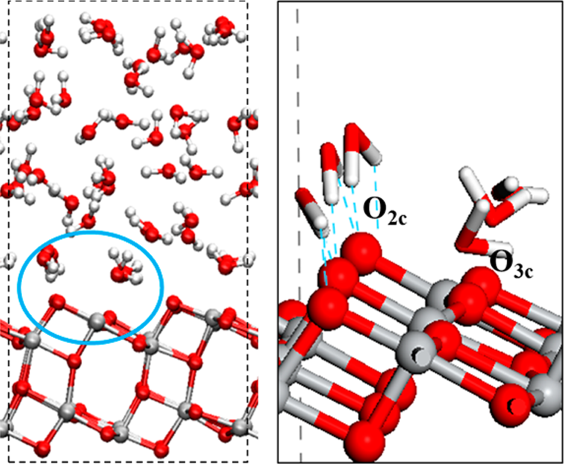
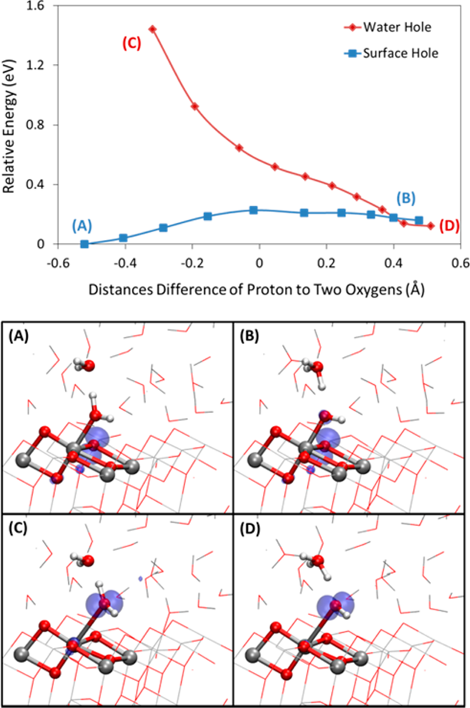
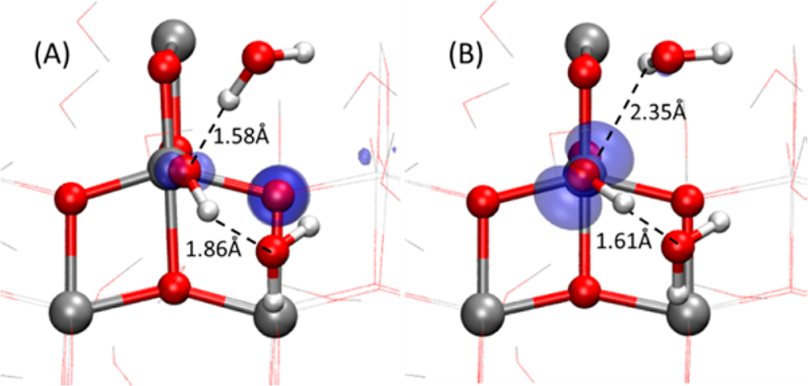
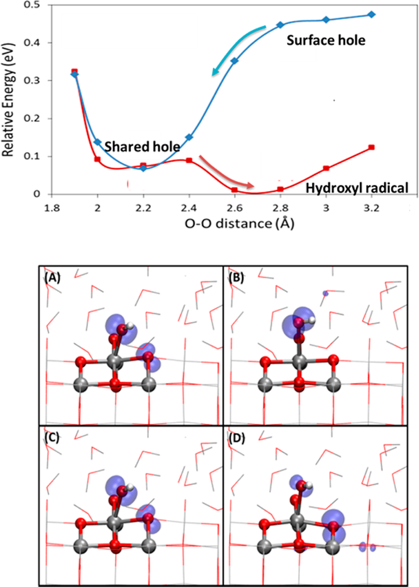

# Chemical Dynamics of the First Proton-Coupled Electron Transfer of Water Oxidation on TiO2 Anatase

## 锐钛矿 TiO2 上水氧化首个质子耦合电子转移的化学动力学

**Zotero key:** UB3DMTHN  
**Attachment key:** 5K3NZ2QB  
**Journal:** Journal of the American Chemical Society  
**DOI:** 10.1021/ja410685m  
**Publication date:** 2013-12-05  
**Task date:** 2026-07-17  
**Source PDF:** paper.pdf

## Why This Paper / 为什么选这篇

**English:** This six-star paper is a compact but unusually instructive bridge between interfacial solvation, hybrid-DFT hole localization, first-principles molecular dynamics, and reaction kinetics. Its main value is not merely the conclusion that PCET is sequential; it shows how solvent hydrogen bonds reshape the hole-trapping site and create a shared-hole inner-sphere pathway that rationalizes the pH dependence of water oxidation on TiO2.

**中文:** 这是一篇六星优先文献。它篇幅很短，却把界面溶剂化、杂化 DFT 空穴局域、第一性原理分子动力学和反应动力学连接在一起。真正值得学习的不只是“PCET 为分步过程”这一结论，而是作者如何证明溶剂氢键改变空穴俘获位点，并通过共享空穴的内球电子转移路径解释 TiO2 水氧化的 pH 依赖性。

## Reading Guide / 读前导读

**English:** Read in four passes. First, identify the experimental puzzle: OER becomes faster at high pH even though static overpotential calculations are pH independent. Second, follow how the explicit-water FPMD snapshots and PBE0 calculations define two diabatic electronic states. Third, use Fig. 2 to locate the crossing of those states and establish the order PT -> ET. Finally, use Figs. 3-4 to connect hydrogen-bond asymmetry, the shared-hole state, and the low ET barrier to a practical Lewis-acidity design rule.

**中文:** 建议分四遍阅读。第一遍先抓住实验矛盾：静态能量学计算的过电位不随 pH 变化，但高 pH 下 OER 明显更快。第二遍跟踪作者如何利用显式水 FPMD 快照和 PBE0 计算定义两个透热电子态。第三遍重点看图 2，通过两电子态的交叉位置确定反应顺序为 PT -> ET。第四遍用图 3-4 把氢键不对称、共享空穴态和极低 ET 势垒串起来，最后理解为什么增强表面 Lewis 酸性是一条可操作的催化剂设计规则。

## Terminology / 术语表

| English | 中文 | Note / 说明 |
| --- | --- | --- |
| proton-coupled electron transfer (PCET) | 质子耦合电子转移 | 质子与电子的转移在同一总反应中耦合；本文证明二者按先质子、后电子的顺序发生。 |
| oxygen evolution reaction (OER) | 析氧反应 | 水氧化生成 O2 的阳极半反应。 |
| proton transfer (PT) | 质子转移 | 本文第一个 PCET 的先导且在低 pH 下限速的步骤。 |
| electron transfer (ET) | 电子转移 | PT 之后发生，通过共享空穴态完成，势垒显著更低。 |
| surface-trapped hole | 表面俘获空穴 | 局域在 TiO2 表面氧位点上的光生空穴。 |
| water-hole state | 水空穴态 | 空穴局域在吸附水分子氧 Oa 上的电子态。 |
| surface-hole state | 表面空穴态 | 空穴局域在三配位表面氧 O3c 上的电子态。 |
| shared-hole state | 共享空穴态 | 空穴同时分布在 O3c 与吸附羟基上的内球电子转移中间态。 |
| inner-sphere electron transfer | 内球电子转移 | 供体与受体通过直接配位/成键环境发生电子转移，而非仅靠长程外球耦合。 |
| point of zero charge (pzc) | 零电荷点 | 表面净电荷为零的 pH；决定低 pH 与高 pH 两种动力学区间。 |
| PBE0 hybrid functional | PBE0 杂化泛函 | 用于正确描述极化子型表面空穴和势能面的电子结构方法。 |
| first-principles molecular dynamics (FPMD) | 第一性原理分子动力学 | 使用即时电子结构计算生成显式水界面构型。 |

## Page / Section Index

| PDF page | Content | Anchors |
| --- | --- | --- |
| 1 | Front matter; Abstract; Introduction | S001-S008 |
| 2 | Computational approach; hole localization; PT energy profiles | S009-S012; F001-F002 |
| 3 | Sequential PCET; hydrogen-bond origin; ET mechanism | S013-S018; F003-F004 |
| 4 | Design implication; associated content; author information; acknowledgments; references | S019-S022 |

## Bilingual Reader / 逐段中英对照全文

## Front matter
<a id="S001"></a>
**Source:** p.1 S001

**Original:** Chemical Dynamics of the First Proton-Coupled Electron Transfer of Water Oxidation on TiO2 Anatase

**中文:** 锐钛矿 TiO2 上水氧化首个质子耦合电子转移的化学动力学
<a id="S002"></a>
**Source:** p.1 S002

**Original:** Jia Chen, Ye-Fei Li, Patrick Sit, and Annabella Selloni

**中文:** 作者：Jia Chen、Ye-Fei Li、Patrick Sit 和 Annabella Selloni。
<a id="S003"></a>
**Source:** p.1 S003

**Original:** Department of Chemistry, Princeton University, Princeton, New Jersey 08544, United States. Supporting Information is available for this article.

**中文:** 作者单位：美国新泽西州普林斯顿大学化学系。本文另有补充信息。
## Abstract
<a id="S004"></a>
**Source:** p.1 S004

**Original:** ABSTRACT: Titanium dioxide (TiO2) is a prototype water-splitting (photo)catalyst, but its performance is limited by the large overpotential for the oxygen evolution reaction (OER). We report here a first-principles density functional theory study of the chemical dynamics of the first proton-coupled electron transfer (PCET), which is considered responsible for the large OER overpotential on TiO2. We use a periodic model of the TiO2/water interface that includes a slab of anatase TiO2 and explicit water molecules, sample the solvent configurations by first-principles molecular dynamics, and determine the energy profiles of the two electronic states involved in the electron transfer (ET) by hybrid functional calculations. Our results suggest that the first PCET is sequential, with the ET following the proton transfer. The ET occurs via an inner-sphere process, which is facilitated by a state in which one electronic hole is shared by the two oxygen ions involved in the transfer.

**中文:** 摘要：二氧化钛（TiO2）是一种典型的光/电催化水分解材料，但其性能受到析氧反应（OER）所需较大过电位的限制。本文采用第一性原理密度泛函理论研究 OER 第一个质子耦合电子转移（PCET）步骤的化学动力学；该步骤被认为是 TiO2 上 OER 高过电位的主要来源。作者建立了包含锐钛矿 TiO2 薄层和显式水分子的周期性 TiO2/水界面模型，利用第一性原理分子动力学采样溶剂构型，再通过杂化泛函计算电子转移（ET）涉及的两个电子态的能量剖面。结果表明，第一个 PCET 是分步进行的：先发生质子转移，随后发生电子转移。电子转移属于内球过程，并由一种“共享空穴”状态促进，即参与转移的两个氧离子共同分担一个电子空穴。
## Introduction
<a id="S005"></a>
**Source:** p.1 S005

**Original:** The photocatalytic splitting of water on semiconductor electrodes has fascinated and intrigued researchers for over 40 years. Overall, the water-splitting process consists of two half-reactions, the oxygen evolution reaction (OER) at the (photo)anode and the hydrogen evolution reaction (HER) at the cathode of a (photo)electrochemical cell. Of the two, the OER is the major obstacle because it generally requires a large overpotential that causes substantial energy losses. This difficulty is also present for TiO2, one of the most important (photo)anode materials for the OER because of its abundance and high stability in both acidic and alkaline conditions. Intense research efforts have been devoted to reducing the OER overpotential on TiO2, for instance by doping with various elements. However, it is still unclear how to design a photocatalyst with high OER activity, largely because the kinetics of the OER is not well known. An atomic-level understanding of the OER kinetics on TiO2 would be of great scientific interest and could help design more efficient (photo)electrochemical water-splitting cells.

**中文:** 四十多年来，半导体电极上的光催化水分解一直吸引着研究者。总体而言，水分解由两个半反应组成：光阳极上的析氧反应（OER）和光电化学电池阴极上的析氢反应（HER）。其中，OER 是主要瓶颈，因为它通常需要很大的过电位并造成显著能量损失。TiO2 也面临这一困难；它因储量丰富且在酸性和碱性条件下都高度稳定，是最重要的 OER 光阳极材料之一。人们进行了大量工作以降低 TiO2 上的 OER 过电位，例如掺杂不同元素。然而，如何设计高 OER 活性的光催化剂仍不清楚，主要原因是 OER 动力学尚未得到充分认识。若能在原子尺度理解 TiO2 上的 OER 动力学，不仅具有重要科学意义，也有助于设计效率更高的光电化学水分解电池。
<a id="S006"></a>
**Source:** p.1 S006

**Original:** The mechanism of O2 evolution on TiO2 surfaces has been extensively investigated. Wilson first identified oxidative species on a TiO2 anode by electrochemical scanning. Using the same technique, Salvador et al. suggested that Wilson's surface species might be adsorbed H2O2 produced by coupling surface OH radicals. In situ infrared spectroscopy later led Nakamura et al. to propose surface OO and OOH species, which were subsequently confirmed by DFT calculations. DFT calculations of OER energetics also showed that the first proton-coupled electron transfer is the rate-determining step on both rutile and anatase TiO2. It is generally agreed that water oxidation begins with surface-trapped photoholes and proceeds through four sequential PCET steps: (i) *H2O + h+ -> *OH + H+; (ii) *OH + h+ -> *O + H+; (iii) *O + H2O(l) + h+ -> *OOH + H+; and (iv) *OOH + h+ -> O2 + H+. Here * denotes a TiO2 surface site, *X an adsorbed species, H2O(l) a liquid-water molecule, and H+ a solvated proton.

**中文:** TiO2 表面的 O2 析出机理已得到广泛研究。Wilson 首先通过电化学扫描发现 TiO2 阳极上的氧化性物种。Salvador 等人使用同一技术提出，该表面物种可能是由表面 OH 自由基偶联形成的吸附 H2O2。随后，Nakamura 等人利用原位红外吸收光谱提出存在表面 OO 和 OOH 物种，后来这一判断得到 DFT 计算证实。OER 能量学的 DFT 计算还表明，无论在金红石还是锐钛矿 TiO2 上，第一个质子耦合电子转移都是速率决定步骤。一般认为，水氧化始于表面俘获的光生空穴，并依次经历四个 PCET 步骤：(i) *H2O + h+ -> *OH + H+；(ii) *OH + h+ -> *O + H+；(iii) *O + H2O(l) + h+ -> *OOH + H+；(iv) *OOH + h+ -> O2 + H+。其中 * 表示 TiO2 表面位点，*X 表示吸附的 X 物种，H2O(l) 表示液态水分子，H+ 表示溶剂化质子。
<a id="S007"></a>
**Source:** p.1 S007

**Original:** Substantial evidence shows that kinetic effects are also essential for the OER. Transient absorption spectroscopy measurements of trapped photoholes in nanocrystalline TiO2 exhibit biexponential decay. The fast component, with a decay time of about 1 microsecond or less, is assigned to electron-hole recombination, whereas the slower component is assigned to reaction with surface-adsorbed species. On nanocrystalline TiO2 photoanodes, the photohole lifetime required for O2 evolution is estimated to be about 30 ms at pH 12.7 and about 0.2 s at pH approximately 6.5. Water oxidation is therefore faster at higher pH, suggesting a pH-dependent change in mechanism. Photoluminescence measurements on rutile TiO2 similarly show a sharp decrease in recombination-related emission above pH approximately 4, close to the point of zero charge of TiO2, indicating a higher OER rate. Pure energetics cannot explain these observations because theoretical OER overpotentials do not vary with pH; the enhanced high-pH activity must therefore involve kinetic effects.

**中文:** 大量证据表明，动力学效应对 OER 同样至关重要。纳米晶 TiO2 中俘获光生空穴的瞬态吸收光谱呈双指数衰减：约 1 微秒或更短的快速分量归因于电子-空穴复合，较慢分量则归因于空穴与表面吸附物种的反应。在纳米晶 TiO2 光阳极上，实现 O2 析出所需的光生空穴寿命在 pH 12.7 时约为 30 ms，而在 pH 约 6.5 时约为 0.2 s。因此，高 pH 下水氧化更快，暗示反应机理随 pH 改变。金红石 TiO2 的光致发光实验也显示，当 pH 高于约 4（接近 TiO2 的零电荷点）时，与载流子复合相关的发光强度骤降，说明 OER 速率上升。单纯的能量学不能解释这些现象，因为理论 OER 过电位并不随 pH 变化；高 pH 活性的提高因此必须涉及动力学因素。
## Study design
<a id="S008"></a>
**Source:** p.1 S008

**Original:** To obtain insight into the kinetics of the OER, we studied the first PCET, *H2O + h+ -> *OH + H+ (1), which is generally considered the rate-determining OER step, at the interface between anatase TiO2(101) and liquid water. The results indicate that proton and electron transfers are not concerted but sequential, with proton transfer preceding electron transfer. Proton transfer has a substantial activation energy of 0.2-0.5 eV, whereas the subsequent electron transfer is essentially barrierless, consistent with recent transient-absorption experiments. These results also provide a direct explanation for the experimentally observed higher OER activity at high pH.

**中文:** 为理解 OER 动力学，作者研究了锐钛矿 TiO2(101)/液态水界面上的第一个 PCET 步骤 *H2O + h+ -> *OH + H+（式 1）；该步骤通常被视为 OER 的速率决定步骤。结果表明，质子转移与电子转移并非协同发生，而是先后进行：质子转移先发生，电子转移随后发生。质子转移具有明显的 0.2-0.5 eV 活化能，而后续电子转移基本无势垒，这与近期瞬态吸收实验一致。这一结果也直接解释了实验中高 pH 条件下 OER 活性更高的现象。
## Computational approach
<a id="S009"></a>
**Source:** p.2 S009

**Original:** Investigating reaction (1) is theoretically and computationally challenging. First, the surface-trapped holes that play a key role in the OER must be described correctly. Because hole relaxation to the top of the valence band is several orders of magnitude faster than the subsequent surface chemical reaction, it is reasonable to describe the trapped hole using ground-state DFT. Standard local or semilocal DFT functionals, however, cannot capture the polaronic character of the surface hole. We therefore use a periodic hybrid-functional approach that performed well in previous studies. Second, the water/TiO2 interfacial environment must be represented adequately. To generate equilibrated interface configurations, we performed a 10 ps DFT-based first-principles molecular dynamics simulation on a relatively large TiO2/water model containing a periodic two-layer slab of 24 TiO2 units and 48 explicit water molecules at a density of 0.996 g cm^-3.

**中文:** 研究反应（1）在理论和计算上都很有挑战。首先，必须正确描述在 OER 中起关键作用的表面俘获空穴。由于空穴弛豫到价带顶的速度比后续表面化学反应快几个数量级，使用基态 DFT 描述表面俘获空穴是合理的。然而，标准局域或半局域 DFT 泛函无法刻画表面空穴的极化子特征，因此作者采用了此前研究中表现良好的周期性杂化泛函方法。其次，必须充分描述水/TiO2 界面环境。为获得平衡的界面构型，作者对一个较大的 TiO2/水模型进行了 10 ps 的 DFT 第一性原理分子动力学模拟。该模型包含由 24 个 TiO2 单元构成的双层周期性薄板和 48 个显式水分子，水密度为 0.996 g cm^-3。
<a id="F001"></a>
### Fig. 1. TiO2/水界面模型与表面氢键

**Placed near:** p.2 S009  
**Source:** p.2 C001



**Original caption:** Figure 1. (Left) Side view of the system used to model the TiO2/water interface. The model includes a periodic slab with two TiO2 layers of 24 TiO2 units and 48 water molecules at a density of 0.996 g/cm3. The dashed box indicates the computational unit cell. (Right) Enlarged perspective view of the region indicated by the blue oval on the left. Some of the H-bonds between water molecules on O2c surface atoms are highlighted (dashed blue lines).

**中文图注:** 图 1。（左）用于模拟 TiO2/水界面的体系侧视图。模型包含一个由两层、共 24 个 TiO2 单元构成的周期性薄板，以及 48 个密度为 0.996 g/cm3 的水分子；虚线框表示计算晶胞。（右）左图蓝色椭圆区域的放大透视图。蓝色虚线标出了位于表面 O2c 原子上方的水分子所形成的部分氢键。

**Reading note:** Inspect how explicit water hydrogen-bonds to bridging O2c atoms. That solvation detail changes the preferred hole-trapping site from O2c in vacuum to terrace O3c at the aqueous interface.

**图解:** 重点观察显式水如何与桥位 O2c 形成氢键。正是这一溶剂化细节使空穴优先俘获位点从真空中的 O2c 改变为水界面的台面 O3c。
<a id="S010"></a>
**Source:** p.2 S010

**Original:** We selected three well-separated configurations from the first-principles molecular dynamics trajectory. For each configuration, we removed one electron to create a hole and relaxed the geometry with the PBE0 hybrid functional. Only three configurations were used because periodic hybrid-functional calculations are extremely expensive for systems of this size. The relaxed structures were then used to calculate the potential-energy surfaces of the PCET. For each configuration, proton-transfer energy profiles were evaluated in the two electronic states relevant to electron transfer: a water-hole state with the hole localized on the oxygen Oa of an adsorbed water molecule, and a surface-hole state with the hole localized on a nearby threefold-coordinated surface oxygen O3c.

**中文:** 作者从第一性原理分子动力学轨迹中选择了三个彼此间隔较远的构型。对每个构型移去一个电子以产生空穴，并使用 PBE0 杂化泛函进行几何优化。由于对如此大的体系进行周期性杂化泛函计算成本极高，因此只选取了三个构型。随后，作者利用优化后的结构计算 PCET 的势能面。对每个构型，分别在与电子转移相关的两个电子态上计算质子转移能量剖面：其一是空穴局域在吸附水分子氧 Oa 上的“水空穴态”，其二是空穴局域在邻近三配位表面氧 O3c 上的“表面空穴态”。
## Hole localization and reaction coordinate
<a id="S011"></a>
**Source:** p.2 S011

**Original:** Holes often localized on terrace O3c sites, unlike previous vacuum calculations in which bridging O2c sites were preferred. In water, bridging O2c atoms accept hydrogen bonds from adjacent water molecules, whereas O3c atoms do not. Hydrogen bonding stabilizes O2c and makes it less favorable for hole trapping, so O3c was taken as the surface trapping site. The proton-transfer reaction coordinate was the distance difference Delta dO-H = d(Oa-H) - d(Ob-H), where H is the transferring proton and Ob is the oxygen of a water molecule adjacent to the adsorbed H2Oa.

**中文:** 计算发现，空穴常局域在台面 O3c 位点上；这不同于先前真空计算中空穴优先局域在桥位 O2c 的结果。在水环境中，桥位 O2c 会接受邻近水分子的氢键，而 O3c 与相邻水分子之间不存在氢键。氢键稳定了 O2c，使其不再是有利的空穴俘获位点，因此作者选择 O3c 作为表面空穴俘获位点。质子转移反应坐标定义为距离差 ΔdO-H = d(Oa-H) - d(Ob-H)，其中 H 是转移质子，Ob 是邻近吸附 H2Oa 分子的水分子氧原子。
## Proton-transfer energy profiles
<a id="S012"></a>
**Source:** p.2 S012

**Original:** The PCET energy profiles for one first-principles molecular dynamics snapshot are shown in Figure 2. Each point was obtained by constrained minimization using the electronic wave function from the preceding step as the initial guess, which keeps the profile as close as possible to diabatic potential-energy surfaces. Two additional snapshots in the Supporting Information give quantitatively different profiles because of their different solvation configurations, but all three show the same qualitative trends.

**中文:** 图 2 给出了一个第一性原理分子动力学快照的 PCET 能量剖面。曲线上的每个点都通过约束优化得到，并以前一步的电子波函数作为初始猜测，从而使能量剖面尽可能接近非绝热电子转移分析所需的透热势能面。补充信息中的另外两个快照因溶剂化构型不同而在定量上有所差异，但三个快照都呈现相同的定性趋势。
<a id="F002"></a>
### Fig. 2. 质子转移势能面与空穴局域

**Placed near:** p.2 S012  
**Source:** p.2 C002



**Original caption:** Figure 2. (Top) PT energy profiles in the surface-hole (A,B) and water-hole (C,D) states for a selected configuration along the FPMD trajectory of an anatase TiO2(101) slab in contact with liquid water (snapshot I in Figure S1). The reaction coordinate, Delta dO-H = d(Oa-H) - d(Ob-H), is defined in Figure S2. (Bottom) Spin density (0.01 au contour) of the water-hole and surface-hole states before and after the proton transfer.

**中文图注:** 图 2。（上）锐钛矿 TiO2(101) 薄板/液态水体系的一条 FPMD 轨迹中所选构型（图 S1 的快照 I）在表面空穴态（A、B）和水空穴态（C、D）下的质子转移能量剖面。反应坐标 ΔdO-H = d(Oa-H) - d(Ob-H) 定义见图 S2。（下）质子转移前后水空穴态与表面空穴态的自旋密度等值面（0.01 au）。

**Reading note:** The decisive feature is where the red and blue energy profiles become degenerate: only near the proton-transfer product, not near the transition state. This is the evidence for sequential rather than concerted PCET.

**图解:** 决定性信息是红、蓝两条能量曲线在何处接近简并：它们只在质子转移产物附近接近，而不是在过渡态附近。这正是 PCET 为分步而非协同过程的证据。
## Sequential PCET
<a id="S013"></a>
**Source:** p.3 S013

**Original:** The order of proton and electron transfer can be inferred from where the two potential-energy surfaces intersect. Intersection near the proton-transfer transition state would indicate a concerted PCET, whereas intersection near the proton-transfer final state would indicate a sequential process. The water-hole state decreases rapidly in energy as Delta dO-H increases, showing that adsorbed water in this state strongly tends to dissociate into an adsorbed OH radical and H3O+. The water-hole and surface-hole profiles become nearly degenerate only near the final proton-transfer state, or do not cross at all in the other snapshots. Thus, the first OER PCET is sequential and electron transfer preferentially follows proton transfer. Proton transfer is activated, with barriers of approximately 0.2, 0.4, and 0.5 eV for the three snapshots.

**中文:** 质子转移和电子转移的先后顺序可由两条势能面的交叉位置判断：若两势能面在质子转移过渡态附近相交，则 PCET 为协同过程；若在质子转移终态附近相交，则 PCET 为分步过程。随着 ΔdO-H 增大，水空穴态的能量迅速降低，表明该电子态下吸附水强烈倾向于解离成吸附 OH 自由基和 H3O+。水空穴态与表面空穴态的能量剖面仅在质子转移终态附近近乎简并；在其他快照中甚至完全不相交。因此，第一个 OER-PCET 是分步的，电子转移优先发生在质子转移之后。质子转移需要越过势垒，三个快照对应的势垒约为 0.2、0.4 和 0.5 eV。
## Hydrogen-bond origin of sequential transfer
<a id="S014"></a>
**Source:** p.3 S014

**Original:** The preference for a sequential rather than concerted process can be understood from the hydrogen-bond configurations of an adsorbed hydroxide anion (OH-) and a hydroxyl radical (OH radical) at the TiO2/water interface. Adsorbed OH- accepts a short 1.58 A hydrogen bond and donates a longer 1.86 A hydrogen bond, whereas the hydroxyl radical accepts a long 2.35 A hydrogen bond and donates a short 1.61 A hydrogen bond. Thus adsorbed OH- is preferentially a hydrogen-bond acceptor, while surface hydroxyl radical is preferentially a donor. In the proton-transfer final state, the hydroxyl remaining on the surface is forced to accept a hydrogen bond from nearby H3O+, so the configuration containing adsorbed OH- is energetically preferred.

**中文:** 为什么反应倾向于分步而非协同，可以从 TiO2/水界面上吸附氢氧根阴离子（OH-）与羟基自由基（OH·）的氢键构型理解。吸附 OH- 接受一条较短的 1.58 Å 氢键并给出一条较长的 1.86 Å 氢键；相反，OH· 接受一条较长的 2.35 Å 氢键并给出一条较短的 1.61 Å 氢键。因此，吸附 OH- 更偏好充当氢键受体，而表面 OH· 更偏好充当氢键供体。在质子转移终态中，留在表面的羟基被迫接受邻近 H3O+ 提供的氢键，所以含吸附 OH- 的构型在能量上更有利。
<a id="F003"></a>
### Fig. 3. OH- 与 OH· 的氢键结构差异

**Placed near:** p.3 S014  
**Source:** p.3 C003



**Original caption:** Figure 3. Top view of the spin density (0.01 au contour) and H-bond structure of (A) a hydroxide anion and a surface hole; (B) hydroxyl radical (snapshot IV in Figure S1).

**中文图注:** 图 3。自旋密度等值面（0.01 au）和氢键结构的俯视图：（A）氢氧根阴离子与表面空穴；（B）羟基自由基（图 S1 中的快照 IV）。

**Reading note:** Compare the donor/acceptor asymmetry: OH- accepts the short hydrogen bond, whereas OH radical donates the short hydrogen bond. The solvent therefore stabilizes the proton-transfer product before electron transfer.

**图解:** 比较氢键供体/受体的不对称性：OH- 接受短氢键，而 OH· 给出短氢键。溶剂因此优先稳定电子转移前的质子转移产物。
## Electron-transfer protocol
<a id="S015"></a>
**Source:** p.3 S015

**Original:** Because proton transfer occurs before electron transfer, the kinetics of electron transfer from adsorbed OH- to a surface hole must also be examined. Starting from the interface model, the authors removed a proton from an adsorbed water molecule and introduced a hole into the TiO2 slab so that the simulation cell remained neutral. They then performed another 10 ps first-principles molecular dynamics simulation, selected three snapshots from 4-10 ps, and relaxed all atoms with PBE0.

**中文:** 由于质子转移先于电子转移，还必须研究电子从吸附 OH- 转移到表面空穴的动力学。作者从界面模型出发，移去一个吸附水分子的质子，同时在 TiO2 薄板中引入一个空穴，使整个模拟晶胞保持电中性。随后再次进行 10 ps 第一性原理分子动力学模拟，从 4-10 ps 区间随机选取三个快照，并用 PBE0 对所有原子进行几何优化。
## Electron-transfer coordinate
<a id="S016"></a>
**Source:** p.3 S016

**Original:** An effective electron-transfer reaction coordinate is the O-O distance dO-O between the oxygen Oa of the adsorbed hydroxyl and the O3c surface hole-trapping site. The energy landscape was scanned both inward, from large to small dO-O, and outward, from small to large dO-O, because the two scan directions provide complementary insight into the electron-transfer process. The resulting profiles in Figure 4 show that electron transfer proceeds in two steps.

**中文:** 作者发现，一个有效的电子转移反应坐标是吸附羟基氧 Oa 与表面空穴俘获位点 O3c 之间的 O-O 距离 dO-O。能量景观沿两个方向扫描：向内扫描，即 dO-O 由大变小；向外扫描，即 dO-O 由小变大。两个方向能够互补地揭示电子转移过程。图 4 的能量剖面表明，电子转移包含两个步骤。
<a id="F004"></a>
### Fig. 4. 共享空穴介导的电子转移

**Placed near:** p.3 S016  
**Source:** p.3 C004



**Original caption:** Figure 4. (Top) ET energy profiles as a function of the distance dO-O between the oxygen atom of the adsorbed hydroxyl and the surface hole-trapping site (snapshot IV in Figure S1). (Bottom) Isosurfaces of the spin density (0.01 au) for the shared-hole state (A,C), hydroxyl anion + surface hole state (D), and hydroxyl radical (B). Corresponding electronic densities of states are shown in Figure S6.

**中文图注:** 图 4。（上）电子转移能量随吸附羟基氧原子与表面空穴俘获位点之间距离 dO-O 的变化（图 S1 中的快照 IV）。（下）共享空穴态（A、C）、氢氧根阴离子 + 表面空穴态（D）和羟基自由基态（B）的自旋密度等值面（0.01 au）。相应电子态密度见图 S6。

**Reading note:** The inward and outward scans expose the intermediate shared-hole basin. Formation of that state is barrierless, and conversion to hydroxyl radical costs less than 0.1 eV, making ET much faster than PT.

**图解:** 向内和向外扫描共同揭示了中间的共享空穴能谷。形成该状态无势垒，转化为羟基自由基的势垒低于 0.1 eV，因此电子转移远快于质子转移。
## Shared-hole electron transfer
<a id="S017"></a>
**Source:** p.3 S017

**Original:** During the inward scan at large dO-O, the hole is mainly localized in TiO2. As dO-O decreases, the hydroxyl tilts toward the surface-trapped hole and forms a shared-hole state in which the hole is distributed over both O3c and the hydroxyl; this step is barrierless. During the outward scan, the hydroxyl extends away from the surface and the shared-hole state converts into a more stable surface hydroxyl radical through a very small barrier below 0.1 eV. Two additional snapshots give very similar profiles, confirming that the electron-transfer barrier is much smaller than the proton-transfer barrier.

**中文:** 在向内扫描中，当 dO-O 较大时，空穴主要局域在 TiO2 内。随着 dO-O 减小，羟基向表面俘获空穴倾斜，形成“共享空穴”态，空穴同时分布在 O3c 和羟基上；该步骤没有势垒。在向外扫描中，羟基逐渐伸离表面，共享空穴态经由低于 0.1 eV 的极小势垒转化为更稳定的表面羟基自由基。另两个快照给出非常相似的能量剖面，证实电子转移势垒显著小于质子转移势垒。
## pH-dependent mechanism
<a id="S018"></a>
**Source:** p.3 S018

**Original:** The kinetics of the first OER-PCET step on TiO2 can therefore be summarized as follows. The process is sequential and begins with proton transfer. At low pH below the point of zero charge, surface OH- groups are scarce, so proton transfer is rate determining with a moderate 0.2-0.5 eV barrier. At high pH above the point of zero charge, the TiO2 surface is covered by hydroxide anions and the overall PCET rate no longer depends on the proton-transfer barrier. Instead, the much smaller electron-transfer barrier controls the kinetics. Consequently, OER is faster at high pH, as observed experimentally.

**中文:** 因此，TiO2 上第一个 OER-PCET 步骤的动力学可概括如下：该过程为分步反应，并由质子转移启动。在低于零电荷点的低 pH 条件下，TiO2 表面 OH- 数量很少，因而具有 0.2-0.5 eV 中等势垒的质子转移是速率决定步骤。在高于零电荷点的高 pH 条件下，TiO2 表面覆盖有氢氧根阴离子，整体 PCET 速率不再取决于质子转移势垒，而由显著更小的电子转移势垒控制。因此，高 pH 下 OER 更快，与实验观察一致。
## Design implication
<a id="S019"></a>
**Source:** p.4 S019

**Original:** The results suggest a general strategy for accelerating the first PCET. At low pH, proton transfer is rate determining, so the pKa of *H2O -> *OH- + H+ should be lowered. At high pH, PCET is essentially barrierless and its rate is controlled by the surface OH- concentration, which can also be increased by lowering the same pKa. Thus OER activity should improve when surface Lewis acidity is increased. Anion doping with N, C, or S is not expected to change the first-PCET rate strongly because the Lewis-acid site remains a surface Ti5c ion. Transition-metal doping, by contrast, can substantially change the rate because a dopant replacing Ti5c can have a different Lewis acidity. This interpretation is consistent with experiments showing large changes in OER overpotential for TiO2 doped with different transition metals.

**中文:** 这些结果还提出了加速第一个 PCET 的一般策略。在低 pH 下，质子转移是速率决定步骤，因此应降低反应 *H2O -> *OH- + H+ 的 pKa。在高 pH 下，PCET 基本无势垒，速率由表面 OH- 浓度决定，而降低同一反应的 pKa 同样能够提高表面 OH- 浓度。因此，增强表面 Lewis 酸性应当能够提高 OER 活性。用 N、C 或 S 进行阴离子掺杂预计不会显著改变第一个 PCET 的速率，因为 Lewis 酸位点仍是表面 Ti5c 离子。相反，过渡金属掺杂可能显著改变速率，因为取代 Ti5c 的金属掺杂原子具有不同的 Lewis 酸性。这一解释与实验中不同过渡金属掺杂显著改变 TiO2 的 OER 过电位相一致。
## Associated content
<a id="S020"></a>
**Source:** p.4 S020

**Original:** ASSOCIATED CONTENT - Supporting Information: Computational details and proton-transfer and electron-transfer energy profiles for additional snapshots along the first-principles molecular dynamics trajectories. This material was made available free of charge via the ACS website.

**中文:** 相关内容 - 补充信息：包含计算细节，以及第一性原理分子动力学轨迹中其他快照的质子转移和电子转移能量剖面。该材料由 ACS 网站免费提供。
## Author information
<a id="S021"></a>
**Source:** p.4 S021

**Original:** Corresponding authors: jc4165@columbia.edu and yefeil@princeton.edu. The authors declare no competing financial interest.

**中文:** 通讯作者邮箱：jc4165@columbia.edu 和 yefeil@princeton.edu。作者声明不存在竞争性经济利益。
## Acknowledgments
<a id="S022"></a>
**Source:** p.4 S022

**Original:** This work was supported by the U.S. Department of Energy, Office of Basic Energy Sciences, Division of Chemical Sciences, Geosciences and Biosciences under Award DE-FG02-12ER16286. Computational resources were provided by the National Energy Research Scientific Computing Center under Contract DE-AC02-05CH11231. The authors also acknowledge the TIGRESS high-performance computing center at Princeton University.

**中文:** 本工作得到美国能源部基础能源科学办公室化学科学、地球科学与生物科学部项目 DE-FG02-12ER16286 的支持。计算资源由美国国家能源研究科学计算中心依据合同 DE-AC02-05CH11231 提供。作者同时感谢普林斯顿大学 TIGRESS 高性能计算中心。

## References / 参考文献

**English:** The reference list is preserved below as bibliographic information. In accordance with the reading-package rule, individual references are not translated as prose paragraphs.

**中文:** 下列参考文献按书目信息原样保留。依据本阅读包规则，参考文献列表不作为正文逐条翻译。

```text
1. Fujishima, A.; Honda, K. Nature 1972, 238, 37.
2. Lewis, N. S.; Nocera, D. G. Proc. Natl. Acad. Sci. U.S.A. 2006, 103, 15729.
3. Kudo, A.; Miseki, Y. Chem. Soc. Rev. 2009, 38, 253.
4. Walter, M. G.; Warren, E. L.; McKone, J. R.; Boettcher, S. W.; Mi, Q.; Santori, E. A.; Lewis, N. S. Chem. Rev. 2010, 110, 6446.
5. Dau, H.; Limberg, C.; Reier, T.; Risch, M.; Roggan, S.; Strasser, P. ChemCatChem 2010, 2, 724.
6. Gratzel, M. Nature 2001, 414, 338.
7. Linsebigler, A. L.; Lu, G.; Yates, J. T., Jr. Chem. Rev. 1995, 95, 735.
8. Asahi, R.; Morikawa, T.; Ohwaki, T.; Aoki, K.; Taga, Y. Science 2001, 293, 269.
9. Fujishima, A.; Zhang, X.; Tryk, D. A. Surf. Sci. Rep. 2008, 63, 515.
10. Diebold, U. Surf. Sci. Rep. 2003, 48, 53.
11. Henderson, M. A. Surf. Sci. Rep. 2011, 66, 185.
12. Chen, X.; Mao, S. S. Chem. Rev. 2007, 107, 2891.
13. Liu, B.; Chen, H. M.; Liu, C.; Andrews, S. C.; Hahn, C.; Yang, P. J. Am. Chem. Soc. 2013, 135, 9995.
14. Wilson, R. H. J. Am. Chem. Soc. 1980, 127, 228.
15. Salvador, P.; Gutierrez, C. J. Phys. Chem. 1984, 88, 3696.
16. Nakamura, R.; Nakato, Y. J. Am. Chem. Soc. 2004, 126, 1290.
17. Nakamura, R.; Tanaka, T.; Nakato, Y. J. Phys. Chem. B 2004, 108, 10617.
18. Li, Y.-F.; Liu, Z.-P.; Liu, L.; Gao, W. J. Am. Chem. Soc. 2010, 132, 13008.
19. Valdes, A.; Qu, Z. W.; Kroes, G. J.; Rossmeisl, J.; Norskov, J. K. J. Phys. Chem. C 2008, 112, 9872.
20. Yoshihara, T.; Katoh, R.; Furube, A.; Tamaki, Y.; Murai, M.; Hara, K.; Murata, S.; Arakawa, H.; Tachiya, M. J. Phys. Chem. B 2004, 108, 3817.
21. Tang, J.; Durrant, J. R.; Klug, D. R. J. Am. Chem. Soc. 2008, 130, 13885.
22. Cowan, A. J.; Tang, J.; Leng, W.; Durrant, J. R.; Klug, D. R. J. Phys. Chem. C 2010, 114, 4208.
23. Cowan, A. J.; Durrant, J. R. Chem. Soc. Rev. 2013, 42, 2281.
24. Imanishi, A.; Okamura, T.; Ohashi, N.; Nakamura, R.; Nakato, Y. J. Am. Chem. Soc. 2007, 129, 11569.
25. Cowan, A. J.; Barnett, C. J.; Pendlebury, S. R.; Barroso, M.; Sivula, K.; Gratzel, M.; Durrant, J. R.; Klug, D. R. J. Am. Chem. Soc. 2011, 133, 10134.
26. Tamaki, Y.; Furube, A.; Murai, M.; Hara, K.; Katoh, R.; Tachiya, M. Phys. Chem. Chem. Phys. 2007, 9, 1453.
27. Cohen, A. J.; Mori-Sanchez, P.; Yang, W. Science 2008, 321, 792.
28. Di Valentin, C.; Selloni, A. J. Phys. Chem. Lett. 2011, 2, 2223.
29. Car, R.; Parrinello, M. Phys. Rev. Lett. 1985, 55, 2471.
30. Perdew, J. P.; Ernzerhof, M.; Burke, K. J. Chem. Phys. 1996, 105, 9982.
31. Cheng, H.; Selloni, A. Langmuir 2010, 26, 11518.
32. Li, Y.-F.; Selloni, A. J. Am. Chem. Soc. 2013, 135, 9195.
```

## Related Reading / 相关必读

**English:** One strongly recommended prerequisite is provided in `related_reading.md`. It is the direct energetic and mechanistic predecessor to the present chemical-dynamics study.

**中文:** `related_reading.md` 中保留一篇强推荐前置文献。它是本文化学动力学研究最直接的能量学与机理前作。
