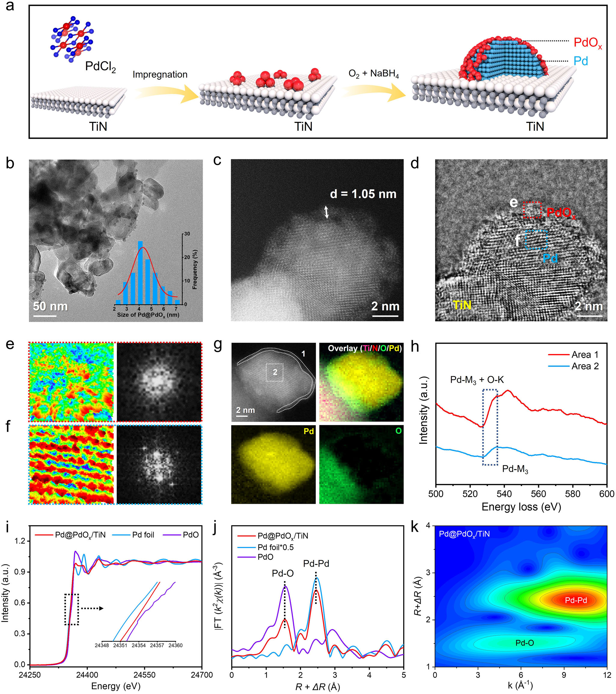
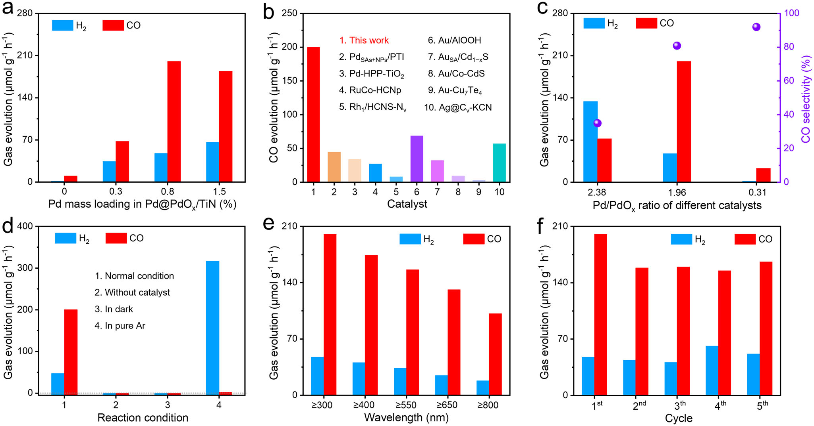
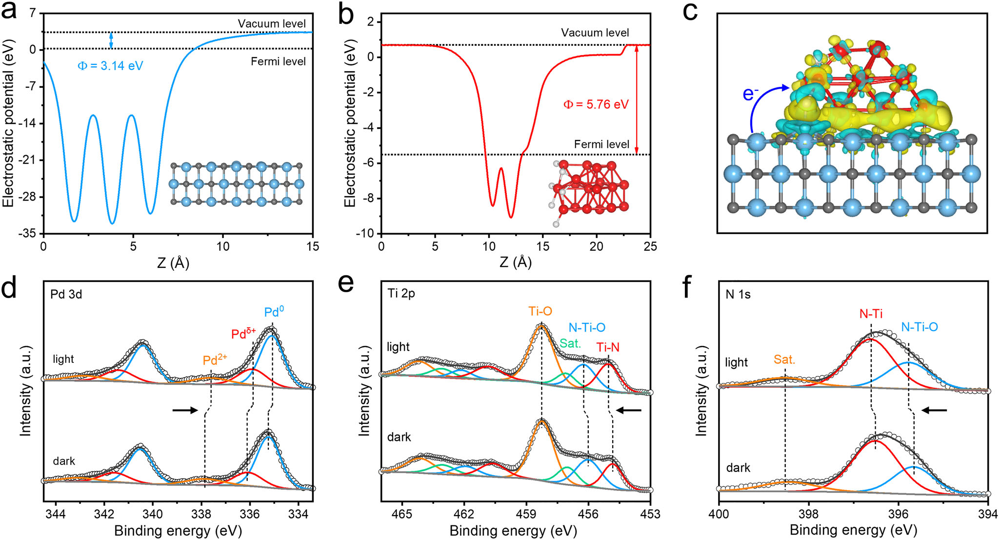
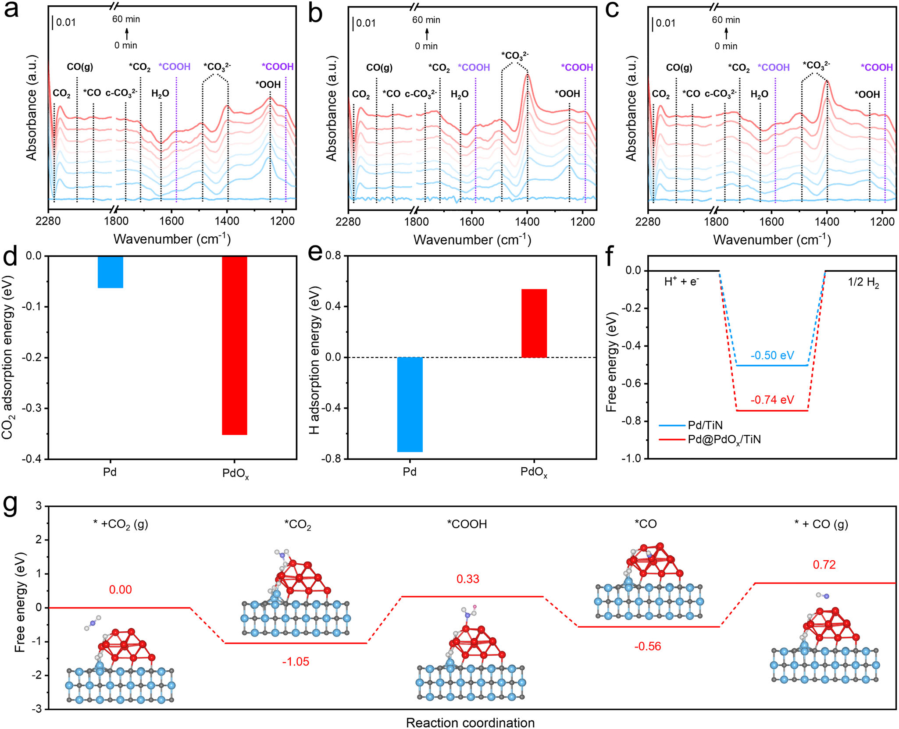
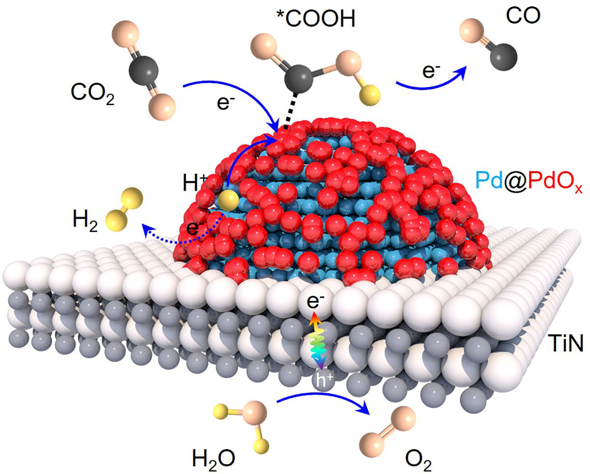

# Surface Oxide Species on Metal Cocatalysts Mediate Pathways in Water-Oxidation-Coupled CO2 Photoreduction: Insights From Pd

**中文题目 / Chinese title:** 金属助催化剂表面氧化物调控水氧化耦合 CO2 光还原路径：以 Pd 为例

**Zotero key:** 6TTHZ7BK  
**Attachment key:** C9DTBDFE  
**Journal / 期刊:** Angewandte Chemie International Edition  
**Year / 年份:** 2026  
**DOI:** 10.1002/anie.1584513  
**Collection / 所属集合:** 02课题 / H2O  
**Task date / 任务日期:** 2026-07-18  
**Source / 来源:** local Zotero PDF; selectable-text, 10 pages; 0 embedded PDF annotations.

## Why This Paper / 为什么选这篇

**English:** This is the first usable PDF corresponding to priority-queue order 3. It is a concise Angewandte Chemie mechanistic paper rather than a single-metric catalyst report: it ties a Pd/PdOx interfacial design to operando spectroscopy, isotope controls, X-ray absorption, ISI-XPS, DRIFTS, and DFT free-energy analysis. It is especially useful for learning how a photocatalysis claim can connect charge flow, proton management, an identified intermediate (*COOH), and product selectivity.

**中文：** 这是优先队列第 3 项中实际可用的完整 PDF（原队列 key 为网页快照；本次使用同题、带 PDF 的期刊条目）。文章不是只报告单一性能指标，而是把 Pd/PdOx 界面设计与原位光谱、同位素对照、X 射线吸收、原位光照 XPS、DRIFTS 和 DFT 自由能分析连成因果链。它特别适合学习如何将光催化中的电荷流、质子管理、关键 *COOH 中间体与 CO 选择性联系起来。

## Terminology / 术语表

| English term | 中文 | Consistency note / 一致性说明 |
|---|---|---|
| Pd@PdOx | Pd 核/表面 PdOx 壳层复合助催化剂 | Pd@PdOx denotes a crystalline Pd core wrapped by an amorphous PdOx-rich surface layer. |
| cocatalyst | 助催化剂 | Provides auxiliary active sites and/or charge-transfer functions on the main photocatalyst. |
| Schottky junction | 肖特基结 | A metal/semiconductor-like contact that redistributes charge and can direct photoelectron transfer. |
| *COOH | 吸附态羧基中间体（*COOH） | The key proton-coupled intermediate for the CO2-to-CO branch discussed here. |
| DRIFTS | 漫反射红外傅里叶变换光谱 | In situ diffuse reflectance infrared Fourier-transform spectroscopy for surface intermediates. |
| XANES / EXAFS | X 射线吸收近边结构 / 扩展 X 射线吸收精细结构 | Local-structure probes used to distinguish Pd and PdOx coordination environments. |
| ISI-XPS | 原位光照 XPS | Illuminated in situ XPS that follows light-induced binding-energy shifts. |
| work function | 功函数 | Energy needed to remove an electron to vacuum; its contrast drives interfacial charge redistribution. |
| AQE | 表观量子效率 | Product electrons divided by incident photons at the specified wavelength. |
| TON | 周转数 | Total product amount normalized by the amount of Pd species during the durability test. |

## Reading Route / 阅读路线

**English:** Read in this order: (1) Fig. 1 and the structure paragraphs to establish what Pd@PdOx means; (2) Fig. 2 plus isotope controls to separate real CO2 reduction from artifacts; (3) Fig. 3 to test the charge-transfer claim; (4) Fig. 4 to test the proposed Pd-as-H-reservoir / PdOx-as-CO2-site division; (5) Fig. 5 and the conclusion to judge whether the evidence supports a pathway, not merely correlation.

**中文：** 建议按以下路线阅读：(1) 先看图 1 与结构段，明确 Pd@PdOx 的真实结构；(2) 看图 2 与同位素对照，区分真实 CO2 还原和伪信号；(3) 看图 3，检验电荷转移论证；(4) 看图 4，检验“Pd 储氢、PdOx 活化 CO2”的分工；(5) 最后回到图 5 和结论，判断证据是否真正支持反应路径，而不只是相关性。

## Page / Section Index / 页码与章节索引

- pp. 1–2: Abstract and introduction / 摘要与引言
- pp. 2–4: Catalyst construction and local structure / 催化剂构筑与局域结构
- pp. 4–5: Activity, controls and charge separation / 活性、对照与电荷分离
- pp. 6–7: Surface intermediates, DFT and mechanism / 表面中间体、DFT 与机理
- p. 7: Conclusion / 结论
- p. 8: Author contributions, acknowledgments and availability / 作者贡献、致谢与数据可用性
- pp. 8–10: References retained as bibliographic record in the source PDF / 参考文献保留于原 PDF

## Related Reading / 相关必读

**English:** One direct predecessor is recommended; the rationale and reading order are recorded in `related_reading.md`.

**中文：** 仅推荐 1 篇直接前置工作；推荐理由与阅读顺序见 `related_reading.md`。

## Bilingual Reader / 逐段中英文对照

### Page 1 / 第 1 页

**Source / 来源:** p.1 S001

**Original:** ABSTRACT Photocatalytic overall CO2 reduction using H2 O as an electron donor is hindered by sluggish reaction kinetics and poorly defined interfacial pathways. Here, we demonstrate that surface oxide species on metal cocatalysts act as intrinsic mediators of the reaction pathway in water-oxidation-coupled CO2 photoreduction. Taking Pd as a model system, we construct a Pd@PdOx cocatalyst on TiN, in which metal Pd is partially encapsulated by spontaneously formed surface PdOx species. This pre-formed Pd/PdOx interface establishes a bifunctional reaction landscape that spatially coordinates proton management and CO2 activation. In situ spectroscopic analyses combined with theoretical calculations reveal that PdOx domains preferentially adsorb and activate CO2 , while adjacent metal Pd sites function as proton reservoirs derived from water oxidation. Directional proton transfer across the Pd/PdOx interface lowers the barrier for *COOH formation, suppresses the competing H2 evolution reaction, and promotes selective CO release. Under full-spectrum irradiation, Pd@PdOx /TiN achieves a CO yield rate of 200 µmol g− 1 h− 1 with 81% selectivity, substantially outperforming the counterparts dominated by either Pd or PdOx . This study highlights surface oxide species as structural determinants of pathway selection and provides mechanistic insights for engineering metal cocatalysts for efficient and selective CO2 photoreduction.

**中文:** 以 H2O 为电子供体的整体 CO2 光还原受限于缓慢的反应动力学和不清晰的界面路径。本文证明，金属助催化剂表面氧化物可在水氧化耦合的 CO2 光还原中充当反应路径的内在调控者。作者以 Pd 为模型，在 TiN 上构筑了 Pd@PdOx 助催化剂：金属 Pd 被自发形成的表面 PdOx 物种部分包覆。预先形成的 Pd/PdOx 界面建立了双功能反应环境，在空间上协同质子管理与 CO2 活化。原位光谱与理论计算表明，PdOx 区域优先吸附并活化 CO2，而相邻 Pd 位点则充当由水氧化产生质子的储库。跨 Pd/PdOx 界面的定向质子传递降低了 *COOH 形成势垒，抑制竞争性析氢并促进选择性 CO 放出。在全光谱照射下，Pd@PdOx/TiN 的 CO 生成速率达到 200 μmol g−1 h−1、选择性为 81%，显著优于以单一 Pd 或 PdOx 为主的对照样品。研究指出，表面氧化物是决定路径选择的结构因素，并为高效、选择性 CO2 光还原的金属助催化剂设计提供了机制依据。

**Source / 来源:** p.1 S002

**Original:** Artificial photosynthesis harnesses solar energy to couple CO2 reduction and H2 O oxidation, providing a sustainable route for producing carbonaceous fuels while addressing global energy and environmental challenges [ 1–4 ]. Extensive pioneering studies on CO2 photoreduction with pure water have provided valuable insights into catalyst design, band structure engineering, and cocatalyst modification to enhance activity and selectivity [ 5–12 ]. Despite these progresses, the efficiency of photocatalytic overall CO2 reduction remains unsatisfactory. This limitation arises from the thermodynamic stability of CO2 molecules, sluggish multi-electron/proton transfer kinetics, and high activation barriers associated with key reaction intermediates [ 13–16 ]. Therefore, augmenting CO2 adsorption and activation via rational sur-face engineering [ 17, 18 ], optimizing proton-coupled electron migration, and facilitating the formation of the key *COOH intermediate are crucial for achieving efficient and selective CO2 -to-CO conversion.

**中文:** 人工光合作用利用太阳能耦合 CO2 还原与 H2O 氧化，为制备含碳燃料并应对能源和环境挑战提供了可持续途径。围绕纯水参与的 CO2 光还原，已有大量开创性研究在催化剂设计、能带工程和助催化剂改性方面给出重要启示；但整体 CO2 光还原的效率仍不理想。这既源于 CO2 的热力学稳定性，也与多电子/质子转移缓慢以及关键中间体活化势垒高有关。因此，必须通过合理的表面工程增强 CO2 吸附与活化，优化质子耦合电子迁移，并促进关键 *COOH 中间体形成，才能实现高效、选择性的 CO2 到 CO 转化。

### Page 2 / 第 2 页

**Source / 来源:** p.2 S003

**Original:** Noble metals have been extensively applied as cocatalysts to accelerate CO2 photoreduction, with recent studies emphasizing the importance of cooperative interactions between distinct metal states, such as nanoparticles (NPs) and single atoms [ 19– 22 ]. However, surface oxidation of metals—inevitable under ambient exposure or catalytic conditions—is typically regarded as incidental rather than functional, and its mechanistic role in pathway regulation remains underexplored [ 23–25 ]. Taking palladium (Pd) as a representative, metal Pd can efficiently collect *H species owing to favorable hydrogen binding, but its filled 4 d10 configuration restricts its electron-accepting ability [ 26–28 ]. The accumulated *H species may recombine to form H2 or participate in proton-coupled CO2 reduction. In contrast, oxidized Pd (PdOx ) species with unoccupied d orbitals can facilitate electron acceptance and enable d –π interactions with CO2 , weakening C ═ O bonds and lowering CO2 activation barriers [ 29–31 ]. These complementary properties suggest that intimate Pd/PdOx coupling could create a bifunctional interface, where Pd enriches reactive *H species while adjacent PdOx activates CO2 , enabling interfacial proton transfer and selective *COOH formation.

**中文:** 贵金属被广泛用作 CO2 光还原助催化剂，近期研究强调了不同金属态（如纳米颗粒与单原子）之间协同作用的重要性。然而，金属在空气暴露或催化条件下不可避免的表面氧化通常被视为偶发现象，而非功能性因素；其调控反应路径的机制尚缺乏研究。以 Pd 为例，金属 Pd 因有利的氢结合可高效富集 *H，但满占据的 4d10 电子构型限制了其接受电子的能力；累积的 *H 可复合形成 H2，也可进入质子耦合 CO2 还原。相反，具有空 d 轨道的氧化态 Pd（PdOx）更易接受电子并可与 CO2 产生 d–π 相互作用，削弱 C=O 键并降低 CO2 活化势垒。两者互补，意味着紧密的 Pd/PdOx 耦合可形成双功能界面：Pd 富集活性 *H，邻近 PdOx 活化 CO2，从而实现界面质子传递与选择性 *COOH 形成。

**Source / 来源:** p.2 S004

**Original:** Motivated by this hypothesis, we have deliberately designed a Pd@PdOx cocatalyst supported on TiN, a metallic photocatalyst with nearly full-spectrum absorption [ 32 ]. The Pd@PdOx struc-ture forms spontaneously during cocatalyst deposition, generat-ing a stable metal/oxide interface. Under illumination, electrons excited in TiN transfer to Pd@PdOx across the Schottky junction, while holes remain on TiN to drive water oxidation. Within the cocatalyst, PdOx domains preferentially adsorb and activate CO2 , whereas adjacent Pd domains function as proton collectors that shuttle *H species toward PdOx sites. This directional proton transfer lowers the barrier for *COOH formation, suppresses the competing H2 evolution reaction, and promotes selective CO release. Using H2 O as the electron donor, Pd@PdOx /TiN affords a CO production rate of 200 µmol g− 1 h− 1 with 81% selectivity, markedly surpassing the control catalysts enriched by either Pd or PdOx . These findings reveal that surface oxide species on metal cocatalysts—often overlooked yet ubiquitously present—act as structural determinants of interfacial pathway selection, offering a general design principle for efficient and selective solar-driven CO2 photoreduction.

**中文:** 基于这一假设，作者在近乎全光谱吸收的金属型光催化剂 TiN 上有意设计 Pd@PdOx 助催化剂。助催化剂沉积期间自发形成的 Pd@PdOx 结构构成稳定的金属/氧化物界面。光照时，TiN 激发电子跨肖特基结转移到 Pd@PdOx，空穴保留在 TiN 上驱动水氧化。在助催化剂内部，PdOx 区域优先吸附和活化 CO2，邻近 Pd 区域收集 *H 并将其输送至 PdOx 位点；这种定向质子传递降低 *COOH 形成势垒，抑制析氢并促进 CO 的选择性放出。以 H2O 为电子供体时，Pd@PdOx/TiN 的 CO 生成速率为 200 μmol g−1 h−1、选择性为 81%，明显优于富 Pd 或富 PdOx 对照催化剂。由此可见，常被忽略却普遍存在的金属表面氧化物能够决定界面路径选择，为太阳能驱动 CO2 光还原提供一般设计原则。

**Source / 来源:** p.2 S005

**Original:** A facile synthesis method leveraging the intrinsic surface oxida-tion tendency of Pd was developed to deposit core-shell Pd@PdOx NPs onto TiN, yielding the Pd@PdOx /TiN catalyst (Figure 1a ). In this process, Pd2 + ions are first adsorbed onto the TiN surface via impregnation. Subsequently, O2 bubbling followed by NaBH4 addition initiates a dynamic redox interplay: Pd2 + species are rapidly reduced to metal Pd0 by NaBH4 , while the freshly formed Pd0 undergoes partial surface oxidation by dissolved O2 . This synchronized reduction–oxidation sequence permits the formation of Pd@PdOx cocatalyst comprising a Pd core wrapped by a PdOx shell, immobilized on the TiN support.

**中文:** 作者利用 Pd 固有的表面氧化倾向，开发了在 TiN 上沉积核壳 Pd@PdOx 纳米颗粒的简便方法。首先通过浸渍使 Pd2+ 吸附于 TiN 表面；随后通入 O2 并加入 NaBH4，触发动态氧化还原过程：NaBH4 快速将 Pd2+ 还原为 Pd0，而新形成的 Pd0 又被溶解 O2 部分表面氧化。同步的还原—氧化过程最终得到以 Pd 核、PdOx 壳组成并锚定于 TiN 的 Pd@PdOx 助催化剂。

### Fig. 1. Pd@PdOx/TiN 的合成与结构证据

**Placed near / 放置位置:** p.2 S005
**Source / 图注来源:** p.3 C001

**Original caption:** FIGURE 1 (a) Schematic illustration of the synthesis process of Pd@PdOx /TiN. (b) TEM image and corresponding particle size distribution of Pd@PdOx . (c) AC-HAADF-STEM image, and (d) AC-iDPC image of Pd@PdOx /TiN. (e,f) 3D atom-overlapping Gaussian-function fitting mappings and corresponding Fourier transform images of the red and blue wireframes in (d). (g) AC-HAADF-STEM image and elemental mappings of Pd@PdOx /TiN. (h) EELS spectra of the corresponding Pd@PdOx nanoparticle in (g). (i) XANES and (j) FT-EXAFS spectra of Pd@PdOx /TiN, Pd foil, and PdO. (k) WT-EXAFS spectrum of Pd@PdOx /TiN.

**中文图注:** 图 1｜Pd@PdOx/TiN 的合成与结构表征。(a) 合成流程示意；(b) Pd@PdOx 的 TEM 图及粒径分布；(c) AC-HAADF-STEM 图和 (d) AC-iDPC 图；(e,f) (d) 中红、蓝线框区域的三维原子重叠高斯拟合图及傅里叶变换图；(g) AC-HAADF-STEM 图与元素映射；(h) 对应颗粒的 EELS 谱；(i) Pd@PdOx/TiN、Pd 箔与 PdO 的 XANES，(j) FT-EXAFS，(k) WT-EXAFS 谱。

**Reading note / 阅读提示:** Inspect the crystalline Pd core / amorphous PdOx shell contrast, O surface enrichment, and the Pd–O/Pd–Pd local-structure signatures.

**Source / 来源:** p.2 S006

**Original:** Pristine TiN was synthesized via a nitridation route with TiO2 nanosheets as the precursor (see Supporting Information for the details) [ 32, 33 ]. Powder X-ray diffraction (XRD) confirms the complete conversion of TiO2 into cubic TiN, which adopts a radially contracted lamellar morphology (Figures S1 and S2 ). Elemental mappings reveal a uniform distribution of Ti and N throughout the TiN framework (Figure S2d ). The metallic nature of TiN is verified by valence band X-ray photoelectron spectroscopy (VB-XPS) and temperature-dependent resistance tests (Figure S3a, b ) [ 34–36 ]. TiN exhibits strong optical absorp-tion spanning the ultraviolet to near-infrared regions, with an apparent optical band gap of ca. 1.22 eV and an electronic band structure well-suited for driving CO2 reduction and H2 O oxidation (Figures S3c,d , and S4 ) [ 32, 37–39 ].

**中文:** 以 TiO2 纳米片为前体经氮化制得原始 TiN。XRD 证实 TiO2 已完全转化为立方 TiN，呈径向收缩的层状形貌；元素映射显示 Ti 与 N 在框架中均匀分布。价带 XPS 与变温电阻测试证明 TiN 具有金属性。TiN 从紫外到近红外均有强吸收，表观带隙约 1.22 eV，其电子结构适合驱动 CO2 还原与 H2O 氧化。

**Source / 来源:** p.2 S007

**Original:** The as-prepared TiN was then dispersed in an aqueous PdCl2 solution and impregnated for 1 h to enable the spontaneous adsorption of Pd2 + ions via electrostatic interactions (Figure S5 ). The adsorbed Pd2 + species were then subjected to a combined NaBH4 /O2 treatment to obtain the 0.8-Pd@PdOx /TiN composite. By varying the amount of PdCl2 precursor, two additional samples of 0.3-Pd@PdOx /TiN and 1.5-Pd@PdOx /TiN were synthesized using the same procedure, where the numerical values represent the theoretical Pd mass percentages. Inductively coupled plasma optical emission spectrometry (ICP-OES) confirms that the actual Pd contents closely match the theoretical values (Table S1 ). The 0.8-Pd@PdOx /TiN sample is selected for detailed studies and hereafter abbreviated as Pd@PdOx /TiN.

**中文:** 随后将 TiN 分散在 PdCl2 水溶液中浸渍 1 h，利用静电作用自发吸附 Pd2+；再经 NaBH4/O2 联合处理制得 0.8-Pd@PdOx/TiN。改变 PdCl2 用量可得到 0.3 和 1.5-Pd@PdOx/TiN，数值代表理论 Pd 质量分数。ICP-OES 证实实际 Pd 含量接近理论值。作者选取 0.8-Pd@PdOx/TiN 做深入研究，后文简称 Pd@PdOx/TiN。

**Source / 来源:** p.2 S008

**Original:** All Pd@PdOx /TiN materials exhibit only diffraction peaks cor-responding to TiN (Figure S6 ), because of the low content and high dispersion of Pd species. Transmission electron microscopy (TEM) reveals that Pd@PdOx NPs are discretely distributed on the TiN surface with an average size of ca. 4.3 nm (Figure 1b ). Aberration-corrected high-angle annular dark-field scanning TEM (AC-HAADF-STEM) reveals no discernible interfacial gap between Pd@PdOx and TiN (Figure 1c, d ), indicating their intimate contact. The Pd@PdOx NPs present a unique core-shell structure, consisting of a crystalline core enveloped by a porous layer of ca. 1.05 nm in thickness. The lattice spacing of 0.23 nm observed in the core region corresponds to the (111) plane of Pd (Figure S7 ), whereas the shell lacks perceptible lattice fringes.

**中文:** 所有 Pd@PdOx/TiN 样品只出现 TiN 的衍射峰，这归因于 Pd 物种含量低且高度分散。TEM 显示 Pd@PdOx 纳米颗粒以约 4.3 nm 的平均尺寸离散分布于 TiN 表面；AC-HAADF-STEM 显示颗粒与 TiN 间无可辨界隙，说明接触紧密。颗粒呈独特核壳结构：晶态核心外包厚约 1.05 nm 的多孔层；核心 0.23 nm 晶面间距对应 Pd(111)，而壳层未见清晰晶格条纹。

**Source / 来源:** p.2 S009

**Original:** Three-dimensional atom-overlapping Gaussian fitting and fast Fourier transform (FFT) analyses show ordered bright spots and sharp diffraction spots in the core region (Figure 1f ), in contrast to randomly distributed bright spots and diffuse diffraction rings in the shell (Figure 1e ), validating the crystalline–amorphous structure of Pd@PdOx [ 40, 41 ]. HAADF-STEM–EDX elemental mapping displays uniform presence of Pd and obvious surface enrichment of O (Figure 1g ). Consistently, electron energy-loss spectroscopy (EELS) unveils stronger Pd ─M3 and O ─K edge signals in the shell region compared with the core (Figure 1h ).

**中文:** 三维原子重叠高斯拟合与 FFT 显示，核心区域具有有序亮斑和尖锐衍射斑，而壳层为随机亮斑和弥散衍射环，从而验证 Pd@PdOx 的晶态—非晶态结构。HAADF-STEM–EDX 映射显示 Pd 均匀存在、O 在表面明显富集；EELS 也显示壳层的 Pd–M3 与 O–K 边信号强于核心。

**Source / 来源:** p.2 S010

**Original:** The surface chemical states of Pd@PdOx /TiN were analyzed by XPS. The Ti 2p spectrum exhibits three spin–orbit doublets assignable to Ti ─N, N ─Ti–O, and Ti ─O bonds (Figure S8a ) [ 42 ]. The appearance of Ti ─O species originates from inevitable surface oxidation, a common feature of metal nitrides. The N 1s spectrum displays three peaks (Figure S8b ), corresponding to N ─Ti ─O, N ─Ti bonds, and a satellite feature, respectively [ 43 ]. The high-resolution Pd 3d spectrum contains well-defined peaks of metal Pd0 (Figure S8c ), accompanied by weaker signals assigned to Pdδ+ and Pd2 + species [ 44, 45 ]. The coexistence of Pdδ+ and Pd2 + reflects the presence of oxidized Pd species within the PdOx shell. Quantitative analysis reveals that Pd0 accounts for ca. 66% of the total Pd content, confirming the predominance of Pd0 with a smaller proportion of PdOx . The above results validate the formation of Pd@PdOx NPs composed of a Pd0 To gain insights into the coordination environment of Pd species, X-ray absorption near-edge structure (XANES) and extended X-ray absorption fine structure (EXAFS) analyses were conducted. In the Pd K-edge XANES spectra (Figure 1i ), the absorption edge of Pd@PdOx /TiN lies between those of Pd foil and PdO, indicating partial oxidation of Pd species with an average oxidation state between 0 and + 2 [ 27, 46 ]. The Fourier-transformed EXAFS (FT- EXAFS) spectrum shows two distinct peaks at ca. 1.5 and 2.5 Å (Figure 1j ), corresponding to Pd ─O in PdO and Pd ─Pd in metal Pd, respectively. Wavelet transform EXAFS (WT-EXAFS) reveals two intensity maxima ascribed to Pd ─O and Pd ─Pd scattering (Figure 1k and S9 ), confirming the coexistence of Pd and PdOx domains. The characteristic Pd ─Pd shell at ∼ 3.0 Å, typically observed in PdO, is absent in both FT-and WT-EXAFS spectra, suggesting a reduced coordination number, likely due to oxygen deficiency in PdOx [ 47 ]. Quantitative EXAFS fitting reveals an average Pd ─Pd coordination number of ca. 4.2 (Table S2 ), much lower than that of Pd foil, indicating the formation of coordina-tively unsaturated Pd sites (Figures S10 ). The Pd ─O coordination number decreases from 4 in PdO to 2.3 in Pd@PdOx /TiN, further corroborating the amorphous property of PdOx [ 48 ]. Collectively, these findings reconfirm that the Pd@PdOx NPs comprise Pd NPs with an amorphous PdOx overlayer.

**中文:** XPS 用于分析 Pd@PdOx/TiN 的表面化学态。Ti 2p 谱含 Ti–N、N–Ti–O 与 Ti–O 三组自旋轨道双峰；Ti–O 来自金属氮化物常见且不可避免的表面氧化。N 1s 谱出现 N–Ti–O、N–Ti 键和卫星峰。高分辨 Pd 3d 谱有清晰的金属 Pd0 峰，并伴随较弱的 Pdδ+ 和 Pd2+ 信号，表明 PdOx 壳中存在氧化态 Pd。定量结果显示 Pd0 约占全部 Pd 的 66%，即体系以 Pd0 为主、含较少 PdOx；这些结果共同证实了由 Pd0 核与非晶 PdOx 覆层构成的 Pd@PdOx 纳米颗粒。

### Page 4 / 第 4 页

**Source / 来源:** p.4 S011

**Original:** The CO2 reduction performance of Pd@PdOx /TiN was evaluated using H2 O as the electron donor under simulated sunlight. The catalyst with 0.8 wt.% Pd loading (Pd/PdOx ratio of 1.96) shows the highest activity, generating CO and H2 at rates of 200 µmol g− 1 h− 1 (4.00 µmol h− 1 ) and 47 µmol g− 1 h− 1 (0.94 µmol h− 1 ), respectively (Figure 2a ), with a CO selectivity of 81%. Further increasing the Pd loading to 1.5 wt.%; however, leads to a decline in CO production. This is because excessive Pd likely introduces charge recombination centers and partially blocks light absorption and surface active sites on TiN, thereby diminishing charge separation and interfacial transfer efficiency. This non-linear trend high-lights the importance of optimizing cocatalyst loading to balance active-site density and charge dynamics. The apparent quantum efficiency (AQECO ) of Pd@PdOx /TiN is determined to be 0.15% under monochromatic irradiation at 365 nm. Such performance is favorably comparable to that of state-of-the-art catalysts for overall CO2 reduction (Figure 2b and Table S3 ). However, bare TiN manifests only marginal yields of CO and H2 , underscoring the essential role of Pd species in activating CO2 and promoting charge separation.

**中文:** 作者在模拟太阳光下、以 H2O 为电子供体评价 Pd@PdOx/TiN 的 CO2 还原性能。0.8 wt.% Pd 负载（Pd/PdOx=1.96）活性最高，CO 和 H2 生成速率分别为 200 与 47 μmol g−1 h−1，对应 CO 选择性 81%。继续将 Pd 提高至 1.5 wt.% 会使 CO 产率下降，可能因为过量 Pd 既成为复合中心，又部分遮挡 TiN 的光吸收与表面活性位。该非线性趋势说明需在活性位密度和电荷动力学之间优化助催化剂负载。365 nm 下其 AQECO 为 0.15%，可与先进整体 CO2 还原催化剂相比；裸 TiN 几乎不产 CO 或 H2，说明 Pd 物种对于 CO2 活化和电荷分离至关重要。

### Fig. 2. CO2 光还原性能与稳健性

**Placed near / 放置位置:** p.4 S011
**Source / 图注来源:** p.4 C002

**Original caption:** FIGURE 2 (a) Photocatalytic CO2 reduction performance of Pd@PdOx /TiN catalysts with different Pd loadings. (b) Comparison of CO2 photoreduction performance of Pd@PdOx /TiN with reported catalysts. (c) CO2 photoreduction performance of catalysts with different Pd/PdOx ratios. (d) CO2 reduction activities of the system under varied reaction conditions. (e) Wavelength-dependent photocatalytic performance measured at identical intensity and (f) Stability tests of Pd@PdOx /TiN.

**中文图注:** 图 2｜Pd@PdOx/TiN 的 CO2 光还原表现。(a) 不同 Pd 负载量样品的性能；(b) 与已报道催化剂比较；(c) 不同 Pd/PdOx 比样品的性能；(d) 不同反应条件下的 CO2 还原活性；(e) 等强度下波长依赖的性能；(f) 稳定性测试。

**Reading note / 阅读提示:** Compare the 0.8 wt.% optimum with Pd-rich and PdOx-rich controls; selectivity is the key trade-off rather than CO rate alone.

**Source / 来源:** p.4 S012

**Original:** To demonstrate the cooperative roles of Pd and PdOx in Pd@PdOx /TiN, two control catalysts with comparable Pd load-ings, but distinct Pd/PdOx ratios (2.38 and 0.31) were synthesized (Figure S11 ). As shown in Figure 2c , the Pd-rich Pd@PdOx /TiN catalyst (hereafter denoted as Pd/TiN) produces substantial H2 , resulting in a poor CO selectivity of 35%. In comparison, the PdOx -rich Pd@PdOx /TiN sample (denoted as: PdOx /TiN) shows markedly lower formation of both CO and H2 , albeit with an increased CO selectivity of 92%. These results reveal that the coexistence of Pd and PdOx species is vital for achieving efficient CO2 activation and selective CO formation, stressing the synergistic yet competitive interplay between Pd and PdOx in steering the photocatalytic CO2 reduction pathway.

**中文:** 为证明 Pd 和 PdOx 的协同作用，作者制备了 Pd 负载量相近、但 Pd/PdOx 比不同（2.38 与 0.31）的两种对照催化剂。富 Pd 样品（Pd/TiN）产生大量 H2，CO 选择性仅 35%；富 PdOx 样品（PdOx/TiN）中 CO 与 H2 生成均明显较低，但 CO 选择性增至 92%。结果表明，Pd 与 PdOx 的共存对于高效 CO2 活化和选择性 CO 形成必不可少；两者在调控光催化 CO2 还原路径时既协同又相互竞争。

**Source / 来源:** p.4 S013

**Original:** No products were detected in the absence of either light or catalyst, reflecting the photocatalytic nature of the reaction (Figure 2d ). When the reaction was conducted in pure Ar, only H2 was observed, excluding any contribution from carbonaceous contaminants. Isotopic labeling reactions using 13 CO2 produce 13 CO (Figure S12 ), unequivocally validating that CO2 serves as the sole carbon source. Moreover, 18 O-labeling experiments identify O2 and H2 O2 as oxidation products derived from H2 O (Figure S13 ). Furthermore, the electron-to-hole ratio was determined to be 1.03 (Figure S14 ), which is very close to the theoretical stoichiometric value. This quantitative balance reveals that the reduction and oxidation half-reactions are well matched and confirms that water serves as the hole-consuming species.

**中文:** 缺少光照或催化剂时均未检测到产物，证明反应确为光催化过程；在纯 Ar 中仅观测到 H2，排除了含碳污染物的贡献。13CO2 同位素标记产生 13CO，明确 CO2 是唯一碳源；18O 标记表明 O2 与 H2O2 是源自 H2O 的氧化产物。电子/空穴比为 1.03，接近理论化学计量值，说明还原与氧化半反应匹配良好，水确为消耗空穴的物种。

### Page 5 / 第 5 页

**Source / 来源:** p.5 S014

**Original:** The activity of Pd@PdOx /TiN varies with the wavelength of incident light (Figure 2e ), confirming the light-driven nature of the reaction [ 49 ]. Strikingly, its activity decreases sharply under dark conditions, even at temperatures up to 380◦C, prov-ing that photonic excitation, rather than light-induced heating, dominantly drives the CO2 reduction process (Figure S15 ). Con-trol experiments at 20◦C confirm that Pd@PdOx /TiN remains active under illumination (Figure S15 ), further verifying that CO formation originates from a genuine photo-driven process. The enhanced performance at 280◦C is attributed to photothermal synergy, where photoinduced charge separation drives interfacial CO2 activation while elevated temperature accelerates surface reaction kinetics and mass transport, collectively lowering the overall kinetic barriers.

**中文:** Pd@PdOx/TiN 的活性随入射光波长改变，进一步证明反应由光驱动。即使温度升至 380 °C，黑暗条件下活性仍显著降低，说明主导 CO2 还原的是光子激发而非光致升温；20 °C 对照也证明光照下仍可生成 CO。280 °C 时性能提高来自光热协同：光生电荷分离驱动界面 CO2 活化，升温则加速表面反应动力学和传质，合力降低总体动力学障碍。

**Source / 来源:** p.5 S015

**Original:** The catalyst also parades decent durability, maintaining stable performance over five consecutive cycles (Figure 2f ). During the stability tests, the total generation of CO/H2 reaches 21.70 µmol, delivering a turnover number (TON) of 17.22 based on the total Pd species (Table S1 ). Post-reaction XPS analysis finds negligible changes in surface chemical states (Figure S16 ), substantiating the structural stability of Pd@PdOx /TiN.

**中文:** 催化剂具有较好的耐久性，连续五个循环中性能保持稳定。稳定性测试累计生成 CO/H2 21.70 μmol，按总 Pd 物种计算 TON 为 17.22。反应后 XPS 几乎未见表面化学态变化，说明 Pd@PdOx/TiN 结构稳定。

**Source / 来源:** p.5 S016

**Original:** Afterward, a series of characterizations was conducted to explore the origin of the high activity of Pd@PdOx /TiN. Upon incorporation of Pd@PdOx , the composite displays intense and broad light absorption across the full solar spectrum (Figure S17 ). CO2 adsorption isotherms disclose heightened CO2 uptake of Pd@PdOx /TiN compared to TiN (Figure S18a ), verifying the porous feature of the cocatalyst. The CO2 - temperature-programmed desorption (CO2 -TPD) profiles present evident shifts of desorption peaks toward higher temperatures in weak and medium adsorption regions for Pd@PdOx /TiN (Figure S18b ). Importantly, an additional desorption emerges around 600 ◦C, indicative of newly formed strong basic sites that boost CO2 activation. These results validate that Pd@PdOx /TiN possesses improved CO2 adsorption and activation ability, supporting its superior photocatalytic CO2 reduction performance.

**中文:** 随后作者考察高活性的来源。引入 Pd@PdOx 后，复合材料在全太阳光谱范围内表现出强而宽的吸收。CO2 吸附等温线表明 Pd@PdOx/TiN 的 CO2 摄取量高于 TiN，验证助催化剂的多孔特征；CO2-TPD 中弱/中等吸附区脱附峰向高温移动，并在约 600 °C 出现额外脱附峰，指示新形成的强碱性位点可增强 CO2 活化。因此，Pd@PdOx/TiN 具有更好的 CO2 吸附与活化能力，为其优异光还原性能提供支撑。

**Source / 来源:** p.5 S017

**Original:** To clarify the charge separation and transfer behaviors, the work functions of Pd@PdOx and TiN, as well as the spatial charge density difference of Pd@PdOx /TiN, were determined by DFT calculations. Pd@PdOx exhibits a greater work function (5.76 eV) than TiN (3.14 eV), implying the formation of a Schottky junc-tion upon intimate contact (Figure 3a,b ) [ 50–53 ]. Theoretically, electrons from TiN are expected to spontaneously transfer to Pd@PdOx until their Ef equilibrate, resulting in upward band bending on the TiN side. The simulated interfacial charge density difference visually approves electron migration from TiN to Pd@PdOx (Figures 3c and S19 ) [ 54, 55 ]. Under light irradiation, photoexcited electrons in TiN can migrate across the Schottky interface to Pd@PdOx , where they accumulate to participate in CO2 reduction.

**中文:** DFT 计算得到 Pd@PdOx 与 TiN 的功函数以及 Pd@PdOx/TiN 的空间差分电荷密度。Pd@PdOx 的功函数为 5.76 eV，高于 TiN 的 3.14 eV，紧密接触后应形成肖特基结。理论上电子会由 TiN 自发转移至 Pd@PdOx，直至费米能级平衡，从而在 TiN 一侧形成向上弯曲的能带；模拟差分电荷密度直观证实电子由 TiN 迁移到 Pd@PdOx。光照下，TiN 中光激发电子可跨肖特基界面迁移并在 Pd@PdOx 聚集，参与 CO2 还原。

### Fig. 3. 肖特基界面电荷转移

**Placed near / 放置位置:** p.5 S017
**Source / 图注来源:** p.5 C003

**Original caption:** FIGURE 3 The work functions and electrostatic potentials of (a) TiN and (b) Pd@PdOx calculated by DFT calculations. (c) The differential charge density map of Pd@PdOx /TiN, where the yellow and cyan electron clouds represent aggregation and outflow of electrons. The models of the calculated structure are listed, in which blue, black, red, and white balls represent Ti, N, Pd, and O, respectively. ISI-XPS and XPS spectra of (d) Pd 3d, (e) Ti 2p, and (f) N 1s of Pd@PdOx /TiN.

**中文图注:** 图 3｜DFT 和原位 XPS 揭示的电荷转移。(a) TiN、(b) Pd@PdOx 的功函数和静电势；(c) Pd@PdOx/TiN 差分电荷密度图，黄色/青色电子云分别表示电子积累/流失，蓝、黑、红、白球分别为 Ti、N、Pd、O；(d) Pd 3d、(e) Ti 2p、(f) N 1s 的 ISI-XPS 与 XPS 谱。

**Reading note / 阅读提示:** Read the work-function contrast together with the ISI-XPS shifts: both support electron accumulation on Pd@PdOx and holes on TiN.

### Page 6 / 第 6 页

**Source / 来源:** p.6 S018

**Original:** In situ irradiated XPS (ISI-XPS) was employed to demonstrate the migration direction of charge carriers in Pd@PdOx /TiN. Upon illumination, the Pd 3d binding energies of all Pd species shift negatively (Figure 3d ), indicating electron gathering on Pd@PdOx . Simultaneously, the binding energies of N ─Ti and N ─Ti ─O bonds in both the Ti 2p and N 1s spectra shift positively (Figure 3e, f ), suggesting hole accumulation on the TiN surface. These findings are consistent with the DFT-derived charge redistribution.

**中文:** 原位光照 XPS 用于验证 Pd@PdOx/TiN 中载流子的迁移方向。光照后，各 Pd 物种的 Pd 3d 结合能均向低能移动，表明电子聚集在 Pd@PdOx；与此同时，Ti 2p 与 N 1s 谱中 N–Ti 和 N–Ti–O 键的结合能向高能移动，说明空穴在 TiN 表面积累。这与 DFT 预测的界面电荷重排一致。

**Source / 来源:** p.6 S019

**Original:** The charge separation and transfer dynamics were examined. Pd@PdOx /TiN delivers a much higher photocurrent response than TiN (Figure S20a ), evidencing its accelerated charge trans-port [ 56 ]. Electrochemical impedance spectroscopy (EIS) reveals a smaller semicircular radius for Pd@PdOx /TiN (Figure S20b ), indicating reduced interfacial charge-transfer resistance [ 57 ]. In addition, the photoluminescence (PL) intensity of TiN is quenched upon Pd@PdOx decoration (Figure S20c ), implying effective suppression of carrier recombination [ 58, 59 ]. These results collectively underline that the Schottky barrier formed at the interface of Pd@PdOx and TiN promotes directional electron movement to the cocatalyst, inhibits electron backflow and enhances charge separation, thus facilitating photocatalytic CO2 reduction.

**中文:** 作者进一步考察电荷分离和传输动力学。与 TiN 相比，Pd@PdOx/TiN 具有更高光电流响应，说明电荷传输加快；EIS 的更小半圆半径表示界面电荷传递阻力降低；负载 Pd@PdOx 后 TiN 的 PL 强度被淬灭，说明载流子复合得到有效抑制。总体而言，Pd@PdOx/TiN 与 TiN 界面形成的肖特基势垒促进电子定向迁移、抑制电子回流并增强电荷分离，从而有利于 CO2 光还原。

**Source / 来源:** p.6 S020

**Original:** To monitor the surface reaction intermediates, in situ diffuse reflectance infrared Fourier transform spectroscopy (DRIFTS) measurements were executed. The spectra captured in the dark indicate that Pd@PdOx /TiN, Pd/TiN, and PdOx /TiN all effectively adsorb CO2 (Figure S21 ). Upon irradiation, inverted peaks at 1620 and 2258 cm− 1 gradually intensify (Figure 4a ), corresponding to surface-adsorbed H2 O and CO2 , revealing their simultane-ous adsorption and activation on Pd@PdOx /TiN. As irradiation proceeds, new features assigned to activated CO2 species (CO2 *, 1724 cm− 1 ), chelating carbonate (c-CO3 2 − , 1764 cm− 1 ), and mon-odentate carbonate (m-CO3 2 − , 1398 and 1496 cm− 1 ) appear, suggesting progressive CO2 activation and conversion [ 60–62 ]. Remarkably, distinct bands at 1180 and 1580 cm− 1 attributed to *COOH intermediates are clearly detected [ 63 ]. These *COOH species then evolve into adsorbed CO (*CO, 2120 cm− 1 ) and gaseous CO (CO(g), 2178 cm− 1 ) [ 9 ]. Meanwhile, a vibration corresponding to *OOH species (1243 cm− 1 ) is also observed, which is an essential intermediate in the H2 O oxidation reaction [ 64 ].

**中文:** 为监测表面反应中间体，作者进行了原位 DRIFTS。黑暗下三种样品均能有效吸附 CO2；光照后，1620 和 2258 cm−1 的倒峰逐渐增强，分别对应表面吸附 H2O 和 CO2，说明二者可在 Pd@PdOx/TiN 上同时吸附与活化。随着照射延长，出现活化 CO2*、螯合碳酸盐和单齿碳酸盐的特征峰，表明 CO2 逐步活化和转化；1180 和 1580 cm−1 的 *COOH 峰清晰可见，随后演化为吸附态 *CO 与气相 CO。与此同时观测到 *OOH 振动峰，它是 H2O 氧化的重要中间体。

### Fig. 4. 中间体光谱与自由能机制

**Placed near / 放置位置:** p.6 S020
**Source / 图注来源:** p.6 C004

**Original caption:** FIGURE 4 In situ DRIFTS spectra of (a) Pd@PdOx /TiN, (b) Pd/TiN, and (c) PdOx /TiN in a CO2 atmosphere. (d) CO2 adsorption energy and (e) H adsorption energy of different sites in Pd@PdOx /TiN. (f) Gibbs free energy of hydrogen evolution on the Pd site in Pd/TiN and Pd@PdOx /TiN. (g) Gibbs free energy diagrams of CO2 -to-CO conversion pathways over Pd@PdOx /TiN. The models of the calculated structure are listed, in which blue, black, red, white, and purple balls represent Ti, N, Pd, O, and C, respectively.

**中文图注:** 图 4｜原位 DRIFTS 与 DFT 机理证据。(a) Pd@PdOx/TiN、(b) Pd/TiN、(c) PdOx/TiN 在 CO2 气氛下的原位 DRIFTS；(d) 不同位点的 CO2 吸附能，(e) H 吸附能；(f) Pd/TiN 与 Pd@PdOx/TiN 上 Pd 位的析氢吉布斯自由能；(g) Pd@PdOx/TiN 上 CO2 到 CO 的自由能路径。结构模型中蓝、黑、红、白、紫球分别为 Ti、N、Pd、O、C。

**Reading note / 阅读提示:** Follow the chain CO2 adsorption → *COOH formation → *CO/CO, and compare the Pd and PdOx roles in H handling.

### Page 7 / 第 7 页

**Source / 来源:** p.7 S021

**Original:** Under identical conditions, Pd/TiN displays the strongest *CO2 and m-CO3 2 − signals, but the weakest *COOH formation (Figures 4b and S22a–c ), suggesting that CO2 -to-*COOH conver-sion is kinetically repressed. In contrast, PdOx /TiN shows mod-erate CO2 activation yet minimal *OOH formation (Figures 4c and S22d ), signifying that although PdOx /TiN facilitates CO2 -to- *COOH conversion more effectively than Pd/TiN, its overall redox pathway is limited by sluggish *H supply and transfer kinetics.

**中文:** 在相同条件下，Pd/TiN 的 *CO2 与单齿碳酸盐信号最强，却形成最少的 *COOH，说明 CO2 到 *COOH 的转化在动力学上受抑。相反，PdOx/TiN 的 CO2 活化程度中等而 *OOH 形成极少，说明它虽比 Pd/TiN 更利于 CO2 向 *COOH 转化，但整体氧化还原路径受限于 *H 的供给与传递缓慢。

**Source / 来源:** p.7 S022

**Original:** Complementary CO2 -TPD and linear sweep voltammetry (LSV) tests reveal that Pd chiefly promotes the H2 evolution reaction, whereas PdOx reinforces CO2 adsorption and activation (Figures S23 and S24 ) [ 65, 66 ]. Taken together with photocatalytic performance, these results suggest a cooperative mechanism in Pd@PdOx /TiN: Pd domains act as *H reservoirs, while PdOx sites adsorb and activate CO2 . The hydrogenation of CO2 to *COOH occurs via interfacial *H transfer from Pd to PdOx , establishing a synergistic Pd ─PdOx coupling on TiN that enables efficient and selective CO2 reduction.

**中文:** 补充的 CO2-TPD 与线性扫描伏安结果显示，Pd 主要促进析氢，而 PdOx 强化 CO2 吸附和活化。结合光催化性能，作者提出 Pd@PdOx/TiN 的协同机制：Pd 域作为 *H 储库，PdOx 位点吸附并活化 CO2；CO2 加氢为 *COOH 通过 *H 从 Pd 向 PdOx 的界面传递完成。TiN 上的 Pd–PdOx 协同耦合由此实现高效、选择性的 CO2 还原。

**Source / 来源:** p.7 S023

**Original:** DFT calculations provide further mechanistic insights into the adsorption, activation, and conversion process of CO2 reduction by H2 O. The preferential adsorption sites of CO2 and H were first estimated by comparing their adsorption energies on Pd and PdOx at the heterointerface. PdOx exhibits a more negative CO2 adsorption energy ( − 0.35 eV) than Pd ( − 0.06 eV), indicating its stronger affinity toward CO2 molecules (Figures 4d and S25 ). Conversely, the H adsorption energy on PdOx (0.54 eV) is considerably higher than that on Pd ( − 0.74 eV), suggesting that Pd acts as a proton collector (Figures 4e and S26 ). The positive adsorption energy on PdOx reflects weak H binding, thereby enabling *H delivery to assist CO2 reduction. Also, the Gibbs free energy of hydrogen adsorption ( ΔGH ) was assessed to describe the H2 evolution tendency. The ΔGH value on Pd/TiN is closer to zero than that on Pd@PdOx /TiN (Figures 4f , S27 , and S28 ), implying that Pd serves as the primary site for proton reduction and H2 desorption, whereas H2 evolution is relatively suppressed on Pd@PdOx /TiN—beneficial for directing *H species for CO2 reduction.

**中文:** DFT 进一步解释了 H2O 参与的 CO2 还原中吸附、活化与转化过程。比较异质界面上 Pd 与 PdOx 的吸附能可知，PdOx 对 CO2 的吸附能为 −0.35 eV，比 Pd 的 −0.06 eV 更负，因而更易吸附 CO2；但 H 在 PdOx 上的吸附能为 0.54 eV，显著高于 Pd 上的 −0.74 eV，说明 Pd 是质子收集位点，而 PdOx 对 H 结合较弱，有利于将 *H 交付给 CO2 还原。ΔGH 分析显示 Pd/TiN 的值更接近零，故 Pd 是主要质子还原和 H2 脱附位；Pd@PdOx/TiN 上析氢相对受抑，有利于将 *H 定向用于 CO2 还原。

**Source / 来源:** p.7 S024

**Original:** *COOH is identified as the key intermediate in the CO2 -to-CO conversion pathway. On PdOx /TiN, *COOH formation requires a high barrier of 1.62 eV, constituting the potential-determining step (Figures S29, S30 ). In contrast, the barrier reduces to 1.38 eV on Pd@PdOx /TiN, evidencing that Pd-PdOx interfacial synergy significantly accelerates *COOH formation (Figure 4g ). The subsequent conversion of *COOH to *CO on Pd@PdOx /TiN is exergonic ( − 0.89 eV), indicating a thermodynamically favor-able and spontaneous process. Furthermore, CO desorption on Pd@PdOx /TiN ( ΔE = 1.29 eV) is energetically easier than on PdOx /TiN ( ΔE = 1.39 eV), confirming the superior CO release capability of the Pd − PdOx interface. These theoretical results corroborate the experimental observations, emphasizing that Pd and PdOx species act cooperatively—Pd domains serve as *H suppliers, while PdOx sites anchor and activate CO2 . The interfacial *H transfer between Pd and PdOx lowers the potential barrier for *COOH formation, accelerating CO2 -to-CO conversion on Pd@PdOx /TiN. Additionally, the spatial separation of proton collection and CO2 activation in Pd@PdOx suppresses *CO over-hydrogenation, which, together with the thermodynamically favorable formation and facile desorption of *CO, ensures high CO selectivity and effectively prevents CH4 formation.

**中文:** *COOH 被确定为 CO2 到 CO 转化的关键中间体。在 PdOx/TiN 上，*COOH 形成需跨越 1.62 eV 的高势垒，是电位决定步骤；在 Pd@PdOx/TiN 上该势垒降至 1.38 eV，证明 Pd–PdOx 界面协同显著加快 *COOH 形成。其后 *COOH 转为 *CO 为放热过程（−0.89 eV）；且 Pd@PdOx/TiN 上 CO 脱附能（ΔE=1.29 eV）低于 PdOx/TiN（1.39 eV），说明 Pd–PdOx 界面更利于 CO 释放。这些理论结果与实验相符：Pd 域是 *H 供体，PdOx 位点锚定并活化 CO2，界面 *H 传递降低 *COOH 势垒；同时，质子收集与 CO2 活化在空间上分离，可抑制 *CO 过度氢化，连同 *CO 易形成和脱附，确保高 CO 选择性并避免 CH4 生成。

**Source / 来源:** p.7 S025

**Original:** Based on combined experimental and theoretical findings, the photocatalytic CO2 reduction pathway over Pd@PdOx /TiN hybrid is proposed (Figure 5 ). Upon light irradiation, the metallic TiN photocatalyst is motivated to produce charge carriers. The photoexcited electrons are then transferred to the Pd@PdOx cocatalyst through the Schottky interface, while the holes remain on the TiN support. Within the dual-function cocatalyst, PdOx species serve as the active sites for CO2 adsorption and activation, whereas adjacent Pd sites act as proton collectors. The interfacial transfer of protons from Pd to PdOx augments the formation of the key *COOH intermediate, promoting CO2 -to-CO reduction while concurrently suppressing the competing hydrogen evolution reaction. This synergistic reaction pathway empowers selective CO generation with enhanced overall efficiency.

**中文:** 综合实验和理论结果，作者提出 Pd@PdOx/TiN 上的光催化 CO2 还原路径：光照下金属型 TiN 产生载流子；光激发电子经肖特基界面转移至 Pd@PdOx 助催化剂，空穴留在 TiN 支撑体。双功能助催化剂中，PdOx 负责 CO2 吸附与活化，邻近 Pd 位点收集质子；质子由 Pd 向 PdOx 的界面转移促进关键 *COOH 形成，推进 CO2 到 CO 的还原并同时抑制竞争性析氢。因此，这一路径带来更高效率和更强选择性的 CO 生成。

### Fig. 5. 拟议反应路径

**Placed near / 放置位置:** p.7 S025
**Source / 图注来源:** p.7 C005

**Original caption:** FIGURE 5 Illustration of the proposed reaction processes of photo-catalytic CO2 reduction with H2 O over Pd@PdOx /TiN.

**中文图注:** 图 5｜Pd@PdOx/TiN 上 H2O 参与光催化 CO2 还原的拟议反应过程。

**Reading note / 阅读提示:** Use this as the causal summary: charge separation on TiN feeds a spatially divided Pd (H reservoir) / PdOx (CO2 activation) interface.

**Source / 来源:** p.7 S026

**Original:** In summary, a dual-functional Pd@PdOx cocatalyst anchored on metallic TiN enables efficient and selective overall CO2 -to- CO conversion under full-spectrum irradiation. The well-defined Pd–PdOx heterointerface facilitates rapid charge separation and directional electron transfer from TiN to the cocatalyst, while spatially coordinating proton management and CO2 activation. Metal Pd domains function as a proton collector, while adjacent PdOx sites intensify CO2 adsorption and activation. Directional proton transfer across the interface lowers the energy barrier for *COOH formation and suppresses the competing hydrogen evolution reaction, thereby enhancing CO selectivity. This work reveals that surface oxide species often considered incidental oxidation states—serve as structural determinants of interfacial charge and proton dynamics. By mediating proton-coupled elec-tron transfer at metal/oxide boundaries, surface oxides actively govern reaction-pathway selection in CO2 photoreduction. These insights provide a mechanistic foundation for rationally engi-neering metal cocatalysts and metal/oxide heterointerfaces in artificial photosynthesis.

**中文:** 总之，锚定在金属 TiN 上的双功能 Pd@PdOx 助催化剂在全光谱照射下实现了高效、选择性的整体 CO2 到 CO 转化。明确的 Pd–PdOx 异质界面促进 TiN 向助催化剂的快速电荷分离和定向电子传递，同时在空间上协同质子管理与 CO2 活化：金属 Pd 域收集质子，邻近 PdOx 位点增强 CO2 吸附和活化。界面定向质子传递降低 *COOH 势垒并抑制析氢，从而提升 CO 选择性。本文揭示，常被视作偶发氧化态的表面氧化物，实际上能够作为界面电荷与质子动力学的结构决定因素；通过调控金属/氧化物边界上的质子耦合电子转移，表面氧化物主动支配 CO2 光还原的路径选择，并为人工光合作用中金属助催化剂和异质界面的理性设计奠定机制基础。

### Page 8 / 第 8 页

**Source / 来源:** p.8 S027

**Original:** Bifang Li : conceptualization, investigation, funding acquisition, writing – review & editing, and visualization. Ziyi Sun : investigation, funding acquisition, writing – original draft, visualization, project administration, formal analysis, and software. Bo Su : investigation, visualization. Xiahui Lin : resources, supervision, and data curation. Wandong Xing : project administration, formal analysis, and validation. Yuanfu Ren : writing – original draft, writing – review & editing, and project administration. Kunlong Liu : funding acquisition, formal analysis, software, and project administration. Yidong Hou : writing – review & editing, visualization. Xue Feng Lu : visualization, project administration. Lihua Lin : formal analysis, funding acquisition. Masakazu Anpo : formal analysis, funding acquisition. Huabin Zhang : investigation, funding acquisition, and writing – original draft. Sibo Wang : investigation, funding acquisition, validation, formal analysis, visualization, writing – original draft, and writing – review & editing.

**中文:** 作者贡献：Bifang Li 负责概念设计、实验研究、经费获取、审阅修改与可视化；Ziyi Sun 负责实验研究、经费获取、初稿撰写、可视化、项目管理、形式分析与软件；其余作者分别参与实验、资源与数据管理、监督、项目管理、分析验证、可视化、经费支持和论文写作，具体分工见英文原文。

**Source / 来源:** p.8 S028

**Original:** This work was financially supported by the National Natural Science Foundation of China (22372035, 22302039, 22432003, and 52201006), the Science Foundation of the Fujian Province (2022L3084), the 111 Project (D16008) and Center of Excellence for Renewable Energy and Storage Technologies under award number 5937.

**中文:** 本研究得到国家自然科学基金（22372035、22302039、22432003、52201006）、福建省科学基金（2022L3084）、111 计划（D16008）以及可再生能源与储能技术卓越中心（项目号 5937）的经费支持。

**Source / 来源:** p.8 S029

**Original:** The data that support the findings of this study are available from the corresponding author upon reasonable request Additional supporting information can be found online in the Supporting Information section. Supporting File 1: anie72396-sup-0001-SuppMat.docx.

**中文:** 支持本研究结论的数据可在合理请求后向通讯作者获取。

## Reference Record / 参考文献记录

**English:** The source PDF contains 70 extractable reference-list blocks across pp. 8–10. They are retained in `paper.pdf`; individual references are not translated by design.

**中文：** 原始 PDF 在第 8–10 页包含可抽取的参考文献条目（按版面共 66 篇）。为避免逐条翻译书目信息，完整列表保留在 `paper.pdf` 中；正文中的引文编号均按原文保留。

## Extraction / Layout Notes / 抽取与版式说明

**English:** Text was recovered from the selectable PDF layer with column-aware ordering. Five publisher-embedded figure images were extracted at their native raster resolution and positioned near their first substantive discussion. No OCR was used.

**中文：** 正文来自可选择文本层，并按双栏阅读顺序重排。5 张出版社嵌入图以原始栅格分辨率提取，并放在首次实质讨论附近；未使用 OCR。
