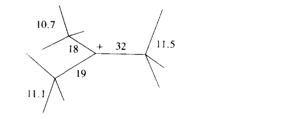
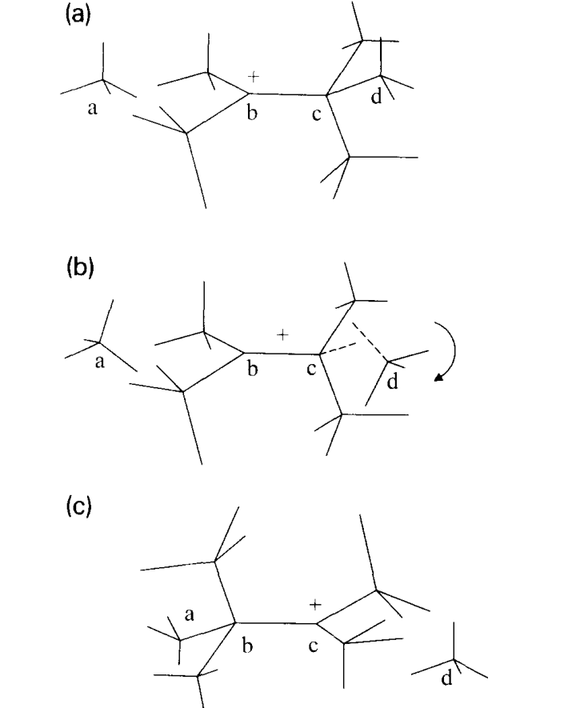

# The Grotthuss mechanism

**中文题名 / Chinese title:** Grotthuss 机制

**Zotero key:** 4TZTPZVW
**Attachment key:** RGLS7FU5
**Journal / 期刊:** Chemical Physics Letters
**Publication date / 发表日期:** 1995-10
**DOI:** 10.1016/0009-2614(95)00905-J
**Collections / 原分组:** 02课题 / 质子转移
**Task date / 推送日期:** 2026-07-20

## Why This Paper / 为什么选这篇

**English:** This classic perspective confronts competing explanations of anomalous proton mobility and proposes a mechanistic sequence of hydrogen-bond cleavage and formation. It is the conceptual origin point for the modern structural-diffusion language used throughout aqueous proton transport.

**中文:** 这篇经典观点文献正面比较了异常质子迁移率的不同解释，并提出由氢键断裂与形成组成的机制序列。它是现代水相质子传输中“结构扩散”语言的重要概念起点。

## Terminology / 术语表

| English | 中文 | Note |
| --- | --- | --- |
| Grotthuss mechanism | Grotthuss 机制 | Structural diffusion through hydrogen-bond rearrangement. |
| prototropic mobility | 质子迁移性 | Transport mobility arising from proton transfer rather than molecular diffusion alone. |
| hydrogen-bond cleavage | 氢键断裂 | Breaking of a hydrogen-bond contact. |
| hydrogen-bond formation | 氢键形成 | Formation of a new hydrogen-bond contact. |
| H9O4+ | H9O4+ 水合构型 | Eigen-type hydrated-proton motif. |
| H5O2+ | H5O2+ 水合构型 | Zundel-type hydrated-proton motif. |

## Reading Guide / 读前导读

**English:** Keep the paper historical but technical: identify what experimental observables each candidate mechanism must explain, then follow how the proposed H9O4+ to H5O2+ isomerization cycle connects hydrogen-bond rearrangement to transport.

**中文:** 阅读时既要保留其历史位置，也要抓住技术问题：先辨认每种候选机制必须解释哪些实验量，再跟随作者提出的 H9O4+ 与 H5O2+ 异构化循环，理解氢键重排如何连接到传输。

## Page Index / 页码索引

| Page | Source blocks |
| --- | --- |
| 1 | S001, S002, S003, S004, S005, S006, S007, S008, S009, S010, S011 |
| 2 | S012, S013, S014, S015, S016, S017, S018, S019, S020, S021, S022, S023 |
| 3 | S024, S025, S026, S027, S028, S029, S030, S031, S032, S033, S034, S035 |
| 4 | S036, S037, S038, S039, S040, S041, S042, S043, S044, S045, S046 |
| 5 | S047, S048, S049, S050, S051, S052, S053, S054, S055, S056, S057, S058, S059, S060, S061, S062 |
| 6 | S063, S064, S065, S066, S067, S068, S069, S070, S071, S072, S073, S074 |
| 7 | S075, S076, S077, S078, S079, S080, S081, S082, S083, S084, S085, S086, S087, S088, S089, S090 |

## Full Bilingual Reader / 全文逐段中英对照

### Page 1 / 第 1 页

**Source:** p.1 S001

**Original:** The Grotthuss mechanism

**中文翻译:** 格罗萨斯机制

**Source:** p.1 S002

**Original:** Department of Physical Chemistry and the Fritz Haber Research Center, The Hebrew University, Jerusalem 91904, Israel

**中文翻译:** 希伯来大学物理化学系和弗里茨·哈伯研究中心，以色列耶路撒冷 91904

**Source:** p.1 S003

**Original:** Received 13 April 1995; in final form 31 July 1995

**中文翻译:** 1995 年 4 月 13 日收稿；最终形式 1995 年 7 月 31 日

**Source:** p.1 S004

**Original:** Abstract

**中文翻译:** 抽象的

**Source:** p.1 S005

**Original:** Suggested mechanisms for proton mobility are confronted with experimental findings and quantum mechanical calculations, indicating that no model is consistent with the existing data. It is suggested that the molecular mechanism behind prototropic mobility involves a periodic series of isomerizations between H90 + and H50 +, the first triggered by hydrogen-bond cleavage of a second-shell water molecule and the second by the reverse, hydrogen-bond formation process.

**中文翻译:** 所提出的质子迁移率机制面临着实验结果和量子力学计算，这表明没有模型与现有数据一致。研究表明，质子迁移率背后的分子机制涉及 H90 + 和 H50 + 之间的一系列周期性异构化，第一次异构化由第二层水分子的氢键断裂引发，第二次异构化由相反的氢键形成过程引发。

**Source:** p.1 S006

**Original:** [ 13-18], and of Monte Carlo and molecular dynamics simulations [8,17,19], it may soon become possible to perform a sufficiently large calculation to check the proposed mechanism [ 18]. Reciprocally, insight from the following discussion may provide important guidelines for choosing relevant reaction coordinates in ab initio calculations.

**中文翻译:** [13-18]，以及蒙特卡罗和分子动力学模拟[8,17,19]，可能很快就可以进行足够大的计算来检查所提出的机制[18]。相反，以下讨论的见解可能为从头计算中选择相关反应坐标提供重要指导。

**Source:** p.1 S007

**Original:** Proton mobility in water is abnormally high [1 ]. At room temperature its limiting ionic conductance is about seven times that of a sodium cation, or approximately five times that of K +. The usual explanation is in terms of a sequence of proton-transfer reactions (proton hops) between water molecules ('prototropic mobility', 'Grotthuss mechanism' [2]). In spite of many years of hard research and heated discussions, the exact details of this fundamental process remain obscure [3-12].

**中文翻译:** 水中的质子迁移率异常高[1]。在室温下，其极限离子电导约为钠阳离子的七倍，或约为 K + 的五倍。通常的解释是水分子之间的一系列质子转移反应（质子跳跃）（“质子流动性”、“Grotthuss 机制”[2]）。尽管经过多年的艰苦研究和热烈讨论，这一基本过程的确切细节仍然模糊不清[3-12]。

**Source:** p.1 S008

**Original:** Two opposing limits of solvent involvement in prototropic mobility may be considered. Bernal and Fowler [4] pictured a proton hopping from a H30 + moiety to a freely rotating nearest-neighbor water molecule. This 'complete disorder' limit presents one example for an incoherent transport mechanism. Conway and co-workers [5] suggested a 'field-induced' water rotation: in the H2OH+... HOH complex, the water is forced to rotate its lone-pair towards the hydronium.

**中文翻译:** 可以考虑溶剂参与质子迁移率的两个相反的限制。 Bernal 和 Fowler [4] 描绘了质子从 H30 + 部分跳跃到自由旋转的最近邻水分子。这种“完全无序”极限是不相干传输机制的一个例子。 Conway 和同事 [5] 提出了“场诱导”水旋转：在 H2OH+...HOH 复合物中，水被迫将其孤对电子向水合氢旋转。

**Source:** p.1 S009

**Original:** The models suggested for prototropic conduction no doubt contain the right ingredients for its explanation. Unfortunately, none has the full mechanism correctly assembled. In analyzing these models, it will become obvious that they all contradict known experimental facts (some, it seems, were suggested in spite of experimental reality). By carefully considering a wide variety of literature data, improbable mechanisms are eliminated and a likely microscopic picture of the Grotthuss mechanism emerges. This discussion is timely, because with the rapid advance in quantum chemistry calculations of proton transfer in water

**中文翻译:** 毫无疑问，为质子传导提出的模型包含了对其解释的正确成分。不幸的是，没有人能够正确组装完整的机制。在分析这些模型时，很明显它们都与已知的实验事实相矛盾（有些模型似乎是不顾实验现实而提出的）。通过仔细考虑各种文献数据，排除了不可能的机制，并出现了格罗特胡斯机制的可能微观图景。这个讨论是及时的，因为随着水中质子转移的量子化学计算的快速进展

**Source:** p.1 S010

**Original:** The opposite extreme is that of a large, static water cluster within which an ordered hydrogen-bonded network exists. In a familiar picture ( 'the relay mech-

**中文翻译:** 相反的极端是一个巨大的静态水簇，其中存在有序的氢键网络。在一张熟悉的图片中（“继电器机械-

**Source:** p.1 S011

**Original:** 0009-2614/95/$09.50 (~ 1995 Elsevier Science B.V. All rights reserved SSDI 0009-2614(95)00905-1

**中文翻译:** 0009-2614/95/09.50 美元（~ 1995 Elsevier Science B.V. 保留所有权利 SSDI 0009-2614(95)00905-1

### Page 2 / 第 2 页

**Source:** p.2 S012

**Original:** anism' ), the proton hops in a concerted fashion across a whole array of water molecules

**中文翻译:** anism' ），质子以协调一致的方式跨越整个水分子阵列

**Source:** p.2 S013

**Original:** H c-~ H c-¥ H c-~ H HOH + ... OH ... OH ... OH ~ (1)

**中文翻译:** H c-~ H c-¥ H c-~ H HOH + ... OH ... OH ... OH ~ (1)

**Source:** p.2 S014

**Original:** The rate-limiting step could then be either the proton motion itself or a 'structural diffusion' process of adding water molecules to the periphery of the cluster

**中文翻译:** 那么，限速步骤可以是质子运动本身，也可以是向团簇外围添加水分子的“结构扩散”过程

**Source:** p.2 S015

**Original:** Such pictures of proton mobility dominate physical chemistry textbooks. For example, Fig. 26.4 in Atkins shows a fast relay mechanism coupled to a rate-limiting 'structural diffusion' step involving a Conway-like tbrced water rotation [20]. More recent discussions of proton mobility suggest proton delocalization across large water clusters [ 10,11 ]. There is ample evidence suggesting that all the above mechanisms are wrong. Such evidence is surveyed below.

**中文翻译:** 这些质子迁移率的图片在物理化学教科书中占据主导地位。例如，Atkins 中的图 26.4 显示了一种与限速“结构扩散”步骤耦合的快速中继机制，其中涉及类似康威的 tbrced 水旋转 [20]。最近关于质子迁移率的讨论表明质子在大型水团簇中离域[10,11]。有充分的证据表明上述所有机制都是错误的。下面对此类证据进行了调查。

**Source:** p.2 S016

**Original:** 2.1. Free rotors and water structure

**中文翻译:** 2.1.自由转子和水结构

**Source:** p.2 S017

**Original:** Water is not a free rotor, but rather tightly involved in hydrogen bonding. The local structure around any given water molecule tends to be tetrahedral. There are roughly four water molecules in the first soivation shell, two donating and two accepting hydrogen bonds from the central water. X-ray diffraction yields a clear description of the oxygen-oxygen radial distribution function [ 21 ]. Its peaks correspond to nearest-neighbors and next-nearest-neighbors in tetrahedral symmetry. These peaks diminish in amplitude with increasing temperature, indicating a decreasing hydrogen-bonding content. There is evidence for the persistence of even larger ice-structure motifs in liquid water [22]. Likewise, Raman experiments [23] and molecular-dynamics simulations [ 19] show that in liquid water most molecules are involved in either three or four hydrogen bonds, with the enhancement of tetrahedral symmetry at lower temperatures.

**中文翻译:** 水不是自由转子，而是紧密地参与氢键结合。任何给定水分子周围的局部结构往往是四面体。第一个水化壳中大约有四个水分子，两个来自中心水的供氢键和两个接受氢键。 X 射线衍射清晰地描述了氧-氧径向分布函数 [21]。其峰值对应于四面体对称性中的最近邻和次近邻。这些峰的幅度随着温度的升高而减小，表明氢键含量降低。有证据表明更大的冰结构图案在液态水中持续存在[22]。同样，拉曼实验[23]和分子动力学模拟[19]表明，在液态水中，大多数分子都涉及三个或四个氢键，并且在较低温度下四面体对称性增强。

**Source:** p.2 S018

**Original:** On the other hand, water molecule rotation does correlate with proton mobility. Current interpretations of Raman-induced Kerr effect [23], Rayleigh light scattering [ 24] and inelastic neutron scattering [ 25 ] suggest that water molecule reorientation takes 1-2 ps at room temperature. Proton hopping times as obtained by NMR and 170 resonance [26] are of similar magnitude, ~-p ~ 1.5 ps. These times can explain the abnormal proton mobility, see below. Thus while water molecule reorientation may be an important ingredient in proton mobility, the mechanism is not likely to involve free water rotors as suggested by Bernal and Fowler [4].

**中文翻译:** 另一方面，水分子旋转确实与质子迁移率相关。目前对拉曼诱导克尔效应 [23]、瑞利光散射 [24] 和非弹性中子散射 [25] 的解释表明，水分子在室温下重新定向需要 1-2 ps。通过 NMR 和 170 共振 [26] 获得的质子跳跃时间具有相似的数量级，〜-p〜1.5 ps。这些时间可以解释异常的质子迁移率，见下文。因此，虽然水分子重新定向可能是质子迁移率的一个重要因素，但该机制不太可能像 Bernal 和 Fowler 所建议的那样涉及自由水转子 [4]。

**Source:** p.2 S019

**Original:** 2.2. The relay mechanism and incoherent proton mobility

**中文翻译:** 2.2.中继机制和非相干质子迁移率

**Source:** p.2 S020

**Original:** The persistence of structural motifs in liquid water does not mean that the relay mechanism is correct and that protons hop in a concerted fashion across large water clusters, Eq. ( 1 ). Such a mechanism contradicts so many experimental data that one wonders how it survived that long.

**中文翻译:** 液态水中结构基序的持续存在并不意味着中继机制是正确的，也不意味着质子以协调一致的方式跨越大型水簇，方程： （1）。这种机制与许多实验数据相矛盾，以至于人们想知道它是如何存活这么久的。

**Source:** p.2 S021

**Original:** 2.2.1. Proton mobility is incoherent

**中文翻译:** 2.2.1.质子迁移率不相干

**Source:** p.2 S022

**Original:** The proton does not delocalize over large water clusters.

**中文翻译:** 质子不会在大水团簇上离域。

**Source:** p.2 S023

**Original:** (i) The relay mechanism predicts that proton mobility increases with increasing size of hydrogenbonded clusters. Thus mobility should be highest in ice [6], then in water at low temperatures and pressures. Although the issue of proton conductivity in ice is still unsettled, it appears now to be about a factor of two slower than in super-cooled water of equal temperature [27,28]. The evidence for proton mobility in water is unequivocal, it increases with increasing temperature and pressure [29]. That the fraction of hydrogen-bonded water decreases with increasing temperature is clear intuitively as well as from simulations [19] and experiment [23]. Near atmospheric pressures the hydrogen-bond content decreases with increasing pressure [23 ], apparently because of transitions from an open water structure to a closed form with fewer interlayer hydrogen bonds (ii) The NMR proton hopping times, 7-p, account for the abnormal proton mobility if one assumes that hopping is across a single water molecule at a time. Using the Einstein relation for mobility in three dimensions

**中文翻译:** (i) 中继机制预测质子迁移率随着氢键团簇尺寸的增加而增加。因此，在低温和压力下，冰中的流动性应该是最高的[6]，然后是水中。尽管冰中的质子传导性问题仍悬而未决，但现在看来它比同等温度的过冷水中的质子传导性慢约两倍[27,28]。质子在水中的迁移率的证据是明确的，它随着温度和压力的升高而增加[29]。直观上以及从模拟[19]和实验[23]中可以清楚地看出，氢键水的比例随着温度的升高而降低。在大气压附近，氢键含量随着压力的增加而减少[23]，显然是因为从开放的水结构转变为层间氢键较少的封闭形式(ii)如果假设跳跃一次跨越单个水分子，核磁共振质子跳跃时间7-p可以解释异常的质子迁移率。使用爱因斯坦关系计算三维移动性

### Page 3 / 第 3 页

**Source:** p.3 S024

**Original:** Meiboom was able to estimate a reasonable proton diffusion coefficient [26]. Let us slightly modify this estimate by taking the hopping length as l = 2.5/~, the hydrogen-bond length between water and H30 + [ 8], rather than the water-water distance of 2.8/~. Using rp = 1.5 ps gives D = 7 × 10 -5 cm2/s, a very reasonable estimate for the abnormal proton mobility at room temperature (subtract from the proton diffusion coefficient, 9.3 x 10 -5 cm2/s, the water self-diffusion coefficient, 2.3 x 10 -5 cm2/s [1]). Even the most modest coherent effect, with proton hopping across just two water molecules, already leads to a factor of

**中文翻译:** Meiboom 能够估计合理的质子扩散系数 [26]。让我们稍微修改一下这个估计，将跳跃长度设为 l = 2.5/~，即水和 H30 + 之间的氢键长度 [8]，而不是水-水距离 2.8/~。使用 rp = 1.5 ps 得出 D = 7 × 10 -5 cm2/s，这是对室温下异常质子迁移率的非常合理的估计（减去质子扩散系数 9.3 x 10 -5 cm2/s，水自扩散系数 2.3 x 10 -5 cm2/s [1]）。即使是最温和的相干效应，即质子仅跨越两个水分子，也已经导致了

**Source:** p.3 S025

**Original:** 4 in the predicted mobility. Thus proton mobility is best described as an incoherent, Markovian hopping process.

**中文翻译:** 4 预测的流动性。因此，质子迁移率最好被描述为不相干的马尔可夫跳跃过程。

**Source:** p.3 S026

**Original:** (iii) Additional evidence for the Markovian nature of the solvated proton comes from excited-state proton transfer to solvent [ 30]. These transient fluorescence measurements, having time resolution of about 50 ps, can be explained quantitatively by the timedependent Smoluchowski equation describing proton diffusion in a field of force. The diffusive behavior persists under a wide variety of conditions: solvent composition, salt concentrations and pH values [ 30]. On even shorter timescales, femtosecond geminate recombination of proton and solvated electron in pure liquid water is interpreted [31] by diffusive proton motion on timescales of just a few ps.

**中文翻译:** (iii) 溶剂化质子马尔可夫性质的额外证据来自激发态质子转移到溶剂中[30]。这些瞬态荧光测量的时间分辨率约为 50 ps，可以通过描述力场中质子扩散的时间相关 Smoluchowski 方程进行定量解释。扩散行为在多种条件下持续存在：溶剂成分、盐浓度和 pH 值 [30]。在更短的时间尺度上，纯液态水中质子和溶剂化电子的飞秒双子重组可以通过几皮秒时间尺度上的扩散质子运动来解释[31]。

**Source:** p.3 S027

**Original:** 2.2.2. Proton motion is not rate limiting

**中文翻译:** 2.2.2.质子运动不受速率限制

**Source:** p.3 S028

**Original:** The possibility that proton motion within clusters is rate-limiting may be ruled-out by several considerations:

**中文翻译:** 团簇内质子运动受到速率限制的可能性可以通过以下几个考虑因素来排除：

**Source:** p.3 S029

**Original:** (i) The deuterium isotope effect on prototropic mobility is rather small, 1.4 at room temperature [ 1 ]. Conway and co-workers [ 5 ] estimated that proton tunneling should lead to a minimal isotope effect of 2. Westheimer and Melander have suggested that kinetic isotope effects (KIEs) are maximal for the symmetric, AG = 0, reaction [32]. Proton hopping between two water molecules is expected to correspond to this symmetric limit. In this case, when a light particle is transferred between two heavy particles, the KIE is particularly large. As seen in Fig. 7 of Ref. [33], the maximal KIE for reaction series involving proton transfer is 6-10. The small isotope effect on proton mobility suggests that the reaction coordinate does not involve proton motion.

**中文翻译:** (i) 氘同位素对质子迁移率的影响相当小，在室温下为 1.4 [1]。 Conway 和同事 [5] 估计质子隧道效应应导致同位素效应最小为 2。Westheimer 和 Melander 认为，对于 AG = 0 的对称反应，动力学同位素效应 (KIE) 最大 [32]。两个水分子之间的质子跳跃预计对应于这个对称极限。在这种情况下，当一个轻粒子在两个重粒子之间转移时，KIE特别大。如图 7 所示。 [33]，涉及质子转移的反应系列的最大KIE为6-10。同位素对质子迁移率的影响较小表明反应坐标不涉及质子运动。

**Source:** p.3 S030

**Original:** (ii) While the activation energy of proton mobility is 2-3 kcal/mol [ 1 ], proton motion within symmetric entities such as HsO~- may be activationless. Quantum mechanical calculations show that the potential along the proton coordinate in H20... H + ... OH2 has a barrier only if the O-O distance exceeds its equilibrium distance of 2.39/~ [ 16]. At the equilibrium distance, there is no barrier for proton transfer at all [ 13 ]. The proton resides in a flat minimum inbetween the oxygens.

**中文翻译:** (ii) 虽然质子迁移率的活化能为 2-3 kcal/mol [1]，但对称实体（例如 HsO~-）内的质子运动可能是无活化的。量子力学计算表明，只有当 O-O 距离超过其平衡距离 2.39/~ 时，H20...H + ...OH2 中沿质子坐标的电势才具有势垒[16]。在平衡距离处，质子转移根本不存在障碍[13]。质子位于氧原子之间的平坦最小值处。

**Source:** p.3 S031

**Original:** (iii) Intramolecular proton transfer, which may be limited by proton tunneling, can be much faster than the 1-2 ps timescale for proton hopping in water. Consider just one model system, 3-hydroxyflavone [34]. Direct proton transfer, observed in non-hydrogenbonded solvents, or proton hopping across a single solvent bridge (e.g., in methanol) may be faster than 100 fs. Interestingly, in hydrogen-bonded solvents (under conditions that the donor-acceptor are unbridged) intramolecular proton transfer in 3hydroxyflavone slows down considerably [ 34]. When solvent conformation is right for proton transfer, its rate can be an order of magnitude faster than observed in mobility measurements.

**中文翻译:** (iii) 分子内质子转移可能受到质子隧道效应的限制，可能比水中质子跳跃的 1-2 皮秒时间尺度快得多。仅考虑一种模型系统，3-羟基黄酮 [34]。在非氢键溶剂中观察到的直接质子转移或跨越单个溶剂桥（例如在甲醇中）的质子跳跃可能快于 100 fs。有趣的是，在氢键溶剂中（在供体-受体未桥联的条件下），3-羟基黄酮中的分子内质子转移显着减慢[34]。当溶剂构象适合质子转移时，其速率可能比迁移率测量中观察到的速率快一个数量级。

**Source:** p.3 S032

**Original:** 2.2.3. Cluster-growth is not rate-limiting

**中文翻译:** 2.2.3.集群增长不受速率限制

**Source:** p.3 S033

**Original:** To the contrary, cluster degradation may be the rate-determining step: Eigen has suggested a relay mechanism with 'structural diffusion' as the ratelimiting step [6]. However, the hydrogen-bond content of water is so high, every molecule participating in 3-4 hydrogen bonds [ 19,23], that the whole body of water may be considered as one huge cluster. Since hydrogen-bond connectivity in liquid water is well above the percolation threshold, it is not clear why the formation of new hydrogen bonds at the periphery of water clusters should be rate-limiting.

**中文翻译:** 相反，集群退化可能是速率决定步骤：Eigen 提出了一种以“结构扩散”作为速率限制步骤的中继机制 [6]。然而，水的氢键含量如此之高，每个分子都参与3-4个氢键[19,23]，以至于整个水体可以被视为一个巨大的团簇。由于液态水中的氢键连通性远高于渗透阈值，因此尚不清楚为什么在水簇外围形成新的氢键会受到速率限制。

**Source:** p.3 S034

**Original:** 2.2.4. The rate-limiting step is hydrogen-bond cleavage

**中文翻译:** 2.2.4.限速步骤是氢键断裂

**Source:** p.3 S035

**Original:** Proton mobility correlates with hydrogen-bond cleavage rather than with its formation, as suggested by the fact that it increases with decreasing hydrogenbond content of water, i.e. at higher temperatures and pressures [29]. The NMR hopping times [26] agree with single molecule reorientation times [23-25], a

**中文翻译:** 质子迁移率与氢键裂解相关，而不是与氢键形成相关，正如质子迁移率随着水氢键含量的减少而增加（即在较高温度和压力下）的事实所表明的那样[29]。 NMR 跳跃时间 [26] 与单分子重新定向时间 [23-25] 一致，a

### Page 4 / 第 4 页

**Source:** p.4 S036

**Original:** process requiring hydrogen-bond cleavage.

**中文翻译:** 需要氢键断裂的过程。

### Fig 1

**Placed near:** p.4 S036
**Source:** p.4 C001

**Original caption:** Fig. 1. The structure of H90 +, stressing the different coordination states of central and peripheral oxygens. Each vertex represents an oxygen, and each line a hydrogen bond. Hydrogen atoms are not shown. Assuming a cluster with three second shell waters, the numbers (in increasing magnitude) are the sequential bond-dissociation enthalpies (in kcal/mol) from mass-spectrometric data I351.

**中文图注:** 图1. H90 + 的结构，强调中心和外围氧的不同配位状态。每个顶点代表一个氧，每条线代表一个氢键。未显示氢原子。假设簇具有三个第二壳层水，数字（数量级递增）是来自质谱数据 I351 的连续键解离焓（以 kcal/mol 为单位）。

**Reading note / 读图提示:** Inspect the whole crop, including panel letters, axes, legends and units, together with the adjacent source paragraph. / 请将完整裁剪图中的子图标记、坐标轴、图例和单位与相邻原文段落一起阅读。

**Source:** p.4 S037

**Original:** The temperature dependence of the NMR [ 10] and proton mobility [1] data is similar, with an activation energy of 2-3 kcal/mol. This agrees with the in situ hydrogen-bond strength of 2.6 kcal/mol obtained from Raman experiments [23]. It represents the directional component of the hydrogen-bond enthalpy, associated with water rotation. An additional 2.6 kcal/mol is associated with isotropic electrostatic interactions, leading to a total enthalpy of about 5.2 kcal/mol per hydrogen bond, in agreement with the

**中文翻译:** NMR [10] 和质子迁移率 [1] 数据的温度依赖性相似，活化能为 2-3 kcal/mol。这与拉曼实验获得的原位氢键强度 2.6 kcal/mol 一致 [23]。它代表与水旋转相关的氢键焓的方向分量。额外的 2.6 kcal/mol 与各向同性静电相互作用相关，导致每个氢键的总焓约为 5.2 kcal/mol，与

**Source:** p.4 S038

**Original:** 10.5 kcal/mol enthalpy of vaporization of water.

**中文翻译:** 10.5 kcal/mol 水的汽化焓。

**Source:** p.4 S039

**Original:** The 1.4 D/H isotope effect on proton mobility [ 1 ] can also be interpreted as arising from water reorientation that leads to hydrogen-bond cleavage. Rotation around the heavy oxygen is a nearly pure hydrogen motion, so that the isotope effect should be given by the mass ratio, V/-~o/mH = x/2. The OD... O versus OH... O enthalpy difference is thus expected to be AAH = ½RTIn 2 = 0.2 kcal/mol at room temperature. This prediction has recently been verified experimentally 123 ] : the temperature-dependence of the Raman OD and OH stretch bands gives AH = 2.8 kcal/mol and 2.6 kcal/mol for deuteriumand hydrogen-bond enthalpies, respectively. While conservative error estimates on AH are themselves +0.2 kcal/mol, the difference reflected in AAH is real.

**中文翻译:** 1.4 D/H 同位素对质子迁移率的影响 [1] 也可以解释为水重新取向导致氢键断裂。围绕重氧的旋转几乎是纯氢运动，因此同位素效应应由质量比 V/-~o/mH = x/2 给出。因此，室温下 OD...O 与 OH...O 的焓差预计为 AAH = 1/2RTIn 2 = 0.2 kcal/mol。这一预测最近已通过实验得到验证 123]：拉曼 OD 和 OH 拉伸带的温度依赖性分别给出氘和氢键焓的 AH = 2.8 kcal/mol 和 2.6 kcal/mol。虽然 AH 的保守误差估计本身为 +0.2 kcal/mol，但 AAH 反映的差异是真实的。

**Source:** p.4 S040

**Original:** 2.3. Proton solvation and proton mobility

**中文翻译:** 2.3.质子溶剂化和质子迁移率

**Source:** p.4 S041

**Original:** All models are incompatible with elementary considerations of proton solvation. Unlike water which is predominantly tetrahedral the solvated H3 O+ cation is a nearly plane-trigonal complex (unsolvated, gasphase H30 + is pyramidal [8] ). Unlike water, which is involved in 4 hydrogen bonds as both a donor and an acceptor, the positive H30 + disallows hydrogenbonding to its oxygen. This cation is best described as donating three hydrogen bonds to 3 water molecules in its first solvation shell. This forms the 'Eigen cation'

**中文翻译:** 所有模型都不符合质子溶剂化的基本考虑。与主要为四面体的水不同，溶剂化的 H3 O+ 阳离子是一种近乎平面三角的络合物（未溶剂化的气相 H30 + 是金字塔形的 [8]）。与作为供体和受体参与 4 个氢键的水不同，正 H30 + 不允许与其氧形成氢键。这种阳离子最好的描述是在其第一个溶剂化壳层中向 3 个水分子提供三个氢键。这形成了“本征阳离子”

**Source:** p.4 S042

**Original:** [6], H90~, as depicted in Fig. 1.

**中文翻译:** [6]，H90~，如图1所示。

**Source:** p.4 S043

**Original:** How does the extra stability of this cation arise [ 13 ] ? Gas-phase mass-spectrometric data [ 35 ] show that water ligands in the first solvation-sheli are more tightly bound than those in the second and subsequent shells. The enthalpies for sequential removal of water molecules from gas-phase clusters are summarized in Fig. 1. Although these numbers cannot be directly transferred to bulk solution, it is clear that hydrogen bonding to H30 + is considerably stronger than in bulk water. The extra-strong hydrogen bonding correlates with shorter OH... O distances, 2.55 compared with 2.8/~ in bulk water. A proton mobility mechanism that involves the rupture of even one of these three bonds will lead to an activation energy exceeding the observed 2-3 kcal/mol value. The first solvation shell of H30 + must remain intact during the proton transfer act [9].

**中文翻译:** 这种阳离子的额外稳定性是如何产生的[13]？气相质谱数据[35]表明，第一个溶剂化壳中的水配体比第二个及后续壳中的水配体结合得更紧密。图 1 总结了从气相簇中连续去除水分子的焓。虽然这些数字不能直接转移到本体溶液中，但很明显，与 H30 + 的氢键比在本体水中的氢键强得多。超强的氢键与较短的 OH...O 距离相关，在散装水中为 2.55，而在散装水中为 2.8/~。质子迁移机制即使涉及这三个键之一的断裂也会导致活化能超过观察到的 2-3 kcal/mol 值。 H30 + 的第一个溶剂化壳在质子转移过程中必须保持完整[9]。

**Source:** p.4 S044

**Original:** Although the above trends are anything but surprising, they have been largely ignored. Hticket, for example, has suggested the rotation of H30 + as the rate-limiting step [ 3]. This requires the rupture of all three hydrogen bonds in the first solvation shell. In addition to the huge activation energy, such a rotation is quite unnecessary, as the three hydrogens in H30 ÷ are equivalent (electronic reorganization being much faster than nuclear motion) and any one of them may serve as the mobile proton [5]. The Bernal-Fowler

**中文翻译:** 尽管上述趋势并不令人惊讶，但它们在很大程度上被忽视了。例如，Hticket 建议将 H30 + 轮换作为限速步骤 [3]。这需要第一个溶剂化壳中的所有三个氢键断裂。除了巨大的活化能之外，这样的旋转是完全没有必要的，因为H30÷中的三个氢是等价的（电子重组比核运动快得多）并且其中任何一个都可以充当移动质子[5]。伯纳尔-福勒

**Source:** p.4 S045

**Original:** [4] and Conway models [5], assume that a water in the first hydration shell rotates either freely [4] or through an angle of 110 ° [5]. This requires not only the rupture of one of the strong hydrogen bonds to H30 +, but one or two additional 'ordinary' hydrogen bonds to allow rotation through such large angles. The activation energy for this process may easily exceed

**中文翻译:** [4]和康威模型[5]，假设第一个水化壳中的水自由旋转[4]或通过110°的角度[5]。这不仅需要与 H30 + 的强氢键之一断裂，还需要一两个额外的“普通”氢键以允许旋转如此大的角度。该过程的活化能很容易超过

**Source:** p.4 S046

**Original:** The proton-relay mechanism is incompatible with solvation requirements for either a gas-phase cluster or a solvated H90~-. In the first case the proton cannot transfer from the center to one of the three peripheral water molecules because it will become solvated by one instead of three hydrogen bonds. Ab i'nitio calcu-

**中文翻译:** 质子传递机制与气相簇或溶剂化 H90~- 的溶剂化要求不相容。在第一种情况下，质子无法从中心转移到三个外围水分子中的一个，因为它将被一个而不是三个氢键溶剂化。从头计算

### Page 5 / 第 5 页

**Source:** p.5 S047

**Original:** lations indeed report [ 13] that such a process is uphill by over 13 kcal/mol. The proton is 80% localized at the central H3 O+ unit [13]. When the H90 + is solvated, the tetrahedral coordination of the first-shell water ligands (Fig. 1 ) is unfavorable for proton solvation. Cartoons of hydrogen-bonded networks, which omit the three-dimensional structure as well as some of the hydrogen bonds, may at first look convincing. If, however, one adds the missing hydrogen bonds to the relay scheme of Eq. ( 1 ),

**中文翻译:** 相关研究确实报告[13]，这样的过程需要消耗超过 13 kcal/mol 的能量。质子 80% 位于中心 H3 O+ 单元 [13]。当H90 + 溶剂化时，第一层水配体的四面体配位（图1）不利于质子溶剂化。氢键网络的卡通省略了三维结构以及一些氢键，乍一看可能令人信服。然而，如果将缺失的氢键添加到方程（1）的中继方案中。 ( 1 ),

**Source:** p.5 S048

**Original:** H H H I I ... O-H ... O-H it becomes clear that the oxygen sites are inequivalent: all are 4-coordinated except the hydronium which is 3-coordinated, so that no relay is possible.

**中文翻译:** H H H I I ... O-H ... O-H 很明显，氧位点是不等价的：除了水合氢位点是 3 配位之外，所有氧位点都是 4 配位，因此不可能进行中继。

**Source:** p.5 S049

**Original:** Zundel and Fritsch [7] stressed the importance of the HsO~ cation over that of H90~. The proton inbetween the two water molecules shows extremely high polarizability, leading to the observation of an IR continuum [7]. This 'Zundel polarization' has been reproduced in ab initio calculations [ 15]. Driven by fluctuations in the water environment which momentarily makes one or the other oxygen more stable, the structure seems to fluctuate between H90 + and H50~-

**中文翻译:** Zundel 和 Fritsch [7] 强调了 HsO~ 阳离子相对于 H90~ 的重要性。两个水分子之间的质子表现出极高的极化性，从而可以观察到红外连续谱[7]。这种“Zundel 极化”已在从头计算中重现[15]。在水环境波动的驱动下，暂时使一种或另一种氧变得更加稳定，结构似乎在 H90 + 和 H50~- 之间波动。

**Source:** p.5 S050

**Original:** [ 18 ]. While proton polarization undoubtedly plays an important role in proton mobility, it can only be part of the mechanism. First, the triply coordinated H90~- is probably the more stable protonated cation [ 16]. Thus, H50~- is an appropriate symmetric structure for the intrinsic transfer step [16], but it can only be an intermediate along the reaction coordinate for prototropic motion. Second, the above picture misses the pivotal role played by hydrogen-bond cleavage in the rate-determining step.

**中文翻译:** [18]。虽然质子极化无疑在质子迁移率中发挥着重要作用，但它只能是该机制的一部分。首先，三重配位的 H90~- 可能是更稳定的质子化阳离子 [16]。因此，H50~-是适合本征转移步骤的对称结构[16]，但它只能是沿质子运动反应坐标的中间体。其次，上图忽略了氢键断裂在速率决定步骤中发挥的关键作用。

**Source:** p.5 S051

**Original:** The above discussion suggests the following criteria for an acceptable molecular mechanism of prototropic mobility:

**中文翻译:** 上述讨论提出了质子迁移率可接受的分子机制的以下标准：

**Source:** p.5 S052

**Original:** - Proton mobility is an incoherent proton hopping process.

**中文翻译:** - 质子迁移率是一种不相干的质子跳跃过程。

**Source:** p.5 S053

**Original:** - The actual proton motion is much faster than solvent reorganization•

**中文翻译:** - 实际的质子运动比溶剂重组快得多•

**Source:** p.5 S054

**Original:** - The rate-limiting step involves cleavage of a single, ordinary hydrogen bond with an activation energy of about 2.6 kcal/mol and a deuterium isotope effect of 1.4.

**中文翻译:** - 限速步骤涉及单个普通氢键的裂解，其活化能约为 2.6 kcal/mol，氘同位素效应为 1.4。

**Source:** p.5 S055

**Original:** - The three hydrogen bonds in the first solvation shell of H30 + cannot participate in this step.

**中文翻译:** - H30 + 第一个溶剂化壳中的三个氢键不能参与此步骤。

**Source:** p.5 S056

**Original:** - During the elementary transfer step itself, the donor and acceptor water molecules with their solvation shells present equivalent structures.

**中文翻译:** - 在基本转移步骤本身中，供体和受体水分子及其溶剂化壳呈现出相同的结构。

**Source:** p.5 S057

**Original:** With these restrictions in mind, it is almost selfevident what the Grotthuss mechanism might be.

**中文翻译:** 考虑到这些限制，格罗萨斯机制是什么几乎是不言而喻的。

**Source:** p.5 S058

**Original:** Consider a triply coordinated H30 +, i.e. the H90 + cation, as the reactant state. Since the rate-limiting step involves cleavage of a hydrogen bond, but not one in the first solvation shell, it is natural to consider hydrogen-bond cleavage in the second solvation shell as the rate-limiting step. This leads to isomerization of the H90~- cation into H50~-, namely

**中文翻译:** 考虑三重配位的 H30 +，即 H90 + 阳离子，作为反应物状态。由于限速步骤涉及氢键的裂解，但不是第一个溶剂化壳中的氢键裂解，因此很自然地将第二个溶剂化壳中的氢键裂解视为限速步骤。这导致H90~-阳离子异构化为H50~-，即

**Source:** p.5 S059

**Original:** Oa ODH + ... Oc ...HOdH. H H H

**中文翻译:** Oa ODH + ... Oc ...HOdH。哈哈哈

**Source:** p.5 S060

**Original:** This is depicted in Fig. 2. For clarity, four of the oxygen atoms are identified by corresponding letters.

**中文翻译:** 如图 2 所示。为了清楚起见，四个氧原子用相应的字母标识。

**Source:** p.5 S061

**Original:** Initially, the proton is localized on Ob and H2Oc is one of the three water ligands in the 1 st solvation shell, Fig. 2a. Thus ObH... Oc is an extra-strong bond which cannot easily break. H2Oc has at most one hydrogen bond donating ligand, H2Od, which is second-shell with respect to Ob and thus of ordinary strength. The cleavage of the Oc...HOd bond is postulated to be the rate-limiting step, Fig. 2b. The reorientation of H2Od may be quite small (much smaller than the 110 ° rotation required by the Conway mechanism [5] ), so that just a single hydrogen bond is broken. This may cost 2-3 kcal/mol and take around 1 ps at room temperature.

**中文翻译:** 最初，质子位于 Ob 上，H2Oc 是第一个溶剂化壳层中的三个水配体之一，图 2a。因此，ObH...Oc 是一种不易断裂的超强键。 H2Oc 至多有一个氢键供体配体 H2Od，它是 Ob 的第二层，因此具有普通强度。 Oc...HOd 键的断裂被假定为限速步骤，图 2b。 H2Od的重新取向可能相当小（远小于康威机制所需的110°旋转[5]），因此只有一个氢键被破坏。这可能会花费 2-3 kcal/mol，并且在室温下需要大约 1 ps。

**Source:** p.5 S062

**Original:** Following bond cleavage, one expects ultrafast (fs) readjustment of bond angles and bond lengths to form H2Ob. • • H + • • • OcH2. For example, the Ob... Oc distance should shrink by some 0.15 A, from 2.55/~ in H90~- to the 2.4/k distance of HsO~- (these are gasphase values). At the same time, the distances between

**中文翻译:** 键断裂后，预计键角和键长会超快 (fs) 重新调整，形成 H2Ob。 • • H + • • • OcH2。例如，Ob...Oc 距离应缩小约 0.15 A，从 H90~- 中的 2.55/~ 到 HsO~- 中的 2.4/k 距离（这些是气相值）。同时，之间的距离

### Page 6 / 第 6 页

**Source:** p.6 S063

**Original:** Ob and the remaining two oxygens are expected to increase from 2.55/~, to below 2.8/~. Subsequently, fast fluctuations of surrounding water dipoles momentarily stabilize Ob or Oc, leading to large proton polarizabilities within this complex [7,15]. Eventually, one of these fluctuations couples to reorientation of the H2Oa water, which donates the fourth hydrogen bond to Oh. The proton is now localized on Oc, Fig, 2c. The HsO~ has re-isomerized to a H90 + cation, centered on a neighboring water molecule. The proton has effectively hopped incoherently across the O-O distance in H904 ~.

**中文翻译:** Ob和其余两个氧预计将从2.55/~增加到2.8/~以下。随后，周围水偶极子的快速波动会暂时稳定 Ob 或 Oc，导致该复合物内质子极化率较大 [7,15]。最终，这些波动之一与 H2Oa 水的重新定向结合在一起，从而将第四个氢键提供给 Oh。质子现在位于 Oc，图 2c。 HsO~ 已重新异构化为 H90 + 阳离子，以邻近的水分子为中心。质子在 H904 ~ 中有效地非相干地跳跃穿过 O-O 距离。

**Source:** p.6 S064

**Original:** Proofs of the above mechanism are more likely to come from computational chemistry than from any single experiment. Thus, in their simulation of proton transfer from HCI to water, Ando and Hynes [ 17] have observed the cleavage of a second-shell hydrogen bond following proton transfer. Tuckerman et al.

**中文翻译:** 上述机制的证明更有可能来自计算化学而不是任何单个实验。因此，在模拟质子从 HCI 转移到水时，Ando 和 Hynes [17] 观察到质子转移后第二层氢键的断裂。塔克曼等人。

**Source:** p.6 S065

**Original:** [ 18 ] conducted ab initio molecular dynamics simulations on a 32-water molecule cluster using the Car-

**中文翻译:** [18]使用Car-对32个水分子簇进行从头算分子动力学模拟

**Source:** p.6 S066

**Original:** N. Agmon / Chemical Physics Leners 244 (1995) 456-462 461

**中文翻译:** N.阿格蒙 / 化学物理透镜 244 (1995) 456-462 461

**Source:** p.6 S067

**Original:** Parrinello density-functional technique. The animated trajectories are qualitatively consistent with the above mechanism. It would be interesting to map-out the complete reaction-coordinate and verify that the dominant barrier is in breaking the second-shell hydrogen bond.

**中文翻译:** Parrinello 密度泛函技术。动画轨迹在质量上与上述机制一致。绘制出完整的反应坐标并验证主要势垒是破坏第二壳层氢键将是很有趣的。

### Fig 2

**Placed near:** p.6 S067
**Source:** p.6 C002

**Original caption:** Fig. 2. A molecular mechanism for prototropic mobility. See text for detail.

**中文图注:** 图 2. 质子迁移的分子机制。详情请参阅文字。

**Reading note / 读图提示:** Inspect the whole crop, including panel letters, axes, legends and units, together with the adjacent source paragraph. / 请将完整裁剪图中的子图标记、坐标轴、图例和单位与相邻原文段落一起阅读。

**Source:** p.6 S068

**Original:** Concluding, proton migration may be envisioned as a process propelled by hydrogen-bond cleavage, taking place in front of the moving proton, and hydrogenbond formation in its back. If an allegoric description is required, it may be found in Moses crossing the sea, with waves parting before him and reclosing behind his track. It would be amusing if this understanding could be put to practical use. Could proton migration be speeded-up by a moving, hydrogenbond-cleaving IR wave? The 180 cm -I 'intermolecular' band, thought to involve hydrogen-bond stretch

**中文翻译:** 总之，质子迁移可以被设想为由氢键断裂推动的过程，发生在移动质子的前面，氢键形成在其后面。如果需要寓言式的描述，可以在摩西横渡大海时找到，波浪在他面前分开，又在他的足迹后面重新闭合。如果这种理解能够付诸实践，那就很有趣了。移动的氢键裂解红外波能否加速质子迁移？ 180 cm -I“分子间”带，被认为涉及氢键拉伸

**Source:** p.6 S069

**Original:** [ 23], might be a useful frequency to try.

**中文翻译:** [23]，可能是一个值得尝试的有用频率。

**Source:** p.6 S070

**Original:** Acknowledgement

**中文翻译:** 致谢

**Source:** p.6 S071

**Original:** I am grateful to Victoria Buch-Elber, J. Paul Devlin, Robert S. Eisenberg, Menachem Gutman, James T. Hynes, Gunnar Karlstr6m, Maurice M. Kreevoy, Klaus-Dieter Kreuer, Berta PerlmutterHayman, Steve Scheiner, Mark A. Rather, Michiel Sprik, George E. Walrafen and Georg Zundel for discussions, correspondence and remarks. Work supported in part by The Israel Science Foundation, administered by The Israel Academy of Sciences and Humanities. The Fritz Haber Research Center is supported by the Minerva Gesellschaft fiir die Forschung, Munich, Germany.

**中文翻译:** 感谢 Victoria Buch-Elber、J. Paul Devlin、Robert S. Eisenberg、Menachem Gutman、James T. Hynes、Gunnar Karlstr6m、Maurice M. Kreevoy、Klaus-Dieter Kreuer、Berta PerlmutterHayman、Steve Scheiner、Mark A.rath、Michiel Sprik、George E. Walrafen 和 Georg Zundel 的讨论、通信和评论。该工作部分得到以色列科学基金会的支持，由以色列科学与人文学院管理。弗里茨·哈伯研究中心得到德国慕尼黑 Minerva Gesellschaft fiir die Forschung 的支持。

**Source:** p.6 S072

**Original:** [ 1 I R.A. Robinson and R.H. Stokes, Electrolyte solutions, 2nd

**中文翻译:** [ 1 我 R.A. Robinson 和 R.H. Stokes，电解质溶液，第二

**Source:** p.6 S073

**Original:** Ed. (Butterworths, London, 1959); T. Erdey-Grdz, Transport phenomena in aqueous solutions (Adam Hilger, London, 1974). 12] CJ.D. yon Grotthuss, Ann. Chim. LVIII (1806) 54. 13] E. Hiickel, Z. Electrochem. 34 (1928) 546. 141 J.D. Bernal and R.H. Fowler, J. Chem. Phys. I (1933) 515. 151 B.E. Conway, in: Modem aspects of electrochemistry,

**中文翻译:** 埃德。 （巴特沃斯，伦敦，1959）； T. Erdey-Grdz，水溶液中的传输现象（Adam Hilger，伦敦，1974 年）。 12] CJ.D。格罗特胡斯，安.奇姆。 LVIII (1806) 54. 13] E. Hiickel，Z. Electrochem。 34 (1928) 546。 141 J.D. Bernal 和 R.H. Fowler，J. Chem。物理。 I (1933) 515. 151 B.E.康威，《电化学的现代方面》，

**Source:** p.6 S074

**Original:** Vol. 3, eds. J.O'M. Bockris and B.E. Conway (Butterworths, London, 1964) p. 43. [61 M. Eigen, Ang. Chem. Intern. Ed. 3 (1964) I.

**中文翻译:** 卷。 3、编辑。 J.O'M.博克里斯和 B.E.康威（巴特沃斯，伦敦，1964）p。 43. [61 M.艾根，Ang。化学。实习生。埃德。 3 (1964) I.

### Page 7 / 第 7 页

**Source:** p.7 S075

**Original:** [71 G. Zundel and J. Fritsch, in: The chemical physics of solvation, Vol. 2, eds. R.R. Dogonadze, E. K~ilm(m, A.A. Kornyshev and J. Ulstrup (Elsevier, Amsterdam 1986) ch. 2. 181 EH. Stillinger, in: Theoretical chemistry advances and perspectives, Vol. 3, eds. H. Eyring and D. Henderson (Academic Press, New York, 1978) p. 177. 191 B. Halle and G. Karlstr6m, J. Chem. Soc. Faraday Trans.

**中文翻译:** [71 G. Zundel 和 J. Fritsch，载于：溶剂化的化学物理，卷。 2，编辑。 R.R. Dogonadze、E. K~ilm(m、A.A. Kornyshev 和 J. Ulstrup (Elsevier，阿姆斯特丹 1986) ch. 2. 181 EH. Stillinger，载：《理论化学进展与展望》，第 3 卷，H. Eyring 和 D. Henderson 编辑（学术出版社，纽约，1978 年）第 177 页。 191 B. Halle 和 G. Karlstr6m，J. 化学学会。

**Source:** p.7 S076

**Original:** II 79 (1983) 1047. [ 10] R. Pfeifer and H.G. Hertz, Ber. Bunsenges. Physik. Chem.

**中文翻译:** II 79 (1983) 1047。 [10] R. Pfeifer 和 H.G. Hertz, Ber。本生。物理学。化学。

**Source:** p.7 S077

**Original:** 94 (1990) 1349. [ 11 ] C.A. Chatzidimitriou-Dreismann and E.J. Br~indas, Ber.

**中文翻译:** 94（1990）1349。[11]C.A. Chatzidimitriou-Dreismann 和 E.J.布~因达斯，贝尔。

**Source:** p.7 S078

**Original:** Bunsenges. Physik. Chem. 95 (1991) 263. [ 12 ] K.D. Kreuer, Th. Dippel, N.G. Hainovsky and J. Maier, Ber.

**中文翻译:** 本生。物理学。化学。 95（1991）263。[12]K.D.克鲁尔，Th.迪佩尔，N.G. Hainovsky 和 ​​J. Maier，Ber。

**Source:** p.7 S079

**Original:** Bunsenges. Physik. Chem. 96 (1992) 1736. 113] M.D. Newton and S. Ehrenson, J. Am. Chem. Soc. 93 (1971) 4971. 1141 S. Scheiner, Accounts Chem. Res. 18 (1985) 174. 115] D. Borgis, G. Tarjus and H. Azzouz, J. Chem. Phys. 97 (1992) 1390. 116] T. Komatsuzaki and I. Ohmine, Chem. Phys. 180 (1994)

**中文翻译:** 本生。物理学。化学。 96 (1992) 1736. 113] M.D.牛顿和S.埃伦森，J.Am。化学。苏克。 93 (1971) 4971. 1141 S. Scheiner，会计化学。资源。 18 (1985) 174. 115] D. Borgis、G. Tarjus 和 H. Azzouz、J. Chem。物理。 97 (1992) 1390. 116] T. Komatsuzaki 和 I. Ohmine，化学。物理。 180 (1994)

**Source:** p.7 S080

**Original:** 239. G. Corongiu, R. Kelterbaum and E. Kochanski, J. Phys. Chem. 99 (1995) 8038. [17] K. Ando and J.T. Hynes, in: Structure, energetics and reactivity in aqueous solution, eds. C. J. Cramer and D. G. Truhlar (ACS Books, Washington, 1994); A. Warshel, J. Am. Chem. Soc. 86 (1982) 2218. [18] M. Tuckerman, K. Laasonen, M. Sprik and M. Parrinello,

**中文翻译:** 239.G.Corongiu、R.Kelterbaum 和 E.Kochanski，J.Phys。化学。 99 (1995) 8038。 [17] K. Ando 和 J.T.海因斯，见：水溶液中的结构、能量学和反应性，编辑。 C. J. Cramer 和 D. G. Truhlar（ACS Books，华盛顿，1994 年）； A.沃谢尔，J.Am。化学。苏克。 86 (1982) 2218。 [18] M. Tuckerman、K. Laasonen、M. Sprik 和 M. Parrinello，

**Source:** p.7 S081

**Original:** J. Phys. Chem. 99 (1995) 5749. [191 W.L. Jorgensen, J. Chem. Phys. 77 (1982) 4156. [20] PW. Atkins, Physical chemistry, 2nd Ed. (Oxford Univ.

**中文翻译:** J. Phys。化学。 99（1995）5749。[191 W.L.乔根森，J.化学。物理。 77（1982）4156。[20]PW。阿特金斯，物理化学，第二版。 （牛津大学。

**Source:** p.7 S082

**Original:** Press, Oxford, 1982). [21] A.H. Narten and H.A. Levy, J. Chem. Phys. 55 (1971)

**中文翻译:** 出版社，牛津，1982）。 [21] A.H. Narten 和 H.A.利维，J.化学。物理。 55 (1971)

**Source:** p.7 S083

**Original:** 2263. 1221 C.M. Davis Jr. and T.A. Litovitz, J. Chem. Phys. 42 (1965)

**中文翻译:** 2263.1221小戴维斯和 T.A.利托维茨，J.化学。物理。 42 (1965)

**Source:** p.7 S084

**Original:** 2563. [231 G.E. Walrafen, M.R. Fisher, M.S. Hokmabadi and W.-H.

**中文翻译:** 2563.【231 通用电气瓦尔拉芬 (Walrafen)，M.R. 费舍尔 (Fisher)，M.S. Hokmabadi 和 W.-H.

**Source:** p.7 S085

**Original:** Yang, J. Chem. Phys. 85 (1986) 6970;

**中文翻译:** 杨，J.化学。物理。 85（1986）6970；

**Source:** p.7 S086

**Original:** E.W. Castner Jr., Y.J. Chang, Y.C. Chu and G.E. Walrafen, J. Chem. Phys. 102 (1995) 653; G.E. Walrafen, W.-H. Yang, Y.C. Chu and M.S. Hokmabadi, J. Phys. Chem., in press. [241 C.J. Montrose, J.A. Bucaro, J. Marshall-Coakley and T.A.

**中文翻译:** E.W. 卡斯特纳 (E.W. Castner Jr.)、Y.J. 张 (Y.J. Chang)、Y.C.楚和G.E.瓦尔拉芬，J.化学。物理。 102（1995）653；通用电气瓦尔拉芬，W.-H.杨YC.楚和M.S. Hokmabadi，J. Phys。化学，正在出版。 [241 C.J.蒙特罗斯，J.A.布卡罗 (J. Marshall-Coakley) 和 T.A.

**Source:** p.7 S087

**Original:** Litovitz, J. Chem. Phys. 60 (1974) 5025; O. Conde and J. Teixeira, J. Phys. (Paris) 44 (1983) 525. [25] M.-C. Bellissent-Funel and J. Teixeira, J. Mol. Struct. 250 (1991) 213. [26] S. Meiboom, J. Chem. Phys. 34 (1961) 375. 127] L. Onsager, in: Physics and chemistry of ice, eds. E. Whalley, S.J. Jones and L.W. Gold (Royal Society of Canada, Ottawa, 1973) p. 10. [281 M. Kunst and J.M. Warman, J. Phys. Chem. 87 (1983)

**中文翻译:** 利托维茨，J.化学。物理。 60（1974）5025； O. Conde 和 J. Teixeira，J. Phys。 （巴黎）44（1983）525。 [25] M.-C。 Bellissent-Funel 和 J. Teixeira，J. Mol。结构。 250 (1991) 213。 [26] S. Meiboom，J. Chem。物理。 34 (1961) 375. 127] L. Onsager，载：冰的物理和化学，编辑。 E.惠利，S.J.琼斯和 L.W.金奖（加拿大皇家学会，渥太华，1973 年）第 14 页10. [281 M. Kunst 和 J.M. Warman，《物理学杂志》。化学。 87 (1983)

**Source:** p.7 S088

**Original:** 4093. [ 29 [ E.U. Franck, D. Hartmann and F. Hensel, Discussion Faraday

**中文翻译:** 4093. [ 29 [ 欧盟Franck、D. Hartmann 和 F. Hensel，讨论法拉第

**Source:** p.7 S089

**Original:** Soc. 39 (1965) 200; R.A. Home, J. Electrochem. Soc. 112 (1965) 857. [30] E. Pines, D. Huppert and N. Agmon, J. Chem. Phys. 88 (1988) 5620; N. Agmon, D. Huppert, A. Masad and E. Pines, J. Phys. Chem. 95 (1991) 10407; 96 (1992) 2020 (E); D. Huppert, S.Y. Goldberg, A. Masad and N. Agmon, Phys. Rev. Letters 68 (1992) 3932. [31] Y. Gauduel, S. Pommeret, A. Migus and A. Antonetti, J.

**中文翻译:** 苏克。 39（1965）200； R.A.主页，J.电化学。苏克。 112 (1965) 857。 [30] E. Pines、D. Huppert 和 N. Agmon、J. Chem。物理。 88（1988）5620； N. Agmon、D. Huppert、A. Masad 和 E. Pines、J. Phys。化学。 95（1991）10407； 96（1992）2020（英）； D.于佩尔，S.Y. Goldberg，A. Masad 和 N. Agmon，物理学家。 Rev. Letters 68 (1992) 3932. [31] Y. Gauduel、S. Pommeret、A. Migus 和 A. Antonetti, J.

**Source:** p.7 S090

**Original:** Phys. Chem. 93 (1989) 3880. 132] L. Melander, Isotope effects on reaction rates (Ronald Press, New York, 1960); EH. Westheimer, Chem. Rev. 61 (1960) 265. [33] N. Agmon, Intern. J. Chem. Kinetics 13 (1981) 333. [34] EE Barbara, EK. Walsh and L.E. Brus, J. Phys. Chem. 93 (1989) 29; B.J. Schwartz, L.A. Peteanu and C.B. Harris, J. Phys. Chem. 96 (1992) 3591. 135] Y.K. Lau, S. Ikuta and P. Kebarle, J. Am. Chem. Soc. 104 (1982) 1462; M. Meot-Ner, J. Am. Chem. Soc. 108 (1986) 6189; Z. Shi, J.V. Ford, S. Wei and A.W. Castleman Jr., J. Chem. Phys. 99 (1993) 8009.

**中文翻译:** 物理。化学。 93 (1989) 3880. 132] L. Melander，同位素对反应速率的影响（Ronald Press，纽约，1960）；呃。韦斯特海默，化学。 Rev. 61 (1960) 265。 [33] N. Agmon，实习生。 J.化学。动力学 13 (1981) 333。 [34] EE 芭芭拉，EK。沃尔什和 L.E.布鲁斯，J.物理学。化学。 93（1989）29； B.J. Schwartz、L.A. Peteanu 和 C.B. Harris，J. Phys。化学。 96（1992）3591。135] Lau, S. Ikuta 和 P. Kebarle, J. Am。化学。苏克。 104（1982）1462； M. Meot-Ner，J. Am。化学。苏克。 108（1986）6189； Z. Shi、J.V. Ford、S. Wei 和 A.W.小卡斯尔曼，化学杂志。物理。 99（1993）8009。

## Critical Reading Notes / 批判性阅读提示

**English:** Distinguish a structural descriptor from a causal reaction coordinate. For proton-transfer studies, a reported solvation motif is strongest when its time ordering, sampling robustness and relation to transport kinetics are all tested.

**中文:** 要区分“结构描述符”和“因果反应坐标”。对于质子转移研究，只有当某个溶剂化基元的时间先后关系、采样稳健性及其与传输动力学的联系都经过检验时，它才构成最强的机制证据。

## Related Reading / 相关阅读

**English:** The strongly recommended reading, if any, is stored in `related_reading.md`.

**中文:** 如有强推荐的相关阅读，详见 `related_reading.md`。

## Reference Record / 参考文献记录

The source bibliography is retained for traceability and is not translated entry by entry. / 原始参考文献为保证可追溯性而保留，不逐条翻译。
- 13 October 1995
- 1. Introduction
- 2. Mechanisms of prototropic mobility
- [6]. Eigen claimed that proton motion is rate determining in ice, explaining their observation that its mobility is one or two orders of magnitude faster than in water [ 6]. Consequently, 'structural diffusion' is rate limiting in water [6].
- [22]. Thus proton mobility increases as the hydrogen bonds weaken.
- 3. Towards an acceptable prototropic mechanism
