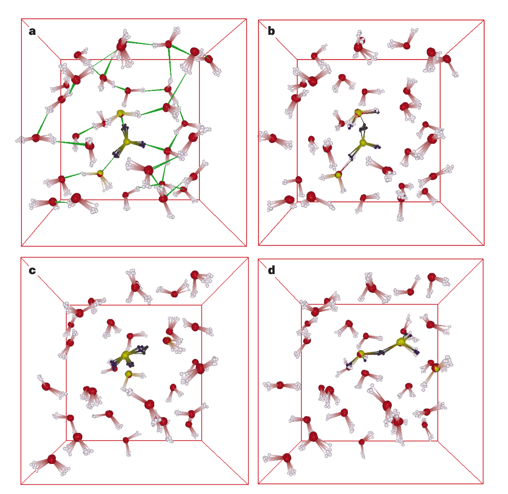
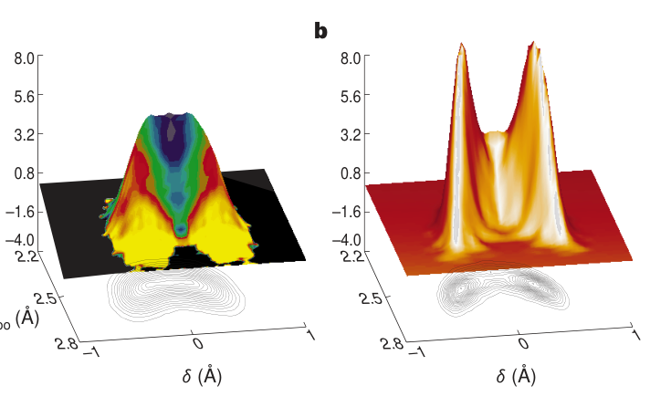
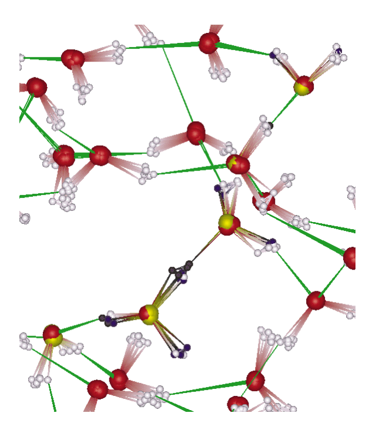

# The nature of the hydrated excess proton in water

**中文题名 / Chinese title:** 水中水合过量质子的本质

**Zotero key:** R3HBR9DF
**Attachment key:** 3AIUCIXT
**Journal / 期刊:** Nature
**Publication date / 发表日期:** 1999-02-18
**DOI:** 10.1038/17579
**Collections / 原分组:** 02课题 / H2O
**Task date / 推送日期:** 2026-07-20

## Why This Paper / 为什么选这篇

**English:** This landmark first-principles molecular-dynamics study gives the structural picture behind the hydrated excess proton: neither a permanently ideal Eigen nor a permanently ideal Zundel ion, but a fluctuating defect embedded in a dynamic hydrogen-bond network.

**中文:** 这篇里程碑式的第一性原理分子动力学研究给出了水合过量质子的结构图像：它既非永久理想的 Eigen 离子，也非永久理想的 Zundel 离子，而是嵌入动态氢键网络中的涨落缺陷。

## Terminology / 术语表

| English | 中文 | Note |
| --- | --- | --- |
| hydrated excess proton | 水合过量质子 | Positive charge defect delocalized over a hydrogen-bond network. |
| Eigen complex | Eigen 复合体 | Hydronium-centred H9O4+ motif. |
| Zundel complex | Zundel 复合体 | Shared-proton H5O2+ motif. |
| first-principles molecular dynamics | 第一性原理分子动力学 | Molecular dynamics with electronic structure evaluated on the fly. |
| hydrogen-bond network | 氢键网络 | The fluctuating water network that reorganizes during transfer. |
| proton transfer | 质子转移 | Migration of protonic charge along a hydrogen-bond pathway. |

## Reading Guide / 读前导读

**English:** First map the structural descriptors used for the excess proton, then inspect the figures that connect proton sharing, coordination and solvent-shell asymmetry. Treat the simulation protocol as part of the evidence, especially the density-functional and nuclear treatment.

**中文:** 先梳理作者用于描述过量质子的结构指标，再看把质子共享、配位和溶剂壳层不对称性联系起来的图。将模拟方案视为证据的一部分，尤其注意所采用的密度泛函与核处理。

## Page Index / 页码索引

| Page | Source blocks |
| --- | --- |
| 1 | S001, S002, S003, S004, S005, S006, S007, S008, S009 |
| 2 | S010, S011, S012, S013, S014, S015 |
| 3 | S016, S017, S018, S019, S020, S021 |
| 4 | S022, S023, S024, S025, S026, S027, S028, S029, S030 |

## Full Bilingual Reader / 全文逐段中英对照

### Page 1 / 第 1 页

**Source:** p.1 S001

**Original:** Taken as a whole, the data shown in Figs 2 and 3 provide strong evidence that the electrons in metallic carbon nanotubes constitute an LL. Future work will test other predictions of this theory, such as tunnelling between LLs in end-to-end1 and in crossed geometries21. M

**中文翻译:** 总的来说，图2和图3所示的数据有力地证明了金属碳纳米管中的电子构成了LL。未来的工作将测试该理论的其他预测，例如端到端 1 和交叉几何结构 21 中 LL 之间的隧道。中号

**Source:** p.1 S002

**Original:** Received 2 July; accepted 1 December 1998.

**中文翻译:** 7月2日收到； 1998 年 12 月 1 日接受。

**Source:** p.1 S003

**Original:** Acknowledgements. We thank S. Louie, M. Cohen, D-h. Lee, A. Zettl and A. Georges for discussions. This work was supported by DOE (Basic Energy Sciences, Materials Sciences Division, the sp2 Materials Initiative). L.B. was supported by the NSF.

**中文翻译:** 致谢。我们感谢 S. Louie、M. Cohen、D-h。 Lee、A. Zettl 和 A. Georges 进行讨论。这项工作得到了 DOE（基础能源科学、材料科学部、sp2 材料倡议）的支持。磅。得到了 NSF 的支持。

**Source:** p.1 S004

**Original:** Correspondence and requests for materials should be addressed to P.L.M. (mceuen@socrates.berkeley.edu).

**中文翻译:** 信函和材料请求应发送至 P.L.M. （mceuen@socrates.berkeley.edu）。

**Source:** p.1 S005

**Original:** The nature of the hydrated excess proton in water

**中文翻译:** 水中水合过量质子的性质

**Source:** p.1 S006

**Original:** Dominik Marx*, Mark E. Tuckerman², JuÈ rg Hutter* & Michele Parrinello*

**中文翻译:** 多米尼克·马克思*、马克·E·塔克曼²、尤尔格·哈特* 和米歇尔·帕里内洛*

**Source:** p.1 S007

**Original:** * Max-Planck-Institut fuÈr FestkoÈrperforschung, Heisenbergstrasse 1, 70569 Stuttgart, Germany ² Department of Chemistry and Courant Institute of Mathematical Sciences, New York University, 4 Washington Place, New York, New York 10003, USA

**中文翻译:** * Max-Planck-Institut fuÈr FestkoÈrperforschung, Heisenbergstrasse 1, 70569 Stuttgart, 德国 ² 纽约大学化学系和库朗数学科学研究所, 4 Washington Place, New York, New York 10003, USA

**Source:** p.1 S008

**Original:** . . . . . . . . . . . . . . . . . . . . . . . . . . . . . . . . . . . . . . . . . . . . . . . . . . . . . . . . . . . . . . . . . . . . . . . . . . . . . . . . . . . . . . . . . . . . . . . . . . . . . . . . . . . . . . . . . . . . . . . . . Explanations for the anomalously high mobility of protons in liquid water began with Grotthuss's idea1,2 of `structural diffusion' nearly two centuries ago. Subsequent explanations have re®ned this concept by invoking thermal hopping3,4, proton tunnelling5,6 or solvation effects7. More recently, two main structural models have emerged for the hydrated proton. Eigen8,9 proposed the formation of an H9O+ 4 complex in which an H3O+ core is strongly hydrogen-bonded to three H2O molecules. Zundel10,11, meanwhile, supported the notion of an H5O+ 2 complex in which the proton is shared between two H2O molecules. Here we use ab initio path integral12±14 simulations to address this question. These simulations include time-independent equilibrium thermal and quantum ¯uctuations of all nuclei, and determine interatomic interactions from the electronic structure. We ®nd that the hydrated proton forms a ¯uxional defect in the hydrogenbonded network, with both H9O+ 4 and H5O+ 2 occurring only in the sense of `limiting' or `ideal' structures. The defect can become delocalized over several hydrogen bonds owing to quantum ¯uctuations. Solvent polarization induces a small barrier to proton transfer, which is washed out by zero-point motion. The proton can consequently be considered part of a `low-barrier hydrogen bond'15,16, in which tunnelling is negligible and the simplest concepts of transition-state theory do not apply. The rate of proton diffusion is determined by thermally induced hydrogen-bond breaking in the second solvation shell. Simulating an excess proton in liquid bulk water has proved to be immensely challenging. Based on the efforts of numerous groups, many insights into the microscopic nature of proton hydration and diffusion have been deduced17±31,38. Structural diffusion2 as a dynamical process was ®rst `seen' in microscopic detail in an ab initio molecular dynamics study of D+ in D2O (ref. 23). It was seen that proton diffusion does not occur via hydrodynamic Stokes diffusion of a rigid complex, but via migration of a structural defect due to a continual interconversion between covalent and hydrogen bonds. Solvent ¯uctuations modulate the proton transfer barrier and preselect a migration path. The rate-limiting step is the ¯uctuation-induced breakage of a hydrogen bond between the ®rst and second solvation shell of H3O+, which reduces the coordination number of a water molecule in the ®rst solvation shell23. It was subsequently suggested that quantum effects could potentially be important for the rattling of the proton in the hydrogen bond24, but it has recently been shown that this depends sensitively on a qualitatively correct model for the interactions27. The quantum-mechanical particle density `snapshots' from the present simulations of the hydrated proton give a pictorial realization of the structural diffusion process. Initially, the defect is localized as an H9O+ 4 structure possessing an H3O+ core that donates three hydrogen bonds to neighbouring water molecules (Fig. 1a). In the second frame (Fig. 1b), one of the three protons of the H3O+ core migrates along its hydrogen bond and forms an H5O+ 2 complex, in which this proton becomes equally shared between two water molecules. As the transfer is completed, an H9O+ 4 complex is formed once again, but now centred on a neighbouring core molecule (Fig. 1c). The onset of further migration is shown in Fig. 1d, where the defect converts into another H5O+ 2 con®guration. Overall (Fig. 1a±d), the structural defect is displaced over a distance corresponding to approximately twice the average water±water distance, that is, about 5 AÊ . Each individual particle, however, moves by only a fraction of an aÊngstroÈm. The controversial details of this process can be revealed by examination of the two-dimensional distribution P(d, ROO) of the displacement coordinate d ˆ ROaH 2 RObH of a given proton relative to the instantaneous hydrogen-bond centre and the corresponding bond distance ROO. (See Fig. 1 legend for nomenclature.) For the analysis to be as unbiased as possible, we begin by including all OaHOb triples, that is, all hydrogen bonds present in the periodic sample. This distribution (not shown) is characterized by two prominent peaks around d; ROO† < 6 0:9; 2:8† ÊA arising from the hydrogen bonds of bulk water but is manifestly non-zero around jdj < 0 ÊA. This supports the existence of centrosymmetric complexes, in which the proton is equally shared between two water molecules, and thereby opposes a description solely in terms of H3O+ or H9O+ 4 complexes and/or proton transfer entirely associated with tunnelling. The analysis can be re®ned by excluding `irrelevant' hydrogen bonds in a two-step procedure. First, the H3O+ a defect site is located, and only its three OaHOb triples are taken into account. Then, from these three triples, the hydrogen bond with the smallest jdj is selected, an intuitive choice based on events of the type in Fig. 1. This second step focuses on the `most active proton', that is, the one

**中文翻译:** 。 。 。 。 。 。 。 。 。 。 。 。 。 。 。 。 。 。 。 。 。 。 。 。 。 。 。 。 。 。 。 。 。 。 。 。 。 。 。 。 。 。 。 。 。 。 。 。 。 。 。 。 。 。 。 。 。 。 。 。 。 。 。 。 。 。 。 。 。 。 。 。 。 。 。 。 。 。 。 。 。 。 。 。 。 。 。 。 。 。 。 。 。 。 。 。 。 。 。 。 。 。 。 。 。 。 。 。 。 。 。 。 。 。 。 。 。 。 。 。 。对液态水中质子异常高的迁移率的解释始于近两个世纪前格罗萨斯的“结构扩散”思想1,2。随后的解释通过引入热跳跃 3,4、质子隧道效应 5,6 或溶剂化效应 7 完善了这一概念。最近，出现了水合质子的两种主要结构模型。 Eigen8,9 提出形成 H9O+ 4 复合物，其中 H3O+ 核心与三个 H2O 分子强氢键结合。与此同时，Zundel10,11 支持 H5O+ 2 复合物的概念，其中质子在两个 H2O 分子之间共享。这里我们使用从头开始路径积分12±14模拟来解决这个问题。这些模拟包括所有原子核的与时间无关的平衡热和量子涨落，并根据电子结构确定原子间相互作用。我们发现水合质子在氢键网络中形成了一个连续缺陷，H9O+ 4 和 H5O+ 2 仅在“限制”或“理想”结构的意义上出现。由于量子涨落，缺陷可能会在几个氢键上离域。溶剂极化会对质子转移产生一个小障碍，该障碍会被零点运动冲掉。因此，质子可以被认为是“低势垒氢键”15,16 的一部分，其中隧道效应可以忽略不计，并且过渡态理论的最简单概念也不适用。质子扩散速率由第二溶剂化层中热致氢键断裂决定。事实证明，模拟液态水中的过量质子极具挑战性。基于众多团队的努力，人们已经推导出许多关于质子水合和扩散微观性质的见解17±31,38。结构扩散2 作为一种动态过程，首次在微观细节中“看到”是在 D2O 中 D+ 的从头算分子动力学研究中（参考文献 23）。可以看出，质子扩散不是通过刚性络合物的流体动力斯托克斯扩散发生的，而是通过由于共价键和氢键之间的持续相互转化而导致的结构缺陷的迁移发生的。溶剂波动调节质子转移势垒并预先选择迁移路径。限速步骤是 H3O+ 第一个和第二个溶剂化层之间氢键的波动引起的断裂，这减少了第一个溶剂化层中水分子的配位数23。随后有人提出，量子效应对于氢键中质子的振动可能很重要24，但最近的研究表明，这敏感地取决于相互作用的定性正确模型27。当前水合质子模拟中的量子力学粒子密度“快照”给出了结构扩散过程的图形化实现。最初，该缺陷被定位为具有 H3O+ 核心的 H9O+ 4 结构，该结构向邻近的水分子提供三个氢键（图 1a）。在第二帧中（图1b），H3O+核心的三个质子之一沿着其氢键迁移并形成H5O+2复合物，其中该质子在两个水分子之间平等共享。转移完成后，H9O+ 4 复合物再次形成，但现在以邻近的核心分子为中心（图 1c）。进一步迁移的开始如图 1d 所示，其中缺陷转化为另一种 H5O+ 2 构型。总体而言（图1a±d），结构缺陷的位移距离大约相当于平均水±水距离的两倍，即约5 AÊ 。然而，每个单独的粒子仅移动了埃的一小部分。通过检查给定质子相对于瞬时氢键中心的位移坐标 d ROaH 2 RObH 的二维分布 P(d, ROO) 和相应的键距 ROO，可以揭示该过程有争议的细节。 （有关命名法，请参见图 1 图例。）为了使分析尽可能公正，我们首先包含所有 OaHOb 三元组，即周期性样本中存在的所有氢键。该分布（未显示）的特点是 d 周围有两个突出的峰值； ROO < 6 0:9; 2:8 ÊA 由大量水的氢键产生，但在 jdj < 0 ÊA 附近显然不为零。这支持中心对称配合物的存在，其中质子在两个水分子之间平等共享，从而反对仅用 H3O+ 或 H9O+ 4 配合物和/或完全与隧道效应相关的质子转移进行描述。通过在两步程序中排除“不相关”氢键，可以改进分析。首先，定位 H3O+a 缺陷位点，并且仅考虑其三个 OaHOb 三元组。然后，从这三个三元组中，选择具有最小 jdj 的氢键，这是基于图 1 中类型事件的直观选择。第二步重点关注“最活跃的质子”，即

**Source:** p.1 S009

**Original:** © 1999 Macmillan Magazines Ltd

**中文翻译:** © 1999 麦克米伦杂志有限公司

### Page 2 / 第 2 页

**Source:** p.2 S010

**Original:** that has the greatest likelihood of transferring to a neighbouring water molecule, but imposes no a priori discrimination between different structures such as H5O+ 2 or H9O+ 4. In the distribution from the ®rst step (not shown), the centrosymmetric jdj < 0 ÊA region is substantially enhanced, and two `wings' emerge, which can be attributed to asymmetric hydrogen-bonded defects. After the second step, the distribution (Fig. 2a) acquires a broad and unstructured character. This important ®nding indicates that the protonic defect can assume many different structures, so that an unambiguous distinction between H5O+ 2 and H9O+ 4 can no longer be achieved. To analyse `limiting' forms of the defect, two windows in the displacement coordinate d are chosen. Tight d-margins are deliberately used so that the structural analysis is rendered as evident as possible (see Fig. 2 legend for details). For small jdj, the structures are found to correspond to an equal sharing of the excess proton between two intact H2O, in accordance with Zundel's H5O+ 2 view of the defect. In contrast, con®gurations with large jdj possess the characteristics of a threefold coordinated H3O+ ion, that is, Eigen's the particle densities (diagonal part of the nuclear many-body density matrix) of representative single quantum con®gurations belonging to the proton migration path of the quantum trajectory. We note that the employed ab initio path integral molecular dynamics technique12±14 does not rigorously produce real-time evolu- tion, but that event sequences can nevertheless be inferred qualitatively. Only the non-periodically replicated atoms (oxygens, red; hydrogens, grey) and bonds are included; hydrogen bonds (green) are sketched only in a, the blurring of the atom positions is exclusively due to quantum effects. The defect (given by the H3O+ a core and the triple OaHOb de®ned in Fig. 2 legend) is indicated separately in every panel by yellow (oxygens) and black (hydrogens). The simulations were per- formed using CPMD Version 3.0 (J. Hutter, P. Ballone, M. Bernasconi, P. Focher, E.

**中文翻译:** 它最有可能转移到相邻的水分子，但不会在不同结构（例如 H5O+ 2 或 H9O+ 4）之间施加先验区分。在第一步（未显示）的分布中，中心对称 jdj < 0 ÊA 区域显着增强，并出现两个“翅膀”，这可归因于不对称氢键缺陷。第二步之后，分布（图 2a）获得了广泛且非结构化的特征。这一重要发现表明质子缺陷可以呈现许多不同的结构，因此无法再明确区分 H5O+ 2 和 H9O+ 4。为了分析缺陷的“限制”形式，选择了位移坐标 d 中的两个窗口。故意使用严格的 d 边距，以便使结构分析尽可能明显（详细信息请参见图 2 图例）。对于小的 jdj，根据 Zundel 的 H5O+ 2 缺陷观点，发现这些结构对应于两个完整 H2O 之间多余质子的均等分配。相比之下，jdj大的构型具有三重配位H3O+离子的特征，即属于量子轨迹质子迁移路径的代表性单量子构型的本征粒子密度（核多体密度矩阵的对角部分）。我们注意到，所采用的从头开始路径积分分子动力学技术12±14并不能严格产生实时演化，但事件序列仍然可以定性地推断。仅包括非周期性复制的原子（氧，红色；氢，灰色）和键；氢键（绿色）仅在a中绘制，原子位置的模糊完全是由于量子效应。缺陷（由图 2 图例中定义的 H3O+ 核心和三重 OaHOb 给出）在每个面板中分别用黄色（氧）和黑色（氢）表示。使用 CPMD 3.0 版进行模拟（J. Hutter、P. Ballone、M. Bernasconi、P. Focher、E.

**Source:** p.2 S011

**Original:** Fois, S. Goedecker, D. Marx, M. Parrinello & M. Tuckerman, Max-Planck-Institut fuÈ r FestkoÈ rperforschung and IBM Zurich Research Laboratory 1995±96) at

**中文翻译:** Fois、S. Goedecker、D. Marx、M. Parrinello 和 M. Tuckerman、Max-Planck-Institut fuÈ r FestkoÈ rperforschung 和 IBM 苏黎世研究实验室 1995±96）

**Source:** p.2 S012

**Original:** H9O+ 4 complex. There are, however, con®gurations (according to the present d-margins about half of them) that cannot be characterized as resembling either of these idealized forms. The fact that a signi®cant portion of the observed structures remain unclassi®ed is also re¯ected in the shape of P(d, ROO) in Fig. 2a. Its structureless ridge allows the defect to evolve easily from H5O+ 2 to H9O+ 4 regions, thus implying that the H5O+ 2 complex cannot be regarded as a typical transition state. Rather, the proton in the most active hydrogen bond oscillates between two water molecules without appreciable hindrance, thereby interconverting two H3O+ cores on neighbouring sites via a strongly hydrogenbonded, centrosymmetric H5O+ 2 complex. The corresponding effective free-energy barrier (around d ˆ 0 6 0:05 ÊA and ROO< 2:46±2:48 ÊA) is vanishingly small, &0.15 kcal mol-1, only a fraction of the thermal energy kBT < 0:59 kcal mol 2 1 at room temperature. Evidently, both H5O+ 2 and H9O+ 4 are only important as limiting structures, and numerous unclassi®able situations exist in between. Therefore, the protonic defect is best visualized as a `¯uxional complex'.

**中文翻译:** H9O+ 4 络合物。然而，有些配置（根据目前的边距，大约有一半）不能被描述为类似于这些理想化形式中的任何一种。图 2a 中 P(d, ROO) 的形状也反映了观察到的结构的很大一部分仍未分类的事实。其无结构脊使得缺陷很容易从H5O+ 2 区域演化到H9O+ 4 区域，因此意味着H5O+ 2 配合物不能被视为典型的过渡态。相反，最活跃的氢键中的质子在两个水分子之间振荡而没有明显的阻碍，从而通过强氢键合、中心对称的 H5O+ 2 复合物使相邻位点上的两个 H3O+ 核心相互转化。相应的有效自由能势垒（大约 d 0 6 0:05 ÊA 和 ROO< 2:46±2:48 ÊA）非常小，&0.15 kcal mol-1，仅是室温下热能 kBT < 0:59 kcal mol 2 1 的一小部分。显然，H5O+ 2 和 H9O+ 4 仅作为限制结构重要，并且其间存在许多不可分类的情况。因此，质子缺陷最好可视化为“变形复合体”。

### Figure 1

**Placed near:** p.2 S012
**Source:** p.2 C001

**Original caption:** Figure 1 Examples of simulation con®gurations. We show a perspective view of

**中文图注:** 图 1 模拟配置示例。我们展示了一个透视图

**Reading note / 读图提示:** Inspect the whole crop, including panel letters, axes, legends and units, together with the adjacent source paragraph. / 请将完整裁剪图中的子图标记、坐标轴、图例和单位与相邻原文段落一起阅读。

**Source:** p.2 S013

**Original:** ambient conditions using 32 H2O with one excess proton in a periodic cubic box with a lattice constant of 9.8652 AÊ , employing the BLYP density functional34,35,

**中文翻译:** 环境条件下，在晶格常数为 9.8652 AÊ 的周期性立方盒中使用 32 H2O 和一个多余的质子，采用 BLYP 密度泛函34,35，

**Source:** p.2 S014

**Original:** Troullier±Martins pseudo potentials36, and a G-point plane wave expansion of the valence orbitals up to 70 rydberg. This particular scheme has been shown to yield a very good description of the water dimer37, the protonated water dimer16, and bulk water37. The path integral for the quantum simulation12±14 was discretized using P ˆ 8 Trotter replicas. The normal-mode propagator together with a chain of three coupled Nose ±Hoover thermostats on each degree of freedom was used to generate a canonical distribution at 300 K, improve sampling ef®ciency, and ensure ergodicity14. After careful equilibration, quantum and classical trajectories consisting of 100,000 and 160,000 con®gurations, respectively, were generated (using identical parameters, in particular the same Nose ±Hoover-chain thermo-

**中文翻译:** Troullier±Martins 赝势36，以及高达 70 里德堡的价轨道的 G 点平面波展开。这种特殊的方案已被证明可以很好地描述水二聚体37、质子化水二聚体16 和本体水37。量子模拟 12±14 的路径积分使用 P 8 Trotter 副本进行离散化。正则模式传播器与每个自由度上的三个耦合的 Nose±Hoover 恒温器链一起用于生成 300 K 的规范分布，提高采样效率并确保遍历性14。经过仔细的平衡后，分别生成了由 100,000 和 160,000 个配置组成的量子和经典轨迹（使用相同的参数，特别是相同的 Nose±Hoover-chain 热链）。

**Source:** p.2 S015

**Original:** © 1999 Macmillan Magazines Ltd

**中文翻译:** © 1999 麦克米伦杂志有限公司

### Page 3 / 第 3 页

**Source:** p.3 S016

**Original:** Having proposed a coherent picture of the structural defect, it remains to identify the rate-determining step. This must be done indirectly, as the path integral approach used provides rigorously only time-averaged quantum equilibrium properties. Comparing the number of distinct net displacements of the defect (such as illustrated in Fig. 1) with the number of (inactive) proton-rattling events, the simulation unambiguously shows that the latter process is not rate-limiting. Rather, a proton localized as H3O+ migrates preferentially along the hydrogen bond to the neighbouring H2O that has the lowest coordination number. A water molecule in the ®rst solvation shell becomes undercoordinated by thermally induced hydrogen-bond breaking between it and a second solvation shell member23. This phenomenon leads to the coordination number distribution n(d, ROO) in the most active hydrogen bond, which is superimposed on P(d, ROO) in Fig. 2a. Here, the protonaccepting water molecule is undercoordinated near jdj < 0 ÊA (blue to green), where the defect resembles H5O+ 2, relative to the wings of the distribution at large jdj (red to yellow), where the defect resembles H9O+ 4. How well does a purely classical description of the nuclei, which includes only thermal ¯uctuations, compare with these quantum results? The answer can be gleaned from Fig. 2b and from the freeenergy barrier. In the classical limit, the asymmetric H9O+ 4 structure function P(d, ROO) of the proton displacement d ˆ ROaH 2 RObH relative to the OaHOb bond midpoint (asymmetric stretch coordinate) and the corresponding oxygen± oxygen separation ROO between the two neighbouring oxygen atoms Oa and Ob from quantum (a) and classical (b) simulations at 300 K. (De®nition of the OaHOb triple: Oa is the centre of the H3O+ a unit determined by assigning every proton to its closest oxygen neighbour; H is one of the three protons forming the H3O+ a unit, such that Oa, H and Ob yield the minimum value of jdj in each con®guration.) In a, the quantum averaged local coordination number, n(d, ROO), of Ob is super- imposed on P(d, ROO). The function n(d, ROO) is obtained by averaging the number of oxygen neighbours of Ob within a sphere of radius Rcut for given d and ROO; Rcut ˆ 3:25 ÊA is determined by the ®rst minimum of the oxygen±oxygen radial distribution function gOO(r) of bulk water. (Colour code: n decreases from yellow) (,4) to red to green to blue (,3.5).) All distributions are smoothed for presentation and symmetrized about d ˆ 0 ÊA. In addition, the P(d, ROO) distribu- tions are normalized to unity and shown on the same scale. Structural analysis of con®gurations: (1) for small jdj < 0:1 ÊA, the ®rst peak of the intra-complex gOO(r)

**中文翻译:** 在提出了结构缺陷的连贯图之后，仍然需要确定速率决定步骤。这必须间接完成，因为所使用的路径积分方法严格地仅提供时间平均的量子平衡特性。将缺陷的不同净位移数量（如图 1 所示）与（非活动）质子震颤事件的数量进行比较，模拟明确表明后一个过程不是速率限制的。相反，定位为 H3O+ 的质子优先沿着氢键迁移到具有最低配位数的相邻 H2O。第一个溶剂化壳中的水分子由于其与第二个溶剂化壳成员之间的热致氢键断裂而变得配位不足23。这种现象导致最活跃氢键的配位数分布为n(d,ROO)，叠加在图2a中的P(d,ROO)上。这里，接受质子的水分子在 jdj < 0 ÊA（蓝色到绿色）附近协调不足，其中缺陷类似于 H5O+ 2，相对于大 jdj（红色到黄色）分布的翼部，其中缺陷类似于 H9O+ 4。仅包括热波动的原子核的纯经典描述与这些量子结果相比效果如何？答案可以从图 2b 和自由能势垒中得到。在经典极限下，质子位移 d ROaH 2 RObH 相对于 OaHOb 键中点（不对称拉伸坐标）的不对称 H9O+ 4 结构函数 P(d, ROO) 以及来自 300 K 量子 (a) 和经典 (b) 模拟的两个相邻氧原子 Oa 和 Ob 之间相应的氧±氧分离 ROO。（OaHOb 三元组的定义：Oa 是H3O+ a 单元通过将每个质子分配给其最近的氧邻居来确定；H 是形成 H3O+ a 单元的三个质子之一，这样 Oa、H 和 Ob 会在每个配置中产生 jdj 的最小值。）在 a 中，Ob 的量子平均局域配位数 n(d, ROO) 叠加在 P(d, ROO) 上。函数 n(d, ROO) 是通过对给定 d 和 ROO 的半径为 Rcut 的球体内 Ob 的氧邻居数进行平均而获得的； Rcut 3:25 ÊA 由散装水的氧±氧径向分布函数 gOO(r) 的第一个最小值确定。 （颜色代码：n 从黄色）(,4) 递减至红色、绿色、蓝色 (,3.5)。）所有分布均经过平滑处理以方便呈现，并关于 d 0 ÊA 对称。此外，P(d, ROO) 分布被标准化为统一并以相同的比例显示。配置的结构分析：(1) 对于小 jdj < 0:1 ÊA，复合物内 gOO(r) 的第一个峰

**Source:** p.3 S017

**Original:** occurs at r < 2:4 ÊA (compared with 2.8 AÊ for bulk water). The ®rst peak of gOH(r) is around 0.95 AÊ (close to the value found in bulk water); a secondary peak occurs close to 1.25 AÊ (roughly half of the average OO distance), however, no clearly distinguishable feature exists at r < 1:8 ÊA (where the ®rst intermolecular peak for bulk water would be expected). This pattern for small jdj is consistent with an

**中文翻译:** 发生在 r < 2:4 ÊA（与散装水的 2.8 AÊ 相比）。 gOH(r) 的第一个峰值约为 0.95 AÊ（接近散装水中的值）；第二个峰出现在接近 1.25 AÊ（大约是平均 OO 距离的一半）处，但是，在 r < 1:8 ÊA 处不存在明显可区分的特征（其中预计会出现散装水的第一个分子间峰）。小jdj的这个模式与

**Source:** p.3 S018

**Original:** H2O¼H+¼OH2 complex, in which a proton is equally shared between two normal water molecules. (2) For large jdj . 0:3 ÊA, gOO(r) peaks near 2.5 AÊ , and the ®rst peak of gOH(r) is, in this case, close to 1.0 AÊ (which is slightly longer than for H2O molecules in the bulk). This corresponds to an H3O‡. H2O†3 complex, where the

**中文翻译:** H2O=H+=OH2 复合物，其中两个正常水分子平均分配一个质子。 (2)对于大jdj。 0:3 ÊA，gOO(r) 峰值接近 2.5 AÊ，在这种情况下，gOH(r) 的第一个峰值接近 1.0 AÊ（比本体中的 H2O 分子稍长）。这对应于 H3O。 H2O3 复合物，其中

**Source:** p.3 S019

**Original:** H3O+ core molecule is roughly threefold coordinated. The ®rst-shell H2O mol- ecules are themselves approximately fourfold coordinated.

**中文翻译:** H3O+核心分子大致是三重配位的。第一层 H2O 分子本身大约是四重配位的。

**Source:** p.3 S020

**Original:** is stabilized owing to an increase in the thermal barrier to ,0.56 kcal mol-1 (approximately kBT ˆ 0:59 kcal mol 2 1). Thus, it is the zero-point energy of the most active proton that shifts the lowest vibrational state towards the top of the classical barrier, thereby enhancing H5O+ 2-like complexes, so that the ¯uctuations of the surrounding water molecules become crucial. This idea is similar to the concept of `adiabatic proton transfer'25. Thus, mechanisms such as tunnelling through the classically existing barrier and/or soliton-mediated coherent transfer are of only minor importance. A similar `low-barrier hydrogen bond'situation15,16 is also found in the early stage of the pressure-induced transition to symmetric ice X, where proton disorder along the hydrogen bonds is driven by zeropoint motion (compare Fig. 2a with Fig. 3c of ref. 32). The essential difference is that in ice X, reduction of the oxygen±oxygen distances (and resulting low barriers) is caused by external pressure, whereas in water it is a consequence of the electrostrictive distortion of the hydrogen-bond network around the structural charge defect. Another indicator of the quantum nature of the structural defect is an increase in the radius of gyration of the H3O+ core (see Fig. 3 legend). The difference between the quantum and classical averages, 1.3 AÊ versus 0.9 AÊ , is due entirely to quantum delocalization of the defect over several hydrogen bonds. The structure of such `nonclassical' con®gurations (see Fig. 3) suggests that these quantum delocalizations, in a sense, `probe the most likely direction for further proton migration', thus enhancing the thermal ¯uctuations that mainly drive the structural diffusion. The analysis performed here underlines the complex behaviour of the hydrated proton, bringing out features of both Eigen's and Zundel's views, but it also emphasizes that the defect cannot be fully understood using either of these. One tends to think of solution complexes in terms of well-de®ned structures with transition states in between. We have shown that this appears to be a misleading concept in the context of proton diffusion, and many of the dif®culties in the interpretation of the experimental data might (See Fig. 1 legend for the de®nition of the defect and the details of the presentation.) The quantum ¯uctuations lead to a structural defect that is delocalized over approximately four different hydrogen bonds (lower-left to the upper-right corner). The average `size' of the defects can be quanti®ed by the radius of gyration Rgyr H‡ 3 O ˆ h 1=NP†SISs Rs I 2 Rc†2i 1=2. Here, Rc is the centroid of the defect given by Rc ˆ 1=NP†SISsRs I , I takes values of 1 to N (where N ˆ 4, the number of atoms in the H3O+ core), s ˆ 1; ¼; P is the Trotter replica index (note that P ˆ 1 classically), and angle brackets denote the canonical average.

**中文翻译:** 由于热障增加至 0.56 kcal mol-1（大约 kBT 0:59 kcal mol 2 1）而稳定。因此，正是最活跃质子的零点能量将最低振动态移向经典势垒的顶部，从而增强了H5O+ 2 类复合物，从而使周围水分子的波动变得至关重要。这个想法类似于“绝热质子转移”25 的概念。因此，诸如通过经典存在的势垒的隧道效应和/或孤子介导的相干传输等机制仅具有次要的重要性。在压力诱导向对称冰 X 转变的早期阶段也发现了类似的“低势垒氢键”情况 15,16，其中沿氢键的质子无序是由零点运动驱动的（比较图 2a 与参考文献 32 的图 3c）。本质区别在于，在冰 X 中，氧±氧距离的减小（以及由此产生的低势垒）是由外部压力引起的，而在水中，这是结构电荷缺陷周围氢键网络电致伸缩变形的结果。结构缺陷的量子性质的另一个指标是 H3O+ 核心回转半径的增加（见图 3 图例）。量子平均值和经典平均值之间的差异（1.3 AÊ 与 0.9 AÊ）完全是由于多个氢键上缺陷的量子离域。这种“非经典”配置的结构（见图3）表明，这些量子离域在某种意义上“探索了进一步质子迁移的最可能方向”，从而增强了主要驱动结构扩散的热波动。这里进行的分析强调了水合质子的复杂行为，揭示了艾根和 Zundel 观点的特征，但它也强调使用这两种观点都不能完全理解该缺陷。人们倾向于根据其间具有过渡态的明确定义的结构来考虑解复合体。我们已经证明，在质子扩散的背景下，这似乎是一个误导性的概念，并且解释实验数据时可能会遇到许多困难（有关缺陷的定义和演示的细节，请参见图 1 图例。）量子涨落导致结构缺陷，该缺陷在大约四个不同的氢键（左下角到右上角）上离域。缺陷的平均“尺寸”可以通过回转半径 Rgyr H 3 O h 1=NPSISs Rs I 2 Rc2i 1=2 来量化。这里，Rc 是缺陷的质心，由 Rc 1=NPSISsRs I 给出，I 取 1 到 N 的值（其中 N 4，H3O+ 核中的原子数），s 1； 1/4； P 是 Trotter 副本索引（请注意，经典情况下 P 1），尖括号表示规范平均值。

### Figure 2

**Placed near:** p.3 S020
**Source:** p.3 C002

**Original caption:** Figure 2 Representation of relative proton positions. Averaged distribution

**中文图注:** 图 2 相对质子位置的表示。平均分布

**Reading note / 读图提示:** Inspect the whole crop, including panel letters, axes, legends and units, together with the adjacent source paragraph. / 请将完整裁剪图中的子图标记、坐标轴、图例和单位与相邻原文段落一起阅读。

### Figure 3

**Placed near:** p.3 S020
**Source:** p.3 C003

**Original caption:** Figure 3 Particle density of a representative delocalized quantum con®guration.

**中文图注:** 图 3 代表性离域量子配置的粒子密度。

**Reading note / 读图提示:** Inspect the whole crop, including panel letters, axes, legends and units, together with the adjacent source paragraph. / 请将完整裁剪图中的子图标记、坐标轴、图例和单位与相邻原文段落一起阅读。

**Source:** p.3 S021

**Original:** © 1999 Macmillan Magazines Ltd

**中文翻译:** © 1999 麦克米伦杂志有限公司

### Page 4 / 第 4 页

**Source:** p.4 S022

**Original:** arise from the attempt to interpret complex behaviour within the limits of a favoured structure. The main conclusions drawn from the present ®rst-principles quantum simulations, together with those of ref. 23, are in accordance with a model that is deduced from, and is claimed to be consistent with, all known experimental data33. M

**中文翻译:** 源于试图在有利结构的范围内解释复杂行为。从目前的第一原理量子模拟以及参考文献中得出的主要结论。 23，符合从所有已知实验数据推导出来的模型，并声称与所有已知实验数据一致33。中号

**Source:** p.4 S023

**Original:** Received 12 August; accepted 9 November 1998.

**中文翻译:** 8 月 12 日收到； 1998 年 11 月 9 日接受。

**Source:** p.4 S024

**Original:** 1. de Grotthuss, C. J. T. Sur la deÂcomposition de l'eau et des corps qu'elle tient en dissolution aÁ l'aide de l'eÂlectricite galvanique. Ann. Chim. LVIII, 54±74 (1806). 2. Atkins, P. W. Physical Chemistry 6th edn, Ch. 24.8, 741 (Oxford Univ. Press, 1998). 3. HuÈckel, E. Theorie der Beweglichkeiten des Wasserstoffund Hydroxylions in waÈssriger LoÈsung. Z. Elektrochem. 34, 546±562 (1928). 4. Stearn, A. E. & Eyring, J. The deduction of reaction mechanisms from the theory of absolute rates. J. Chem. Phys. 5, 113±124 (1937). 5. Bernal, J. D. & Fowler, R. H. A theory of water and ionic solution, with particular reference to hydrogen and hydroxyl ions. J. Chem. Phys. 1, 515±548 (1933). 6. Wannier, G. Die Beweglichkeit des Wasserstoffund Hydroxylions in waÈûriger LoÈsung. Ann. Phys. (Leipz.) 24, 545±590 (1935). 7. Huggins, M. L. Hydrogen bridges in ice and liquid water. J. Phys. Chem. 40, 723±731 (1936). 8. Wicke, E., Eigen, M. & Ackermann, Th. UÈ ber den Zustand des Protons (Hydroniumions) in waÈûriger LoÈsung. Z. Phys. Chem. (N.F.) 1, 340±364 (1954). 9. Eigen, M. Proton transfer, acid±base catalysis and enzymatic hydrolysis. Angew. Chem. Int. Edn Engl. 3, 1±19 (1964). 10. Zundel, G. & Metzger, H. EnergiebaÈnder der tunnelnden UÈ berschuû-Protenon in ¯uÈssigen SaÈuren. Eine IR-spektroskopische Untersuchung der Natur der Gruppierungen H5O+ 2. Z. Physik. Chem. (N.F.) 58, 225±245 (1968). 11. Zundel, G. in The Hydrogen BondÐRecent Developments in Theory and Experiments. II. Structure and Spectroscopy (eds Schuster, P., Zundel, G. & Sandorfy, C.) 683±766 (North-Holland, Amsterdam, 1976). 12. Marx, D. & Parrinello, M. Ab initio path-integral molecular dynamics. Z. Phys. B (Rapid Note) 95, 143±144 (1994). 13. Marx, D. & Parrinello, M. Ab initio path integral molecular dynamics: basic ideas. J. Chem. Phys. 104, 4077±4082 (1996). 14. Tuckerman, M. E., Marx, D., Klein, M. L. & Parrinello, M. Ef®cient and general algorithms for path integral Car±Parrinello molecular dynamics. J. Chem. Phys. 104, 5579±5588 (1996). 15. Cleland, W. W. & Kreevoy, M. M. Low-barrier hydrogen bonds and enzymic catalysis. Science 264, 1887±1890 (1994). 16. Tuckerman, M. E., Marx, D., Klein, M. L. & Parrinello, M. On the quantum nature of the shared proton in hydrogen bonds. Science 275, 817±820 (1997). 17. Guissani, Y., Guillot, B. & Bratos, S. The statistical mechanics of the ionic equilibrium of water: a computer simulation study. J. Chem. Phys. 88, 5850±5856 (1988). 18. Halley, J. W., Rustad, J. R. & Rahman, A. A polarizable, dissociating molecular dynamics model for liquid water. J. Chem. Phys. 98, 4110±4119 (1993). 19. TunÄoÂn, I., Silla, E. & BertraÂn, J. Proton solvation in liquid water. An ab initio study using the continuum model. J. Phys. Chem. 97, 5547±5552 (1993). 20. Laria, D., Ciccotti, G., Ferrario, M. & Kapral, R. Activation free energy for proton transfer in solution. Chem. Phys. 180, 181±189 (1994). 21. Komatsuzaki, T. & Ohmine, I. Energetics of proton transfer in liquid water. I. Ab initio study for origin of many-body interaction and potential energy surfaces. Chem. Phys. 180, 239±269 (1994). 22. Wei, D. & Salahub, D. R. Hydrated proton clusters and solvent effects on the proton transfer barrier: a density functional study. J. Chem. Phys. 101, 7633±7643 (1994). 23. Tuckerman, M., Laasonen, K., Sprik, M. & Parrinello, M. Ab initio molecular dynamics simulation of the solvation and transport of H3O+ and OHions in water. J. Phys. Chem. 99, 5749±5752 (1995); Ab initio molecular dynamics simulation of the solvation and transport of hydronium and hydroxyl ions in water. J. Chem. Phys. 103, 150±161 (1995). 24. Lobaugh, J. & Voth, G. A. The quantum dynamics of an excess proton in water. J. Chem. Phys. 104, 2056±2069 (1996). 25. Ando, K. & Hynes, J. T. Molecular mechanism of HCl acid ionization in water: ab initio potential energy surfaces and Monte Carlo simulations. J. Phys. Chem. B 101, 10464±10478 (1997). 26. Schmidt, R. G. & Brickmann, J. Molecular dynamics simulation of the proton transport in water. Ber. Bunsenges. Phys. Chem. 101, 1816±1827 (1997). 27. Sagnella, D. E. & Tuckerman, M. E. An empirical valence bond model for proton transfer in water. J. Chem. Phys. 108, 2073±2083 (1998). 28. Vuilleumier, R. & Borgis, D. Quantum dynamics of an excess proton in water using an extended empirical valence-bond hamiltonian. J. Phys. Chem. B 102, 4261±4264 (1998). 29. Schmitt, U. W. & Voth, G. A. Multistate empirical valence bond model for proton transport in water. J. Phys. Chem. B 102, 5547±5551 (1998). 30. Billeter, S. R. & van Gunsteren, W. F. Protonizable water model for quantum dynamical simulations. J. Phys. Chem. A 102, 4669±4678 (1998). 31. Kochanski, E., Kelterbaum, R., Klein, S., Rohmer, M. M. & Rahmouni, A. Decades of theoretical work on protonated hydrates. Adv. Quantum Chem. 28, 273±291 (1997). 32. Benoit, M., Marx, D. & Parrinello, M. Tunnelling and zero-point motion in high-pressure ice. Nature 392, 258±261 (1998). 33. Agmon, N. The Grotthuss mechanism. Chem. Phys. Lett. 244, 456±462 (1995); Hydrogen bonds, water rotation and proton mobility. J. Chim. Phys. Phys.-Chim. Biol. 93, 1714±1736 (1996). 34. Becke, A. D. Density-functional exchange-energy approximation with correct asymptotic behavior. Phys. Rev. A 38, 3098±3100 (1988). 35. Lee, C., Wang, W. & Parr, R. G. Development of the Colle±Salvetti correlation-energy formula into a functional of the electron density. Phys. Rev. B 37, 785±789 (1988). 36. Troullier, N. & Martins, J. L. Ef®cient pseudopotentials for plane-wave calculations. Phys. Rev. B 43, 1993±2006 (1991). 37. Sprik, M., Hutter, J. & Parrinello, M. Ab initio molecular dynamics simulation of liquid water: comparison of three gradient-corrected density functionals. J. Chem. Phys. 105, 1142±1152 (1996). 38. OjamaÈe, L., Shavitt, I. & Singer, S. J. Potential models for simulations of the solvated proton in water. J. Chem. Phys. 109, 5547±5564 (1998).

**中文翻译:** 1. de Grotthuss, C. J. T. Sur la decomposition de l'eau et des corps qu'elle tient en dissolution aÁ l'aide de l'electricite galvanique.安.奇姆。 LVIII，54±74（1806）。 2. Atkins, P. W.《物理化学》第 6 版，第 1 章24.8, 741（牛津大学出版社，1998）。 3. HuÈckel, E. Theorie der Beweglichkeiten des Wasserstoffund Hydroxylions in waÈssriger LoÈsung。 Z.Elektrochem。 34, 546±562 (1928)。 4. Stearn, A. E. & Eyring, J. 从绝对速率理论推论反应机制。 J.化学。物理。 5、113±124（1937）。 5. Bernal, J. D. & Fowler, R. H. 水和离子溶液理论，特别是氢和氢氧根离子。 J.化学。物理。 1、515±548（1933）。 6. Wannier, G. Die Beweglichkeit des Wasserstoffund Hydroxylions in waÈûriger LoÈsung。安.物理。 （莱比兹）24, 545±590 (1935)。 7. Huggins, M. L. 冰和液态水中的氢桥。 J. Phys。化学。 40, 723±731 (1936)。 8. Wicke, E.、Eigen, M. 和 Ackermann, Th。 UÈ ber den Zustand des Protons（水合氢离子）位于 waÈûriger LoÈsung。 Z. 物理。化学。 (N.F.) 1, 340±364 (1954)。 9. Eigen, M. 质子转移、酸±碱催化和酶水解。安吉乌。化学。国际。埃德恩·英格兰3, 1±19 (1964)。 10. Zundel, G. & Metzger, H. EnergiebaÈnder dertunnelnden UÈ berschuû-Protenon in üÈssigen SaÈuren。 H5O+ 的自然红外光谱研究 2. Z. 物理学。化学。 (N.F.) 58, 225±245 (1968)。 11. Zundel, G.，《氢键》——理论和实验的最新进展。二.结构和光谱学（Schuster, P.、Zundel, G. 和 Sandorfy, C. 编辑）683±766（北荷兰，阿姆斯特丹，1976 年）。 12. Marx, D. 和 Parrinello, M. 从头算路径积分分子动力学。 Z. 物理。 B（快速注释）95, 143±144 (1994)。 13. Marx, D. & Parrinello, M. 从头算路径积分分子动力学：基本思想。 J.化学。物理。 104, 4077±4082 (1996)。 14. Tuckerman, M. E.、Marx, D.、Klein, M. L. 和 Parrinello, M. 路径积分 Car±Parrinello 分子动力学的高效通用算法。 J.化学。物理。 104、5579±5588（1996）。 15. Cleland, W. W. & Kreevoy, M. M. 低势垒氢键和酶催化。科学 264, 1887±1890 (1994)。 16. Tuckerman, M. E.、Marx, D.、Klein, M. L. 和 Parrinello, M. 关于氢键中共享质子的量子性质。科学 275, 817±820 (1997)。 17. Guissani, Y.、Guillot, B. 和 Bratos, S. 水离子平衡的统计力学：计算机模拟研究。 J.化学。物理。 88、5850±5856（1988）。 18. Halley, J. W., Rustad, J. R. & Rahman, A. 液态水的可极化、离解分子动力学模型。 J.化学。物理。 98、4110±4119（1993）。 19. Tunäoân, I.、Silla, E. 和 Bertraân, J. 液态水中的质子溶剂化。使用连续体模型的从头算研究。 J. Phys。化学。 97、5547±5552（1993）。 20.Laria, D.、Ciccotti, G.、Ferrario, M. 和 Kapral, R. 溶液中质子转移的活化自由能。化学。物理。 180, 181±189 (1994)。 21. Komatsuzaki, T. 和 Ohmine, I。液态水中质子转移的能量。 I. 多体相互作用和势能面起源的从头算研究。化学。物理。 180, 239±269 (1994)。 22. Wei, D. & Salahub, D. R. 水合质子簇和溶剂对质子转移势垒的影响：密度泛函研究。 J.化学。物理。 101、7633±7643（1994）。 23. Tuckerman, M.、Laasonen, K.、Sprik, M. 和 Parrinello, M. 从头开始​​分子动力学模拟 H3O+ 和 OH 离子在水中的溶剂化和传输。 J. Phys。化学。 99、5749±5752（1995）；水合氢离子和氢氧根离子在水中的溶剂化和传输的从头算分子动力学模拟。 J.化学。物理。 103, 150±161 (1995)。 24. Lobaugh, J. & Voth, G. A. 水中过量质子的量子动力学。 J.化学。物理。 104、2056±2069（1996）。 25. Ando, K. & Hynes, J. T. 水中 HCl 酸电离的分子机制：从头算势能表面和蒙特卡罗模拟。 J. Phys。化学。 B 101, 10464±10478 (1997)。 26. Schmidt, R. G. & Brickmann, J. 水中质子输运的分子动力学模拟。贝尔。本生。物理。化学。 101、1816±1827（1997）。 27. Sagnella, D. E. 和 Tuckerman, M. E. 水中质子转移的经验价键模型。 J.化学。物理。 108、2073±2083（1998）。 28. Vuilleumier, R. 和 Borgis, D. 使用扩展的经验价键哈密顿量进行水中过量质子的量子动力学。 J. Phys。化学。 B 102, 4261±4264 (1998)。 29. Schmitt, U. W. & Voth, G. A. 水中质子传输的多态经验价键模型。 J. Phys。化学。 B 102, 5547±5551 (1998)。 30. Billeter, S. R. 和 van Gunsteren, W. F. 用于量子动力学模拟的质子化水模型。 J. Phys。化学。 A 102, 4669±4678 (1998)。 31. Kochanski, E.、Kelterbaum, R.、Klein, S.、Rohmer, M. M. 和 Rahmouni, A. 质子化水合物的数十年理论工作。副词。量子化学。 28, 273±291 (1997)。 32. Benoit, M.、Marx, D. 和 Parrinello, M. 高压冰中的隧道和零点运动。自然 392, 258±261 (1998)。 33. Agmon, N. 格罗特胡斯机制。化学。物理。莱特。 244, 456±462 (1995);氢键、水旋转和质子迁移率。 J.Chim.物理。物理化学。生物。 93、1714±1736（1996）。 34. Becke, A. D. 具有正确渐近行为的密度泛函交换能量近似。物理。修订版 A 38, 3098±3100 (1988)。 35. Lee, C.、Wang, W. 和 Parr, R. G. 将 Colle±Salvetti 相关能量公式发展为电子密度的函数。物理。修订版 B 37, 785±789 (1988)。 36. Troullier, N. 和 Martins, J. L. 用于平面波计算的 Ef®cient 赝势。物理。牧师。B 43，1993±2006（1991）。 37. Sprik, M.、Hutter, J. 和 Parrinello, M. 从头开始​​液态水分子动力学模拟：三种梯度校正密度泛函的比较。 J.化学。物理。 105、1142±1152（1996）。 38. OjamaÈe, L.、Shavitt, I. 和 Singer, S. J. 模拟水中溶剂化质子的潜在模型。 J.化学。物理。 109, 5547±5564 (1998)。

**Source:** p.4 S025

**Original:** Acknowledgements. We thank K.-D. Kreuer for discussions. The calculations were performed on the Cray-T3E/816 of the Max-Planck-Gesellschaft.

**中文翻译:** 致谢。我们感谢 K.-D。克鲁尔进行讨论。计算在 Max-Planck-Gesellschaft 的 Cray-T3E/816 上进行。

**Source:** p.4 S026

**Original:** Correspondence and requests for materials should be addressed to D.M. (e-mail: marx@prr.mpistuttgart.mpg.de).

**中文翻译:** 信件和材料请求应发送至 D.M. （电子邮件：marx@prr.mpistuttgart.mpg.de）。

**Source:** p.4 S027

**Original:** Discrete alternating hotspot islands formed by interaction of magma transport and lithospheric ¯exure

**中文翻译:** 岩浆输送与岩石圈运动相互作用形成的离散交替热点岛

**Source:** p.4 S028

**Original:** Christoph F. Hieronymus* & David Bercovici²

**中文翻译:** Christoph F. Hieronymus* 和 David Bercovici²

**Source:** p.4 S029

**Original:** * Danish Lithosphere Centre, éster Voldgade 10 L, 1350 Copenhagen K, Denmark ² Department of Geology and Geophysics, University of Hawaii, Honolulu, Hawaii 96822, USA . . . . . . . . . . . . . . . . . . . . . . . . . . . . . . . . . . . . . . . . . . . . . . . . . . . . . . . . . . . . . . . . . . . . . . . . . . . . . . . . . . . . . . . . . . . . . . . . . . . . . . . . . . . . . . . . . . . . . . . . . The large-scale geometry and age progression of many hotspot island chains, such as the Hawaiian±Emperor chain, are well explained by the steady movement of tectonic plates over stationary hotspots. But on a smaller scale, hotspot tracks are composed of discrete volcanic islands whose spacing correlates with lithospheric thickness1. Moreover, the volcanic shields themselves are often not positioned along single lines, but in more complicated patterns, such as the dual line known as the Kea and Loa trends of the Hawaiian islands2,3. Here we make use of the hypothesis that island spacing is controlled by lithospheric ¯exure1 to develop a simple nonlinear model coupling magma ¯ow, which feeds volcanic growth, to the ¯exure caused by volcanic loads on the underlying plate. For a steady source of melt underneath a moving lithospheric plate, magma is found to reach the surface and build a chain of separate volcanic edi®ces with realistic spacing. If a volcano is introduced away from the axis of the chain, as might occur following a change in the direction of plate motion, the model perpetuates the asymmetry for long distances and times, thereby producing an alternating series of edi®ces similar to that observed in the Kea and Loa trends of the Hawaiian island chain. Various models have been proposed to explain the formation of discrete islands within hotspot tracks. Periodicity in island formation may originate in the mantle by solitary waves4,5 on, or shear instabilities6,7 of, mantle plumes; these models, however, do not explain the observed correlation1 between island spacing l and lithospheric thickness H, that is, l ~ H3=4. Alternatively, stresses in the lithosphere may generate joints with regular spacing of the order of the thickness of the lithosphere with volcanic eruptions occurring at their intersections8; however, the stresses necessary to cause the observed pattern of volcanoes are not well constrained and may require multiple, somewhat ad hoc, origins8. Our model instead builds on the idea (motivated by the observed correlation between l and H) that magma ¯ow occurs at locations where the horizontal ¯exural stresses due to existing islands are approximately zero1 (that is, at the transition between the ¯exural depression and the ¯exural bulge). The model provides a simpli®ed yet self-consistent dynamical system that generates realistic results by taking into account the effects of ¯exural stresses and erosion of the dyke walls on fracture formation. The physical processes involved in our model act on greatly varying length and time scales. Whereas the ¯exural wavelength is of the order of 100 km (ref. 9), and the ¯exural amplitude changes over timescales of volcano formation (,106 years; ref. 10), a typical magma-transporting fracture is only 1±10 m wide and forms over timescales of days (ref. 11). A practical approach to treating this disparity in scales is to de®ne the lithosphere's permeability to magma percolation as a continuous ®eld variable, thus treating the average effects of fractures in a continuum mechanical sense. By analogy with the physics of fracture formation and evolution, the permeability is assumed to depend on stresses11,12 and total erosion (for example, melting13,14 and thermomechanical erosion15) of the fracture walls.

**中文翻译:** * 丹麦岩石圈中心，éster Voldgade 10 L, 1350 Copenhagen K, 丹麦 ² 夏威夷大学地质与地球物理系，檀香山，夏威夷 96822，美国。 。 。 。 。 。 。 。 。 。 。 。 。 。 。 。 。 。 。 。 。 。 。 。 。 。 。 。 。 。 。 。 。 。 。 。 。 。 。 。 。 。 。 。 。 。 。 。 。 。 。 。 。 。 。 。 。 。 。 。 。 。 。 。 。 。 。 。 。 。 。 。 。 。 。 。 。 。 。 。 。 。 。 。 。 。 。 。 。 。 。 。 。 。 。 。 。 。 。 。 。 。 。 。 。 。 。 。 。 。 。 。 。 。 。 。 。 。 。 。 。许多热点岛链（例如夏威夷±皇帝岛链）的大规模几何形状和年龄进展可以通过构造板块在固定热点上的稳定运动得到很好的解释。但在较小的尺度上，热点轨迹由离散的火山岛组成，其间距与岩石圈厚度相关1。此外，火山盾本身通常不是沿单线排列，而是以更复杂的模式排列，例如夏威夷群岛的 Kea 和 Loa 趋势的双线2,3。在这里，我们利用岛屿间距由岩石圈exure1控制的假设来开发一个简单的非线性模型，将岩浆流（促进火山生长）与下方板块上火山载荷引起的exure耦合。为了在移动的岩石圈板块下方提供稳定的熔体源，岩浆被发现到达地表并形成一系列具有真实间距的独立火山岩层。如果火山远离岛链的轴线引入，就像板块运动方向改变后可能发生的那样，该模型会在很长的距离和时间范围内保持不对称性，从而产生一系列交替的火山，类似于在夏威夷岛链的凯阿和洛阿趋势中观察到的情况。已经提出了各种模型来解释热点轨道内离散岛的形成。岛屿形成的周期性可能源于地幔中的孤波 4,5 或地幔柱的剪切不稳定性 6,7；然而，这些模型并没有解释观测到的岛间距l和岩石圈厚度H之间的相关性1，即l ~ H3=4。或者，岩石圈中的应力可能会产生岩石圈厚度数量级的规则间距的节理，并在其交叉点处发生火山喷发8；然而，造成观察到的火山模式所需的应力并没有得到很好的限制，并且可能需要多个、有些临时的来源8。相反，我们的模型基于这样的想法（由观察到的 l 和 H 之间的相关性激发），即岩浆流发生在由于现有岛屿而导致的水平外应力近似为零的位置（即，在外凹陷和外隆起之间的过渡处）。该模型提供了一个简化但自洽的动力系统，通过考虑外应力和堤墙侵蚀对裂缝形成的影响，生成真实的结果。我们的模型中涉及的物理过程的作用长度和时间尺度差异很大。虽然外波波长约为 100 km（参考文献 9），并且外波振幅随火山形成的时间尺度（106 年；参考文献 10）而变化，但典型的岩浆输送裂缝只有 1±10 m 宽，并且在数天的时间尺度内形成（参考文献 11）。处理这种尺度差异的实用方法是将岩石圈对岩浆渗透的渗透性定义为连续场变量，从而在连续力学意义上处理裂缝的平均效应。通过与裂缝形成和演化的物理学进行类比，假设渗透率取决于裂缝壁的应力11,12 和总侵蚀（例如，熔化13,14 和热机械侵蚀15）。

**Source:** p.4 S030

**Original:** © 1999 Macmillan Magazines Ltd

**中文翻译:** © 1999 麦克米伦杂志有限公司

## Critical Reading Notes / 批判性阅读提示

**English:** Distinguish a structural descriptor from a causal reaction coordinate. For proton-transfer studies, a reported solvation motif is strongest when its time ordering, sampling robustness and relation to transport kinetics are all tested.

**中文:** 要区分“结构描述符”和“因果反应坐标”。对于质子转移研究，只有当某个溶剂化基元的时间先后关系、采样稳健性及其与传输动力学的联系都经过检验时，它才构成最强的机制证据。

## Related Reading / 相关阅读

**English:** The strongly recommended reading, if any, is stored in `related_reading.md`.

**中文:** 如有强推荐的相关阅读，详见 `related_reading.md`。

## Reference Record / 参考文献记录

The source bibliography is retained for traceability and is not translated entry by entry. / 原始参考文献为保证可追溯性而保留，不逐条翻译。
- 1. Fisher, M. P. A. & Glazman, A. Mesoscopic Electron Transport (Kluwer Academic, Boston, 1997). 2. Tarucha, S., Honda, T. & Saku, T. Reduction of quantized conductance at low temperatures observed in 2 to 10 mm-long quantum wires. Solid State Commun. 94, 413±418 (1995). 3. Yacoby, A. et al. Nonuniversal conductance quantization in quantum wires. Phys. Rev. Lett. 77, 4612± 4615 (1996). 4. Milliken, F. P., Umbach, C. P. & Webb, R. A. Indications of a Luttinger liquid in the fractional quantum Hall regime. Solid State Commun. 97, 309±313 (1996). 5. Chang, A. M., Pfeiffer, L. N. & West, K. W. Observation of chiral Luttinger behavior in electron tunneling into fractional quantum Hall edges. Phys. Rev. Lett. 77, 2538±2541 (1996). 6. Grayson, M. et al. Continuum of chiral Luttinger liquids at the fractional quantum Hall edge. Phys. Rev. Lett. 80, 1062±1065 (1998). 7. Wildoer, J. W. G. et al. Electronic structure of atomically resolved carbon nanotubes. Nature 391, 59± 62 (1998). 8. Odom, T. W., Huang, J., Kim, P. & Lieber, C. M. Atomic structure and electronic properties of singlewalled carbon nanotubes. Nature 391, 62±64 (1998). 9. Bockrath, M. et al. Single-electron transport in ropes of carbon nanotubes. Science 275, 1922±1925 (1997). 10. Tans, S. J. et al. Individual single-wall carbon nanotubes as quantum wires. Nature 386, 474±477 (1997). 11. Egger, R. & Gogolin, A. Effective low-energy theory for correlated carbon nanotubes. Phys. Rev. Lett. 79, 5082±5085 (1997). 12. Kane, C., Balents, L. & Fisher, M. P. A. Coulomb interactions and mesoscopic effects in carbon nanotubes. Phys. Rev. Lett. 79, 5086±5089 (1997). 13. Cobden, D. H. et al. Spin splitting and even±odd effects in carbon nanotubes. Phys. Rev. Lett. 81, 681± 684 (1998). 14. Tans, S. J., Devoret, M. H., Groeneveld, R. J. A. & Dekker, C. Electron±electron correlations in carbon nanotubes. Nature 394, 761±764 (1998). 15. Grabert, H. & Devoret, M. H. Single Charge Tunneling: Coulomb Blockade Phenomena in Nanostructures (Plenum, New York, 1992). 16. Kane, C. L. & Mele, E. J. Size, shape, and low energy electronic structure of carbon nanotubes. Phys. Rev. Lett. 78, 1932±1935 (1997). 17. Bezryadin, A., Verschueren, A. R. M., Tans, S. J. & Dekker, C. Multiprobe transport experiments on individual single-wall carbon nanotubes. Phys. Rev. Lett. 80, 4036±4039 (1998). 18. Matveev, K. A. & Glazman, L. I. Coulomb blockade of tunneling into a quasi-one-dimensional wire. Phys. Rev. Lett. 70, 990±993 (1993). 19. Fisher, M. P. A. & Dorsey, A. Dissipative quantum tunneling in a biased double-well system at ®nite temperatures. Phys. Rev. Lett. 54, 1609±1612 (1985). 20. Grabert, H. & Weiss, U. Quantum tunneling rates for asymmetric double-well systems with ohmic dissipation. Phys. Rev. Lett. 54, 1605±1608 (1985). 21. Komnik, A. & Egger, R. Nonequilibrium transport for crossed Luttinger liquids. Phys. Rev. Lett. 80, 2881±2884 (1998).
