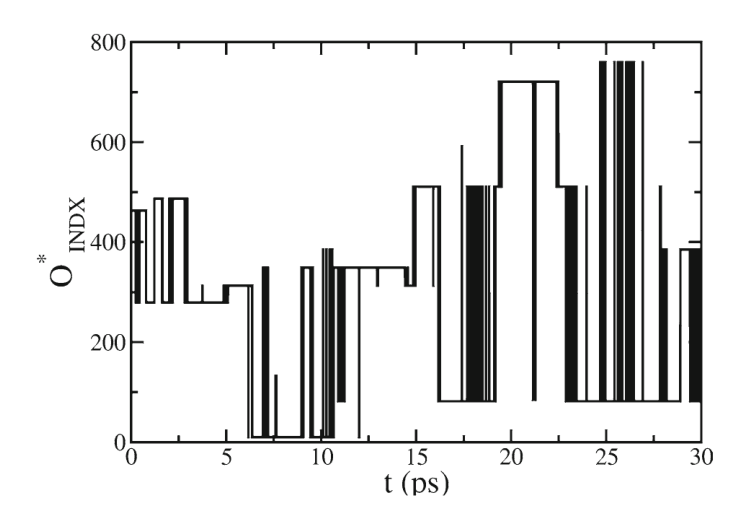
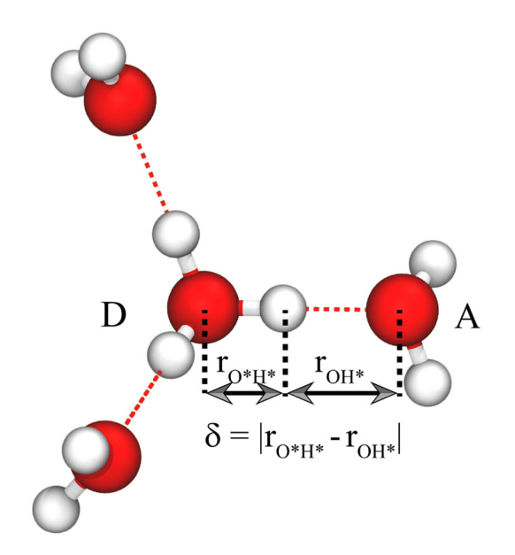
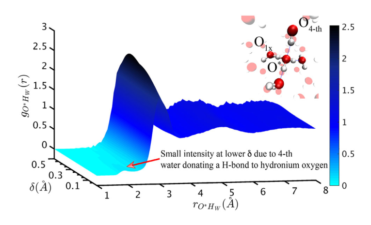
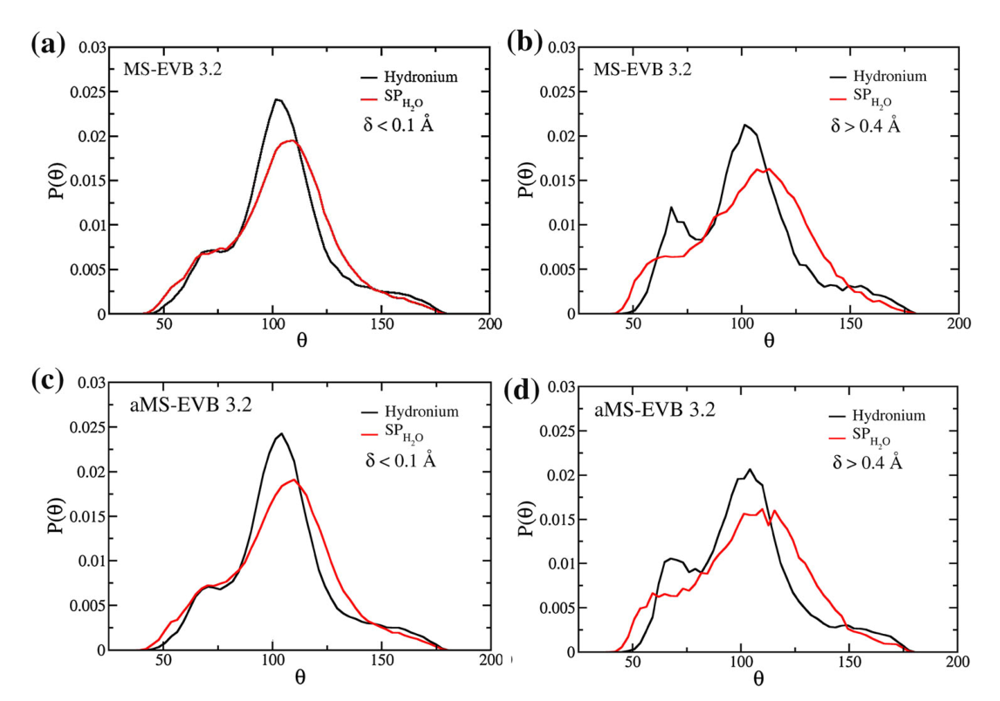
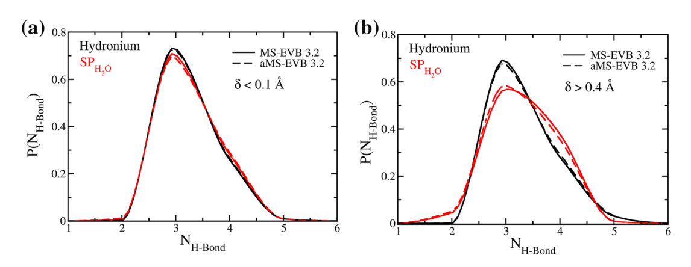

# Role of solvation structure in the shuttling of the hydrated excess proton

**中文题名 / Chinese title:** 溶剂化结构在水合过量质子穿梭中的作用

**Zotero key:** 6EKYCCTD
**Attachment key:** GUVY5MKR
**Journal / 期刊:** Journal of Chemical Sciences
**Publication date / 发表日期:** 2017-07-01
**DOI:** 10.1007/s12039-017-1283-5
**Collections / 原分组:** 02课题 / 质子转移
**Task date / 推送日期:** 2026-07-20

## Why This Paper / 为什么选这篇

**English:** This article turns the qualitative idea of proton pre-solvation into measurable structural coordinates. It is particularly useful for separating Zundel-like and Eigen-like configurations and asking which local hydrogen-bond rearrangements actually prepare a proton hop.

**中文:** 这篇文章把质子“预溶剂化”的定性概念转化为可量化的结构坐标。它特别适合用来区分 Zundel-like 与 Eigen-like 构型，并追问究竟哪些局域氢键重排真正为质子跳跃作了准备。

## Terminology / 术语表

| English | 中文 | Note |
| --- | --- | --- |
| hydrated excess proton | 水合过量质子 | Water-solvated positive charge defect. |
| pre-solvation | 预溶剂化 | Local solvent reorganization that precedes proton transfer. |
| proton-sharing coordinate | 质子共享坐标 | Coordinate that measures how evenly the proton is shared by two oxygens. |
| Zundel-like configuration | Zundel-like 构型 | A strongly shared proton configuration related to H5O2+. |
| Eigen-like configuration | Eigen-like 构型 | A hydronium-centred configuration related to H9O4+. |
| MS-EVB | 多态经验价键模型 | Multistate empirical valence bond model for reactive proton dynamics. |

## Reading Guide / 读前导读

**English:** Read the paper in three passes: first connect the proton-sharing coordinate to the reported pre-solvation metrics; then compare the Zundel-like and Eigen-like cases; finally check which conclusions depend on the MS-EVB model and the hydrogen-bond definition.

**中文:** 建议分三遍读：先把质子共享坐标与文中报告的预溶剂化指标对应起来；再比较 Zundel-like 与 Eigen-like 情形；最后核查哪些结论依赖于 MS-EVB 模型和氢键定义。

## Page Index / 页码索引

| Page | Source blocks |
| --- | --- |
| 1 | S001, S002, S003, S004, S005, S006, S007, S008, S009, S010 |
| 2 | S011, S012, S013, S014, S015, S016, S017, S018, S019, S020 |
| 3 | S021, S022, S023, S024, S025 |
| 4 | S026 |
| 5 | S027, S028, S029, S030 |
| 6 | No extractable prose |
| 7 | No extractable prose |

## Full Bilingual Reader / 全文逐段中英对照

### Page 1 / 第 1 页

**Source:** p.1 S001

**Original:** J. Chem. Sci. Vol. 129, No. 7, July 2017, pp. 1045–1051. © Indian Academy of Sciences. DOI 10.1007/s12039-017-1283-5

**中文翻译:** J.化学。科学。卷。 129，第 7 期，2017 年 7 月，第 1045–1051 页。 © 印度科学院。 DOI 10.1007/s12039-017-1283-5

**Source:** p.1 S002

**Original:** Special Issue on THEORETICAL CHEMISTRY/CHEMICAL DYNAMICS Role of solvation structure in the shuttling of the hydrated excess proton†

**中文翻译:** 理论化学/化学动力学特刊溶剂化结构在水合过量质子穿梭中的作用†

**Source:** p.1 S003

**Original:** RAJIB BISWAS and GREGORY A VOTH∗

**中文翻译:** 拉吉布·比斯瓦斯和格雷戈里·沃斯*

**Source:** p.1 S004

**Original:** Department of Chemistry, James Franck Institute, and Institute for Biophysical Dynamics The University of Chicago, Chicago, IL 60637, USA E-mail: gavoth@uchicago.edu

**中文翻译:** 芝加哥大学化学系、詹姆斯·弗兰克研究所和生物物理动力学研究所，芝加哥，伊利诺伊州 60637，美国 电子邮件：gavoth@uchicago.edu

**Source:** p.1 S005

**Original:** MS received 9 February 2017; revised 14 April 2017; accepted 18 April 2017

**中文翻译:** MS 于 2017 年 2 月 9 日收到； 2017 年 4 月 14 日修订； 2017 年 4 月 18 日接受

**Source:** p.1 S006

**Original:** Abstract. The classic Marcus electron transfer reaction model demonstrated that a barrierless electron transfer reaction can occur when both the reactant and product have almost similar solvation environment. In our recently developed proton model, we have incorporated the pre-solvation concept and showed that it indeed facilitates the proton diffusion in aqueous solution. In this work, we further quantify the degree of pre-solvation using different structural parameters, e.g., tetrahedral order parameter, average numbers of hydrogen bonds. All the above said parameters exhibit a very strong correlation with the proton share parameter. The more Zundel-like configurations have almost identical solvation environment for both the water molecules and support the presolvation concept. However, in the case of Eigen-like configurations, the central hydronium and “special pair” water have distinctly different solvation structures.

**中文翻译:** 抽象的。经典的Marcus电子转移反应模型表明，当反应物和产物具有几乎相似的溶剂化环境时，可以发生无势垒电子转移反应。在我们最近开发的质子模型中，我们纳入了预溶剂化概念，并表明它确实促进了质子在水溶液中的扩散。在这项工作中，我们使用不同的结构参数（例如四面体有序参数、氢键平均数）进一步量化预溶剂化程度。所有上述参数都与质子份额参数表现出非常强的相关性。更类似于 Zundel 的构型对水分子具有几乎相同的溶剂化环境，并支持预溶剂化概念。然而，在类本征构型的情况下，中心水合氢和“特殊对”水具有明显不同的溶剂化结构。

**Source:** p.1 S007

**Original:** Keywords. Empirical valence bond; reactive molecular dynamics; pre-solvation; proton transfer; proton transport.

**中文翻译:** 关键词。经验价键；反应分子动力学；预溶剂化；质子转移；质子传输。

**Source:** p.1 S008

**Original:** transfer process, it is extremely challenging to study the process experimentally and computationally as well. Despite several challenges, the excess proton solvation and transport have been studied extensively by experiments13–19 and simulations.4,20–44 Ultrafast high-resolution spectroscopy13–19 and advanced computer simulation techniques,4,6–8,20–44 have enhanced our understanding of the proton transport mechanisms, particularly in the case of aqueous systems. The dynamical evolution of bonding topologies in terms of reorganization of water hydrogen bond (H-bond) network requires special attention for building a reasonable model to study proton transfer in aqueous solution. Because of the absence of bond breaking and bond formation features, classical molecular dynamics simulation does not allow to study proton solvation and transfer. On the other hand, in the case of ab initio molecular dynamics (AIMD) the explicit treatment of electronic degrees of freedom by the system Hamiltonian makes it one possible choice to study proton solvation and charge transfer more accurately.20,22,24,25,27,29,33,35,37,41–43,45 However, the AIMD method comes with a very high computational cost which, thus, limits the system size and time scales that can be studied. In addition to this, the intrinsic approximations accompanying with the level of density functional theory (DFT) employed in AIMD can also

**中文翻译:** 转移过程中，通过实验和计算来研究该过程也极具挑战性。尽管存在一些挑战，过量的质子溶剂化和传输已经通过实验13-19和模拟进行了广泛的研究。4,20-44超快高分辨率光谱13-19和先进的计算机模拟技术4,6-8,20-44增强了我们对质子传输机制的理解，特别是在水系统的情况下。水氢键（H-键）网络重组方面的键合拓扑的动态演化需要特别关注建立合理的模型来研究水溶液中的质子传递。由于缺乏键断裂和键形成特征，经典分子动力学模拟不允许研究质子溶剂化和转移。另一方面，在从头分子动力学 (AIMD) 的情况下，系统哈密顿量对电子自由度的显式处理使得更准确地研究质子溶剂化和电荷转移成为一种可能的选择。20,22,24,25,27,29,33,35,37,41–43,45 然而，AIMD 方法的计算成本非常高，从而限制了可研究的系统规模和时间尺度。除此之外，AIMD 中采用的密度泛函理论 (DFT) 水平的内在近似也可以

**Source:** p.1 S009

**Original:** The aqueous transfer or “shuttle” of a hydrated excess proton between water molecules is extremely important to explore many important processes involved in biological1–4 and energy systems.5–8 In aqueous solution, an excess proton can interact with the surrounding water in a very fast time scale. The interaction strength can span continuously between a strong covalent interaction and a weaker hydrogen bond, which leads to the delocalization of excess positive charge defect. These excess protonwatersolvationstructurescanbebyandlargedefined by a continuous evolution of different transient configurations within two limiting forms, the Eigen cation9 (hydronium solvated with three water molecules) and Zundel cation10 (proton equally shared between two water molecules). The fast transport of excess charge in case of the aqueous hydrated excess proton occurs via the Grotthuss mechanism,3,11,12 in which the excess proton is transferred by the breaking and forming of chemical bonds. Because of the rapid time scale and strong coupling of the structural evolution with proton

**中文翻译:** 水合过量质子在水分子之间的水转移或“穿梭”对于探索生物1-4和能源系统中涉及的许多重要过程极其重要。5-8在水溶液中，过量质子可以在非常快的时间尺度内与周围的水相互作用。相互作用强度可以在强共价相互作用和较弱氢键之间连续跨越，从而导致过量正电荷缺陷的离域。这些过量的质子水溶剂化结构可以通过两种限制形式内不同瞬态构型的连续演化来定义，即本征阳离子 9（与三个水分子溶剂化的水合氢）和 Zundel 阳离子 10（两个水分子之间平等共享的质子）。在水合过量质子的情况下，过量电荷的快速传输通过 Grotthuss 机制发生，3,11,12 其中过量质子通过化学键的断裂和形成而转移。由于结构演化与质子的快速时间尺度和强耦合

**Source:** p.1 S010

**Original:** *For correspondence †Dedicated to the memory of the late Professor Charusita Chakravarty.

**中文翻译:** *用于通信 †谨以此文纪念已故的 Charusita Chakravarty 教授。

### Page 2 / 第 2 页

**Source:** p.2 S011

**Original:** give rise to unphysical consequences, particularly in the case of liquid water.27,43,46,47

**中文翻译:** 引起非物理后果，特别是在液态水的情况下。27,43,46,47

**Source:** p.2 S012

**Original:** However, despite these facts, the inherent capability of treating electronic polarization, chemical bondbreaking, and charge transfer by AIMD can provide significant information for parameterization of more efficient computational models.36,39 One such alternate approach based on the Multistate Empirical Valence Bond (MS-EVB) formalism has been shown to simulate excess proton solvation and transfer successfully while accurately capturing the essential physics and chemistry in different protonated systems.4,23,26,31,40 The MS-EVB and AIMD studies together find that the Eigen cation is the predominant solvation structure in bulk water and that proton transfer happens via an Eigen-Zundel-Eigen mechanism. In case of Eigen configurations, it has been found from the earlier simulation studies that one of the three water ligands in its first solvation shell always prefers to be closer to the hydronium moiety than the other two and is termed as “special pair” water.20,32 It has also been found that before the proton transfer event, the “special pair” water interchanges its identity rapidly within the three first shell water molecules (the “special pair” dance).32,34

**中文翻译:** 然而，尽管有这些事实，AIMD 处理电子极化、化学键断裂和电荷转移的固有能力可以为更有效计算模型的参数化提供重要信息。36,39 一种基于多态经验价键 (MS-EVB) 形式的替代方法已被证明可以成功模拟过量质子溶剂化和转移，同时准确捕获不同质子化系统中的基本物理和化学。4,23,26,31,40 MS-EVB 和 AIMD 研究共同发现本征阳离子是大量水中的主要溶剂化结构，并且质子转移通过本征-Zundel-本征机制发生。在本征构型的情况下，从早期的模拟研究发现，其第一溶剂化壳层中的三个水配体中的一个总是比其他两个更接近水合氢部分，被称为“特殊对”水。20,32还发现，在质子转移事件之前，“特殊对”水在三个第一个壳层水分子内快速交换其身份（“特殊对”舞蹈）。32,34

**Source:** p.2 S013

**Original:** Recent AIMD data and the latest version of the MS-EVB model (version 3.2) both showed that “presolvation” (i.e., the hydronium is transiently solvated by four water molecules by accepting a weak hydrogen bond from the fourth water molecule) facilitates the proton shuttling and diffusion in aqueous solution.33,37,43,48 Since a water molecule typically forms four hydrogen bonds, in the pre-solvation picture, before the proton transfer happens, hydronium will also form four hydrogen bonds. This will create a similar solvation environment for both the hydronium and its nearby water molecules.33,37,43 Thus, if the excess proton transfers from hydronium to any one of its nearest water molecules in the pre-solvated condition, the newly formed water molecule will have similar coordination number as in the bulk water. This pre-solvation concept can be well understood by the classic Marcus picture of proton transfer.49,50 In the Marcus picture, the free energy of the system along the (slow) solvent coordinate is similar before and after a proton transfer reaction so that the transition can happen in the (fast) proton transfer coordinate. In the present work, we further quantify the degree of pre-solvation using different structural parameters, e.g., a tetrahedral order parameter and average hydrogen bonds of proton donor and acceptor moieties. The remaining sections of this paper are as follows: In section 2, we briefly discuss the method and the simulation details. Section 3 contains the main results of the present work, and conclusions are given in section 4.

**中文翻译:** 最近的 AIMD 数据和最新版本的 MS-EVB 模型（版本 3.2）均表明，“预溶剂化”（即水合氢通过接受第四个水分子的弱氢键而被四个水分子瞬时溶剂化）促进了质子在水溶液中的穿梭和扩散。 33,37,43,48 由于水分子通常形成四个氢键，因此在预溶剂化图中，在质子转移发生之前，水合氢也会形成四个氢键。这将为水合氢离子及其附近的水分子创造一个类似的溶剂化环境。33,37,43 因此，如果过量的质子在预溶剂化条件下从水合氢离子转移到任何一个最近的水分子，则新形成的水分子将具有与本体水中相似的配位数。这种预溶剂化的概念可以通过质子转移的经典马库斯图很好地理解。49,50 在马库斯图中，系统沿（慢）溶剂坐标的自由能在质子转移反应前后相似，因此转变可以在（快）质子转移坐标中发生。在目前的工作中，我们使用不同的结构参数（例如四面体有序参数和质子供体和受体部分的平均氢键）进一步量化预溶剂化程度。本文的其余部分如下：在第 2 部分中，我们简要讨论该方法和模拟细节。第 3 节包含当前工作的主要结果，第 4 节给出结论。

**Source:** p.2 S014

**Original:** 2.1 Theoretical framework of the MS-EVB model

**中文翻译:** 2.1 MS-EVB模型的理论框架

**Source:** p.2 S015

**Original:** It is a well-established fact that the delocalized nature of the excess proton charge or charge defect can be described by the MS-EVB approach in an efficient and accurate way.23,26,31,38

**中文翻译:** 众所周知，过量质子电荷或电荷缺陷的离域性质可以通过 MS-EVB 方法以有效且准确的方式描述。23,26,31,38

**Source:** p.2 S016

**Original:** The complete description of the MS-EVB methodology can befoundinearlierpapers.23,26,31 Inthisarticle,wesummarize the few key features and advances in the case of the latest version i.e., MS-EVB 3.2. In the MS-EVB formalism, for a given nuclear configuration, the ground state of the system |ψ⟩is represented by a linear combination of different “basis states” |i⟩corresponding to different bonding topologies:

**中文翻译:** MS-EVB 方法的完整描述可以在之前的论文中找到。23,26,31 在本文中，我们总结了最新版本（即 MS-EVB 3.2）的一些关键功能和进步。在MS-EVB形式中，对于给定的核构型，系统的基态|ψ⟩由对应于不同键合拓扑的不同“基态”|i⟩的线性组合表示：

**Source:** p.2 S017

**Original:** where N is the total number of chemically motivated basis states and ci’s are the EVB coefficientsof ith basis states. The coefficients (ci) can be obtained by solving the eigenvalueeigenfunction problem using the Hamiltonian matrix H, which comprises of matrix elements hi j = ⟨i| H | j⟩, such that, Hc =E0c (2)

**中文翻译:** 其中 N 是化学激发基态的总数，ci 是第 i 个基态的 EVB 系数。系数 (ci) 可以通过使用哈密顿矩阵 H 求解特征值特征函数问题来获得，该矩阵由矩阵元素 hi j = ⟨i| 组成。哈 | j⟩，使得 Hc =E0c (2)

**Source:** p.2 S018

**Original:** Here, E0 is eigenvalue corresponding to the ground state energy; c represents eigenvector whose components are the EVB coefficients as shown in Eq. (1). The diagonal elements hii, contain terms that are, e.g., (though not necessarily39) described by classical force fields51 and are expressed as, k=1 V intra,k H2O + k=1 V inter,k H3O+,H2O hii = V intra H3O+ + k<k′ V inter,kk′ H2O (3)

**中文翻译:** 其中，E0为基态能量对应的特征值； c 表示特征向量，其分量是 EVB 系数，如式（1）所示。 (1).对角线元素 hii 包含例如（但不一定39）由经典力场 51 描述的项，并表示为 k=1 V intra,k H2O + k=1 V inter,k H3O+,H2O hii = V intra H3O+ + k<k' V inter,kk' H2O (3)

**Source:** p.2 S019

**Original:** In addition to the functional forms of the intramolecular potential for hydronium (V intra H3O+) and the intraand inter- molecular potentials for water (V intra,k H2O , V inter,kk′ H2O ) similar to those of MS-EVB 3.0 and SPC/Fw,31,52 in the latest excess proton model, MS-EVB 3.2,48 the intermolecular potential between water and hydronium, V inter,k H3O+,H2O has an additional Lennard-Jones (LJ) interaction between the hydronium oxygen and water hydrogens to incorporate the pre-solvation concept, i.e., to account for the weak hydrogen bond acceptor nature of hydronium oxygen as suggested by recent AIMD results.33,43

**中文翻译:** 除了与最新过量质子模型 MS-EVB 3.0 和 SPC/Fw,31,52 中的水合氢分子内势 (Vtra H3O+) 和水分子内和分子间势 (Vtra,k H2O , V inter,kk′ H2O ) 类似的功能形式外，MS-EVB 3.2,48 还提供了水和水合氢之间的分子间势，V inter,k H3O+,H2O 在水合氢氧和水氢之间具有额外的 Lennard-Jones (LJ) 相互作用，以纳入预溶剂化概念，即解释水合氢氧的弱氢键受体性质，如最近的 AIMD 结果所示。 33,43

**Source:** p.2 S020

**Original:** To explore the effects of anharmonicity in the water O–H stretching modes on the structural and dynamical properties, particularly on the vibrational spectrum of the hydrated excess proton, we have also developed the anharmonic version of the latest proton model i.e., aMS-EVB 3.2.48 It is based on the flexible anharmonic water model aSPC/Fw developed by Park et al.40 In addition to the MS-EVB 3.2 model, in this work,

**中文翻译:** 为了探索水中 O-H 拉伸模式的非谐性对结构和动力学性质的影响，特别是对水合过量质子振动谱的影响，我们还开发了最新质子模型的非谐版本，即 aMS-EVB 3.2.48 它基于 Park 等人开发的灵活非谐水模型 aSPC/Fw。40 除了 MS-EVB 3.2 模型之外，在这项工作中，

### Page 3 / 第 3 页

**Source:** p.3 S021

**Original:** we have quantified the degree of pre-solvation in aMS-EVB 3.2 model as well.

**中文翻译:** 我们还量化了 aMS-EVB 3.2 模型中的预溶剂化程度。

**Source:** p.3 S022

**Original:** 2.2 Simulation details

**中文翻译:** 2.2 模拟细节

**Source:** p.3 S023

**Original:** The reactive molecular dynamics simulations using the MSEVB 3.2 excess proton model were performed using a modified version of the LAMMPS53 MD code. The simulation box consisted of 256 SPC/Fw52 water molecules with an excess proton and a chloride anion. The parameters for chloride ion were obtained from Dang.54 The system is first equilibrated in a constant NVT ensemble by keeping the density and temperature at 1.0 g/cm3 and 298 K. The temperature was kept constant by using a Nosé-Hoover chain of three thermostats,55 along with 0.5 fs time step and a relaxation time of 0.05 ps. The long-range electrostatics were calculated using Ewald summation with a relative error of 10−5 in forces.56 The cutoff value for the LJ interactions was set to 9 Å. Finally, the production data were collected with a constant NVE dynamics for a total length of 10 ns as obtained from 10 independent 1-ns long trajectories. In the case of aMS-EVB 3.2 model, we follow the same simulation strategy except in this case we use aSPC/Fw40 water model.

**中文翻译:** 使用 MSEVB 3.2 过量质子模型的反应分子动力学模拟是使用 LAMMPS53 MD 代码的修改版本进行的。模拟盒由 256 个 SPC/Fw52 水分子以及过量质子和氯阴离子组成。氯离子参数从 Dang 获得。54 该系统首先通过将密度和温度保持在 1.0 g/cm3 和 298 K 在恒定 NVT 系综中进行平衡。通过使用三个恒温器的 Nosé-Hoover 链 55 以及 0.5 fs 时间步长和 0.05 ps 弛豫时间来保持温度恒定。使用 Ewald 求和计算长程静电，力的相对误差为 10−5。56 LJ 相互作用的截止值设置为 9 Å。最后，通过从 10 个独立的 1 ns 长轨迹获得的总长度为 10 ns 的恒定 NVE 动态来收集生产数据。对于 aMS-EVB 3.2 模型，我们遵循相同的模拟策略，只是在本例中我们使用 aSPC/Fw40 水模型。

**Source:** p.3 S024

**Original:** The pre-solvation concept suggests that when two water molecules forming the special pair by solvating the excess proton structure have identical solvation environment, the proton can smoothly transfer from one water molecule to the other. This pre-solvation idea is very much similar to the Marcus picture of proton transfer,49,50 in which the free energy of the system along the solvent coordinate is comparable before and after a proton transfer event so that the transition can happen very easily in the proton transfer coordinate. In our earlier studies, we have shown that though the gas phase energy scan reflects an indication of the pre-solvation scenario,57 it is not able to explain the exact path for the bulk phase.43 The reactive molecular dynamics using MS-EVB approach can, however, capture the proton transfer events and the dynamical evolution of the solvation structures as well. In the case of reactive molecular dynamics simulation, after a proton transfer event, the acceptor water molecule can become hydronium moiety by accepting the excess proton. Thus, the atom index of each atom in the newly formed hydronium will be different from that of the old hydronium. In Figure 1, we show the evolution of hydronium-like oxygen atom index in case of the MS-EVB 3.2 proton model. It is evident from the figure that the excess proton is fluctuating from one water molecule to another in very fast time scale.

**中文翻译:** 预溶剂化概念表明，当通过溶剂化多余质子结构形成特殊对的两个水分子具有相同的溶剂化环境时，质子可以顺利地从一个水分子转移到另一个水分子。这种预溶剂化的想法与质子转移的马库斯图非常相似，49,50，其中系统沿溶剂坐标的自由能在质子转移事件之前和之后是可比较的，因此在质子转移坐标中可以很容易地发生转变。在我们早期的研究中，我们已经表明，虽然气相能量扫描反映了预溶剂化场景的指示，57但它无法解释体相的确切路径。 43然而，使用 MS-EVB 方法的反应分子动力学也可以捕获质子转移事件和溶剂化结构的动态演化。在反应分子动力学模拟的情况下，在质子转移事件之后，受体水分子可以通过接受过量的质子而变成水合氢部分。因此，新形成的水合氢原子中每个原子的原子指数将不同于旧水合氢原子的原子指数。在图 1 中，我们显示了 MS-EVB 3.2 质子模型中类水合氢氧原子指数的演变。从图中可以明显看出，过量的质子以非常快的时间尺度从一个水分子波动到另一个水分子。

**Source:** p.3 S025

**Original:** In order to gain insight about the pre-solvation concept, we first examine the proton sharing parameter, δ, as shown in Figure 2, and define a δ-dependent radial distribution function of hydronium oxygen and water hydrogen (shown in Figure 3). It is clear from the figure, that in the case of small δ, the radial distribution function shows small intensity around r ∼2.0Å, which corresponds to the fourth water molecules approaching towards hydronium oxygen. To further quantify the solvation environment of the excess positive charge donor (hydronium) and the excess charge acceptor (special pair water), we analyze the local tetrahedral order parameter of the hydronium moiety and the special pair water separately. The local tetrahedral order parameter is described as,58

**中文翻译:** 为了深入了解预溶剂化概念，我们首先检查质子共享参数 δ，如图 2 所示，并定义水合氢氧和水氢的 δ 相关径向分布函数（如图 3 所示）。从图中可以清楚地看出，在δ较小的情况下，径向分布函数在r∼2.0Å附近表现出较小的强度，这对应于第四个水分子接近水合氢氧。为了进一步量化过量正电荷供体（水合氢）和过量电荷受体（特殊对水）的溶剂化环境，我们分别分析了水合氢部分和特殊对水的局部四面体有序参数。局部四面体序参数描述为，58

### Figure 1

**Placed near:** p.3 S025
**Source:** p.3 C001

**Original caption:** Figure 1. Time evolution of the oxygen index of the most hydronium-like oxygen atom, i.e., the most dominant EVB states in case of MS-EVB3.2.

**中文图注:** 图 1. 最像水合氢的氧原子的氧指数的时间演变，即 MS-EVB3.2 情况下最主要的 EVB 状态。

**Reading note / 读图提示:** Inspect the whole crop, including panel letters, axes, legends and units, together with the adjacent source paragraph. / 请将完整裁剪图中的子图标记、坐标轴、图例和单位与相邻原文段落一起阅读。

### Figure 2

**Placed near:** p.3 S025
**Source:** p.3 C002

**Original caption:** Figure 2. Excess charge donor (D), i.e., thehydroniummoiety,excesschargeacceptor (A), i.e., special pair water and the definition of proton sharing parameter δ.

**中文图注:** 图2 过量电荷供体(D)，即水合氢部分，过量电荷受体(A)，即特殊对水和质子共享参数δ的定义。

**Reading note / 读图提示:** Inspect the whole crop, including panel letters, axes, legends and units, together with the adjacent source paragraph. / 请将完整裁剪图中的子图标记、坐标轴、图例和单位与相邻原文段落一起阅读。

### Page 4 / 第 4 页

**Source:** p.4 S026

**Original:** where, ψ jk is the angle formed by the lines joining the oxygen atom of the molecule under consideration and its nearest two oxygen atoms j and k. For perfect tetrahedral arrangement, th reaches its maximum value of unity and for a non-interacting system, and the average value of th is zero. In Figure 4, we show the angle distributions for both the excess proton models in case of δ < 0.1Å and δ > 0.4Å. It is clear from the figure that in the case of Zundel-like configurations (i.e., δ < 0.1Å) both the hydronium ion and the special pair water have almost identical solvation environment. However, in the case of the Eigen-like configurations the angle distributions of hydronium moiety are distinctly different from that of the special pair water. We also find that the average th values of hydronium, and special pair water molecules for Zundel-like configurations are almost comparable (for MS-EVB 3.2 it is 0.72 vs. 0.69 and in the case of aMS-EVB 3.2, it is 0.71 vs. 0.68). To further quantify the local structure around the donor oxygen and acceptor oxygen (as defined in Figure 2), we calculate the distribution of total hydrogen bond (H-bond) number for each center. We use a geometrical definition of H-bond, i.e., the tagged proton of the O—H bond of interest is considered to have a hydrogen bond if intermolecular oxygen distance is less than 3.5 Å, and the angle between the intermolecular O—O distance vector and the O—H bond vector is less than 30◦.59 In Figure 5, we represent the hydrogen bond

**中文翻译:** 其中，ψ jk 是所考虑分子的氧原子与其最近的两个氧原子 j 和 k 的连线形成的角度。对于完美的四面体排列，th 达到其最大值，对于非相互作用系统，th 的平均值为零。在图 4 中，我们显示了 δ < 0.1Å 和 δ > 0.4Å 情况下两种过量质子模型的角度分布。从图中可以清楚地看出，在类 Zundel 构型（即 δ < 0.1Å）的情况下，水合氢离子和特殊对水都具有几乎相同的溶剂化环境。然而，在类本征构型的情况下，水合氢部分的角度分布与特殊对水的角度分布明显不同。我们还发现，Zundel 类结构的水合氢和特殊水分子对的平均 th 值几乎相当（对于 MS-EVB 3.2，其值为 0.72 与 0.69；对于 aMS-EVB 3.2，其值为 0.71 与 0.68）。为了进一步量化供体氧和受体氧周围的局部结构（如图 2 中定义），我们计算了每个中心的总氢键（H 键）数的分布。我们使用氢键的几何定义，即如果分子间氧距离小于 3.5 Å，并且分子间 O-O 距离向量与 O-H 键向量之间的角度小于 30°，则目标 O-H 键的标记质子被认为具有氢键。59 在图 5 中，我们表示氢键

### Figure 3

**Placed near:** p.4 S026
**Source:** p.4 C003

**Original caption:** Figure 3. The proton sharing parameter (δ)-dependent radial distribution function of the most hydronium-like oxygen (O*) and water hydrogen (HW). The pre-solvation is reflected in terms of small intensity near r ∼2.0 Å for low δ which represents the 4th water molecule donating a H-bond to the hydronium oxygen.

**中文图注:** 图 3. 最类似水合氢氧 (O*) 和水氢 (HW) 的质子共享参数 (δ) 相关的径向分布函数。预溶剂化反映为低 δ 附近 r ∼2.0 Å 附近的小强度，这代表第四个水分子向水合氢氧提供氢键。

**Reading note / 读图提示:** Inspect the whole crop, including panel letters, axes, legends and units, together with the adjacent source paragraph. / 请将完整裁剪图中的子图标记、坐标轴、图例和单位与相邻原文段落一起阅读。

### Figure 4

**Placed near:** p.4 S026
**Source:** p.4 C004

**Original caption:** Figure 4. Angle distributions for tetrahedral order parameter in case of excess proton donor (hydronium) is shown in black and in case of excess proton acceptor (the special pair water) is represented in red. Top panel shows the results for the MS-EVB 3.2 and bottom panel for the aMS-EVB 3.2 proton models. Results for the configurations having δ < 0.1Å are shown in (a) and (c); and, the configurations having δ > 0.4Å are represented in (b) and (d).

**中文图注:** 图 4. 在质子供体（水合氢）过量的情况下，四面体有序参数的角度分布以黑色显示，在质子受体（特殊对水）过量的情况下，四面体有序参数的角度分布以红色表示。顶部面板显示 MS-EVB 3.2 的结果，底部面板显示 aMS-EVB 3.2 质子模型的结果。 (a) 和 (c) 显示了 δ < 0.1Å 构型的结果；并且，δ>0.4Å的构型如(b)和(d)所示。

**Reading note / 读图提示:** Inspect the whole crop, including panel letters, axes, legends and units, together with the adjacent source paragraph. / 请将完整裁剪图中的子图标记、坐标轴、图例和单位与相邻原文段落一起阅读。

### Page 5 / 第 5 页

**Source:** p.5 S027

**Original:** number distribution in the case of Zundel-like configurations and Eigen-like configurations having δ > 0.4Å. It is evident from Figure 5(a) that in the Zundel-like configurations hydronium and special pair water have identical H-bond distributions. This reflects that when two water molecules equally share the proton, both the water molecules are experiencing similar solvation environments and as a result proton can transfer from one water molecule to the other by experiencing very small barrier. Thus, a pre-defined solvent orientation is highly coupled with the proton transfer events. This observation becomes more evident when we study the H-bond distributions for configurations with δ > 0.4Å (shown in Figure 5(b)). From Figure 5(b) it is clear that when the excess charge is more localized on the hydronium, the special pair water and hydronium have completely different local structure.

**中文翻译:** δ > 0.4Å 的类 Zundel 构型和类本征构型的数量分布。从图 5(a) 可以明显看出，在类 Zundel 构型中，水合氢和特殊对水具有相同的氢键分布。这反映出，当两个水分子平等地共享质子时，两个水分子都经历相似的溶剂化环境，因此质子可以通过经历非常小的势垒从一个水分子转移到另一个水分子。因此，预定义的溶剂方向与质子转移事件高度耦合。当我们研究 δ > 0.4Å 构型的氢键分布时，这一观察结果变得更加明显（如图 5(b) 所示）。从图5(b)可以清楚地看出，当多余电荷更多地集中在水合氢上时，特殊的水和水合氢对具有完全不同的局部结构。

### Figure 5

**Placed near:** p.5 S027
**Source:** p.5 C005

**Original caption:** Figure 5. Distribution of number of H-bond in case of, (a) Zundel-like configurations (structure with δ < 0.1Å), and (b) Eigen-like configurations with δ > 0.4Å. For both the proton models in case of Zundel-like configurations hydronium and special pair water have similar number of H-bonds. However, in case of Eigen-like configurations the scenario is completely different.

**中文图注:** 图 5. (a) Zundel 型构型（δ < 0.1Å 的结构）和 (b) δ > 0.4Å 的本征型构型时的氢键数量分布。对于 Zundel 类构型的两个质子模型，水合氢和特殊对水具有相似数量的氢键。然而，在类似特征配置的情况下，情况就完全不同了。

**Reading note / 读图提示:** Inspect the whole crop, including panel letters, axes, legends and units, together with the adjacent source paragraph. / 请将完整裁剪图中的子图标记、坐标轴、图例和单位与相邻原文段落一起阅读。

**Source:** p.5 S028

**Original:** In our earlier work, we have already shown that the presence of 4th water molecule, weakly H-bonded to the hydronium-like oxygen, actually facilitates the aqueous phase proton transfer process. In this work, we further quantify the extent of pre-solvation in proton transfer events by studying the solvent orientation and hydrogen bond numbers. The latest two new MS-EVB excess proton models have been studied for the presolvation picture. First, with the help of a proton sharing parameter-dependent (δ-dependent) radial distribution function,weshowthatthehydroniumcanindeedbehave as a weak hydrogen bond acceptor. Furthermore, the local tetrahedral order parameter and angle distribution both suggest that, in Zundel configurations, the hydronium and special pair water have almost identical solvation structure. A similar conclusion is also supported by the δ-dependent H-bond distributions. We therefore conclude from the present work that the hydratedexcessprotontransfereventsinliquidwaterare evenmorehighlycoupledwithlocalsolventorientations than previously thought. These results, while interesting in their own right, will also allow us to develop even more accurate reactive MD models and methods in the future for the excess proton in aqueous media.

**中文翻译:** 在我们早期的工作中，我们已经证明第四个水分子的存在，与水合氢氧的氧键弱氢键结合，实际上促进了水相质子转移过程。在这项工作中，我们通过研究溶剂取向和氢键数进一步量化质子转移事件中预溶剂化的程度。最新的两个新的MS-EVB过量质子模型已经被研究用于预溶解图像。首先，借助质子共享参数相关（δ相关）径向分布函数，我们证明水合氢离子确实可以充当弱氢键受体。此外，局部四面体有序参数和角度分布都表明，在Zundel构型中，水合氢和特殊对水具有几乎相同的溶剂化结构。 δ 相关氢键分布也支持类似的结论。因此，我们从目前的工作中得出结论，液态水中的水合物过量质子转移事件与局部溶剂取向的相关性比以前想象的还要高。这些结果虽然本身很有趣，但也将使我们能够在未来针对水介质中的过量质子开发更准确的反应性 MD 模型和方法。

**Source:** p.5 S029

**Original:** Acknowledgements

**中文翻译:** 致谢

**Source:** p.5 S030

**Original:** This research was supported in part by the Department of Energy (DOE), Office of Basic Energy Sciences (BES), Division of Chemical Sciences, Geosciences, and Biosciences, (DOE-BES Grant No. DE-SC0005418), and by the National Science Foundation (NSF Grant No. CHE-1465248). The computational resources in this work were provided by the University of Chicago Research Computing Center (RCC).

**中文翻译:** 这项研究得到了能源部 (DOE)、基础能源科学办公室 (BES)、化学科学、地球科学和生物科学部（DOE-BES 拨款号 DE-SC0005418）和国家科学基金会（NSF 拨款号 CHE-1465248）的部分支持。这项工作的计算资源由芝加哥大学研究计算中心 (RCC) 提供。

## Critical Reading Notes / 批判性阅读提示

**English:** Distinguish a structural descriptor from a causal reaction coordinate. For proton-transfer studies, a reported solvation motif is strongest when its time ordering, sampling robustness and relation to transport kinetics are all tested.

**中文:** 要区分“结构描述符”和“因果反应坐标”。对于质子转移研究，只有当某个溶剂化基元的时间先后关系、采样稳健性及其与传输动力学的联系都经过检验时，它才构成最强的机制证据。

## Related Reading / 相关阅读

**English:** The strongly recommended reading, if any, is stored in `related_reading.md`.

**中文:** 如有强推荐的相关阅读，详见 `related_reading.md`。

## Reference Record / 参考文献记录

The source bibliography is retained for traceability and is not translated entry by entry. / 原始参考文献为保证可追溯性而保留，不逐条翻译。
- 1. Introduction
- 1046 Rajib Biswas and Gregory A Voth
- 2. Computational/theoretical
- 3. Results and Discussion
- 1048 Rajib Biswas and Gregory A Voth
- 4. Conclusions
- 1. Decoursey T E 2003 Voltage-gated proton channels and other proton transfer pathways Physiol. Rev. 83 475 2. Wraight C A 2006 Chance and design - Proton transfer in water, channels and bioenergetic proteins BBABioenergetics 1757 886 3. Cukierman S 2006 Et tu, Grotthuss! and other unfinished stories BBA-Bioenergetics 1757 876 4. Swanson J M J, Maupin C M, Chen H, Petersen M K, Xu J, Wu Y and Voth G A 2007 Proton Solvation and Transport in Aqueous and Biomolecular Systems: Insights from Computer Simulations J. Phys. Chem. B 111 4300 5. Kreuer K D, Paddison S J, Spohr E and Schuster M 2004 Transport in proton conductors for fuel-cell applications: Simulations, elementary reactions, and phenomenology Chem. Rev. 104 4637
- 1050 Rajib Biswas and Gregory A Voth
- 6. Jorn R, Savage J and Voth G A 2012 Proton Conduction in Exchange Membranes across Multiple Length Scales Acc. Chem. Res. 45 2002 7. Tse Y-L S, Herring A M, Kim K and Voth G A 2013 Molecular Dynamics Simulations of Proton Transport in 3M and Nafion Perfluorosulfonic Acid Membranes J. Phys. Chem. C 117 8079 8. Savage J, Tse Y-L S and Voth G A 2014 Proton Transport Mechanism of Perfluorosulfonic Acid Membranes J. Phys. Chem. C 118 17436 9. Eigen M 1964 Proton Transfer, Acid-Base Catalysis, and Enzymatic Hydrolysis. Part I: ELEMENTARY PROCESS Angew. Chem. Int. Edit. 3 1 10. Zundel G 2000 Hydrogen Bonds with Large Proton Polarizability and Proton Transfer Processes in Electrochemistry and Biology Adv. Chem. Phys. 111 1 11. von Grotthuss C J T 1806 Sur la décomposition de l’eau et des corps qu’elle tient en dissolution à l’aide de l’électricité galvanique Ann. Chim. 58 54 12. Agmon N 1995 The Grotthuss Mechanism Chem. Phys. Lett. 244 456 13. Garczarek F and Gerwert K 2006 Functional waters in intraprotein proton transfer monitored by FTIR difference spectroscopy Nature 439 109 14. Roberts S T, Petersen P B, Ramasesha K, Tokmakoff A, Ufimtsev I S and Martinez T J 2009 Observation of a Zundel-like transition state during proton transfer in aqueous hydroxide solutions Proc. Natl. Acad. Sci. U.S.A. 106 15154 15. Roberts S T, Ramasesha K, Petersen P B, Mandal A and Tokmakoff A 2011 Proton Transfer in Concentrated Aqueous Hydroxide Visualized Using Ultrafast Infrared Spectroscopy J. Phys. Chem. A 115 3957 16. Fayer M D 2013 Ultrafast Infrared Vibrational Spectroscopy (Boca Raton, Florida: CRC Press) 17. Mandal A, Ramasesha K, De Marco L and Tokmakoff A 2014 Collective vibrations of water-solvated hydroxide ions investigated with broadband 2DIR spectroscopy J. Chem. Phys. 140 204508 18. Fournier J A, Johnson C J, Wolke C T, Weddle G H, Wolk A B and Johnson M A 2014 Vibrational spectral signature of the proton defect in the three-dimensional H+(H2O)21 cluster Science 344 1009 19. Thämer M, De Marco L, Ramasesha K, Mandal A and Tokmakoff A 2015 Ultrafast 2D IR spectroscopy of the excess proton in liquid water Science 350 78 20. Tuckerman M, Laasonen K, Sprik M and Parrinello M 1995 Ab-Initio Molecular-Dynamics Simulation of the Solvation and Transport of Hydronium and Hydroxyl Ions in Water J. Chem. Phys. 103 150 21. Lobaugh J and Voth G A 1996 The Quantum Dynamics of an Excess Proton in Water J. Chem. Phys. 104 2056 22. Tuckerman M E, Marx D, Klein M L and Parrinello M 1997 On the Quantum Nature of the Shared Proton in Hydrogen Bonds Science 275 817 23. Schmitt U W and Voth G A 1999 The Computer Simulation of Proton Transport in Water J. Chem. Phys. 111 9361 24. Marx D, Tuckerman M E, Hutter J and Parrinello M 1999 The Nature of the Hydrated Excess Proton in Water Nature 397 601
- 25. Tuckerman M E, Marx D and Parrinello M 2002 The nature and transport mechanism of hydrated hydroxide ions in aqueous solution. Nature 417 925 26. Day T J F, Soudackov A V, Cuma M, Schmitt U W and Voth G A 2002 A Second Generation Multistate Empirical Valence Bond Model for Proton Transport in Aqueous Systems J. Chem. Phys. 117 5839 27. Izvekov S and Voth G A 2005 Ab initio moleculardynamics simulation of aqueous proton solvation and transport revisited J. Chem. Phys. 123 044505 28. Lapid H, Agmon N, Petersen M K and Voth G A 2005 A bond-order analysis of the mechanism for hydrated proton mobility in liquid water J. Chem. Phys. 122 014506 29. Marx D 2006 Proton transfer 200 years after von Grotthuss: Insights from ab initio simulations. ChemPhysChem 7 1848 30. Chandra A, Tuckerman M E and Marx D 2007 Connecting solvation shell structure to proton transport kinetics in hydrogen-bonded networks via population correlation functions Phys. Rev. Lett. 99 145901 31. Wu Y J, Chen H N, Wang F, Paesani F and Voth G A 2008 An improved multistate empirical valence bond modelforaqueousprotonsolvationandtransportJ.Phys. Chem. B 112 467 32. Markovitch O, Chen H, Izvekov S, Paesani F, Voth G A and Agmon N 2008 Special pair dance and partner selection: Elementary steps in proton transport in liquid water J. Phys. Chem. B 112 9456 33. Berkelbach T C, Lee H S and Tuckerman M E 2009 Concerted Hydrogen-Bond Dynamics in the Transport Mechanism of the Hydrated Proton: A First-Principles Molecular Dynamics Study Phys. Rev. Lett. 103 238302 34. Swanson J M J and Simons J 2009 Role of Charge Transfer in the Structure and Dynamics of the Hydrated Proton J. Phys. Chem. B 113 5149 35. Marx D, Chandra A and Tuckerman M E 2010 Aqueous Basic Solutions: Hydroxide Solvation, Structural Diffusion, and Comparison to the Hydrated Proton Chem. Rev. 110 2174 36. Knight C, Maupin C M, Izvekov S and Voth G A 2010 Defining Condensed Phase Reactive Force Fields from ab Initio Molecular Dynamics Simulations: The Case of the Hydrated Excess Proton J. Chem. Theory Comput. 6 3223 37. Tuckerman M E, Chandra A and Marx D 2010 A statistical mechanical theory of proton transport kinetics in hydrogen-bonded networks based on population correlation functions with applications to acids and bases J. Chem. Phys. 133 124108 38. Knight C and Voth G A 2012 The Curious Case of the Hydrated Proton Acc. Chem. Res. 45 101 39. Knight C, Lindberg G E and Voth G A 2012 Multiscale reactive molecular dynamics J. Chem. Phys. 137 22A525 40. Park K, Lin W and Paesani F 2012 A Refined MS-EVB Model for Proton Transport in Aqueous Environments J. Phys. Chem. B 116 343 41. Hassanali A, Giberti F, Cuny J, Kuhne T D and Parrinello M2013ProtontransferthroughthewatergossamerProc. Natl. Acad. Sci. U.S.A. 110 13723 42. Hassanali A A, Giberti F, Sosso G C and Parrinello M 2014 The role of the umbrella inversion mode in proton diffusion Chem. Phys. Lett. 599 133
- 43. Tse Y L, Knight C and Voth G A 2015 An analysis of hydrated proton diffusion in ab initio molecular dynamics J. Chem. Phys. 142 014104 44. Peng Y, Swanson J M J, Kang S-g, Zhou R and Voth G A 2015 Hydrated Excess Protons Can Create Their Own Water Wires J. Phys. Chem. B 119 9212 45. MarxDandHutterJ2009InAbInitioMolecularDynamics: Basic Theory and Advanced Methods (New York: Cambridge University Press) 46. Yoo S, Zeng X C and Xantheas S S 2009 On the phase diagram of water with density functional theory potentials: The melting temperature of ice I-h with the PerdewBurke-Ernzerhof and Becke-Lee-Yang-Parr functionals J. Chem. Phys. 130 221102 47. YooSandXantheasSS2011Communication:Theeffect of dispersion corrections on the melting temperature of liquid water J. Chem. Phys. 134 121105 48. Biswas R, Tse Y L, Tokmakoff A and Voth G A 2016 Role of Presolvation and Anharmonicity in Aqueous Phase Hydrated Proton Solvation and Transport J. Phys. Chem. B 120 1793 49. Ando K and Hynes J T 1997 Molecular Mechanism of HCl Acid Ionization in Water: Ab initio Potential Energy Surfaces and Monte Carlo Simulations J. Phys. Chem. B 101 10464 50. Ando K and Hynes J T 1999 Acid-Base Proton Transfer and Ion Pair Formation in Solution Adv. Chem. Phys. 110 381
- 51. All the terms in a diagonal element are described by the classical force fields, with the exception of the intermolecular term between hydronium and water in which contains two extra “repulsive terms”. See the original MS-EVB3 paper 52. Wu Y J, Tepper H L and Voth G A 2006 Flexible simple point-charge water model with improved liquid-state properties J. Chem. Phys. 124 024503 53. Plimpton S 1995 Fast Parallel Algorithms for ShortRange Molecular Dynamics J. Comp. Phys. 117 1 54. Dang L X 1995 Mechanism and Thermodynamics of Ion Selectivity in Aqueous-Solutions of 18-Crown-6 Ether - a Molecular-Dynamics Study J. Am. Chem. Soc. 117 6954 55. Martyna G J, Klein M L and Tuckerman M 1992 Nose-Hoover Chains - the Canonical Ensemble Via Continuous Dynamics J. Chem. Phys. 97 2635 56. Allen M P and Tildesley D J 1989 In Computer Simulation of Liquids (New York: Oxford University Press) 57. Jagoda-Cwiklik B, Cwiklik L and Jungwirth P 2011 Behavior of the Eigen Form of Hydronium at the Air/Water Interface J. Phys. Chem. A 115 5881 58. Chau P L and Hardwick A J 1998 A new order parameter for tetrahedral configurations Mol. Phys. 93 511 59. Luzar A and Chandler D 1996 Effect of environment on hydrogen bond dynamics in liquid water Phys. Rev. Lett. 76 928
