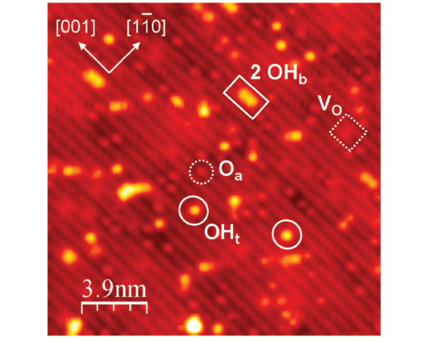
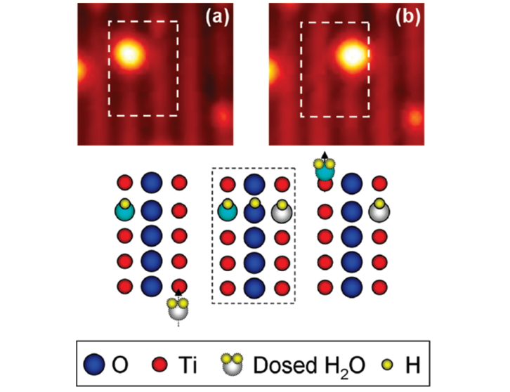
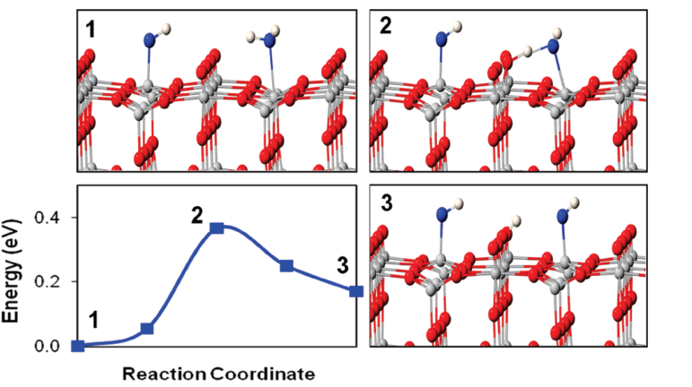
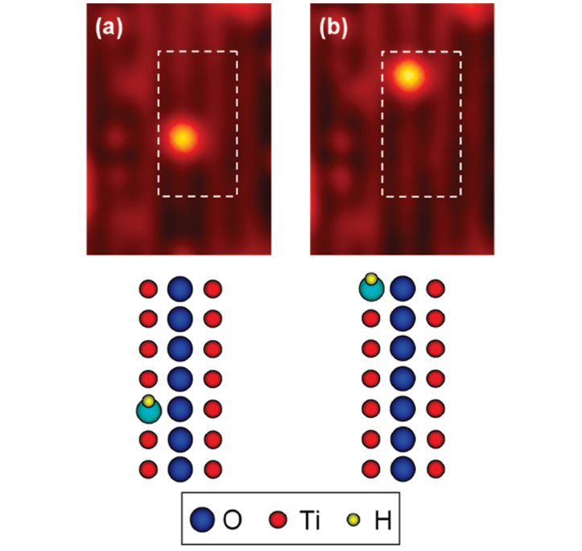
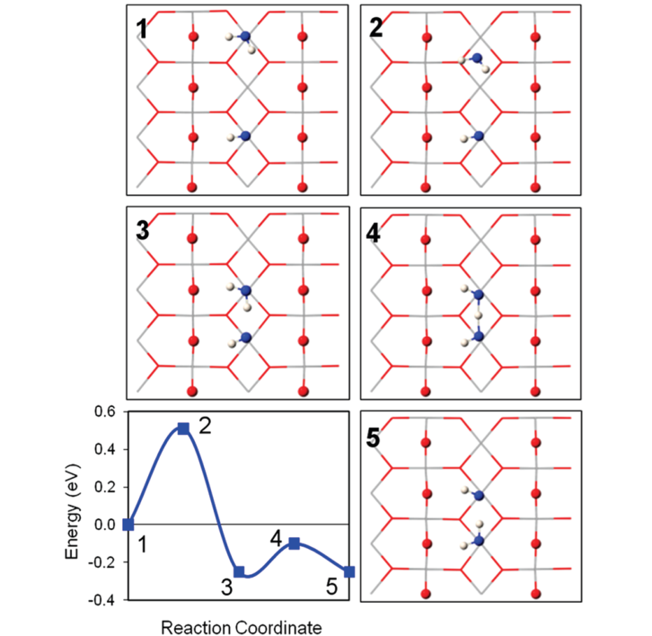
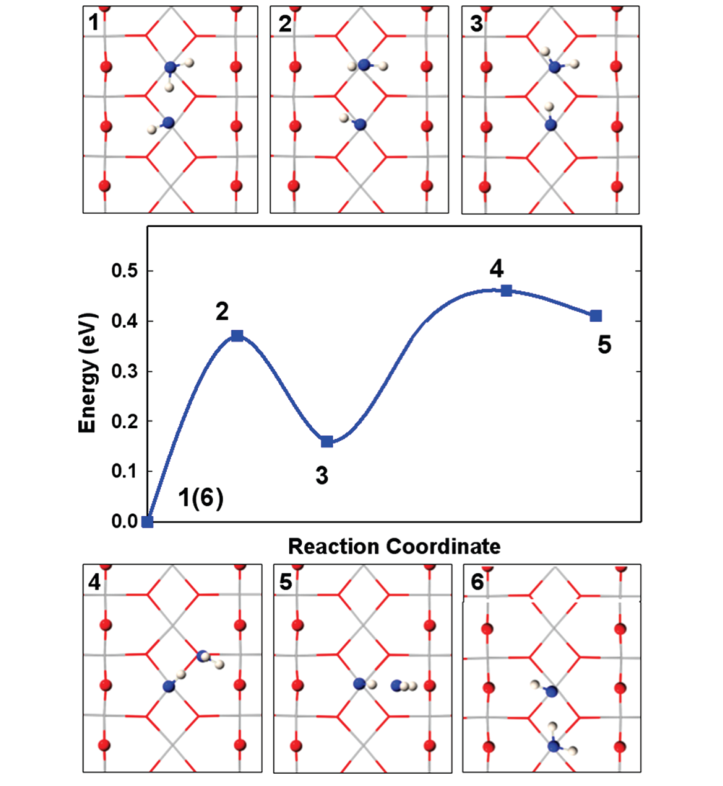

# Water Interactions with Terminal Hydroxyls on TiO2(110)

**Zotero key:** PVGN46VV
**Attachment key:** 6MZ32582
**Journal:** The Journal of Physical Chemistry C (J. Phys. Chem. C)
**DOI:** 10.1021/jp1036876
**Publication date:** 2010-10-14
**Source PDF:** paper.pdf

## Why This Paper / 为什么选这篇

**English:** This paper is a compact mechanistic bridge between the familiar water-TiO2(110) model surface and practical interfacial proton-transfer chemistry. It resolves two experimentally visible OHt motions with atomistic DFT pathways, making it unusually useful for learning how STM observations, local hydrogen-bond topology, and energy barriers constrain one another.

**中文:** 这篇文章把经典的水-TiO2(110) 模型表面与界面质子转移机制直接连起来。它用 STM 看见两类 OHt 表观迁移，再用原子尺度 DFT 路径解释其差异，因此特别适合学习如何把表面表征、局域氢键构型和反应势垒放在同一条证据链里判断。

## Terminology / 术语表

| English | 中文 | Note |
| --- | --- | --- |
| terminal hydroxyl (OHt) | 端位羟基 (OHt) | 吸附在 TiO2(110) 表面 Ti 位上的羟基。 |
| bridging hydroxyl (OHb) | 桥位羟基 (OHb) | 位于桥氧行的羟基，常由水在氧空位解离形成。 |
| oxygen adatom (Oa) | 氧吸附原子 (Oa) | 由 O2 解离生成并吸附在 Ti 行上的氧原子。 |
| oxygen vacancy (VO) | 氧空位 (VO) | TiO2(110) 表面缺失桥氧形成的还原缺陷位。 |
| pseudodissociation | 伪解离 | 水分子在分子态与解离态之间快速切换的动态平衡。 |
| scanning tunneling microscopy (STM) | 扫描隧道显微镜 (STM) | 通过隧穿电流追踪表面局域结构和动态过程。 |
| density functional theory (DFT) | 密度泛函理论 (DFT) | 本文用来计算质子转移和水跃迁能垒的电子结构方法。 |
| nudged elastic band (NEB) | 弹性带方法 (NEB) | 用于求取反应最小能量路径和活化势垒。 |

## Reading Guide / 读前导读

**English:** Read the paper in four passes. First, identify the three surface species in Fig. 1. Second, follow the across-row pathway in Figs. 2-3 and distinguish oxygen scrambling from literal OHt diffusion. Third, compare the along-row observations in Fig. 4 with the pair-diffusion sequence in Figs. 5-6. Finally, ask which steps are measured directly and which are inferred from DFT barriers.

**中文:** 建议分四步读。先借图 1 认清 VO、OHb、Oa 和 OHt；再沿图 2-3 追踪跨行路径，区分“氧交换造成的表观移动”和 OHt 真正扩散；随后把图 4 的沿行长跳跃与图 5-6 的水-羟基对扩散机制对照；最后检查哪些证据来自 STM 直接观察，哪些结论依赖 DFT 势垒推断。

## Page Index / 页码索引

- p.1: Abstract, Introduction, Experimental Section
- p.2: Computational Details, starting surface and cross-row pathway
- p.3: Across-row DFT pathway and along-row STM motion
- p.4: Along-row pair diffusion and water rollover mechanism
- p.5: Defect check, Summary, Acknowledgment, Supporting Information

## Abstract / 摘要

**Source:** p.1 S001

**Original:** A combination of scanning tunneling microscopy and density functional theory has been used to investigate the interactions between water molecules and terminal hydroxyls (OHt’s) adsorbed on the TiO2(110) surface at 300 K. We show that OHt’s have a significant effect on the water reactivity. Two distinctive reaction pathways are unraveled depending on the whether H2O and OHt are on the same or adjacent Ti rows. The underlying reaction mechanisms involve proton transfer from H2O to OHt leading to the formation of new H2O molecules, accompanied by O scrambling and along- or across-row apparent motion of OHt’s.

**中文:** 作者结合扫描隧道显微镜（STM）和密度泛函理论（DFT），研究了 300 K 下吸附在 TiO2(110) 表面的水分子与端位羟基（OHt）的相互作用。OHt 会显著改变水的反应性；当 H2O 与 OHt 位于同一条或相邻 Ti 行时，会出现两条不同反应路径。其共同核心是 H2O 向 OHt 的质子转移，生成新的 H2O，同时伴随氧原子交换，并使 OHt 沿行或跨行产生表观移动。

## 1. Introduction / 引言

**Source:** p.1 S002

**Original:** Water over the rutile TiO2(110) surface is one of the most studied model system for the fundamental studies of metal oxide surface reactivity and has attracted much attention.1-6 Further- more, it plays an important role in various photocatalytic applications of titanium dioxide, including oxidation of organic pollutants and hydrogen production via water splitting.7-9

**中文:** 金红石 TiO2(110)-水界面是研究金属氧化物表面反应性的经典模型，也与 TiO2 光催化中的有机污染物氧化和水分解制氢直接相关。

**Source:** p.1 S003

**Original:** Studies of hydroxylation of the TiO2(110) surface, reduced by annealing in ultrahigh vacuum (UHV), show that water pref- erentially dissociates at surface oxygen vacancy (VO) sites, generating bridging hydroxyl groups (OHb’s).10-12 Recent experimental evidence also reveals that H2O molecules at regular Ti sites are in a “pseudo-dissociated” state, rapidly switching between dissociated and molecular geometries that are in dynamical equilibrium.13-15 Water surface chemistry on TiO2(110) can be significantly affected by the coadsorbates. For example, H2O readily dissociates near oxygen adatoms (Oa’s),13,16 that form upon O2 oxidation of reduced TiO2(110).16-21 In addition, while water is very mobile on the TiO2(110) around 300 K,22 it can also induce motion of other coadsorbed species, e.g., the Oa’s and OHb’s.13,22 However, in general the interactions of water with coadsorbates have received much less attention so far. One of the most important coadsorbates is certainly oxygen, which is a common environmental reactant and also plays an important role in many photocatalytical processes.2,7,8 Reactions between O2 and H2O on catalytically active surfaces often involve intricate mechanisms with a number of possible surface- bound reactive intermediates.16,23-26 In our previous scanning tunneling microscopy (STM) study, we directly imaged for the first time Ti-bonded terminal hydroxyl (OHt) species formed upon oxygen interaction with a partially hydroxylated TiO2(110) surface at 300 K.27 In a separate study, we have demonstrated that the OHt’s can also form as a result of H2O interaction with Oa’s.13 We have also reported previously that in the case of O2 interaction with a fully hydroxylated TiO2(110), single OHt’s species have also been tentatively detected at the surface after large oxygen expositions.26 In addition, (OHt-H2O) pair dif- fusion was recently imaged with STM at low temperatures (170-200 K).28 Yet, the role of OHt’s in the reactivity of TiO2(110) is largely unknown.

**中文:** 超高真空退火还原后的 TiO2(110) 上，水优先在氧空位（VO）解离，形成桥位羟基（OHb）。常规 Ti 位上的水则处于分子构型与解离构型之间快速切换的“伪解离”动态平衡。共吸附物会显著改写这套表面水化学：水既能在氧吸附原子（Oa）附近解离，也可诱导 Oa 和 OHb 移动。作者指出，相比之下，水与共吸附物之间的相互作用仍被研究得不足。

**Source:** p.1 S004

**Original:** In this studyIn this study, we investigate the interactions of water and terminal hydroxyls on TiO2(110) surfaces at 300 K using high- resolution STM and density functional theory (DFT) calcula- tions. We find that H2O readily reacts with OHt’s following one of two distinctive reaction pathways that result in an apparent motion of OHt’s. Our DFT calculations support the experimental results and reveal underlying mechanisms of the observed processes.

**中文:** 氧是该表面最重要的共吸附物之一，既是环境反应物，也参与多类光催化过程。作者此前已经用 STM 直接观察到：部分羟基化 TiO2(110) 与氧作用后会形成 Ti 键合的单个 OHt；水与 Oa 相互作用也能形成 OHt，而低温 STM 已观察到 (OHt-H2O) 对的扩散。本文因此在 300 K 下把高分辨 STM 与 DFT 结合，证明水会沿两条路径与 OHt 反应并产生 OHt 的表观迁移，同时由计算给出其微观机制。

## 2. Experimental Section / 实验部分

**Source:** p.1 S005

**Original:** Experiments in this study were performed in two UHV-STM systems that have similar setups,18,29 thus only one is described in a detail here. This system (base pressure 3 × 10-11 Torr) is equipped with a variable-temperature STM (Omicron), a semi- spherical electron energy analyzer (Omicron), a mass spectrom- eter (Ametek), and electron and ion guns (VG and SPECS, respectively). The single-crystal rutile TiO2(110)-(1 × 1) surface (Princeton Scientific) was prepared by multiple (∼few tens) cycles of Ar ion sputtering (2 keV) and UHV annealing (800-900 K), resulted in the initial VO coverage of ∼0.09 ML. At the beginning of each experiment, which was carried out at 300K, the sample was flash-annealed to 600 K. In order to form the OHt’s species, both Oa’s and OHb’s should be present on the surface. Hence, we exposed a reduced TiO2(110) surface to O2 dosing through a dedicated doser, and H2O either through another doser or by adsorption from UHV background (in both cases, the obtained results were similar). Coverages of surface species were determined by direct counting on the STM images and expressed in monolayer units (1 ML ) 5.2 × 1014 atoms/ cm2). We have analyzed the same surface area before and after adsorption, and this allowed us to monitor changes caused by the adsorption of individual molecules. STM tips were home- made from electrochemically etched W wire and cleaned in situ by the annealing and ion sputtering.30 Presented STM (empty state) images were collected in a constant-current (∼0.1 nA) mode at positive sample bias voltage of 1.5-1.8 V. The resulting images were processed using WSxM software.31

**中文:** 实验在两套相似的超高真空 STM 系统中进行。金红石 TiO2(110)-(1 x 1) 单晶经 Ar 离子溅射和退火制备，初始氧空位覆盖度约为 0.09 ML；每次 300 K 实验前都快速退火至 600 K。为形成 OHt，表面需要同时存在 Oa 与 OHb，因此将还原表面暴露于 O2，并通过定量进水或背景水吸附引入 H2O。研究者通过同一区域吸附前后的 STM 图像逐一计数表面物种，以追踪单分子吸附引起的变化；空态 STM 图像在 1.5-1.8 V 正偏压下采集，并用 WSxM 处理。

## 3. Computational Details / 计算细节

**Source:** p.2 S006

**Original:** We performed DFT calculations using a slab model with three-dimensional periodic boundary conditions to model several reactions of interest over the TiO2 (110) surface. A (4 × 2) supercell (13.12 Å by 11.96 Å), being four trilayers (or 12 atomic layers) thick, was used to describe the surface. We tested for vacuum space convergence by using vacuum spacings of 13 Å and 17 Å between slabs. The two vacuum spacings gave energies that agreed within 0.4 meV, indicating that the vacuum distances were sufficiently converged. Reciprocal space was treated by a single k-point, Γ, as our code currently only supports this k-point. We therefore ensured that the reciprocal space sampling density was converged by running calculations using larger supercells (or equivalently finer reciprocal space sampling density). We found energies for H-transfer processes using a (6 × 3) slab to agree within 2 meV of results using a (4 × 2) slab. All calculations were performed using the Perdew- Burke-Ernzerhof (PBE) exchange correlation functional.32

**中文:** DFT 使用三维周期性 slab 模型：4 x 2 超胞、四个三层（12 原子层）厚度，并检查了 13 与 17 A 真空层的收敛性。由于代码限制只用 Gamma 点，作者通过更大超胞验证采样密度；对 H 转移过程，6 x 3 与 4 x 2 slab 的能量差小于 2 meV。所有计算采用 PBE 交换-相关泛函。

**Source:** p.2 S007

**Original:** Generalized gradient approximation (GGA) functionals have been shown to accurately model H2O-TiO2 surface chemistry in many instances,13,19,33 despite their inability to correctly describe the band gap. Hybrid functional calculations are rather time-consuming and there is still no agreement as to the best approach for modeling TiO2 with these functional, so we did not pursue using hybrid functionals. Core electrons were modeled by Goedecker-Teter-Hutter type pseudopoten- tials.34,35 Valence electrons were modeled by a dual basis set: plane waves to represent the electron density and Gaussian functions to represent the wave functions. This Gaussian and plane wave (GPW) method is implemented in the CP2K code.36-38 We utilized double- Gaussian orbitals and plane waves up to a cutoff of 300 Ry. Optimized geometries were converged to below 0.05 eV/Å. Activation barriers were calculated using the nudged elastic band (NEB) method with typically 7-8 images for each elementary process.39 We did not perform vibrational analysis to fully confirm the transition states, since the minimal energy pathways were not very sharp, making exact transition state identification difficult. In such cases, identifying the exact transition state is computationally difficult. The NEB calculations however, as discussed below, indicate that the processes proceed readily at room temperature due to low barriers. A few select transition barriers were calculated using constrained optimization. We assessed the accuracy of our computational methodology by comparing with results available in the literature. We calculated the lone H2O adsorption energy over a stoichiometric surface to be -0.90 eV, similar to the -0.76 eV value calculated by Harris and Quong40 and the -0.92 eV value calculated by Perron et al.33 Our calculated OH2O-Ti bond length was calculated to be 2.23 Å, very similar to the calculated distance of 2.25 Å reported in the literature.33 These comparisons illustrate that our method generally agrees within 0.1 eV with available data (see also the computational results for H2O adsorption over a reduced surface in the Supporting Informa- tion).

**中文:** 尽管 GGA 不能正确给出 TiO2 带隙，它对 H2O-TiO2 表面化学在许多情形下仍足够准确；作者未使用更昂贵且尚无统一最佳方案的杂化泛函。计算采用 GTH 赝势、Gaussian and Plane Wave（GPW）表示、300 Ry 截断，并将结构优化至小于 0.05 eV/A。NEB 通常用 7-8 个图像计算势垒；因势能路径较平，作者不以振动分析强行指定精确过渡态。对照文献中单个 H2O 吸附能和 O(H2O)-Ti 键长的结果表明，该方法的典型精度约为 0.1 eV。

## 4. Results and Discussion / 结果与讨论

**Source:** p.2 S008

**Original:** Figure 1 shows a typical STM image of the starting surface prepared by sequential exposure to H2O and O2 at 300 K to create OHt species as discussed below and published previ- ously.22,29 The TiO2(110) surface is composed of alternative rows of bridging oxygen (Ob) atoms and terminal Ti atoms oriented along the [001] direction. The STM image is dominated by electronic contrast, making the Ob rows appear dark and Ti rows bright.2 Beyond the periodic surface structure, the unexposed TiO2(110) also contains VO defects (Figure 1, marked by dotted square). Following the H2O and O2 exposure, additional small separated surface species are also present and marked in Figure 1. The brightest features on the Ob rows are OHb’s (solid rectangular), which result from H2O dissociation at VO’s via following reaction, H2O + VO + Ob f 2 OHb.22,29 The small, bright features residing on the Ti rows (dotted circles) are Oa’s formed through O2 dissociation either at VO’s (O2 + VO f Ob + Oa),17-19 or at regular Ti sites (O2 f Oa + Oa).20,21 Finally, the largest and brightest features located on Ti rows (marked by solid circles) are single OHt species, which have been observed and identified in our recent STM work.27 We have shown that a single OHt can be formed as a result of hydrogen diffusion41 and proton transfer from OHb to Oa (OHb + Oa f Ob + OHt).27 The pairs of OHt’s can also be generated through H2O interaction with Oa (H2O + Oa f 2 OHt), but these paired OHt’s are short-lived, because of the facile recombination process at 300 K leading to water reformation.13 In contrast, single OHt species are stable and have a very low mobility at 300 K.27 However, upon subsequent exposure of this surface to H2O, we have observed a dramatic increase in the mobility of OHt’s, as further discussed below.

**中文:** 图 1 给出了用 H2O 和 O2 顺序处理后、含 OHt 的起始表面。TiO2(110) 由沿 [001] 方向的桥氧（Ob）行与端位 Ti 行交替组成；STM 中 Ob 行较暗、Ti 行较亮。图中还标出氧空位、由水在氧空位解离得到的 OHb、由 O2 解离形成的 Oa，以及最亮的单个 OHt。单个 OHt 在 300 K 本来稳定且迁移率低，但继续引入水后其迁移性显著增大。

### Fig. 1. Partially hydroxylated TiO2(110) STM surface

**Placed near:** p.2 S008
**Source:** p.2 C001

**Original caption:** Figure 1. Empty-state STM image of a partially hydroxylated TiO2(110) surface after exposure to O2 at 300 K. The initial VO coverage on bare TiO2(110) was 0.09 ML.

**中文图注:** 图 1. 部分羟基化 TiO2(110) 表面的空态 STM 图像。

**Reading note:** 识别 VO、OHb、Oa 和 OHt 的 STM 对比，是后续迁移实验的物种判读基础。

**Source:** p.2 S009

**Original:** 4.1. Motion4.1. Motion of OHt Species across Bridging O Rows. To investigate the surface reactions between OHt’s and H2O, we have followed a particular area containing OHt species before and after H2O dose, as shown in Figure 2. From the comparison of marked regions one can see that the OHt species has shifted to the adjacent Ti row on the right. The observation can be explained by considering the proton transfer from H2O across the Ob row to OHt. This mechanism implies that the process is mediated by water pseudodissociation (H2O T OHb + OHt).13,14,22 It has been shown recently that at 300 K H2O on TiO2(110) is indeed in a dynamic equilibrium between the molecular and dissociated states.13,14,22 The separate reaction steps are illustrated schematically in the ball models in Figure 2, whereas the model in the dotted box schematically shows an assumed initial event of H2O pseudodissociation and formation of short-lived inter- mediate state (OHt + OHb + OHt). If the newly formed OHt species could diffuse away, the H2O reformation reaction would not occur. However OHb and OHt diffusion at 300 K is very slow and does not provide for an efficient OHt separation.27

**中文:** 为考察水与 OHt 的跨行反应，作者比较了进水前后的同一表面区域：OHt 向右侧相邻 Ti 行移动。合理机制是水经桥氧行向 OHt 连续转移质子，即 H2O 先伪解离为 OHb + OHt；若新生 OHt 不能及时扩散，反向质子转移会重建水。OHb/OHt 自发扩散在 300 K 很慢，不足以有效拉开二者。

### Fig. 2. Across-row apparent OHt motion

**Placed near:** p.2 S009
**Source:** p.3 C002

**Original caption:** Figure 2. Two consecutive STM images (sampling rate 0.5 frame/ min) of the same (3 × 3) nm2 area after H2O exposure showing the apparent OHt motion across an Ob row, as a result of the interaction with H2O at 300 K. Corresponding ball-models of the rectangular region marked in (a) and (b) illustrate the reaction path.

**中文图注:** 图 2. H2O 暴露后同一区域连续 STM 图像，显示 OHt 跨桥氧行的表观移动；方框区域下方的球棍模型给出反应路径。

**Reading note:** 将 STM 的位移与球棍路径对照，可看出水诱导的质子转移和氧交换如何制造跨行“迁移”。

**Source:** p.3 S010

**Original:** Hence, the second proton transfer from the newly created OHb to OHt will lead to H2O reformation (OHb + OHt f Ob + H2O), as observed in our prior study.27 This proton transfer from OHb can result either in the formation of a new water molecule, leaving behind an OHt that originated from the initial H2O (schematically shown by ball models in Figure 2) or in the reformation of the original H2O (not shown). The former case results in oxygen scrambling and OHt across-row “motion”, while the latter case leaves the OHt in its original position. Finally, the reaction is completed by H2O diffusion, which at 300 K is too fast to be followed with STM.22 As a side comment, note that the oxygen scrambling also facilitates an apparent transfer of an H2O molecule from one Ti row to another. Also note, that in many aspects the interaction between OHt and H2O on adjacent rows is similar to the previously observed H2O interaction with Oa that resides on an adjacent row.13

**中文:** 第二次质子从新生成的 OHb 转移到 OHt 后会再生成 H2O。它既可能形成一枚带有初始水氧的新水，也可能复原原来的水；前一种情况造成氧原子交换，从而让 OHt 看起来跨行移动，后一种则使 OHt 停在原位。最后水分子快速扩散离开。作者也检查了探针效应：改变偏压和隧穿电流，或反复扫描同一区域，都没有改变 OHt 动力学。

**Source:** p.3 S011

**Original:** Particular care has been taken to evaluate possible tip-induced effects on OHt mobility. We have compared scanning at different bias voltages and tunneling currents, and also compared two areas of the same surface, whereas one has been scanned once and the other about 10-20 times more. No changes in the OHt dynamics have been observed in either case, indicating that tip effects were negligible under our experimental conditions. The interpretation of the STM data presented in Figure 2 is supported by DFT calculations. Figure 3 shows the energy profile and selected intermediate states for H2O dissociation in the presence of OHt species on the adjacent Ti row. The calculations indicate that across-row proton transfers from H2O to Ob and then to OHt occur readily at 300 K, in agreement with the STM results. Specifically, the activation barrier for the initial proton transfer from H2O to Ob is 0.37 eV in the presence of OHt, similar to 0.39 eV, calculated for H2O dissociation on a stoichiometric surface (not shown). The next proton transfer process from OHb to OHt to reform H2O can proceed in either direction due to the symmetry of this configuration with an activation barrier of 0.20 eV. Since the calculated barriers for both proton transfers are low, these processes are very facile at 300 K. Thus, the H exchange between these two states, OHt + H2O T OHt + OHb + OHt, can occur many times, until water diffuses to the next Ti site and terminates the reactions. Note, that the (H2O + OHt) configuration is 0.17 eV more stable than (OHt + OHb + OHt) configuration. Assuming Arrhenius behavior, under equilibrium conditions such an energy difference would on average result in the relative (OHt + OHb + OHt) population being only ∼0.2%. Also note that observation of the across-row OHt mobility may be viewed as further evidence of the spontaneous water dissociation on Ti sites.

**中文:** DFT 支持该解释：在相邻 Ti 行存在 OHt 时，H2O 先向 Ob 转移质子的势垒为 0.37 eV，随后 OHb 向 OHt 的对称质子转移势垒为 0.20 eV，两者在 300 K 都很容易发生。OHt + H2O 与 OHt + OHb + OHt 两个状态可以多次交换，直到水扩散到下一 Ti 位而终止反应；前者热力学上低 0.17 eV，因此中间态平均占比约 0.2%。跨行移动本身也进一步佐证了 Ti 位水的自发解离。

### Fig. 3. Neighbor-row proton-transfer energy profile

**Placed near:** p.3 S011
**Source:** p.3 C003

**Original caption:** Figure 3. Reaction energy profile and selected intermediate states for H transfer between a H2O molecule and OHt on the neighboring Ti row (OHt + H2O T OHt + OHb + OHt). Ti atoms are shown in gray, O in red and blue, and H in light gray.

**中文图注:** 图 3. H2O 与相邻 Ti 行 OHt 之间 H 转移的反应能量剖面及选定中间构型。Ti 为灰色，O 为红色和蓝色，H 为浅灰色。

**Reading note:** 读图时重点看两个低势垒步骤：H2O -> Ob（0.37 eV）和 OHb -> OHt（0.20 eV）。

**Source:** p.3 S012

**Original:** 4.2. Motion4.2. Motion of OHt Species along Ti Rows. We have also observed high OHt mobility along the same Ti row in the presence of H2O. Remarkably, rather long OHt hops of up to seven lattice constants have been detected in this case. An example of the along-row OHt diffusion is illustrated in two consecutive STM images shown in Figure 4. From a comparison of Figure 4, panels a and b, the OHt is found to hop four lattice constants (in this particular case) from its original position. With the limited available data, no conclusive travel distance distribu- tion could be attained, while practically no one-unit-cell hops have been observed. To identify the mechanism of the long-range motion of OHt species along Ti rows, we have resorted to DFT calculations. Figure 5 shows the energy profile and selected intermediates

**中文:** 当 H2O 与 OHt 位于同一 Ti 行时，OHt 迁移同样很快，且可一次跳跃长达 7 个晶格常数；图 4 的实例显示其跨越了 4 个晶格常数。数据量还不足以给出完整的跃迁距离分布，但几乎看不到只跳一个晶胞的事件。作者于是用 DFT 寻找这种长程沿行迁移的机制。

### Fig. 4. Along-row apparent OHt motion

**Placed near:** p.3 S012
**Source:** p.3 C004

**Original caption:** Figure 4.Figure 4. Two consecutive STM images of the same (3.4 × 4.9) nm2 area showing OHt motion (by four lattice constants) along the Ti row at 300 K, as a result of its reaction with H2O.

**中文图注:** 图 4. 同一 3.4 x 4.9 nm2 区域的连续 STM 图像，显示 OHt 因与 H2O 反应而沿 Ti 行移动四个晶格常数。

**Reading note:** 这一图给出长程沿行迁移的实验现象，后续图 5 和图 6 解释其水介导路径。

**Source:** p.4 S013

**Original:** along the reaction path involving H2O diffusion toward OHt (snapshots 1-3), followed by H2O dissociation and proton transfer to OHt (3-5). The calculated energy barriers are low for both diffusion and dissociation (0.51 and 0.15 eV, respec- tively), indicating that both processes are facile at 300 K. The proton transfer also results in the formation of a new H2O molecule and an apparent OHt shift one lattice constant up. However, such process can not facilitate further OHt motion along the same direction. In contrast, since reverse proton transfer (5 f 3) also has a small barrier (0.15 eV) fast exchange between these two states, H2O + OHt T OHt + H2O, is expected. The calculations suggest that H2O becomes effectively trapped near the OHt, with the activation energy barrier for water to diffuse away from the OHt being ∼0.76 eV. The later also correlates with the adsorption energy gain of 0.25 eV upon bringing H2O and OHt together, which is close to a typical H bond strength. Of course, the net migration of OHt species across several sites may be accomplished by consecutive interactions with several H2O molecules, following the mechanism described above, or by interaction with water dimers.42 However, this would require rather a high concentration of H2O, and so it is unlikely to occur in the current studies. Otherwise, high H2O concentration would also result in multiple across-row OHt hops that have not been observed.

**中文:** 图 5 所示路径先是水向 OHt 扩散（构型 1-3），随后水解离并向 OHt 转移质子（3-5）。扩散和解离势垒分别为 0.51 和 0.15 eV，在 300 K 均很容易发生。该质子转移生成新水并使 OHt 表观前移一个晶格，但不能让它沿同一方向持续推进；因为反向 5 -> 3 的势垒也仅 0.15 eV，H2O 与 OHt 会快速交换。水会被 OHt 附近有效俘获，离开的势垒约 0.76 eV，对应二者靠近后约 0.25 eV 的吸附能增益。

### Fig. 5. Water diffusion, dissociation, and proton transfer

**Placed near:** p.4 S013
**Source:** p.4 C005

**Original caption:** Figure 5. Reaction energy profile and selected intermediate states for water diffusion along a Ti row, H2O dissociation, and subsequent proton transfer to OHt.

**中文图注:** 图 5. 水沿 Ti 行扩散、H2O 解离以及随后向 OHt 转移质子的反应能量剖面与中间构型。

**Reading note:** 该图解释单步 OHt 前移和水被 OHt 俘获的动力学原因。

**Source:** p.4 S014

**Original:** On the basisOn the basis of the experimental evidence and theoretical calculations described above, we speculate that the observed long-range OHt motion is a result of fast diffusion of H2O + OHt pairs. As already discussed (see Figure 5), the H2O + OHt T OHt + H2O reaction allows only for a single site motion of OHt’s along one direction while multiple site hops are observed in Figure 4. To accomplish multiple site hops, H2O molecule has to diffuse over the OHt, effectively reforming the starting configuration shown in snapshot 3 of Figure 5.

**中文:** 连续水分子或水二聚体原则上可重复上述过程并推动 OHt 跨多个位点，但这需要较高 H2O 浓度；若如此，也应观察到更多跨行跃迁，实验中并没有。综合实验和计算，作者推断长程 OHt 迁移来自 H2O + OHt 对的快速扩散。由于该交换本身只让 OHt 朝一个方向移动一个位点，要实现多位点跳跃，水必须越过 OHt，回到图 5 的起始型构型。图 6 给出了这条低能路径。

**Source:** p.4 S015

**Original:** Using DFTUsing DFT we have determined the following low-energy reaction path for the water hoping over the OHt, as illustrated in Figure 6. In the starting configuration (snapshot 1), H2O and OHt reside on neighboring Ti sites, with a hydrogen bond between them formed through one of the H2O protons. Next, both species rotate to the configuration, where a new H-bond is formed, with the proton provided by OHt (snapshot 3). The process is slightly energetically uphill (0.16 eV) and has a barrier of 0.37 eV, through the transition state shown in the snapshot 2. The process of concerted rotation is important because it sets out further H2O hopping. Subsequently, H2O hops over the adjacent in-plane O atom (snapshot 4), and then to a new configuration (snapshot 5), where an additional H-bond between H2O and nearest Ob likely stabilizes this intermediate state. Importantly, during this motion, the H-bond between the OHt and H2O is maintained and assists H2O hop. The transition state region is rather flat which makes it hard to unequivocally define the exact configuration of transition state. The calculated activation barrier for this state is ∼0.3 eV. After passing this symmetric midpoint (snapshot 5), the H2O can continue moving in a same way until it reaches the final configuration (snapshot 6) with the H2O on the “other” side of the OHt. Such H2O rollover motion, where intramolecular H bond formation plays an important role, resembles the mechanism recently reported for water dimer diffusion along the Ti row.42 The authors have shown there that H2O dimer diffusion is enhanced when such rollover motion occurs, while here we demonstrate that OHt diffusion is also enhanced by similar rollover motion. The resulting activation energy barrier for H2O diffusion over the OHt, obtained from the energy profile in Figure 6, is 0.46 eV, demonstrating that this process occurs readily at 300 K. Note, that direct H2O hoping over the OHt is unfavorable, with the activation energy barrier of 0.89 eV (not shown). Also note, that besides the H2O hopping over the OHt as described above, the water diffusion from one Ti row to another over a similar, H-containing OHb species has also been observed.22

**中文:** 计算表明，起始时 H2O 与 OHt 位于相邻 Ti 位并由一个水质子形成氢键。二者先协同旋转，形成由 OHt 提供质子的新的氢键；这一步吸热 0.16 eV、势垒 0.37 eV。随后 H2O 跨过相邻平面氧到达另一构型，新的 H2O-Ob 氢键可能稳定该中间态，且运动中 H2O-OHt 氢键始终保持并帮助水跃迁。越过平坦的过渡区后，H2O 到达 OHt 的另一侧；该翻越的总势垒为 0.46 eV，在 300 K 可行。直接越过 OHt 的路径反而不利，势垒为 0.89 eV。

### Fig. 6. H2O rollover over OHt

**Placed near:** p.4 S015
**Source:** p.4 C006

**Original caption:** Figure 6.Figure 6. Reaction energy profile and selected intermediate states for H2O hopping over OHt.

**中文图注:** 图 6. H2O 越过 OHt 的反应能量剖面及选定中间构型。

**Reading note:** 这条 0.46 eV 的翻越路径使水回到 OHt 另一侧，从而允许多位点的长程 OHt 扩散。

**Source:** p.4 S016

**Original:** Repeated steps of proton transfer and H2O hopping over OHt, described in Figures 5 and 6, likely constitute the diffusion pathway for the observed long-range, water-mediated OHt mobility. Generally, this mechanism can also be considered as diffusion of the (OHt + H2O) pairs. Such (OHt + H2O) pair diffusion (there called OH_OH2) was recently imaged with STM at low temperatures (170-200 K)28 and, therefore, is expected to occur more readily at 300 K.

**中文:** 图 5 和图 6 所描述的反复质子转移与 H2O 越过 OHt 的步骤，很可能共同构成长程、水介导 OHt 迁移的扩散通道。更一般地说，它可以视为 (OHt + H2O) 对的扩散；同类对扩散此前已在 170-200 K 的低温 STM 中成像，因此在 300 K 更容易发生是合理的。

**Source:** p.5 S017

**Original:** We also considered the effect of the presence of O vacancies in our DFT calculations by removing one Ob per unit cell to create a surface vacancy ratio of 1/8. In our previous work we indicated that H transfer barriers between Oa and OHt were not affected by the presence of excess electrons.43 We calculated H transfer reaction energy barriers over reduced surface and found them to agree with ones over stoichiometric surface within 0.02 eV (H transfer between H2O and Ob) and 0.12 eV (H transfer between H2O and OHt), as shown in Figures S1 and S2 of the Supporting Information, respectively. For H2O hopping over OHt reaction pathway with VO nearby, the barrier drops only slightly (0.06 eV, Figure S3). (Note that this pathway is not very symmetrical due to the presence of the VO and is relatively flat, making an exact identification of the transition state rather difficult). However, while excess electrons can affect surface chemistry, in the current case H transfer reactions involving water and related species were not greatly affected, and our conclusions from the DFT calculations are the same regardless of whether stoichiometric or reduced surfaces were simulated.

**中文:** 作者还在 DFT 中通过每个超胞移除一个桥氧来加入 1/8 的氧空位比例。此前结果显示过量电子不显著影响 Oa 与 OHt 的 H 转移；本研究也发现还原表面与化学计量表面的势垒相差仅 0.02 eV（H2O 到 Ob）或 0.12 eV（H2O 到 OHt），而附近氧空位只使水越过 OHt 的势垒略降 0.06 eV。因此，本工作的机理结论不依赖于采用化学计量表面还是还原表面。

## 5. Summary / 总结

**Source:** p.5 S018

**Original:** We have performed a combined experimental and theoretical investigation of the reaction of molecular water with terminal hydroxyls on TiO2(110) at 300 K, and extracted molecular-level details about the underlying reaction mechanisms. By tracking the same surface area with high-resolution STM before and after water exposure, we have demonstrated that there are two distinctive reaction pathways involving multiple proton transfers. For water interaction with OHt on an adjacent Ti row, the proton can be transferred through bridging oxygen to OHt, which leads to the formation of a new water molecule and apparent across- row motion of OHt due to O scrambling. This process further manifests the existence of the equilibrium between molecular and dissociated states of water on TiO2 (110). If H2O interacts with OHt along the same Ti row, fast multistep OHt motion along the Ti row is observed. Our DFT results show that this process is caused by the fast diffusion of (OHt + H2O) pairs, whereby the underlying mechanism involves proton transfer and H2O hopping over OHt.

**中文:** 作者以 STM 和 DFT 联合解析了 300 K 下分子水与 TiO2(110) 端位羟基的反应。相邻 Ti 行的 H2O-OHt 相互作用经桥氧向 OHt 转移质子，生成新水并因氧交换造成 OHt 跨行表观移动；同一 Ti 行的相互作用则导致多步、快速的沿行 OHt 迁移。DFT 表明，后者本质是包含质子转移和水翻越 OHt 的 (OHt + H2O) 对快速扩散。

## Acknowledgment / 致谢

**Source:** p.5 S019

**Original:** Acknowledgment. We thank M. A. Henderson, G. A. Kimmel, and N. G. Petrik for stimulating discussions. This work was supported by the U.S. Department of Energy (DOE) Office of Basic Energy Sciences, Division of Chemical Sciences, and performed at EMSL, a national scientific user facility sponsored by the DOE’s Office of Biological and Environmental Research and located at PNNL. Computational resources were provided by the National Energy Research Scientific Computing Center and the EMSL.

**中文:** 作者感谢 M. A. Henderson、G. A. Kimmel 和 N. G. Petrik 的讨论，并说明该工作由美国能源部基础能源科学办公室支持，在 PNNL 的 EMSL 用户设施完成；计算资源由 NERSC 和 EMSL 提供。

## Supporting Information / 补充信息

**Source:** p.5 S020

**Original:** Supporting Information Available: Computational results for H2O adsorption, and energy profiles/selected intermediate states for reactions on reduced TiO2(110) surface. This informa- tion is available free of charge via the Internet at http:// pubs.acs.org.

**中文:** 补充信息包括 H2O 吸附的计算结果，以及还原 TiO2(110) 表面反应的能量剖面和中间构型，可从 ACS 网站免费获得。

## Related Reading / 相关必读

### Strongly recommended / 强推荐

1. Du, Y.; Deskins, N. A.; Zhang, Z.; Dohnalek, Z.; Dupuis, M.; Lyubinetsky, I. **Two Pathways for Water Interaction with Oxygen Adatoms on TiO2(110).** *Physical Review Letters* **2009**, *102*, 096102. DOI: 10.1103/PhysRevLett.102.096102.

**Why this one / 为什么推荐:** This is the direct mechanistic predecessor named repeatedly by the current paper. It establishes the Oa-H2O pseudodissociation and oxygen-scrambling baseline; read it first if the comparison between Oa and OHt pathways is unfamiliar. / 这篇是本文反复调用的直接前作：它建立了 Oa-H2O 伪解离和氧交换的基线。若你对 Oa 与 OHt 两条路径的比较不熟悉，先读它最有帮助。

No additional papers are force-listed today. / 今日不强行增加其他相关必读。

## Critical Reading Notes / 批判性阅读提示

**English:** The strongest evidence is the STM-before/after tracking plus low-barrier DFT paths that explain it. The important limitation is that the long-range along-row mechanism is inferred from limited event statistics and idealized slab calculations, not resolved frame by frame. The vacancy test is useful because it checks whether the central pathway depends on the chosen surface reduction state.

**中文:** 最强的证据链是同一区域 STM 前后追踪与低势垒 DFT 路径的互相吻合。需要保留的限制是：沿行长程迁移的微观序列来自有限事件统计和理想 slab 计算，并非逐帧直接分辨。氧空位对照的价值在于，它检验了核心路径是否依赖于所选表面还原状态。
